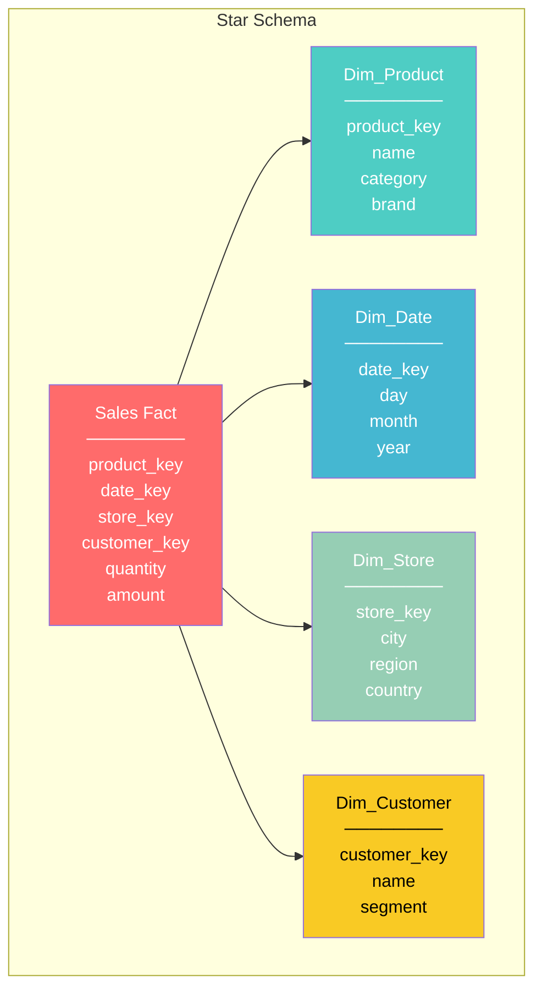
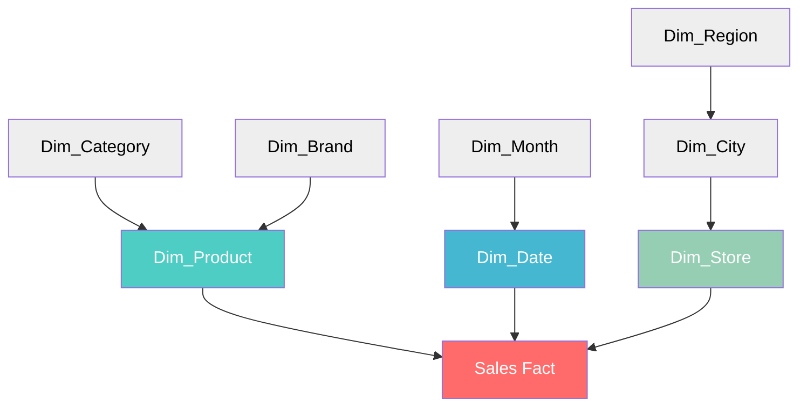
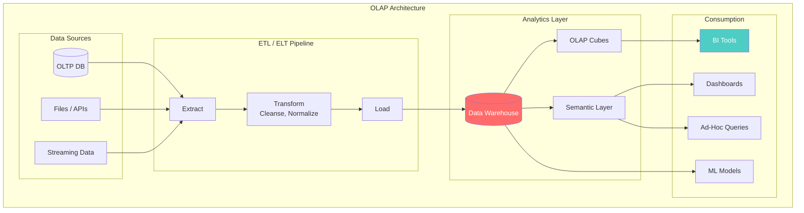
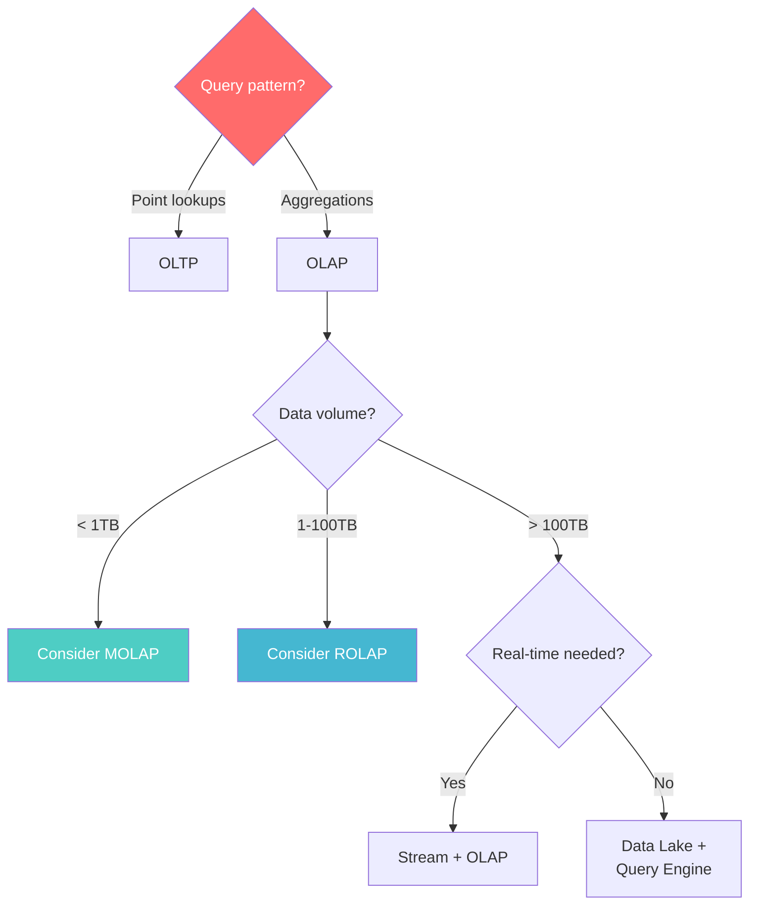

# OLAP Architecture

> **Taxonomy Reference**: §4.1 Data Architecture

## Overview

OLAP (Online Analytical Processing) is an architectural pattern optimized for complex analytical queries over large, historical datasets. It powers business intelligence (BI), reporting, and decision support systems — enabling multi-dimensional analysis of business metrics.

## Table of Contents

- [Core Concepts](#core-concepts)
- [Storage Architecture](#storage-architecture)
- [Schema Design](#schema-design)
- [OLAP Types](#olap-types)
- [Architecture Diagram](#architecture-diagram)
- [Query Patterns](#query-patterns)
- [OLAP vs OLTP](#olap-vs-oltp)
- [Decision Framework](#decision-framework)
- [Related Patterns](#related-patterns)

## Core Concepts

### Multi-Dimensional Analysis

OLAP organizes data into **dimensions** and **measures**:

```
      Product Dimension
          ↑
         /|\
        / | \
       /  |  \         Measure: Sales Amount
      /   |   \
     /    |    \
    ──────┼──────→ Time Dimension
          |
          ↓
    Geography Dimension
```

| Component | Description | Example |
|-----------|-------------|---------|
| **Dimension** | "By what?" — categorical axis | Product, Time, Region |
| **Measure** | "What?" — numeric value | Revenue, Units Sold, Margin |
| **Cube** | Multi-dimensional data structure | Sales Cube (Product × Time × Region) |
| **Hierarchy** | Drill-down levels within dimension | Year → Quarter → Month → Day |

### OLAP Operations

| Operation | Description | Analogy |
|-----------|-------------|---------|
| **Slice** | Filter one dimension to a value | "Sales for January only" |
| **Dice** | Filter multiple dimensions | "Electronics sales in EU for Q1" |
| **Drill-Down** | Increase detail level | Year → Quarter → Month |
| **Roll-Up** | Decrease detail (aggregate) | City → State → Country |
| **Pivot** | Rotate axes | Swap rows and columns |

## Storage Architecture

### Columnar Storage

Unlike OLTP's row-based storage, OLAP uses **column-oriented** storage:

```
 -- Columnar layout --
 product_ids:    [1, 2, 3, 4, 1, 2, ...]
 sale_amounts:   [50, 30, 80, 20, 60, 45, ...]
 timestamps:     [t1, t2, t3, t4, t5, t6, ...]

-- Query: SUM(sale_amount) WHERE product_id = 1 --
-- Only reads 2 columns (not all 30+) --
```

**Benefits of columnar storage:**
- **Compression**: Similar values compress better (dictionary encoding, run-length)
- **Vectorized execution**: SIMD operations on column batches
- **Projection pushdown**: Only read queried columns

## Schema Design

### Star Schema



| Characteristic | Star Schema |
|---------------|-------------|
| Dimension tables | Denormalized (wide) |
| Joins | Single join per dimension |
| Query performance | Fast (few joins) |
| Storage | Higher (redundancy) |
| ETL complexity | Lower |

### Snowflake Schema



| Dimension | Star | Snowflake |
|-----------|------|-----------|
| Normalization | Denormalized | Normalized (3NF) |
| Storage efficiency | Lower | Higher |
| Query complexity | Simpler | More joins |
| Maintenance | Harder (redundancy) | Easier |

### Slowly Changing Dimensions (SCD)

| Type | Strategy | Example |
|------|----------|---------|
| **Type 0** | Keep original | Fixed attributes |
| **Type 1** | Overwrite | Correcting errors |
| **Type 2** | Add new row | Track history (with effective dates) |
| **Type 3** | Add column | Track previous value only |
| **Type 4** | History table | Full audit trail |
| **Type 6** | Hybrid (1+2+3) | Current + history + previous |

## OLAP Types

| Type | Architecture | Pros | Cons |
|------|-------------|------|------|
| **MOLAP** | Pre-computed cubes in multidimensional DB | Fast queries; complex calculations pre-done | Data volume limits; cube explosion |
| **ROLAP** | Queries run against relational DB | Scales to large data; no cube limit | Slower; complex SQL generation |
| **HOLAP** | Hybrid: detail in RDBMS, aggregates in MOLAP | Balance of speed and scale | Complex architecture; sync overhead |

## Architecture Diagram



## Query Patterns

### Typical OLAP Queries

```sql
-- Aggregations with GROUP BY
SELECT
    p.category,
    d.year,
    SUM(f.amount) AS total_sales,
    COUNT(DISTINCT f.customer_key) AS unique_customers
FROM sales_fact f
JOIN dim_product p ON f.product_key = p.product_key
JOIN dim_date d ON f.date_key = d.date_key
WHERE d.year >= 2023
GROUP BY p.category, d.year
ORDER BY total_sales DESC;

-- Window functions for rankings
SELECT
    category,
    product_name,
    total_sales,
    RANK() OVER (PARTITION BY category ORDER BY total_sales DESC) AS rank
FROM product_sales_summary;
```

### Materialized Views

Pre-computed query results that trade storage for speed:

```sql
CREATE MATERIALIZED VIEW monthly_sales_summary AS
SELECT
    d.year, d.month,
    p.category,
    SUM(f.amount) AS revenue,
    SUM(f.quantity) AS units
FROM sales_fact f
JOIN dim_date d ON f.date_key = d.date_key
JOIN dim_product p ON f.product_key = p.product_key
GROUP BY d.year, d.month, p.category;
```

## OLAP vs OLTP

| Dimension | OLTP | OLAP |
|-----------|------|------|
| **Purpose** | Run operations | Analyze data |
| **Queries** | Point lookups, simple | Complex aggregations, joins |
| **Data freshness** | Real-time | Periodic (ETL batches) |
| **Schema design** | Normalized (3NF) | Denormalized (star/snowflake) |
| **Storage** | Row-oriented | Column-oriented |
| **Indexing** | Few, targeted | Many, covering |
| **Concurrency** | High (thousands) | Low (dozens to hundreds) |

> **Transactional Counterpart**: See [OLTP Architecture](01-oltp-architecture.md)

## Decision Framework



## Related Patterns

- [OLTP Architecture](01-oltp-architecture.md) — Transactional counterpart
- [Data Warehouse Architecture](../02-analytics-architecture/01-data-warehouse-architecture.md) — Enterprise DW patterns
- [Data Lake Architecture](../02-analytics-architecture/02-data-lake-architecture.md) — Schema-on-read approach
- [Lakehouse Architecture](../02-analytics-architecture/03-lakehouse-architecture.md) — Unified lake + warehouse

> **Azure Implementation**: See [Azure Synapse Analytics](../../../architecture-azure/data/), [Azure Analysis Services](../../../architecture-azure/data/), and [Microsoft Fabric](../../../architecture-azure/data/) for cloud OLAP services.
