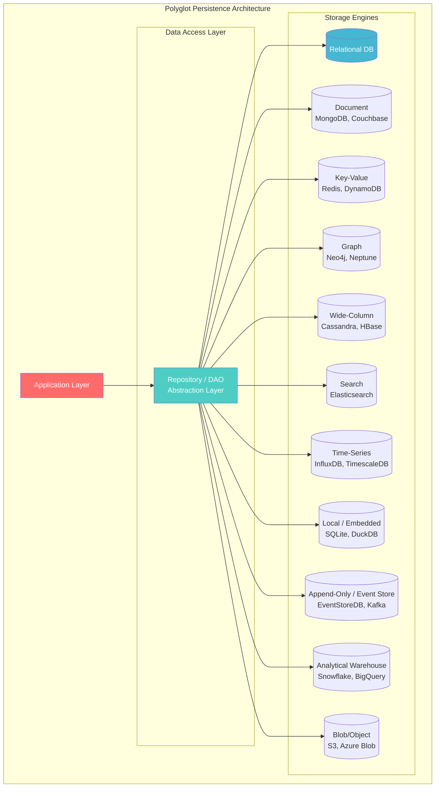
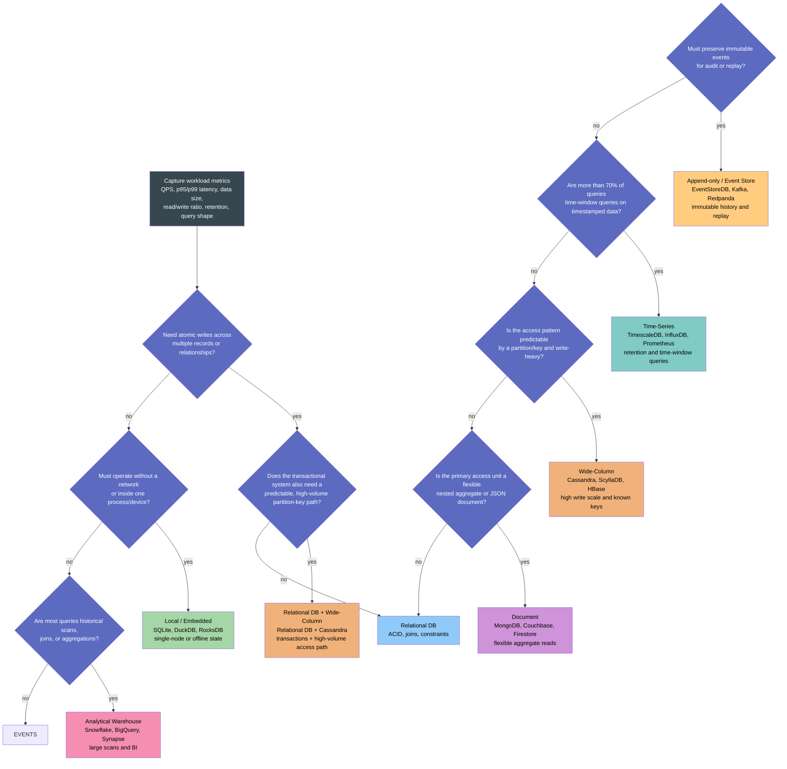
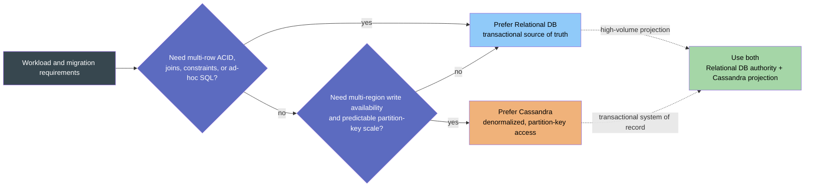
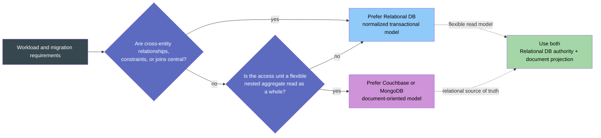
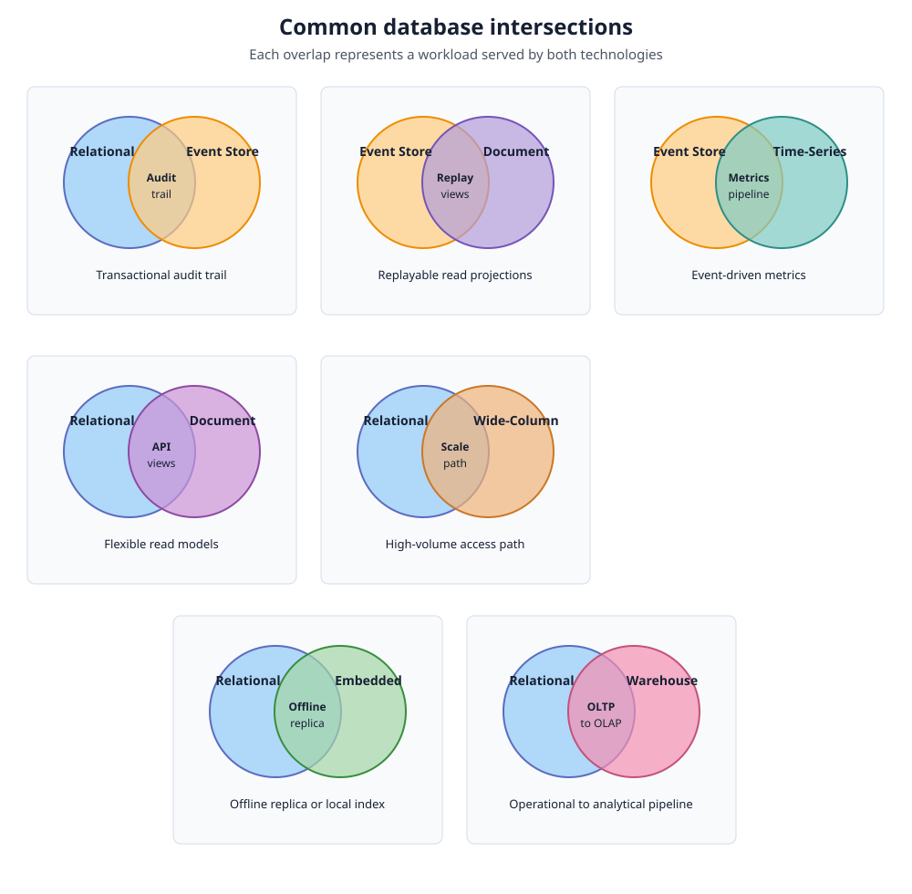
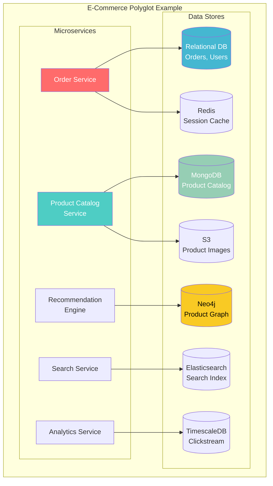
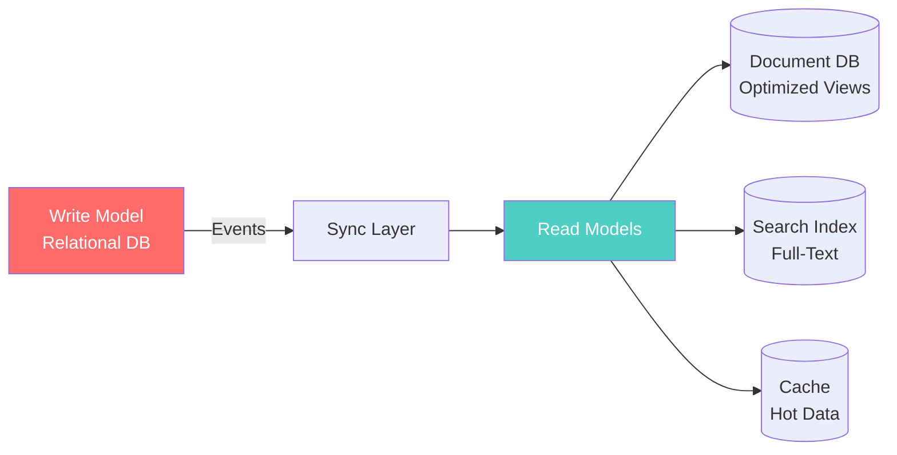
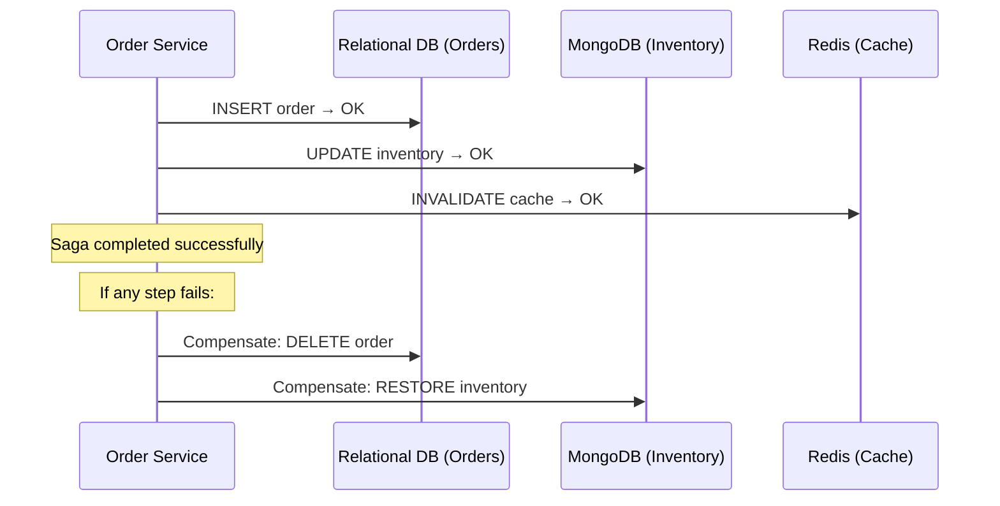

# Polyglot Persistence

> **Taxonomy Reference**: §4.1 Data Architecture

## Overview

Polyglot Persistence is the architectural principle of using **multiple data storage technologies** within a single system, choosing the best-fit database for each specific workload. Rather than forcing one database to serve all needs, polyglot persistence acknowledges that different data shapes require different storage paradigms.

## Table of Contents

- [Why Polyglot Persistence](#why-polyglot-persistence)
- [Storage Paradigms](#storage-paradigms)
- [Architecture Diagram](#architecture-diagram)
- [Decision Matrix](#decision-matrix)
- [Decision Flow with Measurable Choice Points](#decision-flow-with-measurable-choice-points)
- [Relational DB versus Wide-Column Databases](#relational-db-versus-wide-column-databases)
- [Relational DB versus Document Databases](#relational-db-versus-document-databases)
- [Implementation Patterns](#implementation-patterns)
- [Challenges & Mitigations](#challenges-mitigations)
- [Related Patterns](#related-patterns)

## Why Polyglot Persistence

### The One-Database Fallacy

```
Traditional Monoglot:                    Polyglot Approach:
┌─────────────────────┐                ┌─────────────────────┐
│                     │                │   Relational DB     │ ← Orders, Users
│   Single Database   │                │   Document DB       │ ← Product Catalog
│   (Relational)      │                │   Graph DB          │ ← Recommendations
│                     │                │   Search Engine     │ ← Full-Text Search
│  ❌ JSON as text    │                │   Time-Series DB    │ ← Metrics
│  ❌ Graph traversal │                │   Key-Value Store   │ ← Session Cache
│  ❌ Full-text poor  │                │   Blob Storage      │ ← Images, Files
│  ❌ Time-series slow│                └─────────────────────┘
└─────────────────────┘
```

**Martin Fowler's insight**: "Polyglot programming" extended to data — use the right tool for each job.

### When to Adopt Polyglot Persistence

| Signal | Indication |
|--------|------------|
| JSON documents stored as text blobs in RDBMS | Time for a document store |
| Complex joins traversing 5+ tables for relationships | Time for a graph DB |
| LIKE '%search%' queries without indexes | Time for a search engine |
| Time-series data in relational tables | Time for a time-series DB |
| Caching layer implemented ad-hoc | Time for a key-value store |

## Storage Paradigms



## Decision Matrix

### Choosing the Right Database

| Data Model | Use Case | Best-Fit DB | Why |
|------------|----------|-------------|-----|
| **Relational** | Transactions, structured data, strict schema | PostgreSQL, MySQL, SQL Server | ACID guarantees, joins, mature ecosystem |
| **Document** | Semi-structured data, flexible schema, nested objects | MongoDB, Couchbase, Firestore | Schema flexibility, JSON-native, nested queries |
| **Key-Value** | Caching, sessions, simple lookups | Redis, DynamoDB, etcd | Sub-ms latency, simple API, high throughput |
| **Graph** | Highly connected data, relationship traversal | Neo4j, Neptune, ArangoDB | Native graph traversals, Cypher/Gremlin queries |
| **Wide-Column** | High write throughput, time-series, IoT | Cassandra, ScyllaDB, HBase | Linear write scalability, tunable consistency |
| **Search** | Full-text search, log analytics | Elasticsearch, OpenSearch, Solr | Inverted indexes, relevance scoring, aggregations |
| **Time-Series** | Metrics, monitoring, sensor data | InfluxDB, TimescaleDB, Prometheus | Time-based partitioning, downsampling, retention |
| **Local / Embedded** | In-process state, offline-first apps, local indexes | SQLite, DuckDB, RocksDB | No network hop, simple deployment, low operational overhead |
| **Append-Only / Event Store** | Immutable events, audit history, replayable state | EventStoreDB, Kafka, Redpanda | Durable ordering, replay, and auditability; reads use projections |
| **Analytical Warehouse** | Historical analytics, BI, large aggregations | Snowflake, BigQuery, Synapse, ClickHouse | Columnar scans, elastic analytical compute, separation of storage and compute |
| **Blob Storage** | Files, images, backups | S3, Azure Blob, GCS | Infinite scale, low cost, immutability |

### Workload-to-Engine Mapping

| Workload Characteristic | Recommended Paradigm |
|-------------------------|---------------------|
| ACID transactions, many joins | Relational |
| Rapid iteration, flexible schemas | Document |
| Sub-millisecond latency, simple ops | Key-Value |
| Friend-of-friend, recommendation engines | Graph |
| IoT, logs, high-ingest write-only | Wide-Column |
| Text search, relevance ranking | Search |
| Metrics, monitoring, dashboards | Time-Series |
| In-process state, offline-first, or local analytical queries | Local / Embedded |
| Immutable history, audit trails, event replay | Append-Only / Event Store |
| BI, historical reporting, and large aggregations | Analytical Warehouse |
| Large files, backups, static assets | Blob Storage |

## Decision Flow with Measurable Choice Points

Use measured workload characteristics to select a primary store or a combination of stores. The thresholds are starting heuristics, not universal limits; validate them with a representative benchmark and the chosen engine's operational limits.



### Metrics to collect before choosing

| Choice point | Metrics and signals | Typical direction |
|--------------|---------------------|-------------------|
| Transactional integrity | Multi-row transaction count, constraint violations, required isolation, join count | Relational when atomicity, referential integrity, or joins are central |
| Local operation | Offline duration, local data size, process/device ownership, sync frequency | Embedded when state is local or rebuildable and network access is unavailable |
| Analytical workload | Scan volume per query, historical retention, concurrent analysts, aggregation latency | Warehouse when scans and BI dominate rather than point writes |
| Immutable history | Events per second, ordering scope, replay frequency, audit-retention period | Event store when facts must be retained and projections can be rebuilt |
| Time-oriented access | Percentage of time-window queries, points per second, retention, downsampling rate | Time-series when timestamp is the primary access dimension |
| Predictable high-volume access | Writes/second, partition-key cardinality, hot-partition rate, p99 latency | Wide-column when access paths are known and horizontal write scale is required |
| Flexible aggregates | Schema-change frequency, document size, aggregate read ratio, cross-document joins | Document when nested aggregates are read and updated as units |

> **Measurement rule**: record average and p95/p99 values separately. A database can meet average throughput while violating tail-latency or storage-growth requirements.

## Relational DB versus Wide-Column Databases

Choose based on the correctness and query contract, not on raw throughput alone. PostgreSQL is normally the preferred source of truth when transactions and relationships matter. Cassandra is preferred when the access pattern is known in advance and the workload needs distributed write availability and predictable scale.



| Situation | Preferred direction | Why |
|-----------|---------------------|-----|
| Existing PostgreSQL system cannot serve a predictable high-volume feed, timeline, or lookup path | PostgreSQL -> Cassandra | Keep PostgreSQL as the authority and project a Cassandra model designed for the hot access pattern |
| Existing Cassandra data now needs joins, multi-row transactions, foreign keys, or flexible ad-hoc queries | Cassandra -> PostgreSQL | Rebuild a normalized relational source of truth and move correctness rules into database transactions and constraints |
| Both transactional correctness and very high-volume partition-key reads are required | PostgreSQL + Cassandra | Use PostgreSQL for writes and Cassandra as a purpose-built read or distribution model; synchronize with CDC or events |
| Workload is small or its access patterns are still changing | Prefer PostgreSQL first | A single relational system avoids premature denormalization and operational duplication |

For either migration direction, backfill historical data, dual-run and compare reads, monitor lag and error rates, then switch traffic only after the target model is verified. Do not copy tables mechanically: Cassandra requires query-driven partition design, while PostgreSQL requires normalized entities and explicit transaction boundaries.

## Relational DB versus Document Databases

Use a document database when the application usually reads and updates a complete aggregate as one document, the schema varies significantly between records, or document-native distribution is valuable. Keep PostgreSQL when relationships, cross-aggregate transactions, constraints, and ad-hoc relational queries are central.



| Situation | Preferred direction | Why |
|-----------|---------------------|-----|
| Existing PostgreSQL schema requires many joins to build API responses, and each response is a stable aggregate | PostgreSQL -> Couchbase or MongoDB | Project denormalized documents for simpler and faster aggregate reads |
| Existing PostgreSQL data contains highly variable nested attributes or product-specific fields | PostgreSQL -> Couchbase or MongoDB | Store changing aggregate shape without proliferating relational tables and joins |
| Existing document data now needs cross-aggregate transactions, foreign keys, or consistent reporting | Couchbase or MongoDB -> PostgreSQL | Normalize the data and enforce integrity in relational transactions and constraints |
| Document reads are simple but updates frequently affect many documents or require coordinated writes | Couchbase or MongoDB -> PostgreSQL | Centralize transactional correctness instead of coordinating document updates in application code |
| The system needs both strong transactional writes and flexible, read-optimized aggregates | PostgreSQL + Couchbase or MongoDB | Keep PostgreSQL authoritative and publish document projections through CDC or domain events |

Choose between **Couchbase** and **MongoDB** only after comparing their operational model, query features, indexing, consistency requirements, managed-service availability, and team expertise. The migration direction is determined by the required data contract, not by the product name.

### Intersection cases

The database families are sets of workload capabilities, not mutually exclusive choices. The intersections below show common combinations where one store owns the source data and another serves a specialized access pattern.



| Intersection | Typical architecture | Example | Key reason |
|--------------|----------------------|---------|------------|
| Relational ∩ Append-only / Event Store | Commit business state transactionally, then publish immutable domain events | Payment order plus an audit trail | Strong write correctness plus audit and replay |
| Relational ∩ Document | Keep normalized transactional records and project flexible aggregates for reads | Product catalog with a checkout database | ACID writes plus schema-flexible API responses |
| Relational ∩ Wide-Column | Keep authoritative entities relationally and replicate high-volume access patterns to a denormalized store | User profiles plus a high-volume activity feed | Transactional correctness plus predictable write and read scale |
| Append-only / Event Store ∩ Document | Replay events into denormalized document projections | Order events projected into a customer order history | Flexible, read-optimized views without losing history |
| Append-only / Event Store ∩ Time-Series | Consume events into a metrics or telemetry store | Service events converted into latency metrics | Durable event history plus efficient time-window queries |
| Relational ∩ Local / Embedded | Synchronize a server database with SQLite or maintain a local index | Mobile application with offline customer records | Offline operation or low-latency local reads |
| Relational ∩ Analytical Warehouse | Load operational changes into Snowflake, BigQuery, or Synapse | E-commerce orders loaded into BI dashboards | Transactional serving isolated from large analytical scans |

### Important boundaries

- **Local / embedded databases** are usually owned by one process, device, or node. Use them for local state, offline capability, test fixtures, or rebuildable indexes; they are not automatically a shared distributed source of truth.
- **Append-only / event stores** preserve facts as immutable records. They are useful when auditability, temporal history, and replay matter. Build queryable projections rather than expecting event-log storage to serve every read pattern directly.
- **Analytical warehouses** are optimized for scans, joins across large historical datasets, and BI workloads. Keep transactional writes in an OLTP database and load the warehouse through batch or streaming pipelines.

## Architecture Diagram



## Implementation Patterns

### 1. CQRS with Polyglot Persistence



The **Command Query Responsibility Segregation (CQRS)** pattern pairs naturally with polyglot persistence: write to a relational store optimized for transactions, then project into read-optimized stores.

### 2. Saga Pattern for Cross-Store Transactions

Since distributed transactions (XA) are impractical across different databases, use **Sagas**:



### 3. Event-Driven Synchronization

Use events to keep polyglot stores eventually consistent:

```
[Order Service] → publishes OrderPlaced event
                    ↓
    ┌───────────────┼───────────────┐
    ↓               ↓               ↓
[Elasticsearch]  [MongoDB]      [Data Warehouse]
 (search index)  (analytics)   (reporting)
```

## Challenges & Mitigations

| Challenge | Mitigation |
|-----------|------------|
| **Data consistency** | Event-driven sync, Sagas, eventual consistency |
| **Operational complexity** | Managed cloud services, Infrastructure-as-Code |
| **Cross-store queries** | Data virtualization, API composition layer |
| **Backup strategy diversity** | Unified backup orchestration, point-in-time coordination |
| **Team expertise** | Start with 2–3 stores; grow incrementally |
| **Cost management** | Right-size instances, tier data by access pattern |

## Related Patterns

- [OLTP Architecture](01-oltp-architecture.md) — Relational transaction patterns
- [Data Virtualization](04-data-virtualization.md) — Abstracting multi-store complexity
- [Data Warehouse Architecture](../02-analytics-architecture/01-data-warehouse-architecture.md) — Consolidated analytics
- [CAP Theorem](../data-architecture-fundamentals/cap-theorem.md) — Why different DBs make different trade-offs

> **Azure Implementation**: See [Cosmos DB](../../../architecture-azure/data/databases/) (multi-model), [Azure SQL](../../../architecture-azure/data/databases/), [Azure Cache for Redis](../../../architecture-azure/data/redis/), and [Azure Blob Storage](../../../architecture-azure/data/storage/).
