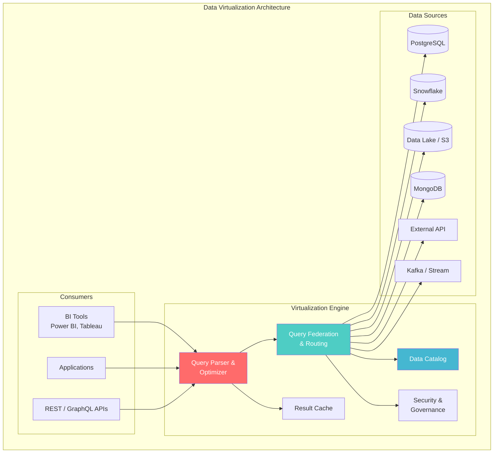
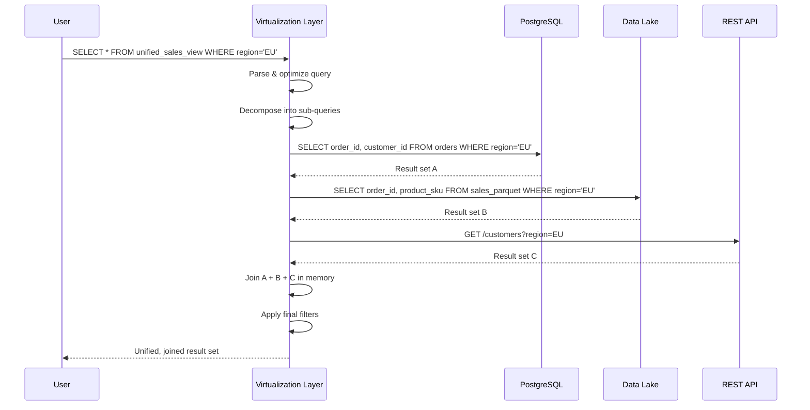
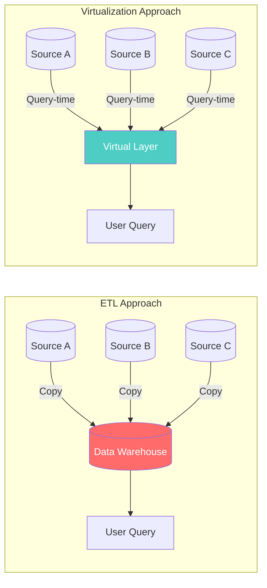
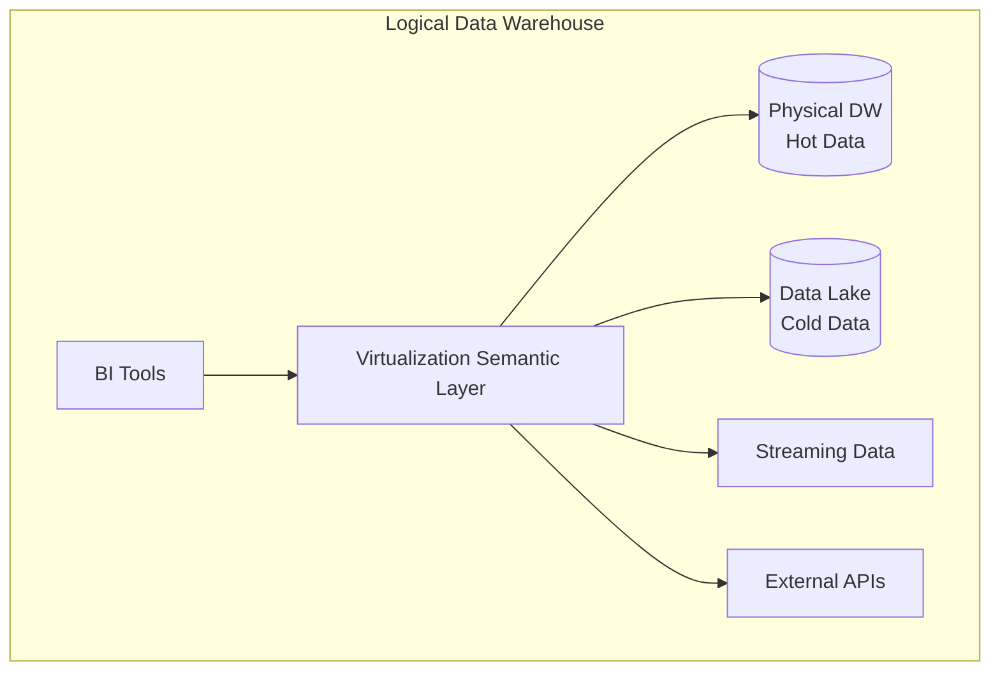
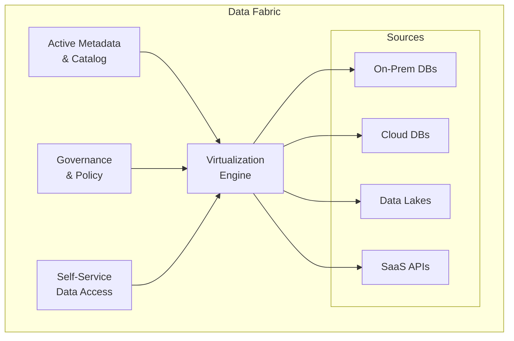
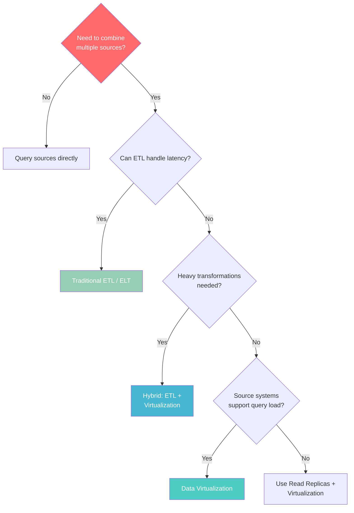

# Data Virtualization

> **Taxonomy Reference**: §4.1 Data Architecture

## Overview

Data Virtualization is an architectural approach that provides a **unified, abstracted access layer** over disparate data sources without physically moving or copying data. It enables querying across multiple heterogeneous sources — relational databases, data lakes, APIs, and streaming sources — through a single logical interface, as if they were one database.

## Table of Contents

- [Core Concepts](#core-concepts)
- [Architecture Diagram](#architecture-diagram)
- [How It Works](#how-it-works)
- [Data Virtualization vs ETL](#data-virtualization-vs-etl)
- [Use Cases](#use-cases)
- [Implementation Patterns](#implementation-patterns)
- [Benefits & Limitations](#benefits-limitations)
- [Decision Framework](#decision-framework)
- [Related Patterns](#related-patterns)

## Core Concepts

### The Logical Data Layer

```
┌─────────────────────────────────────────────────────────┐
│                  CONSUMPTION LAYER                       │
│         BI Tools   │   APIs   │   Applications          │
├─────────────────────────────────────────────────────────┤
│               VIRTUALIZATION LAYER                       │
│  ┌─────────────────────────────────────────────────┐    │
│  │        Unified Semantic / Query Interface        │    │
│  │  • Virtual Tables (Views)                       │    │
│  │  • Query Federation                             │    │
│  │  • Data Abstraction                             │    │
│  │  • Security / Governance                        │    │
│  └─────────────────────────────────────────────────┘    │
├─────────────────────────────────────────────────────────┤
│                  PHYSICAL LAYER                          │
│   RDBMS  │  Data Lake  │  APIs  │  Streaming  │  Files  │
└─────────────────────────────────────────────────────────┘
```

### Key Principles

| Principle | Description |
|-----------|-------------|
| **Abstraction** | Consumers see logical views, not physical tables |
| **Federation** | Queries are decomposed and pushed to source systems |
| **On-Demand** | Data is fetched at query time, not pre-loaded |
| **Zero-Copy** | No data duplication; single source of truth maintained |

## Architecture Diagram



## How It Works

### Query Federation Flow



### Virtual Table Definition

Virtual tables are defined declaratively, mapping logical schemas to physical sources:

```yaml
# Example: Virtual view definition (conceptual)
virtual_table: unified_customer_360
sources:
  - name: crm_data
    type: postgresql
    connection: crm_prod
    mapping:
      customer_id: c.id
      name: c.full_name
      email: c.email_address
      segment: c.customer_segment

  - name: order_history
    type: snowflake
    connection: analytics_wh
    mapping:
      customer_id: o.customer_key
      lifetime_value: o.ltv
      last_order_date: MAX(o.order_date)

  - name: support_tickets
    type: zendesk_api
    connection: zendesk_prod
    mapping:
      customer_id: t.requester_id
      open_tickets: COUNT(t.id) WHERE status='open'

join_condition: crm_data.customer_id = order_history.customer_id
              AND crm_data.customer_id = support_tickets.customer_id
```

## Data Virtualization vs ETL

| Dimension | Data Virtualization | Traditional ETL |
|-----------|-------------------|-----------------|
| **Data movement** | None (query-time federation) | Copies data to target |
| **Latency** | Real-time (source systems) | Batch-delayed (minutes to hours) |
| **Storage cost** | Minimal (no data duplication) | High (transformed copies stored) |
| **Query performance** | Dependent on source speed | Optimized (pre-aggregated) |
| **Transformation complexity** | Limited (logical views) | Full (cleansing, enrichment) |
| **Source system load** | Queries hit production systems | Isolated (ETL runs separate) |
| **Historical consistency** | Always current (point-in-time) | Snapshot-based |
| **Governance** | Centralized abstraction layer | Fragmented across pipelines |
| **Best for** | Agile access, federated queries | Heavy transformations, historical analysis |



## Use Cases

### 1. Customer 360 View
Unify customer data from CRM, billing, support, and marketing platforms without building a massive ETL pipeline.

### 2. Agile Data Exploration
Data scientists can explore multiple sources quickly without waiting for data engineering to build pipelines for each experiment.

### 3. Legacy System Integration
Provide a modern query layer over legacy mainframe or proprietary systems without migrating data.

### 4. Mergers & Acquisitions
Rapidly integrate data from acquired company systems during transition, before full data migration is complete.

### 5. Regulatory Reporting
Create auditable, real-time views across systems for compliance reporting without data duplication.

## Implementation Patterns

### Pattern 1: Logical Data Warehouse



The virtualization layer augments (doesn't replace) the physical warehouse, extending its reach to data lake and external sources.

### Pattern 2: Data Fabric



### Pattern 3: API-Based Virtualization

Wrapping virtualized data as REST/GraphQL endpoints:

```graphql
type Customer360 {
  id: ID!
  name: String!              # From CRM (PostgreSQL)
  email: String!             # From CRM (PostgreSQL)
  lifetimeValue: Float       # From Data Warehouse (Snowflake)
  openTickets: Int           # From Support API (Zendesk)
  recentOrders: [Order]      # From Order DB (MongoDB)
  segment: String            # From Marketing Platform (API)
}
```

## Benefits & Limitations

### Benefits

| Benefit | Description |
|---------|-------------|
| **Speed to insight** | No ETL pipeline build wait time |
| **Zero data duplication** | Single source of truth maintained |
| **Real-time access** | Queries hit live source systems |
| **Reduced storage costs** | No staging/copy storage |
| **Unified governance** | Centralized security, lineage, catalog |

### Limitations

| Limitation | Mitigation |
|------------|------------|
| **Query performance** | Caching layer, pushdown optimization |
| **Source system load** | Rate limiting, read replicas |
| **Complex transformations** | Combine with physical ETL for heavy transforms |
| **Network latency** | Colocation, connection pooling |
| **Limited write support** | Data virtualization is primarily read-oriented |

## Decision Framework



## Related Patterns

- [Polyglot Persistence](03-polyglot-persistence.md) — Multi-store architecture
- [Data Warehouse Architecture](../02-analytics-architecture/01-data-warehouse-architecture.md) — Physical consolidated analytics
- [Data Lake Architecture](../02-analytics-architecture/02-data-lake-architecture.md) — Schema-on-read storage
- [Lakehouse Architecture](../02-analytics-architecture/03-lakehouse-architecture.md) — Unified analytics platform

> **Azure Implementation**: See [Microsoft Fabric](https://learn.microsoft.com/en-us/fabric/) for unified data virtualization, [Azure Synapse Link](https://learn.microsoft.com/en-us/azure/synapse-analytics/) for near-real-time analytics over operational data, and [Azure Data Factory](../../../architecture-azure/data/data-factory/) for ETL orchestration.
