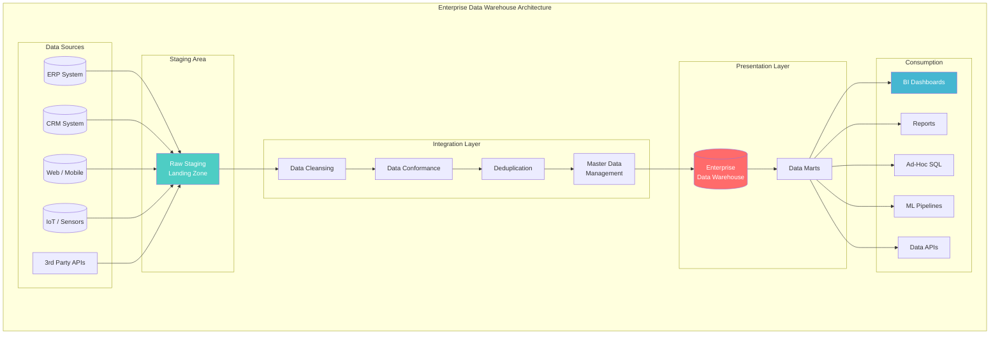
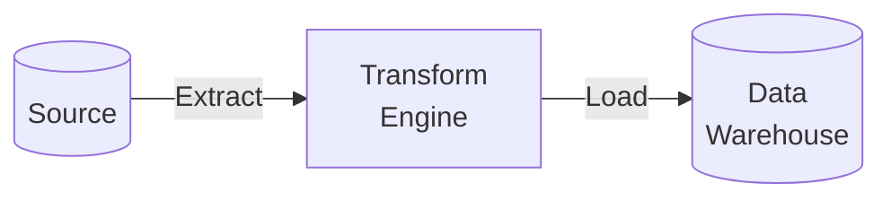
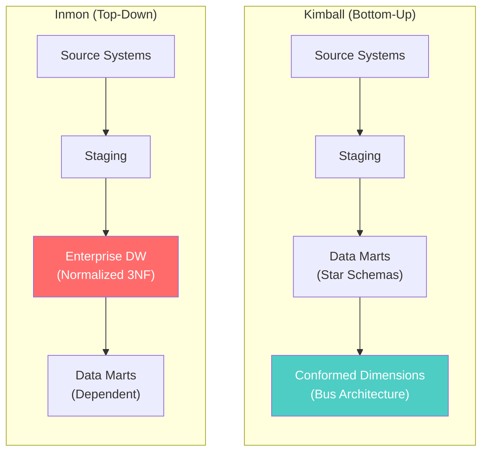
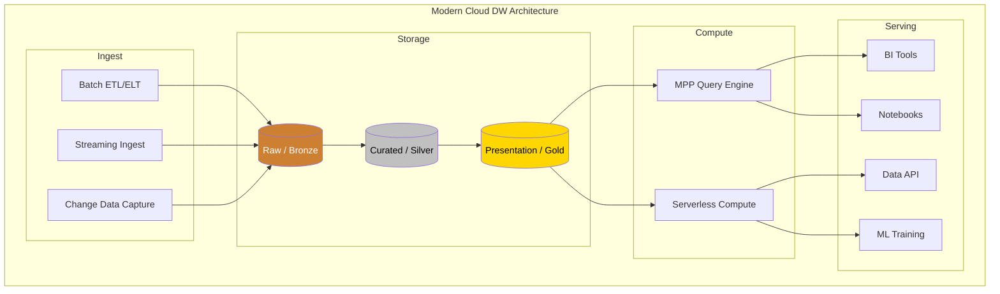
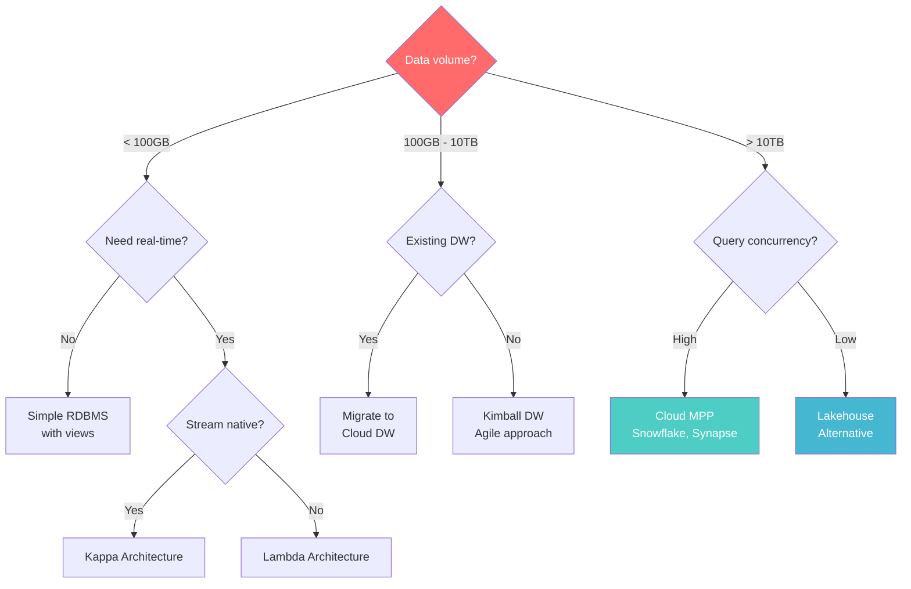

# Data Warehouse Architecture

> **Taxonomy Reference**: §4.2 Analytics Architecture

## Overview

A Data Warehouse (DW) is a centralized repository designed for analytical querying and reporting. It consolidates data from multiple operational sources, transforms it into a consistent format, and optimizes it for complex queries — serving as the "single source of truth" for enterprise analytics.

## Table of Contents

- [Core Concepts](#core-concepts)
- [Architecture Diagram](#architecture-diagram)
- [ETL vs ELT](#etl-vs-elt)
- [Schema Design Approaches](#schema-design-approaches)
- [Kimball vs Inmon](#kimball-vs-inmon)
- [Data Mart Strategy](#data-mart-strategy)
- [Modern Warehouse Architecture](#modern-warehouse-architecture)
- [Decision Framework](#decision-framework)
- [Related Patterns](#related-patterns)

## Core Concepts

### The Data Warehouse Value Chain

```
Operational Systems  →  Staging  →  Integration  →  Presentation  →  Consumption
     (OLTP)              (Raw)       (Transform)      (Star Schema)     (BI / ML)
```

| Layer | Purpose | Characteristics |
|-------|---------|-----------------|
| **Staging** | Land raw data as-is | Transient, schema-flexible |
| **Integration** | Clean, conform, deduplicate | Normalized (3NF) or Data Vault |
| **Presentation** | Business-friendly structures | Star/snowflake schemas, aggregates |
| **Consumption** | BI, reports, ML, ad-hoc | Semantic layer, cubes, APIs |

## Architecture Diagram



## ETL vs ELT

### ETL (Extract → Transform → Load)



| Characteristic | ETL |
|---------------|-----|
| **Where transform?** | Before loading into DW |
| **DW content** | Clean, transformed data only |
| **Best for** | On-prem, structured data, compliance |
| **Tool examples** | Informatica, SSIS, Talend, DataStage |

### ELT (Extract → Load → Transform)

```mermaid
graph LR
    SRC[(Source)] -->|Extract| DW[(Data<br/>Warehouse)]
    DW -->|Transform<br/>(in-DB)| RESULT[(Transformed<br/>Views)]
```

| Characteristic | ELT |
|---------------|-----|
| **Where transform?** | Inside the DW (using its compute) |
| **DW content** | Raw + transformed data |
| **Best for** | Cloud DWs (Snowflake, BigQuery, Synapse) |
| **Tool examples** | dbt, Dataform, custom SQL |

### Comparison

| Dimension | ETL | ELT |
|-----------|-----|-----|
| **Data retention** | DW has only transformed data | DW has raw + transformed |
| **Flexibility** | New transforms require re-extract | Re-transform raw data in-place |
| **Compute** | External ETL server | Uses DW compute power |
| **Compliance** | Easier (raw data never leaves source) | Raw data in cloud |
| **Performance** | Less load on DW | Leverages cloud DW scale |

## Schema Design Approaches

For detailed schema design (star/snowflake, SCD types), see [OLAP Architecture](../01-data-architecture/02-olap-architecture.md).

## Kimball vs Inmon



| Dimension | Kimball | Inmon |
|-----------|---------|-------|
| **Philosophy** | Bottom-up: Start with data marts | Top-down: Build enterprise DW first |
| **Schema** | Dimensional (star/snowflake) | Normalized (3NF) |
| **Time to value** | Fast (department-level marts) | Slow (enterprise model first) |
| **Complexity** | Lower initial complexity | Higher upfront investment |
| **Governance** | Federated (dept ownership) | Centralized (enterprise ownership) |
| **Best for** | Agile orgs, quick wins | Regulated industries, single source |
| **Integration** | Conformed dimensions (bus) | CIF (Corporate Information Factory) |

### The Real-World Answer

Most organizations adopt a **hybrid approach**: use Kimball dimensional modeling within an Inmon-style enterprise architecture. Modern tools like dbt make this practical.

## Data Mart Strategy

| Type | Description | Pros | Cons |
|------|-------------|------|------|
| **Dependent** | Sourced from enterprise DW | Single source of truth | Requires DW first |
| **Independent** | Direct from operational sources | Fast to build | Data silos, inconsistency |
| **Hybrid** | Some from DW, some direct | Flexible | Governance complexity |

## Modern Warehouse Architecture



> **Note**: The bronze/silver/gold naming (medallion architecture) originates from the data lake pattern but is now commonly adopted in modern cloud warehouses as well. See [Data Lake Architecture](02-data-lake-architecture.md) for the origin.

## Decision Framework



## Related Patterns

- [OLAP Architecture](../01-data-architecture/02-olap-architecture.md) — Dimensional modeling deep-dive
- [Data Lake Architecture](02-data-lake-architecture.md) — Schema-on-read alternative
- [Lakehouse Architecture](03-lakehouse-architecture.md) — Convergence of lake and warehouse
- [Lambda Architecture](04-lambda-architecture.md) — Batch + real-time big data
- [Kappa Architecture](05-kappa-architecture.md) — Stream-only approach

> **Azure Implementation**: See [Azure Synapse Analytics](../../../architecture-azure/data/) (MPP DW), [Microsoft Fabric](../../../architecture-azure/data/) (unified analytics), and [Azure Data Factory](../../../architecture-azure/data/data-factory/) (ETL/ELT orchestration).
