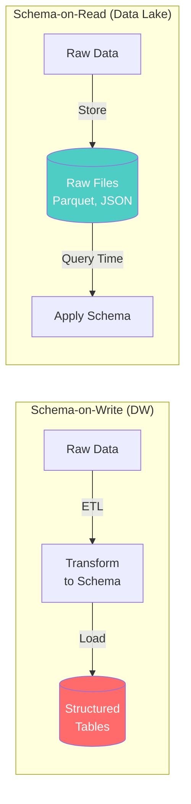
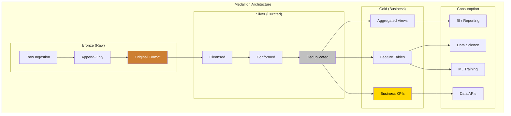
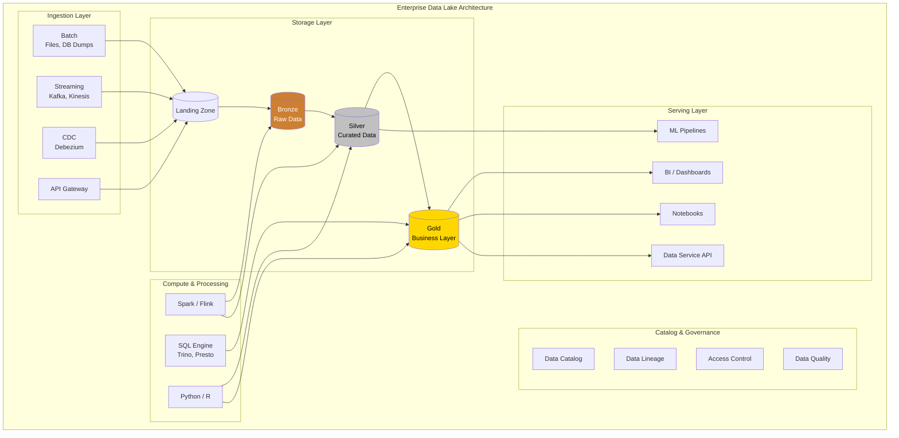
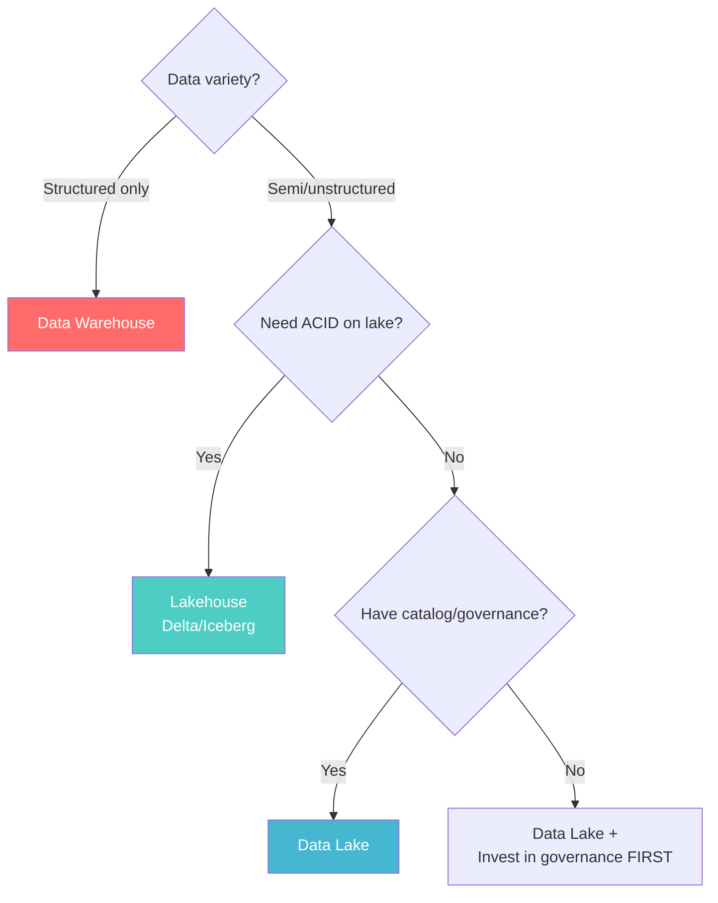

# Data Lake Architecture

> **Taxonomy Reference**: §4.2 Analytics Architecture

## Overview

A Data Lake is a centralized repository that stores **raw data in its native format** at any scale. Unlike a data warehouse that requires structured, transformed data, a data lake embraces the **schema-on-read** paradigm — data is stored first, and structure is applied when it's read for analysis.

## Table of Contents

- [Core Principles](#core-principles)
- [Schema-on-Read vs Schema-on-Write](#schema-on-read-vs-schema-on-write)
- [Medallion Architecture](#medallion-architecture)
- [Architecture Diagram](#architecture-diagram)
- [Data Organization](#data-organization)
- [Governance & Catalog](#governance-catalog)
- [Lake vs Warehouse vs Lakehouse](#lake-vs-warehouse-vs-lakehouse)
- [Decision Framework](#decision-framework)
- [Related Patterns](#related-patterns)

## Core Principles

| Principle | Description |
|-----------|-------------|
| **Schema-on-Read** | Structure applied at query time, not at ingest |
| **Store Everything** | Raw data preserved indefinitely |
| **Multi-Protocol** | Batch, streaming, and interactive from same storage |
| **Open Formats** | Parquet, ORC, Avro, Iceberg — avoid vendor lock-in |
| **Separation of Compute & Storage** | Scale storage and compute independently |
| **Single Copy of Data** | No proliferation of data copies |

## Schema-on-Read vs Schema-on-Write



| Dimension | Schema-on-Write | Schema-on-Read |
|-----------|----------------|----------------|
| **Agility** | Schema changes require reload | Schema evolves freely |
| **Query speed** | Fast (pre-optimized) | Slower (parse at query time) |
| **Storage format** | Proprietary / optimized | Open formats (Parquet, ORC) |
| **Data retention** | Often summarized | Full history retained |
| **Data science** | Requires ETL for exploration | Direct access to raw data |
| **Governance** | Enforced at ingest | Enforced at query |

## Medallion Architecture

The **medallion architecture** (Bronze → Silver → Gold) is the modern standard for organizing data lakes:



### Zone Characteristics

| Zone | Purpose | Data Shape | Access Pattern | Retention |
|------|---------|------------|----------------|-----------|
| **Bronze** | Landing zone, full fidelity | Raw (JSON, CSV, binary) | Append-only | Forever (immutable) |
| **Silver** | Cleaned, validated, joined | Parquet/ORC with schema | Read-heavy, incremental | Policy-based |
| **Gold** | Business-ready aggregates | Star schemas, flat tables | High read concurrency | Rolling window |

## Architecture Diagram



## Data Organization

### File Formats

| Format | Type | Compression | Schema | Query Pushdown |
|--------|------|-------------|--------|----------------|
| **Parquet** | Columnar | Snappy, Gzip, Zstd | Embedded | Column, predicate, partition |
| **ORC** | Columnar | Zlib, Snappy, LZO | Embedded | Column, predicate |
| **Avro** | Row-based | Deflate, Snappy | Embedded | None (row-based) |
| **JSON** | Row-based | Gzip | None | None |
| **Delta Lake** | Columnar + Log | Parquet + JSON | Embedded + Schema evolution | Full (with transaction log) |
| **Iceberg** | Columnar + Metadata | Parquet/ORC/Avro | Embedded + Schema evolution | Full (with metadata layer) |

### Partitioning Strategies

```
Recommended: s3://data-lake/silver/sales/
├── year=2024/
│   ├── month=01/
│   │   ├── region=eu/
│   │   └── region=us/
│   └── month=02/
│       └── ...
└── year=2025/
    └── ...
```

| Strategy | Good For | Anti-Pattern |
|----------|----------|--------------|
| **Date-based** | Time-series, logs | High-cardinality partition keys |
| **Geographic** | Regional analytics | Too many small files |
| **Category** | Balanced distribution | Skewed categories |
| **Hash** | Uniform distribution | Hard to query by value |

## Governance & Catalog

### Data Catalog

A catalog is essential for data lake success — without it, the lake becomes a **data swamp**:

```
Catalog Metadata per Dataset:
├── Schema (columns, types)
├── Lineage (upstream sources, downstream consumers)
├── Statistics (row count, size, partition info)
├── Ownership (team, contact)
├── Classification (PII, sensitivity)
├── Quality metrics (completeness, freshness)
└── Tags (domain, use case, retention policy)
```

### Preventing the Data Swamp

| Anti-Pattern | Solution |
|-------------|----------|
| No schema enforcement | Use Delta Lake / Iceberg for schema evolution |
| No ownership | Assign data stewards per domain |
| No quality checks | Great Expectations, dbt tests |
| No catalog | Implement data catalog (Unity, Purview, Amundsen) |
| No retention policy | Define TTL and archival per zone |
| No access control | Row/column-level security, RBAC |

## Lake vs Warehouse vs Lakehouse

| Dimension | Data Warehouse | Data Lake | Lakehouse |
|-----------|---------------|-----------|-----------|
| **Schema** | Schema-on-write | Schema-on-read | Schema-on-read + enforcement |
| **ACID** | Full ACID | No ACID | ACID via Delta/Iceberg |
| **Data types** | Structured only | All (structured, semi, unstructured) | All |
| **BI speed** | Fast | Slow (needs compute) | Fast (with optimizations) |
| **ML/DS** | Limited | Excellent | Excellent |
| **Cost** | High ($/TB) | Low ($/TB) | Medium |
| **Governance** | Built-in | Add-on required | Built-in |
| **Open format** | Proprietary | Parquet, ORC | Delta, Iceberg, Hudi |

> **Predecessor & Successor**: Data lakes preceded the [Lakehouse Architecture](03-lakehouse-architecture.md), which addresses their ACID and governance shortcomings.

## Decision Framework



## Related Patterns

- [Data Warehouse Architecture](01-data-warehouse-architecture.md) — Schema-on-write counterpart
- [Lakehouse Architecture](03-lakehouse-architecture.md) — ACID-enabled lake evolution
- [Lambda Architecture](04-lambda-architecture.md) — Batch + streaming over data lake
- [Kappa Architecture](05-kappa-architecture.md) — Stream-only over event log
- [Data Virtualization](../01-data-architecture/04-data-virtualization.md) — Query-time federation without copy

> **Azure Implementation**: See [Azure Data Lake Storage (ADLS) Gen2](../../../architecture-azure/data/storage/), [Microsoft Fabric Lakehouse](../../../architecture-azure/data/), and [Azure Purview](../../../architecture-azure/governance/) for data governance.
