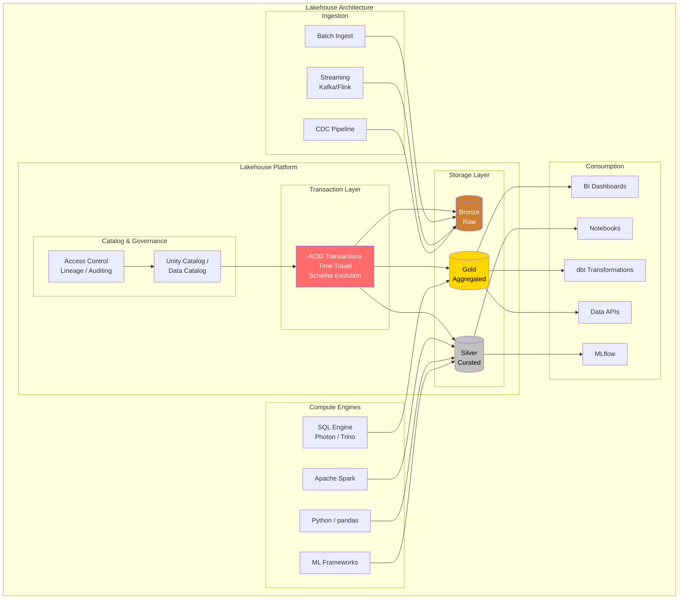
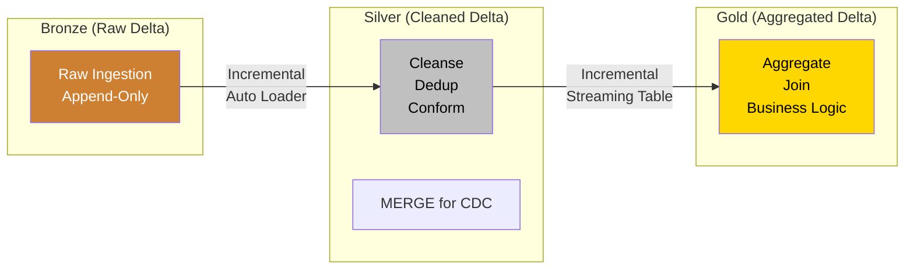
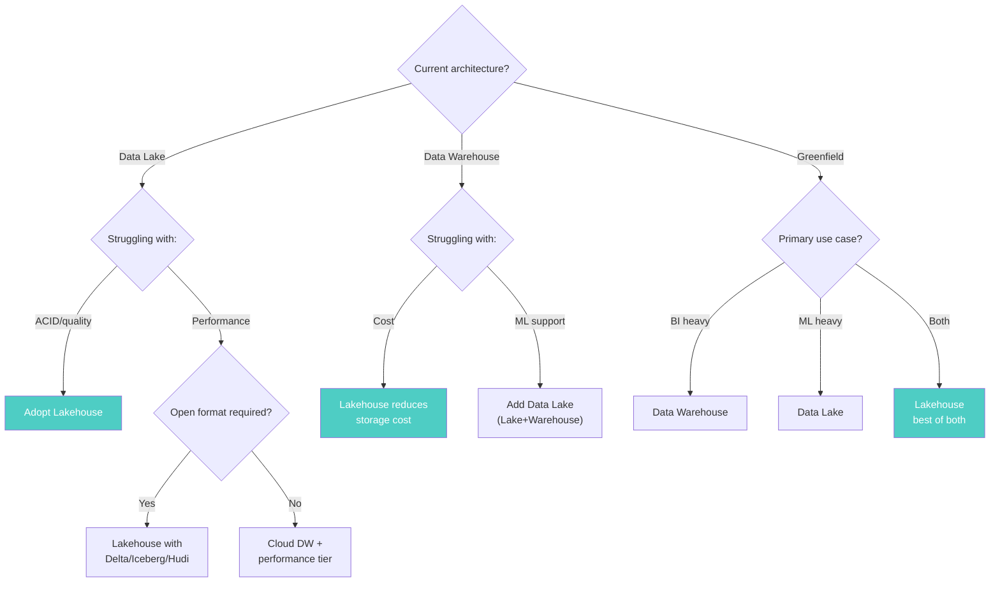

# Lakehouse Architecture

> **Taxonomy Reference**: §4.2 Analytics Architecture

## Overview

The Lakehouse is a modern data architecture that **merges the best of data lakes and data warehouses** into a single, unified platform. It brings ACID transactions, schema enforcement, and BI performance to data lake storage — eliminating the need to maintain separate lake and warehouse systems.

## Table of Contents

- [Core Concepts](#core-concepts)
- [Architecture Diagram](#architecture-diagram)
- [Key Enabling Technologies](#key-enabling-technologies)
- [Delta Lake Deep Dive](#delta-lake-deep-dive)
- [Apache Iceberg](#apache-iceberg)
- [Apache Hudi](#apache-hudi)
- [Lakehouse vs Lake vs Warehouse](#lakehouse-vs-lake-vs-warehouse)
- [Decision Framework](#decision-framework)
- [Related Patterns](#related-patterns)

## Core Concepts

### The Convergence

```
Data Lake                          Lakehouse                       Data Warehouse
─────────                         ───────────                      ─────────────
✓ Low cost                         ✓ Low cost                       ✗ High cost
✓ All data types                   ✓ All data types                 ✗ Structured only
✓ ML / DS ready                    ✓ ML / DS ready                  ~ Limited ML
✓ Open formats                     ✓ Open formats                   ✗ Proprietary
✗ No ACID                    →     ✓ ACID transactions        ←     ✓ ACID
✗ Poor BI performance              ✓ BI performance                 ✓ BI performance
✗ No schema enforcement            ✓ Schema enforcement             ✓ Schema enforcement
✗ Poor governance                  ✓ Governance                     ✓ Governance
```

## Architecture Diagram



## Key Enabling Technologies

The lakehouse is made possible by **open table formats** that add a transactional metadata layer on top of object storage:

| Format | Creator | Key Innovation | Best For |
|--------|---------|---------------|----------|
| **Delta Lake** | Databricks | ACID via transaction log (JSON) | Databricks ecosystem, Spark-native |
| **Apache Iceberg** | Netflix | Hidden partitioning, snapshot isolation | Multi-engine (Spark, Trino, Flink) |
| **Apache Hudi** | Uber | Incremental upserts, record-level indexing | Streaming, CDC workloads |

## Delta Lake Deep Dive

### Transaction Log

Delta Lake maintains a **transaction log** (`_delta_log/`) that records every operation:

```
s3://lakehouse/silver/sales/_delta_log/
├── 00000000000000000000.json    # Initial table creation
├── 00000000000000000001.json    # INSERT 100 rows
├── 00000000000000000002.json    # UPDATE 5 rows
├── 00000000000000000003.json    # DELETE 2 rows
├── 00000000000000000003.checkpoint.parquet  # Checkpoint
└── 00000000000000000004.json    # MERGE (upsert)
```

Each JSON entry records:
- **Operation** (ADD, REMOVE, UPDATE)
- **File paths** affected
- **Partition** information
- **Statistics** (min, max, null count, row count)

### Key Capabilities

```sql
-- Time Travel: Query data as of a specific version
SELECT * FROM sales
VERSION AS OF 5;

-- Or by timestamp
SELECT * FROM sales
TIMESTAMP AS OF '2024-01-15T10:00:00';

-- RESTORE TABLE to a previous version
RESTORE TABLE sales TO VERSION AS OF 3;

-- Schema Evolution
ALTER TABLE sales ADD COLUMNS (discount DOUBLE);
ALTER TABLE sales ALTER COLUMN amount TYPE DECIMAL(18,4);

-- OPTIMIZE: Compact small files
OPTIMIZE sales ZORDER BY (order_date);

-- VACUUM: Remove old files (retention > 7 days default)
VACUUM sales RETAIN 168 HOURS;
```

### Medallion with Delta Lake



## Apache Iceberg

### Architecture

```
┌─────────────────────────────────────────┐
│           Iceberg Table                  │
│                                          │
│  ┌─────────────────────────────────┐     │
│  │      Metadata Layer             │     │
│  │  ┌─────────┐  ┌──────────┐     │     │
│  │  │Snapshot │  │ Manifest │     │     │
│  │  │Manager  │  │  Lists   │     │     │
│  │  └─────────┘  └──────────┘     │     │
│  └─────────────────────────────────┘     │
│                                          │
│  ┌─────────────────────────────────┐     │
│  │       Data Layer                │     │
│  │   Parquet / ORC / Avro files    │     │
│  └─────────────────────────────────┘     │
└─────────────────────────────────────────┘
```

### Key Differentiators

- **Hidden Partitioning**: Partition transforms (e.g., `days(timestamp)`) are part of table metadata — users don't need to know the physical partition layout
- **Snapshot Isolation**: Each query sees a consistent snapshot, even during concurrent writes
- **Partition Evolution**: Change partition scheme without rewriting data
- **Multi-Engine**: Spark, Trino, Flink, Presto, Hive, Impala all read/write Iceberg tables

## Apache Hudi

### Key Differentiators

- **Record-Level Indexing**: Fast upserts via bloom filters and file-level indexing
- **Copy-on-Write vs Merge-on-Read**: Choose between query latency and write latency
- **Incremental Query**: Query only changed records since a timestamp or commit
- **Streaming Optimized**: Designed for CDC and streaming write patterns

### Write Modes

| Mode | Write Latency | Read Latency | Best For |
|------|---------------|--------------|----------|
| **Copy-on-Write (CoW)** | Higher | Lower | Read-heavy, batch ETL |
| **Merge-on-Read (MoR)** | Lower | Higher | Write-heavy, streaming CDC |

## Lakehouse vs Lake vs Warehouse

| Dimension | Data Lake | Data Warehouse | Lakehouse |
|-----------|-----------|---------------|-----------|
| **ACID** | ❌ | ✅ | ✅ |
| **Schema enforcement** | ❌ | ✅ (rigid) | ✅ (flexible evolution) |
| **BI performance** | ❌ (needs compute) | ✅ (optimized) | ✅ (Z-ordering, clustering) |
| **ML/DS** | ✅ (direct access) | ❌ (limited) | ✅ |
| **Data types** | All | Structured only | All |
| **Open format** | Parquet (no metadata) | Proprietary | Delta, Iceberg, Hudi |
| **Cost** | $ | $$$ | $$ |
| **Time travel** | ❌ | Limited (snapshots) | ✅ (versioned commits) |
| **Concurrent reads/writes** | ❌ | ✅ | ✅ (optimistic concurrency) |
| **Streaming + batch** | Separate stacks | Separate stacks | Unified |

## Decision Framework



## Related Patterns

- [Data Lake Architecture](02-data-lake-architecture.md) — Predecessor pattern
- [Data Warehouse Architecture](01-data-warehouse-architecture.md) — Traditional warehouse approach
- [Lambda Architecture](04-lambda-architecture.md) — Batch + speed layer processing
- [Kappa Architecture](05-kappa-architecture.md) — Stream-only processing
- [Machine Learning Pipeline Architecture](../04-ai-ml-architecture/01-machine-learning-pipeline-architecture.md) — ML on lakehouse

> **Azure Implementation**: See [Microsoft Fabric Lakehouse](../../../architecture-azure/data/) — Delta Lake-based lakehouse with SQL analytics endpoint, [Azure Databricks](../../../architecture-azure/data/) — Delta Lake-native platform, and [Azure Synapse Analytics](../../../architecture-azure/data/) for dedicated SQL pools.
