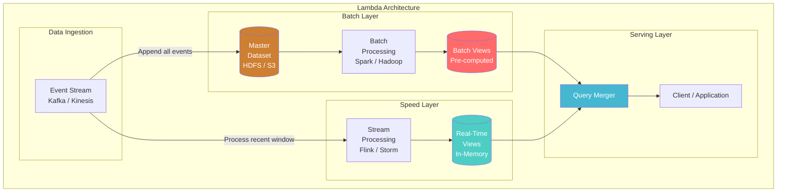
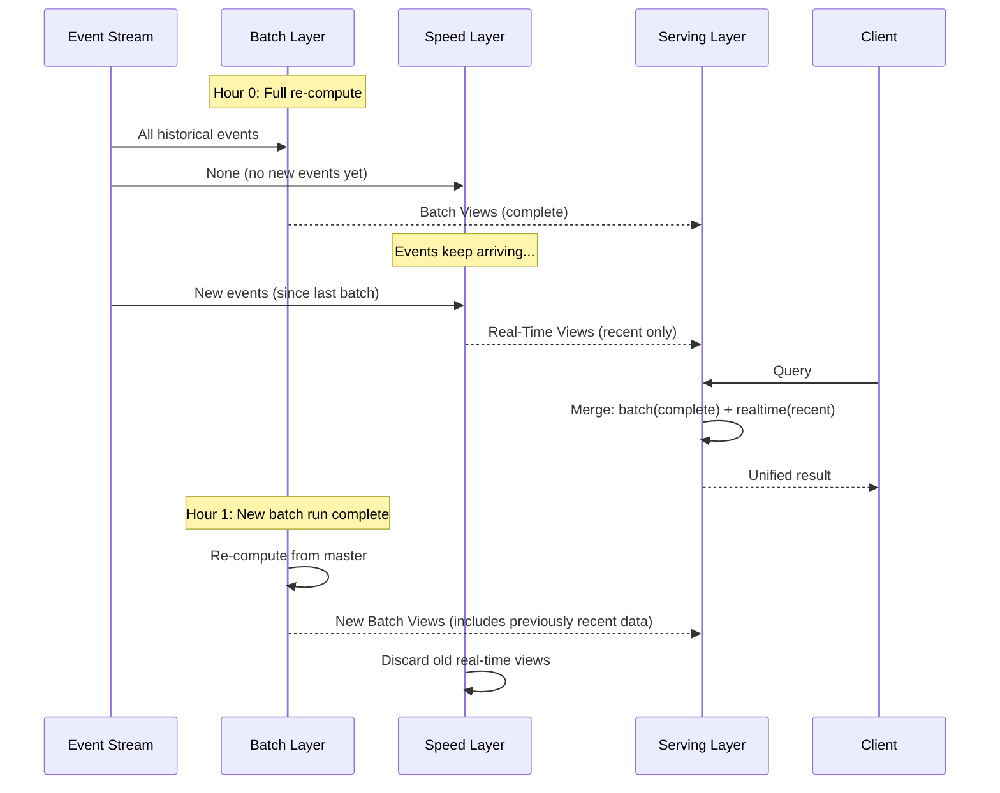

# Lambda Architecture

> **Taxonomy Reference**: §4.2 Analytics Architecture

## Overview

Lambda Architecture is a **big data processing pattern** that combines batch and stream processing to handle massive datasets with both accuracy and low latency. Proposed by Nathan Marz, it splits data processing into three layers: **batch** (accuracy), **speed** (low latency), and **serving** (query merging).

## Table of Contents

- [Core Concepts](#core-concepts)
- [Architecture Diagram](#architecture-diagram)
- [Three Layers Explained](#three-layers-explained)
- [Data Flow](#data-flow)
- [Query Merging](#query-merging)
- [Lambda vs Alternatives](#lambda-vs-alternatives)
- [When to Use](#when-to-use)
- [When Not to Use](#when-not-to-use)
- [Related Patterns](#related-patterns)

## Core Concepts

### The Fundamental Trade-off

```
Accuracy ←─────────────────────────────→ Latency
   │                                         │
   ▼                                         ▼
Batch Layer                              Speed Layer
(Perfect, slow)                          (Approximate, fast)
```

Lambda acknowledges that you can't have both perfect accuracy and real-time latency from a single processing path — so it gives you both, and merges them at query time.

## Architecture Diagram



## Three Layers Explained

### 1. Batch Layer

| Aspect | Description |
|--------|-------------|
| **Purpose** | Compute accurate, complete results over the full dataset |
| **Data** | Immutable, append-only master dataset |
| **Processing** | Re-compute everything periodically (hours/daily) |
| **Output** | Batch views — pre-computed query results |
| **Latency** | Hours (time to re-process entire dataset) |
| **Accuracy** | 100% accurate |
| **Fault Tolerance** | Inherent — re-process from immutable source |

```
Batch Layer Computation:
─────────────────────────

New data → Append to Master Dataset
                    ↓
        Re-compute ALL batch views
        (function(master_dataset) → batch_views)
                    ↓
        Replace old batch views atomically
```

### 2. Speed Layer

| Aspect | Description |
|--------|-------------|
| **Purpose** | Bridge the gap until batch views are updated |
| **Data** | Recent data only (not yet in batch views) |
| **Processing** | Incremental, real-time, per-event |
| **Output** | Real-time views — approximate, in-memory |
| **Latency** | Milliseconds to seconds |
| **Accuracy** | Approximate (complex logic may differ from batch) |
| **Fault Tolerance** | Discard and rebuild from recent stream window |

```
Speed Layer Computation:
────────────────────────

New event → Incremental update to real-time views
                  ↓
        Real-time view = batch_equivalent(event)
        (Only for events since last batch run)
```

### 3. Serving Layer

| Aspect | Description |
|--------|-------------|
| **Purpose** | Merge batch and real-time views for queries |
| **Data** | Batch views + real-time views |
| **Processing** | Query-time merge: `result = batch ⊕ realtime` |
| **Output** | Single unified result to client |
| **Latency** | Merge latency (ms) + view read latency |

## Data Flow



## Query Merging

### Pseudo-code

```python
def query(key):
    # Get pre-computed batch result (accurate but stale)
    batch_result = batch_view.get(key)

    # Get real-time result (approximate but current)
    realtime_result = realtime_view.get(key, since=last_batch_timestamp)

    # Merge: sum, average, or union depending on query type
    return merge(batch_result, realtime_result)

def merge(batch, realtime):
    if query_type == "COUNT":
        return batch.count + realtime.count
    elif query_type == "SUM":
        return batch.sum + realtime.sum
    elif query_type == "AVERAGE":
        total = batch.sum + realtime.sum
        count = batch.count + realtime.count
        return total / count
    elif query_type == "TOP_K":
        return top_k(merge_lists(batch.top_k, realtime.top_k))
```

### Merge Logic by Query Type

| Query Type | Merge Strategy |
|------------|---------------|
| **COUNT** | `batch.count + realtime.count` |
| **SUM** | `batch.sum + realtime.sum` |
| **AVERAGE** | `(batch.sum + realtime.sum) / (batch.count + realtime.count)` |
| **MIN/MAX** | `min(batch.min, realtime.min)` / `max(...)` |
| **DISTINCT** | `distinct(batch.set ∪ realtime.set)` |
| **TOP-K** | `top_k(batch.k ∪ realtime.k)` |

## Lambda vs Alternatives

| Dimension | Lambda | Kappa | Traditional Batch |
|-----------|--------|-------|-------------------|
| **Processing paths** | 2 (batch + stream) | 1 (stream only) | 1 (batch only) |
| **Code duplication** | YES (same logic twice) | No | No |
| **Latency** | Low (ms via speed layer) | Low (ms) | High (hours) |
| **Accuracy** | Perfect (via batch layer) | Good (exactly-once) | Perfect |
| **Complexity** | High (two codebases) | Medium | Low |
| **Reprocessing** | Re-run batch on master | Replay event log | Re-run batch job |
| **Operational burden** | High (two systems) | Medium (one system) | Low |

> **Stream-only alternative**: See [Kappa Architecture](05-kappa-architecture.md)

## When to Use

| Scenario | Why Lambda Fits |
|----------|-----------------|
| **Batch and real-time have fundamentally different logic** | e.g., ML models train in batch, serve in real-time |
| **Regulatory requirement for perfect accuracy** | Batch layer provides auditable, accurate results |
| **Extremely complex aggregations** | e.g., graph algorithms that don't stream well |
| **Batch system already exists** | Add speed layer incrementally |
| **Reprocessing is computationally expensive** | Only batch layer handles full recompute |

## When Not to Use

| Scenario | Alternative |
|----------|-------------|
| **Stream processing can handle all logic** | Use [Kappa Architecture](05-kappa-architecture.md) |
| **Latency requirements > 10 minutes** | Simple batch pipeline is sufficient |
| **No need for real-time** | Traditional data warehouse |
| **Small data volumes (<100GB)** | Single database with views |
| **Team too small to maintain dual codebase** | Kappa or pure batch |

## Related Patterns

- [Kappa Architecture](05-kappa-architecture.md) — Stream-only simplification of Lambda
- [Stream Processing Architecture](../03-streaming-architecture/02-stream-processing-architecture.md) — Speed layer implementation
- [Real-Time Analytics Architecture](../03-streaming-architecture/01-real-time-analytics-architecture.md) — Streaming analytics patterns
- [Data Lake Architecture](02-data-lake-architecture.md) — Common batch layer storage
- [Data Warehouse Architecture](01-data-warehouse-architecture.md) — Batch-only analytics

> **Azure Implementation**: See [Azure Databricks](../../../architecture-azure/data/) (batch + stream with Delta Live Tables), [Azure Stream Analytics](../../../architecture-azure/integration/) (speed layer), and [Azure Synapse Analytics](../../../architecture-azure/data/) (batch serving).
