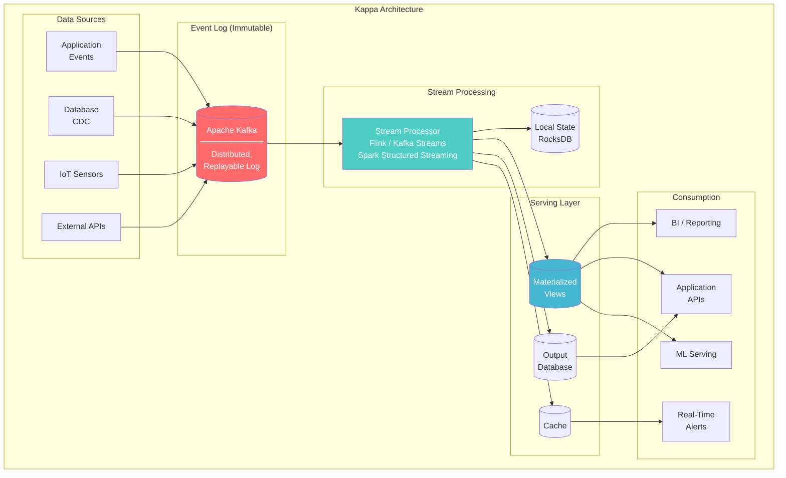
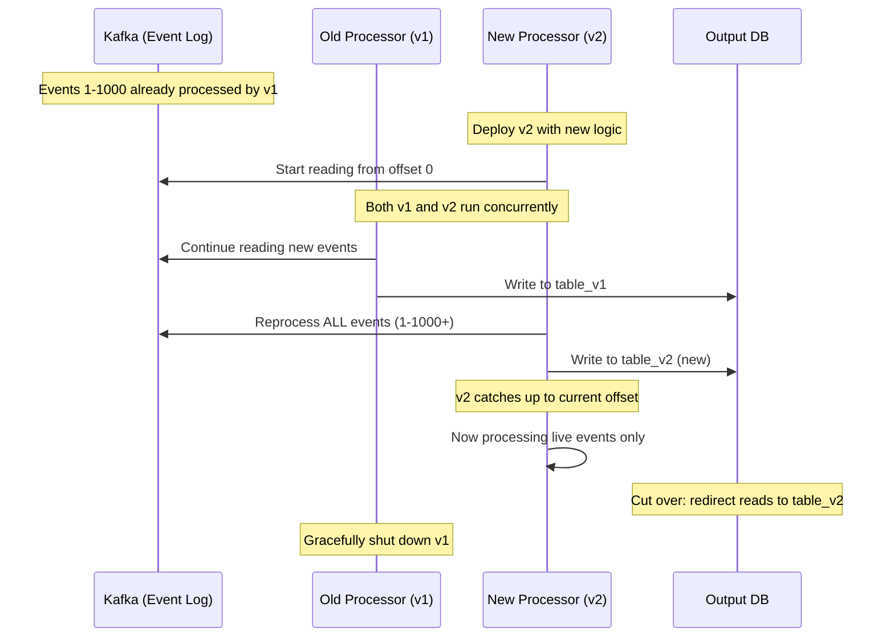
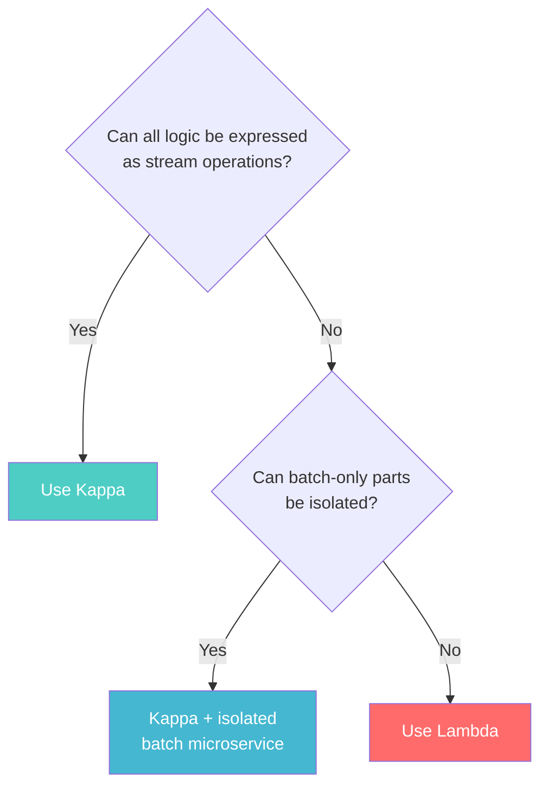

# Kappa Architecture

> **Taxonomy Reference**: §4.2 Analytics Architecture

## Overview

Kappa Architecture is a **stream-first data processing paradigm** proposed by Jay Kreps (co-creator of Apache Kafka) as a simplification of Lambda Architecture. It eliminates the batch layer entirely — all data processing happens as a **single stream processing pipeline**, with the event log serving as the immutable source of truth and enabling reprocessing via replay.

## Table of Contents

- [Core Principles](#core-principles)
- [Architecture Diagram](#architecture-diagram)
- [How Reprocessing Works](#how-reprocessing-works)
- [Kappa vs Lambda](#kappa-vs-lambda)
- [Implementation Considerations](#implementation-considerations)
- [When to Use](#when-to-use)
- [When Not to Use](#when-not-to-use)
- [Related Patterns](#related-patterns)

## Core Principles

```
Lambda:                          Kappa:
┌──────────┐                     ┌──────────────────────────────┐
│ Batch    │                     │                              │
│ Layer    │ ──→ Batch Views     │   Single Stream Pipeline     │
├──────────┤                     │   ┌──────────────────────┐   │
│ Speed    │                     │   │  Event Log (Kafka)   │   │
│ Layer    │ ──→ Real-Time Views │   │        ↓             │   │
├──────────┤                     │   │  Stream Processor     │   │
│ Merge at │                     │   │  (Flink / Kafka       │   │
│ Query    │                     │   │   Streams / Spark)    │   │
└──────────┘                     │   │        ↓             │   │
                                 │   │  Serving Layer       │   │
      TWO code paths             │   └──────────────────────┘   │
                                 │                              │
                                 │      ONE code path           │
                                 └──────────────────────────────┘
```

**Key insight**: If you can reprocess the entire event log through your stream processor, why maintain a separate batch pipeline?

## Architecture Diagram



## How Reprocessing Works

The magic of Kappa: when you need to change processing logic or fix a bug, you don't run a separate batch job — you **spin up a new stream processor instance** that reads from the beginning of the log:



### Reprocessing Requirements

| Requirement | Why |
|-------------|-----|
| **Immutable event log** | Events must never be mutated or deleted |
| **Sufficient retention** | Log must retain data long enough for full replay |
| **Idempotent processing** | Re-reading same events must not cause duplicates |
| **Parallel processing** | Replay must be fast enough to catch up |
| **Output isolation** | v2 writes to separate output to avoid corrupting v1 |

## Kappa vs Lambda

| Dimension | Lambda | Kappa |
|-----------|--------|-------|
| **Code paths** | 2 (batch + stream) | 1 (stream only) |
| **Code maintenance** | High (duplicate logic) | Low (single codebase) |
| **Operational complexity** | High (two systems) | Medium (one system) |
| **Reprocessing** | Re-run batch on HDFS/S3 | Replay Kafka from offset 0 |
| **Latency** | ms (speed layer) | ms (native) |
| **Accuracy** | Perfect (batch layer) | Good (exactly-once) |
| **Batch-only workloads** | Native support | Must be expressed as streams |
| **Infrastructure** | Batch cluster + Stream cluster | Stream cluster + Kafka |
| **Learning curve** | Higher | Lower |
| **Adoption** | Older, well-established | Growing rapidly |

### When Kappa Replaces Lambda



## Implementation Considerations

### Kafka as the Event Log

```yaml
# Kafka topic configuration for Kappa architecture
topic: "events.raw"
partitions: 64
replication_factor: 3
retention:
  bytes: 1TB
  ms: 2592000000  # 30 days (for reprocessing)
compression: zstd
cleanup_policy: delete  # NOT compact (need full history)
```

### Stream Processor Selection

| Framework | Strengths | Kappa Fit |
|-----------|-----------|-----------|
| **Apache Flink** | True streaming, exactly-once, stateful | Excellent |
| **Kafka Streams** | Lightweight, embedded library, Kafka-native | Excellent |
| **Spark Structured Streaming** | Micro-batch, rich ecosystem | Good (micro-batch mode) |
| **Apache Beam** | Portable, unified model | Good (with Flink runner) |

### Handling Late and Out-of-Order Data

Kappa architectures must handle the same challenges as any streaming system:

```python
# Flink example: handling late data with watermarks
stream
    .key_by(lambda e: e.user_id)
    .window(TumblingEventTimeWindows.of(Time.minutes(5)))
    .allowed_lateness(Time.minutes(30))  # Accept late data
    .side_output_late_data(late_output_tag)  # Route very late data
    .aggregate(new MyAggregateFunction())
```

> **Deep dive**: See [Real-Time Analytics Architecture](../03-streaming-architecture/01-real-time-analytics-architecture.md) for windowing, watermarks, and exactly-once semantics.

## When to Use

| Scenario | Why Kappa Fits |
|----------|---------------|
| **Stream-native application** | Events are the primary data model |
| **Same logic for history and live** | No fundamental batch-vs-stream logic difference |
| **Reprocessing is a first-class requirement** | Replay the log, not rebuild batch pipeline |
| **Small-to-medium team** | Single codebase reduces maintenance |
| **Kafka already deployed** | Leverage existing infrastructure |
| **Microservices with event sourcing** | Natural fit with event-driven architecture |

## When Not to Use

| Scenario | Alternative |
|----------|-------------|
| **Complex ML model training** (not streamable) | [Lambda](04-lambda-architecture.md) or [ML Pipeline](../04-ai-ml-architecture/01-machine-learning-pipeline-architecture.md) |
| **Graph processing** (e.g., PageRank) | Lambda or dedicated batch |
| **Massive full-table scans daily** | Batch might be more efficient |
| **No Kafka (or similar log) deployed** | High initial infrastructure cost |
| **Regulatory batch audit trail required** | Lambda with auditable batch layer |
| **Very large event log (>100TB)** | Replay costs can be prohibitive |

## Related Patterns

- [Lambda Architecture](04-lambda-architecture.md) — Predecessor with separate batch layer
- [Stream Processing Architecture](../03-streaming-architecture/02-stream-processing-architecture.md) — Stream processor implementation
- [Real-Time Analytics Architecture](../03-streaming-architecture/01-real-time-analytics-architecture.md) — Windowing, watermarks, exactly-once
- [Change Data Capture (CDC)](../03-streaming-architecture/03-change-data-capture.md) — Database change events as stream source
- [Event Sourcing (CQRS)](../../02-application-software-architecture/06-design-patterns/) — Design pattern that pairs well with Kappa

> **Azure Implementation**: See [Azure Event Hubs + Kafka API](../../../architecture-azure/integration/) (event log), [Azure Stream Analytics](../../../architecture-azure/integration/) (stream processing), and [Azure Databricks Structured Streaming](../../../architecture-azure/data/) for Spark-based Kappa.
