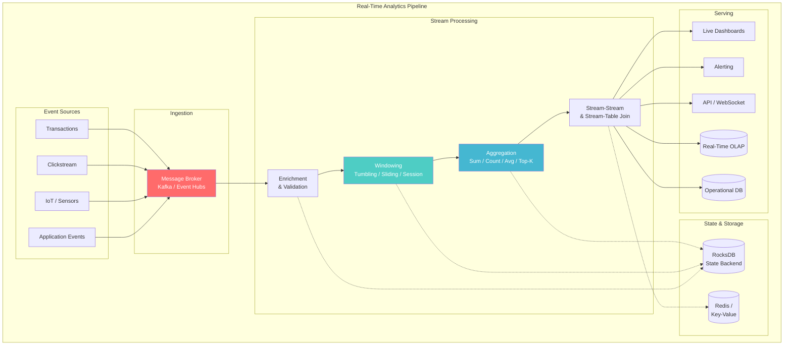
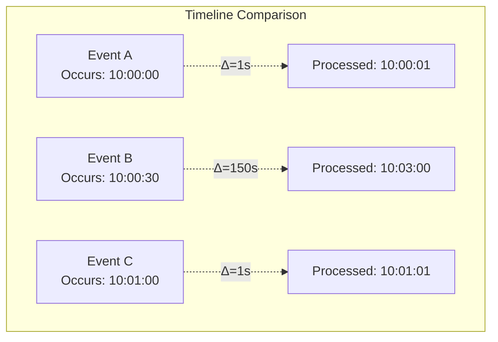
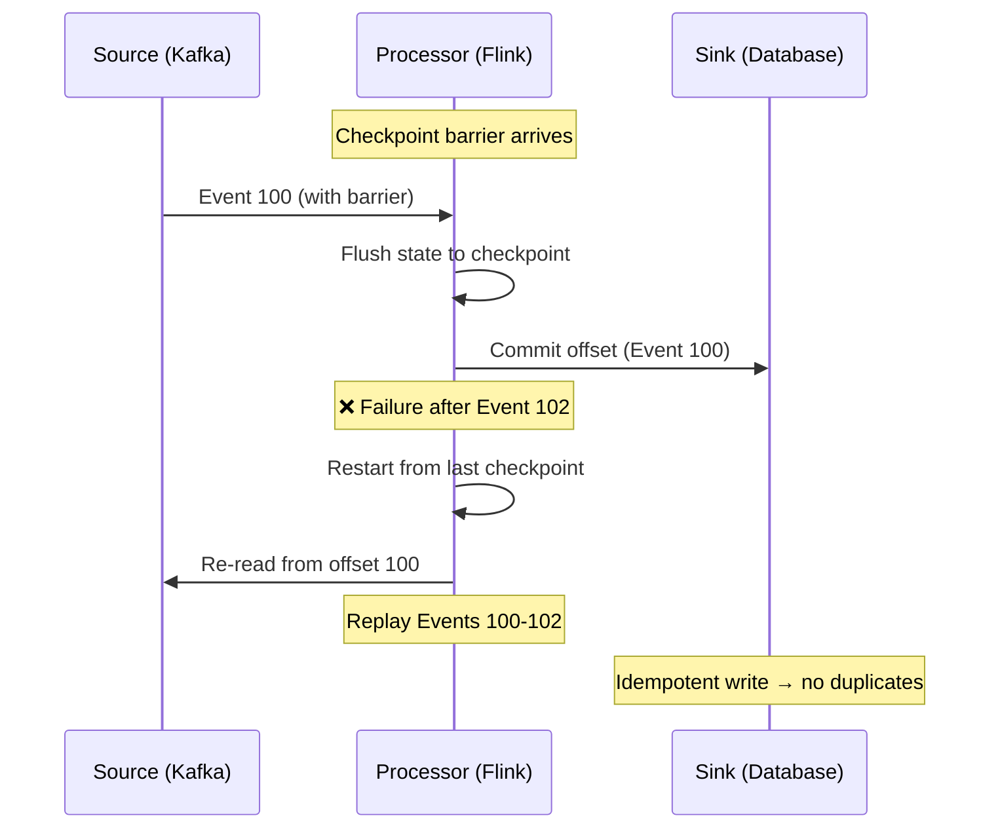
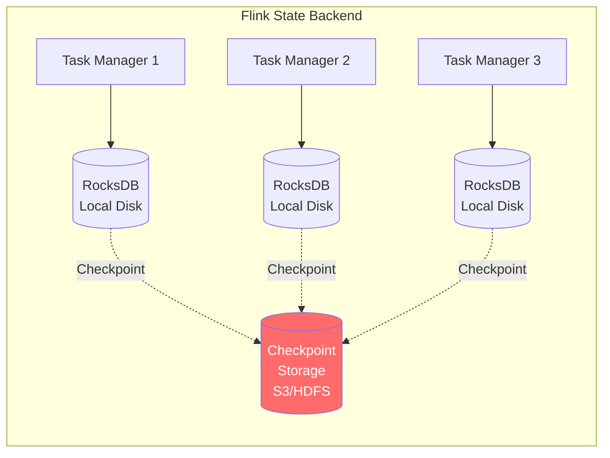

# Real-Time Analytics Architecture

> **Taxonomy Reference**: §4.3 Streaming & Real-Time Architecture

## Overview

Real-Time Analytics Architecture enables **sub-second insights** on live data streams — processing, enriching, and aggregating events as they arrive rather than waiting for batch windows. It powers fraud detection, live dashboards, real-time personalization, and operational monitoring.

## Table of Contents

- [Core Concepts](#core-concepts)
- [Architecture Diagram](#architecture-diagram)
- [Event Time vs Processing Time](#event-time-vs-processing-time)
- [Windowing Strategies](#windowing-strategies)
- [Watermarks & Late Data](#watermarks-late-data)
- [Exactly-Once Semantics](#exactly-once-semantics)
- [State Management](#state-management)
- [Performance Patterns](#performance-patterns)
- [Related Patterns](#related-patterns)

## Core Concepts

| Concept | Description | Analogy |
|---------|-------------|---------|
| **Event Time** | When the event actually occurred | Timestamp on a security camera |
| **Processing Time** | When the system observed the event | When you review the footage |
| **Watermark** | Threshold for "how late is too late" | Cutoff for accepting delayed footage |
| **Windowing** | Grouping events into time buckets | Summarizing footage by hour |
| **State** | Accumulated knowledge across events | Your understanding after watching hours of footage |

## Architecture Diagram



## Event Time vs Processing Time



| Aspect | Event Time | Processing Time |
|--------|-----------|-----------------|
| **Definition** | When event actually happened | When system observes event |
| **Determinism** | Deterministic (replay gives same result) | Non-deterministic (depends on system speed) |
| **Out-of-order** | Caused by network, partitioning, clock skew | Always in order |
| **Late data** | Common (mobile, IoT, cross-region) | Never "late" |
| **Best for** | Correctness, reproducibility | Latency-sensitive alerting |

## Windowing Strategies

### Window Types

```mermaid
gantt
    title Windowing Strategies
    dateFormat HH:mm
    axisFormat %H:%M

    section Tumbling (Fixed)
    Window 1 :w1, 10:00, 5m
    Window 2 :w2, after w1, 5m
    Window 3 :w3, after w2, 5m

    section Sliding (Overlapping)
    Win 1 :s1, 10:00, 10m
    Win 2 :s2, 10:05, 10m
    Win 3 :s3, 10:10, 10m

    section Session (Gap-based)
    Session A :a1, 10:00, 8m
    Session B :a2, 10:20, 5m
```



| Window Type | Description | Use Case | Example |
|-------------|-------------|----------|---------|
| **Tumbling** | Fixed-size, non-overlapping, aligned to clock | Hourly aggregations | `COUNT(*)` every 5 minutes |
| **Sliding** | Fixed-size, overlapping, slides by interval | Moving averages | `AVG(price)` over last 10 min, updated every 1 min |
| **Session** | Dynamic-size, bounded by inactivity gap | User sessions | Group clicks until 30 min of inactivity |
| **Global** | Single window over all time (rare) | Cumulative counters | Total events since start |

### Window Comparison

| Dimension | Tumbling | Sliding | Session |
|-----------|----------|---------|---------|
| **Compute cost** | O(n/windows) | Higher (overlap) | Variable |
| **Latency** | Window-end boundary | Slide interval | Gap timeout |
| **Storage** | Keeps 1 window state | Keeps multiple | Keeps until gap |
| **Accuracy** | Exact | Exact | Approximate (gap heuristic) |
| **Late data** | Can update past windows | Can update past windows | Harder (sessions may merge) |

## Watermarks & Late Data

### Watermark Heuristic

```
Watermark = max(event_time_seen) - allowed_lateness_threshold

Example:
  Max event time seen:  10:05:00
  Allowed lateness:      2 minutes
  ─────────────────────────────────
  Watermark:             10:03:00
  → All events with event_time < 10:03:00 are considered "on time"
  → Events with event_time ≥ 10:03:00 are "late" (still accepted)
  → Events with event_time < 10:03:00 - lateness_margin are "dropped"
```

### Late Data Handling

```python
# Conceptual Flink-style late data handling
stream
    .key_by(event -> event.user_id)
    .window(TumblingEventTimeWindows.of(Time.minutes(5)))
    .allowed_lateness(Time.minutes(10))      # Accept late data
    .side_output_late_data(late_output_tag)   # Very late → side output
    .aggregate(my_aggregation)
```

| Strategy | Description | Trade-off |
|----------|-------------|-----------|
| **Drop late data** | Ignore events past watermark | Simpler, but data loss |
| **Update results** | Re-emit updated window results | Accurate, but consumers must handle updates |
| **Side output** | Route late data to separate sink | No loss, but requires separate handling |
| **Allowed lateness** | Buffer state for N minutes past window | Balances accuracy and state size |

## Exactly-Once Semantics



| Guarantee | Meaning | Implementation |
|-----------|---------|----------------|
| **At-most-once** | No duplicates, but data may be lost | No retries, fire-and-forget |
| **At-least-once** | No data loss, but duplicates possible | Retries without dedup |
| **Exactly-once** | No loss, no duplicates | Checkpointing + idempotent sinks + transactional sources |

> **Note**: "Exactly-once" in stream processing typically means **effectively-once** — the system may process an event multiple times, but the end result is as if it was processed exactly once.

## State Management

### State Backend Architecture



| State Type | Description | Example |
|------------|-------------|---------|
| **Keyed State** | State per key in keyed stream | Running count per user |
| **Operator State** | State per operator instance | Kafka offset for partition |
| **Broadcast State** | State replicated to all instances | Configuration, ML model |

### State Size Management

| Strategy | Description |
|----------|-------------|
| **TTL (Time-to-Live)** | Auto-expire state after inactivity |
| **RocksDB** | Disk-backed state for large state > memory |
| **Key partitioning** | Distribute state across more parallelism |
| **State cleanup** | Remove state for inactive keys/windows |

## Performance Patterns

### 1. Key Skew Mitigation

```python
# Split hot keys with artificial salt
def add_salt(key, salt_range=10):
    if is_hot_key(key):
        return f"{key}__{random.randint(0, salt_range)}"
    return key

# Aggregate with salt, then re-aggregate
stream
    .map(add_salt)
    .key_by(...)
    .window(...)
    .aggregate(...)
    .key_by(strip_salt)
    .reduce(merge)
```

### 2. Backpressure Handling

```
Producer → [Kafka Buffer] → Consumer
             ↗                ↓
     Buffer fills → Slow down → Process faster or scale
```

### 3. Micro-batching

Group small events into micro-batches (100ms–1s) to amortize per-event overhead:

| Approach | Latency | Throughput | Complexity |
|----------|---------|------------|------------|
| **Per-event** | Lowest | Lowest | Simple |
| **Micro-batch** | Low (100ms–1s) | High | Moderate |
| **Batch** | High (minutes) | Highest | Moderate |

## Related Patterns

- [Stream Processing Architecture](02-stream-processing-architecture.md) — Stream processor topologies and frameworks
- [Change Data Capture (CDC)](03-change-data-capture.md) — Database change streams
- [Lambda Architecture](../02-analytics-architecture/04-lambda-architecture.md) — Speed layer
- [Kappa Architecture](../02-analytics-architecture/05-kappa-architecture.md) — Stream-only architecture

> **Azure Implementation**: See [Azure Stream Analytics](../../../architecture-azure/integration/) (managed stream processing), [Azure Event Hubs](../../../architecture-azure/integration/) (event ingestion), and [Azure Databricks Structured Streaming](../../../architecture-azure/data/).
