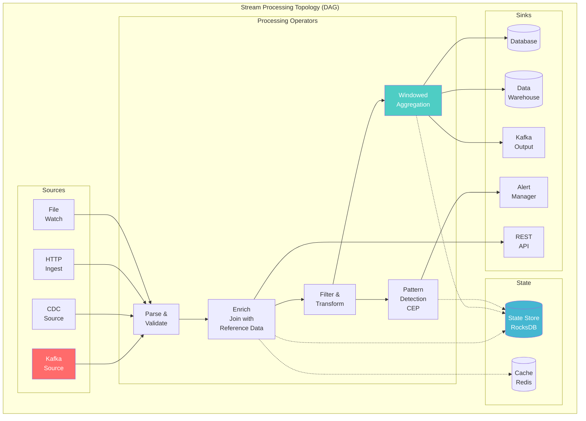
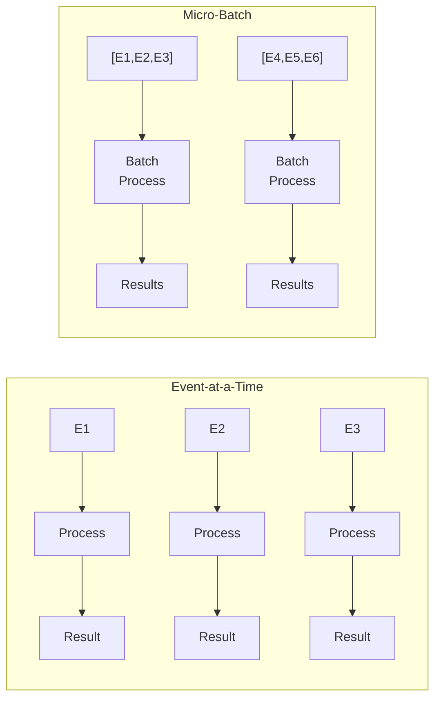
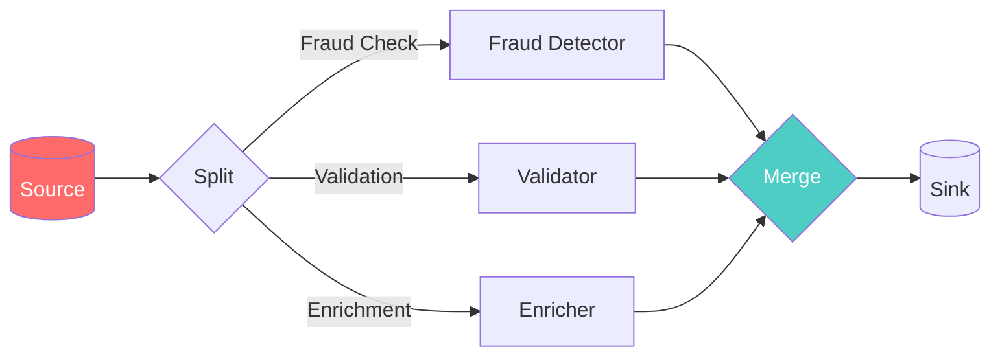
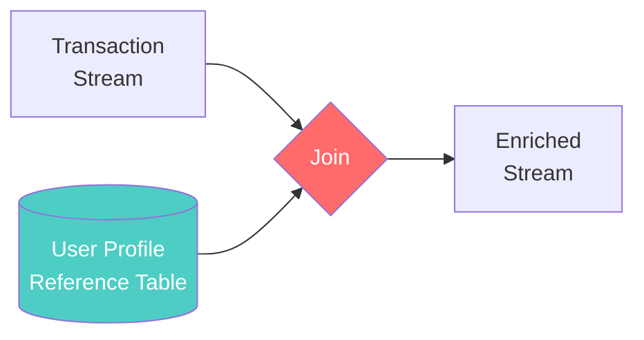
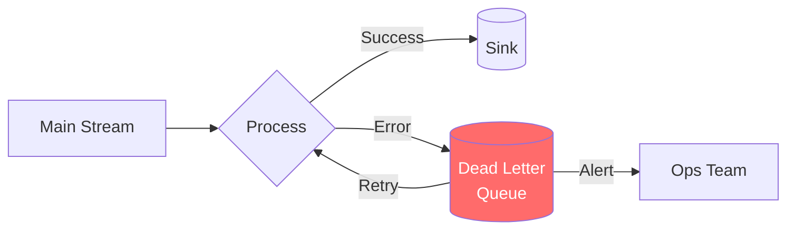
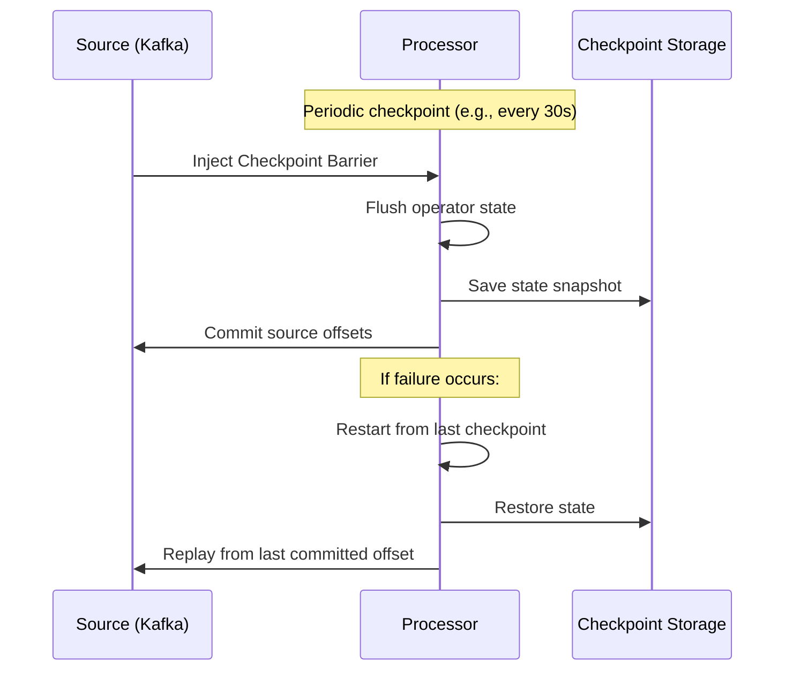
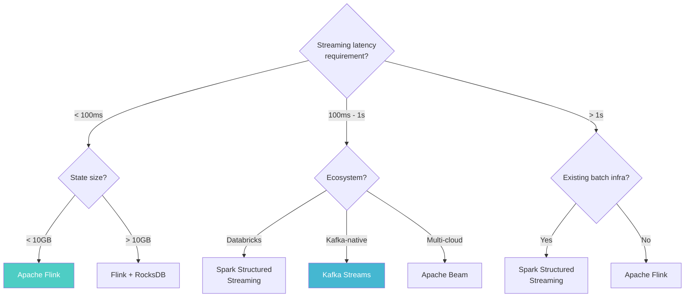

# Stream Processing Architecture

> **Taxonomy Reference**: §4.3 Streaming & Real-Time Architecture

## Overview

Stream Processing Architecture defines how to build systems that **continuously process unbounded streams of events** — transforming, enriching, aggregating, and routing data in real-time. Unlike batch processing (finite, bounded datasets), stream processing handles data that arrives continuously, often with no defined end.

## Table of Contents

- [Core Concepts](#core-concepts)
- [Architecture Diagram](#architecture-diagram)
- [Processing Models](#processing-models)
- [Framework Comparison](#framework-comparison)
- [Stateful vs Stateless Processing](#stateful-vs-stateless-processing)
- [Topology Patterns](#topology-patterns)
- [Event Time & Ordering](#event-time-ordering)
- [Fault Tolerance](#fault-tolerance)
- [Decision Framework](#decision-framework)
- [Related Patterns](#related-patterns)

## Core Concepts

| Concept | Description |
|---------|-------------|
| **Event Stream** | Unbounded sequence of event records |
| **Topology** | Directed graph of processing operators (DAG) |
| **Operator** | A processing step: map, filter, window, join, aggregate |
| **Keying** | Partitioning stream by key for parallel processing |
| **Checkpointing** | Consistent snapshot of state for fault recovery |
| **Backpressure** | Flow control when consumers are slower than producers |

## Architecture Diagram



## Processing Models

### Event-at-a-Time vs Micro-Batch



| Dimension | Event-at-a-Time | Micro-Batch |
|-----------|----------------|-------------|
| **Latency** | Sub-millisecond | 100ms–1s |
| **Throughput** | Lower per-event overhead | Higher (amortized) |
| **Complexity** | Higher (state management) | Lower (batch-like) |
| **Examples** | Flink, Kafka Streams | Spark Structured Streaming |
| **Exactly-once** | More complex | Simpler (batch boundaries) |

### True Streaming vs Micro-Batch

| Framework | Model | Latency | Exactly-Once | State Management |
|-----------|-------|---------|--------------|-----------------|
| **Apache Flink** | True streaming | ms | Yes (checkpointing) | RocksDB, Heap |
| **Kafka Streams** | True streaming | ms | Yes (transactions) | RocksDB |
| **Spark Structured Streaming** | Micro-batch | 100ms+ | Yes (WAL + idempotent sinks) | In-memory + WAL |
| **Apache Storm** | True streaming | ms | At-least-once | External (Redis) |
| **Apache Beam** | Portable (runs on Flink/Spark) | Varies | Varies by runner | Runner-dependent |
| **RisingWave** | True streaming | ms | Yes | Cloud-native state |

## Framework Comparison

### Apache Flink

```
Strengths:
✓ True streaming (not micro-batch)
✓ Rich windowing (tumbling, sliding, session, global)
✓ Sophisticated watermarks for late data
✓ Savepoints for state migration
✓ Exactly-once guarantee
✓ SQL, Table API, DataStream API
✓ Battle-tested at scale (Alibaba, Netflix, Uber)

Best for: Complex event processing, exactly-once, large state
```

### Kafka Streams

```
Strengths:
✓ Lightweight Java library (no cluster needed)
✓ Kafka-native (leverages Kafka for everything)
✓ Interactive queries (query state from outside)
✓ Exactly-once via Kafka transactions
✓ Simple deployment (just a JAR)

Best for: Kafka-centric microservices, simple pipelines
```

### Spark Structured Streaming

```
Strengths:
✓ Unified batch + streaming API
✓ Rich ecosystem (MLlib, GraphX)
✓ Delta Lake integration
✓ Strong community

Best for: Databricks shops, ML + streaming, Delta Lake
```

## Stateful vs Stateless Processing

### Stateless Operations

```python
# No memory of past events
stream
    .map(event -> enrich_with_ip_geolocation(event))  # Transform
    .filter(event -> event.amount > 1000)              # Filter
    .flat_map(event -> event.items)                    # Expand
```

| Operation | Description | No State? |
|-----------|-------------|-----------|
| **Map** | 1:1 transformation | ✅ Stateless |
| **Filter** | Keep/discard predicate | ✅ Stateless |
| **FlatMap** | 1:N transformation | ✅ Stateless |
| **Split** | Route to different streams | ✅ Stateless |

### Stateful Operations

```python
# Memory of past events
stream
    .key_by(event -> event.user_id)
    .window(TumblingEventTimeWindows.of(Time.minutes(5)))
    .aggregate(new SumAggregator())                     # Accumulate
    .process(new TopKFunction(10))                      # Maintain top-k
```

| Operation | Description | State |
|-----------|-------------|-------|
| **Windowed Aggregation** | SUM/AVG/COUNT over time | Window buffer |
| **Join** | Combine two streams | Buffer both sides |
| **Pattern Detection (CEP)** | Match event sequences | NFA state machine |
| **Deduplication** | Remove duplicate events | Set of seen keys |
| **Sessionization** | Group events into sessions | Active sessions |
| **Top-K** | Maintain top-K list | Priority queue |

## Topology Patterns

### Pattern 1: Fan-Out / Fan-In



### Pattern 2: Stream-Table Join



### Pattern 3: Dead Letter Queue



## Event Time & Ordering

For detailed coverage of event time, processing time, watermarks, and windowing, see [Real-Time Analytics Architecture](01-real-time-analytics-architecture.md).

## Fault Tolerance

### Checkpointing



| Mechanism | Description | Framework |
|-----------|-------------|-----------|
| [**Chandy-Lamport Algorithm**](../../../../reference-dictionary/data-concurrency.md#chandy-lamport-algorithm) | Distributed snapshot via barriers | Flink |
| **Write-Ahead Log (WAL)** | Log every state change before processing | Spark |
| **Kafka Transactions** | Atomic write + offset commit | Kafka Streams |
| **Savepoints** | User-triggered snapshot (for upgrades) | Flink |

## Decision Framework



## Stream Processing vs Kappa Architecture

### The Misconception

**Stream processing** and **Kappa Architecture** are often conflated, but they address **different layers** of the architecture stack:

| | Stream Processing | Kappa Architecture |
|---|---|---|
| **What it is** | A **processing paradigm** — how you transform data | An **architectural pattern** — how you organize your entire data platform |
| **Answers** | "How do I process events as they arrive?" | "How do I build a complete data system without a separate batch layer?" |
| **Scope** | One component (the processing engine) | End-to-end: ingestion → processing → serving → reprocessing |

### The Relationship

```
Kappa Architecture
┌─────────────────────────────────────────────────────────────┐
│  ┌──────────────────┐     ┌──────────────────┐              │
│  │   Ingestion       │────▶│ Stream Processing │────▶ Serving │
│  │   (Kafka)         │     │  (Flink / KS)     │              │
│  └──────────────────┘     └──────────────────┘              │
│           │                        │                         │
│           └────────────────────────┤                         │
│                                    ▼                         │
│                          ┌──────────────────┐               │
│                          │ Immutable Event  │               │
│                          │ Log (Kafka)      │               │
│                          │ = Source of Truth │               │
│                          └──────────────────┘               │
│                                    │                         │
│                          Reprocess entire history            │
│                          when logic changes                  │
└─────────────────────────────────────────────────────────────┘
```

**Stream processing is the engine. Kappa Architecture is the system design around it.**

### Key Distinctions

| Dimension | Stream Processing | Kappa Architecture |
|-----------|------------------|-------------------|
| **Core Idea** | Process events as they arrive | All data is a stream; batch = replay of the stream |
| **Batch Jobs** | Not applicable (handles streams) | **No separate batch layer** — batch is just streaming over historical data |
| **Historical Reprocessing** | Not natively supported | **Built-in** — replay the immutable log from $t_0$ to $t_{now}$ |
| **Single Source of Truth** | Optional (varies by framework) | **Mandatory** — Kafka serves as the durable event log |
| **State Evolution** | Framework-dependent (savepoints in Flink) | **Integral** — schema registry, event versioning, compatible evolution |
| **Operational Complexity** | Lower (one component) | Higher (Kafka + processing + schema registry + monitoring) |

### When They Align — And When They Don't

```
Stream Processing WITHOUT Kappa (common):
┌──────────┐     ┌──────────┐     ┌──────────┐
│  Kafka   │────▶│  Flink   │────▶│  Redis   │   ← Real-time
└──────────┘     └──────────┘     └──────────┘
                                   
┌──────────┐     ┌──────────┐     ┌──────────┐
│   S3     │────▶│  Spark   │────▶│  Hive    │   ← Batch
└──────────┘     └──────────┘     └──────────┘
              TWO SYSTEMS. TWO CODEBASES.

Stream Processing WITH Kappa:
┌──────────┐     ┌──────────┐     ┌──────────┐
│  Kafka   │────▶│  Flink   │────▶│  Serving │   ← Real-time & Batch
│(immutable│     │(unified  │     │  Layer   │       (same codebase)
│   log)   │     │ engine)  │     └──────────┘
└──────────┘     └──────────┘
     ▲                │
     └──Reprocess─────┘  (replay log from any offset)
         for historical jobs
              ONE SYSTEM. ONE CODEBASE.
```

### Decision Table

| Scenario | Stream Processing Alone | Kappa Architecture |
|----------|------------------------|--------------------|
| Real-time dashboard | ✅ Perfect fit | Overkill — just stream processing is enough |
| Real-time + need to recompute last month's metrics when you fix a bug | ❌ No native mechanism | ✅ Replay Kafka log from target offset |
| Model retraining on historical data | ❌ Requires separate batch system | ✅ Same Flink job, pointed at historical time window |
| Simple 3-service notification pipeline | ✅ Simpler, lower ops cost | ❌ Adds complexity without benefit |
| Multi-tenant SaaS with per-customer reprocessing | ❌ Manual per-customer batching | ✅ Per-partition replay from specific offsets |
| Event sourcing + CQRS | ❌ Query side not addressed | ✅ Immutable log + stream processing = CQRS backbone |

### The Framing from Flink's Creator

> *"A bounded data set is a special case of an unbounded data stream that happens to end."* — Carbone et al., Apache Flink Paper (2015)

This is the philosophical bridge between stream processing and Kappa Architecture:
- **Stream processing** says: "I can handle unbounded data."
- **Kappa Architecture** says: "Therefore I don't need a separate batch system — batch is just a bounded stream."

Flink is the engine that makes Kappa practical. Without a unified engine that handles both pipelined (streaming) and blocked (batch) data exchange using the same code, Kappa Architecture would require you to fake batch by running a stream job over historical data — which is far less efficient than native batch execution.

### When Kappa Isn't the Answer

| Situation | Better Alternative |
|-----------|-------------------|
| Ad-hoc analytical queries (no streaming need) | Standard data warehouse (Snowflake, BigQuery) |
| Small data volume, infrequent updates | Simple batch pipeline (cron + Python) |
| Existing Lambda Architecture works well, team is small | Don't migrate — Kappa adds Kafka ops complexity |
| ML training pipelines that don't need real-time | Spark/Databricks batch jobs — simpler to reason about |
| Strict cost control (Kafka retention = ongoing storage cost) | Lambda with S3/ADLS for long-term retention |

> **The Rule**: Stream processing is a tool. Kappa Architecture is a commitment. Use stream processing everywhere it makes sense. Adopt Kappa Architecture only when the **operational cost of maintaining two codebases exceeds the operational cost of maintaining Kafka as your source of truth.**

## Related Patterns

- [Real-Time Analytics Architecture](01-real-time-analytics-architecture.md) — Windowing, watermarks, state
- [Change Data Capture (CDC)](03-change-data-capture.md) — Database change events
- [Kappa Architecture](../02-analytics-architecture/05-kappa-architecture.md) — Stream-only processing paradigm
- [Lambda Architecture](../02-analytics-architecture/04-lambda-architecture.md) — Batch + stream

> **Azure Implementation**: See [Azure Stream Analytics](../../../architecture-azure/integration/) (managed stream processing, SQL-based), [Azure Event Hubs](../../../architecture-azure/integration/) (event ingestion), [Azure Databricks](../../../architecture-azure/data/) (Spark Structured Streaming), and [HDInsight Kafka](../../../architecture-azure/integration/).
