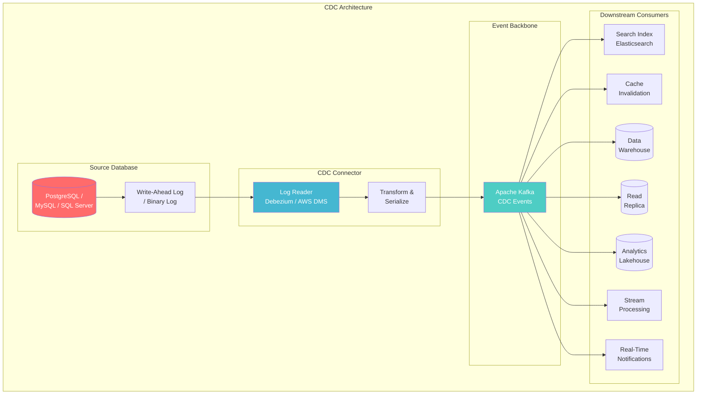
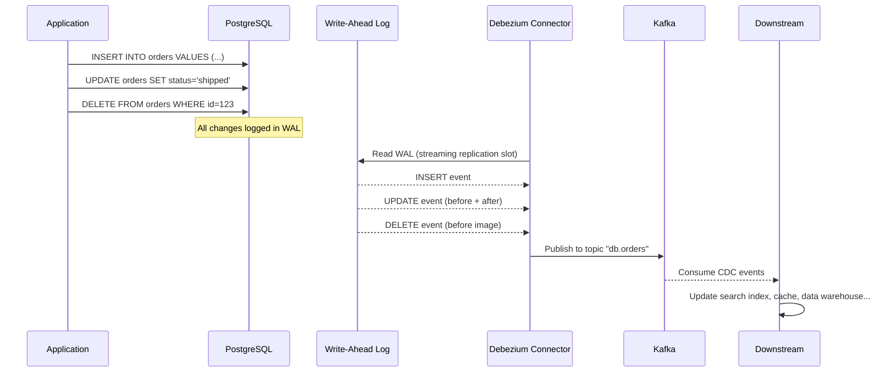
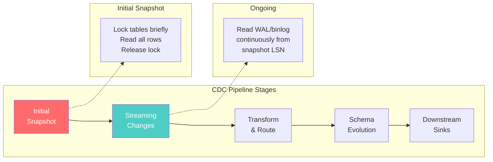
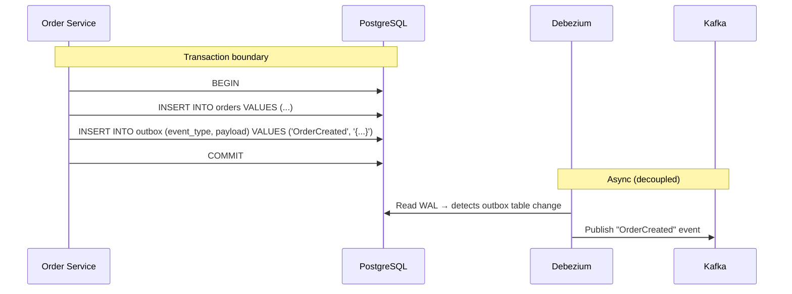
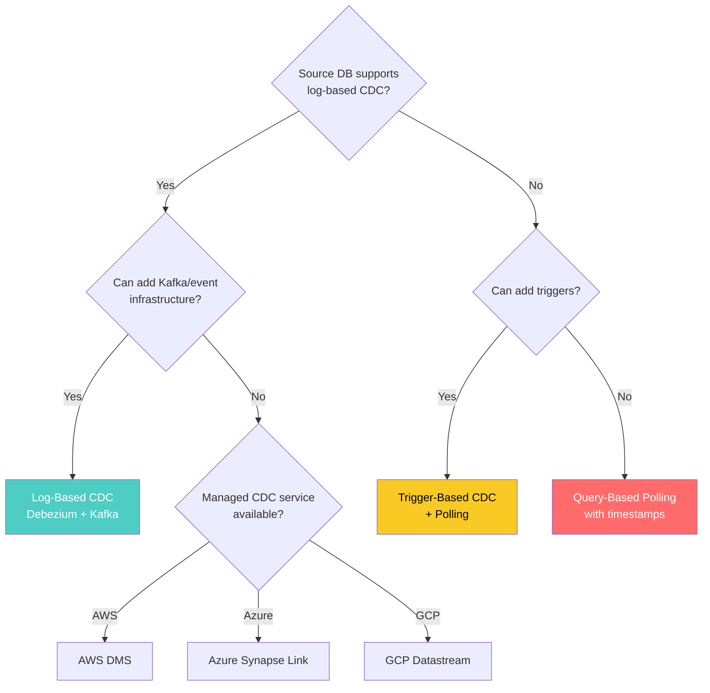

# Change Data Capture (CDC)

> **Taxonomy Reference**: §4.3 Streaming & Real-Time Architecture

## Overview

Change Data Capture (CDC) is a pattern for **detecting and propagating data changes** from a source database to downstream systems in near real-time. Instead of periodic bulk extracts, CDC captures row-level insert, update, and delete operations as they occur, enabling event-driven data pipelines.

## Table of Contents

- [Core Concepts](#core-concepts)
- [Architecture Diagram](#architecture-diagram)
- [CDC Approaches](#cdc-approaches)
- [CDC Pipeline Flow](#cdc-pipeline-flow)
- [Pattern: Outbox Pattern](#pattern-outbox-pattern)
- [CDC with Event Sourcing](#cdc-with-event-sourcing)
- [Challenges & Mitigations](#challenges-mitigations)
- [Decision Framework](#decision-framework)
- [Related Patterns](#related-patterns)

## Core Concepts

```
Traditional ETL:                      CDC:
┌─────────┐    ┌─────────┐           ┌─────────┐
│ Source  │───→│ Target  │           │ Source  │──→ [INSERT] new row
│  DB     │    │  DB     │           │  DB     │──→ [UPDATE] row modified
└─────────┘    └─────────┘           │         │──→ [DELETE] row removed
                                     └─────────┘
  "Give me everything"              "Tell me what changed"
  Periodic full load                  Continuous, incremental
  Latency: hours                      Latency: seconds
```

## Architecture Diagram



## CDC Approaches

### Comparison

| Approach | How It Works | Overhead | Latency | Completeness |
|----------|-------------|----------|---------|--------------|
| **Log-Based** | Read database transaction log (WAL/binlog) | Very low | ms | Complete (all changes) |
| **Trigger-Based** | DB triggers on tables write to shadow table | High | ms | Complete |
| **Query-Based (Polling)** | Periodically query with `updated_at > last_run` | Medium | Minutes | Missing intermediate states |
| **Timestamp/Version Column** | Query by `version` or `last_modified` | Medium | Minutes | Misses deletes (soft-delete only) |

### Log-Based CDC (Recommended)



### CDC Event Structure

```json
{
  "before": null,
  "after": {
    "id": 1001,
    "customer_id": 42,
    "amount": 99.99,
    "status": "created",
    "created_at": "2024-01-15T10:30:00Z"
  },
  "source": {
    "version": "2.5.0",
    "connector": "postgresql",
    "name": "orders_db",
    "ts_ms": 1705312200000,
    "snapshot": "false",
    "db": "ecommerce",
    "schema": "public",
    "table": "orders",
    "txId": 5678,
    "lsn": 24023128
  },
  "op": "c",           // c=create, u=update, d=delete, r=read (snapshot)
  "ts_ms": 1705312200500
}
```

## CDC Pipeline Flow



### Schema Evolution

When source schema changes, CDC must handle it gracefully:

```yaml
# Debezium schema change event
{
  "source": { "table": "orders", ... },
  "databaseName": "ecommerce",
  "schemaName": "public",
  "ddl": "ALTER TABLE orders ADD COLUMN discount DECIMAL(5,2)",
  "tableChanges": [...]
}
```

| Schema Change | CDC Behavior | Consumer Action |
|---------------|--------------|-----------------|
| **ADD COLUMN** | New field in after-image | Schema registry updates, consumer adapts |
| **DROP COLUMN** | Field absent from new events | Consumer handles null/missing gracefully |
| **ALTER TYPE** | May break serialization | Requires consumer migration |
| **RENAME TABLE** | New topic (or reconfiguration) | Route to appropriate sink |

## Pattern: Outbox Pattern

When using CDC with microservices, the **Outbox Pattern** ensures reliable event publication:



| Aspect | Outbox Pattern | Direct Kafka Publish |
|--------|---------------|---------------------|
| **Consistency** | Guaranteed (same transaction) | Possible inconsistency (dual-write problem) |
| **Complexity** | Higher (outbox table + cleanup) | Lower |
| **Reliability** | High (CDC guarantees delivery) | Medium (network can fail between DB and Kafka) |
| **Latency** | Slightly higher (CDC polling) | Lower |

## CDC with Event Sourcing

CDC complements the Event Sourcing pattern:

| Pattern | CDC Role |
|---------|----------|
| **CQRS Read Model** | Project writes → optimized read models |
| **Search Index Sync** | Keep Elasticsearch in sync with primary DB |
| **Cache Invalidation** | Publish cache invalidation events on data change |
| **Data Warehouse ETL** | Feed DW incrementally instead of bulk loads |
| **Audit Logging** | Capture every change for compliance |
| **Multi-Region Replication** | Replicate changes across regions |

## Challenges & Mitigations

| Challenge | Mitigation |
|-----------|------------|
| **Schema changes break consumers** | Schema registry (Avro/Protobuf), backward-compatible changes |
| **High WAL retention** | Auto-cleanup, monitor replication slot lag |
| **Initial snapshot impact** | Use read replicas, off-peak snapshot |
| **Large transactions** | Debezium chunks large txns, monitor for lag |
| **DDL changes** | Schema change events, consumer compatibility checks |
| **Topic proliferation** | Topic routing strategies, logical replication |
| **Missing deletes (query-based)** | Use log-based CDC, or soft-delete pattern |

## Decision Framework



## Related Patterns

- [Stream Processing Architecture](02-stream-processing-architecture.md) — Processing CDC events
- [Real-Time Analytics Architecture](01-real-time-analytics-architecture.md) — Windowing and aggregation on CDC streams
- [Event Sourcing / CQRS](../../02-application-software-architecture/06-design-patterns/) — CDC as event source
- [Kappa Architecture](../02-analytics-architecture/05-kappa-architecture.md) — CDC as immutable event log
- [OLTP Architecture](../01-data-architecture/01-oltp-architecture.md) — Source database considerations

> **Azure Implementation**: See [Azure Synapse Link](../../../architecture-azure/data/) (near-real-time CDC to Synapse), [Azure Data Factory](../../../architecture-azure/data/data-factory/) (CDC with change tracking), [Azure SQL Managed Instance CDC](https://learn.microsoft.com/en-us/azure/azure-sql/), and [Debezium on Azure](https://debezium.io/) for open-source log-based CDC.
