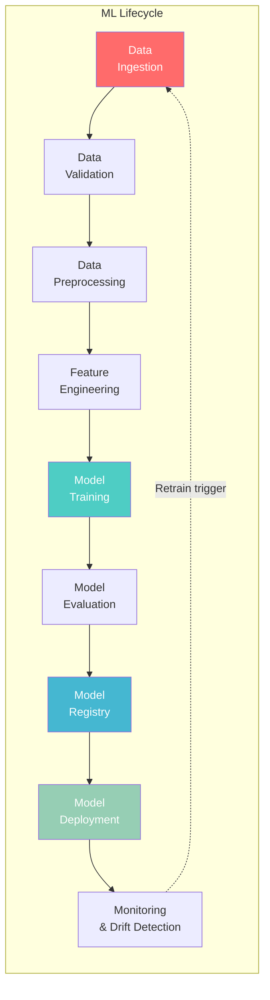
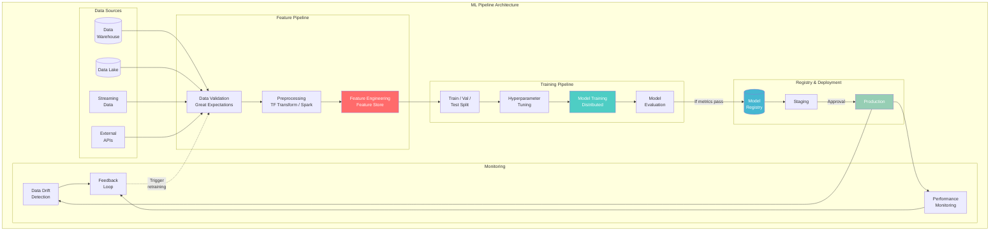
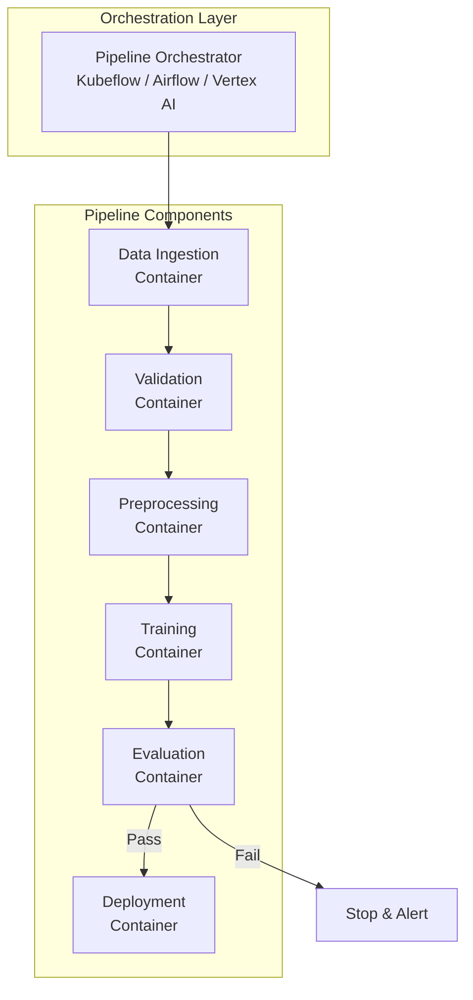
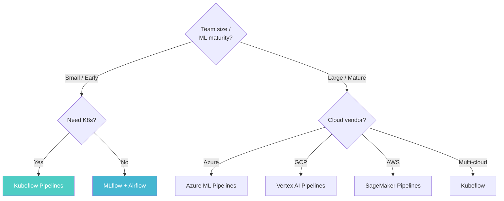

# Machine Learning Pipeline Architecture

> **Taxonomy Reference**: §4.4 AI / ML Architecture

## Overview

A Machine Learning Pipeline is an end-to-end, automated workflow that orchestrates the full ML lifecycle — from raw data ingestion through model deployment. It ensures reproducibility, scalability, and maintainability of ML systems by codifying each stage as a repeatable, versioned component.

## Table of Contents

- [ML Lifecycle Stages](#ml-lifecycle-stages)
- [Architecture Diagram](#architecture-diagram)
- [Pipeline Stages Deep Dive](#pipeline-stages-deep-dive)
- [Pipeline Orchestration](#pipeline-orchestration)
- [Data & Model Versioning](#data-model-versioning)
- [Training Pipeline vs Inference Pipeline](#training-pipeline-vs-inference-pipeline)
- [Decision Framework](#decision-framework)
- [Related Patterns](#related-patterns)

## ML Lifecycle Stages



## Architecture Diagram



## Pipeline Stages Deep Dive

### 1. Data Ingestion

| Source | Pattern | Tooling |
|--------|---------|---------|
| **Batch (Data Lake/Warehouse)** | Scheduled pulls, incremental loads | Spark, dbt, Airflow |
| **Streaming** | Continuous ingestion, windowed micro-batches | Kafka, Kinesis, Flink |
| **APIs** | REST/GraphQL pulls at pipeline start | Requests, custom connectors |
| **Databases** | CDC, direct query (read replicas) | Debezium, SQL connectors |

### 2. Data Validation

```python
# Great Expectations example
import great_expectations as ge

df = ge.read_csv("training_data.csv")

df.expect_column_values_to_not_be_null("user_id")
df.expect_column_values_to_be_between("age", 0, 120)
df.expect_column_values_to_be_in_set("country", ["US", "CA", "UK", ...])
df.expect_column_mean_to_be_between("transaction_amount", 10, 500)

# Validate and get report
results = df.validate()
if not results.success:
    raise DataValidationError(results.failures)
```

### 3. Feature Engineering

| Type | Description | Example |
|------|-------------|---------|
| **Numerical** | Scaling, binning, log transform | StandardScaler, bucketize |
| **Categorical** | One-hot, label, target encoding | pd.get_dummies, embeddings |
| **Text** | TF-IDF, word embeddings, BPE | BERT embeddings, SentencePiece |
| **Temporal** | Lag features, rolling windows | pandas rolling, tsfresh |
| **Cross-features** | Polynomial, interaction terms | FeatureCross, hashing trick |

> **Deep dive**: See [Feature Store Architecture](03-feature-store-architecture.md) for feature engineering at scale.

### 4. Model Training

> **Deep dive**: See [Model Training Architecture](04-model-training-architecture.md) for distributed training, HP tuning, and AutoML.

### 5. Model Evaluation

```python
# Beyond accuracy: comprehensive evaluation
metrics = {
    "accuracy": accuracy_score(y_true, y_pred),
    "precision": precision_score(y_true, y_pred, average='weighted'),
    "recall": recall_score(y_true, y_pred, average='weighted'),
    "f1": f1_score(y_true, y_pred, average='weighted'),
    "auc_roc": roc_auc_score(y_true, y_proba, multi_class='ovr'),
    # Fairness metrics
    "demographic_parity": demographic_parity_difference(...),
    "equal_opportunity": equal_opportunity_difference(...),
}

# Compare with previous model version
if new_model_f1 > current_model_f1 + threshold:
    promote_to_registry(new_model)
```

### 6. Model Registry

| Capability | Description |
|------------|-------------|
| **Versioning** | Track model versions, artifacts, metadata |
| **Stage transitions** | Staging → Production → Archived |
| **Metadata** | Training data hash, hyperparameters, metrics |
| **Approval gates** | CI/CD integration, manual approval |

## Pipeline Orchestration



| Orchestrator | Strengths | Best For |
|-------------|-----------|----------|
| **Kubeflow Pipelines** | Kubernetes-native, reusable components | K8s shops |
| **MLflow Pipelines** | Lightweight, integrated with MLflow | Smaller teams |
| **Airflow + ML** | General-purpose, huge ecosystem | Teams already using Airflow |
| **Vertex AI Pipelines** | Managed, serverless | GCP users |
| **Azure ML Pipelines** | Managed, Azure integration | Azure users |

## Data & Model Versioning

### DVC (Data Version Control)

```bash
# Track datasets like code
dvc add data/training.csv
git add data/training.csv.dvc
git commit -m "Add training dataset v1"

# Switch between dataset versions
git checkout v1.0
dvc checkout  # Restore dataset for v1.0
```

### Experiment Tracking

```python
import mlflow

mlflow.set_experiment("fraud-detection")

with mlflow.start_run():
    mlflow.log_param("learning_rate", 0.01)
    mlflow.log_param("max_depth", 7)
    mlflow.log_metric("f1_score", 0.92)
    mlflow.log_metric("auc_roc", 0.97)
    mlflow.sklearn.log_model(model, "model")
    mlflow.log_artifact("confusion_matrix.png")
```

## Training Pipeline vs Inference Pipeline

| Dimension | Training Pipeline | Inference Pipeline |
|-----------|------------------|-------------------|
| **Frequency** | Periodic (daily/weekly) | Continuous (per-request) |
| **Latency** | Hours | Milliseconds |
| **Data** | Historical, full dataset | Single record or micro-batch |
| **Compute** | GPU cluster | CPU (or single GPU) |
| **Output** | Model artifact | Prediction |
| **Versioning** | Model registry version | Model serving version |
| **Monitoring** | Training metrics, data drift | Prediction latency, throughput, accuracy |

## Decision Framework



## Related Patterns

- [MLOps Architecture](02-mlops-architecture.md) — CI/CD/CT for ML systems
- [Feature Store Architecture](03-feature-store-architecture.md) — Feature engineering platform
- [Model Training Architecture](04-model-training-architecture.md) — Distributed training deep-dive
- [Model Inference Architecture](05-model-inference-architecture.md) — Serving and deployment

> **Azure Implementation**: See [Azure Machine Learning](../../../architecture-azure/data/) (managed ML platform with pipelines, registry, and serving), [Azure Databricks ML](../../../architecture-azure/data/) (collaborative ML), and [MLflow on Azure](https://learn.microsoft.com/en-us/azure/machine-learning/).
