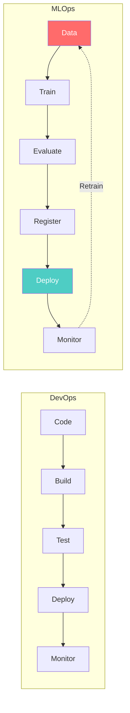
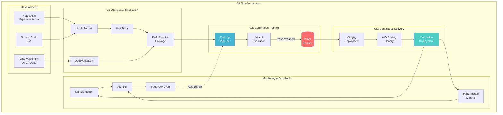
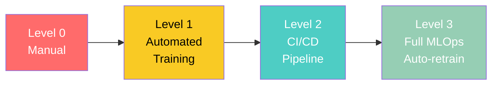
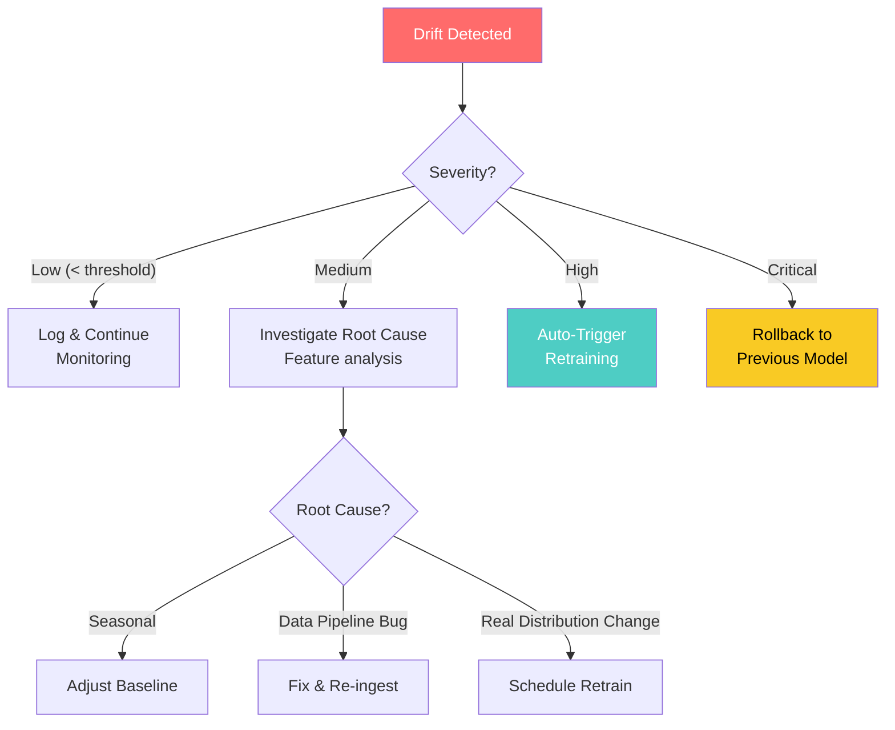
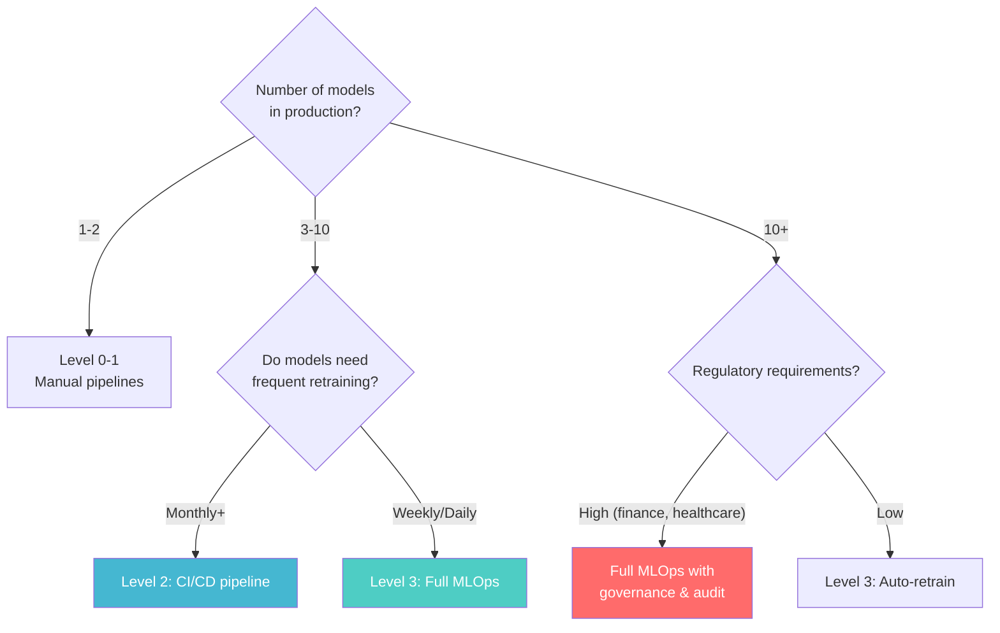

# MLOps Architecture

> **Taxonomy Reference**: §4.4 AI / ML Architecture

## Overview

MLOps (Machine Learning Operations) extends DevOps principles to machine learning systems — establishing **CI/CD/CT** (Continuous Integration, Delivery, and Training) pipelines for ML models. MLOps addresses the unique challenges of ML: data dependencies, model decay, experiment tracking, and the need for continuous retraining.

## Table of Contents

- [Core Principles](#core-principles)
- [MLOps vs DevOps](#mlops-vs-devops)
- [Architecture Diagram](#architecture-diagram)
- [CI/CD/CT Pipeline](#cicdct-pipeline)
- [Maturity Model](#maturity-model)
- [Model Monitoring & Drift](#model-monitoring-drift)
- [Governance & Compliance](#governance-compliance)
- [Decision Framework](#decision-framework)
- [Related Patterns](#related-patterns)

## Core Principles

| Principle | DevOps | MLOps |
|-----------|--------|-------|
| **Versioning** | Code | Code + Data + Model + Parameters |
| **Testing** | Unit, integration, E2E | + Data validation, model evaluation, fairness |
| **Deployment** | Binary/container | Model artifact + serving infrastructure |
| **Monitoring** | CPU, memory, latency | + Data drift, concept drift, prediction quality |
| **Rollback** | Redeploy previous version | Switch model version in registry |
| **Reproducibility** | Docker image, commit hash | + Data version, seed, hyperparameters |

## MLOps vs DevOps



## Architecture Diagram



## CI/CD/CT Pipeline

### Continuous Integration (CI)

```yaml
# Example: CI pipeline steps
ci_pipeline:
  steps:
    - lint:
        - black --check .
        - pylint src/
        - mypy src/

    - unit_test:
        - pytest tests/unit/ -v --cov

    - data_validation:
        - great_expectations checkpoint run training_data

    - build:
        - docker build -t ml-pipeline:${VERSION} .
        - docker push ml-pipeline:${VERSION}
```

### Continuous Training (CT)

CT is unique to MLOps — it automates the retraining pipeline:

```python
# Trigger conditions for CT
def should_retrain():
    triggers = []

    # Scheduled retraining (e.g., every Monday)
    if is_scheduled_time():
        triggers.append("scheduled")

    # Data drift detected
    if drift_score > threshold:
        triggers.append("data_drift")

    # Performance degradation
    if current_f1 < baseline_f1 - margin:
        triggers.append("performance_drop")

    # New data volume threshold
    if new_data_rows_since_last_train > 100000:
        triggers.append("new_data_volume")

    return len(triggers) > 0
```

### Continuous Delivery (CD)

| Strategy | Description | Rollback Speed |
|----------|-------------|---------------|
| **Shadow Deployment** | Mirror traffic to new model (no user impact) | Instant |
| **Canary Deployment** | Route X% of traffic to new model | Update routing |
| **A/B Testing** | Split traffic, compare business metrics | Update routing |
| **Blue/Green** | Full switch between old and new | Instant |
| **Multi-Armed Bandit** | Dynamically route to best-performing model | Automatic |

> **Deep dive on deployment strategies**: See [Model Inference Architecture](05-model-inference-architecture.md).

## Maturity Model



| Level | Characteristics | When |
|-------|----------------|------|
| **0: Manual** | Notebooks, manual deploy, no versioning | POC, exploration |
| **1: Automated Training** | Scripted training, experiment tracking, model registry | Small team, few models |
| **2: CI/CD Pipeline** | Automated build/test/deploy, monitoring | Multiple models, growing team |
| **3: Full MLOps** | Auto-retrain on drift, feature store, full governance | Enterprise, dozens of models |

### Level Migration Signals

| From → To | Signal |
|-----------|--------|
| 0 → 1 | "I can't reproduce last month's results" |
| 1 → 2 | "Deploying takes 2 days and something always breaks" |
| 2 → 3 | "We have 20 models and can't manually monitor them all" |

## Model Monitoring & Drift

### Types of Drift

| Drift Type | What Changes | Detection Method |
|------------|-------------|-----------------|
| **Data Drift** | Input feature distribution shifts | KS test, PSI, Jensen-Shannon divergence |
| **Concept Drift** | Relationship between features and target changes | Model performance degradation over time |
| **Prediction Drift** | Model output distribution shifts | Compare prediction distributions |
| **Feature Drift** | Individual feature statistics change | Mean, variance, quantile comparisons |

### Monitoring Dashboard

```
┌──────────────────────────────────────────────────────────┐
│  Model Monitoring Dashboard                               │
├──────────────────────────────────────────────────────────┤
│                                                           │
│  📊 Prediction Volume    ████████████ 12,345 req/s       │
│  ⏱️  P99 Latency          ████         45ms               │
│  🎯 Accuracy (7-day)     ████████     0.94 → 0.91 ⚠️     │
│  📉 Data Drift Score     ██████████   0.15 → 0.42 🔴     │
│  🔄 Days Since Retrain   ██           14 days            │
│                                                           │
│  ⚠️  ALERT: Data drift exceeding threshold (0.3)          │
│  💡 SUGGESTION: Trigger retraining pipeline               │
└──────────────────────────────────────────────────────────┘
```

### Drift Response



## Governance & Compliance

| Aspect | Implementation |
|--------|---------------|
| **Model Cards** | Document intended use, limitations, fairness evaluation |
| **Audit Trail** | Log all: data versions, training params, who deployed, when |
| **Fairness** | Measure demographic parity, equal opportunity across groups |
| **Explainability** | SHAP, LIME for feature importance; model cards for transparency |
| **Approval Gates** | Manual approval before production deployment |
| **Data Lineage** | Track data from source → feature → model → prediction |

## Decision Framework



## Related Patterns

- [Machine Learning Pipeline Architecture](01-machine-learning-pipeline-architecture.md) — End-to-end pipeline design
- [Model Training Architecture](04-model-training-architecture.md) — Training at scale
- [Model Inference Architecture](05-model-inference-architecture.md) — Production serving
- [Feature Store Architecture](03-feature-store-architecture.md) — Feature consistency

> **Azure Implementation**: See [Azure Machine Learning](../../../architecture-azure/data/) (managed MLOps with pipelines, registry, endpoints), [Azure DevOps](https://azure.microsoft.com/en-us/products/devops/) (CI/CD integration), and [Azure Monitor](https://learn.microsoft.com/en-us/azure/azure-monitor/) (drift detection and alerting).
