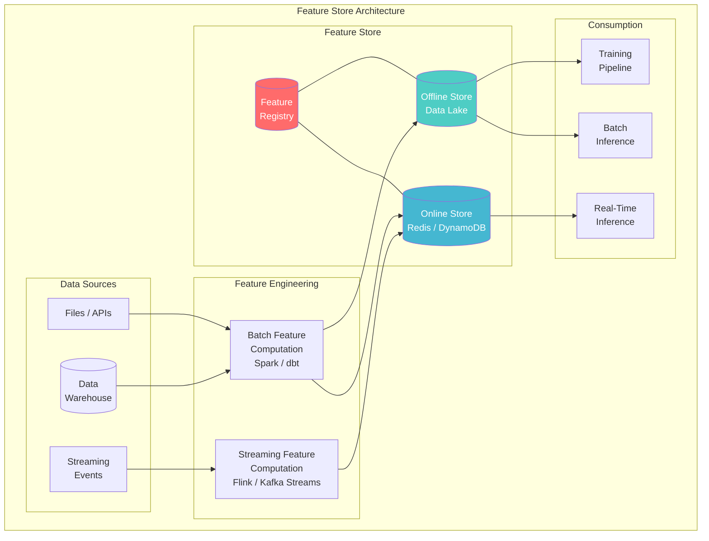
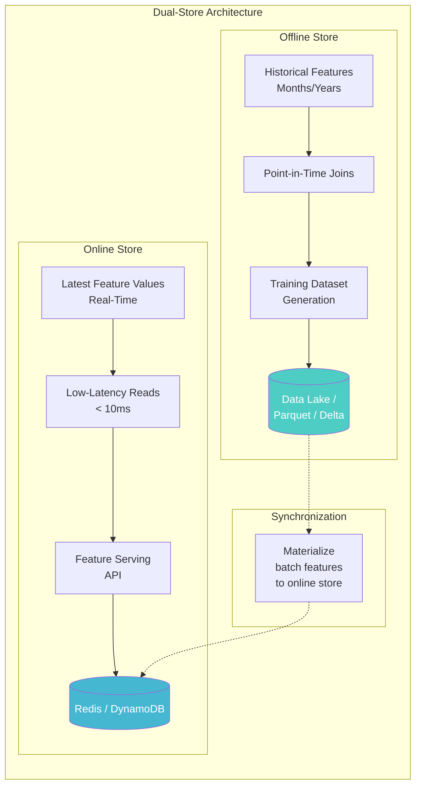
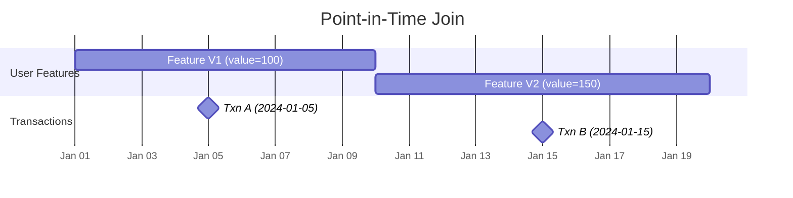
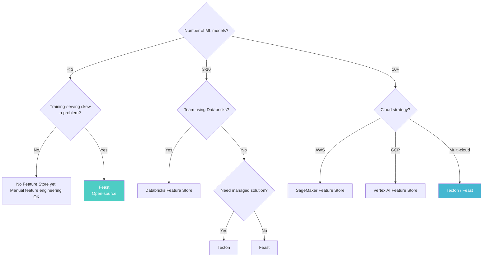

# Feature Store Architecture

> **Taxonomy Reference**: §4.4 AI / ML Architecture

## Overview

A Feature Store is a centralized platform for **defining, storing, serving, and governing ML features**. It bridges the gap between data engineering and ML by ensuring feature consistency across training and inference — eliminating training-serving skew and enabling feature reuse across teams.

## Table of Contents

- [Core Concepts](#core-concepts)
- [Architecture Diagram](#architecture-diagram)
- [Offline vs Online Store](#offline-vs-online-store)
- [Feature Engineering Pipeline](#feature-engineering-pipeline)
- [Point-in-Time Correctness](#point-in-time-correctness)
- [Training-Serving Skew](#training-serving-skew)
- [Feature Store Platforms](#feature-store-platforms)
- [Decision Framework](#decision-framework)
- [Related Patterns](#related-patterns)

## Core Concepts

| Concept | Description |
|---------|-------------|
| **Feature** | A measurable property used as ML model input (e.g., `user_avg_spend_7d`) |
| **Feature Group** | Logical grouping of related features (e.g., `user_features`, `product_features`) |
| **Feature View** | A query-ready combination of features from multiple groups |
| **Offline Store** | Historical feature data for training (data lake/warehouse) |
| **Online Store** | Low-latency feature values for real-time inference (KV store) |
| **Feature Registry** | Catalog of all features: definitions, ownership, lineage, statistics |

## Architecture Diagram



## Offline vs Online Store



| Dimension | Offline Store | Online Store |
|-----------|--------------|--------------|
| **Purpose** | Training, batch inference | Real-time inference |
| **Data** | Full history (months/years) | Latest values only |
| **Latency** | Seconds (Spark queries) | Milliseconds (KV lookup) |
| **Storage** | Data lake (Parquet/Delta) | Redis, DynamoDB, Cassandra |
| **Scale** | TB-PB | GB (latest values) |
| **Consistency** | Point-in-time snapshot | Eventually consistent |
| **Query** | Point-in-time join | Key lookup by entity ID |

## Feature Engineering Pipeline

```python
# Feature definition (conceptual)
@feature(
    name="user_avg_spend_7d",
    entity="user",
    description="Average spend per transaction over last 7 days",
    owner="growth-team",
    freshness="1 hour"
)
def user_avg_spend_7d(transactions: DataFrame) -> DataFrame:
    return (
        transactions
        .filter(col("timestamp") > window(7, "days"))
        .groupBy("user_id")
        .agg(avg("amount").alias("user_avg_spend_7d"))
    )
```

### Feature Types

| Type | Example | Refresh | Computation |
|------|---------|---------|-------------|
| **Static** | `user_country`, `product_category` | Rarely/never | Direct from source |
| **Slowly Changing** | `user_segment`, `user_lifetime_value` | Daily | Batch (Spark/dbt) |
| **Real-Time** | `clicks_last_5min`, `session_page_count` | Continuous | Streaming (Flink) |
| **Derived** | `spend_to_lifetime_ratio` | Same as parents | Post-computation |

## Point-in-Time Correctness

The most critical feature store capability is **point-in-time joins** — ensuring training data doesn't leak future information:



| Transaction | Correct Feature Value | Why |
|-------------|----------------------|-----|
| **Txn A (Jan 5)** | `value=100` (V1) | V1 was active on Jan 5 |
| **Txn B (Jan 15)** | `value=150` (V2) | V2 was active on Jan 15 |

### Leak Example (Wrong)

```
❌ Without PIT correctness:
   Just join latest feature value → ALL transactions get value=150
   → Txn A sees future data → Data Leak → Overly optimistic training metrics
```

## Training-Serving Skew

| Skew Type | Example | Prevention |
|-----------|---------|------------|
| **Feature Definition** | Training uses `log(amount+1)`, inference uses `log(amount)` | Feature Store enforces single definition |
| **Data Distribution** | Training data from US, inference data from EU | Monitor feature distributions per region |
| **Feature Freshness** | Training on daily batch, inference expects real-time | Align feature computation SLAs |
| **Missing Values** | Training imputes with mean, inference gets NULL | Consistent imputation registered in Feature Store |

## Feature Store Platforms

| Platform | Type | Offline | Online | Strengths |
|----------|------|---------|--------|-----------|
| **Feast** | Open-source | Parquet, BigQuery, Snowflake | Redis, DynamoDB, BigTable | Lightweight, cloud-agnostic, PIT joins |
| **Tecton** | Managed | Data warehouse | DynamoDB, Redis | Enterprise, streaming features, monitoring |
| **Databricks Feature Store** | Managed | Delta Lake | DynamoDB, RDS, Cassandra | Native Databricks integration |
| **SageMaker Feature Store** | Managed (AWS) | S3 (Parquet) | DynamoDB | AWS-native, integrated with SageMaker |
| **Vertex AI Feature Store** | Managed (GCP) | BigQuery | Bigtable | GCP-native, integrated with Vertex AI |

## Decision Framework



## Related Patterns

- [Machine Learning Pipeline Architecture](01-machine-learning-pipeline-architecture.md) — Where Feature Store fits in the pipeline
- [MLOps Architecture](02-mlops-architecture.md) — Governance and monitoring integration
- [Model Training Architecture](04-model-training-architecture.md) — Training data generation from Feature Store
- [Model Inference Architecture](05-model-inference-architecture.md) — Real-time feature serving

> **Azure Implementation**: See [Azure Machine Learning Managed Feature Store](https://learn.microsoft.com/en-us/azure/machine-learning/concept-what-is-feature-store), [Azure Redis Cache](../../../architecture-azure/data/redis/) (online store), and [Azure Data Lake Storage](../../../architecture-azure/data/storage/) (offline store).
