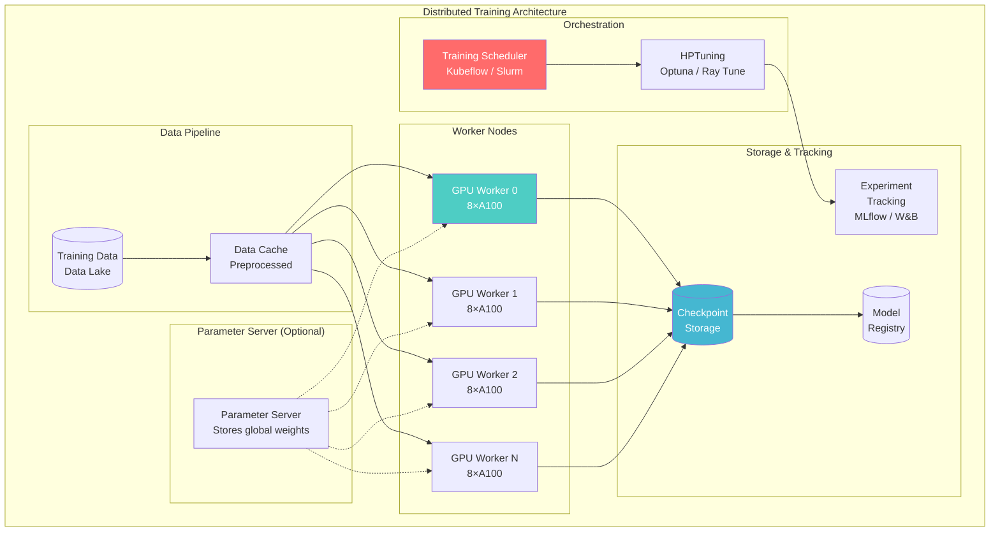
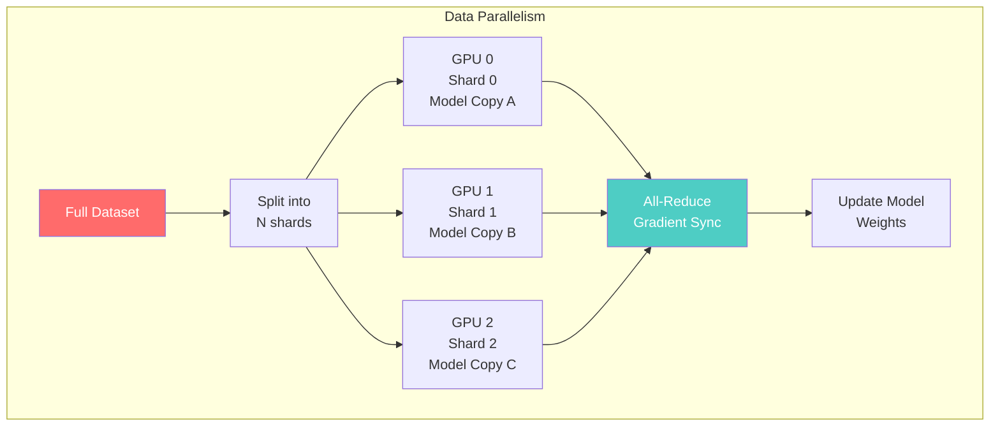
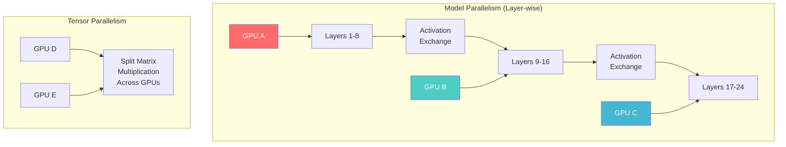
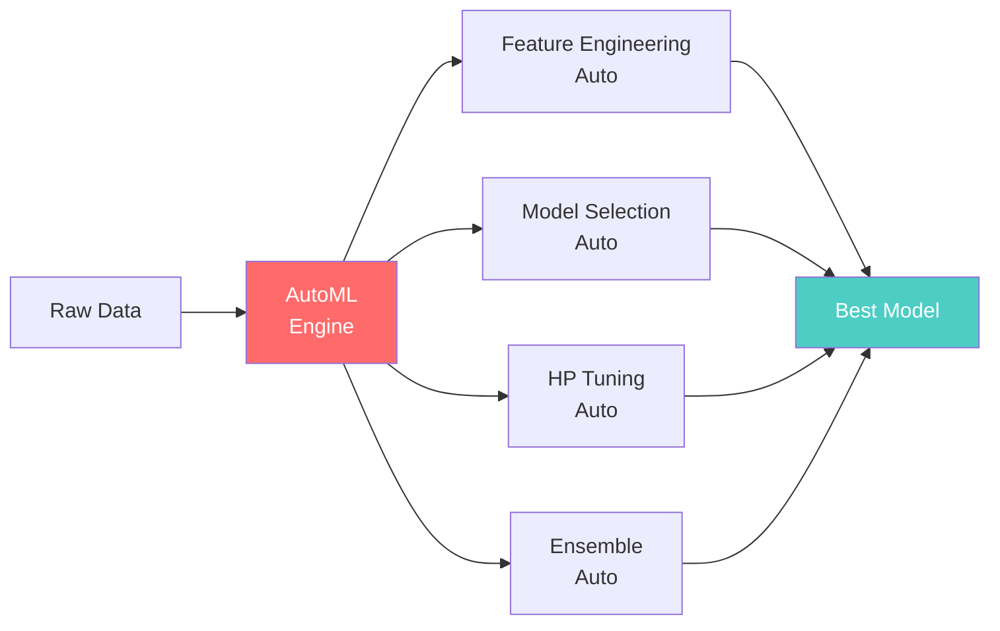

# Model Training Architecture

> **Taxonomy Reference**: §4.4 AI / ML Architecture

## Overview

Model Training Architecture defines how to **efficiently train ML models at scale** — from single-GPU experimentation to distributed training across hundreds of GPUs. It covers parallelism strategies, hyperparameter optimization, AutoML, and infrastructure design for training workloads.

## Table of Contents

- [Core Concepts](#core-concepts)
- [Architecture Diagram](#architecture-diagram)
- [Distributed Training Strategies](#distributed-training-strategies)
- [Hyperparameter Optimization](#hyperparameter-optimization)
- [AutoML](#automl)
- [Training Infrastructure](#training-infrastructure)
- [GPU vs CPU vs TPU](#gpu-vs-cpu-vs-tpu)
- [Decision Framework](#decision-framework)
- [Related Patterns](#related-patterns)

## Core Concepts

| Concept | Description |
|---------|-------------|
| **Epoch** | One complete pass through the training dataset |
| **Batch Size** | Number of samples processed before updating weights |
| **Gradient Accumulation** | Accumulating gradients over micro-batches to simulate larger batch size |
| **Learning Rate Schedule** | Adaptive adjustment of learning rate during training |
| **Checkpointing** | Periodic save of model weights and optimizer state |
| **Mixed Precision** | Using FP16 + FP32 to speed up training and reduce memory |

## Architecture Diagram



## Distributed Training Strategies

### Data Parallelism



| Aspect | Description |
|--------|-------------|
| **How it works** | Each GPU holds a complete model copy, processes different data shards |
| **Gradient sync** | All-Reduce operation averages gradients across all GPUs |
| **Sync vs Async** | Synchronous = wait for all; Asynchronous = no wait (faster, less stable) |
| **Best for** | Models that fit on a single GPU (up to ~10B parameters) |
| **Communication** | High (gradients exchanged every step) |

### Model Parallelism



| Type | How It Works | Best For |
|------|-------------|----------|
| **Layer-wise (Pipeline)** | Each GPU holds different layers | Very deep models |
| **Tensor Parallelism** | Split individual operations (e.g., matrix multiply) | Large transformers |
| **Sequence Parallelism** | Split long sequences | Long-context LLMs |

### 3D Parallelism (Modern LLMs)

For models like GPT-4, Llama 3, and Claude, combine all three:

```
┌──────────────────────────────────────────┐
│           3D Parallelism                  │
│                                           │
│  Data Parallelism × Pipeline Parallelism  │
│                × Tensor Parallelism       │
│                                           │
│  Example: GPT-3 (175B) on 1024 A100 GPUs  │
│  - 64-way data parallel                   │
│  - 8-way pipeline parallel                │
│  - 2-way tensor parallel                  │
│  = 64 × 8 × 2 = 1024 GPUs                │
└──────────────────────────────────────────┘
```

### Strategy Comparison

| Strategy | Max Model Size | Comm. Overhead | Implementation Complexity |
|----------|---------------|----------------|--------------------------|
| **Data Parallel** | ~10B params | Medium | Low (PyTorch DDP, Horovod) |
| **Pipeline Parallel** | ~100B params | Low | Medium (GPipe, PipeDream) |
| **Tensor Parallel** | ~1T params | Very High | High (Megatron-LM, FSDP) |
| **3D Parallel** | 1T+ params | High | Very High (Megatron + DeepSpeed) |

## Hyperparameter Optimization

```python
# Optuna example
import optuna

def objective(trial):
    # Define search space
    params = {
        "learning_rate": trial.suggest_float("lr", 1e-5, 1e-1, log=True),
        "batch_size": trial.suggest_categorical("bs", [32, 64, 128, 256]),
        "num_layers": trial.suggest_int("layers", 2, 12),
        "dropout": trial.suggest_float("dropout", 0.0, 0.5),
        "optimizer": trial.suggest_categorical("opt", ["adam", "adamw", "sgd"]),
    }

    model = train_model(params)
    accuracy = evaluate_model(model)
    return accuracy

study = optuna.create_study(direction="maximize")
study.optimize(objective, n_trials=100)
```

| HP Tuning Strategy | Description | Efficiency |
|-------------------|-------------|------------|
| **Grid Search** | Exhaustive over combinations | Low (combinatorial explosion) |
| **Random Search** | Random sampling from distribution | Medium |
| **Bayesian Optimization** | Model the objective function | High |
| **Hyperband** | Early-stopping poor trials | Very High |
| **Population-Based Training** | Evolutionary optimization during training | Very High (large scale) |

## AutoML



| AutoML Framework | Strengths | Best For |
|-----------------|-----------|----------|
| **AutoGluon** | Multi-modal, fast, easy | Tabular, text, image |
| **H2O AutoML** | Comprehensive, Java backend | Tabular data |
| **AutoKeras** | Keras-native, neural architecture search | Deep learning |
| **FLAML** | Cost-efficient, fast tuning | Budget-constrained |
| **TPOT** | Genetic programming for pipelines | Pipeline optimization |

## Training Infrastructure

### On-Prem vs Cloud

| Dimension | On-Prem | Cloud |
|-----------|---------|-------|
| **GPU availability** | Fixed, purchased | Elastic, on-demand |
| **Cost model** | CapEx (high upfront) | OpEx (pay-per-use) |
| **Scalability** | Limited by hardware | Virtually unlimited |
| **Spot/preemptible** | Not available | 60-90% cost savings |
| **Management** | Full ownership | Managed (some overhead) |

### Spot / Preemptible Instance Strategy

```python
# Checkpoint frequently for spot instance resilience
for epoch in range(num_epochs):
    train_one_epoch(model, data, epoch)

    if epoch % checkpoint_frequency == 0:
        save_checkpoint(model, optimizer, epoch, path)

    if spot_termination_notice_received():
        save_checkpoint(model, optimizer, epoch, path)
        sys.exit(0)  # Graceful shutdown
```

## GPU vs CPU vs TPU

| Dimension | CPU | GPU | TPU |
|-----------|-----|-----|-----|
| **Parallelism** | Few cores (8-64) | Thousands of cores | Matrix units (MXU) |
| **Memory bandwidth** | ~100 GB/s | ~2 TB/s (HBM) | ~2 TB/s (HBM) |
| **Best for** | Small models, inference, data prep | General deep learning | Large transformer models |
| **Precision** | FP32/FP64 native | FP16/BF16/FP32/INT8 | BF16 native |
| **Cost** | $ | $$$ | $$$$ |
| **Ecosystem** | Universal | CUDA dominant | JAX/TensorFlow |

### GPU Selection Guide

| GPU | VRAM | FP16 TFLOPS | Best For |
|-----|------|-------------|----------|
| **A100 80GB** | 80 GB | 312 | Large models, multi-GPU training |
| **H100** | 80 GB | 989 | LLM training, FP8 support |
| **A10** | 24 GB | 125 | Medium models, inference |
| **L40S** | 48 GB | 362 | Fine-tuning, inference |

## Decision Framework

```mermaid
graph TD
    Q1{Model fits on<br/>single GPU?} -->|Yes| Q2{Need to tune<br/>hyperparameters?}
    Q1 -->|No| Q3{Model > 1B<br/>parameters?}

    Q2 -->|Yes| HPTUNE[Single-GPU +<br/>HP Tuning]
    Q2 -->|No| SINGLE[Single-GPU<br/>Training]

    Q3 -->|Yes (1B-10B)| DATAPARALLEL["Data Parallelism<br/>(PyTorch DDP)"]
    Q3 -->|Yes (10B-100B)| PIPELINE["Pipeline + Data<br/>Parallelism"]
    Q3 -->|Yes (100B+)| THREED["3D Parallelism<br/>(Megatron + DeepSpeed)"]

    style SINGLE fill:#96ceb4,color:#fff
    style DATAPARALLEL fill:#4ecdc4,color:#fff
    style THREED fill:#ff6b6b,color:#fff
```

## Related Patterns

- [Machine Learning Pipeline Architecture](01-machine-learning-pipeline-architecture.md) — Training pipeline orchestration
- [MLOps Architecture](02-mlops-architecture.md) — CI/CD/CT and experiment tracking
- [Feature Store Architecture](03-feature-store-architecture.md) — Training data generation
- [Model Inference Architecture](05-model-inference-architecture.md) — From training to serving

> **Azure Implementation**: See [Azure Machine Learning Compute](../../../architecture-azure/compute/) (managed GPU clusters), [Azure ND-series VMs](https://learn.microsoft.com/en-us/azure/virtual-machines/) (A100/H100 instances), and [Azure CycleCloud](https://learn.microsoft.com/en-us/azure/cyclecloud/) for HPC training clusters.
