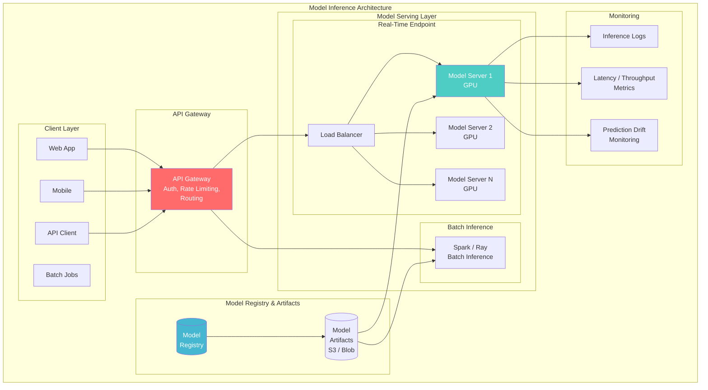
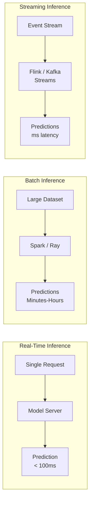
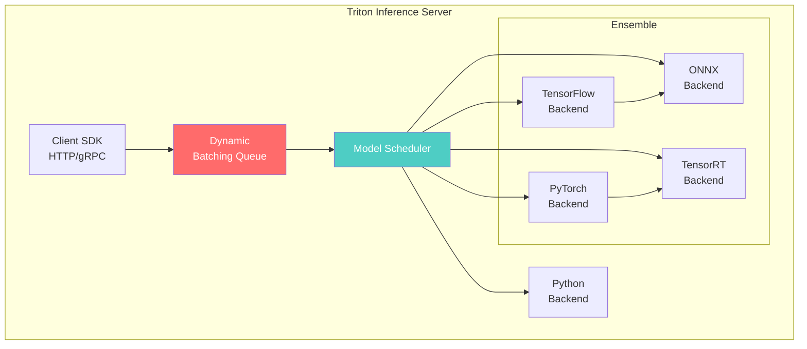
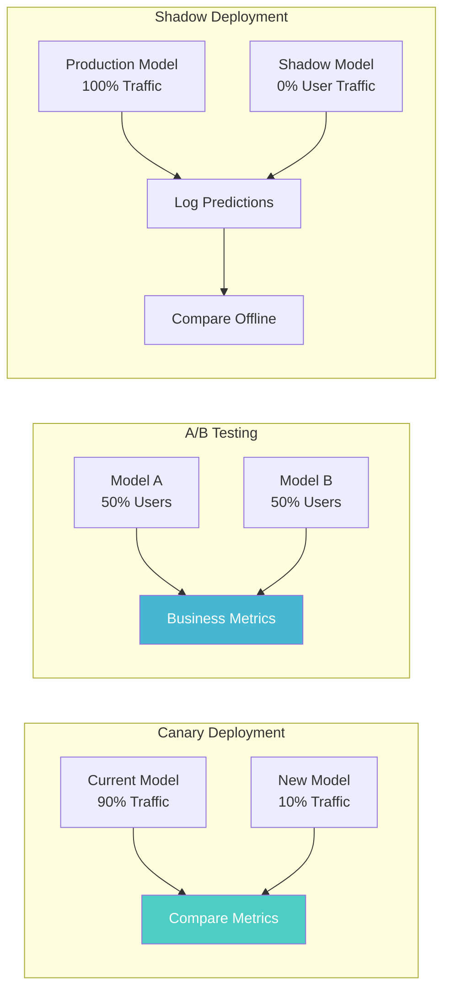
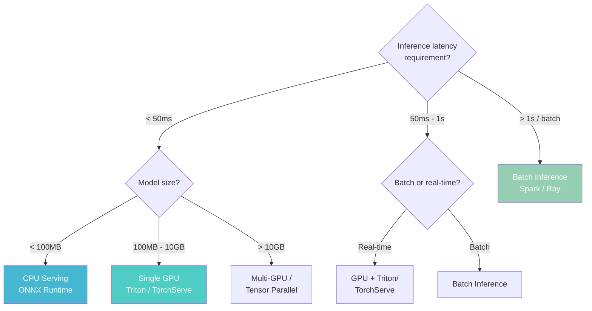

# Model Inference Architecture

> **Taxonomy Reference**: §4.4 AI / ML Architecture

## Overview

Model Inference Architecture defines how trained ML models **serve predictions** in production — from low-latency real-time endpoints to high-throughput batch inference. It covers serving frameworks, deployment strategies, model optimization, and scaling patterns for inference workloads.

## Table of Contents

- [Core Concepts](#core-concepts)
- [Architecture Diagram](#architecture-diagram)
- [Inference Types](#inference-types)
- [Serving Frameworks](#serving-frameworks)
- [Deployment Strategies](#deployment-strategies)
- [Model Optimization](#model-optimization)
- [Scaling Patterns](#scaling-patterns)
- [Decision Framework](#decision-framework)
- [Related Patterns](#related-patterns)

## Core Concepts

| Concept | Description |
|---------|-------------|
| **Inference Endpoint** | API endpoint that accepts input and returns predictions |
| **Model Serving** | Loading a trained model and exposing it for inference |
| **Cold Start** | Latency penalty when loading a model into memory for the first time |
| **Warm Start** | Pre-loaded model in memory, ready for immediate inference |
| **Batching** | Combining multiple inference requests for GPU efficiency |
| **Model Quantization** | Reducing model precision (FP32→INT8) for faster inference |

## Architecture Diagram



## Inference Types



| Type | Latency | Throughput | Use Case | Cost |
|------|---------|------------|----------|------|
| **Real-Time** | < 100ms | 100-10K req/s | Fraud detection, recommendations | Higher (always-on GPUs) |
| **Batch** | Minutes-hours | Millions/day | Scoring, embeddings generation | Lower (spot instances) |
| **Streaming** | < 1s | 1K-100K events/s | Real-time anomaly detection | Medium |
| **Edge/On-Device** | < 10ms | Per device | Mobile ML, IoT | Zero (device compute) |

## Serving Frameworks

| Framework | Strengths | Best For |
|-----------|-----------|----------|
| **Triton Inference Server** | Multi-framework, dynamic batching, model ensembles | Enterprise, GPU-optimized |
| **TorchServe** | PyTorch-native, easy setup | PyTorch models |
| **TensorFlow Serving** | TF-optimized, battle-tested | TensorFlow models |
| **Seldon Core** | Kubernetes-native, multi-framework | K8s environments |
| **BentoML** | Simple Python API, model packaging | Python-first teams |
| **Ray Serve** | Distributed, programmatic scaling | Complex inference graphs |
| **vLLM** | PagedAttention, high-throughput LLM | LLM serving |
| **Text Generation Inference (TGI)** | HuggingFace-native, optimized | HuggingFace models |

### Triton Inference Server Architecture



## Deployment Strategies

### Strategy Comparison



| Strategy | Risk | Rollback Speed | Best For |
|----------|------|---------------|----------|
| **Canary** | Low | Instant (update routing) | Most production deployments |
| **Blue/Green** | Low | Instant (switch endpoint) | Simple models, full cutover |
| **A/B Testing** | Medium | Update routing | Comparing business impact |
| **Shadow** | Very Low | N/A (no user impact) | Pre-production validation |
| **Multi-Armed Bandit** | Low-Medium | Automatic | Auto-optimizing models |

## Model Optimization

### Optimization Techniques

| Technique | Speedup | Accuracy Impact | Effort |
|-----------|---------|-----------------|--------|
| **Quantization (FP32→INT8)** | 2-4× | < 1% | Low |
| **Pruning** | 1.5-3× | 1-3% | Medium |
| **Knowledge Distillation** | 2-10× | 1-5% | High |
| **TensorRT / ONNX Runtime** | 2-3× | None | Low |
| **Graph Optimization** | 1.2-1.5× | None | Low |
| **KV Cache (LLMs)** | 10-50× | None | Framework-level |
| **Speculative Decoding** | 2-3× | None | Medium |

### Quantization Levels

```python
# Example: PyTorch quantization
import torch.quantization

# Dynamic quantization (easiest)
model_quantized = torch.quantization.quantize_dynamic(
    model, {torch.nn.Linear}, dtype=torch.qint8
)

# Static quantization (better performance, needs calibration)
model.qconfig = torch.quantization.get_default_qconfig('fbgemm')
model_prepared = torch.quantization.prepare(model)
# Calibrate with sample data...
model_quantized = torch.quantization.convert(model_prepared)
```

| Precision | Memory | Speed | Accuracy | Use Case |
|-----------|--------|-------|----------|----------|
| **FP32** | 4 bytes/param | Baseline | Baseline | Training |
| **FP16** | 2 bytes/param | 2× | ~same | GPU inference |
| **BF16** | 2 bytes/param | 2× | ~same | Better range than FP16 |
| **INT8** | 1 byte/param | 2-4× | −0.5% | Production serving (CPU/GPU) |
| **INT4** | 0.5 bytes/param | 4-8× | −1-3% | Large models, edge |
| **FP8** | 1 byte/param | 2× | ~same (H100) | Next-gen (H100 GPUs) |

### LLM-Specific Optimization

| Technique | Description | Speedup |
|-----------|-------------|---------|
| **vLLM (PagedAttention)** | Efficient KV cache management | 24× vs naive |
| **FlashAttention-2** | Fused attention kernels | 2-3× |
| **Continuous Batching** | Dynamically add/remove requests from batch | 5-10× |
| **Speculative Decoding** | Small draft model proposes, large model verifies | 2-3× |

## Scaling Patterns

### Horizontal Autoscaling

```
Scaling triggers:
  • Request latency > P99 threshold (e.g., 200ms)
  • GPU utilization > 80%
  • Queue depth > N pending requests
  • Scheduled (time-of-day patterns)

Scale-in triggers:
  • GPU utilization < 30% for 10 minutes
  • Queue depth = 0 for 5 minutes
```

### Cost Optimization

| Pattern | Description | Savings |
|---------|-------------|---------|
| **Spot/Preemptible Instances** | Use spare cloud capacity | 60-90% |
| **Model Caching** | Cache frequent predictions | 30-50% reduction in compute |
| **Right-sizing** | Match GPU to model size | 30-50% |
| **Multi-Model Serving** | Serve multiple models from one GPU | 40-60% |
| **Auto-scaling to zero** | Scale down during inactivity | Varies by traffic pattern |

## Decision Framework



## Related Patterns

- [Model Training Architecture](04-model-training-architecture.md) — Training produces the models you serve
- [MLOps Architecture](02-mlops-architecture.md) — CI/CD/CT pipeline for deployment
- [Feature Store Architecture](03-feature-store-architecture.md) — Real-time feature serving for inference
- [Vector Database Architecture](06-vector-database-architecture.md) — Embedding search and retrieval

> **Azure Implementation**: See [Azure Machine Learning Endpoints](https://learn.microsoft.com/en-us/azure/machine-learning/concept-endpoints) (managed online/batch endpoints), [Azure Kubernetes Service](../../../architecture-azure/compute/aks/) (custom serving), and [Triton on Azure](https://learn.microsoft.com/en-us/azure/machine-learning/how-to-deploy-with-triton).
