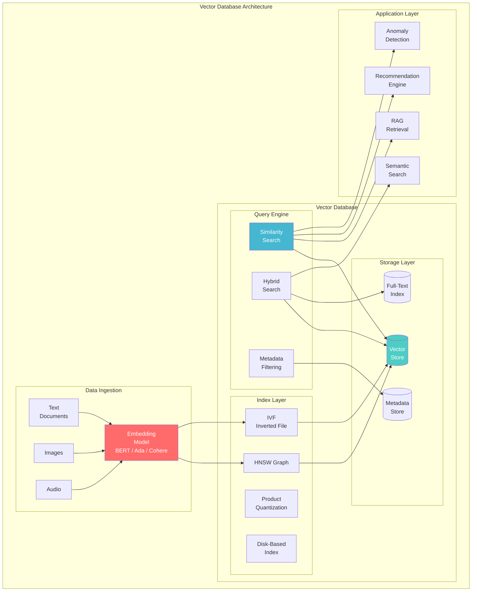
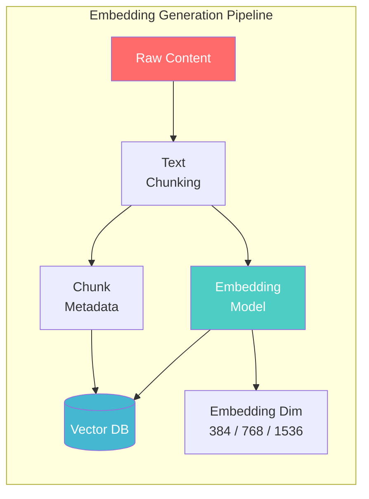
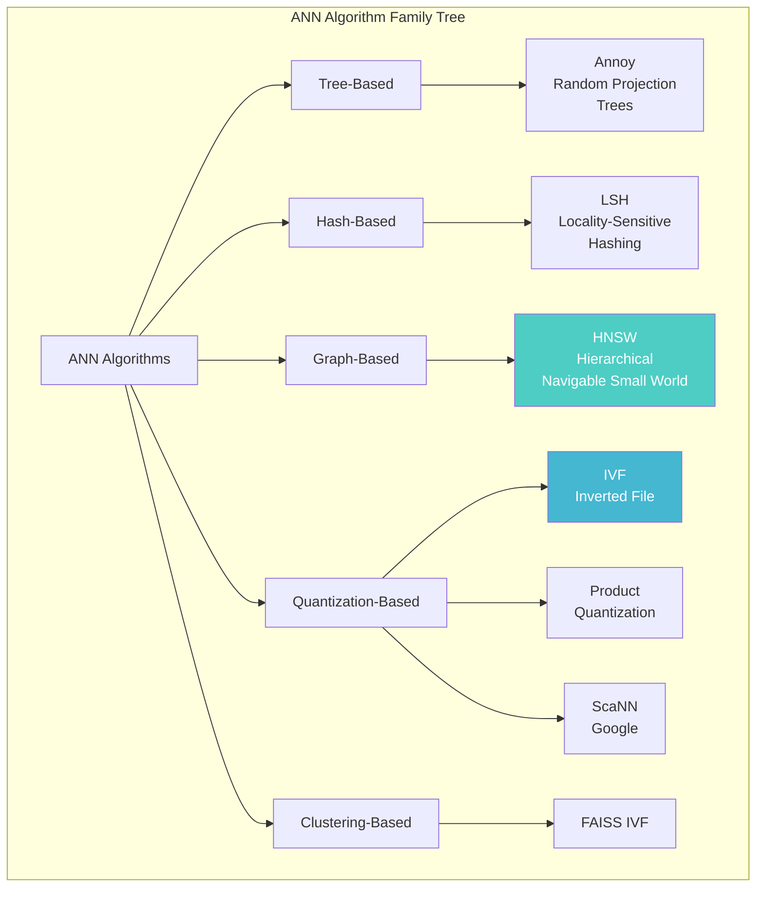
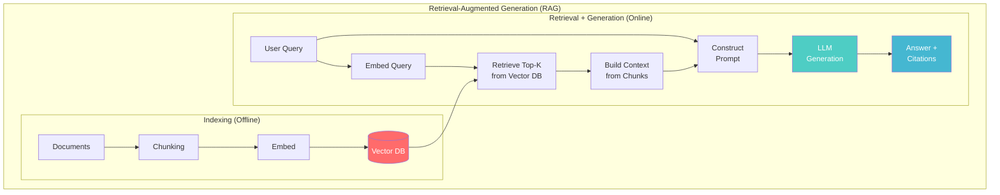
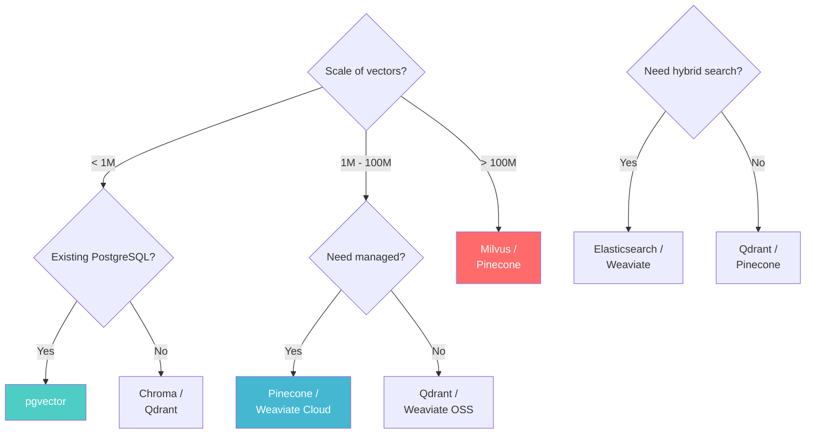

# Vector Database Architecture

> **Taxonomy Reference**: §4.4 AI / ML Architecture

## Overview

Vector databases are purpose-built systems for **storing, indexing, and querying high-dimensional vector embeddings** — the numerical representations of unstructured data (text, images, audio) produced by ML models. They enable similarity search, recommendation, and retrieval-augmented generation (RAG) at scale.

## Table of Contents

- [Core Concepts](#core-concepts)
- [Architecture Diagram](#architecture-diagram)
- [Embedding Pipeline](#embedding-pipeline)
- [Similarity Metrics](#similarity-metrics)
- [ANN Algorithms](#ann-algorithms)
- [Vector Database Comparison](#vector-database-comparison)
- [RAG Architecture](#rag-architecture)
- [Hybrid Search](#hybrid-search)
- [Decision Framework](#decision-framework)
- [Related Patterns](#related-patterns)

## Core Concepts

| Concept | Description |
|---------|-------------|
| **Embedding** | A dense vector (e.g., 768-dim or 1536-dim) representing semantic meaning |
| **Similarity Search** | Finding vectors closest to a query vector in high-dimensional space |
| **k-NN (k-Nearest Neighbors)** | Exact search: find k closest vectors |
| **ANN (Approximate Nearest Neighbor)** | Approximate search: trade a small accuracy loss for huge speed gains |
| **Index** | Data structure enabling fast similarity search (HNSW, IVF, etc.) |
| **Namespace / Collection** | Logical grouping of vectors (like a table in SQL) |

### What Are Embeddings?

```
Text: "The cat sat on the mat"
        ↓ Embedding Model (e.g., BERT, Ada, Cohere)
Vector: [0.023, -0.451, 0.782, ..., -0.113]  ← 1536 dimensions

Similar texts → nearby vectors in vector space
"The feline rested on the rug" → close to "The cat sat on the mat"
"Quantum physics is fascinating" → far from "The cat sat on the mat"
```

## Architecture Diagram



## Embedding Pipeline



### Chunking Strategies

| Strategy | How It Works | Best For |
|----------|-------------|----------|
| **Fixed-Size** | Split by character/token count | Simple, predictable |
| **Recursive** | Split by paragraph → sentence → word | Natural text boundaries |
| **Semantic** | Split at semantic boundaries using sentence embeddings | Maintaining meaning |
| **Sliding Window** | Overlapping chunks | Context preservation |
| **Document-Aware** | Respect document structure (headers, sections) | Structured docs |

### Embedding Models

| Model | Dimensions | Max Tokens | Cost | Best For |
|-------|-----------|------------|------|----------|
| **OpenAI text-embedding-3-small** | 512/1536 | 8191 | $0.02/1M tokens | General purpose |
| **OpenAI text-embedding-3-large** | 256/1024/3072 | 8191 | $0.13/1M tokens | High accuracy |
| **Cohere Embed v3** | 1024 | 512 | Varies | Multilingual |
| **BGE-M3 (BAAI)** | 1024 | 8192 | Free (OSS) | Multilingual, dense+sparse |
| **E5-mistral-7b-instruct** | 4096 | 32768 | Free (OSS) | Long context, high quality |
| **Jina embeddings v2** | 768 | 8192 | Free (OSS) | 8K context, multilingual |

## Similarity Metrics

| Metric | Formula | Range | Best For |
|--------|---------|-------|----------|
| **Cosine Similarity** | `cos(θ) = A·B / (‖A‖‖B‖)` | [−1, 1] | Text embeddings (default) |
| **Euclidean Distance (L2)** | `√Σ(Aᵢ−Bᵢ)²` | [0, ∞) | When magnitude matters |
| **Dot Product** | `Σ AᵢBᵢ` | (−∞, ∞) | Proxy for cosine (normalized vectors) |
| **Manhattan Distance (L1)** | `Σ |Aᵢ−Bᵢ|` | [0, ∞) | Sparse vectors, robustness |

> **Rule of thumb**: If using normalized embeddings (``‖v‖ = 1``), cosine similarity and dot product are equivalent. Most embedding models produce normalized vectors.

## ANN Algorithms

### Algorithm Landscape



### Algorithm Comparison

| Algorithm | Speed (QPS) | Recall | Memory | Build Time | Best For |
|-----------|------------|--------|--------|------------|----------|
| **HNSW** | Very High | 95-99% | High | Medium | Most use cases (default choice) |
| **IVF + PQ** | High | 90-97% | Low | High | Memory-constrained |
| **DiskANN** | Medium | 95-99% | Very Low (disk) | Very High | Billion-scale, cost-sensitive |
| **Annoy** | Medium | 90-95% | Medium | Low | Read-only, static datasets |
| **ScaNN** | Very High | 97-99% | High | High | Google-scale, max recall |
| **LSH** | High | 80-90% | Medium | Low | Simple, predictable recall |

## Vector Database Comparison

| Database | Type | ANN Algorithm | Strengths | Best For |
|----------|------|--------------|-----------|----------|
| **Pinecone** | Managed Cloud | Custom (pod-based) | Zero-ops, serverless | Teams wanting no infra management |
| **Weaviate** | OSS / Cloud | HNSW + PQ | Hybrid search, GraphQL, modular | Semantic search + keyword |
| **Qdrant** | OSS / Cloud | HNSW | Rust-based, fast, rich filtering | Performance + filtering |
| **Milvus** | OSS / Cloud | HNSW, IVF, DiskANN | Billion-scale, cloud-native | Large-scale production |
| **Chroma** | OSS | HNSW | Simple, Pythonic, lightweight | Prototyping, small projects |
| **pgvector** | PostgreSQL Extension | IVF, HNSW | No new infra, SQL-native | Existing PostgreSQL users |
| **Redis Stack** | OSS / Cloud | HNSW | Sub-ms latency, caching | Low-latency, real-time |
| **Elasticsearch** | OSS / Cloud | HNSW | Full-text + vector + analytics | Unified search platform |

## RAG Architecture



### RAG Pipeline Code (Conceptual)

```python
# 1. Indexing
documents = load_documents("knowledge_base/")
chunks = recursive_text_splitter(documents, chunk_size=512, overlap=50)
embeddings = embedding_model.encode(chunks)
vector_db.insert(chunks, embeddings, metadata)

# 2. Retrieval + Generation
def rag_query(user_query: str, k: int = 5) -> str:
    query_embedding = embedding_model.encode(user_query)
    retrieved = vector_db.search(query_embedding, top_k=k)

    context = "\n\n".join([r.text for r in retrieved])
    prompt = f"""Answer based on the context below.
    If unsure, say "I don't know."

    Context:
    {context}

    Question: {user_query}
    Answer:"""

    return llm.generate(prompt)
```

## Hybrid Search

Combining vector (semantic) and keyword (lexical) search for best results:

```python
# Hybrid search: combine sparse (BM25) + dense (vector) scores
def hybrid_search(query: str, alpha: float = 0.7):
    # Alpha controls vector vs keyword weight
    vector_results = vector_db.search(query_embedding, top_k=50)
    keyword_results = text_index.search(query, top_k=50)

    # Reciprocal Rank Fusion (RRF) or weighted sum
    combined = reciprocal_rank_fusion(
        vector_results,
        keyword_results,
        k=60  # RRF constant
    )

    return combined[:10]
```

| Search Type | Strengths | Weaknesses |
|------------|-----------|------------|
| **Vector (Dense)** | Semantic understanding, synonyms, multilingual | Misses exact matches, brand names |
| **Keyword (Sparse)** | Exact matches, entities, acronyms | Misses semantic similarity |
| **Hybrid** | Best of both | Higher latency, complexity |

## Decision Framework



## Related Patterns

- [Machine Learning Pipeline Architecture](01-machine-learning-pipeline-architecture.md) — Embedding generation pipeline
- [Model Inference Architecture](05-model-inference-architecture.md) — Embedding model serving
- [Feature Store Architecture](03-feature-store-architecture.md) — Storing vector features
- [MLOps Architecture](02-mlops-architecture.md) — Monitoring embedding quality and drift

> **Azure Implementation**: See [Azure AI Search](https://learn.microsoft.com/en-us/azure/search/) (hybrid search with vector + keyword), [Azure Cosmos DB for PostgreSQL](https://learn.microsoft.com/en-us/azure/cosmos-db/postgresql/) (pgvector), and [Azure Cache for Redis Enterprise](../../../architecture-azure/data/redis/) (Redis Stack with vector search).
