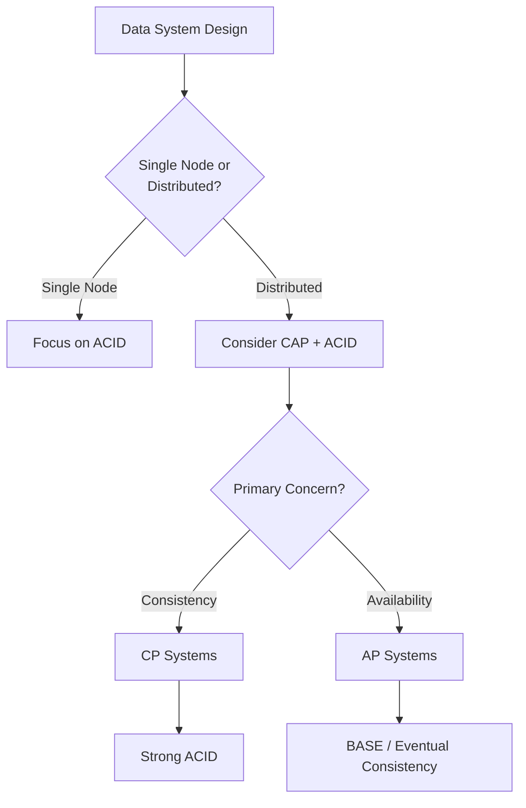

# Data Architecture Fundamentals

This section covers foundational concepts for understanding data systems architecture.

## Contents

### Core Concepts

- [ACID Properties](acid-properties.md) - Transaction guarantees in databases
- [BASE Properties](base-properties.md) - Distributed systems availability approach
- [CAP Theorem](cap-theorem.md) - Distributed systems trade-offs

## \ud83c\udfaf Quick Visual Reference: Never Confuse Them Again!

```
\u250c\u2500\u2500\u2500\u2500\u2500\u2500\u2500\u2500\u2500\u2500\u2500\u2500\u2500\u2500\u2500\u2500\u2500\u2500\u2500\u2500\u2500\u2500\u2500\u2500\u2500\u2500\u2500\u2500\u2500\u2500\u2500\u2500\u2500\u2500\u2500\u2500\u2500\u2500\u2500\u2500\u2500\u2500\u2500\u2500\u2500\u2500\u2500\u2500\u2500\u2500\u2500\u2500\u2500\u2500\u2500\u2500\u2500\u2500\u2500\u2500\u2500\u2500\u2500\u2500\u2500\u2510
\u2502                                                                 \u2502
\u2502    \ud83e\uddea ACID                        \ud83c\udf10 CAP                        \u2502
\u2502    \u2550\u2550\u2550\u2550\u2550\u2550\u2550\u2550\u2550\u2550                      \u2550\u2550\u2550\u2550\u2550\u2550\u2550\u2550\u2550\u2550                     \u2502
\u2502                                                                 \u2502
\u2502    \ud83c\udfe6 ONE Bank Vault             \ud83c\udfe6\ud83c\udfe6\ud83c\udfe6 Multiple Bank Branches    \u2502
\u2502                                                                 \u2502
\u2502    \"How do I handle              \"What if branches              \u2502
\u2502     a transaction                 can't talk to                 \u2502
\u2502     safely?\"                      each other?\"                  \u2502
\u2502                                                                 \u2502
\u2502    \u269b\ufe0f Atomicity                   \ud83d\udcca Consistency                 \u2502
\u2502    \u2705 Consistency                  \u2705 Availability                 \u2502
\u2502    \ud83d\udd12 Isolation                   \ud83d\udee0\ufe0f Partition Tolerance         \u2502
\u2502    \ud83d\udcbe Durability                                                \u2502
\u2502                                                                 \u2502
\u2502    GUARANTEES all 4              PICK only 2 of 3              \u2502
\u2502                                                                 \u2502
\u2502    PostgreSQL, MySQL             MongoDB (CP)                  \u2502
\u2502    SQL Server, Oracle            Cassandra (AP)                \u2502
\u2502                                   DynamoDB (AP)                 \u2502
\u2502                                                                 \u2502
\u2514\u2500\u2500\u2500\u2500\u2500\u2500\u2500\u2500\u2500\u2500\u2500\u2500\u2500\u2500\u2500\u2500\u2500\u2500\u2500\u2500\u2500\u2500\u2500\u2500\u2500\u2500\u2500\u2500\u2500\u2500\u2500\u2500\u2500\u2500\u2500\u2500\u2500\u2500\u2500\u2500\u2500\u2500\u2500\u2500\u2500\u2500\u2500\u2500\u2500\u2500\u2500\u2500\u2500\u2500\u2500\u2500\u2500\u2500\u2500\u2500\u2500\u2500\u2500\u2500\u2500\u2518

    REMEMBER:
    \ud83e\uddea ACID = \"Rules for ONE database to be reliable\"
    \ud83c\udf10 CAP  = \"Trade-offs when MANY databases must sync\"
```

## Overview

Understanding these fundamental concepts is essential for making informed decisions about:

- Database selection
- Distributed system design
- Consistency vs availability trade-offs
- Transaction management strategies

## Quick Reference

### ACID vs BASE vs CAP

| Concept | Focus | Scope | Key Question |
|---------|-------|-------|---------------|
| ACID | Transaction reliability | Single database | "Is my transaction safe?" |
| BASE | Availability at scale | Distributed systems | "Can I always respond?" |
| CAP | Distributed trade-offs | Distributed systems | "What do I sacrifice during partition?" |

### When to Apply



## Related Topics

- [Saga Pattern](../../02-application-software-architecture/design-patterns/saga-pattern.md) - Managing distributed transactions
- [Event Sourcing](../../02-application-software-architecture/design-patterns/event-sourcing-pattern.md) - Alternative data persistence model
- [CQRS Pattern](../../02-application-software-architecture/design-patterns/cqrs-pattern.md) - Separating read and write models
