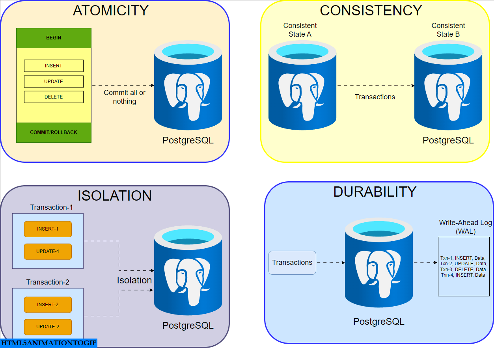
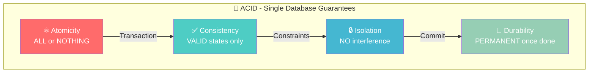
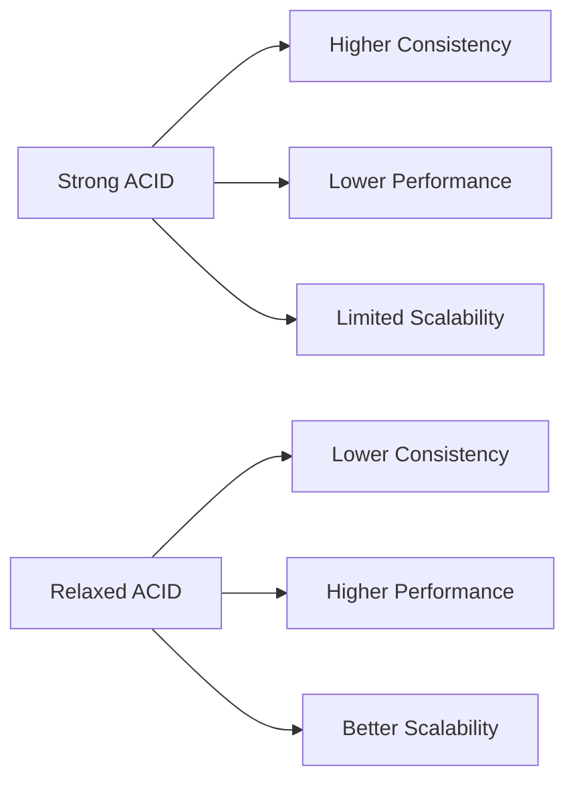
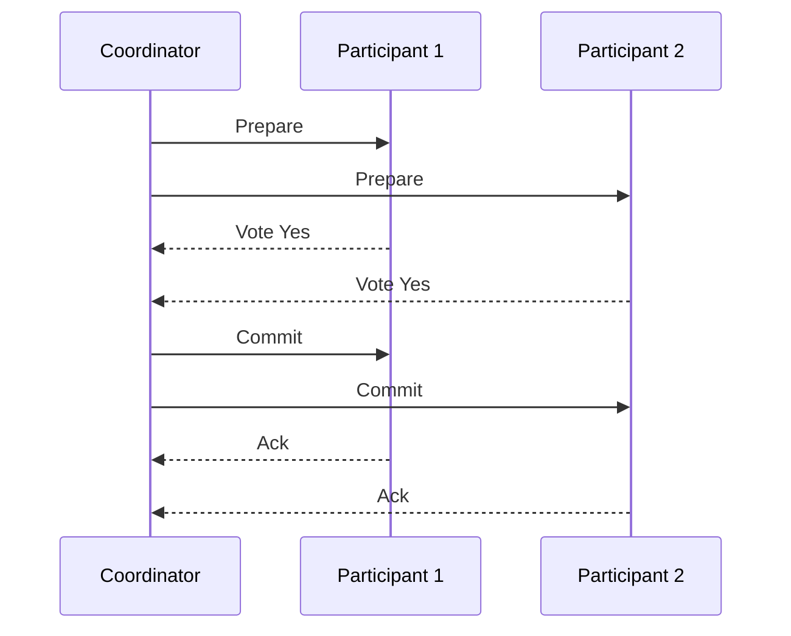

# ACID Properties

## Overview

ACID is an acronym representing four key properties that guarantee reliable processing of database transactions. These properties ensure data validity despite errors, power failures, or other failures.

## 🧠 Visual Mnemonic: The Bank Vault

```
┌─────────────────────────────────────────────────────────────────┐
│                    🏦 ACID = THE BANK VAULT                     │
├─────────────────────────────────────────────────────────────────┤
│                                                                 │
│   ⚛️  ATOMICITY         "All or Nothing" - Like a bomb squad   │
│       ════════════      Either defuse ALL wires or NONE        │
│       💣→ 🔧🔧🔧 → ✅   (Can't leave half-defused!)            │
│                                                                 │
│   ✅ CONSISTENCY        "Rules are Rules" - Like a bouncer     │
│      ════════════       Only valid states allowed in           │
│      📋→ 🚪 → 🎭        (No breaking house rules!)             │
│                                                                 │
│   🔒 ISOLATION          "Private Rooms" - Like bank vaults     │
│      ════════════       Each transaction in its own room       │
│      🚪🚪🚪 → 👤👤👤    (Can't see others' business!)          │
│                                                                 │
│   💾 DURABILITY         "Written in Stone" - Like a tattoo     │
│      ════════════       Once committed, it's permanent         │
│      ✍️ → 🪨            (Survives any disaster!)               │
│                                                                 │
└─────────────────────────────────────────────────────────────────┘
```



## Quick Visual Summary



## The Four Properties

### ⚛️ Atomicity

**Definition**: A transaction is treated as a single, indivisible unit of work. Either all operations within the transaction complete successfully, or none of them do.

**Visual: The Package Delivery Analogy**
```
   SUCCESS PATH                    FAILURE PATH
   ════════════                    ════════════
   
   📦 Package                      📦 Package
      ↓                               ↓
   ┌──────────┐                   ┌──────────┐
   │ Step 1 ✅│                   │ Step 1 ✅│
   │ Step 2 ✅│                   │ Step 2 ❌│ ← Failure!
   │ Step 3 ✅│                   │ Step 3 ⏸️│
   └──────────┘                   └──────────┘
        ↓                              ↓
   📬 Delivered                   📦 Back to sender
   (ALL completed)                (NONE applied)
```

**Key Characteristics**:
- All-or-nothing execution
- If any part fails, the entire transaction rolls back
- No partial updates are visible to other transactions

**Example**:
```sql
BEGIN TRANSACTION;
    UPDATE accounts SET balance = balance - 100 WHERE id = 1;
    UPDATE accounts SET balance = balance + 100 WHERE id = 2;
COMMIT;
-- If either UPDATE fails, both are rolled back
```

### ✅ Consistency

**Definition**: A transaction brings the database from one valid state to another valid state, maintaining all defined rules, constraints, cascades, and triggers.

**Visual: The Bouncer at the Club**
```
                     📋 RULES
                    ┌────────┐
                    │• Age≥21│
                    │• No ⚔️ │
                    │• Valid │
                    └────────┘
                        ↓
    BEFORE          🚪 GATE           AFTER
   ┌──────┐      ┌─────────┐      ┌──────┐
   │Valid │  →   │ 🧑‍✈️      │  →   │Valid │
   │State │      │Checking │      │State │
   │  ✅  │      │ Rules   │      │  ✅  │
   └──────┘      └─────────┘      └──────┘
                      ↓
              ❌ Invalid states
                 REJECTED!
```

**Key Characteristics**:
- Data integrity constraints are never violated
- Business rules are enforced
- Referential integrity is maintained

**Example**:
- A bank transfer cannot result in negative balance if constraints prevent it
- Foreign key relationships must remain valid after transaction

### 🔒 Isolation

**Definition**: Concurrent transactions execute as if they were running sequentially, preventing interference between transactions.

**Visual: The Private Voting Booth**
```
         CONCURRENT TRANSACTIONS
    ┌─────────────────────────────────┐
    │                                 │
    │  🚪 T1    🚪 T2    🚪 T3       │
    │  ┌───┐   ┌───┐   ┌───┐         │
    │  │👤 │   │👤 │   │👤 │         │
    │  │   │   │   │   │   │         │
    │  │💰 │   │💰 │   │💰 │  ← Each sees
    │  │   │   │   │   │   │    own data
    │  └───┘   └───┘   └───┘         │
    │    ↓       ↓       ↓           │
    │  Can't see each other's work!  │
    └─────────────────────────────────┘
```

**Isolation Levels** (from lowest to highest):

| Level | Dirty Read | Non-Repeatable Read | Phantom Read |
|-------|------------|---------------------|--------------|
| Read Uncommitted | ✓ Possible | ✓ Possible | ✓ Possible |
| Read Committed | ✗ Prevented | ✓ Possible | ✓ Possible |
| Repeatable Read | ✗ Prevented | ✗ Prevented | ✓ Possible |
| Serializable | ✗ Prevented | ✗ Prevented | ✗ Prevented |

**Common Concurrency Issues**:
- **Dirty Read**: Reading uncommitted changes from another transaction
- **Non-Repeatable Read**: Same query returns different results within a transaction
- **Phantom Read**: New rows appear/disappear between reads in same transaction

### 💾 Durability

**Definition**: Once a transaction is committed, the changes are permanent and survive system failures.

**Visual: Written in Stone**
```
     BEFORE COMMIT              AFTER COMMIT
    ┌─────────────┐           ┌─────────────┐
    │  📝 Draft   │           │  🪨 STONE   │
    │  (erasable) │    →      │  (permanent)│
    │             │  COMMIT   │             │
    │   Tx: $100  │   ───►    │   Tx: $100  │
    └─────────────┘           └─────────────┘
                                    │
          Survives:                 ↓
    ┌─────────────────────────────────────┐
    │  ⚡ Power failure    ✅ Still there │
    │  💥 System crash     ✅ Still there │
    │  🔥 Hardware fail    ✅ Still there │
    └─────────────────────────────────────┘
```

**Implementation Techniques**:
- Write-Ahead Logging (WAL)
- Transaction logs
- Database checkpoints
- Replication to multiple storage locations

## ACID in Practice

### Databases with Strong ACID Support

| Database | ACID Level | Notes |
|----------|------------|-------|
| PostgreSQL | Full | Strong MVCC implementation |
| MySQL (InnoDB) | Full | Requires InnoDB storage engine |
| SQL Server | Full | Full transaction support |
| Oracle | Full | Enterprise-grade ACID |
| SQLite | Full | File-based with full ACID |

### Trade-offs



## ACID vs BASE

### Visual Comparison

```
┌────────────────────────────────────────────────────────────────────┐
│                    ACID  ⚔️  BASE                                  │
├──────────────────────────────┬─────────────────────────────────────┤
│         🧪 ACID              │           🌊 BASE                   │
│    ════════════════          │     ════════════════                │
│                              │                                     │
│    🎯 "Be PRECISE"           │     🌐 "Be AVAILABLE"               │
│                              │                                     │
│    📊 Bank Ledger            │     📱 Social Media Feed            │
│    (Every penny counts!)     │     (Close enough is fine!)         │
│                              │                                     │
│    ⬆️  Scale UP              │     ➡️  Scale OUT                   │
│    (Bigger server)           │     (More servers)                  │
│                              │                                     │
│    🔒 Lock & Wait            │     🔄 Update & Sync Later          │
│                              │                                     │
│    ❌ Fail if uncertain      │     ✅ Respond, fix later           │
└──────────────────────────────┴─────────────────────────────────────┘
```

| Property | ACID | BASE |
|----------|------|------|
| Focus | Consistency | Availability |
| Data State | Always consistent | Eventually consistent |
| Scaling | Vertical (scale-up) | Horizontal (scale-out) |
| Use Case | Financial, critical data | Social media, analytics |
| Complexity | Transaction management | Conflict resolution |

**BASE** = **B**asically **A**vailable, **S**oft state, **E**ventual consistency

## When to Use ACID

### Ideal For
- Financial transactions and banking systems
- E-commerce order processing
- Inventory management
- Healthcare records
- Any system requiring data integrity guarantees

### May Be Overkill For
- Social media feeds
- Real-time analytics
- Caching layers
- Log aggregation
- Systems prioritizing availability over consistency

## Implementation Patterns

### Two-Phase Commit (2PC)



### Saga Pattern (for distributed transactions)

When ACID is needed across microservices, consider the [Saga Pattern](../../02-application-software-architecture/design-patterns/saga-pattern.md).

## Related Concepts

- [CAP Theorem](cap-theorem.md) - Understanding distributed system trade-offs
- [Saga Pattern](../../02-application-software-architecture/design-patterns/saga-pattern.md) - Distributed transaction management
- [Event Sourcing](../../02-application-software-architecture/design-patterns/event-sourcing-pattern.md) - Alternative consistency approach
