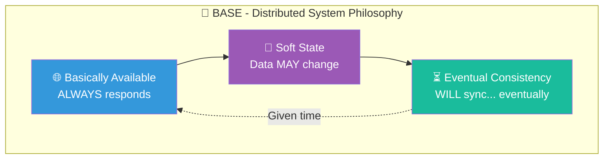
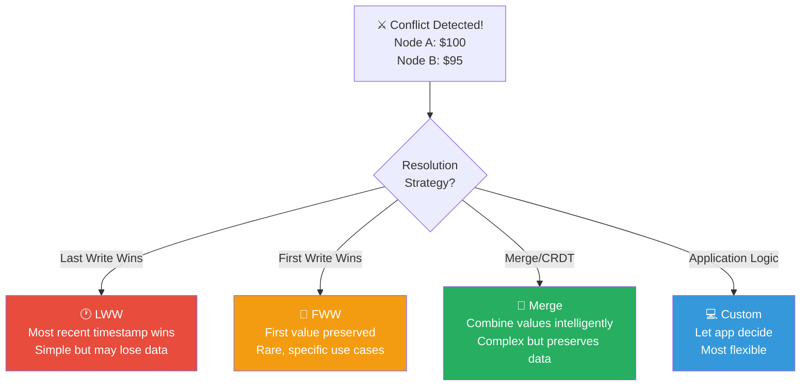
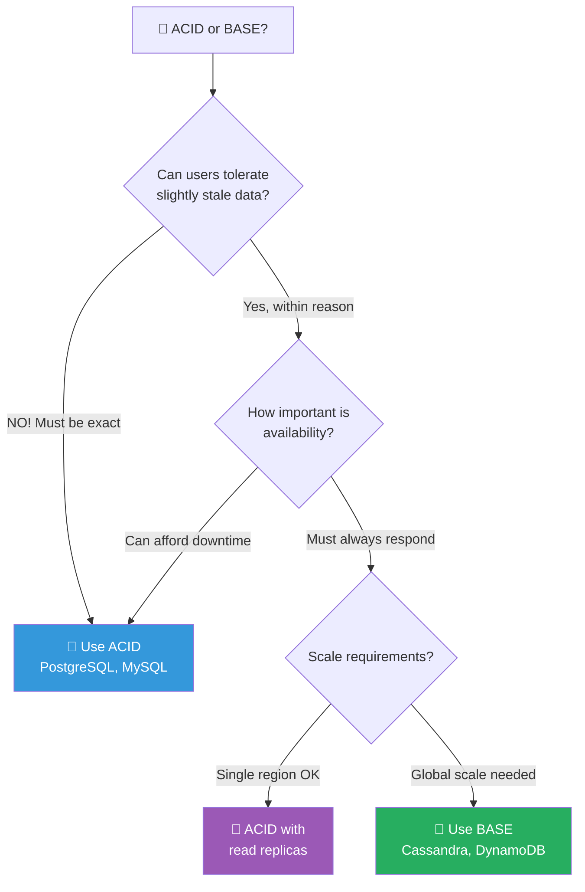

# BASE Properties

## Overview

BASE is an acronym representing an alternative approach to ACID for distributed systems. It prioritizes availability and partition tolerance over immediate consistency.

**BASE** = **B**asically **A**vailable, **S**oft state, **E**ventual consistency

## 🧠 Visual Mnemonic: The Social Media Feed

```
┌─────────────────────────────────────────────────────────────────────┐
│              📱 BASE = THE SOCIAL MEDIA APPROACH                    │
├─────────────────────────────────────────────────────────────────────┤
│                                                                     │
│   Think of refreshing your social media feed:                      │
│                                                                     │
│   ┌─────────────────────────────────────────────────────────────┐   │
│   │                                                             │   │
│   │   🌐 BASICALLY AVAILABLE                                    │   │
│   │   ════════════════════                                      │   │
│   │   "The app always opens, even if slow"                      │   │
│   │   📱 → Always shows SOMETHING                               │   │
│   │                                                             │   │
│   │   🔄 SOFT STATE                                             │   │
│   │   ════════════════════                                      │   │
│   │   "Your feed changes without you doing anything"            │   │
│   │   📱 → Data can change in background                        │   │
│   │                                                             │   │
│   │   ⏳ EVENTUAL CONSISTENCY                                   │   │
│   │   ════════════════════                                      │   │
│   │   "Pull to refresh to see latest posts"                     │   │
│   │   📱 → Eventually you'll see everything                     │   │
│   │                                                             │   │
│   └─────────────────────────────────────────────────────────────┘   │
│                                                                     │
│   Unlike a bank app that shows "System Unavailable" during         │
│   issues, social media always shows you SOMETHING!                 │
│                                                                     │
└─────────────────────────────────────────────────────────────────────┘
```

## Quick Visual Summary



## The Three Properties

### 🌐 Basically Available

**Definition**: The system guarantees availability as defined by the CAP theorem. The system will always return a response, though it may be stale or incomplete.

**Visual: The Convenience Store**
```
        ALWAYS OPEN, ALWAYS RESPONDS
    ┌─────────────────────────────────────────┐
    │                                         │
    │   🏪 24/7 CONVENIENCE STORE             │
    │                                         │
    │   Customer: "Do you have milk?"         │
    │                                         │
    │   ┌─────────────────────────────────┐   │
    │   │ ACID Store:                     │   │
    │   │ "Let me check ALL shelves..."   │   │
    │   │ ⏳ 5 minutes later...           │   │
    │   │ "Yes, aisle 3"                  │   │
    │   └─────────────────────────────────┘   │
    │                                         │
    │   ┌─────────────────────────────────┐   │
    │   │ BASE Store:                     │   │
    │   │ "Probably aisle 3!"             │   │
    │   │ ⚡ Instant response             │   │
    │   │ (might be moved, but close!)    │   │
    │   └─────────────────────────────────┘   │
    │                                         │
    └─────────────────────────────────────────┘
```

**Key Characteristics**:
- System always responds to requests
- May return approximate or cached data
- Prioritizes uptime over perfect accuracy
- Graceful degradation under load

### 🔄 Soft State

**Definition**: The state of the system may change over time, even without new input. Data can be modified in the background by the system itself as it synchronizes.

**Visual: The Shared Whiteboard**
```
        DATA CHANGES WITHOUT YOUR INPUT
    ┌─────────────────────────────────────────┐
    │                                         │
    │   📋 SHARED WHITEBOARD                  │
    │                                         │
    │   Time 10:00                            │
    │   ┌─────────────┐                       │
    │   │ Score: 50   │ ← You see this        │
    │   └─────────────┘                       │
    │                                         │
    │   Time 10:01 (no action from you)       │
    │   ┌─────────────┐                       │
    │   │ Score: 52   │ ← Changed by itself!  │
    │   └─────────────┘                       │
    │         ↑                               │
    │   Background sync from other nodes      │
    │                                         │
    │   ⚠️ State is NOT guaranteed to be     │
    │      stable between reads               │
    │                                         │
    └─────────────────────────────────────────┘
```

**Key Characteristics**:
- No guarantee of consistent state at any given time
- Data may be updated by background processes
- Replicas may temporarily diverge
- Requires application-level handling of inconsistency

### ⏳ Eventual Consistency

**Definition**: If no new updates are made to a given data item, eventually all accesses to that item will return the last updated value.

**Visual: The Rumor Spreading**
```
        EVENTUALLY EVERYONE KNOWS
    ┌─────────────────────────────────────────────────────┐
    │                                                     │
    │   📢 NEWS: "Price changed to $20"                   │
    │                                                     │
    │   T=0      T=1      T=2      T=3      T=4          │
    │   ════     ════     ════     ════     ════          │
    │                                                     │
    │   🖥️A $15   🖥️A $20   🖥️A $20   🖥️A $20   🖥️A $20    │
    │     ↓        ↓                                      │
    │   🖥️B $15   🖥️B $15   🖥️B $20   🖥️B $20   🖥️B $20    │
    │              ↓        ↓                             │
    │   🖥️C $15   🖥️C $15   🖥️C $15   🖥️C $20   🖥️C $20    │
    │                        ↓        ↓                   │
    │   🖥️D $15   🖥️D $15   🖥️D $15   🖥️D $15   🖥️D $20    │
    │                                                     │
    │   ════════════════════════════════════════════════  │
    │   Time passes... EVENTUALLY all nodes agree!        │
    │                                                     │
    └─────────────────────────────────────────────────────┘
```

**Consistency Window**: Time between update and full propagation

```
    Update                                    All Synced
      │◄─────── Consistency Window ──────────►│
      │                                        │
      ▼                                        ▼
    ──●━━━━━━━━━━━━━━━━━━━━━━━━━━━━━━━━━━━━━━●──
      │         (Stale reads possible)        │
      │                                        │
    Write                                  Consistent
   Happens                                   State
```

## 🎯 ACID vs BASE: Visual Comparison

```
┌────────────────────────────────────────────────────────────────────────┐
│                      🧪 ACID  ⚔️  🌊 BASE                              │
├────────────────────────────────────┬───────────────────────────────────┤
│           🧪 ACID                  │           🌊 BASE                 │
│      ══════════════════            │      ══════════════════           │
│                                    │                                   │
│    🎯 "Pessimistic"                │    🎯 "Optimistic"                │
│    Assume things will fail         │    Assume things will work        │
│                                    │                                   │
│    🔒 Lock first, then do          │    🔓 Do first, fix conflicts     │
│                                    │                                   │
│    ⏳ "Wait until perfect"         │    ⚡ "Good enough now"           │
│                                    │                                   │
│    📊 Strong Consistency           │    📊 Eventual Consistency        │
│       ┌──────────────┐             │       ┌──────────────┐            │
│       │ ████████████ │ 100%        │       │ ████████░░░░ │ ~80%       │
│       └──────────────┘             │       └──────────────┘            │
│       Always correct               │       Usually correct              │
│                                    │                                   │
│    ⬆️  Scale UP                    │    ➡️  Scale OUT                  │
│    (Bigger machine)                │    (More machines)                │
│                                    │                                   │
│    🏦 Bank Transfer                │    📱 Like Count                  │
│    "Show $0 balance?               │    "Show 999 likes?               │
│     NEVER!"                        │     Close enough!"                │
│                                    │                                   │
└────────────────────────────────────┴───────────────────────────────────┘
```

## When to Use BASE

### ✅ Ideal For

```
┌─────────────────────────────────────────────────────────────────┐
│  USE BASE WHEN...                                               │
├─────────────────────────────────────────────────────────────────┤
│                                                                 │
│  📱 Social Media               👍 Likes, shares, comments       │
│     │                             Temporary inconsistency OK    │
│     │                                                           │
│  🛒 Shopping Carts             🛍️ Items can sync later         │
│     │                             User will refresh anyway      │
│     │                                                           │
│  📊 Analytics                  📈 Dashboards, metrics           │
│     │                             Near-real-time is fine        │
│     │                                                           │
│  🌐 CDN/Caching                📦 Content delivery              │
│     │                             Stale content acceptable      │
│     │                                                           │
│  🔍 Search Indexes             🔎 Search results                │
│     │                             Slight delay OK               │
│     │                                                           │
│  📧 Notifications              🔔 Message queues                │
│                                   Order flexibility OK          │
│                                                                 │
└─────────────────────────────────────────────────────────────────┘
```

### ❌ Avoid For

```
┌─────────────────────────────────────────────────────────────────┐
│  DON'T USE BASE WHEN...                                         │
├─────────────────────────────────────────────────────────────────┤
│                                                                 │
│  💰 Financial Transactions     🏦 Money transfers, payments     │
│     │                             Every cent must be exact      │
│     │                                                           │
│  📦 Inventory                  🎫 Limited stock items           │
│     │                             Overselling is expensive      │
│     │                                                           │
│  🎟️ Reservations              ✈️ Flights, hotels, tickets      │
│     │                             Double booking is disaster    │
│     │                                                           │
│  🏥 Medical Records            💊 Patient data, prescriptions   │
│     │                             Lives depend on accuracy      │
│     │                                                           │
│  🔐 Security/Auth              🔑 Permissions, tokens           │
│                                   Access control must be exact  │
│                                                                 │
└─────────────────────────────────────────────────────────────────┘
```

## Implementing BASE

### Conflict Resolution Strategies

When replicas diverge, how do you reconcile?



### Common Patterns

#### 1. Read Repair
```
    Read Request
         │
         ▼
    ┌─────────┐
    │ Node A  │ → Returns $100 ✓
    └─────────┘
         │
         ├──────┐
         ▼      ▼
    ┌─────────┐ ┌─────────┐
    │ Node B  │ │ Node C  │
    │  $100   │ │  $95 ❌ │ ← Stale!
    └─────────┘ └─────────┘
                     │
                     ▼
              🔧 Repair in background
              Update to $100
```

#### 2. Anti-Entropy (Merkle Trees)
```
    Periodic comparison of data hashes
    
    Node A                    Node B
    ┌─────────┐              ┌─────────┐
    │ Hash: X │◄────────────►│ Hash: Y │
    └─────────┘   Compare    └─────────┘
         │                        │
    Different! → Exchange only changed data
```

#### 3. Hinted Handoff
```
    Node C is down!
    
    Write "Price=$20"
         │
         ▼
    ┌─────────┐              ┌─────────┐
    │ Node A  │              │ Node C  │
    │ $20 ✓   │              │ 💀 DOWN │
    └─────────┘              └─────────┘
         │
         ▼
    Store "hint" for Node C
    When C comes back → deliver hint
```

## BASE in Popular Systems

| System | BASE Implementation | Notes |
|--------|---------------------|-------|
| **Cassandra** | Tunable consistency + gossip protocol | Can adjust per-query |
| **DynamoDB** | Eventually consistent reads by default | Strong consistency optional |
| **CouchDB** | Multi-version concurrency control | Conflict resolution API |
| **Riak** | Vector clocks + sibling resolution | Automatic conflict detection |
| **MongoDB** | Read from secondaries | When using read preferences |
| **Redis Cluster** | Async replication | May lose recent writes |

## 🗺️ Decision Framework



## Related Concepts

- [ACID Properties](acid-properties.md) - The traditional transaction guarantees
- [CAP Theorem](cap-theorem.md) - Understanding why BASE exists
- [Saga Pattern](../../02-application-software-architecture/design-patterns/saga-pattern.md) - Distributed transaction management
- [Event Sourcing](../../02-application-software-architecture/design-patterns/event-sourcing-pattern.md) - Alternative data persistence model
