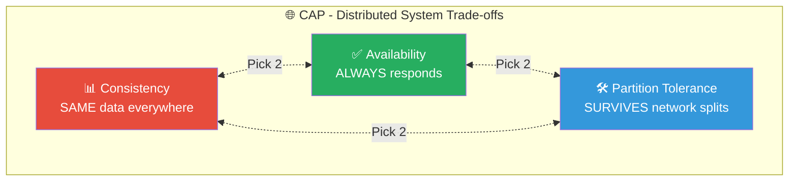
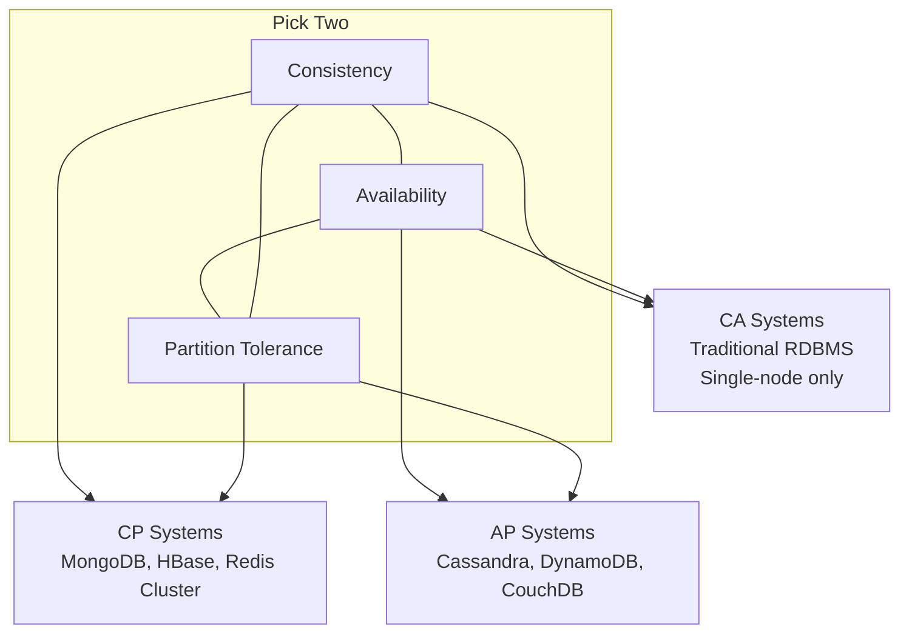
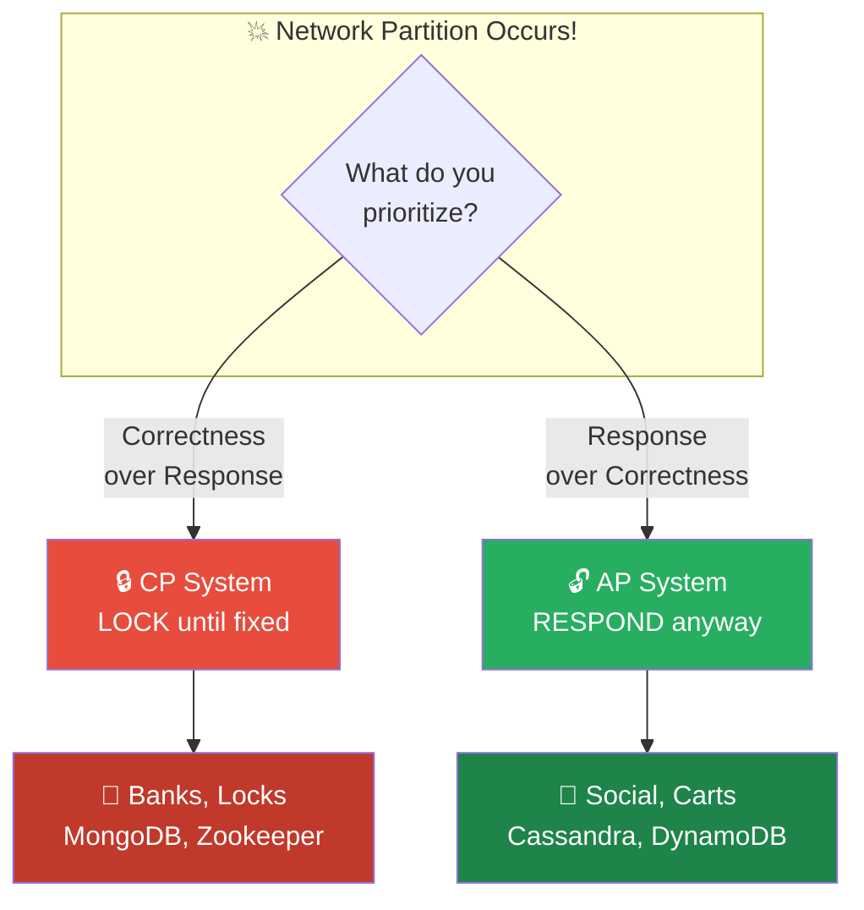
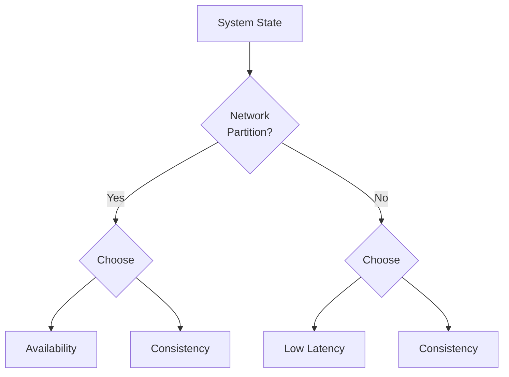
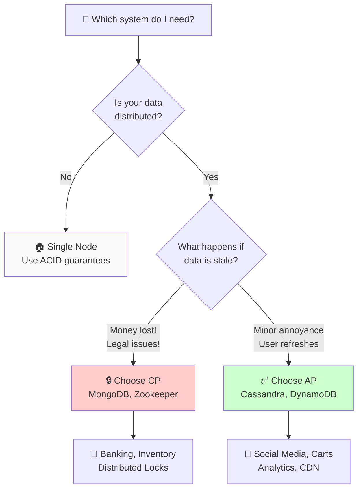
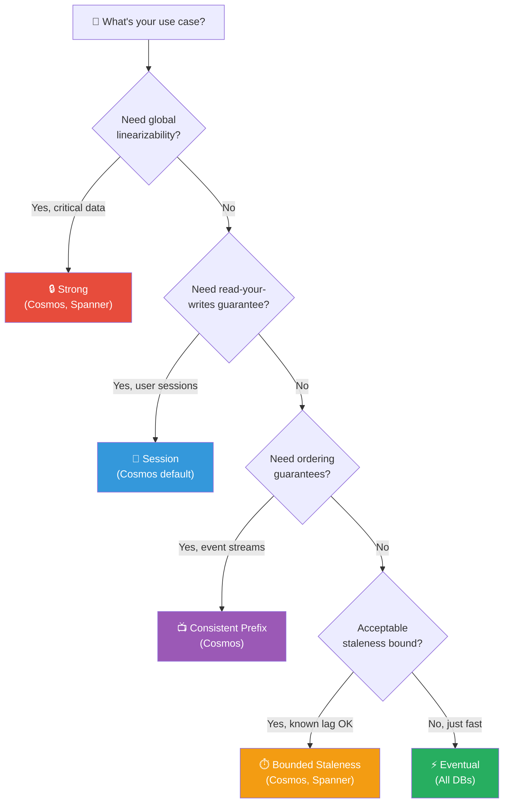

# CAP Theorem

## Overview

The CAP theorem, also known as Brewer's theorem, states that a distributed data store can only provide two of the following three guarantees simultaneously:

- **C**onsistency
- **A**vailability
- **P**artition Tolerance

## 🧠 Visual Mnemonic: The Pizza Shop with Two Locations

```
┌───────────────────────────────────────────────────────────────────┐
│          🍕 CAP = THE TWO PIZZA SHOPS DILEMMA               │
├───────────────────────────────────────────────────────────────────┤
│                                                                   │
│   You own 2 pizza shops in different cities.                     │
│   The phone line between them just BROKE! 📡❌                    │
│                                                                   │
│     🏪 Shop A               📡❌             🏪 Shop B              │
│   ┌───────────┐         (Network          ┌───────────┐          │
│   │ Menu: $10 │          Partition)        │ Menu: $10 │          │
│   └───────────┘                            └───────────┘          │
│                                                                   │
│   YOU (the owner) want to update the price to $12.               │
│   But you can only reach Shop A right now!                       │
│   What do you do?                                                 │
│                                                                   │
├───────────────────────────────────────────────────────────────────┤
│                                                                   │
│  OPTION 1: CP (Consistency)        OPTION 2: AP (Availability)   │
│  ═════════════════════════        ════════════════════════════   │
│                                                                   │
│  "🚫 CLOSED until phone works"   "✅ Update Shop A, sync later"   │
│  (Can't risk wrong prices!)      (Customers can still order!)    │
│                                                                   │
│  🏪🔒 ── 📡❌ ── 🏪🔒           🏪$12 ── 📡❌ ── 🏪$10            │
│  Both LOCKED                     Both OPEN                       │
│  (Prices stay consistent)       (Temporarily different prices!)  │
│                                                                   │
│  → Customers can't order         → Customers served              │
│  → But prices are NEVER wrong    → Shop B charges old price      │
│                                                                   │
└───────────────────────────────────────────────────────────────────┘
```

## Quick Visual Summary



## 🎯 Remember: ACID vs CAP at a Glance

```
┌─────────────────────────────┬──────────────────────────────────┐
│        🧪 ACID               │          🌐 CAP                  │
├─────────────────────────────┼──────────────────────────────────┤
│                             │                                  │
│   SINGLE database rules     │   DISTRIBUTED system trade-offs  │
│   🏦 One bank vault          │   🏦🏦🏦 Multiple bank branches   │
│                             │                                  │
│   "How to handle a          │   "What happens when             │
│    transaction safely"      │    branches can't talk?"         │
│                             │                                  │
│   Focus: 🔒 TRANSACTIONS     │   Focus: 📡 NETWORK FAILURES      │
│                             │                                  │
└─────────────────────────────┴──────────────────────────────────┘
```

## The Three Guarantees

### 📊 Consistency (C)

**Definition**: Every read receives the most recent write or an error. All nodes see the same data at the same time.

**Visual: The Synchronized Clocks**
```
       ALL NODES SHOW SAME DATA
    ┌─────────────────────────────────┐
    │                                 │
    │   🖥️        🖥️        🖥️        │
    │  $100      $100      $100      │
    │    │        │        │        │
    │    └────────┼────────┘        │
    │            │                   │
    │      ┌─────┴─────┐             │
    │      │ ALL SAME! │             │
    │      └───────────┘             │
    │                                 │
    │   Ask ANY node → Get $100      │
    └─────────────────────────────────┘
```

**Characteristics**:
- Linearizability - operations appear instantaneous
- All clients see the same data simultaneously
- Strong consistency guarantees

**Trade-off**: May need to reject requests during network partitions

### ✅ Availability (A)

**Definition**: Every request receives a (non-error) response, without guarantee that it contains the most recent write.

**Visual: The Always-Open Store**
```
         SYSTEM ALWAYS RESPONDS
    ┌─────────────────────────────────┐
    │                                 │
    │    👤 Customer                   │
    │       │                        │
    │       ↓ "What's my balance?"   │
    │                                 │
    │    🖥️ Server                    │
    │       │                        │
    │       ↓ "Here's an answer!"    │
    │         (might be stale)       │
    │                                 │
    │    🕐 Response: ALWAYS          │
    │    ❗ Accuracy: MAYBE           │
    └─────────────────────────────────┘
```

**Characteristics**:
- System always responds to requests
- No request times out or returns an error due to unavailability
- High uptime and responsiveness

**Trade-off**: May return stale data during network partitions

### 🛠️ Partition Tolerance (P)

**Definition**: The system continues to operate despite an arbitrary number of messages being dropped or delayed by the network between nodes.

**Visual: The Broken Bridge**
```
        NETWORK PARTITION HAPPENS
    ┌─────────────────────────────────────────┐
    │                                         │
    │   🏘️ City A        📡❌        🏘️ City B   │
    │   ┌─────┐     (Bridge       ┌─────┐       │
    │   │🖥️🖥️🖥️│      Down!)      │🖥️🖥️🖥️│       │
    │   └─────┘                  └─────┘       │
    │       │                      │           │
    │       └─────── 💥 ───────┘           │
    │           Can't Talk!                   │
    │                                         │
    │   System must still work somehow!       │
    │                                         │
    │   ⚠️ This WILL happen in real systems   │
    └─────────────────────────────────────────┘
```

**Characteristics**:
- Network can lose any number of messages
- System remains operational during network failures
- Essential for any distributed system

**Reality**: In distributed systems, partitions **will** happen. P is not optional.

## The CAP Triangle



## System Classifications

### Visual: CP vs AP Decision During Partition



### CP Systems (Consistency + Partition Tolerance)

**Behavior**: When partition occurs, system may become unavailable to maintain consistency.

```
  🔒 CP = "I'd rather be SILENT than WRONG"
  
  During Partition:
  ┌────────┐         ┌────────┐
  │ Node A │──❌────│ Node B │
  │  🔒    │         │  🔒    │
  └────────┘         └────────┘
       ↓                 ↓
    "Sorry,           "Sorry,
     can't help"       can't help"
```

| System | Notes |
|--------|-------|
| MongoDB | Primary/Secondary with majority writes |
| HBase | Strong consistency, may block during partitions |
| Redis Cluster | Consistency mode available |
| Zookeeper | Leader-based, strongly consistent |
| etcd | Raft consensus, strongly consistent |

**Use Cases**:
- Configuration management
- Leader election
- Distributed locking
- Financial transactions requiring accuracy

### AP Systems (Availability + Partition Tolerance)

**Behavior**: When partition occurs, system remains available but may return stale data.

```
  ✅ AP = "I'd rather give OLD data than NO data"
  
  During Partition:
  ┌────────┐         ┌────────┐
  │ Node A │──❌────│ Node B │
  │  ✅    │         │  ✅    │
  └────────┘         └────────┘
       ↓                 ↓
    "Here's             "Here's
     $100"                $95"
     (new)               (stale)
```

| System | Notes |
|--------|-------|
| Cassandra | Tunable consistency, typically AP |
| DynamoDB | Eventually consistent by default |
| CouchDB | Multi-master replication |
| Riak | Distributed key-value store |
| Cosmos DB | Multiple consistency models |

**Use Cases**:
- Social media feeds
- Shopping carts
- Real-time analytics
- DNS systems
- CDN caching

### CA Systems (Consistency + Availability)

**Behavior**: Cannot tolerate network partitions - essentially single-node systems.

| System | Notes |
|--------|-------|
| Single-node PostgreSQL | No partitions possible |
| Single-node MySQL | Traditional RDBMS |
| Single-node SQL Server | Not distributed |

**Reality**: CA is only possible without network partitions, making it impractical for truly distributed systems.

## CAP in Practice

### The PACELC Extension

CAP only describes behavior during partitions. PACELC extends this:

> If **P**artition: choose **A**vailability or **C**onsistency
> **E**lse (normal operation): choose **L**atency or **C**onsistency



| System | During Partition (PAC) | Normal Operation (ELC) |
|--------|------------------------|------------------------|
| Cassandra | AP | EL (Latency) |
| MongoDB | CP | EC (Consistency) |
| DynamoDB | AP | EL (Latency) |
| Spanner | CP | EC (Consistency) |

## Consistency Models Spectrum

```
Strong                                                    Weak
Consistency                                          Consistency
    |                                                      |
    v                                                      v
    
Linearizable → Sequential → Causal → Eventual → No Guarantee
    ↑              ↑           ↑         ↑
    |              |           |         |
  Spanner      Zookeeper    CRDT    Cassandra
```

### Eventual Consistency

Most AP systems use eventual consistency:

**Definition**: If no new updates are made, eventually all reads will return the last updated value.

**Considerations**:
- Conflict resolution strategies needed
- Read-your-writes consistency may be provided
- Monotonic reads may be guaranteed
- Time to convergence varies

## Practical Decision Framework

### 🧭 Visual Decision Tree



### Questions to Ask

1. **Can your application tolerate stale reads?**
   - Yes → Consider AP systems
   - No → Consider CP systems

2. **What's your partition frequency expectation?**
   - High → Partition tolerance is critical
   - Low → May consider CA for simplicity

3. **What's the cost of inconsistency vs unavailability?**
   - Inconsistency is expensive → CP
   - Unavailability is expensive → AP

### Decision Matrix

| Requirement | System Choice | Example |
|-------------|---------------|---------|
| Banking transactions | CP | PostgreSQL with sync replication |
| Shopping cart | AP | DynamoDB, Cassandra |
| User sessions | AP | Redis Cluster (AP mode) |
| Distributed locks | CP | Zookeeper, etcd |
| Social media feed | AP | Cassandra |
| Inventory count | CP or careful AP | Depends on tolerance |

## Common Misconceptions

### Misconception 1: "You must always sacrifice one property"
**Reality**: CAP trade-offs only apply during network partitions. Most of the time, you can have all three.

### Misconception 2: "CA systems exist in distributed environments"
**Reality**: Network partitions are inevitable in distributed systems. True CA is only possible in single-node systems.

### Misconception 3: "CAP is binary"
**Reality**: Many systems offer tunable consistency. You can adjust the trade-off based on operation type.

## Tunable Consistency Example

### Azure Cosmos DB: The 5 Consistency Levels

Cosmos DB offers a **spectrum of consistency** rather than a binary choice, giving you fine-grained control over the consistency-availability trade-off.

```
┌─────────────────────────────────────────────────────────────────────────────┐
│              Azure Cosmos DB Consistency Spectrum                           │
├─────────────────────────────────────────────────────────────────────────────┤
│                                                                             │
│   STRONG ◄─────────────────────────────────────────────────► EVENTUAL      │
│   (CP)                                                            (AP)      │
│                                                                             │
│   ┌────────┐  ┌────────────┐  ┌─────────┐  ┌────────────┐  ┌──────────┐   │
│   │Strong  │  │ Bounded    │  │ Session │  │ Consistent │  │ Eventual │   │
│   │        │  │ Staleness  │  │         │  │ Prefix     │  │          │   │
│   └────────┘  └────────────┘  └─────────┘  └────────────┘  └──────────┘   │
│       │            │              │              │              │          │
│   Strongest    Predictable    Read-your-    Order         Weakest        │
│   Guarantees   Lag Bounds     writes        Preserved     (Fastest)      │
│                                                                             │
│   🏦 Banking   📈 Stock       🛒 Shopping   📺 Live       👍 Likes        │
│                Quotes          Carts         Scores        Counts          │
│                                                                             │
└─────────────────────────────────────────────────────────────────────────────┘
```

#### Visual: The 5 Levels Explained

```
┌─────────────────────────────────────────────────────────────────────────────┐
│                                                                             │
│  1️⃣ STRONG                                                                  │
│  ═══════════                                                                │
│  "Everyone sees the same thing, always"                                     │
│                                                                             │
│     Write $100 ──► ALL regions sync ──► Then return success                │
│                                                                             │
│     🖥️ East US    🖥️ West EU    🖥️ Asia                                    │
│        $100   ═══   $100   ═══   $100   ✓ All identical                    │
│                                                                             │
│  ✅ Linearizable (strongest)   ⚠️ Higher latency   💰 2x read cost         │
│                                                                             │
├─────────────────────────────────────────────────────────────────────────────┤
│                                                                             │
│  2️⃣ BOUNDED STALENESS                                                       │
│  ═══════════════════                                                        │
│  "Data can be stale, but only by THIS much"                                 │
│                                                                             │
│     Configure: Max K versions behind OR Max T seconds behind               │
│                                                                             │
│     Write $100 (now) ──► Other regions see $100 within bounds              │
│                                                                             │
│     🖥️ Primary: $100    🖥️ Secondary: $95 (but max 5 min behind)           │
│                                                                             │
│  ✅ Predictable lag   ✅ Strong in single region   📈 Good for stocks      │
│                                                                             │
├─────────────────────────────────────────────────────────────────────────────┤
│                                                                             │
│  3️⃣ SESSION (Default)                                                       │
│  ════════════════════                                                       │
│  "YOU always see YOUR writes"                                               │
│                                                                             │
│     Your Session:                                                           │
│     Write A ──► Write B ──► Read ──► You see A and B ✓                     │
│                                                                             │
│     Other User's Session:                                                   │
│     Read ──► Might not see your A and B yet                                │
│                                                                             │
│     👤 You: Add to cart ──► View cart ──► See your items ✓                 │
│     👤 Friend: View your wishlist ──► Might see older version              │
│                                                                             │
│  ✅ Read-your-writes   ✅ Best balance   🛒 Perfect for user sessions      │
│                                                                             │
├─────────────────────────────────────────────────────────────────────────────┤
│                                                                             │
│  4️⃣ CONSISTENT PREFIX                                                       │
│  ═══════════════════                                                        │
│  "Order is always preserved, no gaps"                                       │
│                                                                             │
│     Writes: A ──► B ──► C                                                  │
│                                                                             │
│     ✅ Readers can see: [] or [A] or [A,B] or [A,B,C]                      │
│     ❌ Never see: [B] or [A,C] or [C,A] (out of order!)                    │
│                                                                             │
│     📺 Sports Score: 10 ──► 20 ──► 30                                      │
│         Viewers see: 10 ──► 20 ──► 30 (never 10 ──► 30, skipping 20)       │
│                                                                             │
│  ✅ Order preserved   ⚠️ No read-your-writes   📺 Good for event streams   │
│                                                                             │
├─────────────────────────────────────────────────────────────────────────────┤
│                                                                             │
│  5️⃣ EVENTUAL                                                                │
│  ═══════════                                                                │
│  "Eventually everyone agrees, but no guarantees on when or order"          │
│                                                                             │
│     Writes: A ──► B ──► C                                                  │
│                                                                             │
│     Reader 1 might see: [C, A]                                              │
│     Reader 2 might see: [B]                                                 │
│     Reader 3 might see: [A, B, C] ✓                                         │
│                                                                             │
│  ✅ Fastest   ✅ Cheapest   ✅ Highest availability   👍 Good for counters │
│                                                                             │
└─────────────────────────────────────────────────────────────────────────────┘
```

#### Cosmos DB Consistency Comparison Table

| Level | Guarantee | Read Cost | Latency | Best For |
|-------|-----------|-----------|---------|----------|
| **Strong** | Linearizable, global | 2x RU | Highest | Financial, inventory |
| **Bounded Staleness** | Max lag: K versions or T time | 2x RU | High | Stock quotes, location |
| **Session** | Read-your-writes (per session) | 1x RU | Medium | Shopping carts, user prefs |
| **Consistent Prefix** | Order preserved globally | 1x RU | Low | Live feeds, activity streams |
| **Eventual** | No ordering guarantee | 1x RU | Lowest | Likes, retweet counts |

### Comparison: Tunable Consistency Across Databases

```
┌────────────────────────────────────────────────────────────────────────────────┐
│                    TUNABLE CONSISTENCY COMPARISON                              │
├─────────────────┬──────────────────────────────────────────────────────────────┤
│                 │                    Consistency Options                       │
│    Database     ├──────────┬───────────┬─────────┬───────────┬────────────────┤
│                 │  Strong  │ Bounded   │ Session │ Prefix/   │   Eventual     │
│                 │          │ Staleness │         │ Causal    │                │
├─────────────────┼──────────┼───────────┼─────────┼───────────┼────────────────┤
│ Cosmos DB       │    ✅    │    ✅     │   ✅    │    ✅     │      ✅        │
│ (5 levels)      │          │           │ DEFAULT │           │                │
├─────────────────┼──────────┼───────────┼─────────┼───────────┼────────────────┤
│ Cassandra       │    ✅    │    ❌     │   ❌    │    ❌     │      ✅        │
│ (Tunable)       │  (ALL)   │           │         │           │    (ONE)       │
│                 │ QUORUM   │           │         │           │                │
├─────────────────┼──────────┼───────────┼─────────┼───────────┼────────────────┤
│ DynamoDB        │    ✅    │    ❌     │   ❌    │    ❌     │      ✅        │
│ (2 levels)      │ Optional │           │         │           │    DEFAULT     │
├─────────────────┼──────────┼───────────┼─────────┼───────────┼────────────────┤
│ MongoDB         │    ✅    │    ❌     │   ✅    │    ✅     │      ✅        │
│ (Read Concern)  │ majority │           │ local   │ snapshot  │   available    │
├─────────────────┼──────────┼───────────┼─────────┼───────────┼────────────────┤
│ CockroachDB     │    ✅    │    ✅     │   ❌    │    ❌     │      ❌        │
│ (Serializable)  │ DEFAULT  │ Follower  │         │           │                │
│                 │          │  Reads    │         │           │                │
├─────────────────┼──────────┼───────────┼─────────┼───────────┼────────────────┤
│ Spanner         │    ✅    │    ✅     │   ❌    │    ❌     │      ❌        │
│ (Strong default)│ DEFAULT  │  Stale    │         │           │                │
│                 │          │  Reads    │         │           │                │
├─────────────────┼──────────┼───────────┼─────────┼───────────┼────────────────┤
│ PostgreSQL      │    ✅    │    ❌     │   ❌    │    ❌     │      ❌        │
│ (Single node)   │ Only     │           │         │           │                │
└─────────────────┴──────────┴───────────┴─────────┴───────────┴────────────────┘
```

### Cassandra Tunable Consistency

Cassandra allows per-query consistency tuning using read/write levels:

| Read + Write Levels | Consistency | Availability |
|--------------------|-------------|--------------|
| ONE + ONE | Low | High |
| QUORUM + QUORUM | High | Medium |
| ALL + ALL | Highest | Low |

**Formula**: `R + W > N` ensures strong consistency
- R = read replicas
- W = write replicas  
- N = total replicas

```
Example: 3 replicas (N=3)

ONE + ONE (R=1, W=1):     1 + 1 = 2 ≤ 3  → Eventual
QUORUM + QUORUM (R=2, W=2): 2 + 2 = 4 > 3  → Strong ✓
ALL + ONE (R=3, W=1):     3 + 1 = 4 > 3  → Strong ✓
```

### DynamoDB Consistency Options

```
┌─────────────────────────────────────────────────────────────────┐
│                    DynamoDB Consistency                         │
├─────────────────────────────────────────────────────────────────┤
│                                                                 │
│  📖 Eventually Consistent Reads (DEFAULT)                       │
│  ═══════════════════════════════════════                        │
│  • Might not reflect recent writes                              │
│  • 0.5 RCU per 4KB (cheaper!)                                   │
│  • Best for: Read-heavy, stale-tolerant workloads              │
│                                                                 │
│  📖 Strongly Consistent Reads                                   │
│  ═══════════════════════════════════════                        │
│  • Always returns most recent data                              │
│  • 1 RCU per 4KB (2x cost)                                      │
│  • Set: ConsistentRead = true                                   │
│  • Best for: Inventory, financial reads                         │
│                                                                 │
│  ⚠️ No session or bounded staleness options                    │
│  ⚠️ Strong consistency only in same region                     │
│                                                                 │
└─────────────────────────────────────────────────────────────────┘
```

### MongoDB Read Concern Levels

| Read Concern | Description | Similar To |
|--------------|-------------|------------|
| `local` | Returns most recent data from node | Session-like |
| `available` | Returns data without guarantees | Eventual |
| `majority` | Returns data acknowledged by majority | Strong |
| `linearizable` | Strongest, waits for concurrent writes | Strong+ |
| `snapshot` | Point-in-time consistent view | Consistent Prefix |

### 🎯 Decision Guide: Which Consistency Level?



### Real-World Scenario Mapping

| Scenario | Cosmos DB | Cassandra | DynamoDB | MongoDB |
|----------|-----------|-----------|----------|---------|
| Bank transfer | Strong | ALL/ALL | Strong Read | linearizable |
| Shopping cart | Session | QUORUM | Eventual | local |
| Live sports scores | Consistent Prefix | ONE/ONE | Eventual | snapshot |
| Stock ticker | Bounded Staleness | QUORUM | Strong Read | majority |
| Like/View counts | Eventual | ONE/ONE | Eventual | available |
| User preferences | Session | QUORUM | Eventual | local |

## Related Concepts

- [ACID Properties](acid-properties.md) - Transaction guarantees
- [Event-Driven Architecture](../../03-integration-communication-architecture/event-driven-messaging/patterns/event-driven-architecture.md) - Handling distributed data
- [Saga Pattern](../../02-application-software-architecture/design-patterns/saga-pattern.md) - Distributed transactions
