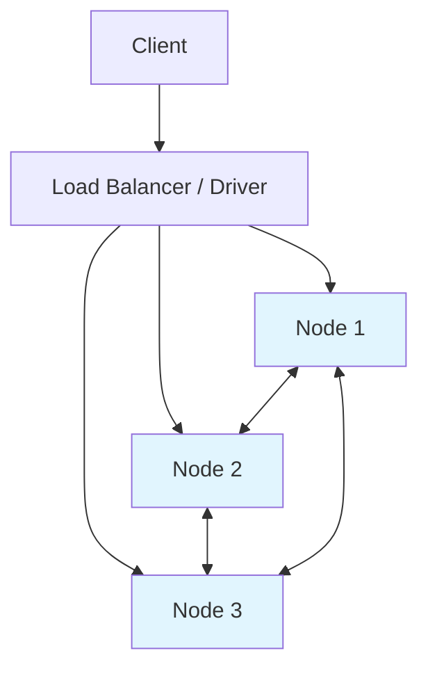

# Apache Cassandra

> **Taxonomy Reference**: §4.0 Data Architecture Fundamentals (see [Architecture Taxonomy Reference](../../10-practicality-taxonomy/architecture_taxonomy_reference.md))
> **Term Definition**: See [Apache Cassandra](../../../reference-dictionary/databases.md#apache-cassandra)

Apache Cassandra is a distributed, masterless NoSQL database optimized for high write throughput, continuous availability, and linear horizontal scaling across multiple regions.

## Problem

Traditional relational databases struggle with workloads that require:

- Massive write throughput across many nodes
- Continuous uptime during node or region failures
- Low-latency reads and writes in multiple geographic regions
- Elastic scaling without a single point of failure

A single-primary architecture pauses writes during failover and funnels all writes through one node, becoming a bottleneck at scale.

## Solution

Cassandra uses a **masterless, peer-to-peer ring architecture** where every node is equal. Data is partitioned and replicated across the cluster using a partition key hash. Any node can accept reads or writes, and clients connect to the nearest replica for local-latency operations.



## Abstraction Level

- [x] Logical (Design)
- [x] Physical (Implementation)
- [ ] Conceptual (Strategic)
- [ ] Runtime (Operational)

## Core Features

| Feature | Description | Benefit |
|---|---|---|
| **Masterless architecture** | Every node is a peer; no primary/secondary distinction | No single point of failure; no election pause |
| **Tunable consistency** | Per-operation consistency levels: `ANY`, `ONE`, `TWO`, `THREE`, `QUORUM`, `ALL`, `LOCAL_QUORUM`, `EACH_QUORUM` | Trade consistency for latency/availability per query |
| **Linear scalability** | Adding nodes increases throughput and storage capacity proportionally | Scale out cheaply on commodity hardware |
| **Multi-region replication** | Data centers can be added to the replication topology | Local reads/writes for global users |
| **Write-optimized storage** | Append-only commit log + memtable flushed to immutable SSTables | Very high ingest throughput |
| **Built-in repair mechanisms** | Anti-entropy repair, hinted handoff, read repair | Replicas converge without manual intervention |

## Consistency Traits

Cassandra is typically classified as an **AP** system under the [CAP Theorem](cap-theorem.md): it favors availability and partition tolerance over strong consistency. However, consistency is **tunable** per operation.

### Consistency Levels

| Level | Behavior | Typical Use Case |
|---|---|---|
| `ONE` | Acknowledge after first replica responds | Low-latency reads where staleness is acceptable |
| `QUORUM` | Majority of replicas (`(RF/2)+1`) must respond | Balance of consistency and availability |
| `ALL` | All replicas must respond | Strong consistency; write fails if any replica is down |
| `LOCAL_QUORUM` | Majority in the local data center | Avoid cross-region latency while staying consistent |
| `EACH_QUORUM` | Majority in every data center | Strong consistency across regions; higher latency |

The replication factor (`RF`) and consistency level (`CL`) together determine the observed consistency. For example, with `RF=3` and `CL=QUORUM`, writes and reads both require two replicas, guaranteeing read-your-writes consistency.

### Lightweight Transactions (LWT)

For operations that require linearizable semantics — such as inserting a unique custom alias — Cassandra provides `IF NOT EXISTS` writes backed by Paxos. LWT is significantly slower than normal writes and should be used sparingly.

## Data Model

Cassandra data modeling is **query-first**: tables are designed to serve specific access patterns, often denormalizing data rather than joining.

```sql
-- Redirect lookup by short code
CREATE TABLE url_mappings (
    url_part text PRIMARY KEY,
    original_url text,
    redirect_type tinyint,
    expiration_date timestamp
);

-- Time-series clicks partitioned by URL and day
CREATE TABLE click_stats_daily (
    url_part text,
    bucket_day date,
    click_time timestamp,
    region text,
    count counter,
    PRIMARY KEY ((url_part, bucket_day), click_time, region)
);
```

Key modeling rules:

- The **partition key** determines data distribution and query routing.
- **Clustering columns** define sort order within a partition.
- Avoid unbounded partitions; use time bucketing for high-cardinality time series.
- Prefer denormalization over joins; joins are not natively supported.

## When to Use

- High-write-throughput workloads: IoT telemetry, messaging, logging, time-series
- Multi-region applications requiring local read/write latency
- Systems where write availability must continue during node or region failures
- Workloads with well-defined, simple access patterns (key lookups, time-range scans)
- Use cases that can tolerate eventual consistency or explicitly tune consistency per query

## When NOT to Use

- Workloads requiring complex joins, ad-hoc queries, or rich aggregations
- Systems where strong consistency is mandatory during network partitions (e.g., core banking, payment ledgers)
- Small datasets where operational complexity outweighs scaling benefits
- Frequent multi-row transactions or `IF NOT EXISTS` patterns at high throughput

## Implementation Considerations

| Area | Guidance |
|---|---|
| **Partition sizing** | Keep partitions under 100 MB and ideally under a few hundred megabytes to avoid compaction and read issues. |
| **Replication factor** | Use `RF=3` in production per data center; higher RF improves durability but increases write coordination. |
| **Consistency tuning** | Use `LOCAL_QUORUM` for most cross-region workloads; reserve `ALL` for rare strong-consistency needs. |
| **Repair schedule** | Run `nodetool repair` regularly to ensure replicas converge, especially after node outages. |
| **Driver configuration** | Use a data-center-aware driver with token-aware routing to send queries to replicas holding the data. |
| **Monitoring** | Track partition size, compaction backlog, repair progress, and read/write latency p99. |

## Comparison with Alternative Stores

| Characteristic | Cassandra | MongoDB | PostgreSQL |
|---|---|---|---|
| Architecture | Masterless, peer-to-peer | Single-primary replica sets | Single-primary with replicas |
| Consistency | Tunable, eventual by default | Tunable, strong by default | Strong ACID |
| Best workload | High write throughput, time-series | Flexible documents, rich queries | Complex transactions, relational data |
| Multi-region writes | Native, local writes everywhere | Writes routed to primary | Typically single primary |
| Joins | Not supported | Limited `$lookup` | Full SQL joins |
| Scaling model | Horizontal, add nodes | Horizontal via sharding | Vertical + read replicas |

## Apache Cassandra versus Azure Cosmos DB for Cassandra

Azure Cosmos DB for Cassandra provides Cassandra wire-protocol compatibility as a managed Azure service, but it is not identical to operating a native Cassandra cluster. The most important difference is consistency control: native Cassandra exposes separate read and write consistency levels per request, while Cosmos DB uses an account-level consistency policy for writes and maps Cassandra driver read levels to the closest supported Cosmos DB behavior.

### Consistency level mapping

The following is a practical map for the common single-region-read case. These are **closest analogues**, not semantic equivalents. Native Cassandra chooses read and write levels independently for each operation; Azure Cosmos DB for Cassandra applies an account-level default to writes and dynamically maps supported Cassandra driver read levels.

| Apache Cassandra level or combination | Closest Azure Cosmos DB consistency level | Practical interpretation |
|---|---|---|
| `ONE`, `LOCAL_ONE`, or `ANY` for reads | `Eventual` | Lowest-latency read path; a single replica may return stale data. `ANY` is write-only in native Cassandra and has no exact Cosmos equivalent. |
| `TWO` or `THREE` for reads | `Strong` when the account policy and write path support it | Reads from multiple replicas provide a local quorum-like guarantee; Cosmos has no exact two-node write acknowledgement. |
| `LOCAL_QUORUM` for reads | `Strong` when the account policy and write path support it | Closest to a local quorum read; Cosmos uses its own replica and region protocol rather than Cassandra's configured replication factor. |
| `QUORUM` or `EACH_QUORUM` for reads | `Strong` for single-region writes; no exact equivalent for multi-region writes | Closest to quorum-based strong reads. Native `EACH_QUORUM` requires a quorum in every data center, while Cosmos `Strong` is a service-managed account policy. |
| `ALL` for reads | `Strong` | Both require the strongest read condition in their respective systems, but failure behavior and replica topology differ. |
| `ANY`, `ONE`, `TWO`, `THREE`, `LOCAL_QUORUM`, `QUORUM`, or `EACH_QUORUM` for writes | Account default: `Strong`, `Bounded staleness`, `Session`, `Consistent prefix`, or `Eventual` | Native Cassandra acknowledges according to the requested write level. Cosmos durably commits according to the account policy; the write level cannot be changed per request. |
| `SERIAL` or `LOCAL_SERIAL` for LWT | Closest to `Strong` for the conditional operation | This is only an approximate comparison. Cassandra uses Paxos for LWT, while Cosmos uses its own durable coordination mechanism. |
| No native Cassandra equivalent | `Bounded staleness` | Cosmos-only guarantee that limits replica lag by a configured number of versions or time interval. |
| No native Cassandra equivalent | `Session` | Cosmos-only session-token guarantee, including read-your-writes within a client session. |
| No native Cassandra equivalent | `Consistent prefix` | Cosmos-only ordering guarantee that prevents reads from observing writes out of order. |

The levels therefore should not be translated mechanically. For example, `QUORUM` in native Cassandra means a quorum of the configured replica set, whereas `Strong` in Cosmos DB is a service-level replication guarantee. Conversely, a Cosmos account configured for `Eventual` does not become strongly consistent merely because an application issues a Cassandra `QUORUM` read; the request is constrained by the account policy, subject to supported read overrides.

### Choosing between them

| Requirement | Prefer Apache Cassandra | Prefer Azure Cosmos DB for Cassandra |
|---|---|---|
| Need exact per-operation read/write quorum control | Yes | No; use the account policy and supported read overrides |
| Need a managed Azure service with built-in regional distribution, failover, and Azure integration | No | Yes |
| Need to preserve an existing Cassandra deployment model and operational controls | Yes | Only after validating API and consistency compatibility |
| Need strong consistency across multiple regions | Possible with careful `EACH_QUORUM`/replication design, with availability and latency costs | Use single-region writes with `Strong` consistency where the regional-distance and availability constraints are acceptable |
| Need low-latency globally distributed writes | Yes, with native multi-master and eventual or tuned consistency | Yes, with multi-region writes and a weaker Cosmos consistency policy |

For the detailed, version-sensitive mapping of Cassandra consistency levels to Azure Cosmos DB behavior, see Microsoft's [Apache Cassandra and Azure Cosmos DB consistency levels](https://learn.microsoft.com/en-us/azure/cosmos-db/cassandra/consistency-mapping) and the repository's [Azure Cosmos DB consistency levels](../../../architecture-azure/data/databases/azure_cosmosdb/cosmosdb_consistency_levels.md) guide.

## Related Concepts

- [BASE Properties](base-properties.md) — Availability-first semantics
- [CAP Theorem](cap-theorem.md) — Trade-offs in distributed systems
- [ACID Properties](acid-properties.md) — Strong transaction guarantees
- [Apache Cassandra](../../../reference-dictionary/databases.md#apache-cassandra) — Term definition and characteristics

## Platform-Specific Implementations

> **Azure Implementation**: See [Azure Managed Instance for Apache Cassandra](../../../architecture-azure/data/databases/) for Azure-specific deployment and migration options.
