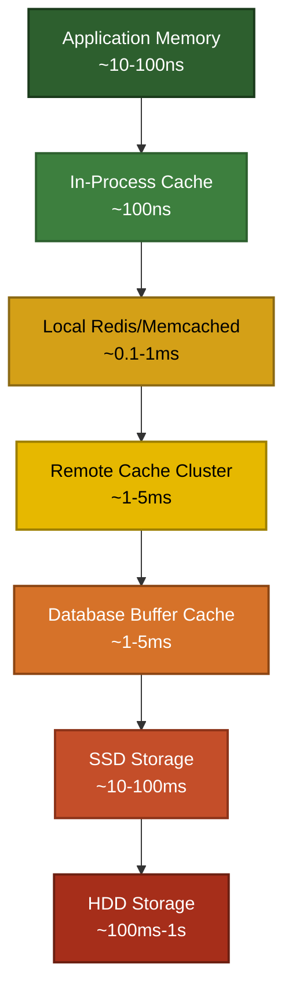
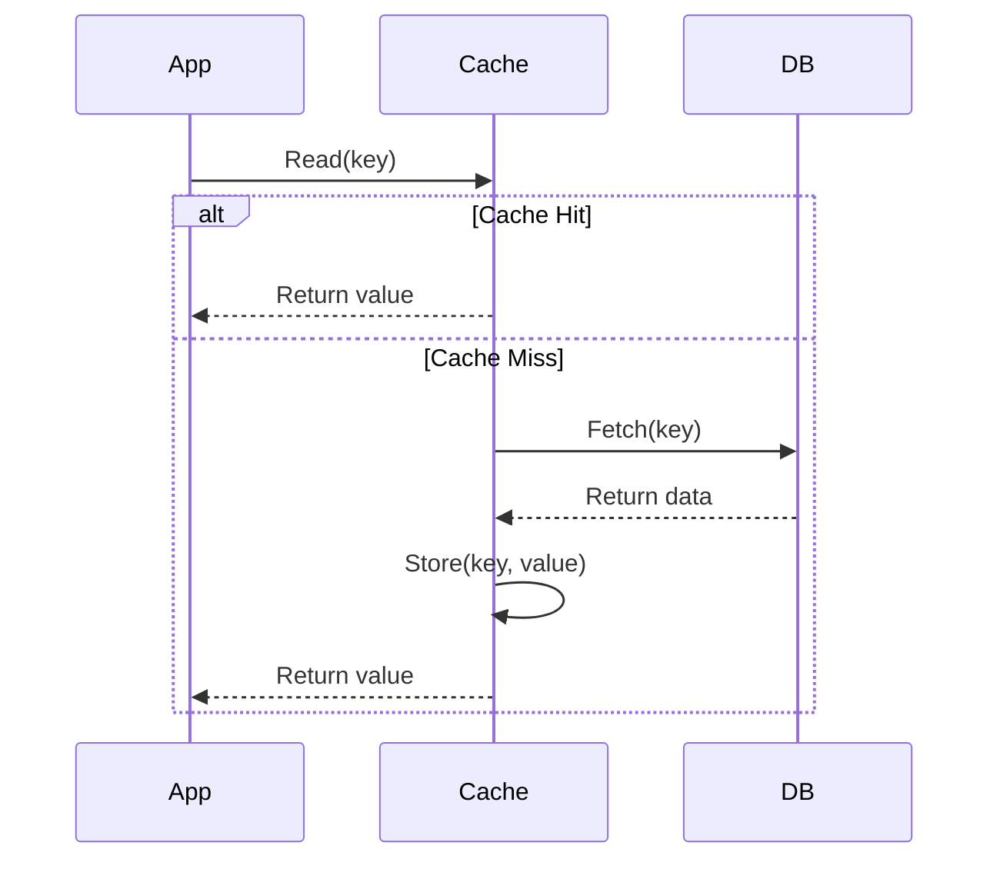
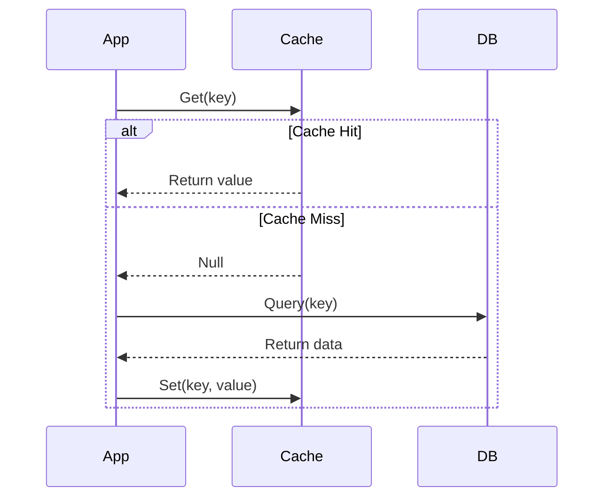
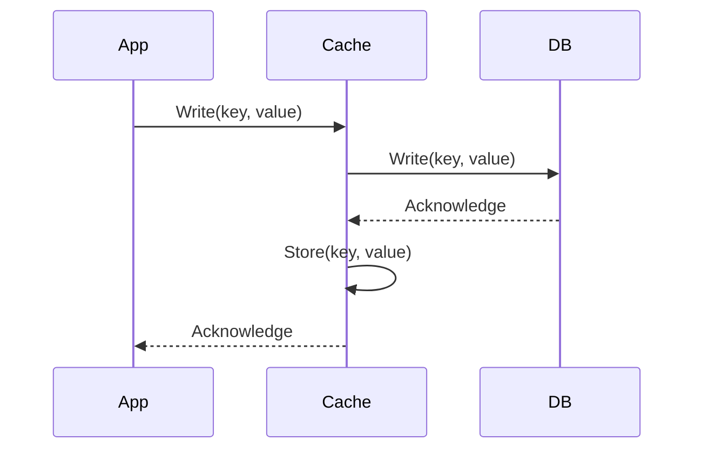
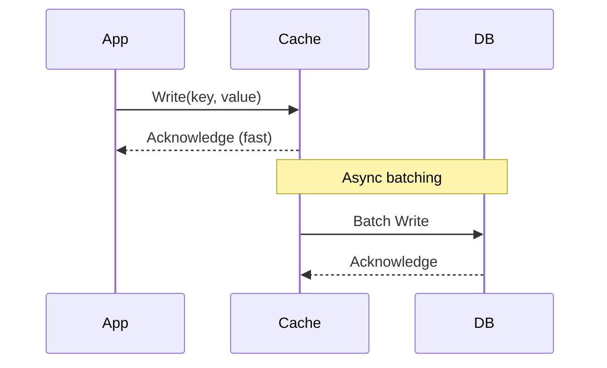
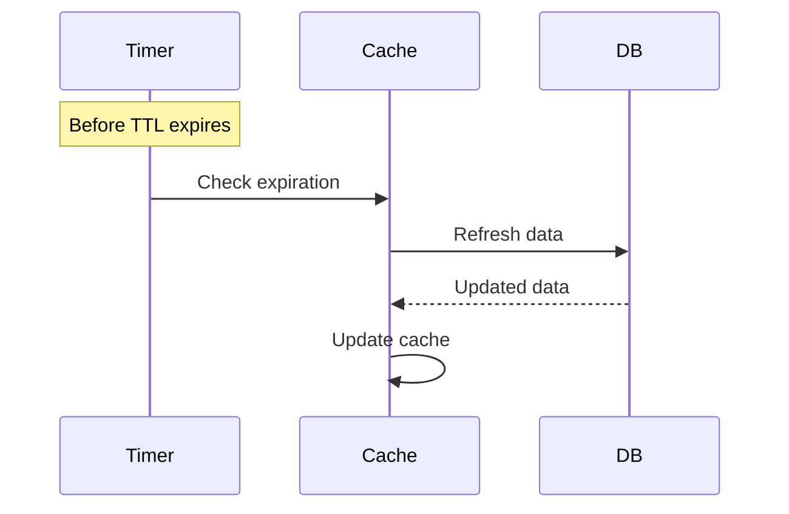
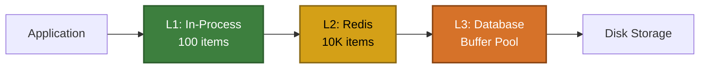
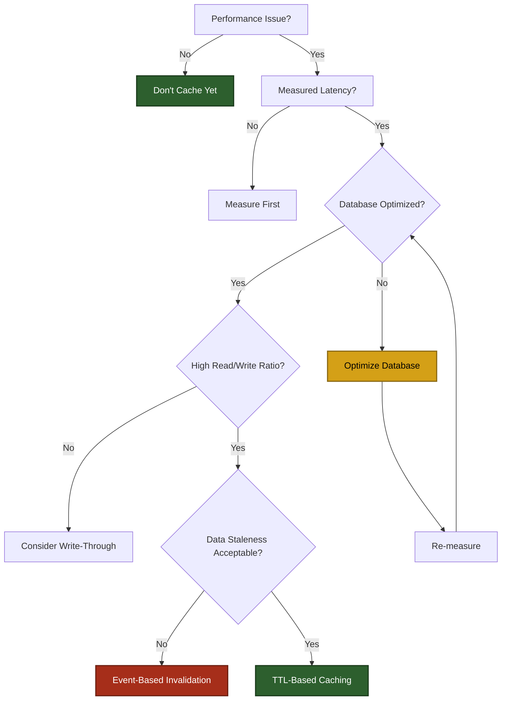

# Database Caching Patterns

## Overview

Caching is a fundamental technique for improving database performance by storing frequently accessed data in faster storage tiers. This document covers general caching patterns, strategies, and decision frameworks applicable across different database systems.

## Table of Contents

- [Caching Layers](#caching-layers)
- [Cache Strategies](#cache-strategies)
- [Cache Invalidation Patterns](#cache-invalidation-patterns)
- [Cache Design Patterns](#cache-design-patterns)
- [Performance Considerations](#performance-considerations)
- [Common Pitfalls](#common-pitfalls)

## Caching Layers

### Memory Hierarchy



**Application Memory vs In-Process Cache:**
- **Application Memory**: Direct variable/object access in RAM (~10-100ns). No caching structure, just runtime data storage.
- **In-Process Cache**: Structured cache within the application process (Map, LRU, etc.) with eviction policies, TTL management, and size limits (~100ns). Same memory space, but adds cache management logic.

### Layer Characteristics

| Layer | Latency | Capacity | Durability | Consistency |
|-------|---------|----------|------------|-------------|
| In-Process | 100ns | MB | Lost on restart | Perfect |
| Local Cache | 0.1ms | GB | Lost on restart | Eventual |
| Remote Cache | 1-5ms | GB-TB | Configurable | Eventual |
| DB Buffer | 1-5ms | GB | Persistent | Strong |
| Disk Storage | 10ms+ | TB-PB | Persistent | Strong |

## Cache Strategies

### Read-Through Cache

Application reads from cache, cache fetches from database on miss.



**Pros:**
- Transparent to application
- Cache manages data loading
- Simplified application code

**Cons:**
- First request always slow (cache miss)
- Cache handles DB connection logic
- Difficult to implement cache warming

**Use When:**
- Read-heavy workloads
- Data access patterns are predictable
- Cache miss penalty is acceptable

### Cache-Aside (Lazy Loading)

Application explicitly manages cache reads and writes.



**Pros:**
- Application controls caching logic
- Only requested data is cached
- Cache failures don't break application

**Cons:**
- Application code complexity
- Cache miss penalty (extra roundtrip)
- Potential for stale data

**Use When:**
- Sporadic access patterns
- Cache is not critical path
- Need fine-grained control over caching

### Write-Through Cache

Writes go through cache to database synchronously.



**Pros:**
- Cache always consistent with database
- No stale data on reads
- Simplified read logic

**Cons:**
- Write latency increased
- Cache failures break writes
- Unnecessary caching of infrequently read data

**Use When:**
- Strong consistency required
- Read latency is critical
- Write frequency is moderate

### Write-Behind (Write-Back) Cache

Writes go to cache first, asynchronously to database.



**Pros:**
- Low write latency
- Batch operations reduce DB load
- Better write throughput

**Cons:**
- Risk of data loss on cache failure
- Complex error handling
- Eventual consistency

**Use When:**
- Write-heavy workloads
- Can tolerate eventual consistency
- High write throughput required

### Refresh-Ahead

Proactively refresh cache before expiration.



**Pros:**
- Eliminates cache miss latency
- Predictable performance
- No "thundering herd" on expiration

**Cons:**
- Unnecessary refreshes for unused keys
- Additional DB load
- Complex to implement

**Use When:**
- Predictable access patterns
- Cache misses are expensive
- Data changes on known schedule

## Cache Invalidation Patterns

> "There are only two hard things in Computer Science: cache invalidation and naming things." - Phil Karlton

### Time-To-Live (TTL)

**Pattern:**
```redis
SET user:123 "data" EX 3600  # Expire after 1 hour
```

**Pros:**
- Simple to implement
- Automatic cleanup
- Predictable memory usage

**Cons:**
- Data can be stale before expiration
- Arbitrary expiration time
- Cache stampede on expiration

**Best Practices:**
- Add jitter to TTL: `TTL = base_ttl + random(0, jitter)`
- Shorter TTL for frequently changing data
- Longer TTL for static reference data

### Event-Based Invalidation

**Pattern:**
```javascript
// On database write
await db.updateUser(userId, data);
await cache.delete(`user:${userId}`);
```

**Pros:**
- Cache stays synchronized
- No stale data
- Immediate consistency

**Cons:**
- Complex to implement
- Must track all write paths
- Cache invalidation bugs are common

**Best Practices:**
- Use database triggers or change data capture (CDC)
- Implement idempotent invalidation
- Log all invalidation events

### Cache Tagging

**Pattern:**
```javascript
// Tag cache entries by entity type
cache.set('user:123', data, {tags: ['user', 'org:456']});

// Invalidate by tag
cache.invalidateTag('org:456');  // Clears all org data
```

**Pros:**
- Bulk invalidation
- Hierarchical cache clearing
- Flexible invalidation patterns

**Cons:**
- Additional metadata storage
- Complex tag management
- Limited native support

### Version-Based Invalidation

**Pattern:**
```javascript
// Include version in cache key
const version = await getConfigVersion();
cache.get(`config:${version}`);

// Invalidate by incrementing version
incrementConfigVersion();
```

**Pros:**
- No explicit invalidation needed
- Multiple versions can coexist
- Safe for gradual rollouts

**Cons:**
- Cache bloat (old versions remain)
- Requires version management
- Memory cleanup needed

## Cache Design Patterns

### Cache Warming

Proactively populate cache with likely-needed data.

**Implementation:**
```javascript
async function warmCache() {
  const popularItems = await db.getMostAccessedItems(100);
  
  for (const item of popularItems) {
    await cache.set(`item:${item.id}`, item);
  }
}

// Run on application startup
await warmCache();
```

**When to Use:**
- Predictable access patterns
- High cost of cache misses
- Application startup acceptable delay

### Cache Stampede Prevention

Multiple requests for same expired key overwhelming database.

**What Is Cache Stampede?**

When a popular cache key expires, hundreds or thousands of requests simultaneously hit the database to regenerate it:

```
Time: 10:00:00 - Product page cached, expires at 10:05:00
Time: 10:05:00 - Cache expires
Time: 10:05:00.001 - 1,000 users request the same product page
                      ↓
                   Cache Miss (all 1,000 requests)
                      ↓
                   1,000 simultaneous database queries
                      ↓
                   Database overwhelmed!
```

**Problem:**
```javascript
// 1000 requests for expired cache key
// All simultaneously query database
```

**Solution: Request Coalescing**
```javascript
const inFlight = new Map();

async function getCached(key) {
  // Check if request already in-flight
  if (inFlight.has(key)) {
    return inFlight.get(key);
  }
  
  // Start new request
  const promise = fetchFromDB(key);
  inFlight.set(key, promise);
  
  try {
    const result = await promise;
    await cache.set(key, result);
    return result;
  } finally {
    inFlight.delete(key);
  }
}
```

**How It Works:**
- Request 1 at 10:05:00.001 → Fetches from DB, creates promise
- Requests 2-1000 at 10:05:00.002-10:05:00.100 → Reuse Request 1's promise
- **Result: Only 1 DB query instead of 1,000!**

**Solution: Probabilistic Early Expiration**
```javascript
// Refresh cache before expiration
const beta = 1; // Tuning parameter
const now = Date.now();
const delta = expiry - now;
const shouldRefresh = delta * beta * Math.log(Math.random()) < 0;

if (shouldRefresh) {
  refreshCache(key);
}
```

**How It Works:**
- Instead of hard expiration at exactly 10:05:00
- Start refreshing randomly between 10:04:50 and 10:05:00
- As expiration approaches, probability of refresh increases
- **Result: Requests spread out over time instead of all at once**

**Real-World Analogy:**

A popular coffee shop posts daily specials on a board that gets erased at exactly 9 AM:

- **Stampede Problem**: At 9:00 AM, 100 customers all ask the barista "What's today's special?" The barista gets overwhelmed.
- **Request Coalescing**: First customer asks. Barista says "I'm writing it now." Other 99 customers wait for the board to be updated instead of asking.
- **Probabilistic Early Expiration**: Barista updates the board at 8:55 AM (randomly before 9 AM), so it's ready when customers arrive.

### Multi-Level Caching

Combine multiple cache layers.



**Implementation:**
```javascript
async function getMultiLevel(key) {
  // L1: In-process cache
  if (l1Cache.has(key)) {
    return l1Cache.get(key);
  }
  
  // L2: Redis cache
  let value = await redisCache.get(key);
  if (value) {
    l1Cache.set(key, value);
    return value;
  }
  
  // L3: Database
  value = await database.query(key);
  
  // Populate all cache levels
  await redisCache.set(key, value);
  l1Cache.set(key, value);
  
  return value;
}
```

**Benefits:**
- Optimal latency for hot data
- Reduced load on remote cache
- Cost-effective memory usage

## Performance Considerations

### Cache Size Optimization

**Working Set Calculation:**
```
Cache Size = (Requests per Second × Average Object Size) / Hit Rate Goal

Example:
- 1000 req/s
- 10KB average object
- 90% hit rate target
- Cache size ≈ (1000 × 10KB) / 0.9 ≈ 11 MB for hot data
```

### Cache Hit Ratio Monitoring

**Target Metrics:**
- Cache hit ratio: > 90% for read-heavy workloads
- Eviction rate: < 10% of requests
- Memory utilization: 70-80% (allows for headroom)

**Monitoring Query:**
```sql
-- PostgreSQL buffer cache hit ratio
SELECT 
  sum(heap_blks_read) as disk_reads,
  sum(heap_blks_hit) as cache_hits,
  round(
    sum(heap_blks_hit)::numeric / 
    nullif(sum(heap_blks_hit) + sum(heap_blks_read), 0) * 100, 
    2
  ) as hit_ratio
FROM pg_statio_user_tables;
```

### Serialization Overhead

| Format | Serialization | Deserialization | Size | Readability |
|--------|---------------|-----------------|------|-------------|
| JSON | Fast | Fast | Large | High |
| MessagePack | Faster | Faster | Medium | Low |
| Protocol Buffers | Fast | Fast | Small | Low |
| Native (pickle/marshal) | Fastest | Fastest | Medium | None |

**Recommendation:**
- JSON for cross-language compatibility
- MessagePack for performance-critical paths
- Protocol Buffers for versioned schemas

## Common Pitfalls

### Over-Caching

**Problem:**
```javascript
// Caching everything "just in case"
cache.set('user:123', userData);
cache.set('user:123:profile', userProfile);
cache.set('user:123:preferences', userPrefs);
cache.set('user:123:settings', userSettings);
// ... 10 more cache keys per user
```

**Impact:**
- Memory waste
- Invalidation complexity
- Higher maintenance cost

**Solution:**
- Cache only frequently accessed data
- Measure access patterns first
- Use cache analytics

### Inconsistent Cache Keys

**Problem:**
```javascript
// Different parts of code using different keys
cache.get('user_123');
cache.get('user:123');
cache.get('users/123');
```

**Impact:**
- Cache misses
- Data duplication
- Debugging nightmares

**Solution:**
```javascript
// Centralized key generation
class CacheKeys {
  static user(id) { return `user:${id}`; }
  static userOrders(id) { return `user:${id}:orders`; }
}

cache.get(CacheKeys.user(123));
```

### Ignoring Cache Failures

**Problem:**
```javascript
const cached = await cache.get(key);
// What if cache is down?
```

**Impact:**
- Application failures
- Cascading outages
- Poor user experience

**Solution:**
```javascript
async function resilientGet(key) {
  try {
    const cached = await cache.get(key);
    if (cached) return cached;
  } catch (error) {
    logger.warn('Cache failure, falling back to DB', error);
    metrics.increment('cache.failures');
  }
  
  // Always have database fallback
  return await database.query(key);
}
```

### Cache Poisoning

**Problem:**
```javascript
// Caching errors or invalid data
try {
  const data = await fetchData(id);
  cache.set(key, data); // What if data is error object?
} catch (error) {
  cache.set(key, error); // Caching the error!
}
```

**Impact:**
- Propagating errors
- Difficult debugging
- Requires manual cache clearing

**Solution:**
```javascript
async function safeCaching(key) {
  try {
    const data = await fetchData(id);
    
    // Validate before caching
    if (isValid(data)) {
      await cache.set(key, data);
    }
    
    return data;
  } catch (error) {
    // Don't cache errors
    throw error;
  }
}
```

## Decision Framework

### When to Add Caching



### Caching Checklist

Before implementing caching:

- [ ] Measured actual query performance
- [ ] Identified specific slow queries
- [ ] Optimized database indexes
- [ ] Calculated expected hit ratio
- [ ] Estimated cache memory requirements
- [ ] Defined invalidation strategy
- [ ] Planned monitoring approach
- [ ] Documented cache key patterns
- [ ] Implemented fallback logic
- [ ] Considered cost vs benefit

## Best Practices

1. **Measure Before Caching**
   - Profile actual workloads
   - Identify true bottlenecks
   - Calculate ROI

2. **Cache Selectively**
   - Cache read-heavy data
   - Skip caching for writes
   - Avoid caching large objects

3. **Design for Failure**
   - Cache should be optional
   - Always have database fallback
   - Monitor cache health

4. **Keep It Simple**
   - Start with TTL-based invalidation
   - Avoid complex invalidation logic
   - Document cache patterns

5. **Monitor Everything**
   - Hit/miss ratio
   - Eviction rate
   - Memory usage
   - Invalidation frequency

## Related Documentation

- [PostgreSQL Performance & Caching](postgres-performance-caching.md) - PostgreSQL-specific optimizations
- [CAP Theorem](../data-architecture-fundamentals/cap-theorem.md) - Consistency tradeoffs
- [ACID Properties](../data-architecture-fundamentals/acid-properties.md) - Transaction guarantees

## References

- Martin Kleppmann: "Designing Data-Intensive Applications"
- Redis Documentation: Caching Patterns
- PostgreSQL Documentation: Shared Buffers
- "Cache is King" - High Scalability Blog
- ["Postgres 18 Vs Redis: The Day My Cache Layer Became Optional"](https://medium.com/@kp9810113/postgres-18-vs-redis-the-day-my-cache-layer-became-optional-8abbd7395e9d) - The Concurrent Mind

## Conclusion

Caching is a powerful performance optimization technique, but it introduces complexity. Modern databases (like PostgreSQL 18) have significantly reduced the need for external caching layers through improved buffer management and I/O optimization.

The best caching strategy is often no caching until measurement proves it's necessary. When caching is required, start simple with TTL-based invalidation and evolve based on observed access patterns and performance requirements.

Remember: **Premature optimization is the root of all evil.** Measure first, optimize second, cache only when proven necessary.
