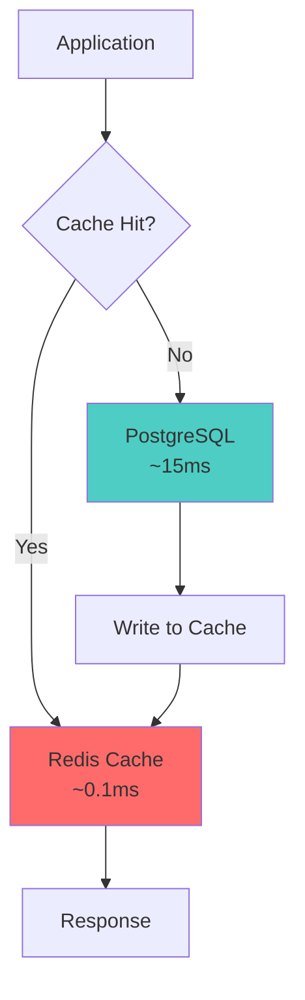
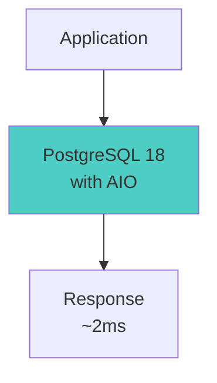
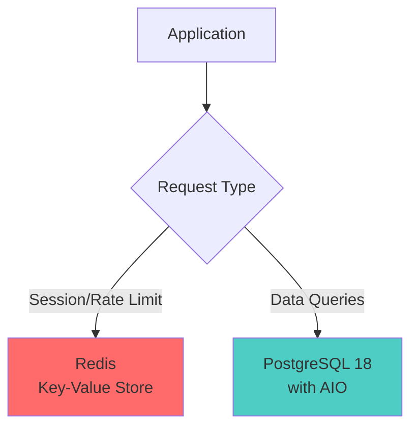
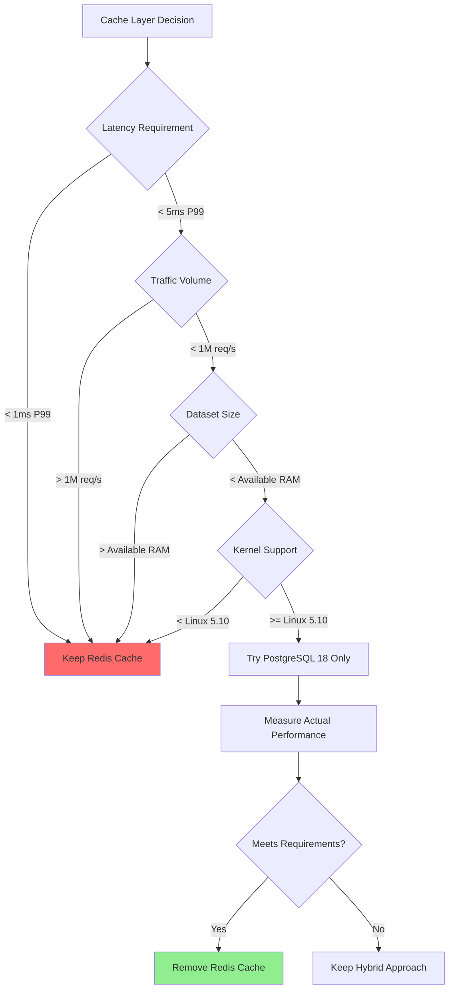

# PostgreSQL Performance & Caching Strategies

## Overview

PostgreSQL 18 introduced significant performance improvements that fundamentally change the caching architecture decisions for many workloads. This document explores modern PostgreSQL performance features and when external caching layers (like Redis) remain necessary versus when they've become optional.

## Table of Contents

- [PostgreSQL 18 Performance Features](#postgresql-18-performance-features)
- [Caching Architecture Patterns](#caching-architecture-patterns)
- [Performance Comparison](#performance-comparison)
- [When Redis Is Still Essential](#when-redis-is-still-essential)
- [Configuration Guidelines](#configuration-guidelines)
- [Decision Framework](#decision-framework)
- [Migration Considerations](#migration-considerations)

## PostgreSQL 18 Performance Features

### Asynchronous I/O (AIO)

PostgreSQL 18 introduced a new I/O subsystem with `io_uring` integration on Linux systems.

**How It Works:**
- Traditional PostgreSQL: Sequential, blocking I/O operations
- PostgreSQL 18 with AIO: Concurrent, non-blocking I/O using kernel-level async operations
- Leverages Linux `io_uring` for efficient batch I/O operations

**Performance Impact:**
- 2-3x improvement on read-heavy workloads (official benchmarks)
- Real-world improvements: 50-60% reduction in query latency for complex reads
- Most significant for queries involving multiple page reads

**Technical Details:**
```sql
-- io_uring allows PostgreSQL to submit multiple I/O requests
-- to the kernel in a single system call, reducing context switches
-- and improving CPU efficiency
```

### BTree Skip Scans

PostgreSQL 18 can now efficiently use composite indexes even when the leading column is not specified in the WHERE clause.

**Before PostgreSQL 18:**
```sql
-- Index: (user_id, status, created_at)
-- Query without user_id filter:
SELECT * FROM orders 
WHERE status = 'pending' 
AND created_at > '2025-01-01'
ORDER BY created_at DESC;

-- Result: Full table scan or inefficient index usage
```

**PostgreSQL 18 Behavior:**
- Performs range scans for each distinct value in the leading column
- Effectively "skips" through the index
- Dramatically improves performance for partial composite index matches

**Performance Impact:**
- Queries that previously took 40-50ms can drop to 5-10ms
- Eliminates need for redundant indexes
- Reduces index maintenance overhead

### Improved Buffer Management

**Enhancements:**
- Better buffer cache efficiency
- Improved read-ahead strategies with `io_combine_limit`
- More intelligent eviction policies

**Configuration Parameters:**
```conf
# Let PostgreSQL combine sequential reads
io_combine_limit = 512kB

# Increased read-ahead for sequential scans
effective_io_concurrency = 200
```

## Caching Architecture Patterns

### Traditional Redis + PostgreSQL Architecture



**Complexity Points:**
- Cache invalidation logic
- Serialization/deserialization overhead
- Network round trips (application ↔ Redis ↔ PostgreSQL)
- Cache warming strategies
- Separate monitoring and operational overhead

**Actual Latency Calculation:**
```
Weighted Average = (Hit Rate × Cache Latency) + 
                   (Miss Rate × (DB Latency + Cache Write))

Example with 73% hit rate:
= (0.73 × 0.1ms) + (0.27 × (15ms + 0.3ms))
= 0.073ms + 4.131ms
= ~4.2ms effective latency
```

### Modern PostgreSQL 18 Only Architecture



**Benefits:**
- Simplified architecture
- No cache invalidation logic
- Single source of truth
- Reduced operational complexity
- Lower infrastructure costs

**Latency Profile:**
- Cold cache: 6-8ms
- Warm buffer: 1.8-2.5ms
- Consistent, predictable performance

### Hybrid Architecture (Optimized)



**Redis Use Cases:**
- Session storage
- Rate limiting counters
- Distributed locks
- Pub/sub messaging
- Sorted sets (leaderboards)

**PostgreSQL Use Cases:**
- All transactional data
- Complex queries with joins
- Aggregations and analytics
- Data requiring ACID guarantees

## Performance Comparison

### Query Performance: Before and After

| Metric | PostgreSQL 17 | PostgreSQL 18 (AIO) | Redis Cache |
|--------|---------------|---------------------|-------------|
| Cold cache read | 12-18ms | 6-8ms | N/A |
| Warm buffer read | 4-6ms | 1.8-2.5ms | 0.1ms |
| Aggregation (30 days) | 15-25ms | 6-10ms | 0.1ms (hit) |
| Composite index query | 40-50ms | 5-10ms | 0.1ms (hit) |
| Network overhead | - | - | 0.8ms |
| Serialization overhead | - | - | 0.3ms |

### Total Cost of Ownership (3-Year Example)

**Redis Caching Layer:**
- Infrastructure: $340/month × 36 = $12,240
- Engineering time (cache bugs): ~23 incidents × 7 hours × $150/hr = $24,150
- Development velocity impact: ~15% slowdown = thousands of hours
- Monitoring and operational overhead
- **Total: ~$36,000+ over 3 years**

**PostgreSQL 18 Optimization:**
- Configuration changes: 5 parameters
- Migration effort: Minimal (remove caching code)
- Ongoing maintenance: Reduced
- **Total: < $1,000 in engineering time**

## When Redis Is Still Essential

### Scenarios Where Redis Wins

#### 1. Session Storage
**Requirements:**
- Sub-millisecond response times
- Zero variance in latency
- Automatic expiration (TTL)

**Why Redis:**
```redis
# Atomic operations with built-in TTL
SET session:user123 "session_data" EX 3600
GET session:user123
```

#### 2. Rate Limiting
**Requirements:**
- Atomic increment operations
- Automatic expiration
- High throughput

**Why Redis:**
```redis
# Increment with expiration
INCR rate_limit:user123:api_calls
EXPIRE rate_limit:user123:api_calls 60
```

#### 3. Distributed Locking
**Requirements:**
- Atomic lock acquisition
- Reliable lock release
- Cross-service coordination

**Why Redis:**
```redis
# SET if Not eXists with expiration
SETNX lock:resource123 "owner_id" EX 30
```

#### 4. Pub/Sub Messaging
**Requirements:**
- Real-time event distribution
- Multiple subscribers
- Low latency message delivery

**Why Redis:**
```redis
PUBLISH user_events "user_login:user123"
SUBSCRIBE user_events
```

#### 5. Leaderboards and Rankings
**Requirements:**
- Sorted data structures
- Range queries by score
- Frequent updates

**Why Redis:**
```redis
ZADD leaderboard 1500 "player1"
ZRANGE leaderboard 0 9 WITHSCORES
```

### When PostgreSQL 18 Is Sufficient

- **Read-heavy workloads** with acceptable 2-5ms latency
- **Complex queries** requiring joins and aggregations
- **Transactional consistency** requirements
- **Working dataset** fits in available RAM
- **Moderate traffic** (< 100K requests/second to same keys)

## Configuration Guidelines

### Essential PostgreSQL 18 Settings

```conf
# Enable async I/O with io_uring (Linux 5.10+)
io_method = 'io_uring'

# Concurrent I/O operations
# Higher values for SSD/NVMe storage
effective_io_concurrency = 200
maintenance_io_concurrency = 50

# Buffer pool size (typically 25% of available RAM)
# For 64GB RAM system:
shared_buffers = 16GB

# Read-ahead combining for sequential scans
io_combine_limit = 512kB

# Work memory for complex queries
work_mem = 256MB

# Effective cache size (OS + PostgreSQL cache)
# For 64GB RAM system:
effective_cache_size = 48GB
```

### System Requirements

**Kernel:**
- Linux kernel 5.10 or newer for `io_uring` support
- Check: `uname -r`

**Storage:**
- SSD/NVMe strongly recommended
- High IOPS capacity (>10K IOPS)

**Memory:**
- Sufficient RAM for working dataset
- Minimum 8GB for production workloads
- Optimal: Dataset fits in `shared_buffers` + OS cache

### Verification Commands

```sql
-- Check io_method setting
SHOW io_method;

-- Monitor buffer cache hit ratio
SELECT 
  sum(heap_blks_read) as heap_read,
  sum(heap_blks_hit) as heap_hit,
  sum(heap_blks_hit) / (sum(heap_blks_hit) + sum(heap_blks_read)) as cache_hit_ratio
FROM pg_statio_user_tables;

-- Target: 99%+ cache hit ratio
```

## Decision Framework

### Should You Remove Redis Cache?

Use this decision tree:



### Measurement Checklist

Before removing Redis cache:

1. **Baseline Current Performance**
   - [ ] Measure P50, P95, P99 latencies with Redis
   - [ ] Calculate actual cache hit rate
   - [ ] Document cache invalidation bug frequency
   - [ ] Calculate total cost of ownership

2. **Test PostgreSQL 18 Performance**
   - [ ] Deploy PostgreSQL 18 in staging
   - [ ] Configure AIO settings
   - [ ] Run production-like load tests
   - [ ] Measure cold and warm cache performance

3. **Calculate Effective Latency**
   ```
   Redis Effective = (Hit Rate × Cache Latency) + 
                     (Miss Rate × Full Stack Latency)
   
   PostgreSQL Effective = Measured P95 Latency
   ```

4. **Validate Requirements**
   - [ ] Latency requirements met?
   - [ ] Throughput requirements met?
   - [ ] Cost reduction achieved?
   - [ ] Operational complexity reduced?

## Migration Considerations

### Phased Migration Approach

**Phase 1: Parallel Testing (2-4 weeks)**
```sql
-- Run queries against both systems, compare results
-- Use feature flags to route percentage of traffic
```

**Phase 2: Low-Risk Routes (2-3 weeks)**
- Move read-only, non-critical queries first
- Dashboard and reporting queries
- Internal tools

**Phase 3: High-Traffic Routes (4-6 weeks)**
- Gradually increase traffic percentage
- Monitor error rates and latency
- Keep rollback capability

**Phase 4: Cache Removal (1-2 weeks)**
- Remove cache invalidation code
- Simplify error handling
- Update documentation

### Monitoring During Migration

**Key Metrics:**
```sql
-- Query performance
SELECT query, mean_exec_time, calls 
FROM pg_stat_statements 
ORDER BY mean_exec_time DESC 
LIMIT 20;

-- Connection pooling
SELECT count(*), state 
FROM pg_stat_activity 
GROUP BY state;

-- I/O statistics
SELECT * FROM pg_stat_bgwriter;
```

**Alerting Thresholds:**
- P95 latency > baseline + 20%
- Cache hit ratio < 95%
- Connection pool saturation
- Disk I/O utilization > 80%

### Rollback Strategy

Keep Redis infrastructure for 30-60 days:
- Maintain Redis deployment (reduced size)
- Keep cache code in version control
- Document rollback procedure
- Set up A/B testing capability

## Best Practices

### DO: Measure Before Deciding

```bash
# Benchmark actual queries
pgbench -c 10 -j 2 -t 1000 \
  -f queries.sql \
  postgres://localhost/mydb
```

### DO: Understand Your Workload

- Profile actual query patterns
- Identify hot queries (80/20 rule)
- Measure real cache hit rates
- Calculate true latency including network

### DO: Optimize PostgreSQL First

Before adding caching:
1. Create appropriate indexes
2. Optimize query plans
3. Configure connection pooling
4. Tune memory settings
5. Consider partitioning for large tables

### DON'T: Assume Redis Is Always Faster

- Measure actual end-to-end latency
- Include serialization overhead
- Account for cache misses
- Factor in invalidation complexity

### DON'T: Premature Optimization

```
"I added Redis caching on day one because 
that's what experienced developers do."

Better approach:
1. Build with PostgreSQL
2. Measure actual performance
3. Identify bottlenecks
4. Add caching only where proven necessary
```

## Related Patterns

- [Database Caching Patterns](database-caching-patterns.md) - General caching strategies
- [CAP Theorem](../data-architecture-fundamentals/cap-theorem.md) - Consistency vs availability tradeoffs
- [ACID Properties](../data-architecture-fundamentals/acid-properties.md) - Database transaction guarantees

## References

- PostgreSQL 18 Release Notes: Asynchronous I/O
- PostgreSQL Documentation: `io_uring` Configuration
- Linux Kernel Documentation: `io_uring` Interface
- PostgreSQL Wiki: BTree Skip Scan Implementation
- ["Postgres 18 Vs Redis: The Day My Cache Layer Became Optional"](https://medium.com/@kp9810113/postgres-18-vs-redis-the-day-my-cache-layer-became-optional-8abbd7395e9d) - The Concurrent Mind

## Conclusion

PostgreSQL 18's performance improvements fundamentally change the caching architecture decision space. For many workloads, a well-configured PostgreSQL 18 database can deliver latencies competitive with cached solutions while eliminating the complexity of cache invalidation, serialization overhead, and operational burden.

The key is measurement, not assumption. Benchmark your actual queries, calculate your real cache efficiency, and make architectural decisions based on data rather than conventional wisdom.

Redis remains essential for specific use cases (session storage, rate limiting, pub/sub), but as a generic query cache for PostgreSQL, it has become optional for a growing number of applications.
