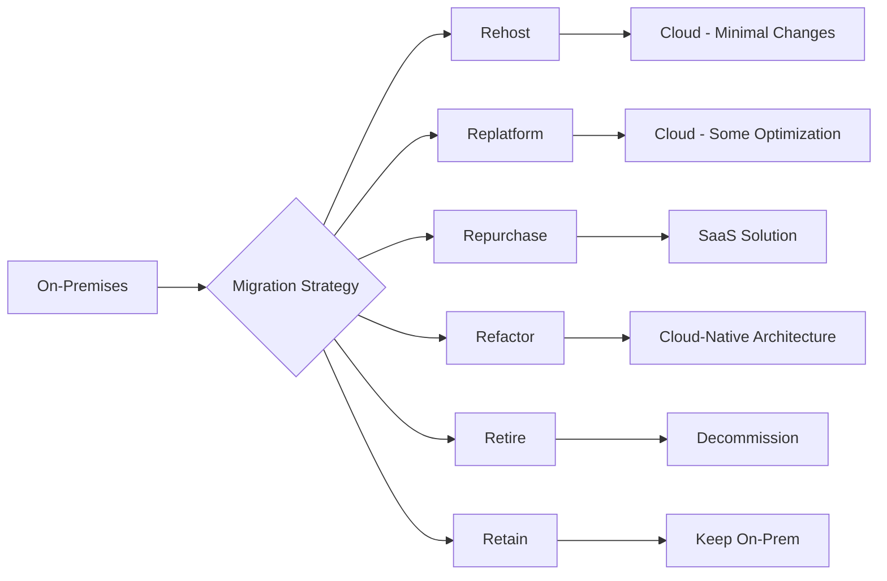
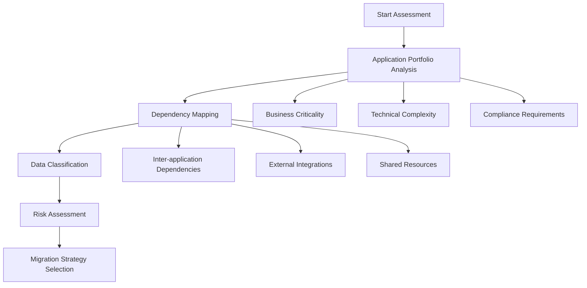
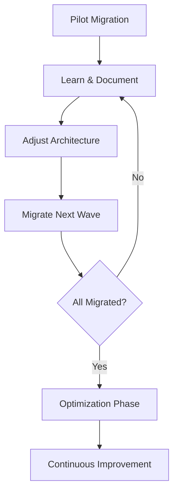

# On-Premises to Cloud Migration: Strategies, Steps, and Pitfalls

## Overview

Cloud migration is the process of moving applications, data, and infrastructure from on-premises data centers to cloud platforms. While the promise of flexibility, scalability, and cost optimization makes cloud migration attractive, the approach taken can determine success or failure of the entire digital transformation initiative.

## Migration Strategies (The 6 R's)

### 1. Rehost (Lift & Shift)
- Move applications to cloud with minimal or no changes
- Fastest migration approach
- **Risk**: Transfers architectural problems without solving them

### 2. Replatform (Lift, Tinker & Shift)
- Make some optimizations during migration
- Example: Switching to managed databases
- Moderate effort with some cloud benefits

### 3. Repurchase (Drop & Shop)
- Replace existing applications with SaaS solutions
- Example: Moving from on-prem CRM to Salesforce

### 4. Refactor / Re-architect
- Redesign applications to be cloud-native
- Highest effort but maximum cloud benefits
- Enables microservices, serverless, containers

### 5. Retire
- Identify and decommission unnecessary applications
- Reduces migration scope and costs

### 6. Retain
- Keep certain applications on-premises
- Valid for compliance, latency, or cost reasons

## Why Lift & Shift Often Fails

### The Hidden Assumption

Many digital transformation initiatives begin with an invisible assumption:

> "Our existing systems fundamentally work correctly; the problem lies in the infrastructure."

This assumption leads to treating cloud migration as a simple relocation exercise rather than an architectural transformation.

### Root Causes of Failure

#### 1. Architectural Blindness
- On-premises systems evolved according to specific physical and organizational constants:
  - Fixed number of servers
  - Predictable network latency
  - Defined batch windows
  - Rarely tested failover scenarios
- These architectural decisions become embedded in system behavior
- Lift & shift transfers this behavior without questioning it
- **Result**: The cloud becomes an expensive data center operated with old assumptions

#### 2. Loss of Determinism
| On-Premises Environment | Cloud Environment |
|------------------------|-------------------|
| Fixed resource allocation | Dynamic resource allocation |
| Stable network topology | Variable network topology |
| Constant latency | Fluctuating latency |
| Physical proximity matters | Location is abstracted |

Systems migrated via lift & shift continue operating under deterministic assumptions that no longer hold. The same transaction behaves differently at different times, making the system **functionally unpredictable**.

#### 3. False Visibility
- Monitoring tools proliferate
- Log volumes multiply
- Dashboards grow in number
- **But**: Metrics that were meaningful on-premises don't carry the same meaning in cloud
  - CPU spike on-prem → Capacity issue
  - CPU spike in cloud → Could be incorrect scaling strategy or state leakage
- Teams generate more alerts but gain less insight
- Incidents increase while root causes become blurred

#### 4. Data Architecture Fracture
On-premises systems are typically built around:
- Centralized databases
- Strong consistency
- Clear transaction boundaries
- Single source of truth

Cloud reality requires:
- Distributed services
- Multiple data sources
- Varying consistency levels
- Eventual consistency patterns

**The Problem**: Lift & shift attempts to preserve the centralized data model by force, producing **hidden inconsistencies**. The same customer information exists across different services at different times with different accuracy levels.

#### 5. False Sense of Confidence
- Management perceives lift & shift as success ("We are in the cloud!")
- In reality, only physical infrastructure has relocated
- Unless these change, cloud only amplifies existing problems:
  - Decision-making mechanisms
  - Ownership models
  - Responsibility boundaries
- SLAs, KPIs, and operational reflexes remain rooted in the legacy world

## Critical Steps for Successful Migration

### Phase 1: Assessment & Discovery

#### Key Questions to Answer
- [ ] Which systems are stateful vs stateless?
- [ ] Which data is authoritative vs derived?
- [ ] Which decisions are real-time vs delayed?
- [ ] What are the actual (not assumed) transaction boundaries?
- [ ] Who owns each service?

### Phase 2: Architecture Redesign

#### Redefine Service Boundaries
- Align services with business context, not technical convenience
- Evolve transactions from technical guarantees to business consistency definitions

#### Adopt Event-Driven Approaches
- Treat event-driven architecture as models of time and causality
- Not merely messaging infrastructure

#### Design Observability
- Design monitoring to understand system behavior, not just measure system health
- Implement distributed tracing
- Create meaningful alerts based on business outcomes

### Phase 3: Establish Ownership

| Aspect | Legacy Approach | Cloud-Native Approach |
|--------|----------------|----------------------|
| Service Ownership | "It works" | "We are responsible for it" |
| Incident Response | Find someone who knows | Clear escalation paths |
| Decision Making | Central committee | Distributed to owners |
| State Management | Implicit in code | Explicitly designed |

### Phase 4: Iterative Migration

## Key Architectural Considerations

### State Management
- Identify all stateful components
- Design explicit state management strategies
- Consider:
  - Distributed caching
  - State externalization
  - Session affinity implications

### Consistency Patterns
- Accept that distributed systems require consistency tradeoffs
- Choose appropriate patterns:
  - Strong consistency for critical transactions
  - Eventual consistency for read-heavy workloads
  - Saga patterns for distributed transactions

### Resilience Design
- Design for failure from the start
- Implement:
  - Circuit breakers
  - Retry with backoff
  - Bulkhead isolation
  - Graceful degradation

### Autoscaling Readiness
- Ensure applications can scale horizontally
- Address:
  - Session state
  - Local file dependencies
  - Database connection pooling
  - Startup/shutdown time

## Crisis Indicators

The impact of lift & shift typically becomes clear during a crisis:

| Warning Sign | Description |
|--------------|-------------|
| Cascading Failures | Delays in normal conditions trigger chain reactions during campaigns or regulatory changes |
| Chaos During Scaling | Autoscaling functions but state management is unprepared |
| Consistency Gaps | Region-based distribution exists but no data consistency strategy |
| Ownership Vacuum | High availability theoretically exists but no one fully owns services |
| Wrong Questions | "Is the system up?" instead of "Who can shut the system down?" |

## Best Practices Summary

### ✅ Do
- Treat lift & shift as a temporary relocation phase, not a destination
- Use cloud exposure to reveal architectural assumptions
- Redefine service boundaries according to business context
- Establish clear ownership for every service
- Design monitoring to understand behavior, not just health
- Accept that digital transformation is a change in reality, not just technology

### ❌ Don't
- Assume existing systems work correctly
- Transfer old assumptions to new environment
- Expect cloud to solve architectural problems
- Measure success by "being in the cloud"
- Ignore data consistency requirements
- Leave ownership undefined

## The Key Insight

> **The cloud does not solve problems. The cloud makes problems visible.**

Lift & shift, instead of turning this visibility into an advantage, often turns it into a missed opportunity. True transformation begins at this point—or it never begins at all.

## Related Topics

- [Hub-Spoke Network Architecture](../networking/hub_spoke_network_architecture.md)
- [Event-Driven Architecture](../../03-integration-communication-architecture/event-driven-messaging/patterns/event-driven-architecture.md)
- [Observability Overview](../../07-reliability-performance-operations/observability/01-observability-overview.md)

## References

- Akbulut, U. (2024). "Why Digital Transformation That Starts with Lift & Shift Always Hits a Wall"
- AWS Well-Architected Framework - Migration Lens
- Azure Cloud Adoption Framework
- Google Cloud Migration Path
