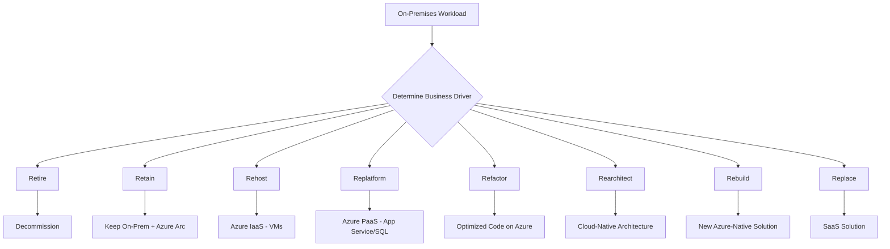
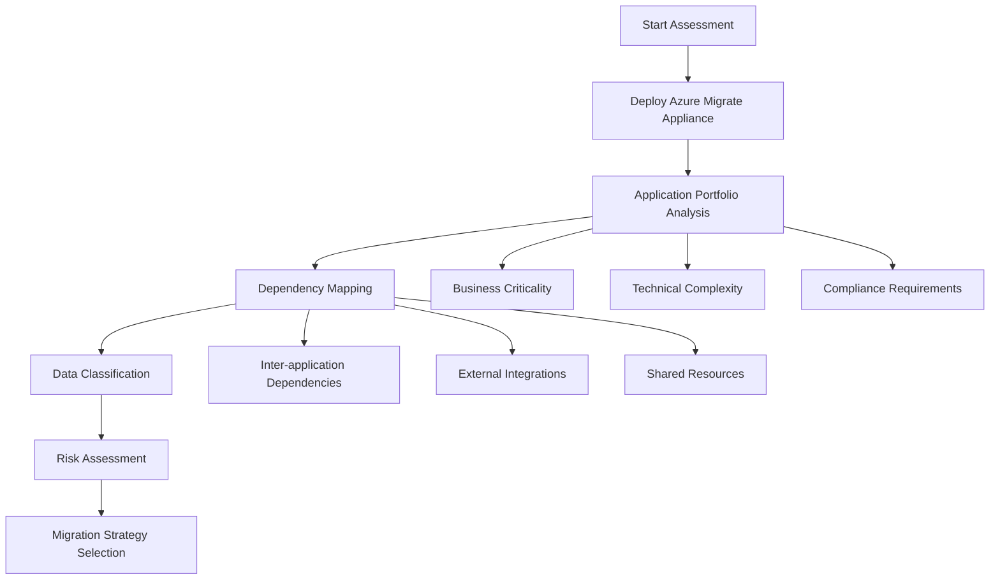
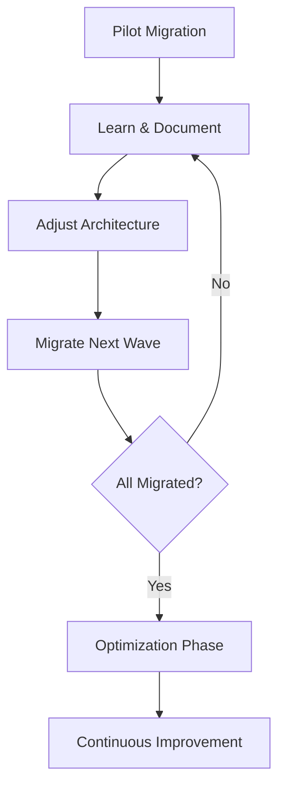

# On-Premises to Cloud Migration: Strategies, Steps, and Pitfalls

## Overview

Cloud migration is the process of moving applications, data, and infrastructure from on-premises data centers to cloud platforms. While the promise of flexibility, scalability, and cost optimization makes cloud migration attractive, the approach taken can determine success or failure of the entire digital transformation initiative.

## Migration Strategies (The 8 R's)

The Azure Cloud Adoption Framework defines eight migration strategies. Each workload should be evaluated to determine the appropriate approach.

| Strategy | Business Driver | Key Indicators |
|----------|-----------------|----------------|
| **Retire** | Decommission redundant/low-value workloads | Limited business value; migration cost outweighs benefits |
| **Retain** | Stability and no change needed | Workload is stable, compliant; low ROI from migration |
| **Rehost** | Minimal disruption, no near-term modernization | Compatible with Azure; low-risk; short-term goals |
| **Replatform** | PaaS benefits with minimal code changes | Reduce OS/licensing overhead; simplify disaster recovery |
| **Refactor** | Reduce technical debt, optimize for cloud | High maintenance costs; significant technical debt |
| **Rearchitect** | Unlock cloud-native capabilities | Requires modularization; varying scaling needs by component |
| **Rebuild** | New cloud-native solution required | Legacy system too outdated; need modern frameworks |
| **Replace** | SaaS/AI solution to simplify operations | Mature SaaS alternative exists; little customization needed |

### 1. Retire (Decommission)
- Decommission workloads with no current or future business value
- Validate that workload has no critical dependencies
- Reduces migration scope and costs

### 2. Retain (Keep As-Is)
- Keep workloads that can't be migrated due to regulatory, technical, or business continuity constraints
- Use **Azure Arc** to manage retained on-premises workloads from Azure
- Consider **Azure Local** for modern on-premises solutions connected to Azure

### 3. Rehost (Lift & Shift)
- Move workloads to Azure with minimal changes (like-for-like migration)
- Fastest migration approach
- **Warning**: Don't rehost problematic workloads—this transfers technical debt
- Only suitable if no modernization needed within 2 years
- Good for building foundational cloud operations experience

### 4. Replatform (Modernize Hosting)
- Move to modern hosting environment (PaaS) with minimal code changes
- Examples: VMs → Azure App Service, SQL Server → Azure SQL Database
- Reduces infrastructure management, improves scalability

### 5. Refactor (Modernize Code)
- Improve internal code structure without adding features
- Reduce technical debt, optimize for cloud
- Use Azure SDKs to improve performance or observability
- Apply cloud design patterns

### 6. Rearchitect (Modernize Architecture)
- Redesign workload architecture for cloud-native capabilities
- Break down monolithic applications, adopt microservices
- Enable targeted scaling per component
- See: [Modern Web App Pattern](https://learn.microsoft.com/azure/architecture/web-apps/guides/enterprise-app-patterns/modern-web-app/dotnet/guidance)

### 7. Rebuild (Build Cloud-Native)
- Full redevelopment using cloud-native solutions
- Appropriate when legacy systems are obsolete
- Leverage Azure PaaS, automation, and AI capabilities

### 8. Replace (Use SaaS Alternative)
- Replace custom applications with commercial SaaS solutions
- Eliminates custom development and ongoing maintenance
- Common for CRM, HR platforms, collaboration tools

## Why Lift & Shift Often Fails

### The Hidden Assumption

Many digital transformation initiatives begin with an invisible assumption:

> "Our existing systems fundamentally work correctly; the problem lies in the infrastructure."

This assumption leads to treating cloud migration as a simple relocation exercise rather than an architectural transformation.

### Root Causes of Failure

#### 1. Architectural Blindness
- On-premises systems evolved according to specific physical and organizational constants:
  - Fixed number of servers
  - Predictable network latency
  - Defined batch windows
  - Rarely tested failover scenarios
- These architectural decisions become embedded in system behavior
- Lift & shift transfers this behavior without questioning it
- **Result**: The cloud becomes an expensive data center operated with old assumptions

#### 2. Loss of Determinism
| On-Premises Environment | Cloud Environment |
|------------------------|-------------------|
| Fixed resource allocation | Dynamic resource allocation |
| Stable network topology | Variable network topology |
| Constant latency | Fluctuating latency |
| Physical proximity matters | Location is abstracted |

Systems migrated via lift & shift continue operating under deterministic assumptions that no longer hold. The same transaction behaves differently at different times, making the system **functionally unpredictable**.

#### 3. False Visibility
- Monitoring tools proliferate
- Log volumes multiply
- Dashboards grow in number
- **But**: Metrics that were meaningful on-premises don't carry the same meaning in cloud
  - CPU spike on-prem → Capacity issue
  - CPU spike in cloud → Could be incorrect scaling strategy or state leakage
- Teams generate more alerts but gain less insight
- Incidents increase while root causes become blurred

#### 4. Data Architecture Fracture
On-premises systems are typically built around:
- Centralized databases
- Strong consistency
- Clear transaction boundaries
- Single source of truth

Cloud reality requires:
- Distributed services
- Multiple data sources
- Varying consistency levels
- Eventual consistency patterns

**The Problem**: Lift & shift attempts to preserve the centralized data model by force, producing **hidden inconsistencies**. The same customer information exists across different services at different times with different accuracy levels.

#### 5. False Sense of Confidence
- Management perceives lift & shift as success ("We are in the cloud!")
- In reality, only physical infrastructure has relocated
- Unless these change, cloud only amplifies existing problems:
  - Decision-making mechanisms
  - Ownership models
  - Responsibility boundaries
- SLAs, KPIs, and operational reflexes remain rooted in the legacy world

## Critical Steps for Successful Migration

### Phase 1: Assessment & Discovery

#### Azure Migrate for Discovery

**Azure Migrate** provides a hub of tools for discovery, assessment, and migration:

| Assessment Type | Description |
|----------------|-------------|
| **Azure VM** | Assess on-premises servers for migration to Azure VMs (VMware, Hyper-V, physical) |
| **Azure SQL** | Assess SQL servers for migration to Azure SQL Database or Managed Instance |
| **Azure App Service** | Assess ASP.NET web apps for migration to Azure App Service |
| **Azure VMware Solution** | Assess VMware VMs for migration to AVS |

**Best Practices for Azure Migrate Assessments**:
1. Deploy the lightweight Azure Migrate appliance for agentless discovery
2. Create as-is assessments immediately after servers appear in the portal
3. Wait at least one day before running performance-based assessments
4. Profile environment for the full assessment duration
5. Recalculate assessments to reflect latest data

#### Key Questions to Answer
- [ ] Which systems are stateful vs stateless?
- [ ] Which data is authoritative vs derived?
- [ ] Which decisions are real-time vs delayed?
- [ ] What are the actual (not assumed) transaction boundaries?
- [ ] Who owns each service?

### Phase 2: Architecture Redesign

#### Redefine Service Boundaries
- Align services with business context, not technical convenience
- Evolve transactions from technical guarantees to business consistency definitions

#### Adopt Event-Driven Approaches
- Treat event-driven architecture as models of time and causality
- Not merely messaging infrastructure

#### Design Observability
- Design monitoring to understand system behavior, not just measure system health
- Implement distributed tracing
- Create meaningful alerts based on business outcomes

### Phase 3: Establish Ownership

| Aspect | Legacy Approach | Cloud-Native Approach |
|--------|----------------|----------------------|
| Service Ownership | "It works" | "We are responsible for it" |
| Incident Response | Find someone who knows | Clear escalation paths |
| Decision Making | Central committee | Distributed to owners |
| State Management | Implicit in code | Explicitly designed |

### Phase 4: Iterative Migration

## Key Architectural Considerations

### State Management
- Identify all stateful components
- Design explicit state management strategies
- Consider:
  - Distributed caching
  - State externalization
  - Session affinity implications

### Consistency Patterns
- Accept that distributed systems require consistency tradeoffs
- Choose appropriate patterns:
  - Strong consistency for critical transactions
  - Eventual consistency for read-heavy workloads
  - Saga patterns for distributed transactions

### Resilience Design
- Design for failure from the start
- Implement:
  - Circuit breakers
  - Retry with backoff
  - Bulkhead isolation
  - Graceful degradation

### Autoscaling Readiness
- Ensure applications can scale horizontally
- Address:
  - Session state
  - Local file dependencies
  - Database connection pooling
  - Startup/shutdown time

## Crisis Indicators

The impact of lift & shift typically becomes clear during a crisis:

| Warning Sign | Description |
|--------------|-------------|
| Cascading Failures | Delays in normal conditions trigger chain reactions during campaigns or regulatory changes |
| Chaos During Scaling | Autoscaling functions but state management is unprepared |
| Consistency Gaps | Region-based distribution exists but no data consistency strategy |
| Ownership Vacuum | High availability theoretically exists but no one fully owns services |
| Wrong Questions | "Is the system up?" instead of "Who can shut the system down?" |

## Success Metrics by Strategy

Define success metrics that validate business outcomes, not just technical completion:

| Strategy | Example Success Metrics |
|----------|------------------------|
| **Retire** | Retire 100% of obsolete workloads before migration |
| **Rehost** | Migrate Tier 1 workloads with no SLA degradation; decommission 30% of on-prem infrastructure |
| **Replatform** | Reduce deployment lead times by 30%; reduce infrastructure costs by 25% within 12 months |
| **Refactor** | Improve response time by 40%; achieve 95% observability coverage |
| **Rearchitect** | Support 2x user load with no performance degradation |
| **Replace** | Transition to SaaS with 99.9% uptime and no custom code |
| **Rebuild** | Launch cloud-native app in 3 months vs 6 months on-prem; cut operational costs by 40% |
| **Retain** | Maintain current SLA and compliance; manage on-prem workloads from Azure using Azure Arc |

## When to Modernize During Migration

Modernization during migration introduces complexity but can deliver long-term benefits:

1. **Modernize when team has required skills and time** - Defer if expertise is lacking
2. **Modernize workloads requiring compatibility updates** - Legacy tech, unsupported SDKs
3. **Modernize when migration enables funding and alignment** - Use stakeholder support opportunity

## Best Practices Summary

### ✅ Do
- Treat lift & shift as a temporary relocation phase, not a destination
- Use cloud exposure to reveal architectural assumptions
- Redefine service boundaries according to business context
- Establish clear ownership for every service
- Design monitoring to understand behavior, not just health
- Accept that digital transformation is a change in reality, not just technology
- Define success metrics based on business outcomes
- Communicate decisions to all stakeholders
- Coordinate migration plans with cloud strategy team

### ❌ Don't
- Assume existing systems work correctly
- Transfer old assumptions to new environment
- Expect cloud to solve architectural problems
- Measure success by "being in the cloud"
- Ignore data consistency requirements
- Leave ownership undefined
- Rehost problematic workloads without addressing root causes
- Attempt modernization without adequate expertise or time

## The Key Insight

> **The cloud does not solve problems. The cloud makes problems visible.**

Lift & shift, instead of turning this visibility into an advantage, often turns it into a missed opportunity. True transformation begins at this point—or it never begins at all.

## Related Topics

- [Hub-Spoke Network Architecture](../networking/hub_spoke_network_architecture.md)
- [Event-Driven Architecture](../../03-integration-communication-architecture/event-driven-messaging/patterns/event-driven-architecture.md)
- [Observability Overview](../../07-reliability-performance-operations/observability/01-observability-overview.md)

## References

### Primary Sources
- Akbulut, U. (2024). [Why Digital Transformation That Starts with Lift & Shift Always Hits a Wall](https://medium.com/@umutt.akbulut/why-digital-transformation-that-starts-with-lift-shift-always-hits-a-wall-e3557be4fe64)

### Microsoft Learn Documentation
- [Microsoft Cloud Adoption Framework Overview](https://learn.microsoft.com/azure/cloud-adoption-framework/overview)
- [Select Your Cloud Migration Strategies](https://learn.microsoft.com/azure/cloud-adoption-framework/plan/select-cloud-migration-strategy)
- [Plan the Migration Strategy](https://learn.microsoft.com/azure/storage/common/storage-migration-plan-strategy)
- [Plan Your Migration](https://learn.microsoft.com/azure/cloud-adoption-framework/migrate/plan-migration)
- [Azure Migrate: Best Practices for Creating Assessments](https://learn.microsoft.com/azure/migrate/best-practices-assessment)
- [Build Migration Plan with Azure Migrate](https://learn.microsoft.com/azure/migrate/concepts-migration-planning)
- [Database Migration Guides](https://learn.microsoft.com/data-migration/)

### Architecture Guidance
- [Azure Well-Architected Framework](https://learn.microsoft.com/azure/well-architected/)
- [Azure Architecture Center](https://learn.microsoft.com/azure/architecture/)
- [Reliable Web App Pattern](https://learn.microsoft.com/azure/architecture/web-apps/guides/enterprise-app-patterns/reliable-web-app/dotnet/guidance)
- [Modern Web App Pattern](https://learn.microsoft.com/azure/architecture/web-apps/guides/enterprise-app-patterns/modern-web-app/dotnet/guidance)

### Other Cloud Providers
- AWS Well-Architected Framework - Migration Lens
- Google Cloud Migration Path
