# eBPF Architecture

> **Taxonomy Reference**: §5.2 Infrastructure Architecture

## Table of Contents

- [Overview](#overview)
- [1. What is eBPF?](#1-what-is-ebpf)
- [2. eBPF Architecture](#2-ebpf-architecture)
  - [2.1 eBPF Program Lifecycle](#21-ebpf-program-lifecycle)
  - [2.2 eBPF Maps](#22-ebpf-maps)
  - [2.3 eBPF Hook Points](#23-ebpf-hook-points)
- [3. eBPF Use Cases](#3-ebpf-use-cases)
  - [3.1 Networking](#31-networking)
  - [3.2 Observability](#32-observability)
  - [3.3 Security](#33-security)
  - [3.4 Performance Profiling](#34-performance-profiling)
- [4. eBPF Ecosystem and Tools](#4-ebpf-ecosystem-and-tools)
- [5. eBPF vs Traditional Approaches](#5-ebpf-vs-traditional-approaches)
- [6. eBPF in Kubernetes](#6-ebpf-in-kubernetes)
  - [6.1 Replacing kube-proxy](#61-replacing-kube-proxy)
  - [6.2 Cilium CNI](#62-cilium-cni)
- [7. Requirements and Limitations](#7-requirements-and-limitations)
- [Related Topics](#related-topics)

---

## Overview

eBPF (extended Berkeley Packet Filter) is a technology that allows sandboxed programs to run directly in the Linux kernel without modifying kernel source code or loading kernel modules. Originally derived from the classic BPF (Berkeley Packet Filter) used for network packet filtering, eBPF has evolved into a general-purpose in-kernel virtual machine used for networking, security, observability, and performance tracing.

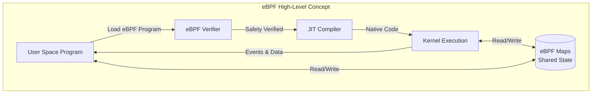

**Why eBPF Matters:**

| Property | Description |
|----------|-------------|
| **Programmable kernel** | Extend kernel behavior without kernel patches or modules |
| **Safety** | Verifier ensures programs cannot crash or corrupt the kernel |
| **Performance** | Runs at kernel speed — no context switches to user space |
| **Observability** | Access to any kernel data structure and function |
| **Portability** | CO-RE (Compile Once – Run Everywhere) across kernel versions |

---

## 1. What is eBPF?

Classic BPF was introduced in 1992 for efficient network packet filtering (e.g., `tcpdump`). eBPF, introduced in Linux kernel 3.18 (2014) and significantly extended in subsequent versions, transformed BPF into a general-purpose in-kernel execution environment.

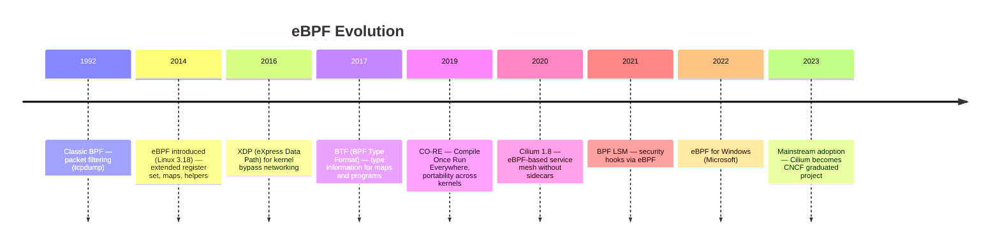

**Key Properties:**

| Property | Classic BPF | eBPF |
|----------|-------------|------|
| **Registers** | 2 × 32-bit | 11 × 64-bit |
| **Program size** | 4096 instructions | 1 million instructions (≥ Linux 5.2) |
| **Maps** | ❌ Not available | ✅ Rich data structures |
| **Helper functions** | Limited | 200+ kernel helpers |
| **JIT compilation** | ❌ Interpreted | ✅ JIT to native code |
| **Program types** | Socket filter only | 30+ types (XDP, TC, tracing, LSM…) |
| **Tail calls** | ❌ | ✅ Chain up to 33 programs |

---

## 2. eBPF Architecture

### 2.1 eBPF Program Lifecycle

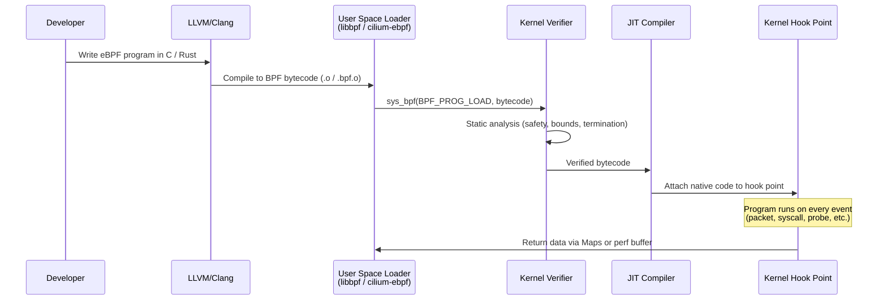

**Verification guarantees:**
- No unbounded loops (program must terminate)
- All memory accesses are bounds-checked
- No null pointer dereferences
- Stack size ≤ 512 bytes
- No unreachable instructions

### 2.2 eBPF Maps

Maps are the primary data structures shared between eBPF programs and user space. They are key-value stores residing in kernel memory.

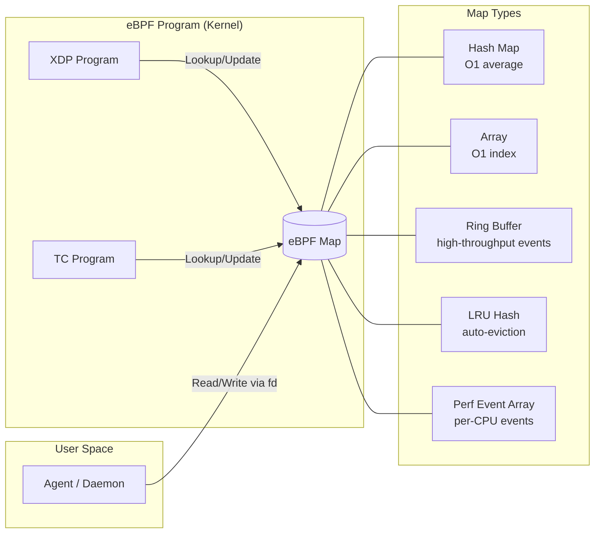

| Map Type | Use Case | Lookup |
|----------|----------|--------|
| `BPF_MAP_TYPE_HASH` | General key-value store | O(1) avg |
| `BPF_MAP_TYPE_ARRAY` | Per-CPU counters, config | O(1) |
| `BPF_MAP_TYPE_LRU_HASH` | Connection tracking, cache | O(1) avg |
| `BPF_MAP_TYPE_RINGBUF` | High-throughput event streaming | Sequential |
| `BPF_MAP_TYPE_PERF_EVENT_ARRAY` | Per-CPU event output | N/A |
| `BPF_MAP_TYPE_PROG_ARRAY` | Tail call dispatch table | O(1) |
| `BPF_MAP_TYPE_SOCKHASH` | Socket redirection | O(1) avg |

### 2.3 eBPF Hook Points

eBPF programs can be attached to dozens of kernel hook points:

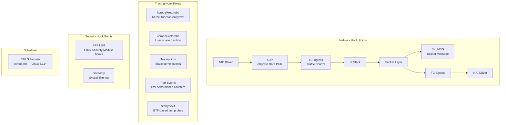

| Hook Type | Attachment Point | Typical Use |
|-----------|-----------------|-------------|
| **XDP** | Before kernel network stack | DDoS mitigation, load balancing |
| **TC (Traffic Control)** | After XDP, before/after routing | Packet manipulation, policy enforcement |
| **kprobe/kretprobe** | Any kernel function | Kernel debugging, dynamic tracing |
| **tracepoint** | Static kernel events | Performance monitoring |
| **uprobe** | User-space function | Application performance monitoring |
| **fentry/fexit** | BTF-based kernel function | Lower-overhead alternative to kprobes |
| **BPF LSM** | Linux security hooks | Fine-grained security enforcement |

---

## 3. eBPF Use Cases

### 3.1 Networking

eBPF's most prominent use case is high-performance, programmable networking.

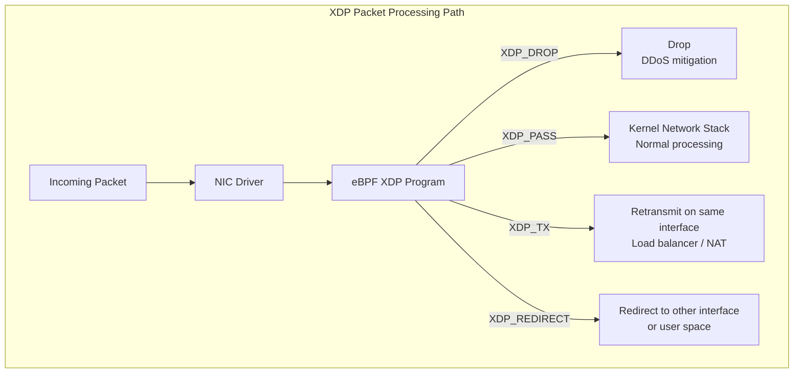

**Networking capabilities:**

| Capability | Description | vs. Traditional |
|------------|-------------|-----------------|
| **Packet filtering** | Drop/allow packets at NIC level | 10–100× faster than iptables |
| **Load balancing** | L4 load balancing (DSR, NAT) | No iptables DNAT chains |
| **Service mesh (L4)** | Connection tracking, policy | No sidecar proxy required |
| **DDoS mitigation** | Drop attack traffic before kernel stack | Line-rate filtering |
| **NAT / port mapping** | Stateful connection tracking | Replaces conntrack at scale |
| **Bandwidth QoS** | TC-based rate limiting | Per-pod/service control |

### 3.2 Observability

eBPF enables deep system observability without instrumentation changes to applications.

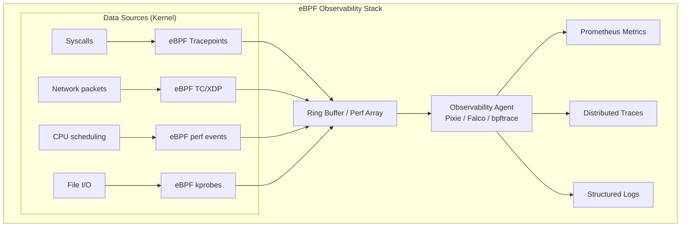

**Observability tools built on eBPF:**

| Tool | Purpose | Key Feature |
|------|---------|-------------|
| **bpftrace** | Ad-hoc kernel tracing | One-liner tracing scripts |
| **BCC (BPF Compiler Collection)** | Production analysis tools | 100+ ready-made tools |
| **Pixie** | Auto-instrumented observability | No code changes, full request bodies |
| **Parca / Pyroscope** | Continuous CPU profiling | Always-on profiling |
| **Cilium Hubble** | Network flow observability | L3–L7 flow visibility |

### 3.3 Security

eBPF provides fine-grained, low-overhead security enforcement at the kernel level.

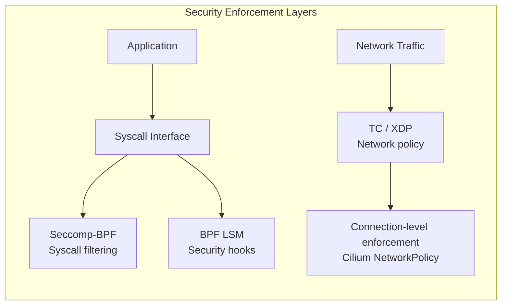

| Security Use Case | Mechanism | Tool |
|-------------------|-----------|------|
| **Container isolation** | Syscall filtering | seccomp-BPF |
| **Runtime threat detection** | Syscall & file access monitoring | Falco, Tetragon |
| **Network policy enforcement** | L3/L4/L7 packet filtering | Cilium |
| **Privilege escalation detection** | Credential change tracing | Tetragon |
| **Zero-trust networking** | Identity-based connection control | Cilium |

### 3.4 Performance Profiling

eBPF-based profiling captures CPU, memory, and I/O bottlenecks with negligible overhead.

| Profiling Type | eBPF Mechanism | What It Shows |
|----------------|---------------|---------------|
| **CPU profiling** | Perf event sampling | Hot code paths, flame graphs |
| **Off-CPU analysis** | Scheduler tracepoints | Time blocked on I/O, locks |
| **Memory profiling** | kmalloc/kfree tracing | Allocation hot spots, leaks |
| **I/O latency** | Block layer tracepoints | Disk read/write latency histograms |
| **Lock contention** | mutex/rwlock probes | Lock hot paths |

---

## 4. eBPF Ecosystem and Tools

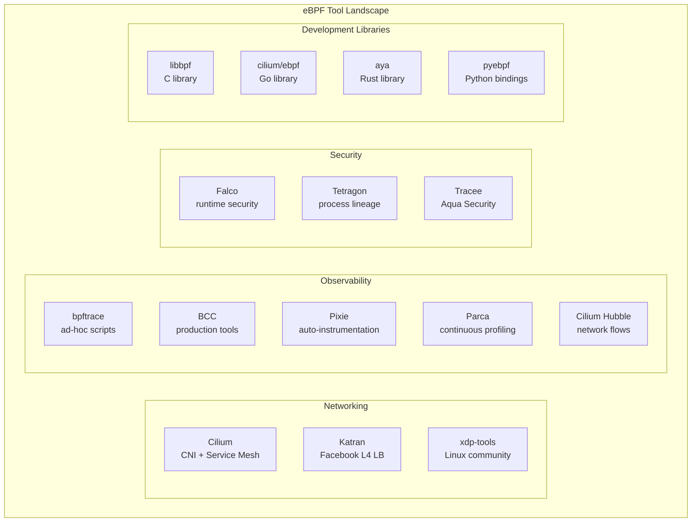

| Category | Tool | Language | Description |
|----------|------|----------|-------------|
| **Networking** | Cilium | Go | CNI, network policy, service mesh |
| **Networking** | Katran | C++ | Facebook L4 load balancer |
| **Observability** | bpftrace | C++ / scripts | Dynamic kernel tracing |
| **Observability** | BCC | Python/C | Toolkit of 100+ tools |
| **Observability** | Pixie | Go/C++ | Auto-instrumented platform observability |
| **Observability** | Parca | Go | Always-on continuous profiling |
| **Security** | Falco | C++ | Runtime security with eBPF backend |
| **Security** | Tetragon | Go | Process and network security |
| **Library** | libbpf | C | Official BPF loading library |
| **Library** | cilium/ebpf | Go | Pure-Go eBPF library |
| **Library** | aya | Rust | Rust eBPF library |

---

## 5. eBPF vs Traditional Approaches

### Networking: eBPF vs iptables

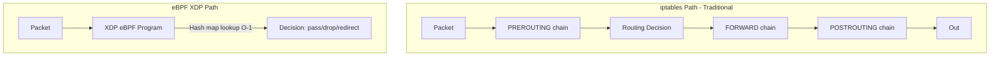

| Dimension | iptables / nftables | eBPF (XDP/TC) |
|-----------|---------------------|---------------|
| **Rule evaluation** | O(n) chain traversal | O(1) hash map lookup |
| **Throughput** | ~1–4 Mpps | 10–25 Mpps (software), line-rate (hardware offload) |
| **Latency** | ~2–10µs | ~200ns–1µs |
| **Scalability** | Degrades with rule count | Constant regardless of policy count |
| **Stateful tracking** | conntrack (kernel module) | eBPF LRU maps |
| **Flexibility** | Fixed chain model | Arbitrary program logic |
| **Debugging** | `iptables -L -v` | `bpftool`, `cilium monitor` |

### Observability: eBPF vs Agent-based

| Dimension | Traditional Agent (APM SDK) | eBPF-based |
|-----------|-----------------------------|-----------|
| **Code changes** | Required (instrumentation) | None |
| **Language support** | Language-specific SDK | Any language/runtime |
| **Data granularity** | Application-defined | Kernel-level (syscalls, packets) |
| **Overhead** | Medium (in-process) | Low (~1–3% CPU) |
| **Deployment** | Per-service | Per-node daemonset |
| **Full request capture** | Requires SDK hooks | Available via SSL interception |

### Security: eBPF vs Kernel Modules

| Dimension | Kernel Module | eBPF |
|-----------|--------------|------|
| **Safety** | Can crash kernel | Verified — cannot crash kernel |
| **Deployment** | Requires kernel version match | CO-RE: portable across versions |
| **Update** | Requires system restart (usually) | Live update, no restart |
| **Privileges** | Requires `CAP_SYS_MODULE` | Requires `CAP_BPF` (Linux 5.8+) |
| **Audit** | Hard to inspect | `bpftool prog dump` — inspectable |

---

## 6. eBPF in Kubernetes

### 6.1 Replacing kube-proxy

Traditional Kubernetes uses kube-proxy to implement Services via iptables or IPVS rules. eBPF-based CNIs like Cilium can replace kube-proxy entirely:

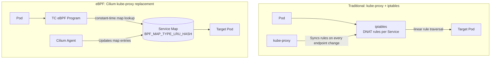

**Benefits of kube-proxy replacement:**

| Metric | kube-proxy (iptables) | Cilium eBPF |
|--------|-----------------------|-------------|
| **Service update latency** | Seconds (full iptables refresh) | Milliseconds (map update) |
| **Rule count at 10k services** | ~250k iptables rules | ~10k map entries |
| **Per-hop latency** | ~2ms | ~0.2ms |
| **DSR (Direct Server Return)** | ❌ | ✅ |
| **Health-aware load balancing** | ❌ | ✅ |

### 6.2 Cilium CNI

Cilium is the leading eBPF-based CNI (Container Network Interface) for Kubernetes. It provides:

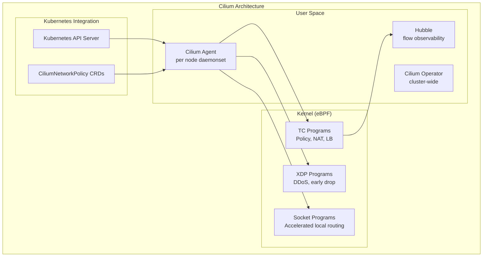

| Cilium Feature | Description |
|---------------|-------------|
| **CNI** | Pod-to-pod networking via eBPF |
| **NetworkPolicy** | L3/L4/L7 policies (HTTP, Kafka, DNS-aware) |
| **kube-proxy replacement** | Service routing without iptables |
| **Service Mesh (Sidecarless)** | mTLS and L7 policies via eBPF + per-node Envoy |
| **Cluster Mesh** | Multi-cluster service discovery and routing |
| **Hubble** | L3–L7 network flow observability |
| **BGP Control Plane** | Native BGP for on-prem/hybrid clusters |

---

## 7. Requirements and Limitations

### Kernel Version Requirements

| Feature | Minimum Kernel |
|---------|---------------|
| Basic eBPF programs | 3.18 |
| Maps | 3.18 |
| XDP | 4.8 |
| BTF (type info) | 4.18 |
| CO-RE (portability) | 5.2 |
| BPF LSM | 5.7 |
| `CAP_BPF` capability | 5.8 |
| Ring buffer | 5.8 |
| sched_ext scheduler | 6.11 |

> **Recommendation**: Linux 5.10+ (LTS) for production workloads. Linux 5.15+ recommended for full CO-RE and security feature support.

### Limitations

| Limitation | Description | Mitigation |
|------------|-------------|-----------|
| **Kernel version dependency** | Older kernels lack features | Use CO-RE + kernel version checks |
| **Stack size** | Max 512 bytes per program | Use maps for larger state |
| **Complexity** | Steep learning curve | Use high-level frameworks (Cilium, libbpf) |
| **Debugging** | Kernel-level debugging is harder | `bpftool`, `bpftrace`, Hubble |
| **Verification limits** | Complex programs may fail verification | Decompose with tail calls |
| **Windows** | eBPF for Windows is still maturing | Linux-first for production |
| **Privileged access** | Requires `CAP_BPF` or `CAP_SYS_ADMIN` | Limit to trusted daemonsets |

---

## Related Topics

- [Service Mesh Architecture](./service-mesh-architecture.md) — Cilium service mesh, sidecarless mesh with eBPF
- [Proxy and Load Balancing Architecture](./proxy-load-balancing-architecture.md) — L4/L7 load balancing patterns
- [Network Architecture Base Elements](./network-architecture-base-elements.md) — Foundational networking concepts
- [Network Security Architecture](../../06-security-architecture/6.3-network-security/) — eBPF-based security enforcement
