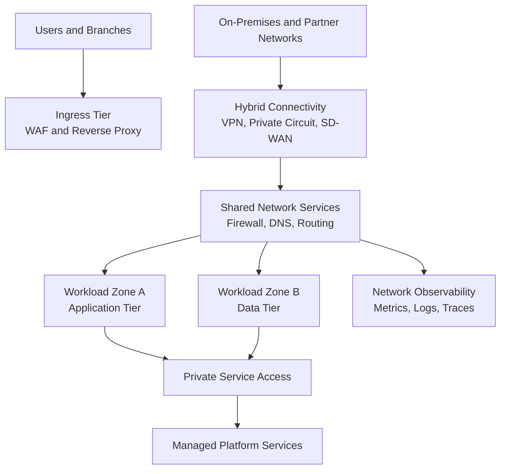

# Network Architecture Base Elements

> **Taxonomy Reference**: §5.2 Infrastructure Architecture (see [architecture_taxonomy_reference.md](../../10-practicality-taxonomy/architecture_taxonomy_reference.md))

This guide defines vendor-neutral building blocks for a production-ready network architecture.

## Problem

Teams often start with ad hoc network decisions and later struggle with overlap, inconsistent security controls, and poor operability.

## Solution

Define a baseline architecture with explicit elements for addressing, segmentation, routing, connectivity, traffic control, and observability before workload onboarding.

## Abstraction Level

- Logical: Core network patterns and topology decisions
- Physical: Concrete controls and platform services selected per cloud/provider

## Base Network Architecture Elements

| Element | Why It Matters | Typical Technology Choices |
|---|---|---|
| IP addressing strategy | Prevent overlap and allow growth | RFC1918/IPv6 planning, CIDR allocation model |
| Segmentation model | Limit blast radius and isolate tiers | Subnets, security zones, micro-segmentation |
| Routing model | Enforce deterministic packet flow | Static routes, dynamic routing (BGP), route policies |
| Hybrid and branch connectivity | Connect private environments securely | Site-to-site VPN, dedicated private circuits, SD-WAN |
| Ingress architecture | Publish applications safely | Reverse proxy, L7 gateway, global edge routing, WAF |
| Egress architecture | Govern outbound traffic and identity | NAT, egress firewall/proxy, centralized policy egress |
| Private service access | Avoid public internet for sensitive paths | Private endpoints, private links, service networking |
| Name resolution architecture | Ensure consistent service discovery | Public/private DNS, conditional forwarding |
| Perimeter and internal security | Enforce policy boundaries | ACLs/security groups, firewalls, IDS/IPS, DDoS controls |
| Load distribution | Improve availability and scalability | L4/L7 load balancers, geo-routing, traffic steering |
| Observability and diagnostics | Reduce MTTR and detect anomalies | Flow logs, packet capture, synthetic probes, telemetry |
| Governance and standards | Keep deployments consistent | Policy-as-code, guardrails, IAM/RBAC, naming standards |

## Reference Topology Pattern

## Baseline Design Checklist

1. Reserve non-overlapping CIDR ranges for current and future regions/environments.
2. Define segmentation boundaries by trust zone and workload criticality.
3. Standardize subnet roles for ingress, app, data, management, and private access.
4. Choose route control authority (central gateway, distributed routing, or hybrid).
5. Define ingress patterns (internet-facing, internal-only, global multi-region).
6. Define egress policy (direct internet, centralized inspection, restricted allowlist).
7. Adopt private connectivity patterns for managed services and sensitive data paths.
8. Define mandatory security controls and default-deny posture.
9. Define operational baseline with alerts, SLO-aligned dashboards, and runbooks.
10. Enforce architecture through reusable templates and policy controls.

## When To Use

- Building a new landing zone or platform foundation.
- Standardizing multi-team network patterns across environments.
- Preparing for hybrid/multi-region growth with consistent guardrails.

## When Not To Use

- Small throwaway environments where full governance is intentionally unnecessary.
- Single-host prototypes with no production or compliance expectations.

## Related Patterns

- [Hub-Spoke Network Architecture](./hub_spoke_network_architecture.md)
- [Proxy and Load Balancing Architecture](./proxy-load-balancing-architecture.md)
- [Service Mesh Architecture](./service-mesh-architecture.md)

## Platform-Specific Implementations

- Azure implementation references: [Azure Networking](../../../architecture-azure/networking/README.md)
