# Proxy and Load Balancing Architecture

## Table of Contents

- [Overview](#overview)
- [1. Foundational Concepts](#1-foundational-concepts)
  - [1.1 What is a Proxy?](#11-what-is-a-proxy)
  - [1.2 Forward Proxy vs Reverse Proxy](#12-forward-proxy-vs-reverse-proxy)
  - [1.3 OSI Model Layers in Load Balancing](#13-osi-model-layers-in-load-balancing)
- [2. Load Balancing Hierarchy](#2-load-balancing-hierarchy)
  - [2.1 DNS-Based (Global) Load Balancing](#21-dns-based-global-load-balancing)
  - [2.2 Global/Regional Edge Load Balancing](#22-globalregional-edge-load-balancing)
  - [2.3 Regional Load Balancing](#23-regional-load-balancing)
  - [2.4 Local (Instance-Level) Load Balancing](#24-local-instance-level-load-balancing)
  - [2.5 Internal Load Balancing](#25-internal-load-balancing)
- [3. Content Delivery and Edge Services](#3-content-delivery-and-edge-services)
  - [3.1 Content Delivery Networks (CDN)](#31-content-delivery-networks-cdn)
  - [3.2 Edge Computing](#32-edge-computing)
- [4. Security Controls at the Edge](#4-security-controls-at-the-edge)
  - [4.1 Web Application Firewall (WAF)](#41-web-application-firewall-waf)
  - [4.2 DDoS Protection](#42-ddos-protection)
  - [4.3 TLS/SSL Termination](#43-tlsssl-termination)
  - [4.4 mTLS (Mutual TLS)](#44-mtls-mutual-tls)
- [5. Authentication and Authorization Controls](#5-authentication-and-authorization-controls)
  - [5.1 JWT Validation](#51-jwt-validation)
  - [5.2 OAuth 2.0/OpenID Connect](#52-oauth-20openid-connect)
  - [5.3 API Key Validation](#53-api-key-validation)
- [6. API Management and Gateway](#6-api-management-and-gateway)
  - [6.1 API Gateway Concepts](#61-api-gateway-concepts)
  - [6.2 API Management Features](#62-api-management-features)
  - [6.3 Rate Limiting and Throttling](#63-rate-limiting-and-throttling)
  - [6.4 Request/Response Transformation](#64-requestresponse-transformation)
- [7. Routing Strategies](#7-routing-strategies)
  - [7.1 DNS-Based Routing](#71-dns-based-routing)
  - [7.2 Path-Based Routing](#72-path-based-routing)
  - [7.3 Header-Based Routing](#73-header-based-routing)
  - [7.4 Geographic Routing](#74-geographic-routing)
  - [7.5 Weighted Routing](#75-weighted-routing)
- [8. Architecture Patterns](#8-architecture-patterns)
  - [8.1 Single Entry Point Pattern](#81-single-entry-point-pattern)
  - [8.2 Multi-Tier Proxy Pattern](#82-multi-tier-proxy-pattern)
  - [8.3 Backend for Frontend (BFF)](#83-backend-for-frontend-bff)
  - [8.4 Service Mesh Pattern](#84-service-mesh-pattern)
- [9. Technology Reference](#9-technology-reference)
  - [9.1 Cloud Provider Services](#91-cloud-provider-services)
  - [9.2 Open Source / On-Premises Solutions](#92-open-source--on-premises-solutions)
- [10. Decision Framework](#10-decision-framework)
- [Related Topics](#related-topics)

---

## Overview

Proxy and load balancing architecture encompasses the patterns, technologies, and strategies for distributing network traffic, securing applications at the edge, managing API traffic, and ensuring high availability across distributed systems.

### Core Problem Statement

Modern applications face several challenges that proxy and load balancing architectures address:

| Challenge | Solution |
|-----------|----------|
| **High availability** | Distribute traffic across multiple instances/regions |
| **Scalability** | Handle variable load by spreading requests |
| **Security** | Terminate TLS, validate tokens, apply WAF rules at the edge |
| **Performance** | Cache content, route to nearest/fastest endpoint |
| **API governance** | Enforce policies, rate limits, and transformations |
| **Resilience** | Automatic failover to healthy endpoints |

### Conceptual Architecture Stack

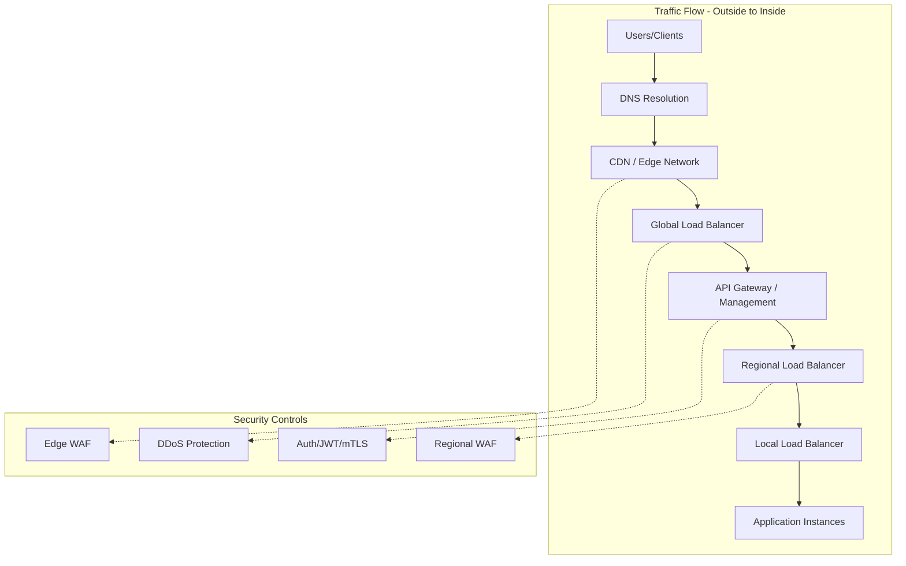

---

## 1. Foundational Concepts

### 1.1 What is a Proxy?

A **proxy** is an intermediary server that sits between clients and backend services, forwarding requests and responses while potentially adding value through caching, security, or transformation.

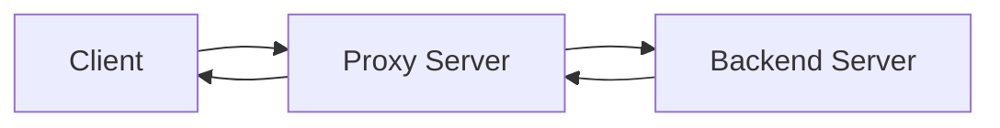

**Proxy Functions:**

| Function | Description |
|----------|-------------|
| **Traffic routing** | Direct requests to appropriate backends |
| **Protocol translation** | Convert between protocols (HTTP/2 to HTTP/1.1) |
| **Security enforcement** | TLS termination, authentication, WAF |
| **Caching** | Store and serve frequently accessed content |
| **Transformation** | Modify requests/responses (headers, body) |
| **Observability** | Log, monitor, and trace traffic |

### 1.2 Forward Proxy vs Reverse Proxy

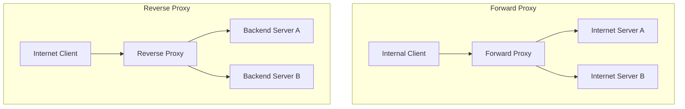

| Aspect | Forward Proxy | Reverse Proxy |
|--------|---------------|---------------|
| **Position** | In front of clients | In front of servers |
| **Purpose** | Control/monitor outbound traffic | Protect/distribute inbound traffic |
| **Client awareness** | Clients configure proxy | Clients unaware of proxy |
| **Use cases** | Content filtering, anonymity | Load balancing, SSL termination, caching |
| **Examples** | Squid, corporate proxies | NGINX, HAProxy, cloud load balancers |

### 1.3 OSI Model Layers in Load Balancing

Understanding which OSI layer a load balancer operates at is crucial for selecting the right solution:

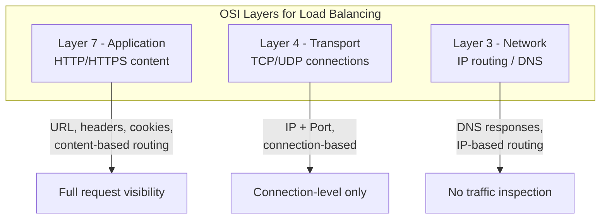

| Layer | What It Sees | Capabilities | Latency Impact |
|-------|--------------|--------------|----------------|
| **Layer 7 (Application)** | Full HTTP/S request | URL routing, header manipulation, WAF, JWT validation | Higher |
| **Layer 4 (Transport)** | TCP/UDP connections | Port-based routing, connection persistence | Lower |
| **Layer 3/DNS** | DNS queries only | Geographic routing, failover | Minimal |

---

## 2. Load Balancing Hierarchy

### 2.1 DNS-Based (Global) Load Balancing

DNS-based load balancing routes users at the DNS resolution level before any actual traffic is sent.

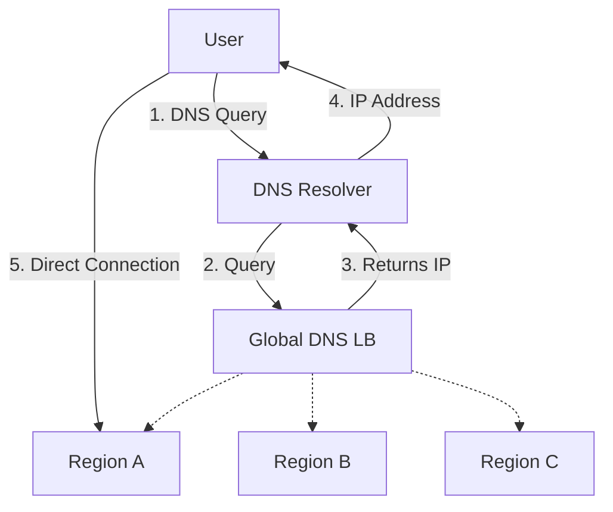

**Characteristics:**

| Aspect | Description |
|--------|-------------|
| **Layer** | DNS (Layer 3) |
| **Traffic flow** | Does NOT proxy traffic - only returns IP addresses |
| **Routing methods** | Geographic, performance, weighted, priority/failover |
| **Health checks** | HTTP, HTTPS, TCP probes to endpoints |
| **TTL consideration** | DNS caching affects failover speed |
| **Protocol support** | Works with any protocol (not just HTTP) |

**Routing Methods:**

| Method | Description | Use Case |
|--------|-------------|----------|
| **Priority** | Route to primary, failover to secondary | Disaster recovery |
| **Weighted** | Distribute by percentage | A/B testing, gradual migration |
| **Performance** | Route to lowest-latency endpoint | Global performance optimization |
| **Geographic** | Route by user location | Data sovereignty, localization |
| **Multivalue** | Return multiple healthy endpoints | Client-side load balancing |

**Technologies:**

| Provider | Service |
|----------|---------|
| **Azure** | Azure Traffic Manager |
| **AWS** | Route 53 |
| **GCP** | Cloud DNS |
| **On-Prem** | BIND, PowerDNS, F5 GTM |

### 2.2 Global/Regional Edge Load Balancing

Edge load balancers operate at globally distributed points of presence (PoPs), providing Layer 7 capabilities at the edge.

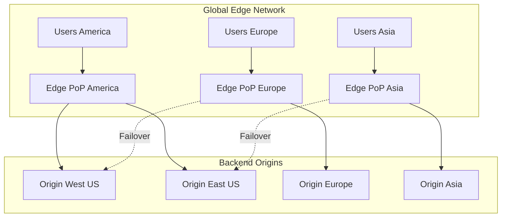

**Characteristics:**

| Aspect | Description |
|--------|-------------|
| **Layer** | Layer 7 (HTTP/HTTPS) |
| **Traffic flow** | Proxies and terminates connections at edge |
| **Key features** | SSL termination, caching, WAF, compression |
| **Anycast** | Single IP announced from multiple locations |
| **Latency benefit** | TLS handshake at edge, persistent backend connections |

**Capabilities:**

- Global SSL/TLS termination
- Web Application Firewall (WAF)
- DDoS protection
- URL-based routing
- Caching and compression
- Session affinity
- Health probes and automatic failover

**Technologies:**

| Provider | Service |
|----------|---------|
| **Azure** | Azure Front Door |
| **AWS** | CloudFront, Global Accelerator |
| **GCP** | Cloud CDN, Cloud Armor |
| **On-Prem/OSS** | Cloudflare, Fastly, Akamai |

### 2.3 Regional Load Balancing

Regional load balancers distribute traffic within a single geographic region or data center.

#### Layer 7 Regional Load Balancer

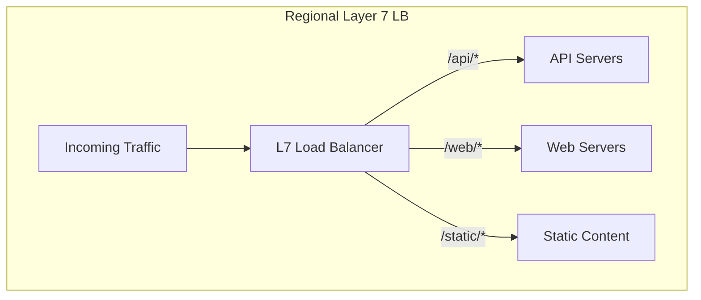

**Characteristics:**

| Aspect | Description |
|--------|-------------|
| **Layer** | Layer 7 (Application) |
| **Routing** | URL path, host header, HTTP headers, cookies |
| **Features** | SSL termination, WAF, session affinity, rewrites |
| **Scope** | Single region/data center |

**Technologies:**

| Provider | Service |
|----------|---------|
| **Azure** | Application Gateway |
| **AWS** | Application Load Balancer (ALB) |
| **GCP** | HTTP(S) Load Balancer |
| **On-Prem/OSS** | NGINX, HAProxy, Envoy, Traefik |

#### Layer 4 Regional Load Balancer

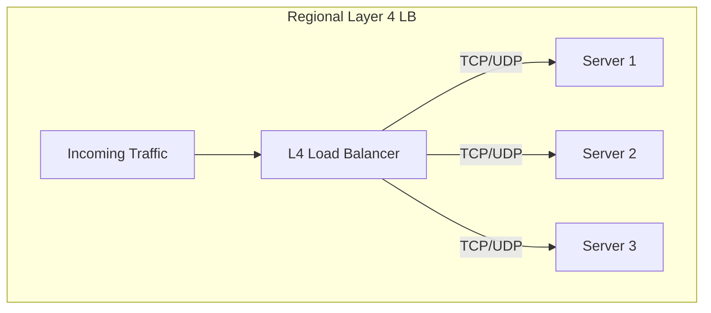

**Characteristics:**

| Aspect | Description |
|--------|-------------|
| **Layer** | Layer 4 (Transport) |
| **Routing** | IP address + port only |
| **Features** | Low latency, any TCP/UDP protocol |
| **Scope** | Single region/data center |

**Technologies:**

| Provider | Service |
|----------|---------|
| **Azure** | Azure Load Balancer (Standard) |
| **AWS** | Network Load Balancer (NLB) |
| **GCP** | TCP/UDP Load Balancer |
| **On-Prem/OSS** | HAProxy, LVS, keepalived, F5 BIG-IP |

### 2.4 Local (Instance-Level) Load Balancing

Local load balancing distributes traffic within a cluster or node group, often within Kubernetes or container orchestration.

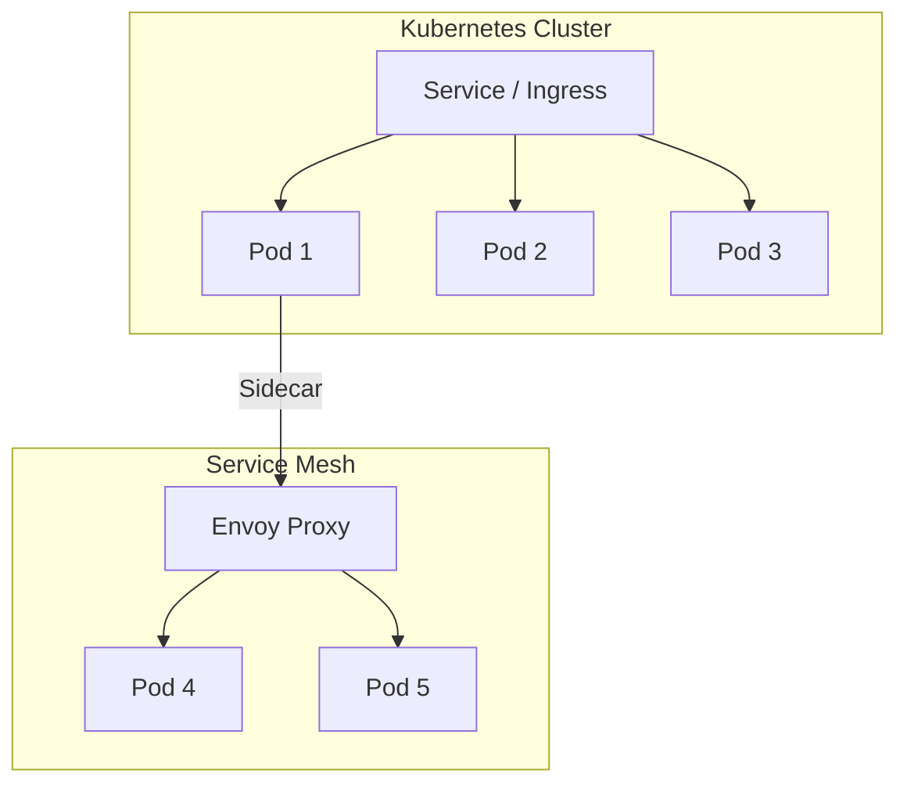

**Technologies:**

| Technology | Type | Description |
|------------|------|-------------|
| **kube-proxy** | L4 | Default Kubernetes service load balancing |
| **NGINX Ingress** | L7 | Kubernetes ingress controller |
| **Traefik** | L7 | Cloud-native reverse proxy |
| **Envoy** | L4/L7 | Service mesh sidecar proxy |
| **Linkerd** | L4/L7 | Lightweight service mesh |
| **Istio** | L4/L7 | Full-featured service mesh |

### 2.5 Internal Load Balancing

Internal load balancers handle traffic within private networks, not exposed to the internet.

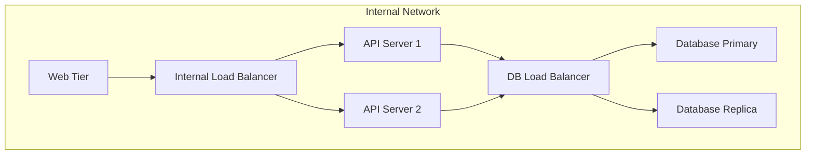

**Use Cases:**

| Use Case | Description |
|----------|-------------|
| **Multi-tier architectures** | Route between web, app, and data tiers |
| **Database connections** | Load balance across read replicas |
| **Microservices** | Service-to-service communication |
| **Hybrid connectivity** | Bridge on-premises and cloud workloads |

**Technologies:**

| Provider | Service |
|----------|---------|
| **Azure** | Internal Load Balancer, Internal App Gateway |
| **AWS** | Internal ALB/NLB |
| **GCP** | Internal Load Balancer |
| **On-Prem/OSS** | HAProxy, NGINX, keepalived, F5 |

---

## 3. Content Delivery and Edge Services

### 3.1 Content Delivery Networks (CDN)

CDNs cache and serve content from edge locations closest to users.

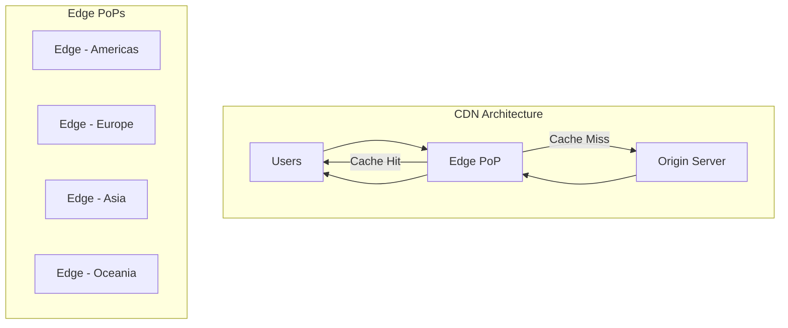

**CDN Capabilities:**

| Capability | Description |
|------------|-------------|
| **Static content caching** | HTML, CSS, JS, images, videos |
| **Dynamic content acceleration** | Optimized routing for dynamic requests |
| **SSL/TLS termination** | Terminate TLS at edge for lower latency |
| **Compression** | Gzip/Brotli compression at edge |
| **Image optimization** | Resize, format conversion on-the-fly |
| **Edge compute** | Run code at edge (serverless functions) |

**Caching Strategies:**

| Strategy | Description | Use Case |
|----------|-------------|----------|
| **Cache-Control headers** | Origin controls caching via HTTP headers | Standard caching |
| **Query string caching** | Cache variations based on query params | API responses |
| **Custom caching rules** | Override defaults per path/content type | Fine-grained control |
| **Purge/Invalidation** | Force cache refresh | Content updates |

**Technologies:**

| Provider | Service |
|----------|---------|
| **Azure** | Azure CDN, Front Door (built-in) |
| **AWS** | CloudFront |
| **GCP** | Cloud CDN |
| **Third-party** | Cloudflare, Akamai, Fastly |

### 3.2 Edge Computing

Edge computing brings computation closer to users for ultra-low latency and local data processing.

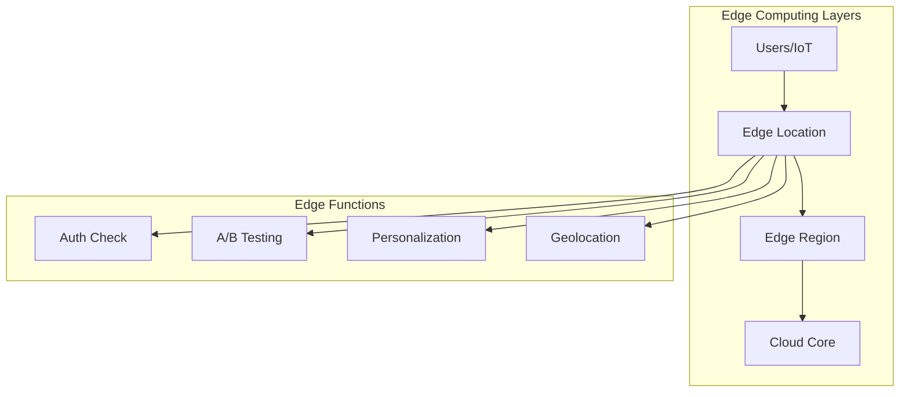

**Edge Computing Use Cases:**

| Use Case | Description |
|----------|-------------|
| **Request modification** | Add/modify headers, rewrite URLs |
| **A/B testing** | Route users to experiments at edge |
| **Authentication** | Validate tokens before hitting origin |
| **Geolocation** | Localize content based on user location |
| **Bot detection** | Filter bot traffic at edge |

**Technologies:**

| Provider | Service |
|----------|---------|
| **Cloudflare** | Workers |
| **AWS** | Lambda@Edge, CloudFront Functions |
| **Azure** | Azure Functions (Edge) |
| **Fastly** | Compute@Edge |

---

## 4. Security Controls at the Edge

### 4.1 Web Application Firewall (WAF)

WAF protects web applications by filtering and monitoring HTTP traffic.

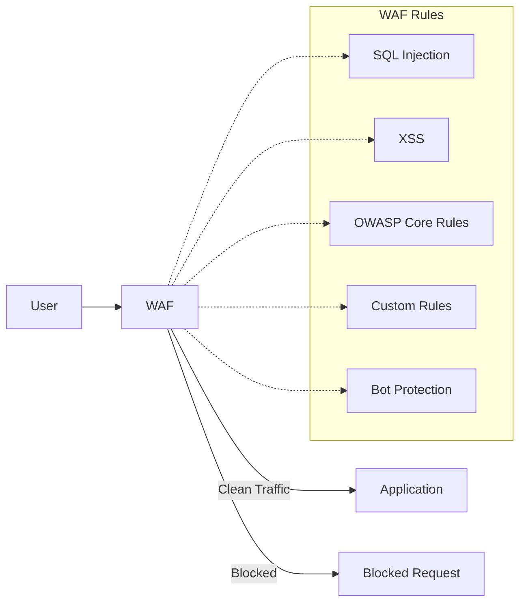

**WAF Rule Categories:**

| Category | Description |
|----------|-------------|
| **OWASP Core Rule Set (CRS)** | Protection against OWASP Top 10 vulnerabilities |
| **SQL Injection (SQLi)** | Block malicious SQL in input |
| **Cross-Site Scripting (XSS)** | Prevent script injection |
| **Local File Inclusion (LFI)** | Block path traversal attacks |
| **Remote Code Execution (RCE)** | Prevent command injection |
| **Bot Protection** | Detect and block malicious bots |
| **Rate Limiting** | Limit request rates per IP/session |
| **Geo-blocking** | Block traffic from specific countries |

**WAF Modes:**

| Mode | Description | Use Case |
|------|-------------|----------|
| **Detection** | Log but don't block | Initial deployment, testing |
| **Prevention** | Block matching requests | Production protection |

**Technologies:**

| Provider | Service |
|----------|---------|
| **Azure** | Azure WAF (Front Door, App Gateway) |
| **AWS** | AWS WAF |
| **GCP** | Cloud Armor |
| **On-Prem/OSS** | ModSecurity, NGINX WAF |

### 4.2 DDoS Protection

DDoS protection defends against volumetric, protocol, and application-layer attacks.

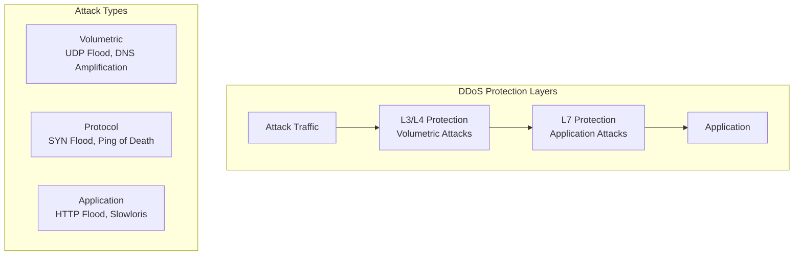

**Protection Layers:**

| Layer | Attack Types | Protection Mechanism |
|-------|--------------|---------------------|
| **Network (L3/L4)** | UDP floods, SYN floods, amplification | Traffic scrubbing, rate limiting |
| **Application (L7)** | HTTP floods, Slowloris, credential stuffing | WAF rules, behavioral analysis |

**Technologies:**

| Provider | Service |
|----------|---------|
| **Azure** | Azure DDoS Protection (Basic/Standard) |
| **AWS** | AWS Shield (Standard/Advanced) |
| **GCP** | Cloud Armor |
| **Third-party** | Cloudflare, Akamai, Imperva |

### 4.3 TLS/SSL Termination

TLS termination decrypts HTTPS traffic at the proxy/load balancer level.

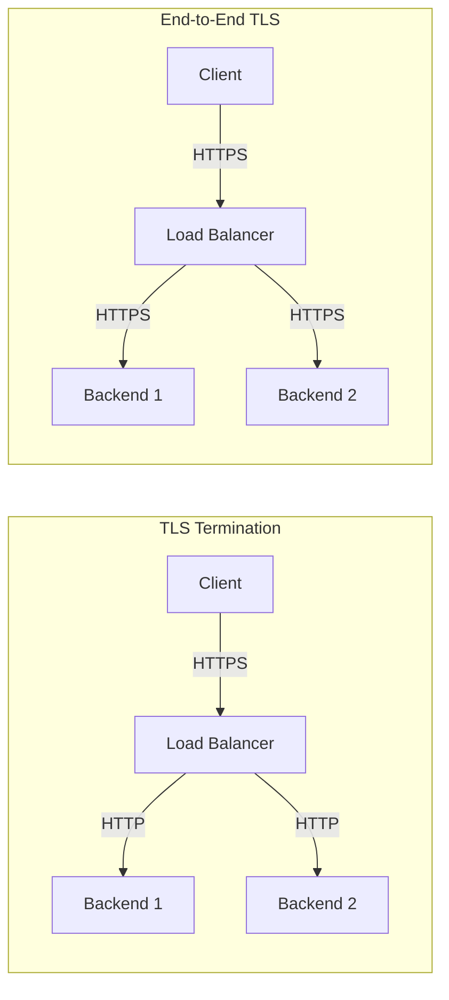

**TLS Handling Options:**

| Mode | Description | Use Case |
|------|-------------|----------|
| **TLS Termination** | Decrypt at LB, HTTP to backends | Most common, simplifies backend |
| **TLS Passthrough** | Forward encrypted traffic unchanged | Backend handles TLS |
| **End-to-End TLS** | Re-encrypt traffic to backend | Compliance requirements |
| **TLS Bridging** | Decrypt, inspect, re-encrypt | Security inspection |

**Certificate Management:**

| Aspect | Consideration |
|--------|---------------|
| **Managed certificates** | Auto-provisioned and renewed (Let's Encrypt style) |
| **Custom certificates** | Bring your own from CA |
| **Certificate rotation** | Automated renewal without downtime |
| **Cipher suites** | Configure allowed TLS versions and ciphers |

### 4.4 mTLS (Mutual TLS)

mTLS requires both client and server to present certificates, providing bidirectional authentication.

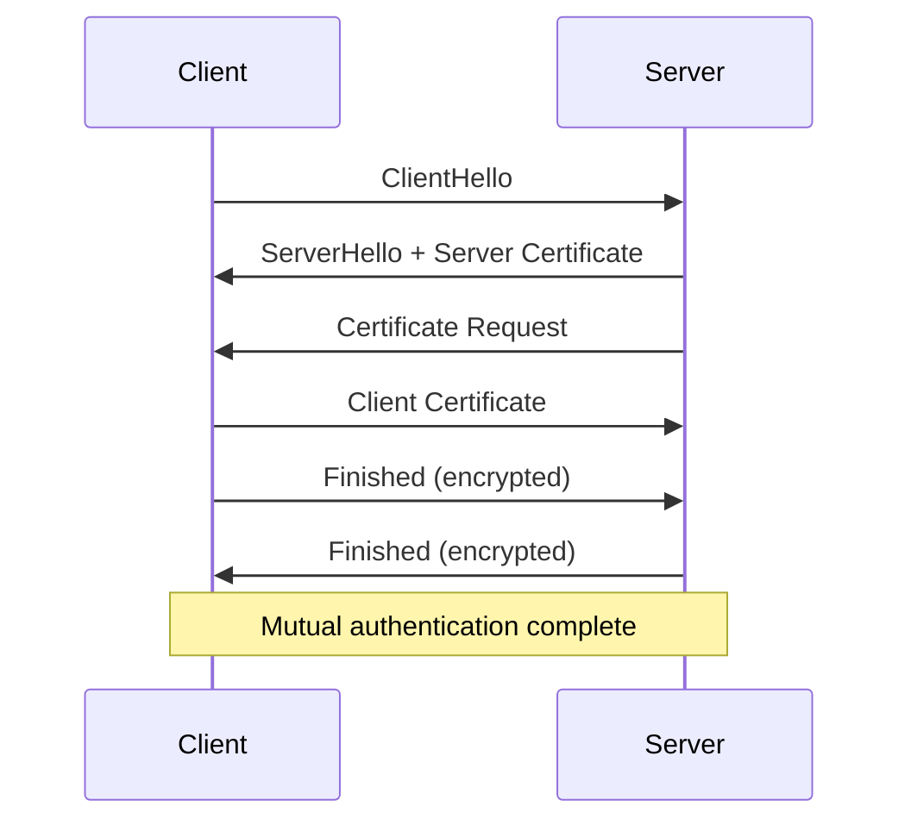

**mTLS Use Cases:**

| Use Case | Description |
|----------|-------------|
| **Service-to-service** | Zero-trust communication between microservices |
| **API security** | Strong client authentication for APIs |
| **Partner integration** | B2B communication with trusted partners |
| **Compliance** | PCI-DSS, healthcare regulations |

**Implementation Considerations:**

| Aspect | Consideration |
|--------|---------------|
| **Certificate distribution** | How to provision and rotate client certs |
| **Certificate validation** | Verify issuer, expiry, revocation (CRL/OCSP) |
| **Service mesh** | Automated mTLS (Istio, Linkerd) |
| **API gateway** | mTLS termination at gateway |

---

## 5. Authentication and Authorization Controls

### 5.1 JWT Validation

JSON Web Token (JWT) validation at the proxy/gateway level.

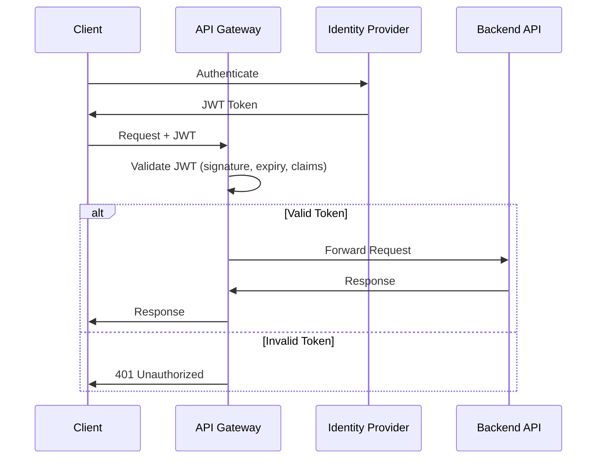

**JWT Validation Checks:**

| Check | Description |
|-------|-------------|
| **Signature verification** | Validate using public key/shared secret |
| **Expiration (exp)** | Token not expired |
| **Not Before (nbf)** | Token is active |
| **Issuer (iss)** | Token from trusted issuer |
| **Audience (aud)** | Token intended for this API |
| **Custom claims** | Application-specific claims validation |

### 5.2 OAuth 2.0/OpenID Connect

OAuth 2.0 and OIDC provide standardized authentication and authorization flows.

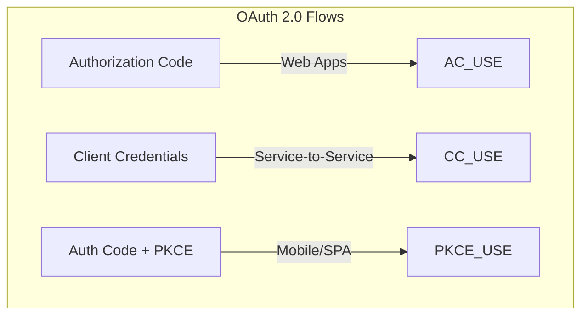

**Common Flows:**

| Flow | Use Case | Description |
|------|----------|-------------|
| **Authorization Code** | Web applications | User authentication via redirect |
| **Client Credentials** | Service-to-service | Machine-to-machine authentication |
| **Auth Code + PKCE** | Mobile/SPA | Secure public client authentication |
| **On-Behalf-Of** | API chaining | Delegate user identity downstream |

### 5.3 API Key Validation

Simple API key validation for basic access control.

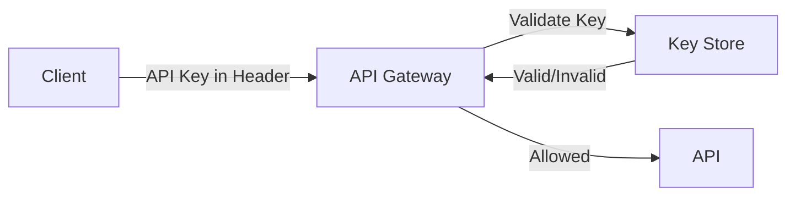

**API Key Best Practices:**

| Practice | Description |
|----------|-------------|
| **Transmission** | Use headers, not query parameters (avoid logging) |
| **Rotation** | Regular key rotation with grace periods |
| **Scoping** | Limit keys to specific APIs/operations |
| **Rate limiting** | Associate quotas with keys |
| **Revocation** | Immediate revocation capability |

---

## 6. API Management and Gateway

### 6.1 API Gateway Concepts

API gateways provide a single entry point for APIs with cross-cutting concerns.

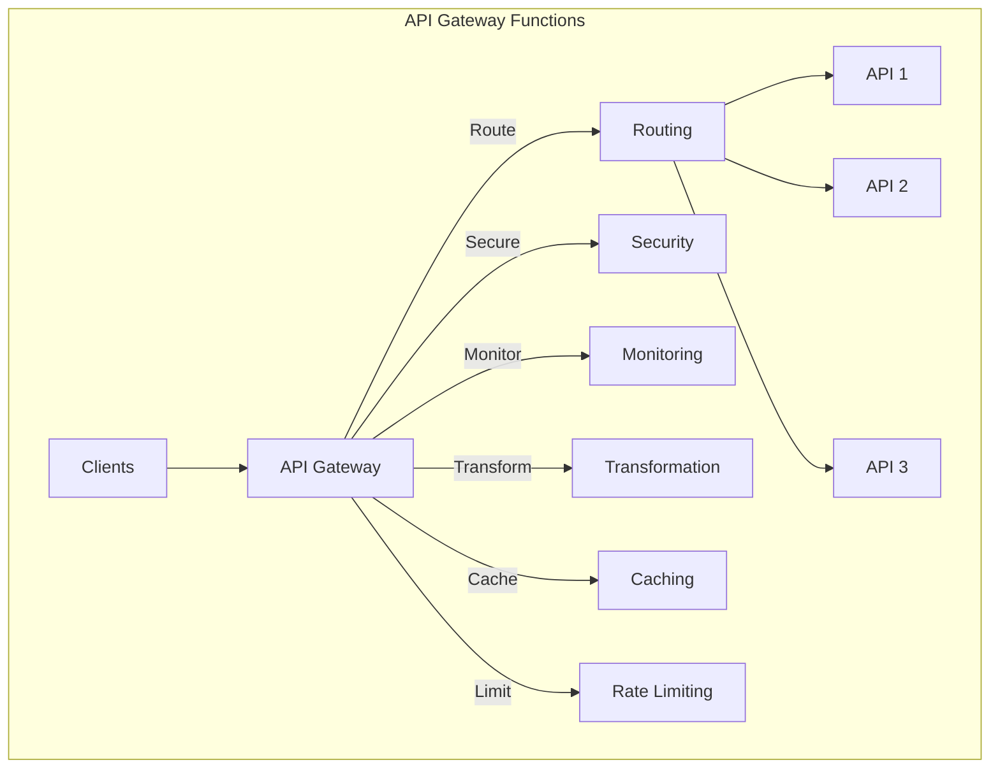

**Core Gateway Functions:**

| Function | Description |
|----------|-------------|
| **Request routing** | Route requests to appropriate backend services |
| **Authentication** | Validate identity (JWT, OAuth, API keys) |
| **Authorization** | Enforce access policies |
| **Rate limiting** | Protect backends from overload |
| **Caching** | Cache responses for performance |
| **Request transformation** | Modify requests before forwarding |
| **Response transformation** | Modify responses before returning |
| **Logging and monitoring** | Capture metrics and logs |
| **Circuit breaking** | Prevent cascade failures |

### 6.2 API Management Features

Full API management platforms provide additional lifecycle capabilities.

```mermaid
graph TB
    subgraph "API Management Platform"
        DP[Developer Portal] --> |Discover| APIS
        DP --> |Subscribe| SUB[Subscriptions]
        
        GW[API Gateway] --> |Route| APIS[APIs]
        GW --> |Enforce| POL[Policies]
        
        PUB[Publisher Portal] --> |Manage| APIS
        PUB --> |Configure| POL
        
        AN[Analytics] --> |Monitor| GW
    end
```

**API Management Capabilities:**

| Capability | Description |
|------------|-------------|
| **API lifecycle management** | Design, implement, version, deprecate APIs |
| **Developer portal** | Self-service API discovery and subscription |
| **API products** | Bundle APIs with quotas and policies |
| **Versioning** | Multiple API versions simultaneously |
| **Documentation** | Auto-generated from OpenAPI specs |
| **Monetization** | Usage-based billing and metering |
| **Analytics** | Usage patterns, performance, errors |
| **Policy engine** | Reusable policy expressions |

**Technologies:**

| Provider | Service |
|----------|---------|
| **Azure** | Azure API Management |
| **AWS** | API Gateway, AWS AppSync |
| **GCP** | Apigee |
| **On-Prem/OSS** | Kong, Tyk, WSO2, Gravitee |

### 6.3 Rate Limiting and Throttling

Protect APIs from abuse and ensure fair usage.

```mermaid
graph TB
    subgraph "Rate Limiting Strategies"
        R[Requests] --> WA[Window-based]
        R --> TB[Token Bucket]
        R --> LB[Leaky Bucket]
        R --> SW[Sliding Window]
    end
```

**Rate Limiting Algorithms:**

| Algorithm | Description | Pros | Cons |
|-----------|-------------|------|------|
| **Fixed Window** | Count requests per fixed time window | Simple | Burst at window edges |
| **Sliding Window** | Rolling time window | Smooth limits | More complex |
| **Token Bucket** | Tokens replenish over time | Allows controlled bursts | Needs state |
| **Leaky Bucket** | Constant output rate | Very smooth | No burst handling |

**Rate Limiting Dimensions:**

| Dimension | Description |
|-----------|-------------|
| **Per API key** | Limit by subscription/key |
| **Per user** | Limit by authenticated user |
| **Per IP** | Limit by client IP address |
| **Per endpoint** | Different limits per operation |
| **Global** | Overall API rate limit |

### 6.4 Request/Response Transformation

Modify requests and responses in-flight.

```mermaid
graph LR
    subgraph "Request Transformation"
        C[Client Request] --> T1[Add Headers]
        T1 --> T2[Rewrite URL]
        T2 --> T3[Transform Body]
        T3 --> B[Backend]
    end
    
    subgraph "Response Transformation"
        B2[Backend Response] --> T4[Remove Headers]
        T4 --> T5[Transform Body]
        T5 --> T6[Add CORS]
        T6 --> C2[Client]
    end
```

**Common Transformations:**

| Transformation | Description |
|----------------|-------------|
| **Header manipulation** | Add, modify, remove headers |
| **URL rewriting** | Change path, query parameters |
| **Body transformation** | JSON to XML, field mapping |
| **Protocol translation** | REST to SOAP, HTTP to gRPC |
| **Response filtering** | Remove sensitive fields |
| **Aggregation** | Combine multiple backend responses |

---

## 7. Routing Strategies

### 7.1 DNS-Based Routing

Route at the DNS resolution level.

```mermaid
graph TB
    U[User Query: api.example.com] --> DNS[DNS]
    DNS --> |Geographic| GEO[Return nearest region IP]
    DNS --> |Performance| PERF[Return lowest latency IP]
    DNS --> |Weighted| WEIGHT[Return by weight distribution]
    DNS --> |Priority| PRIO[Return primary, failover if down]
```

### 7.2 Path-Based Routing

Route based on URL path.

```mermaid
graph LR
    R[Request] --> LB[Load Balancer]
    LB --> |/api/v1/*| API1[API v1 Service]
    LB --> |/api/v2/*| API2[API v2 Service]
    LB --> |/users/*| USERS[Users Service]
    LB --> |/orders/*| ORDERS[Orders Service]
```

### 7.3 Header-Based Routing

Route based on HTTP headers.

```mermaid
graph LR
    R[Request] --> LB[Load Balancer]
    LB --> |X-Version: beta| BETA[Beta Environment]
    LB --> |X-Client: mobile| MOBILE[Mobile BFF]
    LB --> |Host: tenant-a.example.com| TA[Tenant A]
```

**Common Header Routing Scenarios:**

| Header | Use Case |
|--------|----------|
| **Host** | Multi-tenant routing |
| **X-Version** | API version selection |
| **Accept-Language** | Language-specific backends |
| **User-Agent** | Device-specific routing |
| **Custom headers** | Feature flags, experiments |

### 7.4 Geographic Routing

Route based on client geographic location.

```mermaid
graph TB
    subgraph "Geographic Routing"
        U1[User in US] --> |Route to| US[US Region]
        U2[User in EU] --> |Route to| EU[EU Region]
        U3[User in APAC] --> |Route to| APAC[APAC Region]
    end
```

**Geographic Routing Use Cases:**

| Use Case | Description |
|----------|-------------|
| **Data sovereignty** | Keep EU data in EU regions |
| **Latency optimization** | Route to nearest region |
| **Content localization** | Region-specific content |
| **Regulatory compliance** | Meet local requirements |

### 7.5 Weighted Routing

Distribute traffic by percentage across backends.

```mermaid
graph LR
    R[100% Traffic] --> LB[Load Balancer]
    LB --> |90%| PROD[Production]
    LB --> |10%| CANARY[Canary Release]
```

**Use Cases:**

| Use Case | Description |
|----------|-------------|
| **Canary deployments** | Test new version with small traffic % |
| **A/B testing** | Experiment with different variants |
| **Gradual migration** | Shift traffic during migrations |
| **Blue-green deployment** | Instant cutover capability |

---

## 8. Architecture Patterns

### 8.1 Single Entry Point Pattern

All traffic flows through a single global entry point.

```mermaid
graph TB
    subgraph "Single Entry Point"
        U[Users] --> FD[Global Entry Point<br/>Front Door / CloudFront]
        FD --> R1[Region 1]
        FD --> R2[Region 2]
        FD --> R3[Region 3]
    end
```

**Benefits:**
- Single SSL certificate management
- Centralized WAF and DDoS protection
- Consistent routing and caching
- Simplified DNS management

### 8.2 Multi-Tier Proxy Pattern

Multiple layers of proxies for different concerns.

```mermaid
graph TB
    subgraph "Multi-Tier Architecture"
        U[Users] --> CDN[CDN Layer<br/>Cache, DDoS]
        CDN --> GLB[Global LB<br/>Front Door]
        GLB --> APIM[API Gateway<br/>Auth, Policies]
        APIM --> RLB[Regional LB<br/>App Gateway]
        RLB --> K8S[Kubernetes Ingress]
        K8S --> POD[Application Pods]
    end
```

**Layer Responsibilities:**

| Layer | Responsibility |
|-------|----------------|
| **CDN** | Caching, edge security, compression |
| **Global LB** | Geographic routing, global failover, WAF |
| **API Gateway** | Authentication, rate limiting, transformation |
| **Regional LB** | Regional routing, SSL termination |
| **Ingress** | Cluster-level routing |

### 8.3 Backend for Frontend (BFF)

Dedicated backends for different client types.

```mermaid
graph TB
    subgraph "BFF Pattern"
        M[Mobile App] --> BFF_M[Mobile BFF]
        W[Web App] --> BFF_W[Web BFF]
        P[Partner API] --> BFF_P[Partner BFF]
        
        BFF_M --> S1[Service A]
        BFF_M --> S2[Service B]
        BFF_W --> S1
        BFF_W --> S3[Service C]
        BFF_P --> S2
        BFF_P --> S3
    end
```

**Benefits:**

| Benefit | Description |
|---------|-------------|
| **Optimized responses** | Tailor data for each client type |
| **Reduced over-fetching** | Return only what client needs |
| **Independent evolution** | Change BFF without affecting others |
| **Security isolation** | Different auth for different clients |

### 8.4 Service Mesh Pattern

Service mesh is a dedicated infrastructure layer for handling service-to-service communication in microservices architectures. It abstracts networking concerns away from application code by using sidecar proxies deployed alongside each service instance.

> 📘 **For comprehensive service mesh documentation, see [Service Mesh Architecture](./service-mesh-architecture.md)**

#### Overview

```mermaid
graph TB
    subgraph "Service Mesh"
        subgraph "Service A"
            SA[App] --> PA[Sidecar Proxy]
        end
        subgraph "Service B"
            SB[App] --> PB[Sidecar Proxy]
        end
        subgraph "Service C"
            SC[App] --> PC[Sidecar Proxy]
        end
        
        PA <--> |mTLS| PB
        PB <--> |mTLS| PC
        PA <--> |mTLS| PC
        
        CP[Control Plane] -.-> PA
        CP -.-> PB
        CP -.-> PC
    end
```

#### Core Components

| Component | Description |
|-----------|-------------|
| **Data Plane** | Sidecar proxies (Envoy) deployed with each service, intercepts all traffic |
| **Control Plane** | Manages configuration, certificates, service discovery, and telemetry |

#### Key Capabilities

| Capability | Description |
|------------|-------------|
| **mTLS** | Automatic mutual TLS encryption between all services |
| **Traffic Management** | Routing, retries, timeouts, circuit breaking, traffic splitting |
| **Observability** | Automatic metrics, distributed tracing, access logs |
| **Policy Enforcement** | Fine-grained authorization, rate limiting |

#### Service Mesh vs Kubernetes Native Networking

| Aspect | Kubernetes Native | Service Mesh |
|--------|-------------------|--------------|
| **Encryption** | ❌ None by default | ✅ Automatic mTLS |
| **L7 Routing** | ❌ Limited | ✅ Full (path, headers, weight) |
| **Resilience** | ❌ App implements | ✅ Built-in retries, circuit breaking |
| **Observability** | Basic metrics | ✅ Full metrics, tracing, logs |
| **Latency** | ~0.1ms | ~1-3ms per hop |
| **Resource** | Low | High (sidecar per pod) |

#### When to Use

**Good Fit:**
- Many microservices (50+) requiring consistent networking
- Zero-trust security requirements (mTLS everywhere)
- Complex traffic patterns (canary, A/B testing)
- Need automatic observability across services

**Poor Fit:**
- Few services (<10)
- Latency-critical applications (sub-millisecond)
- Resource-constrained environments

#### Technology Options

| Technology | Strengths | Best For |
|------------|-----------|----------|
| **Istio** | Most features, advanced traffic management | Complex enterprise requirements |
| **Linkerd** | Lightweight, simple, fast | Teams new to service mesh |
| **Cilium** | eBPF-based, best performance | Performance-critical workloads |
| **Consul Connect** | Multi-datacenter, service discovery | HashiCorp ecosystem |

> 📘 **See [Service Mesh Architecture](./service-mesh-architecture.md) for:**
> - Detailed architecture diagrams and traffic flows
> - Configuration examples (Istio VirtualService, AuthorizationPolicy)
> - Kubernetes Internal LB vs Service Mesh comparison
> - Hybrid deployment strategies
> - Migration paths

---

## 9. Technology Reference

### 9.1 Cloud Provider Services

#### Azure

| Service | Layer | Scope | Primary Use |
|---------|-------|-------|-------------|
| **Traffic Manager** | DNS | Global | DNS-based routing and failover |
| **Front Door** | L7 | Global | Global LB, CDN, WAF |
| **Application Gateway** | L7 | Regional | Regional HTTP LB, WAF |
| **Load Balancer** | L4 | Regional | TCP/UDP load balancing |
| **API Management** | L7 | Global/Regional | Full API gateway |
| **Azure CDN** | L7 | Global | Content delivery |

#### AWS

| Service | Layer | Scope | Primary Use |
|---------|-------|-------|-------------|
| **Route 53** | DNS | Global | DNS-based routing |
| **CloudFront** | L7 | Global | CDN with edge functions |
| **Global Accelerator** | L4/L7 | Global | Anycast acceleration |
| **ALB** | L7 | Regional | HTTP/HTTPS load balancing |
| **NLB** | L4 | Regional | TCP/UDP load balancing |
| **API Gateway** | L7 | Regional | API management |

#### GCP

| Service | Layer | Scope | Primary Use |
|---------|-------|-------|-------------|
| **Cloud DNS** | DNS | Global | DNS-based routing |
| **Cloud CDN** | L7 | Global | Content delivery |
| **Cloud Load Balancing** | L4/L7 | Global/Regional | Comprehensive LB |
| **Cloud Armor** | L7 | Global | WAF and DDoS |
| **Apigee** | L7 | Global | API management |

### 9.2 Open Source / On-Premises Solutions

#### Reverse Proxy / Load Balancer

| Technology | Layer | Strengths |
|------------|-------|-----------|
| **NGINX** | L4/L7 | High performance, versatile |
| **HAProxy** | L4/L7 | Ultra-high performance, reliable |
| **Envoy** | L4/L7 | Cloud-native, extensible |
| **Traefik** | L7 | Kubernetes-native, auto-discovery |
| **Caddy** | L7 | Auto HTTPS, simple config |

#### API Gateway

| Technology | Strengths |
|------------|-----------|
| **Kong** | Plugin ecosystem, Kubernetes-native |
| **Tyk** | Open source, GraphQL support |
| **KrakenD** | High performance, stateless |
| **Gravitee** | Full API lifecycle management |
| **WSO2** | Enterprise integration |

#### Service Mesh

| Technology | Strengths |
|------------|-----------|
| **Istio** | Full-featured, Envoy-based |
| **Linkerd** | Lightweight, simple |
| **Consul Connect** | Multi-datacenter, service discovery |

#### WAF

| Technology | Deployment |
|------------|------------|
| **ModSecurity** | NGINX/Apache module |
| **NAXSI** | NGINX module |
| **Coraza** | Go library, Caddy plugin |

#### DNS / Global Load Balancing

| Technology | Type |
|------------|------|
| **BIND** | DNS server |
| **PowerDNS** | DNS server with geo features |
| **F5 GTM** | Global traffic management |

---

## 10. Decision Framework

### Choosing the Right Load Balancing Layer

```mermaid
flowchart TD
    A[Start] --> B{Global or Regional?}
    B --> |Global| C{Need CDN/Caching?}
    B --> |Regional| D{HTTP/HTTPS only?}
    
    C --> |Yes| E[Global Edge LB<br/>Front Door, CloudFront]
    C --> |No| F{DNS-level routing sufficient?}
    
    F --> |Yes| G[DNS LB<br/>Traffic Manager, Route 53]
    F --> |No| E
    
    D --> |Yes| H{Need WAF?}
    D --> |No| I[L4 Load Balancer<br/>Azure LB, NLB]
    
    H --> |Yes| J[L7 LB with WAF<br/>App Gateway, ALB + WAF]
    H --> |No| K[L7 Load Balancer<br/>App Gateway, ALB]
    
    E --> L{Need API Management?}
    J --> L
    K --> L
    G --> L
    I --> L
    
    L --> |Yes| M[Add API Gateway<br/>APIM, Kong, API Gateway]
    L --> |No| N[Complete]
    M --> N
```

### Quick Decision Matrix

| Requirement | Recommended Layer |
|-------------|-------------------|
| Global failover only | DNS Load Balancer |
| Global + caching + WAF | Edge Load Balancer (Front Door, CloudFront) |
| Regional HTTP routing | L7 Regional LB (App Gateway, ALB) |
| Regional TCP/UDP | L4 Regional LB (Azure LB, NLB) |
| API policies, portal | API Management |
| Service-to-service (K8s) | Service Mesh or Ingress |
| Internal multi-tier | Internal Load Balancer |

### Combining Services

Common architecture combinations:

| Pattern | Components |
|---------|------------|
| **Global Web App** | Traffic Manager → Front Door → App Gateway → App Service |
| **Global API** | Front Door → API Management → AKS |
| **Multi-region API** | Traffic Manager → Regional APIM → Backend |
| **Hybrid** | Front Door → VPN Gateway → On-prem servers |

---

## Related Topics

- [Service Mesh Architecture](./service-mesh-architecture.md) - Detailed service mesh patterns and Kubernetes comparison
- [Hub-Spoke Network Architecture](./hub_spoke_network_architecture.md) - Network topology patterns
- [API Architecture Overview](../../03-integration-communication-architecture/api-architecture/api-architecture-overview.md) - API design and gateway patterns
- [Network Security Architecture](../../06-security-architecture/6.3-network-security-architecture.md) - Security controls and WAF
- [Azure Load Balancing Comparison](../../../architecture-azure/networking/load-balancing/azure-load-balancing-services-comparison.md) - Azure-specific service comparison
