# Service Mesh Architecture

## Table of Contents

- [Overview](#overview)
- [1. Why Service Mesh?](#1-why-service-mesh)
- [2. Service Mesh Architecture](#2-service-mesh-architecture)
  - [2.1 Data Plane](#21-data-plane)
  - [2.2 Control Plane](#22-control-plane)
- [3. Service Mesh Capabilities](#3-service-mesh-capabilities)
  - [3.1 Traffic Management](#31-traffic-management)
  - [3.2 Security (mTLS and Authorization)](#32-security-mtls-and-authorization)
  - [3.3 Observability](#33-observability)
  - [3.4 Resilience Patterns](#34-resilience-patterns)
- [4. Service Mesh Comparison](#4-service-mesh-comparison)
- [5. When to Use Service Mesh](#5-when-to-use-service-mesh)
- [6. Service Mesh vs API Gateway](#6-service-mesh-vs-api-gateway)
- [7. Kubernetes Internal Load Balancer vs Service Mesh](#7-kubernetes-internal-load-balancer-vs-service-mesh)
  - [7.1 Architecture Comparison](#71-architecture-comparison)
  - [7.2 Traffic Flow Comparison](#72-traffic-flow-comparison)
  - [7.3 Detailed Comparison](#73-detailed-comparison)
  - [7.4 Resource Usage](#74-resource-usage)
  - [7.5 Decision Guide](#75-decision-guide)
  - [7.6 Hybrid Approach](#76-hybrid-approach)
  - [7.7 Migration Path](#77-migration-path)
- [8. Service Mesh Technologies](#8-service-mesh-technologies)
  - [8.1 Istio](#81-istio)
  - [8.2 Linkerd](#82-linkerd)
  - [8.3 Cilium Service Mesh](#83-cilium-service-mesh)
- [Related Topics](#related-topics)

---

## Overview

Service mesh is a dedicated infrastructure layer for handling service-to-service communication in microservices architectures. It abstracts networking concerns away from application code by using sidecar proxies deployed alongside each service instance.

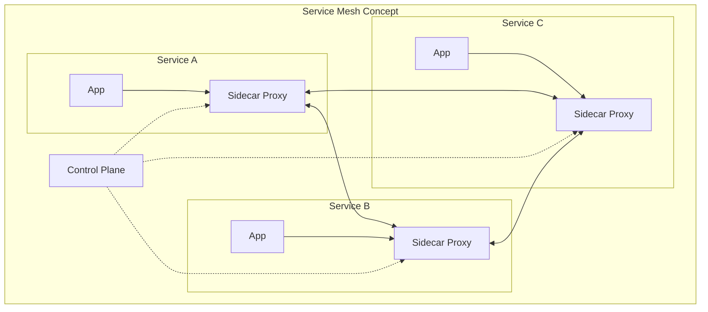

**Key Value Proposition:**

| Benefit | Description |
|---------|-------------|
| **Zero-trust security** | Automatic mTLS between all services |
| **Observability** | Metrics, tracing, and logging without code changes |
| **Traffic control** | Advanced routing, retries, circuit breaking |
| **Policy enforcement** | Centralized, declarative access control |

---

## 1. Why Service Mesh?

In microservices architectures, the number of services and their interactions grow exponentially. Managing cross-cutting concerns like security, observability, and resilience becomes challenging:

| Challenge | Without Service Mesh | With Service Mesh |
|-----------|---------------------|-------------------|
| **Service discovery** | Application code or external tool | Automatic via control plane |
| **Load balancing** | Client-side libraries or external LB | Sidecar handles automatically |
| **Encryption (mTLS)** | Manual certificate management per service | Automatic, transparent mTLS |
| **Retries/Timeouts** | Implemented in each service | Configured centrally, enforced by proxy |
| **Observability** | Instrumentation in each service | Automatic metrics, traces, logs |
| **Access control** | Custom auth logic per service | Declarative policies |

---

## 2. Service Mesh Architecture

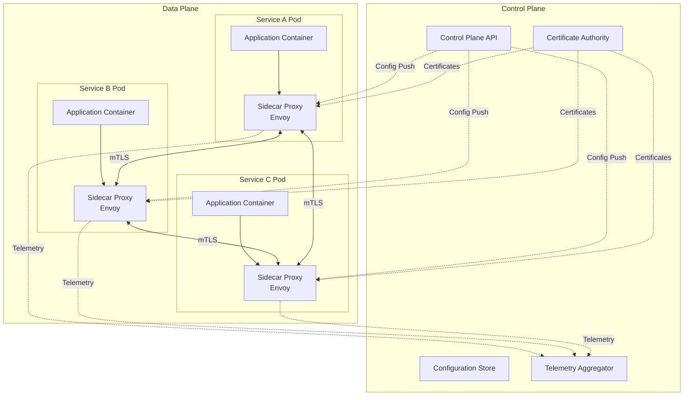

### 2.1 Data Plane

The data plane consists of lightweight proxies (sidecars) deployed alongside each service instance.

| Component | Description |
|-----------|-------------|
| **Sidecar Proxy** | Intercepts all inbound/outbound traffic for the service |
| **Traffic Interception** | Uses iptables rules to capture traffic transparently |
| **Protocol Support** | HTTP/1.1, HTTP/2, gRPC, TCP, WebSocket |

**How Sidecar Injection Works:**

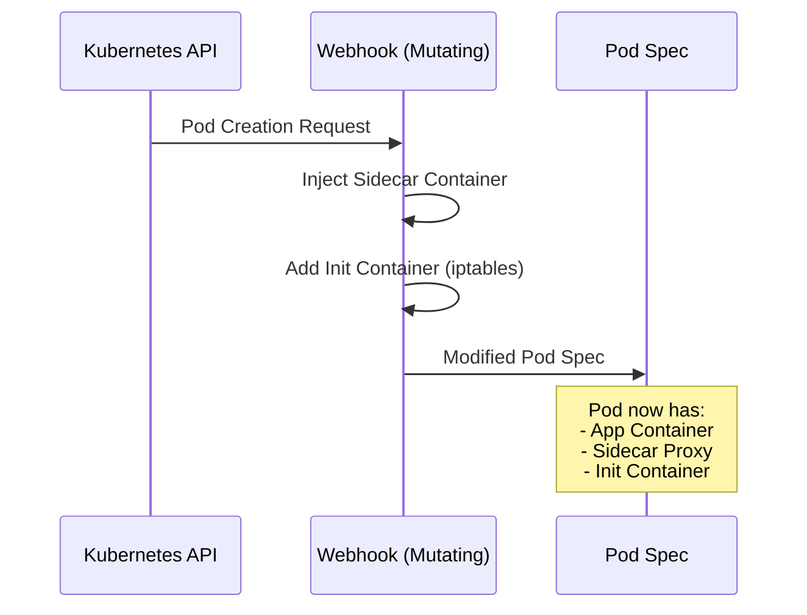

### 2.2 Control Plane

The control plane manages and configures the data plane proxies.

| Component | Responsibility |
|-----------|----------------|
| **Configuration API** | Receives configs from operators (CRDs, API calls) |
| **Config Distribution** | Pushes configuration to all proxies (xDS protocol) |
| **Certificate Authority** | Issues and rotates mTLS certificates |
| **Service Discovery** | Tracks service endpoints and health |
| **Policy Engine** | Evaluates and distributes access policies |
| **Telemetry Collection** | Aggregates metrics, traces, and logs |

---

## 3. Service Mesh Capabilities

### 3.1 Traffic Management

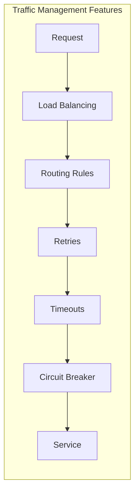

| Feature | Description | Example |
|---------|-------------|---------|
| **Request Routing** | Route based on headers, path, weight | Send 10% to canary |
| **Load Balancing** | Multiple algorithms | Round-robin, least connections, random |
| **Retries** | Automatic retry on failure | Retry 3 times with backoff |
| **Timeouts** | Request/connection timeouts | 30s request timeout |
| **Circuit Breaking** | Prevent cascade failures | Open after 5 consecutive failures |
| **Rate Limiting** | Limit request rates | 100 req/sec per client |
| **Fault Injection** | Test resilience | Inject 500 errors for 5% of requests |
| **Traffic Mirroring** | Shadow traffic for testing | Mirror production to staging |

**Traffic Routing Example (Istio VirtualService):**

```yaml
apiVersion: networking.istio.io/v1beta1
kind: VirtualService
metadata:
  name: reviews-route
spec:
  hosts:
  - reviews
  http:
  - match:
    - headers:
        end-user:
          exact: jason
    route:
    - destination:
        host: reviews
        subset: v2
  - route:
    - destination:
        host: reviews
        subset: v1
      weight: 90
    - destination:
        host: reviews
        subset: v3
      weight: 10
```

### 3.2 Security (mTLS and Authorization)

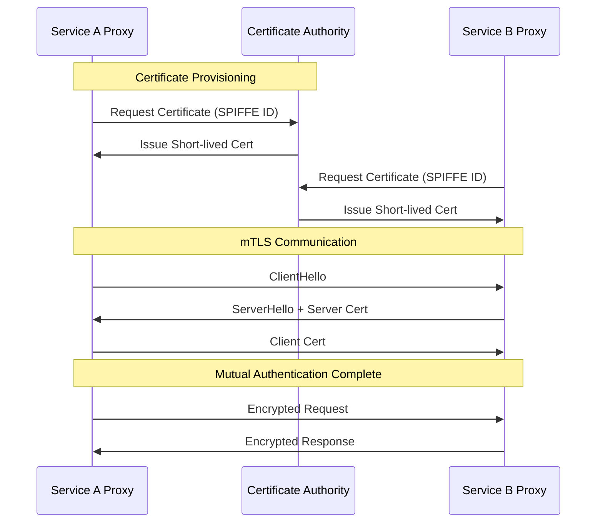

**Security Features:**

| Feature | Description |
|---------|-------------|
| **Automatic mTLS** | Encrypt all service-to-service traffic |
| **Identity (SPIFFE)** | Cryptographic service identity |
| **Certificate Rotation** | Automatic short-lived certificate rotation |
| **Authorization Policies** | Fine-grained access control |
| **Peer Authentication** | Enforce mTLS mode (strict, permissive) |

**Authorization Policy Example (Istio):**

```yaml
apiVersion: security.istio.io/v1beta1
kind: AuthorizationPolicy
metadata:
  name: orders-policy
  namespace: production
spec:
  selector:
    matchLabels:
      app: orders
  action: ALLOW
  rules:
  - from:
    - source:
        principals: ["cluster.local/ns/production/sa/frontend"]
    to:
    - operation:
        methods: ["GET", "POST"]
        paths: ["/api/orders/*"]
  - from:
    - source:
        principals: ["cluster.local/ns/production/sa/admin"]
    # Admin can access all methods
```

### 3.3 Observability

Service mesh provides comprehensive observability without code changes.

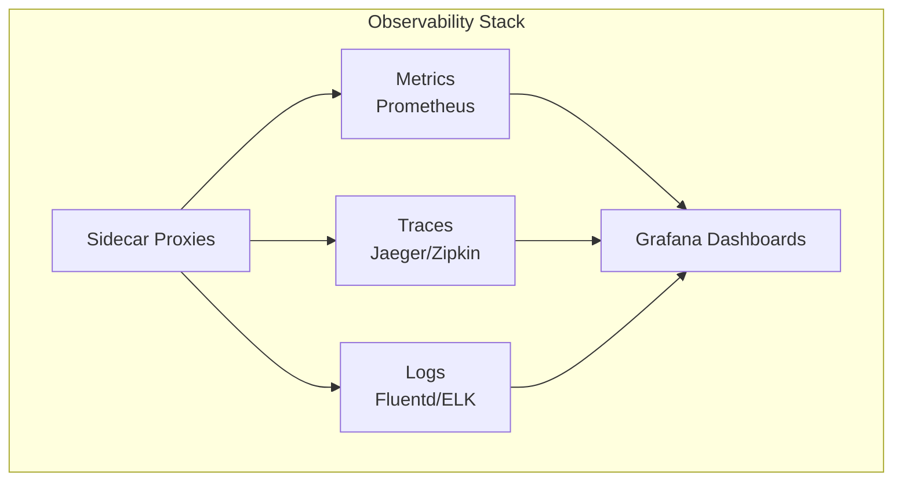

| Observability Type | Data Collected | Tools |
|--------------------|----------------|-------|
| **Metrics** | Request rate, latency, error rate (RED) | Prometheus, Grafana |
| **Distributed Tracing** | Request flow across services | Jaeger, Zipkin, Tempo |
| **Access Logs** | Detailed request/response logs | Fluentd, Loki, ELK |
| **Service Graph** | Visual service dependencies | Kiali, Grafana |

**Golden Signals Automatically Collected:**

| Signal | Metric | Description |
|--------|--------|-------------|
| **Latency** | `istio_request_duration_milliseconds` | Request duration histogram |
| **Traffic** | `istio_requests_total` | Request count by response code |
| **Errors** | `istio_requests_total{response_code=~"5.*"}` | 5xx error count |
| **Saturation** | Connection pool metrics | Resource utilization |

### 3.4 Resilience Patterns

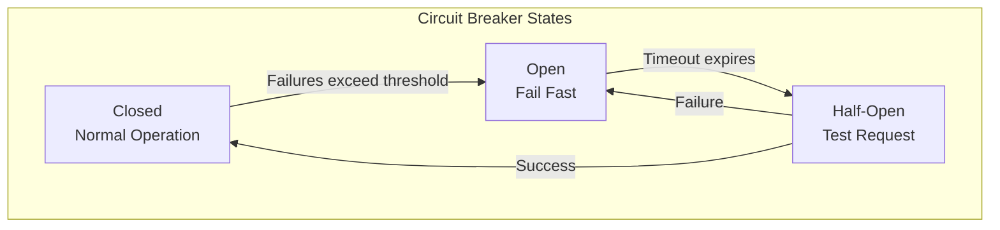

**Resilience Configuration Example:**

```yaml
apiVersion: networking.istio.io/v1beta1
kind: DestinationRule
metadata:
  name: reviews-resilience
spec:
  host: reviews
  trafficPolicy:
    connectionPool:
      tcp:
        maxConnections: 100
      http:
        h2UpgradePolicy: UPGRADE
        http1MaxPendingRequests: 100
        http2MaxRequests: 1000
    outlierDetection:
      consecutive5xxErrors: 5
      interval: 30s
      baseEjectionTime: 30s
      maxEjectionPercent: 50
    loadBalancer:
      simple: LEAST_CONN
```

---

## 4. Service Mesh Comparison

| Feature | Istio | Linkerd | Consul Connect | Cilium |
|---------|-------|---------|----------------|--------|
| **Proxy** | Envoy | Linkerd2-proxy (Rust) | Envoy | eBPF + Envoy |
| **Resource Usage** | Higher | Lower | Medium | Lowest (eBPF) |
| **Complexity** | High | Low | Medium | Medium |
| **mTLS** | ✅ Automatic | ✅ Automatic | ✅ Automatic | ✅ Automatic |
| **Traffic Management** | ✅ Advanced | ✅ Basic | ✅ Basic | ✅ Basic |
| **Multi-cluster** | ✅ Yes | ✅ Yes | ✅ Yes | ✅ Yes |
| **Protocol Support** | HTTP, gRPC, TCP | HTTP, gRPC, TCP | HTTP, gRPC, TCP | HTTP, gRPC, TCP |
| **Observability** | ✅ Comprehensive | ✅ Good | ✅ Good | ✅ Good |
| **Policy** | ✅ Advanced (OPA) | ✅ Basic | ✅ Intentions | ✅ Network Policy |
| **Learning Curve** | Steep | Gentle | Moderate | Moderate |
| **Best For** | Complex requirements | Simplicity, low overhead | HashiCorp ecosystem | Performance, eBPF |

---

## 5. When to Use Service Mesh

### Good Fit

| Scenario | Why Service Mesh Helps |
|----------|------------------------|
| **Many microservices (50+)** | Consistent networking without code changes |
| **Zero-trust security** | Automatic mTLS everywhere |
| **Compliance requirements** | Encryption, audit logging, access control |
| **Complex traffic routing** | Canary, A/B, traffic shifting |
| **Observability gaps** | Automatic metrics and tracing |
| **Multi-team/multi-language** | Language-agnostic networking |

### Poor Fit

| Scenario | Why |
|----------|-----|
| **Few services (<10)** | Overhead not justified |
| **Simple architectures** | Adds unnecessary complexity |
| **Non-Kubernetes** | Most meshes are K8s-native |
| **Latency-critical (sub-ms)** | Proxy adds ~1-3ms latency |
| **Resource-constrained** | Sidecars consume memory/CPU |

---

## 6. Service Mesh vs API Gateway

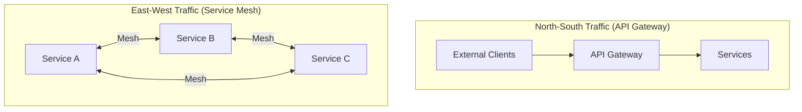

| Aspect | API Gateway | Service Mesh |
|--------|-------------|--------------|
| **Traffic Direction** | North-South (external → internal) | East-West (service → service) |
| **Scope** | Edge of network | Inside the cluster |
| **Primary Function** | External API exposure | Internal service communication |
| **Authentication** | External clients (OAuth, API keys) | Service identity (mTLS) |
| **Rate Limiting** | Per external client/API | Per service/endpoint |
| **Protocol** | Usually HTTP/HTTPS | HTTP, gRPC, TCP |
| **Deployment** | Centralized | Distributed (sidecars) |

**Combined Architecture:**

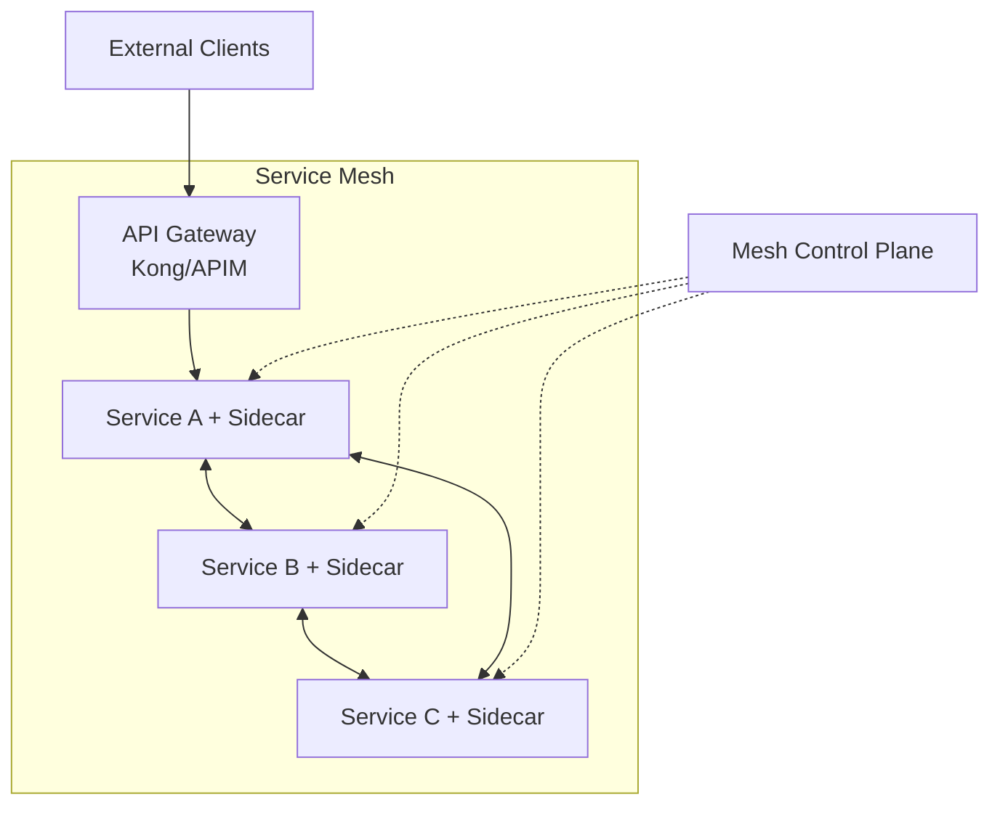

---

## 7. Kubernetes Internal Load Balancer vs Service Mesh

In Kubernetes environments, you have multiple options for handling internal service-to-service communication. Understanding when to use native Kubernetes networking (kube-proxy, Internal Load Balancer) versus a service mesh is crucial for making the right architectural decision.

### 7.1 Architecture Comparison

**Option 1: Kubernetes Native (kube-proxy + Internal Load Balancer)**

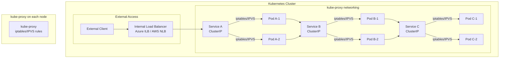

**Option 2: Service Mesh (Istio/Linkerd)**

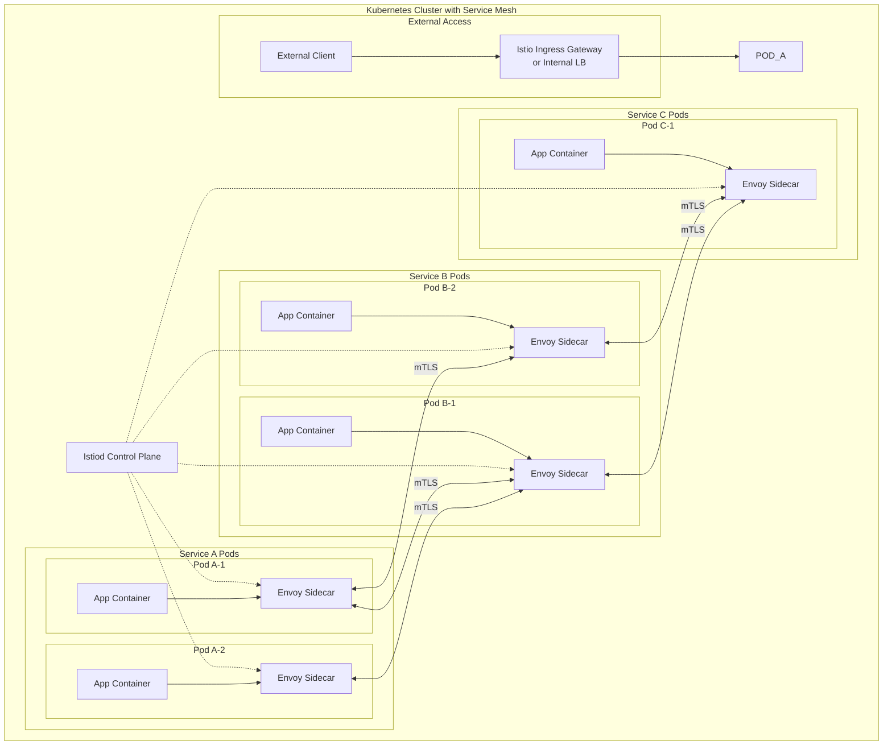

### 7.2 Traffic Flow Comparison

**Kubernetes Native Flow:**

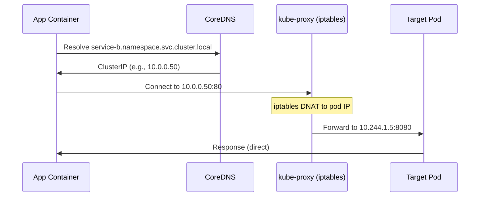

**Service Mesh Flow:**

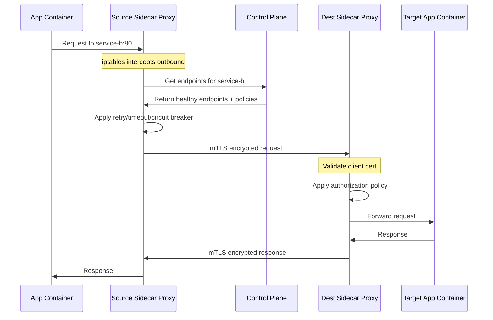

### 7.3 Detailed Comparison

| Aspect | Kubernetes Native (kube-proxy + ILB) | Service Mesh |
|--------|--------------------------------------|--------------|
| **Load Balancing Algorithm** | Random or round-robin (iptables), more options with IPVS | Round-robin, least connections, random, consistent hash, locality-aware |
| **Service Discovery** | DNS + kube-proxy iptables/IPVS rules | Control plane pushes endpoints to sidecars |
| **Health Checking** | Kubernetes readiness probes only | Application-level health checks + outlier detection |
| **Encryption** | ❌ None by default (plaintext) | ✅ Automatic mTLS |
| **Authentication** | ❌ None | ✅ Service identity via SPIFFE |
| **Authorization** | ❌ Network policies only (L3/L4) | ✅ L7 policies (paths, methods, headers) |
| **Retries** | ❌ Application must implement | ✅ Automatic with backoff |
| **Timeouts** | ❌ Application must implement | ✅ Configurable per-route |
| **Circuit Breaking** | ❌ Application must implement | ✅ Built-in outlier detection |
| **Rate Limiting** | ❌ Not available | ✅ Per-service/endpoint |
| **Traffic Splitting** | ❌ Not available | ✅ Canary, A/B, weighted routing |
| **Observability** | Basic metrics only | ✅ Full metrics, tracing, access logs |
| **Latency Overhead** | Minimal (~0.1ms) | Higher (~1-3ms per hop) |
| **Resource Overhead** | Low (kube-proxy per node) | High (sidecar per pod: ~50MB RAM, ~0.1 CPU) |
| **Complexity** | Low | High |
| **Debugging** | Simple (standard networking) | Complex (proxy logs, control plane) |

### 7.4 Resource Usage

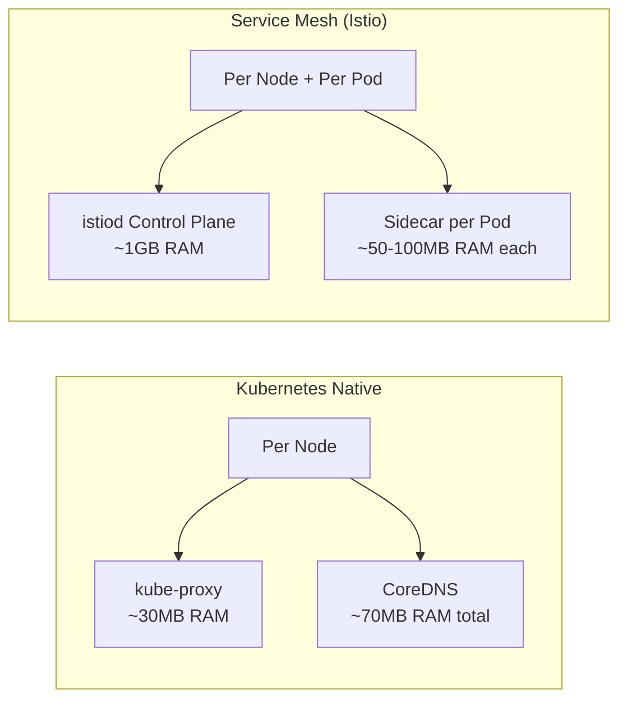

**Example: 100 Pods Cluster**

| Component | Kubernetes Native | Service Mesh (Istio) |
|-----------|-------------------|----------------------|
| **kube-proxy** | 3 nodes × 30MB = 90MB | 3 nodes × 30MB = 90MB |
| **CoreDNS** | 2 replicas × 70MB = 140MB | 2 replicas × 70MB = 140MB |
| **Control Plane** | - | 1GB (istiod) |
| **Sidecars** | - | 100 pods × 50MB = 5GB |
| **Total Overhead** | ~230MB | ~6.2GB |

### 7.5 Decision Guide

**Use Kubernetes Native (kube-proxy + Internal LB) When:**

| Scenario | Rationale |
|----------|-----------|
| **Simple service communication** | No advanced routing or security needs |
| **Trusted internal network** | mTLS not required |
| **Resource-constrained clusters** | Cannot afford sidecar overhead |
| **Low latency requirements** | Every millisecond matters |
| **Small number of services** | Complexity not justified |
| **Development/testing environments** | Keep it simple |

**Use Service Mesh When:**

| Scenario | Rationale |
|----------|-----------|
| **Zero-trust security model** | mTLS between all services |
| **Compliance requirements** | Audit logs, encryption, access control |
| **Complex microservices** | Many services with intricate communication |
| **Canary/Blue-green deployments** | Traffic splitting capabilities |
| **Multi-team environments** | Consistent policies across teams |
| **Observability is critical** | Need distributed tracing, detailed metrics |
| **Resilience patterns** | Automatic retries, circuit breaking |

### 7.6 Hybrid Approach

You can use both together - Kubernetes native for simple internal routing and service mesh for critical service paths:

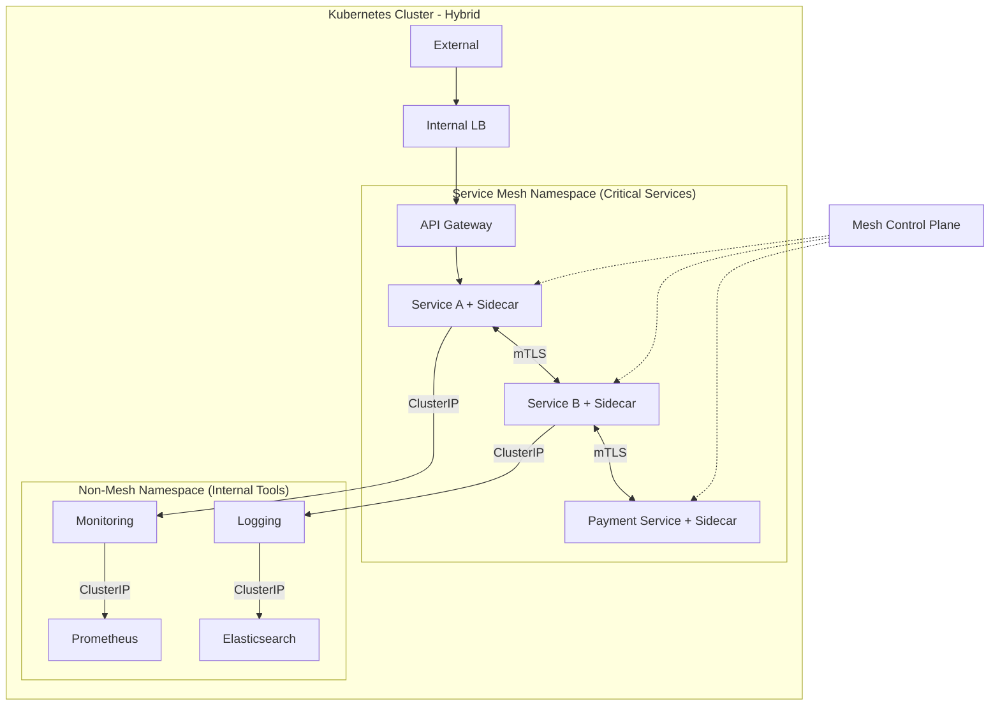

**Hybrid Strategy:**

| Service Type | Recommendation | Reason |
|--------------|----------------|--------|
| **Payment/Auth services** | Service Mesh | Security critical |
| **Customer-facing APIs** | Service Mesh | Observability, resilience |
| **Internal tools (monitoring, CI/CD)** | Kubernetes Native | Lower overhead |
| **Batch jobs** | Kubernetes Native | Short-lived, simple |
| **Databases** | Kubernetes Native | Performance sensitive |

### 7.7 Migration Path

If starting without service mesh and planning to add later:

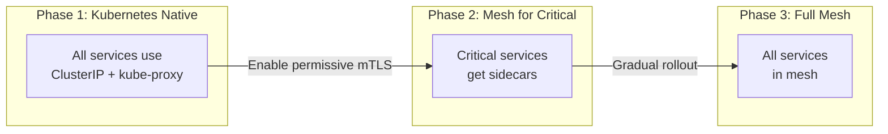

**Migration Steps:**

1. **Install mesh control plane** (no sidecars yet)
2. **Enable permissive mTLS** (accept both plain and mTLS)
3. **Inject sidecars** into critical namespaces first
4. **Validate** observability and functionality
5. **Gradually expand** to more namespaces
6. **Enable strict mTLS** once all services are in mesh

---

## 8. Service Mesh Technologies

### 8.1 Istio

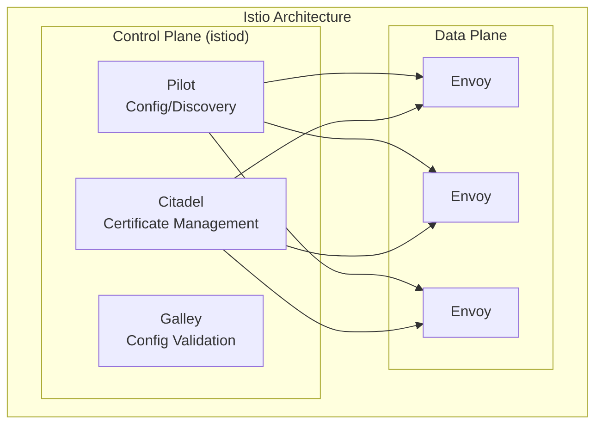

| Component | Purpose |
|-----------|---------|
| **istiod** | Unified control plane (Pilot + Citadel + Galley) |
| **Envoy Proxy** | High-performance L4/L7 proxy |
| **Ingress Gateway** | External traffic entry point |
| **Egress Gateway** | Control outbound traffic |

**Strengths:**
- Most feature-rich service mesh
- Advanced traffic management (VirtualService, DestinationRule)
- Comprehensive observability integration
- Strong community and ecosystem

**Considerations:**
- Higher resource usage
- Steeper learning curve
- Complex troubleshooting

### 8.2 Linkerd

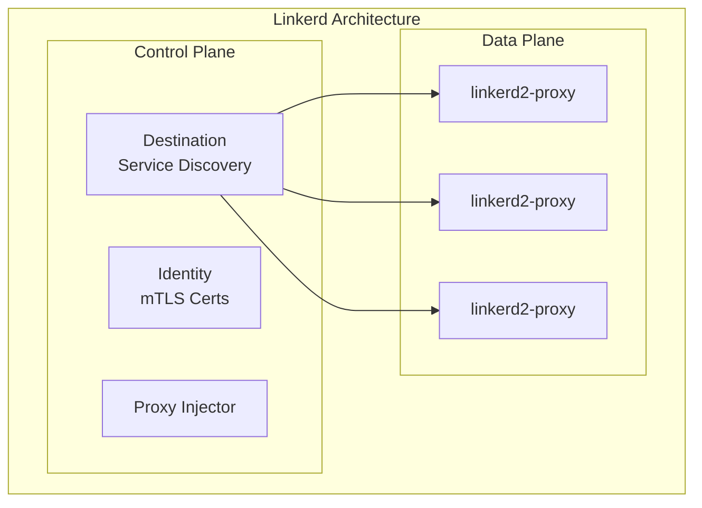

| Advantage | Description |
|-----------|-------------|
| **Lightweight** | Rust-based proxy, minimal resource usage |
| **Simple** | Easier to operate than Istio |
| **Fast** | Sub-millisecond latency overhead |
| **Secure by default** | mTLS enabled automatically |

**Strengths:**
- Minimal resource footprint
- Simple installation and operation
- Excellent performance
- Good for teams new to service mesh

**Considerations:**
- Fewer advanced features than Istio
- Smaller ecosystem

### 8.3 Cilium Service Mesh

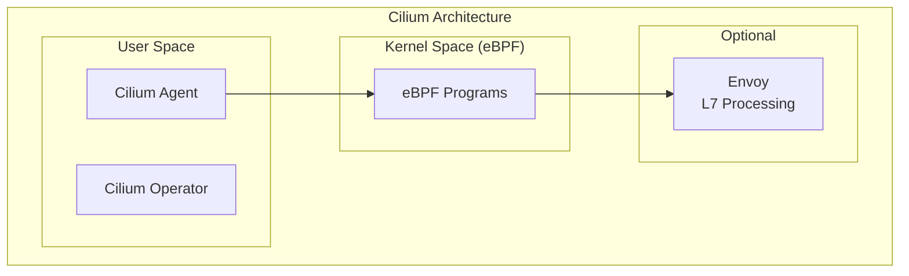

| Advantage | Description |
|-----------|-------------|
| **eBPF-based** | Kernel-level networking, bypasses sidecar for L3/L4 |
| **Performance** | Lower latency than sidecar-based meshes |
| **No sidecar (L4)** | L4 policies without sidecar overhead |
| **Hybrid** | Envoy sidecar only for L7 features |

**Strengths:**
- Best performance (eBPF)
- Network policy integration
- Reduced resource overhead
- Advanced networking features

**Considerations:**
- Requires recent Linux kernel
- Less mature L7 features
- Different operational model

---

## Related Topics

- [Proxy and Load Balancing Architecture](./proxy-load-balancing-architecture.md) - Complete proxy and LB patterns
- [Hub-Spoke Network Architecture](./hub_spoke_network_architecture.md) - Network topology patterns
- [API Architecture Overview](../../03-integration-communication-architecture/api-architecture/api-architecture-overview.md) - API design and gateway patterns
- [Network Security Architecture](../../06-security-architecture/6.3-network-security-architecture.md) - Security controls
