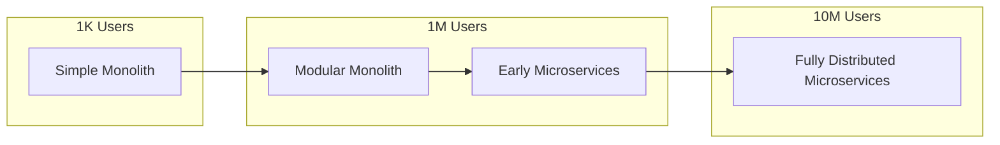
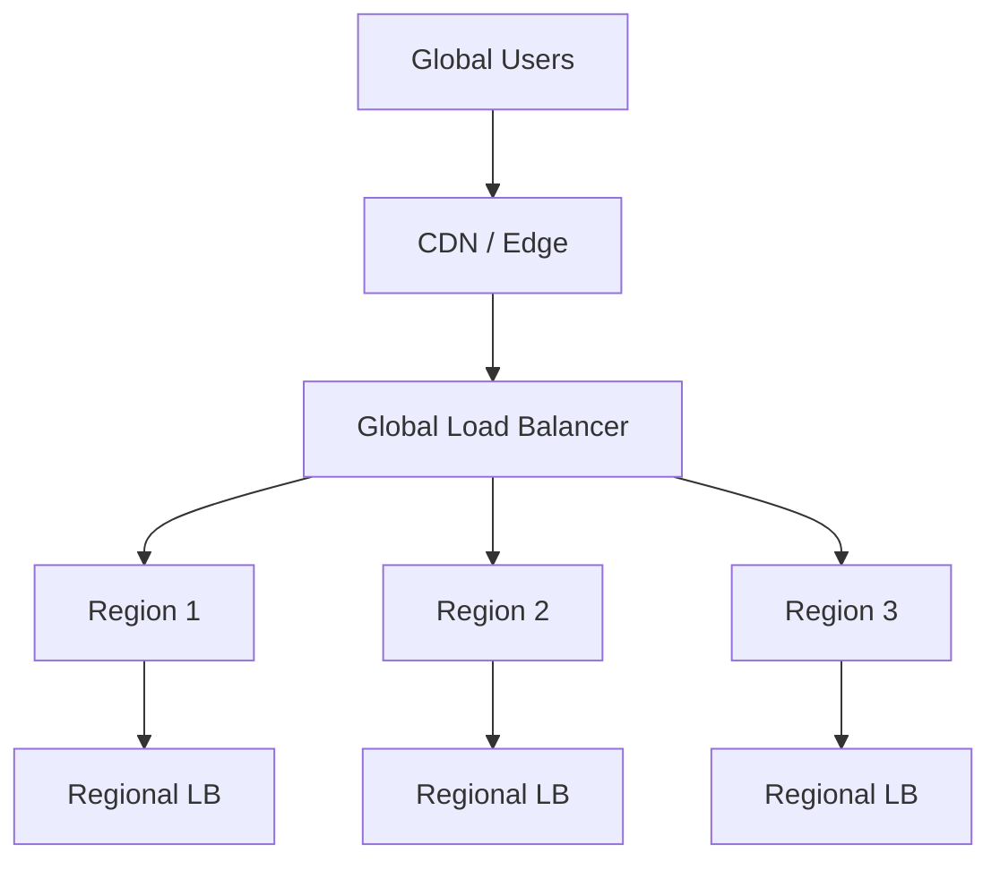
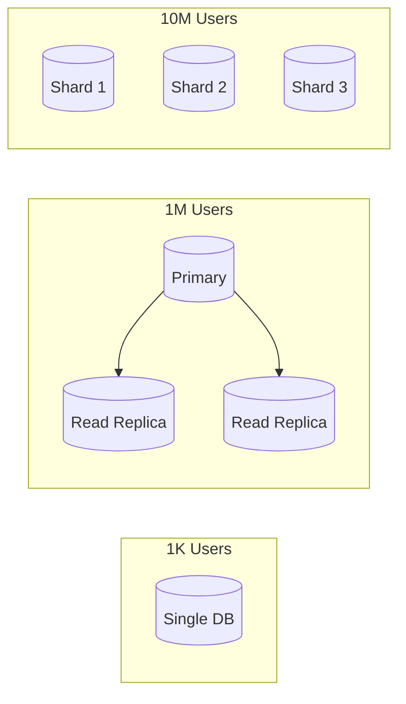
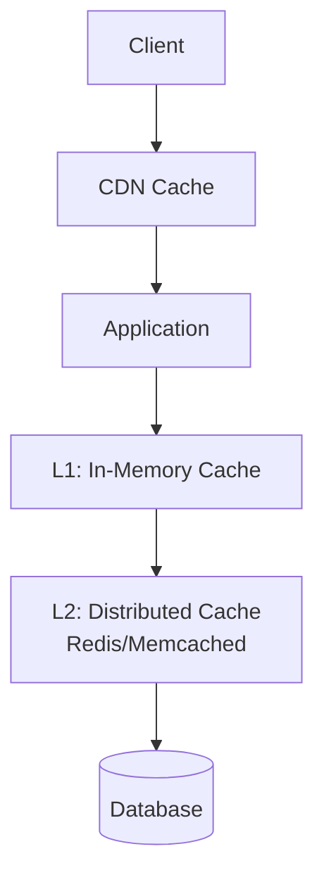
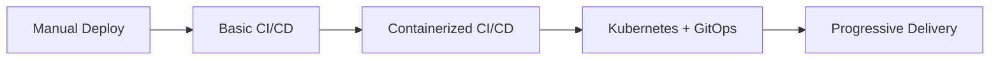
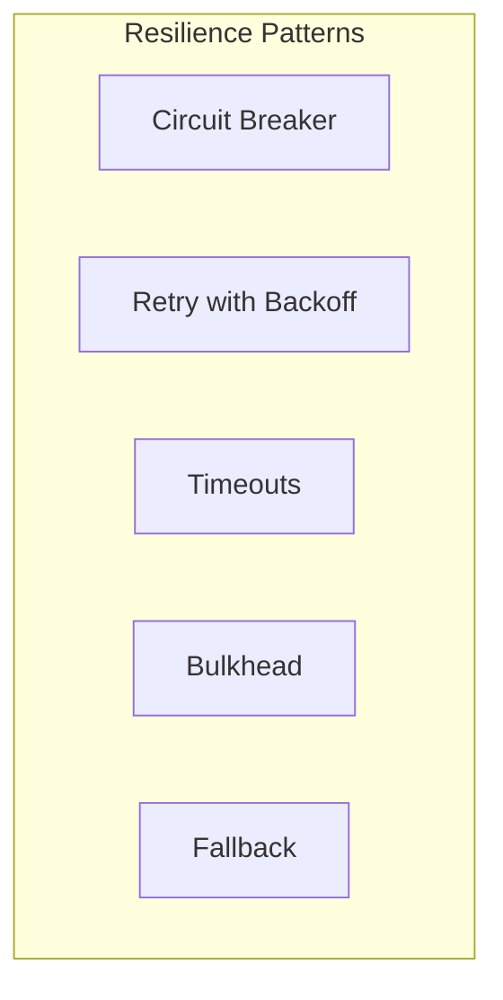
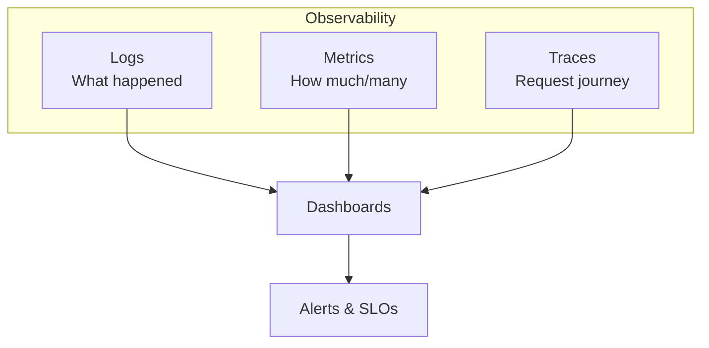
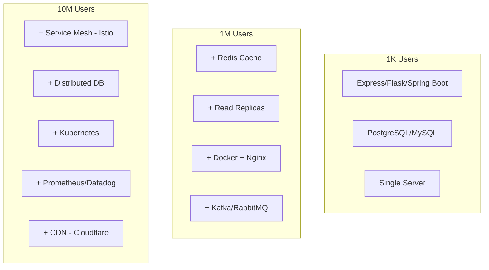

# System Design at Scale: 1K vs 1M vs 10M Users

## Overview

This document outlines how system architecture evolves as your user base grows from a small MVP (1K users) to a scaling product (1M users) to enterprise-scale (10M users). Each scale requires different approaches across multiple architectural dimensions.

## Evolution Summary

| Scale | Stage | Primary Focus |
|-------|-------|---------------|
| **1K Users** | Early Stage / MVP | Validate idea quickly, ship features fast with minimal complexity |
| **1M Users** | Scaling Stage | Scale reliably without frequent outages or performance issues |
| **10M Users** | Large-Scale / Enterprise | Ensure high availability, reliability, and consistent performance at massive scale |

---

## 1. Primary Goal

| Scale | Goal |
|-------|------|
| **1K Users** | Validate the idea quickly and ship features fast with minimal complexity |
| **1M Users** | Scale the system reliably without frequent outages or performance issues |
| **10M Users** | Ensure high availability, reliability, and consistent performance at massive scale |

---

## 2. Architecture Style



| Scale | Approach |
|-------|----------|
| **1K Users** | Simple monolith or layered architecture to reduce overhead and speed up development |
| **1M Users** | Modular monolith or early microservices to isolate critical components |
| **10M Users** | Fully distributed microservices designed around clear domain boundaries |

### Key Considerations
- **1K**: Keep it simple - a well-structured monolith is easier to maintain and deploy
- **1M**: Start identifying bottlenecks and extract critical services
- **10M**: Embrace Domain-Driven Design (DDD) with bounded contexts

---

## 3. API Design

| Scale | Approach |
|-------|----------|
| **1K Users** | Basic REST APIs with minimal validation and simple request flows |
| **1M Users** | Versioned APIs with pagination, rate limits, and backward compatibility |
| **10M Users** | API Gateway-managed APIs using REST + gRPC with strict contracts and governance |

### Evolution Path
```
Basic REST → Versioned REST with Rate Limiting → API Gateway + gRPC + Contract Testing
```

### Best Practices at Scale
- **Rate Limiting**: Protect backend services from abuse
- **API Versioning**: Allow gradual client migration
- **Contract Testing**: Ensure API compatibility across services
- **gRPC**: Use for internal service-to-service communication for performance

---

## 4. Traffic Handling

| Scale | Approach |
|-------|----------|
| **1K Users** | Direct client-to-server communication with predictable traffic patterns |
| **1M Users** | Load balancers distribute traffic across multiple service instances |
| **10M Users** | Global traffic routing with multi-region support and intelligent failover |

### Architecture at 10M Scale


---

## 5. Backend Scalability

| Scale | Approach |
|-------|----------|
| **1K Users** | Vertical scaling by increasing server size when needed |
| **1M Users** | Horizontal scaling with multiple service instances behind load balancers |
| **10M Users** | Auto-scaling groups and region-aware scaling policies |

### Scaling Strategies
- **Vertical Scaling**: Increase CPU, RAM, storage (limited ceiling)
- **Horizontal Scaling**: Add more instances (preferred for cloud)
- **Auto-scaling**: Automatically adjust capacity based on metrics

---

## 6. Database Design

| Scale | Approach |
|-------|----------|
| **1K Users** | Single relational database with normalized schema and simple queries |
| **1M Users** | Read replicas introduced to handle growing read traffic |
| **10M Users** | Sharded or distributed databases with domain-owned data stores |

### Database Evolution


### Patterns for Scale
- **Read Replicas**: Offload read traffic from primary
- **Sharding**: Partition data across multiple databases
- **CQRS**: Separate read and write models
- **Polyglot Persistence**: Use different databases for different use cases

---

## 7. Caching Strategy

| Scale | Approach |
|-------|----------|
| **1K Users** | Little to no caching; rely mainly on database queries |
| **1M Users** | Introduce distributed caching to reduce database load significantly |
| **10M Users** | Multi-layer caching using in-memory cache, distributed cache, and CDN |

### Caching Layers at Scale


### Cache Strategies
- **Cache-Aside**: Application manages cache explicitly
- **Write-Through**: Writes go to cache and database synchronously
- **Write-Behind**: Writes go to cache, then asynchronously to database
- **TTL-based Expiration**: Time-based cache invalidation

---

## 8. Asynchronous Processing

| Scale | Approach |
|-------|----------|
| **1K Users** | Mostly synchronous request-response flows for simplicity |
| **1M Users** | Background jobs and queues used for non-critical tasks |
| **10M Users** | Event-driven architecture with streams handling high-throughput workloads |

### Evolution of Processing Models
```
Synchronous → Background Jobs → Event-Driven Streams
```

### Use Cases for Async Processing
- Email/notification sending
- Report generation
- Data processing and ETL
- Third-party API integrations
- Audit logging

---

## 9. Messaging & Queues

| Scale | Approach |
|-------|----------|
| **1K Users** | Often skipped or minimally used at this stage |
| **1M Users** | Queues introduced for retries, delays, and async workflows |
| **10M Users** | Event streaming platforms handle millions of events reliably |

### Messaging Technologies by Scale
| Scale | Technologies |
|-------|--------------|
| **1K** | In-process queues, simple job schedulers |
| **1M** | RabbitMQ, Amazon SQS, Azure Service Bus |
| **10M** | Apache Kafka, Amazon Kinesis, Azure Event Hubs |

---

## 10. Deployment Strategy

| Scale | Approach |
|-------|----------|
| **1K Users** | Manual deployments or basic CI/CD pipelines |
| **1M Users** | Containerized deployments with automated CI/CD pipelines |
| **10M Users** | Kubernetes-based orchestration with progressive delivery strategies |

### Deployment Evolution


### Progressive Delivery Strategies
- **Blue-Green Deployment**: Zero-downtime deployments
- **Canary Releases**: Gradual rollout to subset of users
- **Feature Flags**: Control feature availability dynamically
- **A/B Testing**: Data-driven feature decisions

---

## 11. Fault Tolerance

| Scale | Approach |
|-------|----------|
| **1K Users** | Failures are mostly handled manually and tolerated occasionally |
| **1M Users** | Retries and timeouts reduce impact of partial failures |
| **10M Users** | Circuit breakers, graceful degradation, and self-healing systems |

### Resilience Patterns


### Implementation Guidelines
- **Circuit Breaker**: Prevent cascade failures
- **Retry with Exponential Backoff**: Handle transient failures
- **Timeouts**: Fail fast instead of hanging
- **Bulkhead**: Isolate failures to components
- **Fallback**: Provide degraded but functional experience

---

## 12. Observability

| Scale | Approach |
|-------|----------|
| **1K Users** | Logging is the primary way to debug issues |
| **1M Users** | Metrics and basic alerts added to detect problems early |
| **10M Users** | Full observability with logs, metrics, traces, and SLO-based alerts |

### Three Pillars of Observability


### Key Metrics to Track
- **Latency**: Response time percentiles (p50, p95, p99)
- **Traffic**: Requests per second
- **Errors**: Error rate and types
- **Saturation**: Resource utilization

---

## 13. Security Approach

| Scale | Approach |
|-------|----------|
| **1K Users** | Basic authentication and minimal access controls |
| **1M Users** | Token-based authentication and role-based access control |
| **10M Users** | Zero-trust security, IAM-based access, secret rotation, and audits |

### Security Evolution
```
Basic Auth → JWT/OAuth + RBAC → Zero Trust + Secret Management + Compliance
```

### Security Best Practices at Scale
- **Zero Trust**: Never trust, always verify
- **Least Privilege**: Minimal necessary permissions
- **Secret Management**: Vault-based secret storage
- **Audit Logging**: Track all access and changes
- **Compliance**: SOC 2, GDPR, HIPAA as needed

---

## 14. Data Consistency

| Scale | Approach |
|-------|----------|
| **1K Users** | Strong consistency is preferred for simplicity |
| **1M Users** | Mix of strong and eventual consistency depending on use case |
| **10M Users** | Eventual consistency embraced where availability and scale matter more |

### CAP Theorem Considerations
- **1K**: CP (Consistency + Partition Tolerance) is acceptable
- **10M**: AP (Availability + Partition Tolerance) often preferred

### Consistency Patterns
- **Strong**: ACID transactions, single database
- **Eventual**: Event sourcing, CQRS, distributed systems
- **Saga Pattern**: Distributed transactions across services

---

## 15. Core Tools Used

| Scale | Tools & Technologies |
|-------|----------------------|
| **1K Users** | Lightweight frameworks and managed services to move fast. **Examples**: Express, Flask, Spring Boot, PostgreSQL |
| **1M Users** | Scalable infrastructure and reliability-focused tooling. **Examples**: Redis, Nginx, Kafka, Docker, AWS/GCP |
| **10M Users** | Enterprise-grade platforms for scale, resilience, and observability. **Examples**: Kubernetes, Istio, Prometheus, Datadog, Cloudflare |

### Technology Stack Evolution



---

## Quick Reference Matrix

| # | Aspect | 1K Users | 1M Users | 10M Users |
|---|--------|----------|----------|-----------|
| 1 | Primary Goal | Ship fast, validate | Scale reliably | High availability |
| 2 | Architecture | Monolith | Modular/Early microservices | Distributed microservices |
| 3 | API Design | Basic REST | Versioned + Rate limits | API Gateway + gRPC |
| 4 | Traffic | Direct | Load balanced | Global routing |
| 5 | Scalability | Vertical | Horizontal | Auto-scaling |
| 6 | Database | Single DB | Read replicas | Sharded/Distributed |
| 7 | Caching | Minimal | Distributed cache | Multi-layer caching |
| 8 | Async Processing | Synchronous | Background jobs | Event-driven streams |
| 9 | Messaging | None/Minimal | Queues | Event streaming |
| 10 | Deployment | Manual/Basic CI | Containerized CI/CD | Kubernetes + GitOps |
| 11 | Fault Tolerance | Manual handling | Retries + Timeouts | Circuit breakers + Self-healing |
| 12 | Observability | Logging | Metrics + Alerts | Full observability + SLOs |
| 13 | Security | Basic auth | Token + RBAC | Zero trust + IAM |
| 14 | Consistency | Strong | Mixed | Eventual |
| 15 | Core Tools | Express, PostgreSQL | Redis, Nginx, Kafka, Docker | Kubernetes, Istio, Prometheus |

---

## Key Takeaways

1. **Don't over-engineer early**: Start simple and evolve as needed
2. **Identify bottlenecks**: Scale based on actual constraints, not assumptions
3. **Embrace trade-offs**: Understand CAP theorem and make intentional decisions
4. **Invest in observability early**: You can't fix what you can't see
5. **Automate everything**: Manual processes don't scale
6. **Plan for failure**: Build resilience into the system from the start

---

## Related Documentation

- [Cloud Migration Strategies](cloud-migration/)
- [Networking Patterns](networking/)
- [Reliability & Performance](../07-reliability-performance-operations/)
- [DevOps & Delivery](../08-devops-delivery-runtime-architecture/)

---

## References

- Original infographic by Shalini Goyal
- [The Twelve-Factor App](https://12factor.net/)
- [Martin Fowler - Microservices](https://martinfowler.com/articles/microservices.html)
- [Google SRE Book](https://sre.google/sre-book/table-of-contents/)
