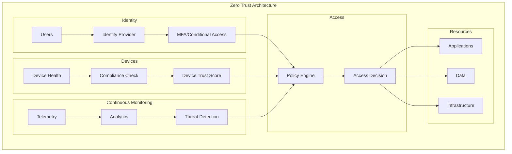
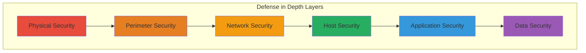
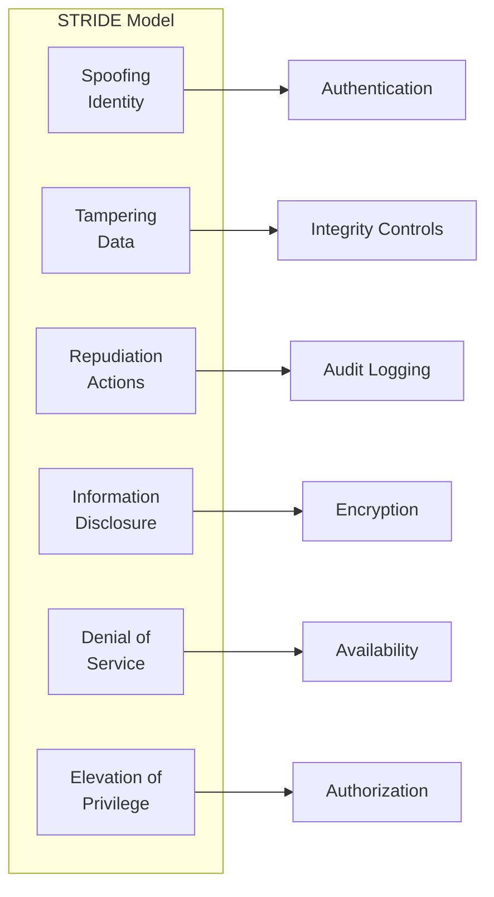
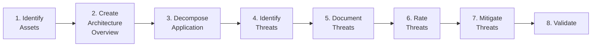
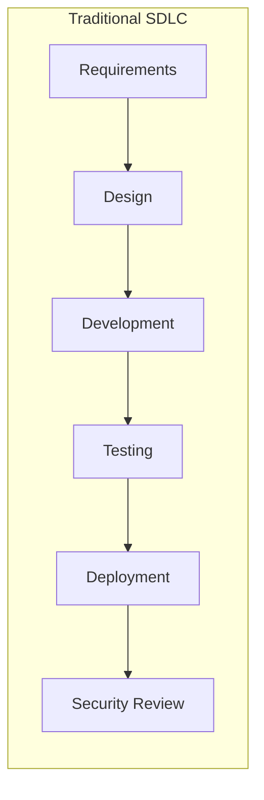
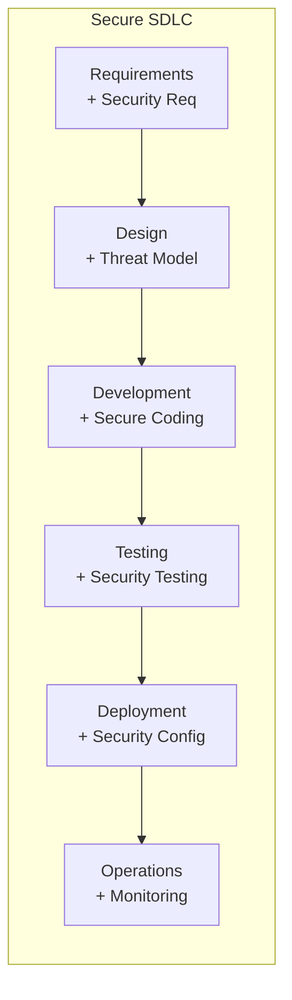
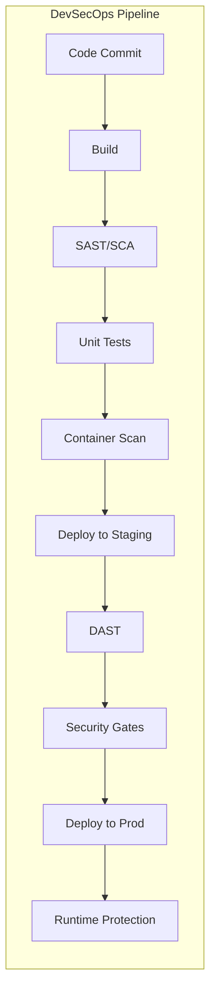

# 6.1 Security Architecture

## Overview

Security Architecture is a unified security design that addresses the necessities and potential risks involved in a certain scenario or environment. It specifies when and where to apply security controls. The design process is generally reproducible.

Security architecture encompasses the overall strategy and principles that guide security decisions across an organization's systems, applications, and infrastructure.

## Table of Contents

- [Zero Trust Architecture](#zero-trust-architecture)
- [Defense in Depth](#defense-in-depth)
- [Threat Modeling Architecture](#threat-modeling-architecture)
- [Secure SDLC Architecture](#secure-sdlc-architecture)
- [Best Practices](#best-practices)
- [Related Resources](#related-resources)

---

## Zero Trust Architecture

### Concept

Zero Trust is a security model based on the principle of "never trust, always verify." Unlike traditional perimeter-based security, Zero Trust assumes that threats exist both inside and outside the network.

### Core Principles

```
┌─────────────────────────────────────────────────────────────────┐
│                    ZERO TRUST PRINCIPLES                        │
├─────────────────────────────────────────────────────────────────┤
│  1. Verify Explicitly     │  Always authenticate and authorize  │
│                           │  based on all available data points │
├───────────────────────────┼─────────────────────────────────────┤
│  2. Least Privilege       │  Limit access with Just-In-Time     │
│     Access                │  and Just-Enough-Access (JIT/JEA)   │
├───────────────────────────┼─────────────────────────────────────┤
│  3. Assume Breach         │  Minimize blast radius, segment     │
│                           │  access, verify end-to-end          │
└─────────────────────────────────────────────────────────────────┘
```

### Zero Trust Architecture Components



### Key Pillars of Zero Trust

| Pillar | Description | Implementation |
|--------|-------------|----------------|
| **Identity** | Strong authentication for all users | MFA, passwordless, conditional access |
| **Devices** | Validate device health and compliance | MDM, endpoint protection, attestation |
| **Network** | Segment and encrypt all traffic | Micro-segmentation, encryption in transit |
| **Applications** | Secure application access | SSO, app proxies, CASB |
| **Data** | Classify and protect sensitive data | DLP, encryption, rights management |
| **Infrastructure** | Secure and monitor infrastructure | JIT access, vulnerability management |

### Implementation Steps

1. **Identify sensitive data and assets**
   - Classify data by sensitivity
   - Map data flows and access patterns

2. **Map transaction flows**
   - Document how users access resources
   - Identify all entry points

3. **Architect Zero Trust network**
   - Implement micro-segmentation
   - Deploy identity-aware proxies

4. **Create Zero Trust policies**
   - Define access policies based on context
   - Implement continuous verification

5. **Monitor and maintain**
   - Collect and analyze telemetry
   - Continuously update policies

---

## Defense in Depth

### Concept

Defense in Depth (DiD) is a layered security strategy that employs multiple security controls throughout an IT system. If one layer fails, another layer is in place to prevent a breach.

### The Layered Security Model



### Security Layers Detailed

```
┌─────────────────────────────────────────────────────────────────────────┐
│                         PHYSICAL SECURITY                                │
│  Data center access, locks, surveillance, environmental controls        │
├─────────────────────────────────────────────────────────────────────────┤
│                         PERIMETER SECURITY                               │
│  Firewalls, DMZ, VPN gateways, DDoS protection                         │
├─────────────────────────────────────────────────────────────────────────┤
│                         NETWORK SECURITY                                 │
│  Network segmentation, IDS/IPS, traffic encryption                      │
├─────────────────────────────────────────────────────────────────────────┤
│                         HOST SECURITY                                    │
│  OS hardening, patch management, endpoint protection                    │
├─────────────────────────────────────────────────────────────────────────┤
│                         APPLICATION SECURITY                             │
│  Secure coding, input validation, authentication                        │
├─────────────────────────────────────────────────────────────────────────┤
│                         DATA SECURITY                                    │
│  Encryption, access controls, data classification                       │
└─────────────────────────────────────────────────────────────────────────┘
```

### Layer-by-Layer Controls

| Layer | Security Controls | Example Technologies |
|-------|-------------------|---------------------|
| **Physical** | Access control, surveillance | Biometrics, CCTV, security guards |
| **Perimeter** | Border protection | Firewalls, WAF, DDoS mitigation |
| **Network** | Traffic control, segmentation | VLANs, NSGs, micro-segmentation |
| **Host** | Endpoint protection | Antivirus, EDR, host firewall |
| **Application** | Secure development | SAST, DAST, code review |
| **Data** | Data protection | Encryption, DLP, RBAC |

### Benefits of Defense in Depth

1. **Redundancy** - Multiple layers provide backup protection
2. **Comprehensive Coverage** - Addresses various attack vectors
3. **Increased Time** - Gives defenders more time to respond
4. **Compliance** - Satisfies regulatory requirements
5. **Risk Mitigation** - Reduces overall risk exposure

---

## Threat Modeling Architecture

### Concept

Threat Modeling is a structured approach for identifying, quantifying, and addressing the security risks associated with an application or system. It helps teams systematically identify potential threats before they become vulnerabilities.

### Common Threat Modeling Methodologies

```
┌─────────────────────────────────────────────────────────────────┐
│              THREAT MODELING METHODOLOGIES                       │
├────────────────┬────────────────────────────────────────────────┤
│   STRIDE       │  Spoofing, Tampering, Repudiation,            │
│                │  Information Disclosure, DoS, Elevation       │
├────────────────┼────────────────────────────────────────────────┤
│   PASTA        │  Process for Attack Simulation and            │
│                │  Threat Analysis (risk-centric)               │
├────────────────┼────────────────────────────────────────────────┤
│   VAST         │  Visual, Agile, Simple Threat modeling        │
│                │  (scalable for agile)                         │
├────────────────┼────────────────────────────────────────────────┤
│   DREAD        │  Damage, Reproducibility, Exploitability,     │
│                │  Affected Users, Discoverability              │
└────────────────┴────────────────────────────────────────────────┘
```

### STRIDE Threat Categories



### STRIDE Detailed

| Threat | Description | Security Property | Mitigation |
|--------|-------------|-------------------|------------|
| **Spoofing** | Pretending to be someone else | Authentication | Strong auth, MFA |
| **Tampering** | Modifying data or code | Integrity | Checksums, signing |
| **Repudiation** | Denying actions taken | Non-repudiation | Audit logs, signing |
| **Information Disclosure** | Exposing information | Confidentiality | Encryption, access control |
| **Denial of Service** | Making service unavailable | Availability | Rate limiting, redundancy |
| **Elevation of Privilege** | Gaining unauthorized access | Authorization | RBAC, least privilege |

### Threat Modeling Process



### Data Flow Diagram (DFD) Elements

| Symbol | Name | Description |
|--------|------|-------------|
| ○ | Process | Code that transforms data |
| ═ | Data Flow | Movement of data |
| ═══ | Data Store | Persistent storage |
| □ | External Entity | Outside the system boundary |
| ---- | Trust Boundary | Separation of trust levels |

### Threat Modeling Best Practices

1. **Start Early** - Begin threat modeling during design phase
2. **Iterate** - Update threat model as the system evolves
3. **Collaborate** - Include developers, architects, and security
4. **Document** - Keep detailed records of threats and mitigations
5. **Prioritize** - Focus on high-risk threats first
6. **Automate** - Use tools to assist in threat identification

---

## Secure SDLC Architecture

### Concept

Secure Software Development Lifecycle (SSDLC) integrates security practices into every phase of software development. It shifts security "left" in the development process, catching vulnerabilities early when they are cheaper to fix.

### Traditional SDLC vs Secure SDLC





### SSDLC Phases and Security Activities

```
┌─────────────────────────────────────────────────────────────────────────┐
│                    SECURE SDLC PHASES                                    │
├─────────────────┬───────────────────────────────────────────────────────┤
│ Requirements    │ • Security requirements gathering                      │
│                 │ • Risk assessment                                      │
│                 │ • Compliance requirements                              │
├─────────────────┼───────────────────────────────────────────────────────┤
│ Design          │ • Threat modeling                                      │
│                 │ • Security architecture review                         │
│                 │ • Attack surface analysis                              │
├─────────────────┼───────────────────────────────────────────────────────┤
│ Development     │ • Secure coding standards                              │
│                 │ • Code review                                          │
│                 │ • Static analysis (SAST)                               │
├─────────────────┼───────────────────────────────────────────────────────┤
│ Testing         │ • Dynamic analysis (DAST)                              │
│                 │ • Penetration testing                                  │
│                 │ • Vulnerability scanning                               │
├─────────────────┼───────────────────────────────────────────────────────┤
│ Deployment      │ • Security configuration                               │
│                 │ • Environment hardening                                │
│                 │ • Final security review                                │
├─────────────────┼───────────────────────────────────────────────────────┤
│ Operations      │ • Continuous monitoring                                │
│                 │ • Incident response                                    │
│                 │ • Patch management                                     │
└─────────────────┴───────────────────────────────────────────────────────┘
```

### Security Testing Types

| Testing Type | Phase | Description | Tools |
|-------------|-------|-------------|-------|
| **SAST** | Development | Static code analysis | SonarQube, Checkmarx, Fortify |
| **DAST** | Testing | Dynamic application testing | OWASP ZAP, Burp Suite |
| **IAST** | Testing | Interactive testing | Contrast Security |
| **SCA** | Development | Software composition analysis | Snyk, Dependabot |
| **Penetration Testing** | Pre-deployment | Manual security testing | Manual + automated tools |

### DevSecOps Integration



### Security Gates

Security gates are checkpoints that must be passed before code moves to the next phase:

1. **Pre-commit**
   - Secrets scanning
   - Linting for security issues

2. **Build**
   - SAST scan passes
   - No critical vulnerabilities in dependencies

3. **Pre-deployment**
   - DAST scan complete
   - Penetration test findings addressed

4. **Production**
   - Security configuration verified
   - Monitoring enabled

---

## Best Practices

### General Security Architecture Principles

1. **Least Privilege** - Grant minimum necessary permissions
2. **Separation of Duties** - Divide critical functions among multiple people
3. **Defense in Depth** - Implement multiple layers of security
4. **Fail Secure** - Systems should fail to a secure state
5. **Keep It Simple** - Complexity is the enemy of security
6. **Trust But Verify** - Always validate inputs and outputs

### Security Architecture Checklist

- [ ] Identity and access management defined
- [ ] Data classification completed
- [ ] Encryption strategy documented
- [ ] Network segmentation planned
- [ ] Logging and monitoring in place
- [ ] Incident response plan created
- [ ] Security testing integrated in SDLC
- [ ] Compliance requirements mapped
- [ ] Third-party risk assessed
- [ ] Security training provided

### Common Security Architecture Patterns

| Pattern | Use Case | Benefits |
|---------|----------|----------|
| **Gateway Pattern** | API protection | Centralized security, rate limiting |
| **Sidecar Pattern** | Service mesh security | Decoupled security, easy updates |
| **Vault Pattern** | Secrets management | Centralized secrets, rotation |
| **Circuit Breaker** | Resilience | Prevents cascade failures |
| **Token Relay** | Identity propagation | Secure identity across services |

---

## Related Resources

### Internal References

- [Authentication Methods Overview](./authentication-methods-overview.md)
- [Identity Architecture](./6.2-identity-architecture.md) (Coming Soon)
- [Network Security Architecture](./6.3-network-security-architecture.md) (Coming Soon)
- [Data Security Architecture](./6.4-data-security-architecture.md) (Coming Soon)

### Azure-Specific Implementation

- [Azure Security Overview](../../architecture-azure/security/)
- [Azure Identity](../../architecture-azure/security/azure_identity_overview.md)

### External References

- [NIST Cybersecurity Framework](https://www.nist.gov/cyberframework)
- [OWASP Security Guidelines](https://owasp.org/)
- [CIS Controls](https://www.cisecurity.org/controls)
- [Microsoft Security Development Lifecycle](https://www.microsoft.com/en-us/securityengineering/sdl)

---

*Last Updated: December 2024*

