# 6.2 Identity Architecture

## Overview

Identity Architecture defines the framework for managing digital identities, authentication, authorization, and access control across an organization's systems. It establishes how users, services, and devices are identified, verified, and granted appropriate access to resources.

Modern identity architecture is the cornerstone of security, enabling organizations to implement Zero Trust principles while providing seamless user experiences.

## Table of Contents

- [Core Identity Concepts](#core-identity-concepts)
- [Identity Providers (IdP)](#identity-providers-idp)
- [Authentication Architecture](#authentication-architecture)
- [Authorization Architecture](#authorization-architecture)
- [Federation Architecture](#federation-architecture)
- [Managed Identity Architecture](#managed-identity-architecture)
- [Identity Lifecycle Management](#identity-lifecycle-management)
- [Identity Governance](#identity-governance)
- [Best Practices](#best-practices)
- [Related Resources](#related-resources)

---

## Core Identity Concepts

### What is Digital Identity?

A digital identity is the collection of attributes and credentials that represent an entity (user, service, or device) in a digital system.

```
┌─────────────────────────────────────────────────────────────────┐
│                     DIGITAL IDENTITY                            │
├─────────────────────────────────────────────────────────────────┤
│  Component          │  Description                              │
├─────────────────────┼───────────────────────────────────────────┤
│  Identifier         │  Unique value (username, email, UUID)     │
├─────────────────────┼───────────────────────────────────────────┤
│  Attributes         │  Properties (name, role, department)      │
├─────────────────────┼───────────────────────────────────────────┤
│  Credentials        │  Proof of identity (password, cert, key)  │
├─────────────────────┼───────────────────────────────────────────┤
│  Entitlements       │  Permissions and access rights            │
└─────────────────────────────────────────────────────────────────┘
```

### Identity Types

| Identity Type | Description | Examples |
|---------------|-------------|----------|
| **Human Identity** | Real users accessing systems | Employees, contractors, customers |
| **Service Identity** | Applications and services | APIs, microservices, background jobs |
| **Device Identity** | Hardware and IoT devices | Laptops, phones, sensors |
| **Workload Identity** | Cloud workloads and containers | VMs, containers, serverless functions |

### Identity Architecture Layers

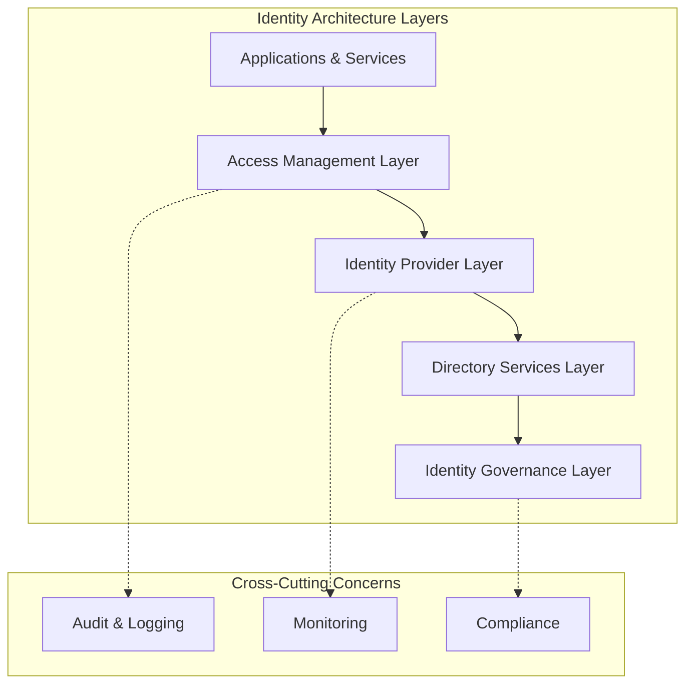

---

## Identity Providers (IdP)

### Role of Identity Providers

An Identity Provider (IdP) is a trusted system that creates, maintains, and manages identity information while providing authentication services to relying applications.

### IdP Architecture Pattern

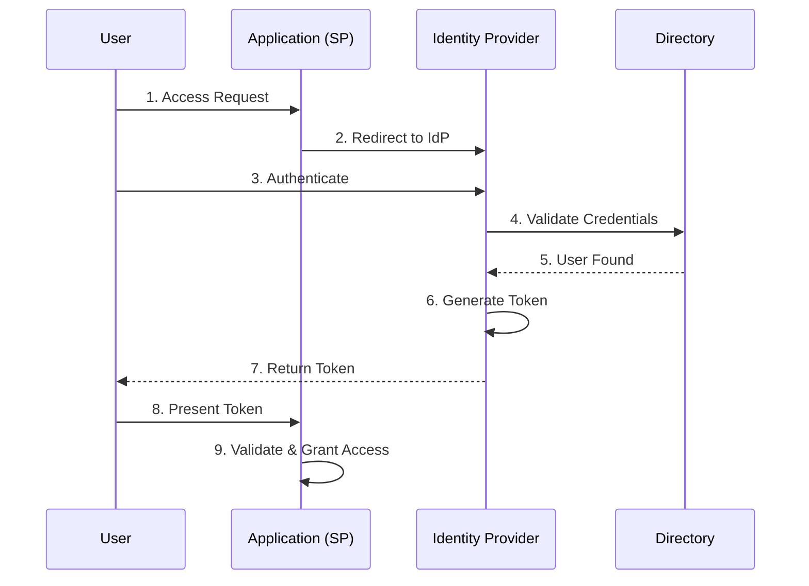

### Common Identity Providers

| Provider Type | Use Case | Examples |
|---------------|----------|----------|
| **Enterprise IdP** | Internal workforce | Azure AD, Okta, Ping Identity |
| **Social IdP** | Consumer applications | Google, Facebook, Apple |
| **Government IdP** | Civic services | Login.gov, GOV.UK Verify |
| **Custom IdP** | Specialized needs | Self-hosted Keycloak, IdentityServer |

### IdP Selection Criteria

1. **Protocol Support**: OAuth 2.0, OIDC, SAML 2.0, WS-Federation
2. **Scalability**: User volume and geographic distribution
3. **Integration**: APIs, SDKs, and connector availability
4. **Compliance**: Industry standards (SOC 2, ISO 27001, HIPAA)
5. **User Experience**: SSO, passwordless, adaptive authentication

---

## Authentication Architecture

### Authentication Factors

```
┌─────────────────────────────────────────────────────────────────┐
│                   AUTHENTICATION FACTORS                        │
├─────────────────────────────────────────────────────────────────┤
│  Factor Type      │  Description         │  Examples            │
├───────────────────┼──────────────────────┼──────────────────────┤
│  Something You    │  Knowledge-based     │  Passwords, PINs,    │
│  KNOW             │                      │  Security questions  │
├───────────────────┼──────────────────────┼──────────────────────┤
│  Something You    │  Possession-based    │  Phone, hardware     │
│  HAVE             │                      │  token, smart card   │
├───────────────────┼──────────────────────┼──────────────────────┤
│  Something You    │  Inherence-based     │  Fingerprint, face,  │
│  ARE              │                      │  voice, iris         │
├───────────────────┼──────────────────────┼──────────────────────┤
│  Somewhere You    │  Location-based      │  IP address, GPS,    │
│  ARE              │                      │  network             │
├───────────────────┼──────────────────────┼──────────────────────┤
│  Something You    │  Behavior-based      │  Typing pattern,     │
│  DO               │                      │  mouse movement      │
└─────────────────────────────────────────────────────────────────┘
```

### Multi-Factor Authentication (MFA) Architecture

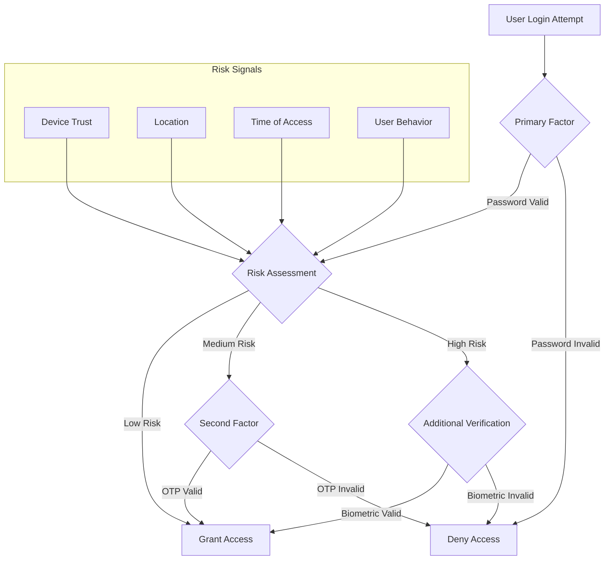

### Authentication Protocols

| Protocol | Use Case | Token Type | Key Features |
|----------|----------|------------|--------------|
| **OAuth 2.0** | Authorization delegation | Access Token | Scopes, refresh tokens |
| **OAuth 2.0 + PKCE** | Public clients (SPAs, mobile) | Access Token | Code verifier/challenge, no client secret |
| **OpenID Connect** | Authentication + identity | ID Token (JWT) | Claims, userinfo endpoint |
| **SAML 2.0** | Enterprise SSO | SAML Assertion | XML-based, mature ecosystem |
| **FIDO2/WebAuthn** | Passwordless | Public key credential | Phishing-resistant |
| **Kerberos** | On-premises SSO | Ticket | Mutual authentication |

### OAuth 2.0 with PKCE (Proof Key for Code Exchange)

#### What is PKCE?

PKCE (pronounced "pixy") is a security extension to OAuth 2.0 that protects the authorization code flow from interception attacks. It was originally designed for mobile and native applications (public clients) that cannot securely store a client secret, but is now recommended for **all OAuth clients**, including web applications.

#### Why PKCE is Needed

```
┌─────────────────────────────────────────────────────────────────┐
│              AUTHORIZATION CODE INTERCEPTION ATTACK             │
├─────────────────────────────────────────────────────────────────┤
│  Without PKCE:                                                  │
│  1. User initiates login → App requests authorization code      │
│  2. Authorization server returns code via redirect URI          │
│  3. ⚠️ Malicious app intercepts the authorization code          │
│  4. ⚠️ Attacker exchanges code for access token                 │
│  5. ⚠️ Attacker gains unauthorized access                       │
├─────────────────────────────────────────────────────────────────┤
│  With PKCE:                                                     │
│  1. App generates code_verifier and code_challenge              │
│  2. App sends code_challenge with authorization request         │
│  3. Even if code is intercepted, attacker lacks code_verifier   │
│  4. ✅ Token exchange fails without original code_verifier      │
└─────────────────────────────────────────────────────────────────┘
```

#### PKCE Flow Components

| Component | Description | Generation |
|-----------|-------------|------------|
| **code_verifier** | High-entropy cryptographic random string | 43-128 characters, URL-safe |
| **code_challenge** | Derived from code_verifier | `BASE64URL(SHA256(code_verifier))` |
| **code_challenge_method** | Hash algorithm used | `S256` (recommended) or `plain` |

#### OAuth 2.0 + PKCE Authorization Flow

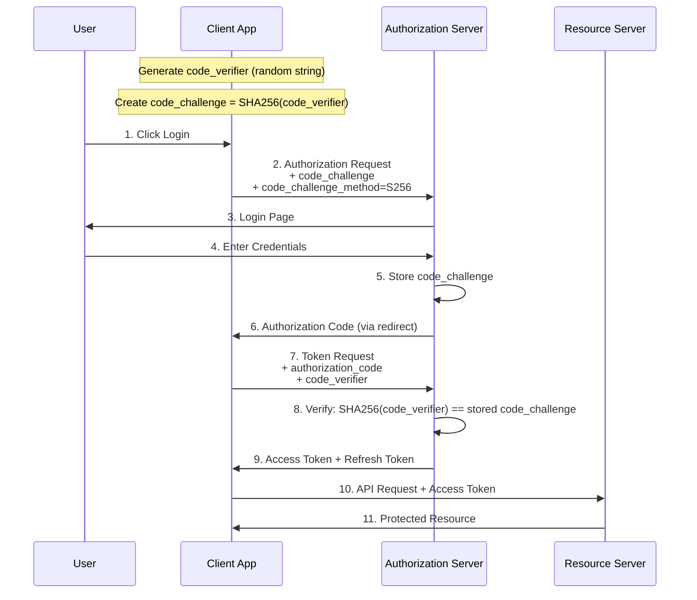

#### PKCE Implementation Example

**Step 1: Generate Code Verifier and Challenge**

```javascript
// Generate a cryptographically random code_verifier
function generateCodeVerifier() {
    const array = new Uint8Array(32);
    crypto.getRandomValues(array);
    return base64URLEncode(array);
}

// Create code_challenge from code_verifier
async function generateCodeChallenge(verifier) {
    const encoder = new TextEncoder();
    const data = encoder.encode(verifier);
    const digest = await crypto.subtle.digest('SHA-256', data);
    return base64URLEncode(new Uint8Array(digest));
}

// Base64 URL encoding (no padding, URL-safe characters)
function base64URLEncode(buffer) {
    return btoa(String.fromCharCode(...buffer))
        .replace(/\+/g, '-')
        .replace(/\//g, '_')
        .replace(/=+$/, '');
}
```

**Step 2: Authorization Request**

```
GET /authorize?
    response_type=code
    &client_id=your_client_id
    &redirect_uri=https://app.example.com/callback
    &scope=openid profile email
    &state=random_state_value
    &code_challenge=E9Melhoa2OwvFrEMTJguCHaoeK1t8URWbuGJSstw-cM
    &code_challenge_method=S256
```

**Step 3: Token Exchange Request**

```
POST /token
Content-Type: application/x-www-form-urlencoded

grant_type=authorization_code
&code=received_authorization_code
&redirect_uri=https://app.example.com/callback
&client_id=your_client_id
&code_verifier=dBjftJeZ4CVP-mB92K27uhbUJU1p1r_wW1gFWFOEjXk
```

#### PKCE Best Practices

| Practice | Recommendation |
|----------|----------------|
| **Always use S256** | Never use `plain` method in production |
| **Generate verifier per request** | Never reuse code_verifier values |
| **Use cryptographic randomness** | Use `crypto.getRandomValues()` or equivalent |
| **Store verifier securely** | Keep in memory or secure session storage |
| **Validate state parameter** | Prevent CSRF attacks alongside PKCE |
| **Use PKCE for all clients** | Not just public clients - confidential clients benefit too |

#### When to Use PKCE

```
┌─────────────────────────────────────────────────────────────────┐
│                    PKCE USAGE GUIDELINES                        │
├─────────────────────────────────────────────────────────────────┤
│  Client Type          │  PKCE Required?  │  Reason              │
├───────────────────────┼──────────────────┼──────────────────────┤
│  Single Page Apps     │  ✅ Required     │  Cannot store secret │
│  (SPAs)               │                  │  securely            │
├───────────────────────┼──────────────────┼──────────────────────┤
│  Mobile/Native Apps   │  ✅ Required     │  Code interception   │
│                       │                  │  risk via custom URI │
├───────────────────────┼──────────────────┼──────────────────────┤
│  Desktop Apps         │  ✅ Required     │  Cannot store secret │
│                       │                  │  securely            │
├───────────────────────┼──────────────────┼──────────────────────┤
│  Server-Side Web Apps │  ✅ Recommended  │  Defense in depth    │
│                       │                  │  (OAuth 2.1 requires)│
├───────────────────────┼──────────────────┼──────────────────────┤
│  Machine-to-Machine   │  ❌ Not needed   │  Uses client         │
│  (M2M)                │                  │  credentials flow    │
└─────────────────────────────────────────────────────────────────┘
```

#### PKCE vs Traditional Authorization Code Flow

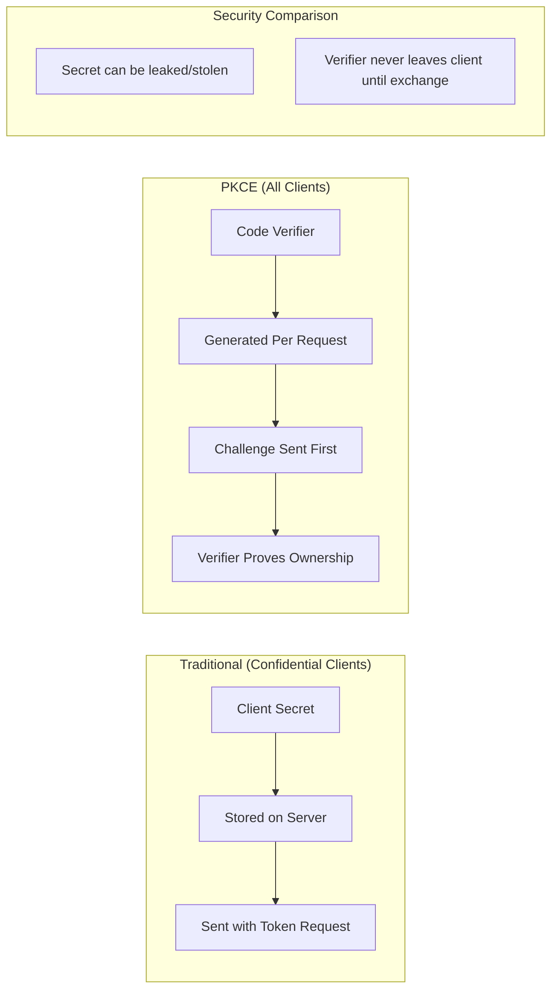

> **Note**: OAuth 2.1 (draft) mandates PKCE for all clients using the authorization code flow, making it the standard security practice going forward.

### Passwordless Authentication Architecture

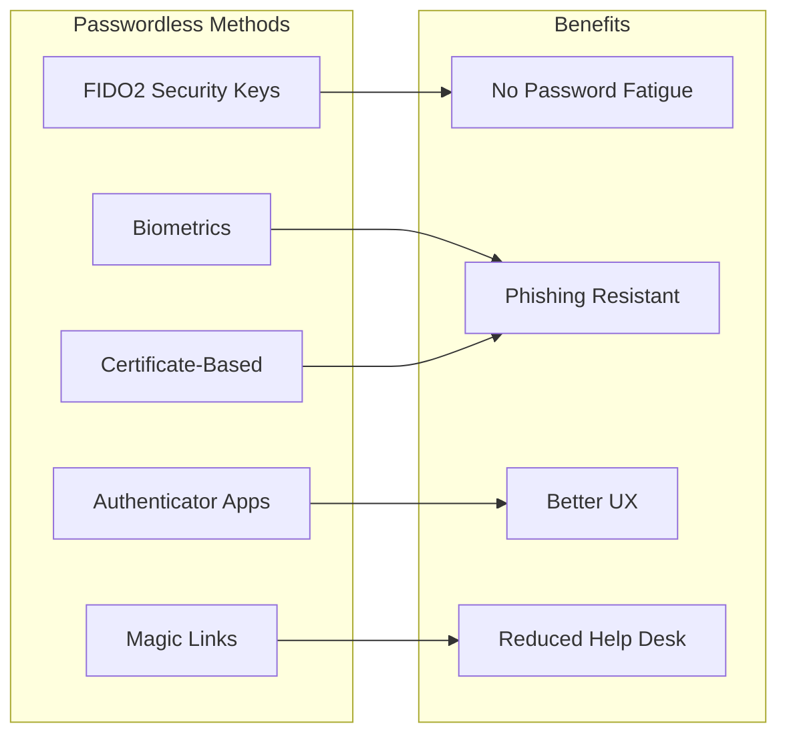

---

## Authorization Architecture

### Authorization Models

#### 1. Role-Based Access Control (RBAC)

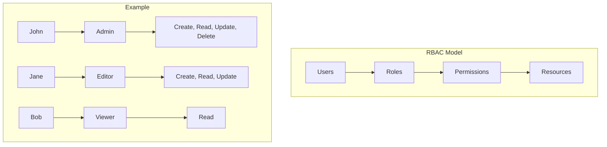

#### 2. Attribute-Based Access Control (ABAC)

```
┌─────────────────────────────────────────────────────────────────┐
│                        ABAC COMPONENTS                          │
├─────────────────────────────────────────────────────────────────┤
│  Subject Attributes  │  User role, department, clearance level │
├──────────────────────┼──────────────────────────────────────────┤
│  Resource Attributes │  Classification, owner, type            │
├──────────────────────┼──────────────────────────────────────────┤
│  Action Attributes   │  Read, write, delete, approve           │
├──────────────────────┼──────────────────────────────────────────┤
│  Environment Attrs   │  Time, location, device, threat level   │
└─────────────────────────────────────────────────────────────────┘

Policy Example:
IF subject.role = "Manager" 
AND resource.classification ≤ "Confidential"
AND environment.location = "Corporate Network"
AND environment.time BETWEEN "09:00" AND "18:00"
THEN ALLOW action.read
```

#### 3. Policy-Based Access Control (PBAC)

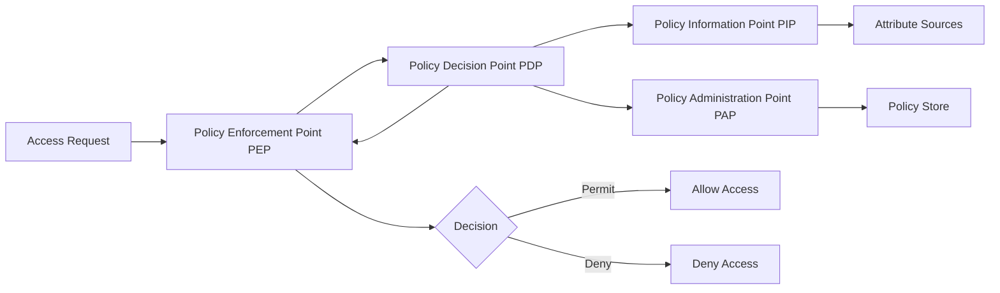

### Authorization Best Practices

1. **Principle of Least Privilege**: Grant minimum necessary permissions
2. **Separation of Duties**: Prevent conflicts of interest
3. **Time-Bound Access**: Implement expiring permissions
4. **Regular Reviews**: Periodic access certification
5. **Centralized Policy Management**: Single source of truth for policies

---

## Federation Architecture

### What is Federation?

Federation enables identity information to be shared across organizational boundaries, allowing users to access resources in partner organizations using their home credentials.

### Federation Trust Models

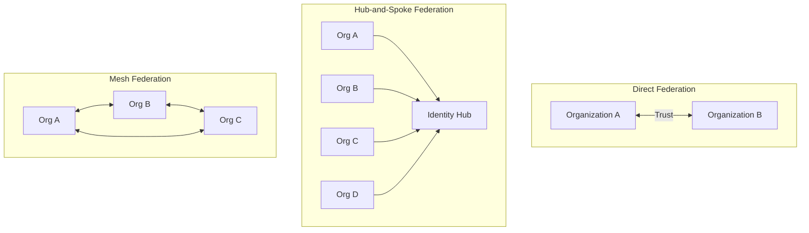

### Federation Protocols Comparison

| Aspect | SAML 2.0 | OpenID Connect | WS-Federation |
|--------|----------|----------------|---------------|
| **Token Format** | XML | JWT | XML |
| **Transport** | HTTP POST/Redirect | HTTP | HTTP |
| **Primary Use** | Enterprise SSO | Web/Mobile apps | Microsoft ecosystem |
| **Complexity** | High | Low | Medium |
| **Mobile Support** | Limited | Excellent | Limited |

### Cross-Domain Identity Flow

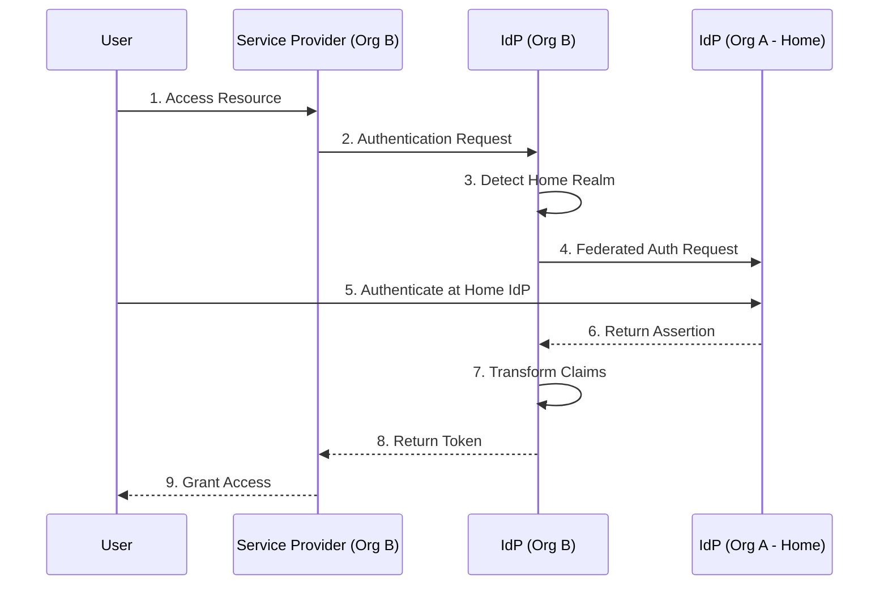

---

## Managed Identity Architecture

### What is Managed Identity?

Managed Identity is a cloud-native pattern that provides an automatically managed identity for applications and services to authenticate to cloud resources without storing credentials in code. The cloud platform handles credential creation, rotation, and lifecycle management.

### The Problem Managed Identity Solves

```
┌─────────────────────────────────────────────────────────────────┐
│               TRADITIONAL vs MANAGED IDENTITY                   │
├─────────────────────────────────────────────────────────────────┤
│  Traditional Approach (Problematic):                            │
│  ┌─────────────┐     Secrets in:                               │
│  │ Application │ --> • Config files                            │
│  │             │     • Environment variables                   │
│  │             │     • Key vaults (still need auth!)           │
│  └─────────────┘     • Source code (worst case)                │
│                                                                 │
│  ⚠️ Risks: Credential exposure, rotation burden, sprawl        │
├─────────────────────────────────────────────────────────────────┤
│  Managed Identity Approach (Secure):                            │
│  ┌─────────────┐     Platform provides:                        │
│  │ Application │ --> • Automatic credential injection          │
│  │             │     • Automatic rotation                      │
│  │             │     • No secrets to manage                    │
│  └─────────────┘     • Identity tied to resource lifecycle     │
│                                                                 │
│  ✅ Benefits: Zero credential management, reduced attack surface│
└─────────────────────────────────────────────────────────────────┘
```

### Types of Managed Identities

| Type | Description | Lifecycle | Use Case |
|------|-------------|-----------|----------|
| **System-Assigned** | Created with and tied to a specific resource | Deleted when resource is deleted | Single resource needs specific access |
| **User-Assigned** | Standalone identity resource | Independent of resources | Shared identity across multiple resources |

### Managed Identity Architecture Pattern

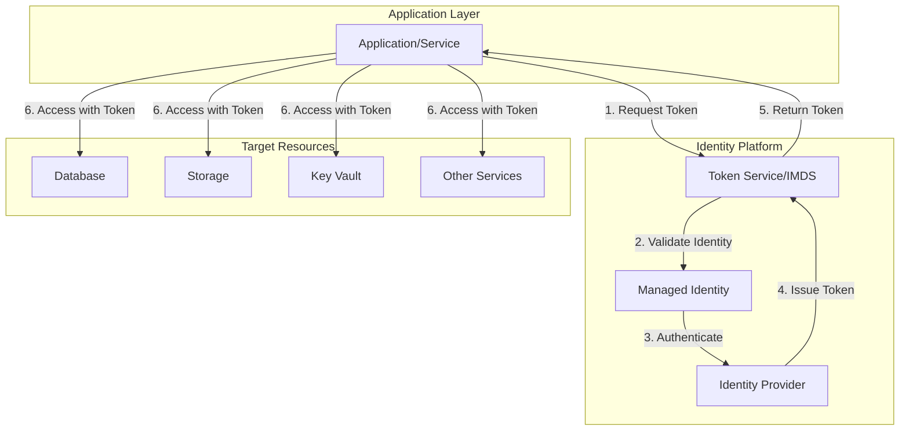

### System-Assigned vs User-Assigned Comparison

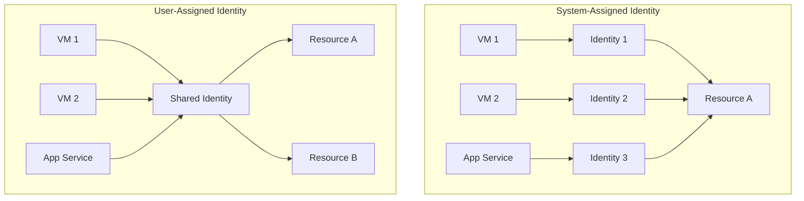

### When to Use Each Type

```
┌─────────────────────────────────────────────────────────────────┐
│           MANAGED IDENTITY TYPE SELECTION GUIDE                 │
├─────────────────────────────────────────────────────────────────┤
│  Scenario                        │  Recommended Type            │
├──────────────────────────────────┼──────────────────────────────┤
│  Single resource, unique access  │  System-Assigned             │
│  needs                           │                              │
├──────────────────────────────────┼──────────────────────────────┤
│  Multiple resources need same    │  User-Assigned               │
│  permissions                     │                              │
├──────────────────────────────────┼──────────────────────────────┤
│  Identity must outlive resource  │  User-Assigned               │
├──────────────────────────────────┼──────────────────────────────┤
│  Need pre-provisioned identity   │  User-Assigned               │
│  before resource creation        │                              │
├──────────────────────────────────┼──────────────────────────────┤
│  Simple, auto-cleanup preferred  │  System-Assigned             │
├──────────────────────────────────┼──────────────────────────────┤
│  VMSS or container instances     │  User-Assigned (recommended) │
│  with shared access              │                              │
└─────────────────────────────────────────────────────────────────┘
```

### Token Acquisition Flow

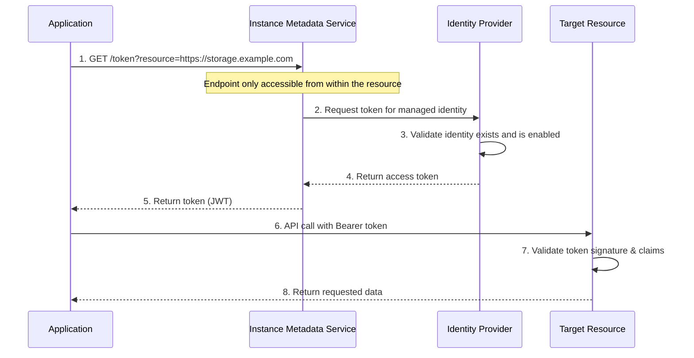

### Managed Identity Implementation Patterns

#### Pattern 1: Direct Resource Access

```
Application ──(Managed Identity)──> Azure SQL Database
                                    └── No connection string secrets!
```

#### Pattern 2: Secure Secret Retrieval

```
Application ──(Managed Identity)──> Key Vault ──> Retrieve third-party secrets
                                                  └── For non-Azure resources
```

#### Pattern 3: Service Chaining

```
Function App ──(MI)──> Service Bus ──(trigger)──> Another Function ──(MI)──> Cosmos DB
```

### Security Boundaries

```
┌─────────────────────────────────────────────────────────────────┐
│              MANAGED IDENTITY SECURITY MODEL                    │
├─────────────────────────────────────────────────────────────────┤
│                                                                 │
│  Token Endpoint (IMDS)                                          │
│  ├── Only accessible from within the resource                   │
│  ├── Not routable from outside (169.254.169.254)               │
│  ├── No authentication required (relies on network isolation)   │
│  └── Short-lived tokens (typically 1 hour)                      │
│                                                                 │
│  Identity Scope                                                 │
│  ├── Bound to specific cloud resource                          │
│  ├── Cannot be extracted or used elsewhere                      │
│  └── Permissions granted via RBAC on target resources           │
│                                                                 │
│  Credential Management                                          │
│  ├── Platform manages all certificates/keys                     │
│  ├── Automatic rotation (no manual intervention)                │
│  └── No credentials exposed to application code                 │
│                                                                 │
└─────────────────────────────────────────────────────────────────┘
```

### Managed Identity Best Practices

| Practice | Description |
|----------|-------------|
| **Use least privilege** | Grant only necessary permissions to the identity |
| **Prefer system-assigned for simplicity** | Unless you need identity sharing or pre-provisioning |
| **Use user-assigned for scale sets** | Avoids identity proliferation in dynamic environments |
| **Enable on all supported resources** | Eliminate service account passwords wherever possible |
| **Monitor identity usage** | Track token acquisitions and resource access |
| **Combine with Conditional Access** | Apply policies based on workload identity |
| **Use for Key Vault access** | Bootstrap other secrets securely |

### Cloud Provider Implementations

| Provider | Feature Name | Metadata Service |
|----------|--------------|------------------|
| **Azure** | Managed Identity (System/User-Assigned) | IMDS (169.254.169.254) |
| **AWS** | IAM Roles for EC2/ECS/Lambda | IMDS (169.254.169.254) |
| **GCP** | Service Account (attached) | Metadata Server (169.254.169.254) |
| **Kubernetes** | Workload Identity / Service Account Token | Projected Service Account Tokens |

### Common Use Cases

1. **Database Access**: Connect to managed databases without connection string secrets
2. **Storage Operations**: Read/write blobs, queues without storage keys
3. **Secret Management**: Access Key Vault/Secret Manager to retrieve third-party credentials
4. **Service Communication**: Authenticate between microservices
5. **CI/CD Pipelines**: Deploy resources without storing deployment credentials
6. **Logging & Monitoring**: Send telemetry to monitoring services securely

---

## Identity Lifecycle Management

### Identity Lifecycle Stages

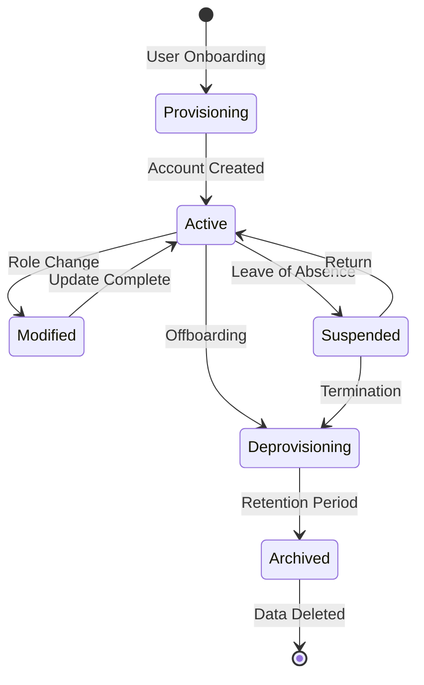

### Provisioning Patterns

#### 1. Just-In-Time (JIT) Provisioning

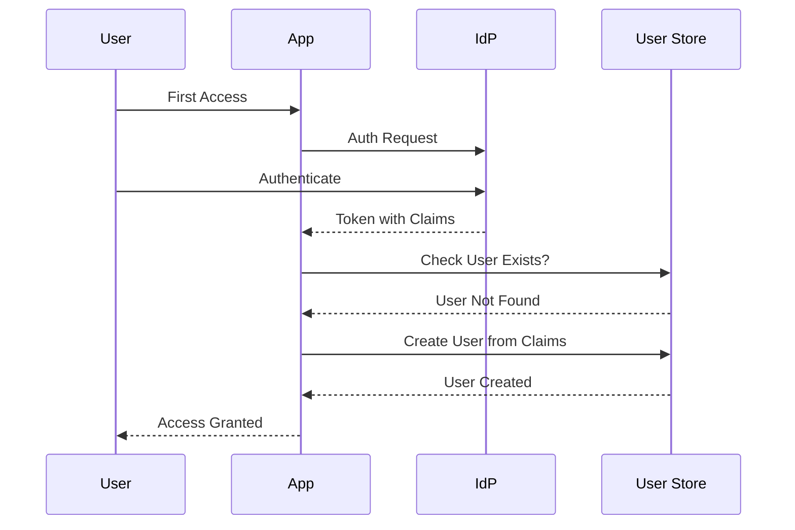

#### 2. SCIM-Based Provisioning

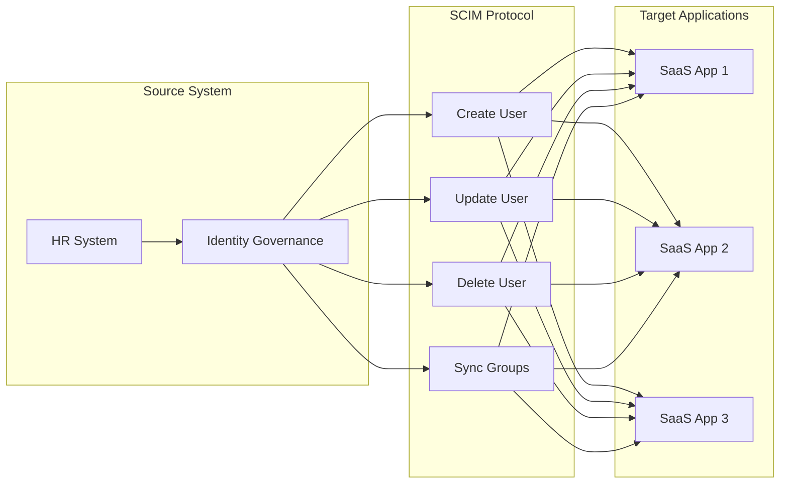

### Deprovisioning Checklist

| Step | Action | Timeline |
|------|--------|----------|
| 1 | Disable authentication | Immediate |
| 2 | Revoke active sessions | Immediate |
| 3 | Remove group memberships | Within 1 hour |
| 4 | Revoke application access | Within 1 hour |
| 5 | Transfer data ownership | Within 24 hours |
| 6 | Archive user data | Per retention policy |
| 7 | Delete identity record | After retention period |

---

## Identity Governance

### Identity Governance Framework

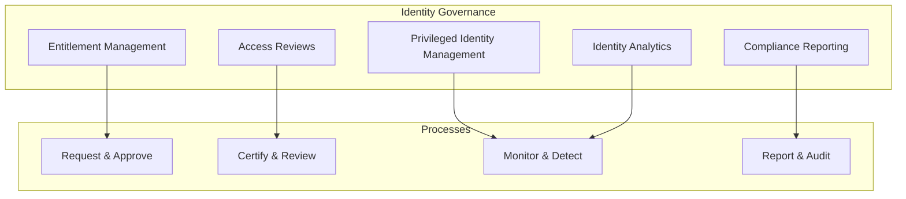

### Access Reviews

```
┌─────────────────────────────────────────────────────────────────┐
│                     ACCESS REVIEW TYPES                         │
├─────────────────────────────────────────────────────────────────┤
│  Review Type        │  Frequency    │  Reviewer                 │
├─────────────────────┼───────────────┼───────────────────────────┤
│  Self-Review        │  Quarterly    │  User                     │
├─────────────────────┼───────────────┼───────────────────────────┤
│  Manager Review     │  Quarterly    │  Direct Manager           │
├─────────────────────┼───────────────┼───────────────────────────┤
│  Resource Owner     │  Monthly      │  Application Owner        │
│  Review             │               │                           │
├─────────────────────┼───────────────┼───────────────────────────┤
│  Privileged Access  │  Monthly      │  Security Team            │
│  Review             │               │                           │
├─────────────────────┼───────────────┼───────────────────────────┤
│  External User      │  Quarterly    │  Sponsor                  │
│  Review             │               │                           │
└─────────────────────────────────────────────────────────────────┘
```

### Privileged Identity Management (PIM)

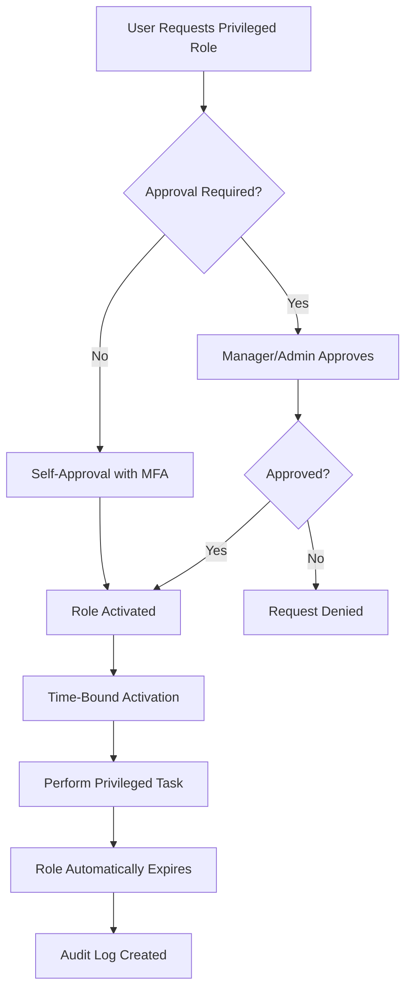

---

## Best Practices

### Identity Architecture Best Practices

1. **Centralize Identity Management**
   - Use a single source of truth for identities
   - Implement consistent policies across applications

2. **Implement Strong Authentication**
   - Require MFA for all users
   - Adopt passwordless where possible
   - Use risk-based authentication

3. **Apply Least Privilege**
   - Grant minimum necessary access
   - Use time-bound and just-in-time access
   - Regular access reviews

4. **Secure Service Identities**
   - Use managed identities for workloads
   - Rotate credentials automatically
   - Avoid storing secrets in code

5. **Plan for Federation**
   - Design for cross-organization scenarios
   - Standardize on modern protocols (OIDC)
   - Implement proper claim mapping

6. **Automate Lifecycle Management**
   - HR-driven provisioning/deprovisioning
   - Automated access reviews
   - Self-service with approval workflows

7. **Monitor and Audit**
   - Log all authentication events
   - Detect anomalous behavior
   - Maintain compliance evidence

### Common Anti-Patterns to Avoid

| Anti-Pattern | Risk | Better Approach |
|--------------|------|-----------------|
| Shared accounts | No accountability | Individual accounts with RBAC |
| Static service credentials | Credential exposure | Managed identities, certificate rotation |
| Over-provisioning | Excessive access | Least privilege, JIT access |
| No session management | Session hijacking | Token lifetime limits, continuous validation |
| Local identity stores | Inconsistent security | Centralized IdP |

---

## Related Resources

### Internal Documentation

- [6.1 Security Architecture](6.1-security-architecture.md)
- [Authentication Methods Overview](authentication-methods-overview.md)
- [Azure Identity Overview](../../architecture-azure/security/azure_identity_overview.md)
- [Azure Identity Principal Objects](../../architecture-azure/security/azure-identity-principal-objects.md)

### External References

- [NIST Digital Identity Guidelines (SP 800-63)](https://pages.nist.gov/800-63-3/)
- [OAuth 2.0 RFC 6749](https://datatracker.ietf.org/doc/html/rfc6749)
- [OpenID Connect Specification](https://openid.net/connect/)
- [SAML 2.0 Specification](http://docs.oasis-open.org/security/saml/v2.0/)
- [SCIM Protocol](https://datatracker.ietf.org/doc/html/rfc7644)

---

*Last Updated: December 2024*
