# 6.3 Network Security Architecture

## Table of Contents

- [Overview](#overview)
- [6.3.1 Perimeter Security Architecture](#631-perimeter-security-architecture)
- [6.3.2 Micro-Segmentation](#632-micro-segmentation)
- [6.3.3 Web Application Firewall (WAF)](#633-web-application-firewall-waf)
- [6.3.4 DDoS Protection Architecture](#634-ddos-protection-architecture)
- [Network Security Design Patterns](#network-security-design-patterns)
- [Best Practices](#best-practices)
- [Related Topics](#related-topics)

---

## Overview

Network Security Architecture defines the principles, patterns, and controls for protecting network infrastructure and data in transit. It encompasses multiple layers of defense to ensure confidentiality, integrity, and availability of network communications.

### Key Principles

| Principle | Description |
|-----------|-------------|
| **Defense in Depth** | Multiple layers of security controls throughout the network |
| **Least Privilege** | Minimal network access required for each component |
| **Zero Trust** | Never trust, always verify - regardless of network location |
| **Segmentation** | Isolate network zones to contain breaches |
| **Visibility** | Monitor and log all network traffic for threat detection |

### Network Security Layers

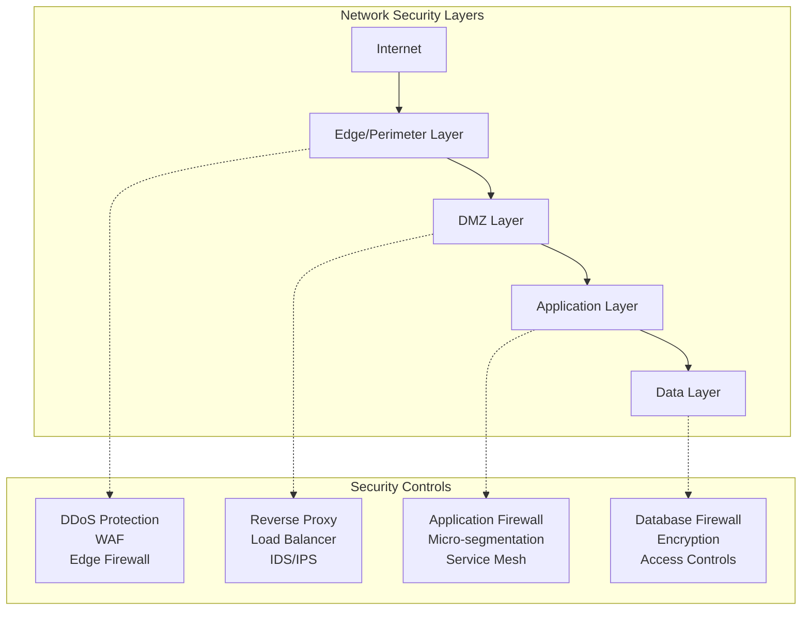

---

## 6.3.1 Perimeter Security Architecture

Perimeter security defines the boundary between trusted internal networks and untrusted external networks. While traditional perimeter-centric models have evolved toward Zero Trust, perimeter controls remain essential as the first line of defense.

### Traditional vs Modern Perimeter

| Aspect | Traditional Perimeter | Modern Perimeter |
|--------|----------------------|------------------|
| **Trust Model** | Trust internal, distrust external | Zero Trust - verify everything |
| **Boundary** | Fixed network edge | Dynamic, identity-based |
| **Focus** | North-South traffic | North-South + East-West |
| **Controls** | Firewall at edge | Distributed security controls |
| **Identity** | Network location based | User and device identity |

### Perimeter Security Components

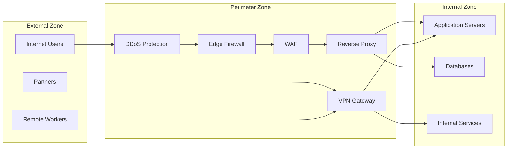

### Firewall Architecture Patterns

#### 1. Single Firewall Architecture

```
Internet → [Firewall] → Internal Network
```

- **Use Case**: Small organizations, simple requirements
- **Pros**: Simple, cost-effective
- **Cons**: Single point of failure, limited segmentation

#### 2. Dual Firewall Architecture (DMZ)

```
Internet → [External FW] → DMZ → [Internal FW] → Internal Network
```

- **Use Case**: Organizations with public-facing services
- **Pros**: Better segmentation, defense in depth
- **Cons**: More complex, higher cost

#### 3. Multi-tier Firewall Architecture

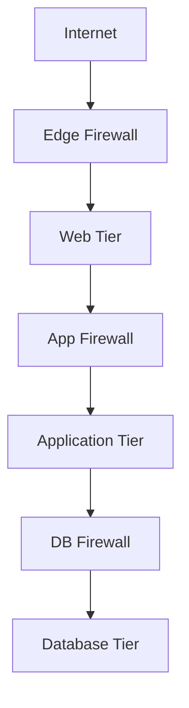

### Next-Generation Firewall (NGFW) Capabilities

| Capability | Description |
|------------|-------------|
| **Deep Packet Inspection** | Analyze packet content beyond headers |
| **Application Awareness** | Identify and control applications |
| **User Identity Integration** | Policies based on user identity |
| **Threat Intelligence** | Real-time threat feed integration |
| **SSL/TLS Inspection** | Decrypt and inspect encrypted traffic |
| **Intrusion Prevention** | Detect and block known attack patterns |

---

## 6.3.2 Micro-Segmentation

Micro-segmentation divides the network into small, isolated segments with granular access controls. This limits lateral movement and contains breaches to the smallest possible blast radius.

### Micro-Segmentation vs Traditional Segmentation

| Aspect | Traditional Segmentation | Micro-Segmentation |
|--------|--------------------------|-------------------|
| **Granularity** | VLANs, Subnets | Individual workloads |
| **Policy Basis** | IP addresses, ports | Identity, context, behavior |
| **Enforcement** | Network devices | Host-based, software-defined |
| **Scalability** | Limited by hardware | Highly scalable |
| **Visibility** | Network flows | Application-level flows |

### Micro-Segmentation Architecture

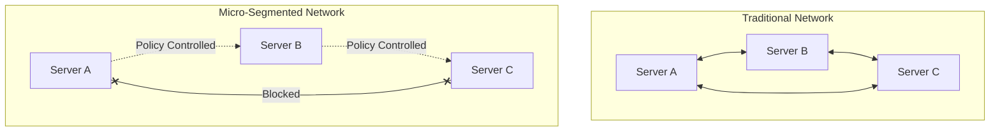

### Implementation Approaches

#### 1. Network-Based Micro-Segmentation

- Uses SDN (Software-Defined Networking)
- Virtual firewalls between segments
- Centralized policy management

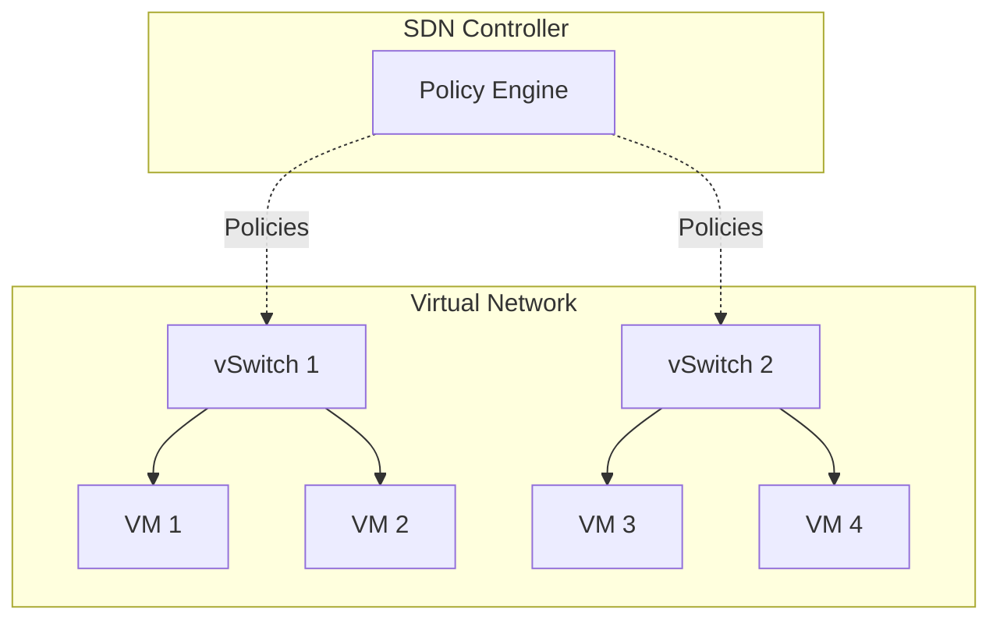

#### 2. Host-Based Micro-Segmentation

- Agent installed on each workload
- Policies enforced at OS level
- Works across hybrid environments

#### 3. Application-Based Micro-Segmentation (Service Mesh)

- Sidecar proxies with each service
- mTLS for service-to-service communication
- Fine-grained traffic policies

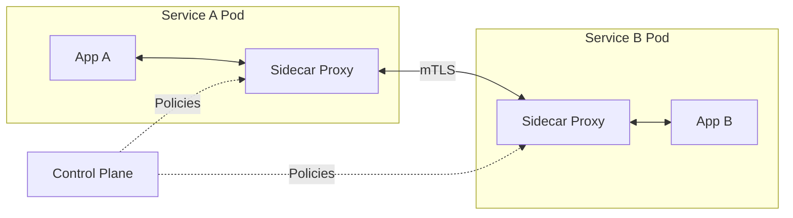

### Micro-Segmentation Policy Design

| Policy Type | Description | Example |
|-------------|-------------|---------|
| **Allow List** | Only permitted traffic allowed | Web servers can only reach app servers on port 8080 |
| **Deny List** | Specific traffic blocked | Block all traffic to database from internet-facing servers |
| **Context-Based** | Policies based on context | Allow access only during business hours |
| **Behavior-Based** | Policies based on normal behavior | Alert on unusual data transfer patterns |

---

## 6.3.3 Web Application Firewall (WAF)

A Web Application Firewall protects web applications by filtering, monitoring, and blocking malicious HTTP/HTTPS traffic. WAF operates at Layer 7 (Application Layer) of the OSI model.

### WAF Position in Architecture

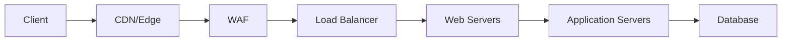

### WAF Detection Methods

| Method | Description | Pros | Cons |
|--------|-------------|------|------|
| **Signature-Based** | Pattern matching against known attacks | Fast, accurate for known threats | Cannot detect zero-day attacks |
| **Anomaly-Based** | Deviation from baseline behavior | Can detect unknown attacks | Higher false positives |
| **Machine Learning** | AI-powered threat detection | Adaptive, learns patterns | Requires training data |
| **Positive Security Model** | Only allow known-good traffic | Very secure | Complex to configure |
| **Negative Security Model** | Block known-bad traffic | Easier to deploy | May miss new attacks |

### OWASP Top 10 Protection

WAF should protect against common web vulnerabilities:

| Vulnerability | WAF Protection |
|---------------|----------------|
| **Injection (SQL, NoSQL, OS)** | Input validation, pattern matching |
| **Broken Authentication** | Brute force protection, session analysis |
| **Sensitive Data Exposure** | Data masking, response inspection |
| **XXE (XML External Entities)** | XML parsing rules |
| **Broken Access Control** | Request validation, URL filtering |
| **Security Misconfiguration** | Configuration audit rules |
| **XSS (Cross-Site Scripting)** | Output encoding validation |
| **Insecure Deserialization** | Serialization format validation |
| **Vulnerable Components** | Virtual patching |
| **Insufficient Logging** | Request/response logging |

### WAF Deployment Models

#### 1. Inline WAF (Reverse Proxy)

```
Client → WAF → Application
```

- All traffic passes through WAF
- Can block malicious requests
- Adds latency

#### 2. Out-of-Band WAF (TAP Mode)

```
Client → Application
         ↓
        WAF (monitoring)
```

- Monitors traffic copy
- No latency impact
- Cannot block in real-time

#### 3. Cloud-Based WAF

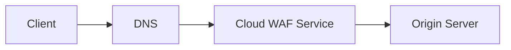

- Managed service
- Global distribution
- Scales automatically

### WAF Rule Categories

| Category | Purpose | Examples |
|----------|---------|----------|
| **Core Rule Set** | Basic protections | SQL injection, XSS |
| **Rate Limiting** | Prevent abuse | Request throttling |
| **Geo-blocking** | Location-based filtering | Block traffic from specific countries |
| **Bot Protection** | Manage automated traffic | CAPTCHA, bot signatures |
| **API Protection** | Secure API endpoints | Schema validation, authentication |
| **Custom Rules** | Application-specific | Business logic protection |

---

## 6.3.4 DDoS Protection Architecture

Distributed Denial of Service (DDoS) protection defends against attacks that attempt to overwhelm systems with traffic, making them unavailable to legitimate users.

### DDoS Attack Types

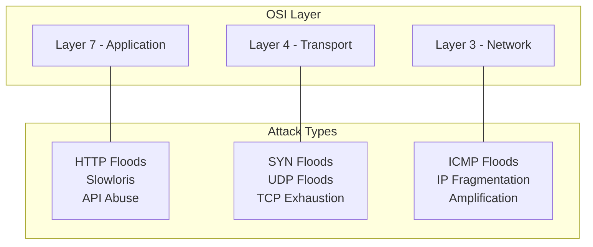

### Attack Categories and Mitigation

| Attack Category | Description | Mitigation Strategy |
|-----------------|-------------|---------------------|
| **Volumetric** | Overwhelm bandwidth | Traffic scrubbing, CDN absorption |
| **Protocol** | Exploit protocol weaknesses | SYN cookies, rate limiting |
| **Application** | Target application layer | WAF, bot detection, CAPTCHA |
| **Multi-vector** | Combined attack types | Layered defense approach |

### DDoS Protection Architecture

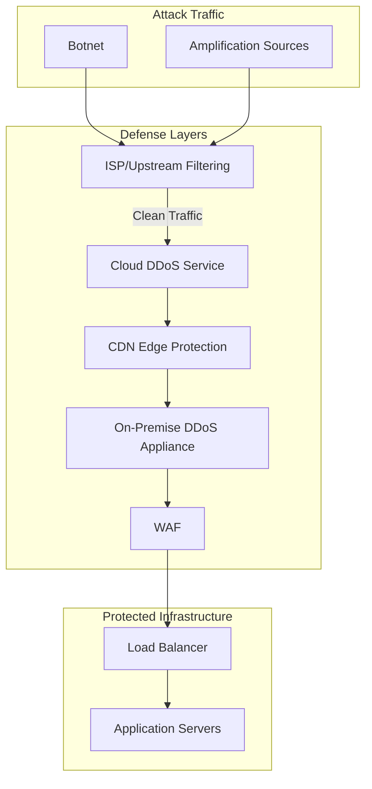

### DDoS Mitigation Techniques

#### 1. Traffic Scrubbing

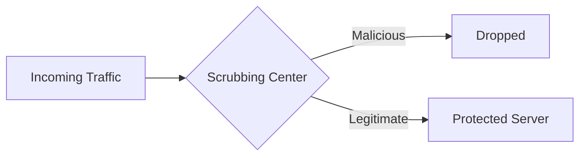

#### 2. Rate Limiting

| Rate Limit Type | Description |
|-----------------|-------------|
| **Connection Rate** | Limit new connections per second |
| **Request Rate** | Limit requests per IP/session |
| **Bandwidth Rate** | Limit data transfer rate |
| **Concurrent Connections** | Limit simultaneous connections |

#### 3. Anycast Distribution

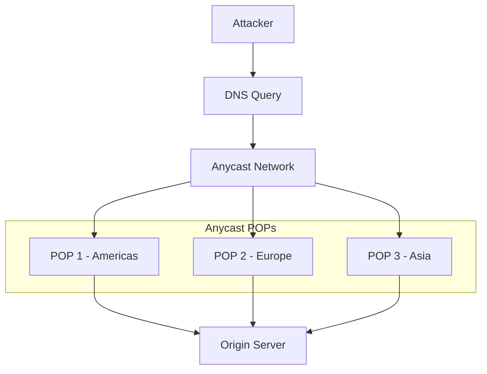

### DDoS Protection Tiers

| Tier | Protection Level | Suitable For |
|------|-----------------|--------------|
| **Basic** | Network layer protection | Small websites, non-critical services |
| **Standard** | Network + Application layer | Business applications |
| **Advanced** | Full-spectrum + custom rules | Critical infrastructure, financial services |
| **Enterprise** | Dedicated capacity + SLA | Large enterprises, government |

---

## Network Security Design Patterns

### 1. Defense in Depth Pattern

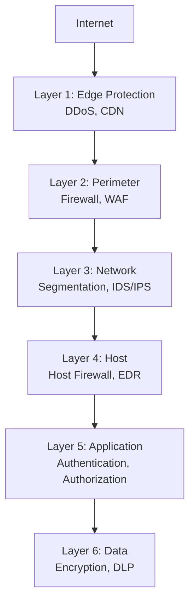

### 2. Zero Trust Network Pattern

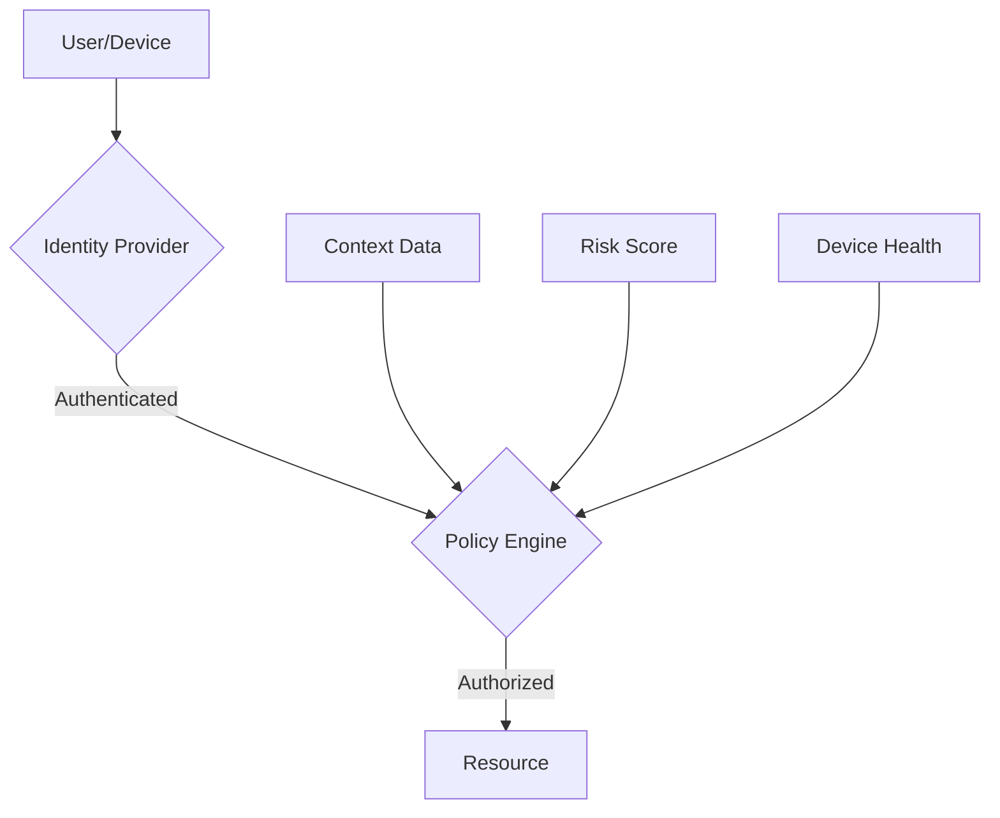

### 3. Secure Hybrid Network Pattern

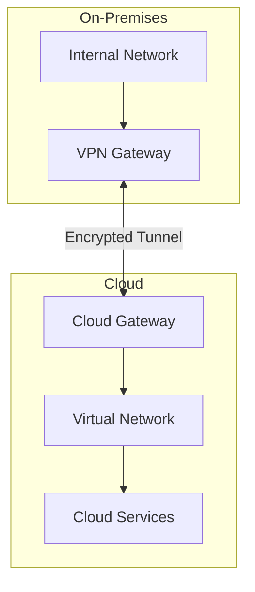

---

## Best Practices

### Network Security Checklist

| Area | Best Practice | Priority |
|------|---------------|----------|
| **Perimeter** | Deploy NGFW with deep packet inspection | High |
| **Perimeter** | Enable SSL/TLS inspection for encrypted traffic | High |
| **Segmentation** | Implement micro-segmentation for critical workloads | High |
| **Segmentation** | Use network policies in container environments | Medium |
| **WAF** | Deploy WAF for all public-facing web applications | High |
| **WAF** | Enable OWASP Core Rule Set | High |
| **WAF** | Implement custom rules for application-specific threats | Medium |
| **DDoS** | Enable always-on DDoS protection | High |
| **DDoS** | Configure rate limiting at multiple layers | Medium |
| **Monitoring** | Enable network flow logging | High |
| **Monitoring** | Implement network detection and response (NDR) | Medium |

### Network Security Maturity Model

| Level | Characteristics | Capabilities |
|-------|-----------------|--------------|
| **Level 1 - Basic** | Perimeter-focused | Firewall, basic ACLs |
| **Level 2 - Developing** | Segmented network | VLANs, DMZ, WAF |
| **Level 3 - Defined** | Policy-driven | NGFW, micro-segmentation |
| **Level 4 - Managed** | Automated response | SOAR integration, threat intelligence |
| **Level 5 - Optimized** | Zero Trust | Identity-centric, adaptive policies |

---

## Related Topics

### Internal References

- [6.1 Security Architecture](./6.1-security-architecture.md) - Zero Trust, Defense in Depth
- [6.2 Identity Architecture](./6.2-identity-architecture.md) - Identity and Access Management
- [6.4 Data Security Architecture](./6.4-data-security-architecture.md) - Encryption, Key Management

### Azure Implementations

- [Azure Firewall](../../architecture-azure/networking/firewall/) - Azure native firewall service
- [Azure WAF](../../architecture-azure/networking/) - Web Application Firewall on Azure
- [Azure DDoS Protection](../../architecture-azure/networking/) - Azure DDoS mitigation
- [Azure Virtual Network](../../architecture-azure/networking/) - Network segmentation in Azure

### External References

- [NIST Cybersecurity Framework](https://www.nist.gov/cyberframework)
- [CIS Controls](https://www.cisecurity.org/controls)
- [OWASP Web Security Testing Guide](https://owasp.org/www-project-web-security-testing-guide/)
