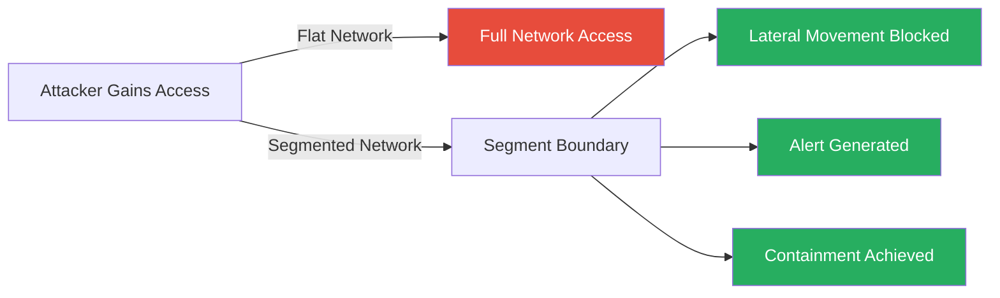
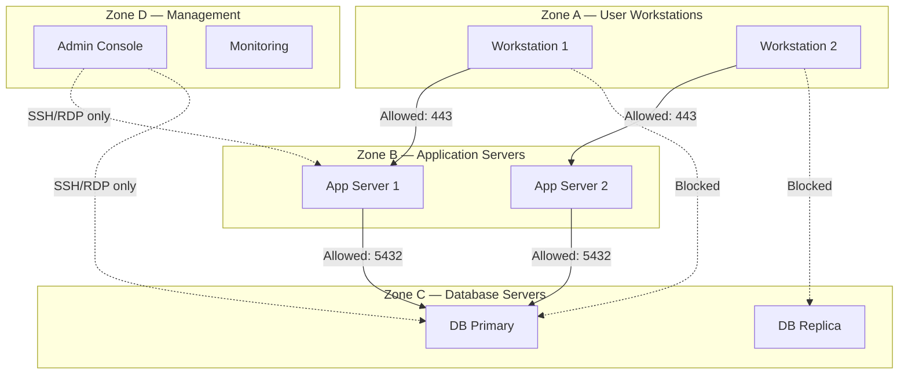
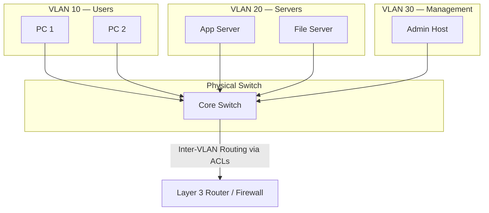
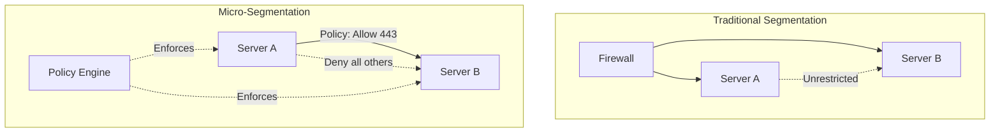
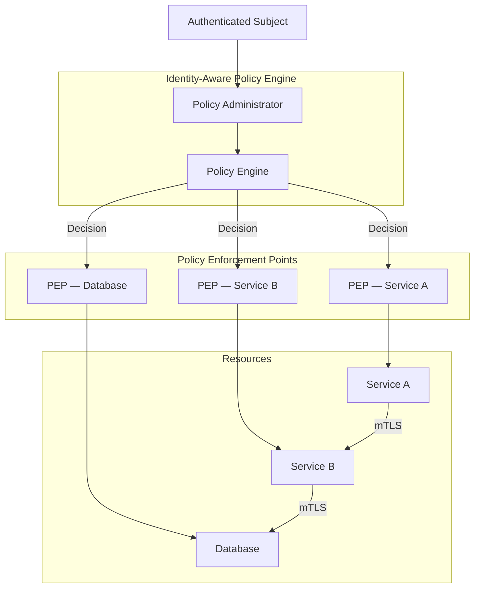
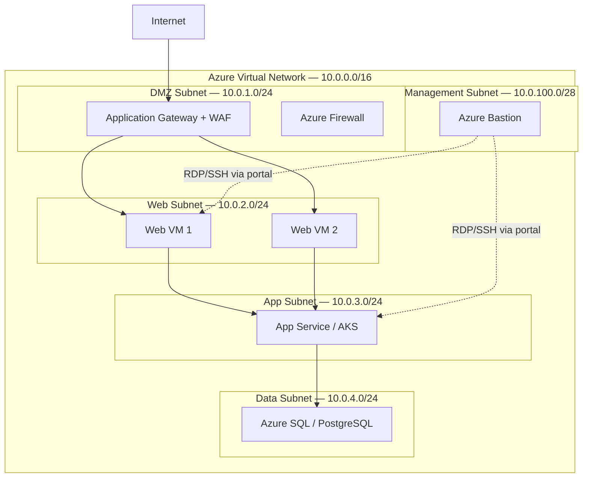
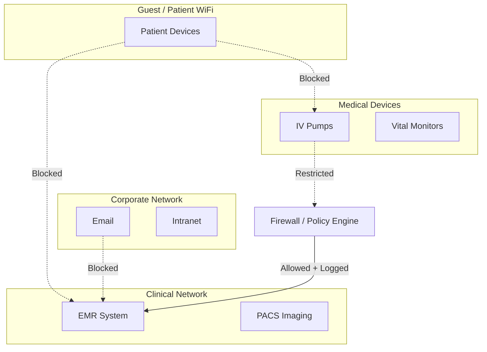
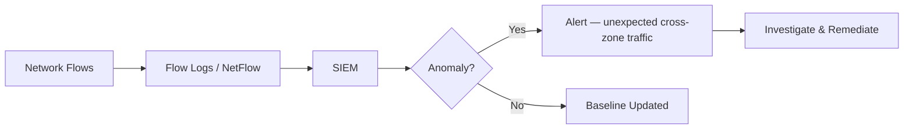

# 6.3.2 Network Segmentation

> **Taxonomy Reference**: §6.3 Network Security Architecture

## Table of Contents

- [Overview](#overview)
- [Segmentation Fundamentals](#segmentation-fundamentals)
- [Segmentation Strategies](#segmentation-strategies)
- [Micro-Segmentation](#micro-segmentation)
- [VLAN Segmentation](#vlan-segmentation)
- [Zero Trust Network Segmentation](#zero-trust-network-segmentation)
- [Cloud Network Segmentation](#cloud-network-segmentation)
- [Segmentation in Practice](#segmentation-in-practice)
- [Implementation Best Practices](#implementation-best-practices)
- [Related Topics](#related-topics)

---

## Overview

Network segmentation is the practice of dividing a network into smaller, isolated sub-networks (segments) to improve security, performance, and manageability. By controlling traffic between segments, organizations can contain breaches, limit lateral movement of attackers, and enforce least-privilege network access.

### Key Benefits

| Benefit | Description |
|---------|-------------|
| **Breach Containment** | Limits the blast radius if a segment is compromised |
| **Lateral Movement Prevention** | Stops attackers from moving freely across the network |
| **Regulatory Compliance** | Meets PCI DSS, HIPAA, and other segmentation mandates |
| **Performance Isolation** | Reduces broadcast domains and congestion |
| **Simplified Monitoring** | Easier anomaly detection per segment |

### Core Security Principle



---

## Segmentation Fundamentals

### Why Flat Networks Are Dangerous

In a flat (unsegmented) network, every device can communicate directly with every other device. A single compromised endpoint grants an attacker free rein to:

- Scan and enumerate all internal hosts
- Move laterally to high-value targets (domain controllers, databases)
- Exfiltrate data from any system
- Deploy ransomware across the entire environment

### Traffic Flow Control Model



### Segmentation Zones — Common Model

| Zone | Trust Level | Typical Contents | Allowed Inbound |
|------|-------------|-----------------|-----------------|
| **Internet / External** | Untrusted | Public internet | None (outbound only) |
| **Perimeter / DMZ** | Semi-trusted | Web, mail, VPN gateways | HTTP/S, SMTP, VPN |
| **Application** | Internal | Web apps, APIs, microservices | From DMZ on specific ports |
| **Data** | Restricted | Databases, file storage | From Application zone only |
| **Management** | Privileged | Bastion hosts, monitoring, AD | Strictly controlled |
| **OT / IoT** | Isolated | Industrial, embedded devices | No access to IT zones |

---

## Segmentation Strategies

### 1. Physical Segmentation

Separate physical hardware (switches, routers, cables) for each segment.

| Aspect | Detail |
|--------|--------|
| **Isolation Strength** | Strongest — air-gapped if needed |
| **Cost** | Highest — dedicated hardware per segment |
| **Flexibility** | Lowest — hard to reconfigure |
| **Use Cases** | Critical infrastructure, classified environments |

### 2. VLAN-Based Segmentation

Uses IEEE 802.1Q VLAN tags to create logical segments over shared physical infrastructure.



**Pros:** Cost-effective, widely supported, easy to manage  
**Cons:** Misconfigured trunks can expose VLANs; VLAN hopping attacks if hardening is insufficient

### 3. Subnet-Based Segmentation

Assigns distinct IP subnets per zone, with routers/firewalls enforcing inter-subnet rules.

```
10.0.1.0/24   → DMZ
10.0.2.0/24   → Web Tier
10.0.3.0/24   → App Tier
10.0.4.0/24   → Data Tier
10.0.100.0/24 → Management
```

### 4. Software-Defined Segmentation (Micro-Segmentation)

Policy-driven segmentation enforced at the workload level, independent of physical or VLAN topology. See [Micro-Segmentation](#micro-segmentation) section.

### Strategy Comparison

| Strategy | Granularity | Scalability | Cost | Best For |
|----------|-------------|-------------|------|----------|
| Physical | Network-level | Low | High | Air-gapped, classified |
| VLAN | Network-level | Medium | Low | On-premises enterprise |
| Subnet | Network-level | Medium | Low | Cloud & on-premises |
| Micro-Segmentation | Workload-level | High | Medium | Cloud, containerized, Zero Trust |

---

## Micro-Segmentation

Micro-segmentation extends network segmentation down to the individual workload or process level, applying granular policies that follow the workload regardless of its physical or virtual location.

### How It Works



### Enforcement Mechanisms

| Mechanism | Where Enforced | Technology Examples |
|-----------|---------------|---------------------|
| **Host-based firewall** | OS kernel on each host | Windows Firewall, iptables, nftables |
| **Hypervisor firewall** | Hypervisor vSwitch | VMware NSX, Hyper-V vSwitch |
| **Container network policy** | Container runtime / CNI | Kubernetes NetworkPolicy, Calico, Cilium |
| **Service mesh** | Sidecar proxy | Istio, Linkerd, Consul Connect |
| **Cloud security groups** | Cloud control plane | AWS Security Groups, Azure NSGs, GCP Firewall Rules |

### Kubernetes Network Policy Example

```yaml
apiVersion: networking.k8s.io/v1
kind: NetworkPolicy
metadata:
  name: allow-app-to-db
  namespace: production
spec:
  podSelector:
    matchLabels:
      role: database
  policyTypes:
    - Ingress
  ingress:
    - from:
        - podSelector:
            matchLabels:
              role: app-server
      ports:
        - protocol: TCP
          port: 5432
```

**Effect:** Only pods labeled `role: app-server` can reach pods labeled `role: database` on port 5432. All other traffic to the database pods is denied.

### Micro-Segmentation vs Traditional Segmentation

| Dimension | Traditional | Micro-Segmentation |
|-----------|-------------|-------------------|
| **Granularity** | Subnet / VLAN | Per workload / process |
| **Policy Scope** | Network perimeter | Follows the workload |
| **East-West Traffic** | Often unrestricted | Fully controlled |
| **Dynamic Environments** | Manual reconfiguration | Policy auto-follows workloads |
| **Visibility** | Per-zone traffic | Per-workload flows |

---

## VLAN Segmentation

### VLAN Design Principles

1. **One function per VLAN** — separate users, servers, voice, IoT, management
2. **Minimize VLAN span** — keep VLANs local to access layer where possible
3. **Restrict trunk ports** — only allow VLANs explicitly needed on each trunk
4. **Disable unused ports** and assign them to a dead VLAN
5. **Enable VLAN pruning** — prevent flooding of unused VLANs across trunks

### Common VLAN Layout

| VLAN ID | Name | Subnet | Purpose |
|---------|------|--------|---------|
| 10 | Users | 10.10.10.0/24 | Employee workstations |
| 20 | Servers | 10.10.20.0/24 | Internal application servers |
| 30 | DMZ | 10.10.30.0/24 | Public-facing services |
| 40 | Voice | 10.10.40.0/24 | VoIP phones |
| 50 | IoT | 10.10.50.0/24 | Printers, sensors, cameras |
| 99 | Management | 10.10.99.0/28 | Network devices, admin hosts |
| 999 | Black Hole | N/A | Unused/shutdown ports |

### VLAN Hopping Attack & Mitigation

**Attack:** An attacker tags frames with a second VLAN ID (double-tagging) or negotiates a trunk link to reach other VLANs.

**Mitigations:**

```
! Cisco IOS example
! Disable DTP (auto-negotiation) on access ports
interface GigabitEthernet0/1
  switchport mode access
  switchport nonegotiate

! Change native VLAN away from VLAN 1
interface GigabitEthernet0/24
  switchport trunk native vlan 999

! Restrict allowed VLANs on trunk ports
  switchport trunk allowed vlan 10,20,30
```

---

## Zero Trust Network Segmentation

Zero Trust treats every network segment as untrusted by default, requiring continuous verification for all traffic — including east-west (internal) flows.

### Zero Trust Segmentation Model



### Zero Trust Segmentation Principles

| Principle | Implementation |
|-----------|---------------|
| **Verify explicitly** | Authenticate every request with identity + context |
| **Least privilege access** | Grant minimum required network access per workload |
| **Assume breach** | Design as if attacker already exists inside the segment |
| **Continuous validation** | Re-evaluate trust dynamically, not just at connection time |
| **Encrypt everywhere** | Use mTLS for east-west traffic, TLS for all client connections |

### Identity-Based vs Network-Based Segmentation

| Dimension | Network-Based | Identity-Based (Zero Trust) |
|-----------|---------------|-----------------------------|
| **Trust Anchor** | IP address / VLAN | Identity + device posture |
| **Lateral Movement** | Possible within zone | Blocked per-workload |
| **Dynamic Environments** | Difficult | Native support |
| **Granularity** | Subnet / VLAN | Per request / per service |

---

## Cloud Network Segmentation

### Azure Network Segmentation



**Azure Segmentation Controls:**

| Control | Layer | Purpose |
|---------|-------|---------|
| **VNet** | Network | Isolation boundary |
| **Subnet** | Network | Zone separation within VNet |
| **NSG** | Subnet / NIC | Stateful L4 traffic filtering |
| **Azure Firewall** | Network | Managed L4-L7 FQDN-aware filtering |
| **Application Gateway WAF** | L7 | HTTP/S inspection and protection |
| **Private Endpoints** | Service | Bring PaaS services into the VNet |
| **VNet Peering + UDR** | Network | Controlled cross-VNet routing |
| **Azure Bastion** | Management | Browser-based SSH/RDP without public IPs |

### AWS Network Segmentation

| Control | Purpose |
|---------|---------|
| **VPC** | Top-level isolation boundary |
| **Subnets** | Public / private zone separation |
| **Security Groups** | Stateful instance-level firewall |
| **Network ACLs** | Stateless subnet-level filtering |
| **AWS Network Firewall** | Managed L3-L7 firewall |
| **PrivateLink** | Expose services without crossing internet |
| **Transit Gateway** | Hub-and-spoke cross-VPC routing |

### Segmentation for PaaS and Serverless

| Service Type | Segmentation Approach |
|-------------|----------------------|
| **Azure SQL / PostgreSQL** | Private Endpoints + deny public access |
| **Azure Storage** | Service Endpoints or Private Endpoints + IP firewall |
| **Azure Functions** | VNet Integration + private inbound via Private Endpoint |
| **AKS** | Kubernetes NetworkPolicy (Calico/Cilium) + NSG on node subnet |
| **Azure Container Apps** | VNet injection + internal-only ingress |

---

## Segmentation in Practice

### Healthcare (HIPAA)



**Key Requirements:**
- PHI systems in isolated segment with strict access control
- Medical devices on separate VLAN with no internet access
- All cross-segment traffic logged for HIPAA audit trails

### Financial Services (PCI DSS)

**PCI DSS Requirement 1:** Install and maintain network security controls.

- **Cardholder Data Environment (CDE)** must be a distinct network segment
- All traffic into and out of CDE must pass through documented, approved controls
- Systems in scope for PCI must not share a segment with out-of-scope systems

```
CDE Segment:
  - Payment processing servers
  - Card data vault
  - POS backend systems

Out-of-Scope (separate segment):
  - General corporate systems
  - Development / test environments
  - Guest WiFi
```

### Industrial Control Systems (ICS / OT)

| Purdue Model Level | Zone | Contents |
|-------------------|------|----------|
| Level 0–1 | Field | PLCs, sensors, actuators |
| Level 2 | Control | SCADA, HMI |
| Level 3 | Operations | Historian, MES |
| DMZ | ICS DMZ | Data diode, historian replica |
| Level 4–5 | Enterprise IT | Corporate network |

**Critical Rule:** IT and OT networks must never be bridged directly. Use a DMZ or data diode between Level 3 and Level 4.

---

## Implementation Best Practices

### Planning

| Step | Action |
|------|--------|
| **1. Asset Inventory** | Catalog all systems and classify by sensitivity and function |
| **2. Data Flow Mapping** | Document all required communication paths |
| **3. Zone Design** | Define segments based on function, trust, and compliance scope |
| **4. Policy Definition** | Write allowlist rules for each required flow; deny everything else |
| **5. Validation** | Test connectivity and confirm denials work as expected |

### Policy Hygiene

- **Default deny** — block all traffic unless explicitly permitted
- **Allowlist by port and protocol** — never allow "any port" between zones
- **Review rules quarterly** — remove stale rules proactively
- **Log denied traffic** — treat unexpected denies as security events
- **Avoid overlapping rules** — maintain a single authoritative rule set

### Common Mistakes to Avoid

| Mistake | Risk | Remedy |
|---------|------|--------|
| Flat network with no segmentation | Full lateral movement after breach | Implement zone model immediately |
| Over-permissive inter-zone rules | Negates segmentation value | Apply least-privilege per flow |
| Unsecured management VLAN | Admin access from compromised host | Restrict management to hardened bastion |
| Missing east-west inspection | Attacker pivots inside a zone | Deploy micro-segmentation or IDS/IPS |
| Inconsistent cloud NSG rules | Unexpected exposure | Use policy-as-code (Terraform, Bicep) |

### Monitoring Segmentation Effectiveness



**Metrics to Track:**

| Metric | Purpose |
|--------|---------|
| Denied flows per rule | Identifies attack patterns or misconfigured apps |
| Unexpected zone crossings | Signals policy gaps or active threats |
| Rule utilisation | Highlights stale / redundant rules |
| Mean time to detect lateral movement | Measures segmentation effectiveness |

---

## Related Topics

### Internal References

- [6.3 Network Security Architecture](./README.md) — Parent topic
- [6.3.1 DMZ Architecture](./6.3.1-dmz-architecture.md) — Perimeter segmentation detail
- [6.1 Security Foundations](../6.1-security-foundations/) — Zero Trust principles
- [6.2 Identity Architecture](../6.2-identity/) — Identity-based access policies

### Azure Implementation Guides

> **Azure Implementation**: See [Azure Networking](../../../architecture-azure/networking/) — NSGs, Azure Firewall, Private Endpoints, and VNet design

### Standards and Compliance

- [NIST SP 800-125B](https://csrc.nist.gov/publications/detail/sp/800-125b/final) — Secure Virtual Network Configuration
- [CIS Controls v8 — Control 12](https://www.cisecurity.org/controls/network-infrastructure-management) — Network Infrastructure Management
- [PCI DSS v4.0 — Requirement 1](https://www.pcisecuritystandards.org/) — Network security controls
- [NIST Zero Trust Architecture (SP 800-207)](https://csrc.nist.gov/publications/detail/sp/800-207/final) — Zero Trust principles
