# 6.3.1 Demilitarized Zone (DMZ) Architecture

## Table of Contents

- [Overview](#overview)
- [DMZ Fundamentals](#dmz-fundamentals)
- [DMZ Topologies](#dmz-topologies)
- [DMZ Components and Services](#dmz-components-and-services)
- [DMZ Security Controls](#dmz-security-controls)
- [DMZ Design Patterns](#dmz-design-patterns)
- [Cloud DMZ Architectures](#cloud-dmz-architectures)
- [DMZ Implementation Best Practices](#dmz-implementation-best-practices)
- [Common DMZ Scenarios](#common-dmz-scenarios)
- [Related Topics](#related-topics)

---

## Overview

A Demilitarized Zone (DMZ) is a network security architecture that creates an isolated network segment between an organization's internal trusted network and the external untrusted network (typically the internet). The DMZ serves as a buffer zone that houses public-facing services while protecting the internal network from direct external access.

### Key Characteristics

| Characteristic | Description |
|----------------|-------------|
| **Isolation** | Physically or logically separated from internal network |
| **Controlled Access** | Strict firewall rules govern traffic flow |
| **Public Services** | Houses externally accessible services |
| **Defense in Depth** | Provides additional security layer |
| **Breach Containment** | Limits impact of external compromises |

### DMZ Benefits

- **Enhanced Security**: Reduces attack surface on internal network
- **Service Isolation**: Separates public services from private resources
- **Compliance**: Meets regulatory requirements for network segmentation
- **Monitoring**: Centralized logging and monitoring of external traffic
- **Risk Management**: Contains security breaches to the DMZ layer

---

## DMZ Fundamentals

### Traditional DMZ Architecture

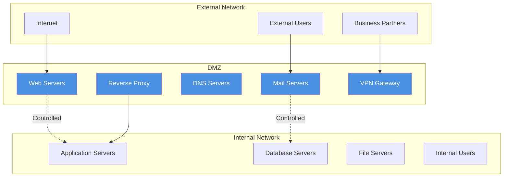

### Security Zones

| Zone | Trust Level | Purpose | Access Rules |
|------|-------------|---------|--------------|
| **External** | Untrusted | Internet, public networks | No access to internal resources |
| **DMZ** | Semi-trusted | Public-facing services | Limited access to internal resources |
| **Internal** | Trusted | Private corporate resources | Full access based on authorization |

### Traffic Flow Principles

1. **External to DMZ**: Allowed for specific services only
2. **DMZ to Internal**: Heavily restricted, specific protocols/ports
3. **Internal to DMZ**: Controlled administrative access
4. **Internal to External**: Through DMZ proxy or direct with filtering
5. **DMZ to External**: Limited, for updates and external dependencies

---

## DMZ Topologies

### 1. Single Firewall DMZ (Three-Legged)

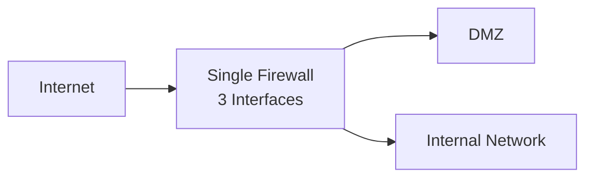

**Characteristics:**
- One firewall with three network interfaces
- Cost-effective for small organizations
- Single point of failure
- Complex rule management

**Use Cases:**
- Small businesses
- Limited public services
- Budget-constrained environments

### 2. Dual Firewall DMZ (Screened Subnet)

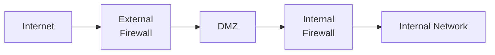

**Characteristics:**
- Two separate firewalls
- True defense in depth
- Better performance and redundancy
- More complex management

**Use Cases:**
- Medium to large enterprises
- High-security requirements
- Compliance mandates

### 3. Multi-Tier DMZ

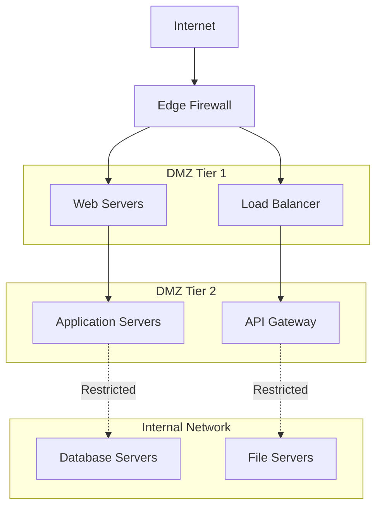

**Characteristics:**
- Multiple DMZ segments
- Granular security controls
- Complex but highly secure
- Supports microservice architectures

**Use Cases:**
- Large enterprises
- Financial services
- Healthcare organizations
- Government agencies

### 4. Virtual DMZ (Cloud/SDN)

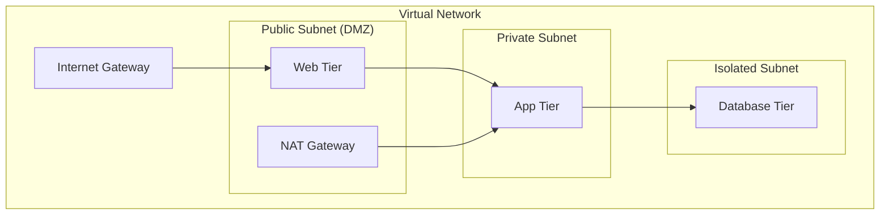

**Characteristics:**
- Software-defined networking
- Cloud-native approach
- Elastic and scalable
- Policy-driven security

---

## DMZ Components and Services

### Typical DMZ Services

| Service | Purpose | Security Considerations |
|---------|---------|------------------------|
| **Web Server** | Host public websites | Hardened OS, regular patches, WAF protection |
| **Mail Server** | Email relay/gateway | Anti-spam, anti-malware, encryption |
| **DNS Server** | Public DNS resolution | Rate limiting, DNS security extensions |
| **FTP/SFTP Server** | File transfers | Encrypted protocols, access controls |
| **VPN Gateway** | Remote access | Strong authentication, encrypted tunnels |
| **Reverse Proxy** | Application delivery | SSL termination, load balancing |
| **Jump Server** | Administrative access | Multi-factor auth, session recording |

### DMZ Infrastructure Components

```mermaid
graph TB
    subgraph "DMZ Infrastructure"
        A[Load Balancer]
        B[Web Application Firewall]
        C[Intrusion Detection System]
        D[Network Monitoring]
        E[Backup Systems]
        F[Certificate Authority]
        G[Time Server (NTP)]
        H[SIEM Collector]
    end
    
    A --> B
    B --> C
    C --> D
    D --> H
```

### Service Hardening Checklist

| Component | Hardening Measures |
|-----------|-------------------|
| **Operating System** | Minimal installation, latest patches, disabled services |
| **Web Server** | Secure configuration, custom error pages, access logging |
| **Database** | Network isolation, encrypted connections, principle of least privilege |
| **Applications** | Input validation, secure coding practices, regular updates |
| **Network** | Firewall rules, intrusion detection, network segmentation |

---

## DMZ Security Controls

### Firewall Rule Design

#### Inbound Rules (External to DMZ)

```
Rule 1: Allow HTTP/HTTPS to Web Servers
Source: Any
Destination: Web Server IPs
Ports: 80, 443
Action: Allow

Rule 2: Allow SMTP to Mail Server
Source: Any
Destination: Mail Server IP
Port: 25
Action: Allow

Rule 3: Allow DNS Queries
Source: Any
Destination: DNS Server IP
Port: 53
Action: Allow

Rule 4: Deny All Other Traffic
Source: Any
Destination: DMZ
Ports: Any
Action: Deny
```

#### Outbound Rules (DMZ to Internal)

```
Rule 1: Allow Web to App Servers
Source: Web Server IPs
Destination: App Server IPs
Port: 8080
Action: Allow

Rule 2: Allow Mail to Internal Mail
Source: Mail Server IP
Destination: Internal Mail IP
Port: 25
Action: Allow

Rule 3: Deny All Other Traffic
Source: DMZ
Destination: Internal Network
Ports: Any
Action: Deny (Log)
```

### Network Access Control Lists (NACLs)

| Direction | Protocol | Port Range | Source/Destination | Action |
|-----------|----------|------------|-------------------|--------|
| Inbound | TCP | 80 | 0.0.0.0/0 | Allow |
| Inbound | TCP | 443 | 0.0.0.0/0 | Allow |
| Inbound | TCP | 25 | 0.0.0.0/0 | Allow |
| Inbound | UDP | 53 | 0.0.0.0/0 | Allow |
| Inbound | ALL | ALL | 0.0.0.0/0 | Deny |
| Outbound | TCP | 8080 | Internal Subnet | Allow |
| Outbound | TCP | 3306 | DB Subnet | Allow |
| Outbound | ALL | ALL | 0.0.0.0/0 | Deny |

### Intrusion Detection and Prevention

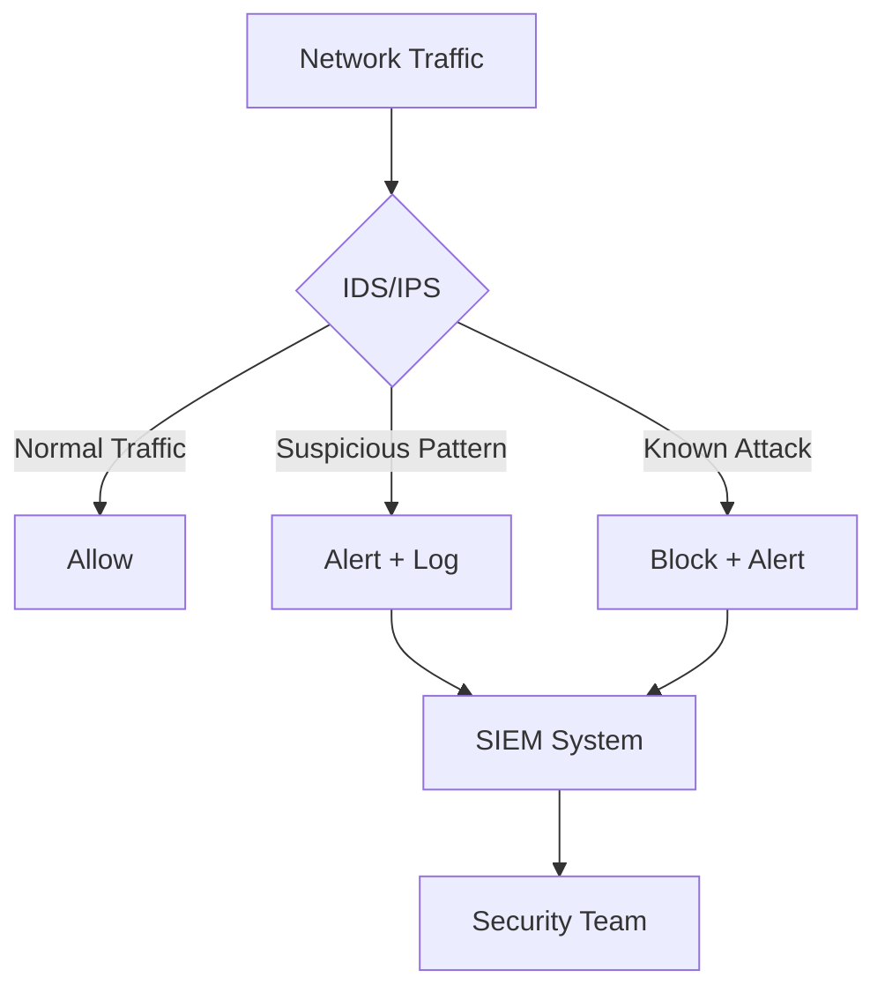

#### IDS/IPS Rule Categories

| Category | Examples | Response |
|----------|----------|----------|
| **Signature-based** | Known exploit patterns | Block/Alert |
| **Anomaly-based** | Unusual traffic patterns | Alert/Monitor |
| **Protocol Analysis** | Protocol violations | Block/Alert |
| **Behavioral Analysis** | User behavior anomalies | Alert/Log |

---

## DMZ Design Patterns

### 1. Reverse Proxy Pattern

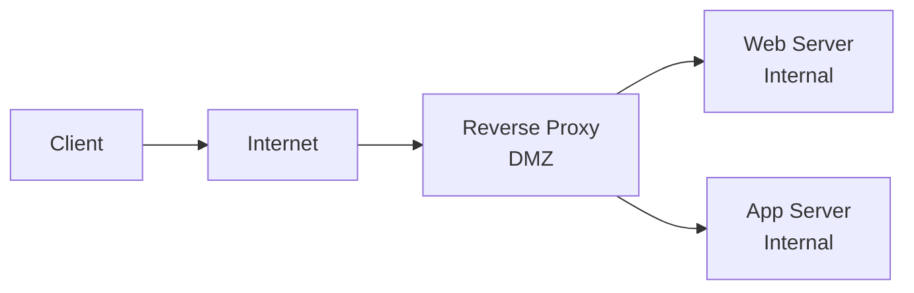

**Benefits:**
- SSL termination in DMZ
- Load balancing capabilities
- Additional security layer
- Caching and compression

**Implementation:**
- Nginx, Apache HTTP Server, HAProxy
- Cloud load balancers (ALB, NLB)
- API gateways

### 2. Bastion Host Pattern

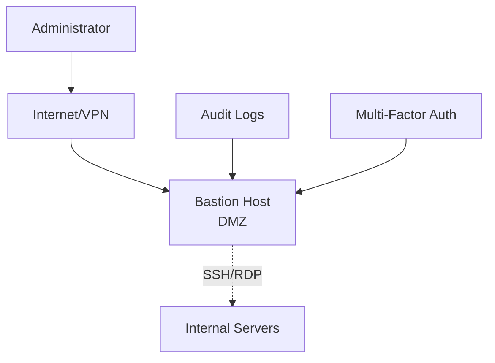

**Characteristics:**
- Hardened jump server
- Centralized access point
- Session monitoring and recording
- Multi-factor authentication

**Security Features:**
- Privileged access management (PAM)
- Session recording
- Time-based access
- Emergency break-glass procedures

### 3. Service Mesh DMZ Pattern

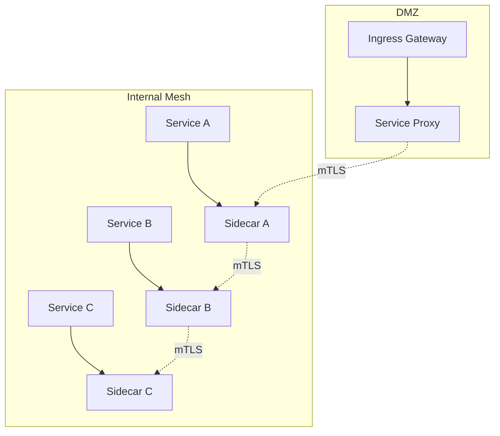

**Modern Approach:**
- Container-native security
- Mutual TLS (mTLS) everywhere
- Policy as code
- Observability built-in

---

## Cloud DMZ Architectures

### AWS DMZ Architecture

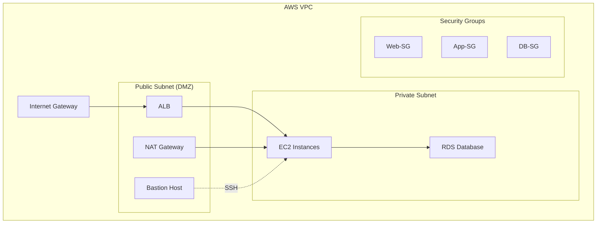

**AWS Components:**
- **VPC**: Virtual Private Cloud for network isolation
- **Subnets**: Public (DMZ) and private subnet separation
- **Security Groups**: Instance-level firewalls
- **NACLs**: Subnet-level network ACLs
- **ALB/NLB**: Application and Network Load Balancers

### Azure DMZ Architecture

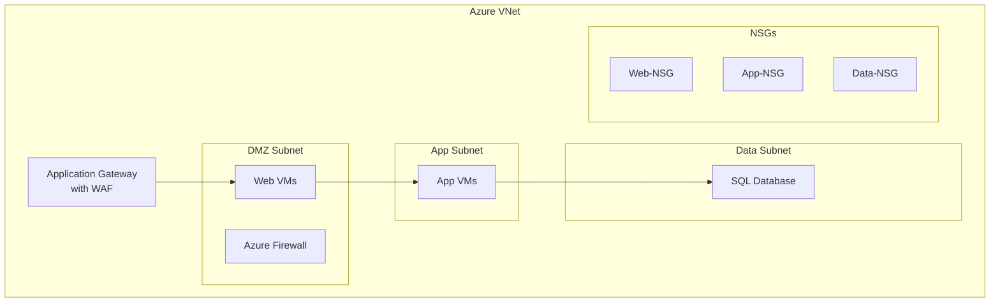

**Azure Components:**
- **VNet**: Virtual Network for isolation
- **Application Gateway**: Layer 7 load balancer with WAF
- **Azure Firewall**: Managed firewall service
- **NSGs**: Network Security Groups for traffic filtering
- **Route Tables**: Custom routing configuration

### Google Cloud DMZ Architecture

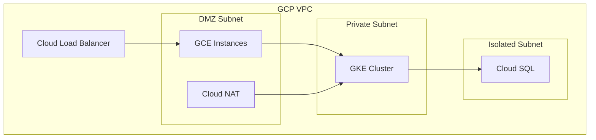

**GCP Components:**
- **VPC**: Virtual Private Cloud
- **Cloud Load Balancer**: Global and regional load balancing
- **Firewall Rules**: Network-level firewall
- **Cloud NAT**: Outbound internet access for private instances
- **Private Google Access**: Access to Google services without external IP

---

## DMZ Implementation Best Practices

### Planning and Design

| Phase | Best Practice | Rationale |
|-------|---------------|-----------|
| **Assessment** | Document current network architecture | Understanding existing topology |
| **Requirements** | Define security and compliance needs | Ensuring adequate protection |
| **Design** | Plan for redundancy and scalability | Supporting business growth |
| **Testing** | Validate design in lab environment | Reducing production risks |

### Security Hardening

#### Operating System Hardening

```bash
# Example Linux hardening steps
# 1. Update system packages
apt update && apt upgrade -y

# 2. Disable unnecessary services
systemctl disable telnet
systemctl disable ftp
systemctl disable rsh

# 3. Configure firewall
ufw enable
ufw default deny incoming
ufw default allow outgoing
ufw allow 80/tcp
ufw allow 443/tcp

# 4. Set up intrusion detection
fail2ban-client start
```

#### Network Configuration

```bash
# Example network security configurations
# 1. Disable IP forwarding (unless required)
echo 'net.ipv4.ip_forward = 0' >> /etc/sysctl.conf

# 2. Enable SYN flood protection
echo 'net.ipv4.tcp_syncookies = 1' >> /etc/sysctl.conf

# 3. Disable ICMP redirect acceptance
echo 'net.ipv4.conf.all.accept_redirects = 0' >> /etc/sysctl.conf

# 4. Apply changes
sysctl -p
```

### Monitoring and Logging

#### Essential Logs to Collect

| Log Type | Source | Purpose |
|----------|--------|---------|
| **Firewall Logs** | Firewall devices | Traffic analysis, rule effectiveness |
| **Web Server Logs** | Apache/Nginx | Access patterns, attack detection |
| **System Logs** | Operating system | System events, security incidents |
| **Network Flow** | Routers/switches | Traffic analysis, anomaly detection |
| **Security Events** | IDS/IPS | Threat detection, incident response |

#### Log Analysis and SIEM Integration

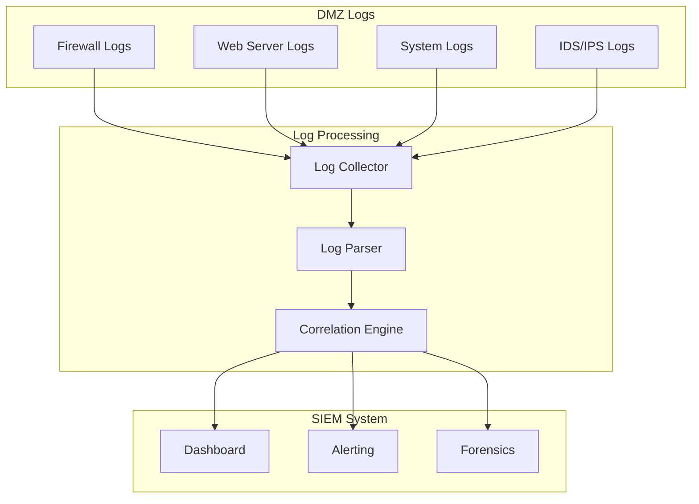

### Maintenance and Updates

#### Regular Maintenance Tasks

| Task | Frequency | Purpose |
|------|-----------|---------|
| **Security Patching** | Monthly | Address vulnerabilities |
| **Rule Review** | Quarterly | Optimize firewall rules |
| **Log Analysis** | Weekly | Detect security incidents |
| **Backup Verification** | Monthly | Ensure recovery capability |
| **Performance Review** | Quarterly | Optimize system performance |
| **Vulnerability Scanning** | Monthly | Identify security gaps |

---

## Common DMZ Scenarios

### E-Commerce DMZ

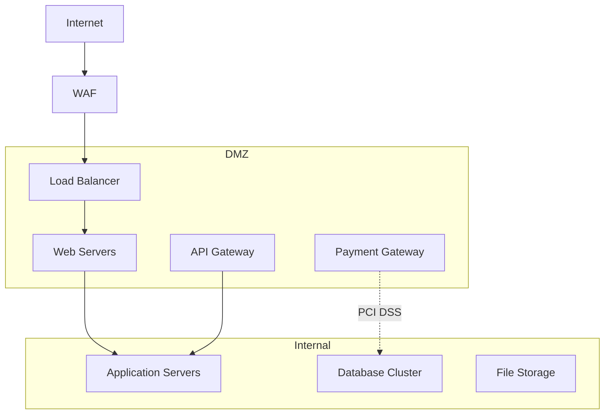

**Key Requirements:**
- PCI DSS compliance
- High availability
- SSL/TLS encryption
- Fraud detection integration

### Enterprise Email DMZ

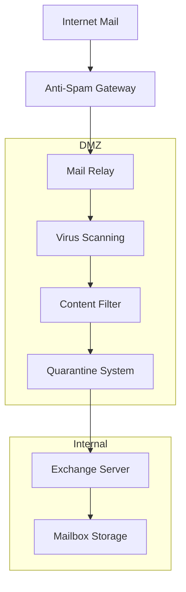

**Security Features:**
- Anti-spam protection
- Malware scanning
- Data loss prevention (DLP)
- Email encryption
- Message archiving

### Remote Access DMZ

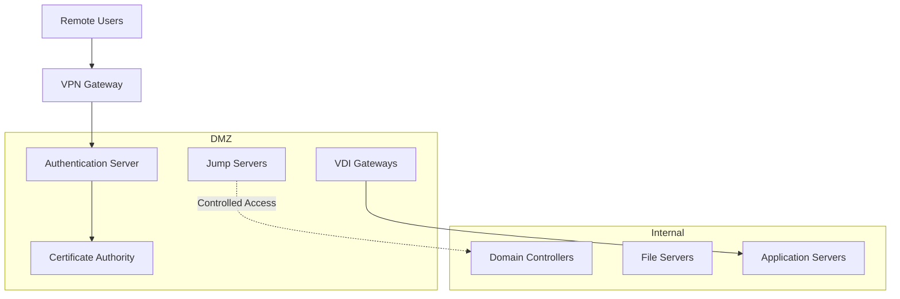

**Access Controls:**
- Multi-factor authentication
- Certificate-based authentication
- Session monitoring
- Privileged access management
- Time-based access controls

---

## Related Topics

### Internal References

- [6.3 Network Security Architecture](./6.3-network-security-architecture.md) - Parent topic
- [6.1 Security Architecture](./6.1-security-architecture.md) - Zero Trust principles
- [6.2 Identity Architecture](./6.2-identity-architecture.md) - Authentication and authorization
- [6.4 Data Security Architecture](./6.4-data-security-architecture.md) - Data protection in transit

### Cloud Implementation Guides

- [Azure Networking](../../architecture-azure/networking/) - Azure DMZ implementations
- [AWS VPC Security](../../architecture-azure/networking/) - AWS DMZ best practices
- [Multi-Cloud Networking](../../architecture-general/05-cloud-infrastructure-platform-architecture/) - Hybrid DMZ architectures

### Standards and Compliance

- [NIST Cybersecurity Framework](https://www.nist.gov/cyberframework) - Security controls
- [CIS Controls](https://www.cisecurity.org/controls) - Implementation guidance
- [PCI DSS](https://www.pcisecuritystandards.org/) - Payment card industry standards
- [ISO 27001](https://www.iso.org/isoiec-27001-information-security.html) - Information security management

### Tools and Technologies

- **Firewall Solutions**: Palo Alto, Fortinet, Check Point, pfSense
- **Cloud Firewalls**: Azure Firewall, AWS WAF, Google Cloud Armor
- **IDS/IPS**: Snort, Suricata, Cisco Sourcefire
- **Monitoring**: Splunk, ELK Stack, Azure Sentinel, AWS Security Hub