# 6.4 Data Security Architecture

## Overview

Data Security Architecture encompasses the strategies, frameworks, and technologies used to protect data throughout its lifecycle. It addresses how data is encrypted, how cryptographic keys are managed, how sensitive computations are protected, and how privacy is embedded into system design from the ground up.

Data security is a critical component of any organization's overall security posture, ensuring confidentiality, integrity, and availability of information assets.

## Table of Contents

- [Encryption Architecture](#encryption-architecture)
- [Key Management (HSM / KMS)](#key-management-hsm--kms)
- [Confidential Computing](#confidential-computing)
- [Privacy-by-Design Architecture](#privacy-by-design-architecture)
- [Best Practices](#best-practices)
- [Related Resources](#related-resources)

---

## Encryption Architecture

### Concept

Encryption architecture defines how cryptographic algorithms and protocols are applied to protect data at rest, in transit, and in use. It establishes standards for encryption strength, algorithm selection, and implementation patterns.

### Types of Encryption

```
┌─────────────────────────────────────────────────────────────────┐
│                    ENCRYPTION TYPES                             │
├─────────────────────────────────────────────────────────────────┤
│  Data at Rest        │  Protects stored data (databases,       │
│                      │  file systems, backups, archives)        │
├──────────────────────┼──────────────────────────────────────────┤
│  Data in Transit     │  Protects data moving across networks   │
│                      │  (TLS, HTTPS, VPNs, secure channels)    │
├──────────────────────┼──────────────────────────────────────────┤
│  Data in Use         │  Protects data during processing        │
│                      │  (Confidential computing, enclaves)     │
└─────────────────────────────────────────────────────────────────┘
```

### Encryption Architecture Overview

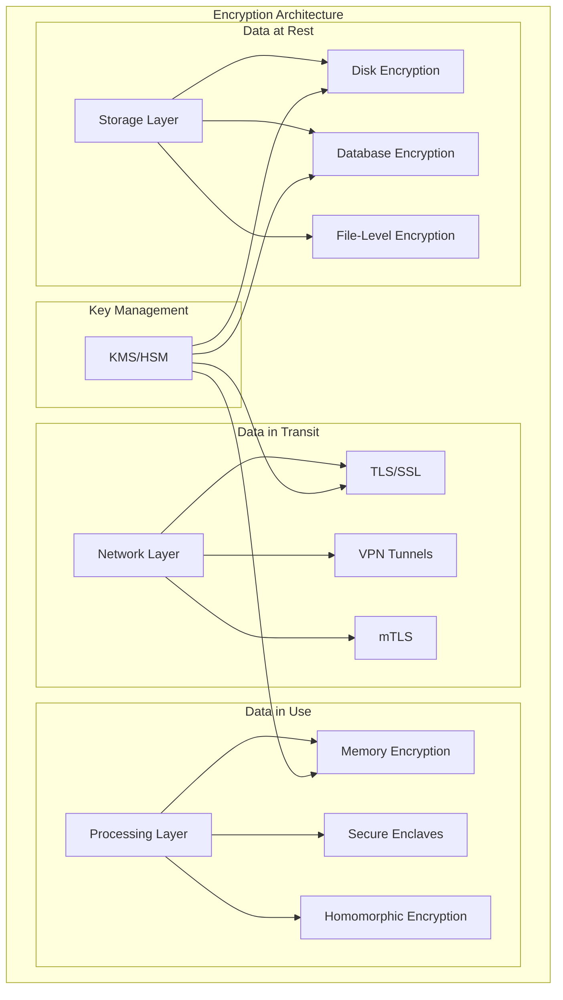

### Symmetric vs Asymmetric Encryption

| Aspect | Symmetric Encryption | Asymmetric Encryption |
|--------|---------------------|----------------------|
| **Keys** | Single shared key | Public/Private key pair |
| **Speed** | Fast | Slower |
| **Use Case** | Bulk data encryption | Key exchange, digital signatures |
| **Examples** | AES, ChaCha20 | RSA, ECC, Ed25519 |
| **Key Distribution** | Challenging | Easier (public key can be shared) |

### Common Encryption Algorithms

| Algorithm | Type | Key Size | Use Case |
|-----------|------|----------|----------|
| **AES-256** | Symmetric | 256 bits | Data at rest, general encryption |
| **AES-GCM** | Symmetric (AEAD) | 128/256 bits | Authenticated encryption |
| **ChaCha20-Poly1305** | Symmetric (AEAD) | 256 bits | High-performance encryption |
| **RSA** | Asymmetric | 2048-4096 bits | Key exchange, signatures |
| **ECDSA** | Asymmetric | 256-384 bits | Digital signatures |
| **Ed25519** | Asymmetric | 256 bits | Modern signatures |

### Encryption Implementation Layers

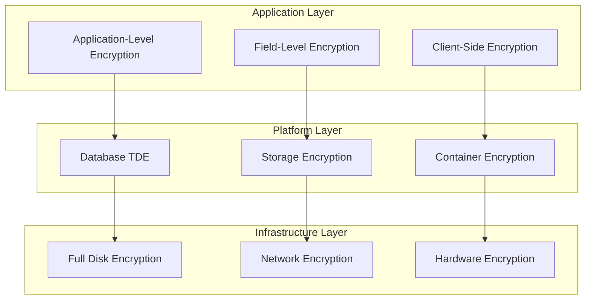

### Transparent Data Encryption (TDE)

TDE encrypts database files at the storage level without requiring application changes.

**Architecture Flow:**

```
┌─────────────────────────────────────────────────────────────────┐
│                    TDE ARCHITECTURE                             │
├─────────────────────────────────────────────────────────────────┤
│                                                                 │
│  ┌─────────────┐    ┌─────────────┐    ┌─────────────┐        │
│  │ Application │───▶│  Database   │───▶│  Encrypted  │        │
│  │   Query     │    │   Engine    │    │   Storage   │        │
│  └─────────────┘    └──────┬──────┘    └─────────────┘        │
│                            │                                    │
│                     ┌──────▼──────┐                            │
│                     │     DEK     │  Database Encryption Key   │
│                     └──────┬──────┘                            │
│                            │                                    │
│                     ┌──────▼──────┐                            │
│                     │     KEK     │  Key Encryption Key        │
│                     └──────┬──────┘                            │
│                            │                                    │
│                     ┌──────▼──────┐                            │
│                     │  KMS/HSM    │  Secure Key Storage        │
│                     └─────────────┘                            │
│                                                                 │
└─────────────────────────────────────────────────────────────────┘
```

### Envelope Encryption Pattern

Envelope encryption uses a hierarchy of keys to protect data efficiently:

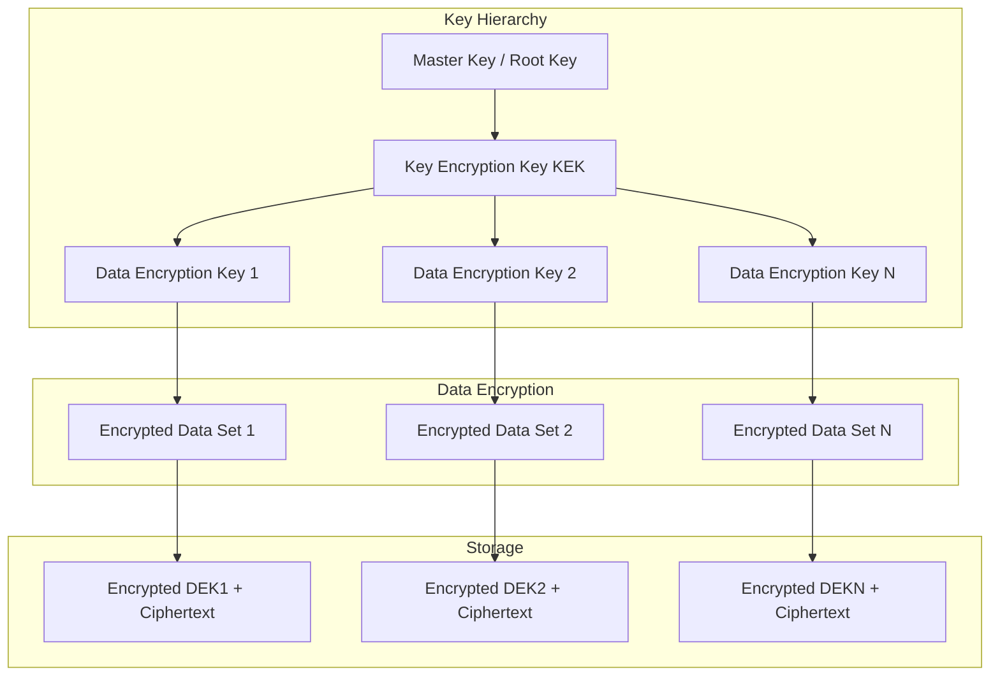

**Benefits of Envelope Encryption:**
- Limits the amount of data encrypted with a single key
- Enables efficient key rotation (only re-encrypt DEKs, not all data)
- Reduces exposure if a DEK is compromised
- Allows different DEKs for different data classifications

---

## Key Management (HSM / KMS)

### Concept

Key Management encompasses the policies, procedures, and technology used to generate, store, distribute, rotate, and revoke cryptographic keys. Proper key management is essential for maintaining the security of encrypted data.

### Key Lifecycle


### Key Management System (KMS) Architecture

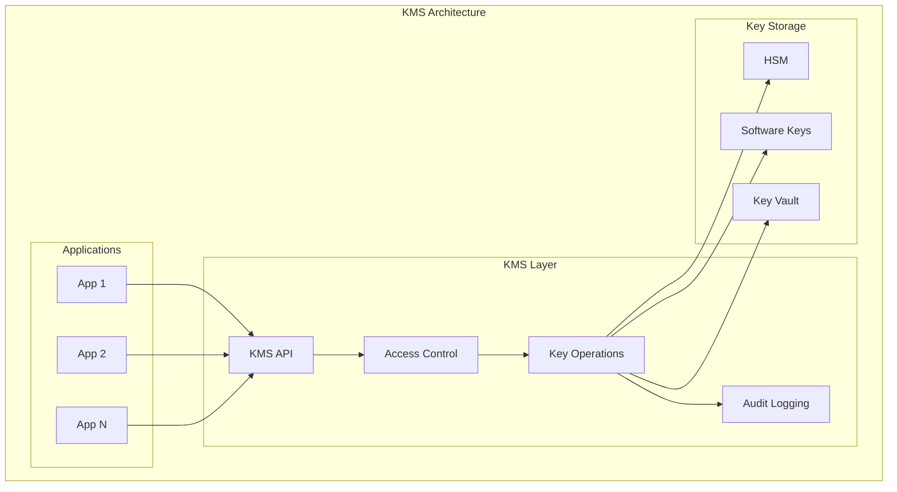

### Hardware Security Module (HSM)

HSMs are dedicated hardware devices that provide secure key storage and cryptographic operations.

```
┌─────────────────────────────────────────────────────────────────┐
│                    HSM CHARACTERISTICS                          │
├─────────────────────────────────────────────────────────────────┤
│  Tamper Resistance  │  Physical protection against attacks     │
├─────────────────────┼───────────────────────────────────────────┤
│  Key Isolation      │  Keys never leave the HSM boundary       │
├─────────────────────┼───────────────────────────────────────────┤
│  Certified Security │  FIPS 140-2/3, Common Criteria           │
├─────────────────────┼───────────────────────────────────────────┤
│  High Performance   │  Hardware-accelerated crypto operations  │
├─────────────────────┼───────────────────────────────────────────┤
│  Audit Trail        │  Comprehensive logging of operations     │
└─────────────────────────────────────────────────────────────────┘
```

### HSM Types Comparison

| Type | Description | Use Case | Examples |
|------|-------------|----------|----------|
| **On-Premises HSM** | Physical device in data center | Highest security requirements | Thales Luna, Entrust nShield |
| **Cloud HSM** | Dedicated HSM in cloud | Cloud workloads needing FIPS 140-2 Level 3 | AWS CloudHSM, Azure Dedicated HSM |
| **Managed KMS** | Cloud-managed key service | General cloud encryption | AWS KMS, Azure Key Vault, GCP Cloud KMS |

### Key Hierarchy Design

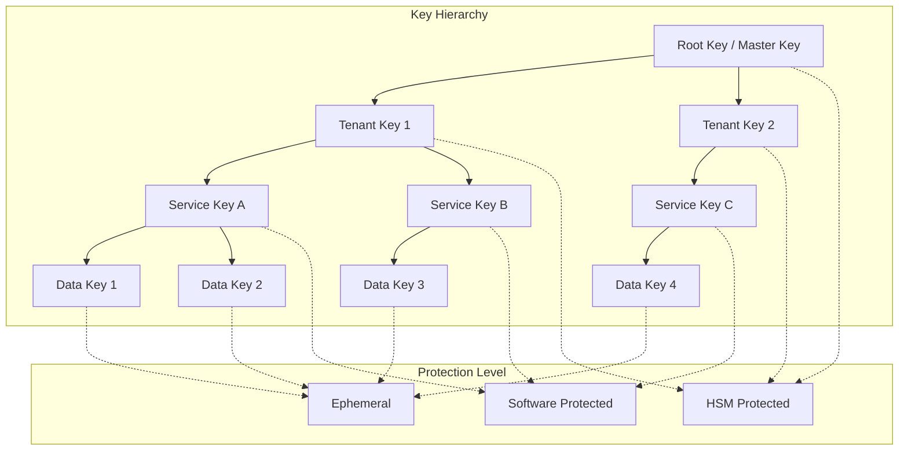

### Key Rotation Strategies

| Strategy | Description | Frequency | Impact |
|----------|-------------|-----------|--------|
| **Scheduled Rotation** | Automatic rotation on schedule | 30-365 days | Low - automated |
| **On-Demand Rotation** | Manual rotation when needed | As required | Medium - planned |
| **Emergency Rotation** | Immediate rotation after incident | Immediate | High - urgent |
| **Crypto Agility** | Algorithm upgrade rotation | As standards evolve | High - significant |

### BYOK (Bring Your Own Key)

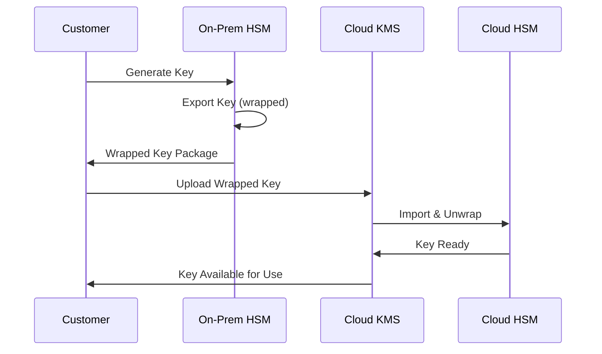

### Key Management Best Practices

1. **Separation of Duties**
   - Different roles for key creation, usage, and destruction
   - No single person has complete control

2. **Key Escrow and Recovery**
   - Secure backup procedures for critical keys
   - Documented recovery processes

3. **Access Controls**
   - Role-based access to keys
   - Multi-person authorization for sensitive operations

4. **Monitoring and Auditing**
   - Log all key operations
   - Alert on suspicious activities

---

## Confidential Computing

### Concept

Confidential Computing protects data in use by performing computation in a hardware-based Trusted Execution Environment (TEE). This ensures data remains encrypted even during processing, protecting against unauthorized access including from cloud providers and system administrators.

### The Data Protection Gap

```
┌─────────────────────────────────────────────────────────────────┐
│              TRADITIONAL DATA PROTECTION                        │
├─────────────────────────────────────────────────────────────────┤
│                                                                 │
│    ┌─────────────┐    ┌─────────────┐    ┌─────────────┐      │
│    │  At Rest    │    │  In Transit │    │   In Use    │      │
│    │  ✓ Protected│    │  ✓ Protected│    │  ✗ Exposed  │      │
│    │  (Encrypted)│    │  (TLS/SSL)  │    │  (Plaintext)│      │
│    └─────────────┘    └─────────────┘    └─────────────┘      │
│                                                                 │
├─────────────────────────────────────────────────────────────────┤
│              CONFIDENTIAL COMPUTING                             │
├─────────────────────────────────────────────────────────────────┤
│                                                                 │
│    ┌─────────────┐    ┌─────────────┐    ┌─────────────┐      │
│    │  At Rest    │    │  In Transit │    │   In Use    │      │
│    │  ✓ Protected│    │  ✓ Protected│    │  ✓ Protected│      │
│    │  (Encrypted)│    │  (TLS/SSL)  │    │  (Enclave)  │      │
│    └─────────────┘    └─────────────┘    └─────────────┘      │
│                                                                 │
└─────────────────────────────────────────────────────────────────┘
```

### Trusted Execution Environment (TEE) Architecture

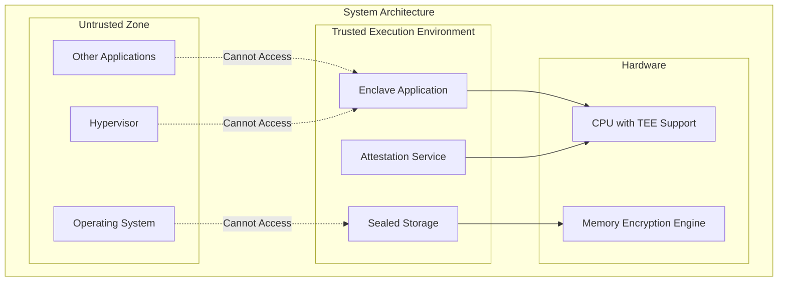

### TEE Technologies Comparison

| Technology | Vendor | Type | Key Features |
|------------|--------|------|--------------|
| **Intel SGX** | Intel | Process-based | Small enclave size, attestation, sealing |
| **AMD SEV/SNP** | AMD | VM-based | Full VM encryption, memory integrity |
| **ARM TrustZone** | ARM | World-based | Secure world isolation, mobile focus |
| **Intel TDX** | Intel | VM-based | Trust domains, scalable protection |
| **AWS Nitro Enclaves** | AWS | VM-based | Isolated compute, attestation |

### Attestation Flow

Attestation proves that code is running in a genuine TEE with expected configuration.

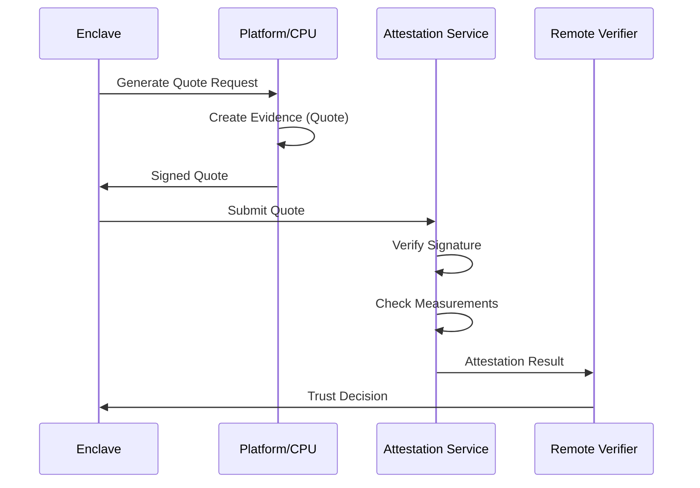

### Confidential Computing Use Cases

| Use Case | Description | Benefit |
|----------|-------------|---------|
| **Multi-party Computation** | Multiple parties compute on combined data | No party sees others' raw data |
| **Secure AI/ML** | Train models on sensitive data | Protect training data and model |
| **Healthcare Analytics** | Process patient data | HIPAA compliance, privacy |
| **Financial Services** | Cross-institution analysis | Regulatory compliance |
| **Key Management** | Protect cryptographic operations | Keys never exposed |

### Confidential Computing Architecture Pattern

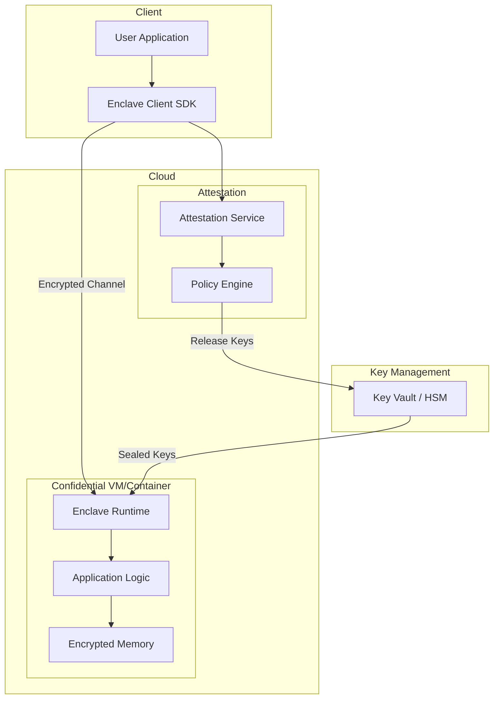

---

## Privacy-by-Design Architecture

### Concept

Privacy-by-Design (PbD) is an approach that embeds privacy into the design and architecture of IT systems and business practices from the outset, rather than as an afterthought.

### The Seven Foundational Principles

```
┌─────────────────────────────────────────────────────────────────┐
│              PRIVACY-BY-DESIGN PRINCIPLES                       │
├─────────────────────────────────────────────────────────────────┤
│  1. Proactive not Reactive      │  Anticipate privacy risks    │
├─────────────────────────────────┼───────────────────────────────┤
│  2. Privacy as Default          │  Maximum privacy by default  │
├─────────────────────────────────┼───────────────────────────────┤
│  3. Privacy in Design           │  Core functionality, not add-on│
├─────────────────────────────────┼───────────────────────────────┤
│  4. Full Functionality          │  Privacy + Security together │
├─────────────────────────────────┼───────────────────────────────┤
│  5. End-to-End Lifecycle        │  Cradle to grave protection  │
├─────────────────────────────────┼───────────────────────────────┤
│  6. Visibility & Transparency   │  Open and verifiable         │
├─────────────────────────────────┼───────────────────────────────┤
│  7. User-Centric                │  Respect user privacy        │
└─────────────────────────────────────────────────────────────────┘
```

### Privacy Architecture Framework

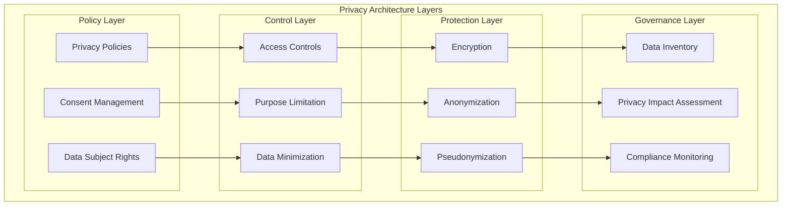

### Data Minimization Strategies

| Strategy | Description | Implementation |
|----------|-------------|----------------|
| **Collection Limitation** | Only collect necessary data | Field-level validation, purpose-driven forms |
| **Storage Limitation** | Retain only as long as needed | Retention policies, automatic deletion |
| **Access Limitation** | Restrict who can see data | RBAC, need-to-know basis |
| **Processing Limitation** | Only process for stated purpose | Purpose binding, audit trails |

### Anonymization vs Pseudonymization

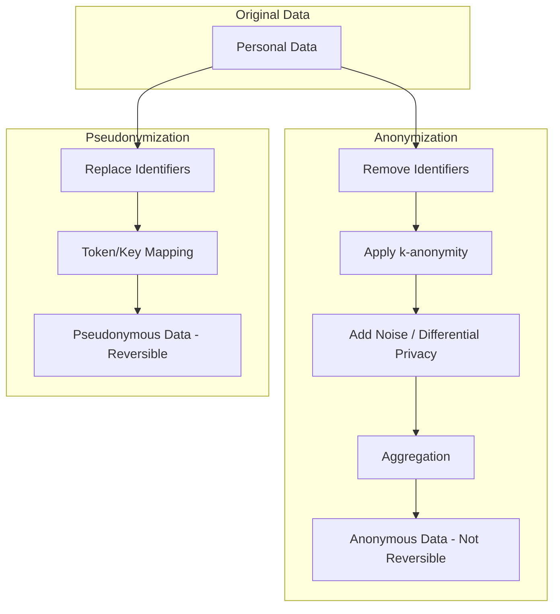

### Privacy-Enhancing Technologies (PETs)

| Technology | Description | Use Case |
|------------|-------------|----------|
| **Differential Privacy** | Add noise to query results | Analytics on sensitive data |
| **Homomorphic Encryption** | Compute on encrypted data | Outsourced computation |
| **Secure Multi-party Computation** | Joint computation, no data sharing | Collaborative analytics |
| **Zero-Knowledge Proofs** | Prove without revealing | Identity verification |
| **Federated Learning** | Train ML without centralizing data | Privacy-preserving AI |
| **Synthetic Data** | Generate artificial datasets | Testing, development |

### Data Subject Rights Architecture

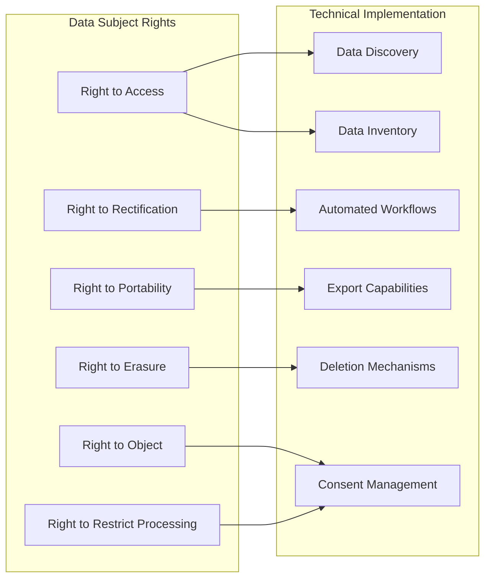

### Privacy Architecture for GDPR/CCPA Compliance

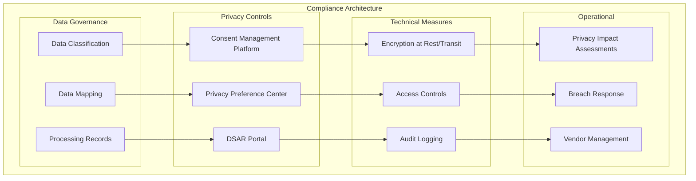

---

## Best Practices

### Encryption Best Practices

1. **Use Strong, Modern Algorithms**
   - AES-256 for symmetric encryption
   - RSA-2048+ or ECC for asymmetric
   - Avoid deprecated algorithms (DES, 3DES, MD5, SHA-1)

2. **Implement Defense in Depth**
   - Layer encryption at multiple levels
   - Don't rely on a single encryption point

3. **Secure Key Management**
   - Use HSMs for high-value keys
   - Implement proper key rotation
   - Never hardcode keys in source code

4. **Validate Implementations**
   - Use well-tested crypto libraries
   - Avoid custom cryptographic implementations
   - Regular security assessments

### Key Management Best Practices

1. **Centralize Key Management**
   - Use enterprise KMS solutions
   - Maintain key inventory

2. **Implement Least Privilege**
   - Separate key admin from key usage
   - Role-based access controls

3. **Plan for Key Recovery**
   - Document recovery procedures
   - Test recovery regularly

4. **Monitor and Audit**
   - Log all key operations
   - Alert on anomalies

### Privacy Best Practices

1. **Data Minimization**
   - Collect only what's needed
   - Delete when no longer required

2. **Purpose Limitation**
   - Use data only for stated purposes
   - Document processing activities

3. **Transparency**
   - Clear privacy notices
   - Easy-to-use consent mechanisms

4. **Security Measures**
   - Encrypt personal data
   - Implement access controls
   - Regular privacy assessments

---

## Related Resources

### Internal References

- [6.1 Security Architecture](./6.1-security-architecture.md) - Zero Trust, Defense in Depth
- [6.2 Identity Architecture](./6.2-identity-architecture.md) - Identity Management, Authentication
- [6.3 Network Security Architecture](./6.3-network-security-architecture.md) - Network Security Controls

### External Resources

- [NIST Cryptographic Standards](https://csrc.nist.gov/publications/fips)
- [Confidential Computing Consortium](https://confidentialcomputing.io/)
- [GDPR Official Text](https://gdpr.eu/)
- [CCPA Resources](https://oag.ca.gov/privacy/ccpa)
- [Privacy by Design Principles](https://www.ipc.on.ca/wp-content/uploads/resources/7foundationalprinciples.pdf)

### Azure Implementation

- [Azure Key Vault](../../architecture-azure/security/)
- [Azure Confidential Computing](../../architecture-azure/security/)
- [Azure Information Protection](../../architecture-azure/security/)
