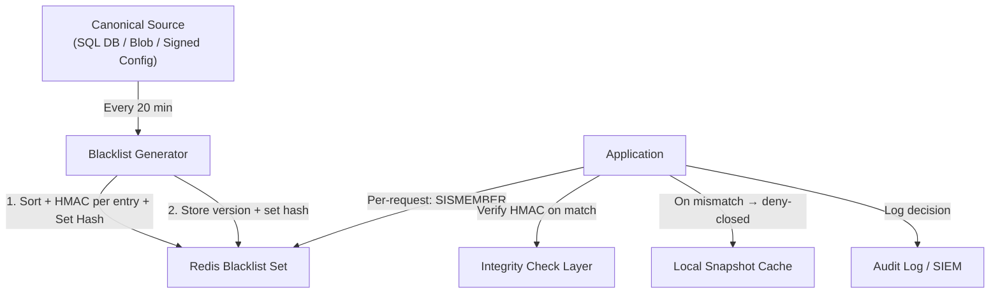

# 6.4.2 Redis Blacklist Integrity — Defense in Depth

> **Taxonomy Reference**: §6.4 Data Security  
> **Azure Services**: [Azure Cache for Redis](../../../architecture-azure/data/) · [Azure Key Vault](../../../architecture-azure/security/)  
> **Dictionary**: [Caching Architecture](../../../reference-dictionary/caching.md) · [HSM & Cryptography](../../../reference-dictionary/hsm-cryptography.md) · [Resilience](../../../reference-dictionary/resilience.md)

---

## Table of Contents

- [Problem Statement](#problem-statement)
- [Redis Strengths and Security Gaps](#redis-strengths-and-security-gaps)
- [Defense-in-Depth Architecture](#defense-in-depth-architecture)
- [Integrity Check Model](#integrity-check-model)
  - [Layer 1 — Per-Entry HMAC (Runtime Integrity)](#layer-1--per-entry-hmac-runtime-integrity)
  - [Layer 2 — Versioned Set Hash (Bulk Reconciliation)](#layer-2--versioned-set-hash-bulk-reconciliation)
  - [Refresh Job (Atomic Swap + Post-Refresh Verification)](#refresh-job-atomic-swap--post-refresh-verification)
  - [Per-Request Hot Path (Lua + Selective HMAC)](#per-request-hot-path-lua--selective-hmac)
- [Threat Model Summary](#threat-model-summary)
- [Key Configuration](#key-configuration)
- [Deny-Open vs. Deny-Closed Decision](#deny-open-vs-deny-closed-decision)
- [Best Practices](#best-practices)
- [Related Resources](#related-resources)

---

## Problem Statement

A blacklist system checks every incoming request against a set of blocked identifiers (users, IPs, domains). The blacklist lives in Redis for sub-millisecond lookups and is refreshed every 20 minutes from a canonical source. With 5,000 entries, the scale is modest — but the **trust question** is critical:

> **Is Redis secure enough to be the sole authority for a security-critical blacklist?**

The concern is not performance. Redis is fast, atomic, and reliable for lookups. The concern is **trust**: if Redis is compromised, corrupted, or rolled back, the blacklist becomes a single point of security failure. An attacker who controls Redis can delete entries, forge bypasses, or restore an old snapshot that no longer contains newly blocked threats.

This document presents a **defense-in-depth integrity model** that treats Redis as a hot cache — not a source of truth — and layers cryptographic verification on every read.

---

## Redis Strengths and Security Gaps

### What Redis Does Well (for Blacklists)

| Property | Redis Behavior |
|:---|:---|
| **Lookup speed** | Sub-millisecond `SISMEMBER` — ideal for per-request checks |
| **Atomicity** | Single-threaded command execution avoids race conditions on individual keys |
| **Persistence options** | RDB snapshots + AOF can survive restarts |
| **Replication** | Async replication to secondaries for read scale |
| **ACLs (Redis 6+)** | Per-user command restrictions and key-prefix isolation |

### The Security Gaps

| Gap | Risk |
|:---|:---|
| **No integrity verification** | Nothing prevents a compromised process or bug from corrupting or deleting entries. No cryptographic signing of entries. |
| **Weak authentication (pre-Redis 6)** | Single shared password (`requirepass`), no MFA, no token rotation, no enterprise identity integration. |
| **Availability risks** | In-memory — node crash loses recent writes. Async replication means primary failure can lose the latest updates. Sentinel/Cluster failover is not instantaneous. |
| **No audit trail** | No built-in log of who read or modified which keys. No forensic trail if an entry is removed maliciously. |
| **Network exposure** | Without TLS, any compromised service on the same network can sniff or inject traffic. Even with TLS, trusting raw Redis responses without validation means trusting the entire deployment pipeline. |

---

## Defense-in-Depth Architecture

Rather than asking "can I trust Redis?", layer controls so no single component is the trust anchor:



### The Five Layers

| Layer | Mechanism | Protects Against |
|:---|:---|:---|
| **1. Per-Entry HMAC** | HMAC-SHA256(version ∥ entry, app-secret) on every Redis member | Entry forgery, modification |
| **2. Versioned Set Hash** | SHA-256 of all sorted entries + version, stored and verified post-refresh | Bulk corruption, partial writes |
| **3. Atomic Refresh** | `SADD` to temp key → `RENAME` to live key | Incomplete/partial population |
| **4. Deny-Closed Fallback** | Local snapshot cache for Redis outages; block on integrity failure | Redis unavailable, tampering detected |
| **5. Audit Trail** | Log every allow/block decision to tamper-resistant store | Forensic capability |

---

## Integrity Check Model

### Context

- **Scale**: 5,000 blacklist entries
- **Refresh interval**: 20 minutes
- **Failure mode**: Deny-closed (block on integrity failure)
- **Secret**: HMAC key lives only in the application, never in Redis

### Layer 1 — Per-Entry HMAC (Runtime Integrity)

Each blacklist entry stored in Redis carries its own HMAC. On every `SISMEMBER` match, the application verifies the returned entry hasn't been tampered with.

**Redis Set Member Format**:

```
<base64_hmac>.<base64_entry>

Example:
  "q83Jf2kLmNpR...==.dXNlcjQyQGJhZC1kb21haW4uY29t"
   └── HMAC-SHA256 ──┘ └────── base64(entry) ──────┘
```

**Python Implementation**:

```python
import hashlib
import hmac
import base64
import time
from typing import List, Optional

class BlacklistIntegrity:
    """
    Per-entry HMAC + versioned set-hash integrity for Redis blacklists.

    Security properties:
    - Attacker who controls Redis cannot forge or modify entries
      without knowing the HMAC secret.
    - Version check prevents rollback attacks (attacker restoring
      an old blacklist snapshot).
    - Deny-closed on any integrity failure.
    """

    def __init__(self, hmac_secret: bytes):
        # This key lives ONLY in the application, never in Redis
        self._secret = hmac_secret

    # ── Generation (run every 20 min from canonical source) ──

    def prepare_entries(self, entries: List[str], version: int) -> dict:
        """
        Called by the refresh job. Takes canonical entries, returns
        what to store in Redis.
        """
        sorted_entries = sorted(entries)  # Deterministic ordering
        signed_entries = []
        for entry in sorted_entries:
            signed = self._sign_entry(entry, version)
            signed_entries.append(signed)

        # Bulk integrity fingerprint of the entire set
        set_hash = self._compute_set_hash(sorted_entries, version)

        return {
            "entries": signed_entries,
            "version": version,
            "set_hash": set_hash,
        }

    def _sign_entry(self, entry: str, version: int) -> str:
        """HMAC-SHA256(version || entry, secret) → base64"""
        message = f"{version}:{entry}".encode("utf-8")
        sig = hmac.new(self._secret, message, hashlib.sha256).digest()
        return (
            f"{base64.urlsafe_b64encode(sig).decode()}"
            f".{base64.urlsafe_b64encode(entry.encode()).decode()}"
        )

    def _compute_set_hash(
        self, sorted_entries: List[str], version: int
    ) -> str:
        """SHA-256 of all entries concatenated (deterministic because sorted)"""
        joined = f"{version}:" + ",".join(sorted_entries)
        return hashlib.sha256(joined.encode()).hexdigest()

    # ── Runtime verification (per-request) ──

    def verify_entry(
        self, signed_entry: str, expected_version: int
    ) -> Optional[str]:
        """
        Verify a single entry retrieved from Redis.
        Returns the raw entry if valid, None if tampered.
        """
        try:
            sig_b64, entry_b64 = signed_entry.split(".", 1)
        except ValueError:
            return None  # Malformed entry

        entry = base64.urlsafe_b64decode(entry_b64).decode("utf-8")
        expected_sig = base64.urlsafe_b64decode(sig_b64)

        message = f"{expected_version}:{entry}".encode("utf-8")
        computed_sig = hmac.new(
            self._secret, message, hashlib.sha256
        ).digest()

        if not hmac.compare_digest(computed_sig, expected_sig):
            return None  # HMAC mismatch — entry tampered

        return entry

    # ── Periodic full reconciliation ──

    def verify_set_integrity(
        self,
        entries: List[str],
        stored_set_hash: str,
        stored_version: int,
        expected_version: int,
    ) -> bool:
        """
        Full audit: recompute the set hash and compare.
        Run this after each 20-min refresh completes.
        """
        if stored_version != expected_version:
            return False  # Rollback attack or stale data

        sorted_entries = sorted(entries)
        computed_hash = self._compute_set_hash(
            sorted_entries, expected_version
        )
        return hmac.compare_digest(computed_hash, stored_set_hash)
```

### Redis Key Structure

```
blacklist:v3:entries     SET    { signed_entry_1, signed_entry_2, ... }
blacklist:v3:version     STRING "1718635200"           (monotonic Unix timestamp)
blacklist:v3:set_hash    STRING "a1b2c3d4e5f6..."      (SHA-256 hex)
blacklist:v3:generated   STRING "2026-06-17T14:30:00Z"
blacklist:active_version STRING "1718635200"           (current active version pointer)
```

### Layer 2 — Versioned Set Hash (Bulk Reconciliation)

The set hash provides a single fingerprint of the entire blacklist. After every refresh, recompute and compare. This catches bulk corruption, partial writes, and rollback attacks.

| Check | Frequency | Cost | Detects |
|:---|:---|:---|:---|
| Set hash vs. canonical | Every 20 min (post-refresh) | O(5K) hash — ~5ms | Bulk corruption, partial population |
| Entry count match | Every refresh | O(1) — `SCARD` | Missing entries |
| Version monotonicity | Every refresh | O(1) | Rollback attack |
| Random spot-checks | Every 5 min (background) | O(1) per check | Silent corruption between refreshes |

---

### Refresh Job (Atomic Swap + Post-Refresh Verification)

The refresh job runs every 20 minutes. It uses a **temp key + RENAME** pattern to ensure the live blacklist switches atomically — avoiding any window where the set is partially populated.

```python
import redis
import time
import os

def refresh_blacklist(canonical_entries: List[str]):
    r = redis.Redis(
        host=os.environ["REDIS_HOST"],
        port=6380,
        ssl=True,
        password=os.environ["REDIS_PASSWORD"],
    )
    integrity = BlacklistIntegrity(
        hmac_secret=bytes.fromhex(os.environ["BLACKLIST_HMAC_KEY"])
    )

    version = int(time.time())  # Monotonic version stamp

    prepared = integrity.prepare_entries(canonical_entries, version)

    # Atomic swap using a temporary key + RENAME
    temp_key = f"blacklist:tmp:{version}"
    live_key = "blacklist:v3:entries"

    pipe = r.pipeline()
    # Write to temp key first
    pipe.delete(temp_key)
    pipe.sadd(temp_key, *prepared["entries"])
    pipe.set(f"{temp_key}:version", version)
    pipe.set(f"{temp_key}:set_hash", prepared["set_hash"])
    # Atomic rename (avoids window where set is partially populated)
    pipe.rename(temp_key, live_key)
    pipe.rename(f"{temp_key}:version", f"{live_key}:version")
    pipe.rename(f"{temp_key}:set_hash", f"{live_key}:set_hash")
    pipe.execute()

    # ── POST-REFRESH VERIFICATION (critical!) ──
    # Read back and verify the full set
    stored_entries_raw = r.smembers(live_key)
    stored_entries = []
    for raw in stored_entries_raw:
        entry = integrity.verify_entry(raw.decode(), version)
        if entry is None:
            raise SecurityError(
                "INTEGRITY FAILURE: entry tampered post-refresh!"
            )
        stored_entries.append(entry)

    stored_hash = r.get(f"{live_key}:set_hash").decode()
    if not integrity.verify_set_integrity(
        stored_entries, stored_hash, version, version
    ):
        raise SecurityError(
            "INTEGRITY FAILURE: set hash mismatch post-refresh!"
        )

    # Swap the active version pointer LAST (atomic)
    r.set("blacklist:active_version", version)
```

> **Why RENAME instead of overwriting in place?**
> `SADD` to a temp key followed by `RENAME` is atomic in Redis. If the process crashes mid-population, the live key is untouched. Without this, a crash during `SADD` leaves a half-populated blacklist.

---

### Per-Request Hot Path (Lua + Selective HMAC)

Iterating 5,000 entries in Python on every request is too slow. The optimized approach:

1. **Lua `SISMEMBER`** is O(1) — find the match in Redis
2. **HMAC verify only the matched entry** — 1 HMAC check per request, not 5,000

```lua
-- check_blacklist.lua
-- KEYS[1] = blacklist entries set
-- KEYS[2] = version key
-- ARGV[1] = base64-encoded target entry (prefix for matching)

local version = redis.call('GET', KEYS[2])
if not version then return -1 end  -- No blacklist → deny

-- SISMEMBER is O(1)
local found = redis.call('SISMEMBER', KEYS[1], ARGV[1])
return found
```

```python
def is_blacklisted(user_id: str) -> bool:
    """
    Per-request blacklist check with integrity verification.
    - Lua SISMEMBER for O(1) lookup
    - HMAC verify only on match (1 HMAC/request)
    - Deny-closed on any failure
    """
    r = redis.Redis(
        host=os.environ["REDIS_HOST"],
        port=6380,
        ssl=True,
        password=os.environ["REDIS_PASSWORD"],
    )
    integrity = BlacklistIntegrity(
        hmac_secret=bytes.fromhex(os.environ["BLACKLIST_HMAC_KEY"])
    )

    active_version = int(r.get("blacklist:active_version") or 0)
    if active_version == 0:
        log_alert("blacklist_version_missing")
        return True  # Deny-closed: no blacklist loaded → block

    # Call Lua script for O(1) SISMEMBER
    check_script = r.register_script(CHECK_BLACKLIST_LUA)
    result = check_script(
        keys=["blacklist:v3:entries", "blacklist:active_version"],
        args=[user_id],
    )

    if result == -1:
        return True  # Deny-closed

    if result == 1:
        # Found a match — verify HMAC (only 1 HMAC per request)
        entry = integrity.verify_entry(user_id, active_version)
        if entry is None:
            log_alert("blacklist_entry_tampered", raw=user_id)
            return True  # Deny-closed on tampering
        return True  # Confirmed match → blocked

    return False  # Not found → allowed
```

**Performance**: ~1 HMAC-SHA256 (~1μs) per request when there's a match, zero HMAC operations on miss (vast majority of requests). At 5K entries, the overhead is negligible.

---

## Threat Model Summary

| Attack | Defense | Detection |
|:---|:---|:---|
| Attacker deletes entries in Redis | Set hash mismatch on reconciliation → deny-closed | Post-refresh hash check |
| Attacker modifies an entry | Per-entry HMAC fails → request blocked | HMAC verify on match |
| Attacker rolls back to old blacklist | Version monotonicity check → deny-closed | Version comparison on each refresh |
| Attacker adds a forged entry | HMAC won't match → ignored or blocked | HMAC verify on match |
| Redis node compromised entirely | HMAC secret not in Redis, deny-closed on mismatch | Set hash reconciliation |
| Refresh job fails silently | Stale version detected by TTL monitor | Version staleness alert |
| Network MITM between app and Redis | TLS 1.2+ required; HMAC still catches payload tampering | TLS + HMAC dual protection |

---

## Key Configuration

```python
# Application configuration (never in Redis, never in source control)
APP_HMAC_KEY = bytes.fromhex(os.environ["BLACKLIST_HMAC_KEY"])  # 32 bytes

# Redis keys (versioned for rollback protection)
REDIS_BLACKLIST_KEY = "blacklist:v3:entries"
REDIS_VERSION_KEY   = "blacklist:active_version"

# Refresh settings
REFRESH_INTERVAL_SEC = 1200   # 20 minutes
STALE_THRESHOLD_SEC  = 2400   # 40 minutes — trigger alert if not refreshed
SPOT_CHECK_COUNT     = 10     # Random entries to verify every 5 min
```

> **Azure Key Vault Integration**: Store `BLACKLIST_HMAC_KEY` in [Azure Key Vault](../../../architecture-azure/security/) with managed identity access. Rotate the key on a schedule; each rotation increments the version prefix (e.g., `blacklist:v4:entries`) to invalidate old signed entries atomically.

---

## Deny-Open vs. Deny-Closed Decision

The failure mode when Redis is unreachable or integrity checks fail is a critical architectural choice:

| Strategy | Redis Down → | Risk |
|:---|:---|:---|
| **Deny-open (fail open)** | Allow all traffic | Attacker can DoS Redis to bypass blacklist entirely |
| **Deny-closed (fail closed)** | Block all traffic | Redis outage = full service outage |

**Recommendation for blacklists**: **Deny-closed with a short-lived local cache.**

Keep a recent snapshot in local memory (or a local file) so the application can survive brief Redis blips without opening the floodgates. The local cache is itself HMAC-verified on load. If both Redis and the local cache are unavailable or fail integrity checks, deny-closed is the safe default.

```python
# Local snapshot cache as Redis fallback
def is_blacklisted_with_fallback(user_id: str) -> bool:
    try:
        return is_blacklisted(user_id)  # Primary: Redis
    except redis.RedisError:
        # Fallback: local HMAC-verified snapshot
        return check_local_snapshot(user_id)
```

---

## Best Practices

1. **HMAC secret never in Redis**. Store in [Azure Key Vault](../../../architecture-azure/security/), environment variables, or a hardware security module.
2. **Atomic refresh**. Always use temp key + `RENAME` — never `SADD` directly to the live key.
3. **Post-refresh verification**. Read back and verify the full set hash after every refresh. Do not assume the write succeeded.
4. **Version monotonicity**. Check that the active version always increases. A decrease indicates a rollback attack or operational error.
5. **TLS everywhere**. Encrypt all Redis traffic with TLS 1.2+. HMAC protects payload integrity, TLS protects metadata and prevents sniffing.
6. **Redis ACLs**. Grant the application only `SISMEMBER`, `SMEMBERS`, `GET`, and `SCARD` on the blacklist keys. Deny `DEL`, `FLUSHALL`, `CONFIG`, and `DEBUG`.
7. **Audit every decision**. Log allow/block decisions with the entry checked, timestamp, version, and HMAC verification result. Ship logs to Azure Monitor or a SIEM.
8. **Key rotation**. Rotate the HMAC key on a schedule. Use the version prefix in key names (e.g., `blacklist:v4:entries`) to atomically switch to entries signed with the new key.
9. **Monitor staleness**. Alert if `blacklist:active_version` is older than `STALE_THRESHOLD_SEC` (e.g., 40 minutes for a 20-minute refresh cycle).
10. **Canonical source is truth**. Redis is a cache. The authoritative blacklist lives in a durable, audited store (SQL DB, versioned blob, signed artifact).

---

## Related Resources

### Within This Repository

| Resource | Path |
|:---|:---|
| Data Security Architecture | [6.4.0 Data Security Architecture](./6.4.0-data-security-architecture.md) |
| PCI DSS Encryption Guide | [6.4.1 PCI DSS Encryption Guide](./6.4.1-pci-dss-encryption-guide.md) |
| Caching Architecture (Dictionary) | [Caching](../../../reference-dictionary/caching.md) |
| HSM & Cryptography (Dictionary) | [HSM & Cryptography](../../../reference-dictionary/hsm-cryptography.md) |
| Resilience Patterns (Dictionary) | [Resilience & Fault Tolerance](../../../reference-dictionary/resilience.md) |
| Azure Identity & Key Vault | [Azure Identity Overview](../../../architecture-azure/security/azure_identity_overview.md) |
| Security Architecture Overview | [6. Security Architecture](../index.md) |

### External References

| Resource | Link |
|:---|:---|
| Azure Cache for Redis — TLS and Network Security | [Microsoft Docs](https://learn.microsoft.com/en-us/azure/azure-cache-for-redis/cache-network-isolation) |
| Azure Key Vault — Key Management | [Microsoft Docs](https://learn.microsoft.com/en-us/azure/key-vault/keys/about-keys) |
| Redis ACLs (Redis 6+) | [Redis Documentation](https://redis.io/docs/latest/operate/oss_and_stack/management/security/acl/) |
| HMAC — FIPS 198-1 | [NIST Publication](https://csrc.nist.gov/publications/detail/fips/198/1/final) |
