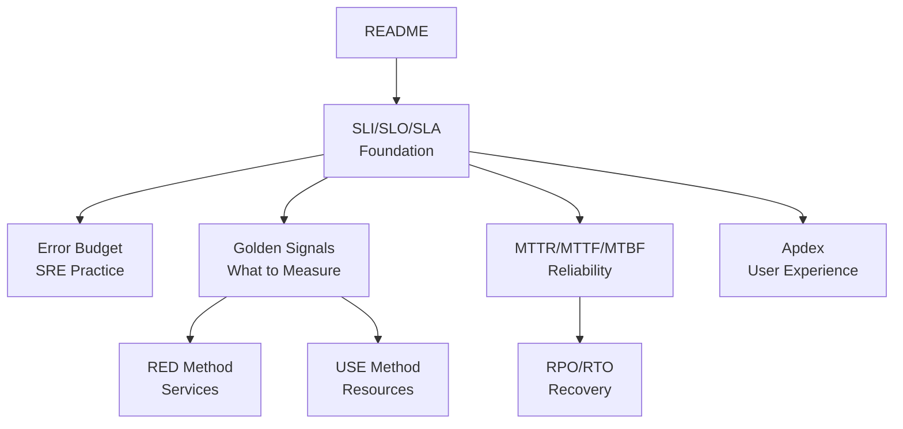

# Observability Metrics Documentation

## Introduction

This folder contains comprehensive documentation on **well-known metrics and methodologies** used in observability, reliability engineering, and Site Reliability Engineering (SRE) practices.

Metrics are the foundation of observability—they provide quantitative measurements that help teams understand system behavior, set objectives, and make data-driven decisions.

## Documentation Index

### Service Level Metrics

| # | Document | Description |
|---|----------|-------------|
| 01 | [SLI/SLO/SLA](01-sli-slo-sla.md) | Service Level Indicators, Objectives, and Agreements - the hierarchy of service reliability measurement |
| 02 | [Error Budget](02-error-budget.md) | Error budgets for balancing reliability with feature velocity |

### Observability Methodologies

| # | Document | Description |
|---|----------|-------------|
| 03 | [Golden Signals](03-golden-signals.md) | Google SRE's Four Golden Signals: Latency, Traffic, Errors, Saturation |
| 04 | [RED Method](04-red-method.md) | RED Method: Rate, Errors, Duration - for request-driven services |
| 05 | [USE Method](05-use-method.md) | USE Method: Utilization, Saturation, Errors - for resource monitoring |

### Reliability Metrics

| # | Document | Description |
|---|----------|-------------|
| 06 | [MTTR/MTTF/MTBF](06-mttr-mttf-mtbf.md) | Mean Time metrics: MTTR, MTTF, MTBF, MTTD for reliability measurement |
| 08 | [RPO/RTO](08-rpo-rto-overview.md) | Recovery Point and Recovery Time Objectives for disaster recovery |

### User Experience Metrics

| # | Document | Description |
|---|----------|-------------|
| 07 | [Apdex Score](07-apdex-score.md) | Application Performance Index - standardized user satisfaction scoring |

### Metrics Catalog

| # | Document | Description |
|---|----------|-------------|
| 09 | [Well-Known Metrics Catalog](09-well-known-metrics-catalog.md) | Comprehensive catalog of metrics by category, usage field, and business area |
| 10 | [DORA Metrics](10-dora-metrics.md) | DevOps Research and Assessment metrics for software delivery performance |

## Recommended Reading Order

## Quick Reference: Choosing the Right Methodology

| Scenario | Recommended Approach |
|----------|---------------------|
| Monitoring microservices/APIs | RED Method or Golden Signals |
| Monitoring infrastructure (CPU, memory, disk) | USE Method |
| Defining service reliability targets | SLI/SLO/SLA |
| Balancing reliability vs. feature development | Error Budgets |
| Measuring incident response effectiveness | MTTR, MTTD |
| Planning disaster recovery | RPO/RTO |
| Measuring user satisfaction | Apdex Score |

## Metrics at a Glance

### The Four Golden Signals (Google SRE)
- **Latency**: Time to service a request
- **Traffic**: Demand on your system
- **Errors**: Rate of failed requests
- **Saturation**: How "full" your system is

### RED Method (Request-Driven Services)
- **Rate**: Requests per second
- **Errors**: Failed requests per second
- **Duration**: Distribution of request latencies

### USE Method (Resources)
- **Utilization**: Percentage of resource busy time
- **Saturation**: Degree of queued work
- **Errors**: Count of error events

### Service Level Hierarchy
- **SLI**: What you measure (e.g., latency < 200ms)
- **SLO**: Your target (e.g., 99.9% of requests)
- **SLA**: Your commitment (with consequences)

### Reliability Time Metrics
- **MTTD**: Mean Time to Detect
- **MTTR**: Mean Time to Recover/Repair
- **MTBF**: Mean Time Between Failures
- **MTTF**: Mean Time to Failure

## Related Documentation

- [Observability Overview](../01-observability-overview.md)
- [Percentiles in Software Architecture](../percentiles-in-software-architecture.md)
- [Observability Best Practices](../04-best-practices.md)

---

> 💡 **Tip**: Start with SLI/SLO/SLA to understand how to define and measure service reliability, then explore the methodologies (Golden Signals, RED, USE) to learn what specific metrics to collect.
