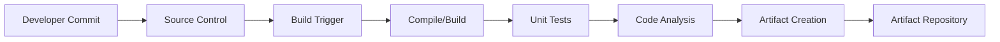
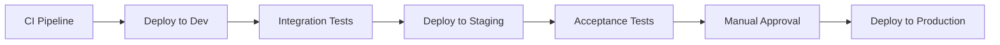
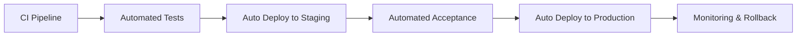
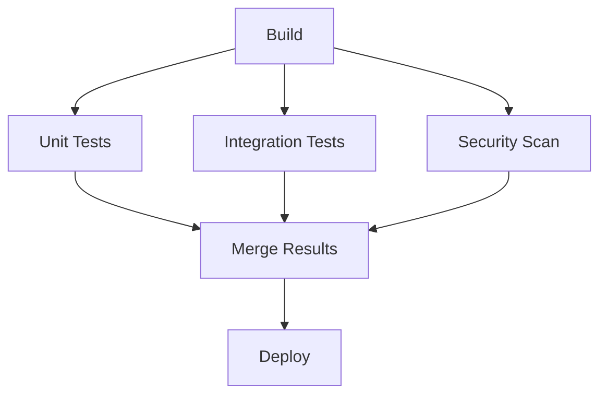
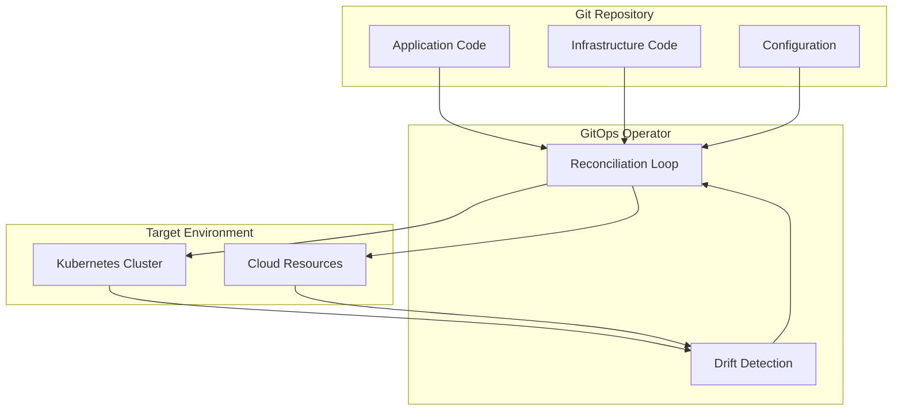
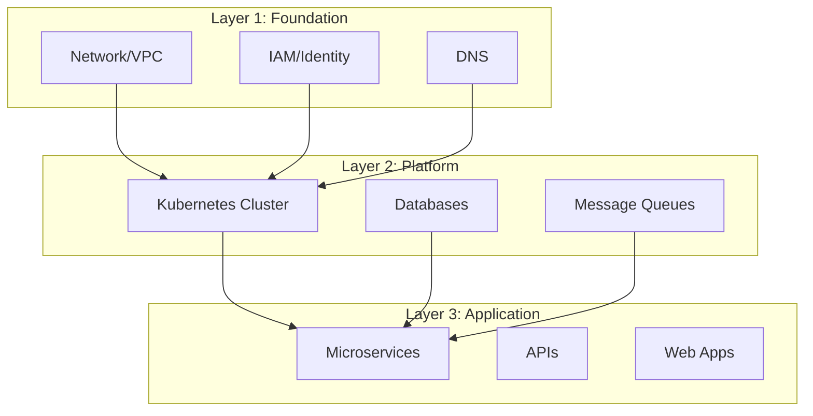
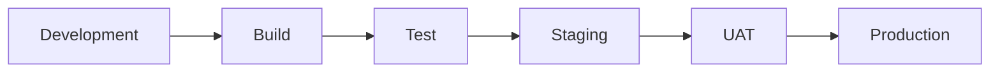
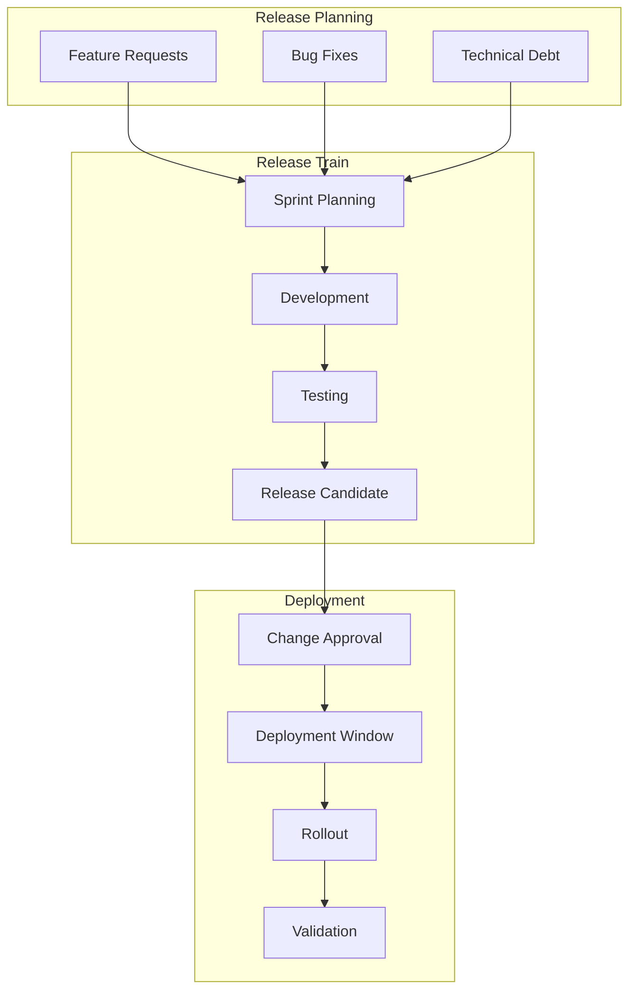
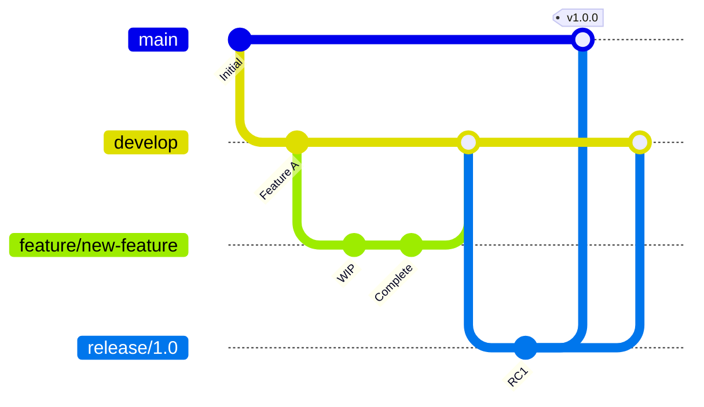
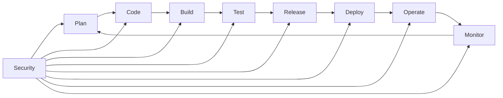

# 8.1 DevOps Architecture

## Overview

DevOps Architecture encompasses the practices, tools, and cultural philosophies that automate and integrate processes between software development and IT operations teams. It emphasizes collaboration, automation, continuous integration, continuous delivery, and monitoring throughout the software development lifecycle.

## Table of Contents

- [CI/CD Architecture](#cicd-architecture)
- [GitOps Architecture](#gitops-architecture)
- [Infrastructure as Code (IaC)](#infrastructure-as-code-iac)
- [Release Management Architecture](#release-management-architecture)
- [Best Practices](#best-practices)
- [Related Topics](#related-topics)

---

## CI/CD Architecture

### Continuous Integration (CI)

Continuous Integration is the practice of frequently merging code changes into a shared repository, followed by automated builds and tests.



#### Key Components

| Component | Purpose | Examples |
|-----------|---------|----------|
| Source Control | Version management | Git, GitHub, GitLab, Azure Repos |
| Build Server | Automated compilation | Jenkins, Azure Pipelines, GitHub Actions |
| Test Framework | Automated testing | JUnit, NUnit, pytest, Jest |
| Artifact Repository | Binary storage | Nexus, Artifactory, Azure Artifacts |

#### CI Best Practices

- Commit code frequently (at least daily)
- Maintain a single source repository
- Automate the build process
- Make builds self-testing
- Keep builds fast (< 10 minutes ideal)
- Test in a clone of the production environment

### Continuous Delivery (CD)

Continuous Delivery extends CI by automatically deploying code changes to staging/production environments after passing all tests.



### Continuous Deployment

Continuous Deployment goes one step further—every change that passes all stages of the production pipeline is released automatically without manual intervention.



### Pipeline Architecture Patterns

#### 1. Linear Pipeline
Simple sequential stages—suitable for small projects.

#### 2. Fan-Out/Fan-In Pipeline
Parallel execution of independent stages for faster feedback.



#### 3. Matrix Pipeline
Test across multiple configurations (OS, runtime versions).

---

## GitOps Architecture

### Overview

GitOps is an operational framework that applies DevOps best practices for infrastructure automation, using Git as the single source of truth for declarative infrastructure and applications.

### Core Principles

1. **Declarative Configuration**: The entire system is described declaratively
2. **Version Controlled**: The canonical desired state is versioned in Git
3. **Automated Delivery**: Approved changes are automatically applied
4. **Software Agents**: Ensure correctness and alert on divergence

### GitOps Architecture Patterns



### Push vs Pull Model

| Aspect | Push Model | Pull Model |
|--------|------------|------------|
| Trigger | CI pipeline pushes changes | Agent pulls changes from Git |
| Security | Requires cluster credentials in CI | Agent runs inside cluster |
| Scalability | Limited by CI capacity | Scales with clusters |
| Tools | Traditional CI/CD | ArgoCD, Flux, Jenkins X |

### GitOps Tools Comparison

| Tool | Kubernetes Native | Multi-Cluster | UI | Helm Support |
|------|-------------------|---------------|-----|--------------|
| ArgoCD | Yes | Yes | Yes | Yes |
| Flux | Yes | Yes | No (Weave GitOps) | Yes |
| Jenkins X | Yes | Limited | Yes | Yes |
| Rancher Fleet | Yes | Yes | Yes | Yes |

---

## Infrastructure as Code (IaC)

### Overview

Infrastructure as Code is the practice of managing and provisioning infrastructure through machine-readable definition files rather than physical hardware configuration or interactive configuration tools.

### IaC Approaches

#### 1. Declarative (Functional)

Defines the desired end state; the system determines how to achieve it.

```yaml
# Example: Terraform/HCL
resource "aws_instance" "web" {
  ami           = "ami-0c55b159cbfafe1f0"
  instance_type = "t2.micro"
  
  tags = {
    Name = "web-server"
  }
}
```

#### 2. Imperative (Procedural)

Defines explicit commands to execute in order to reach the desired state.

```bash
# Example: Shell script
aws ec2 run-instances \
  --image-id ami-0c55b159cbfafe1f0 \
  --instance-type t2.micro \
  --tag-specifications 'ResourceType=instance,Tags=[{Key=Name,Value=web-server}]'
```

### IaC Tools Comparison

| Tool | Type | Cloud Support | Language | State Management |
|------|------|---------------|----------|------------------|
| Terraform | Declarative | Multi-cloud | HCL | Remote/Local |
| Pulumi | Declarative | Multi-cloud | Python, TypeScript, Go | Cloud-based |
| AWS CloudFormation | Declarative | AWS only | JSON/YAML | AWS-managed |
| Azure Bicep | Declarative | Azure only | Bicep DSL | Azure-managed |
| Ansible | Hybrid | Multi-cloud | YAML | Stateless |
| Chef | Imperative | Multi-cloud | Ruby DSL | Chef Server |

### IaC Architecture Patterns

#### Layered Infrastructure



#### Module-Based Architecture

- **Root Module**: Orchestrates child modules
- **Child Modules**: Reusable, encapsulated components
- **Registry**: Shared module repository

### IaC Best Practices

1. **Version Control Everything**: All IaC files in Git
2. **Use Modules**: DRY principle for infrastructure
3. **Implement State Management**: Remote state with locking
4. **Parameterize Configurations**: Environment-specific variables
5. **Validate Before Apply**: Use plan/preview commands
6. **Implement Drift Detection**: Regular reconciliation
7. **Document Infrastructure**: Inline comments and README files

---

## Release Management Architecture

### Overview

Release Management encompasses the planning, scheduling, and controlling of software builds through different stages and environments.

### Release Pipeline Stages



### Release Strategies

#### 1. Big Bang Release

- All features released at once
- Higher risk, longer cycles
- Suitable for major version upgrades

#### 2. Phased Release

- Features released in batches
- Reduced risk per release
- Easier rollback

#### 3. Continuous Release

- Small, frequent releases
- Minimal risk per change
- Requires mature CI/CD

### Environment Management

| Environment | Purpose | Data | Access |
|-------------|---------|------|--------|
| Development | Feature development | Synthetic | Developers |
| Integration | Component integration | Synthetic | Dev Team |
| QA/Test | Quality assurance | Sanitized production | QA Team |
| Staging | Pre-production validation | Production-like | DevOps + QA |
| UAT | User acceptance testing | Production-like | Business Users |
| Production | Live system | Real | Operations |

### Release Orchestration



### Version Control Strategies

#### Git Flow



#### Trunk-Based Development

- Single main branch
- Short-lived feature branches (< 1 day)
- Feature flags for incomplete features
- Continuous integration to trunk

---

## Best Practices

### DevOps Culture

1. **Collaboration**: Break down silos between Dev and Ops
2. **Automation**: Automate repetitive tasks
3. **Measurement**: Track metrics (DORA metrics)
4. **Sharing**: Knowledge sharing and documentation
5. **Continuous Improvement**: Regular retrospectives

### DORA Metrics

| Metric | Elite | High | Medium | Low |
|--------|-------|------|--------|-----|
| Deployment Frequency | On-demand | Daily-Weekly | Weekly-Monthly | Monthly-Yearly |
| Lead Time for Changes | < 1 hour | 1 day - 1 week | 1 week - 1 month | 1-6 months |
| Change Failure Rate | 0-15% | 16-30% | 31-45% | 46-60% |
| Time to Restore | < 1 hour | < 1 day | 1 day - 1 week | > 1 week |

### Security in DevOps (DevSecOps)



#### Shift-Left Security

- SAST (Static Application Security Testing) in CI
- Dependency scanning
- Container image scanning
- Infrastructure security scanning
- Secret detection

---

## Related Topics

- [8.2 Runtime & Deployment Architecture](./8.2-runtime-deployment-architecture.md) - Deployment strategies
- [Azure DevOps](../../architecture-azure/devops/) - Azure-specific DevOps implementation
- [ARM Templates](../../architecture-azure/devops/arm-templates-declarative-syntax.md) - Azure Resource Manager templates
