# 8.2 Runtime & Deployment Architecture

## Overview

Runtime and Deployment Architecture encompasses the strategies, patterns, and mechanisms used to deploy applications safely and manage them effectively in production environments. This section focuses on minimizing deployment risk while maximizing deployment frequency and reliability.

## Table of Contents

- [Blue-Green Deployment](#blue-green-deployment)
- [Canary Deployment](#canary-deployment)
- [Feature Flag Architecture](#feature-flag-architecture)
- [Rollback Architecture](#rollback-architecture)
- [Additional Deployment Patterns](#additional-deployment-patterns)
- [Best Practices](#best-practices)
- [Related Topics](#related-topics)

---

## Blue-Green Deployment

### Overview

Blue-Green Deployment is a release strategy that reduces downtime and risk by running two identical production environments called "Blue" and "Green." At any time, only one environment serves live production traffic.

### Architecture

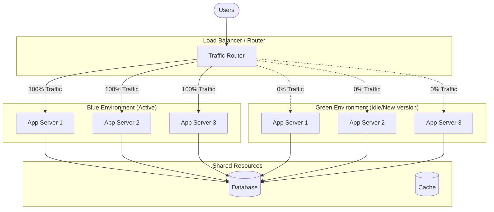

### Deployment Process

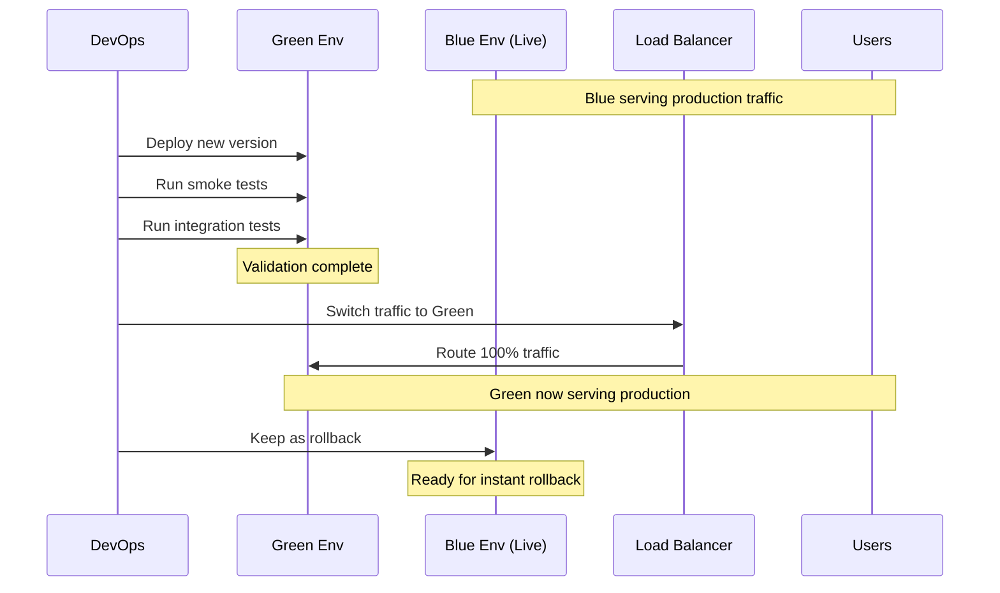

### Advantages and Disadvantages

| Advantages | Disadvantages |
|------------|---------------|
| Zero-downtime deployments | Double infrastructure cost |
| Instant rollback capability | Database migrations complexity |
| Full environment testing before switch | Session management challenges |
| Simple conceptual model | Resource intensive |
| Reduced deployment risk | Requires infrastructure automation |

### Database Considerations

#### Strategies for Database Changes

1. **Backward Compatible Changes**
   - Add new columns as nullable
   - Create new tables without removing old ones
   - Use database views for abstraction

2. **Expand and Contract Pattern**
   ```mermaid
   flowchart LR
       A[Expand: Add new schema] --> B[Migrate: Update application]
       B --> C[Contract: Remove old schema]
   ```

3. **Database per Environment**
   - Complete isolation
   - Data synchronization challenges
   - Suitable for stateless applications

### Implementation Checklist

- [ ] Identical infrastructure for both environments
- [ ] Automated deployment pipeline
- [ ] Health check endpoints
- [ ] Traffic switching mechanism (DNS, Load Balancer)
- [ ] Database migration strategy
- [ ] Session persistence strategy
- [ ] Monitoring and alerting
- [ ] Rollback procedure documented

---

## Canary Deployment

### Overview

Canary Deployment is a technique to reduce the risk of introducing a new software version by slowly rolling out the change to a small subset of users before rolling it out to the entire infrastructure.

### Architecture

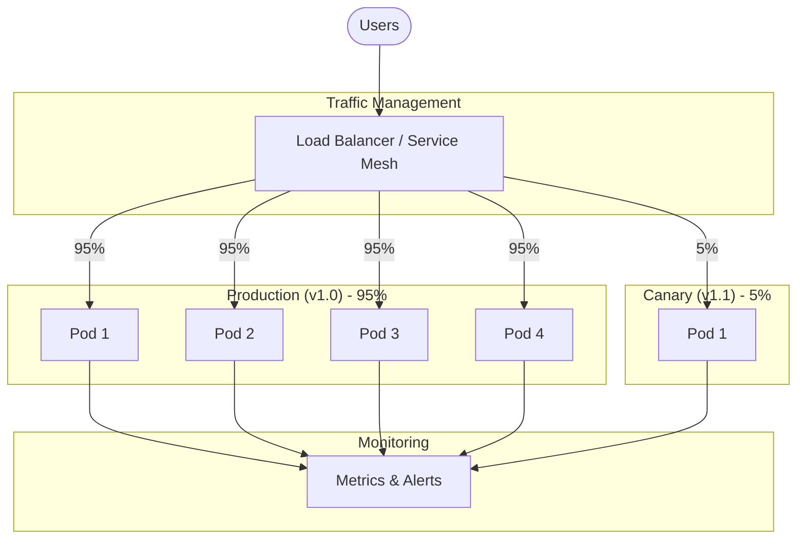

### Progressive Rollout Stages

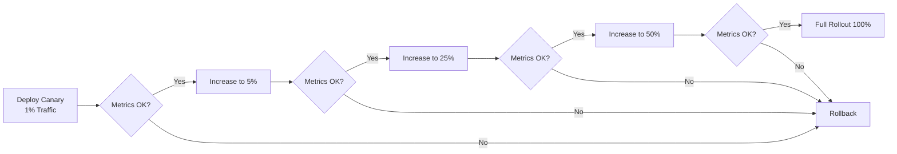

### Traffic Splitting Strategies

| Strategy | Description | Use Case |
|----------|-------------|----------|
| **Percentage-based** | Route X% of traffic to canary | General releases |
| **User-based** | Specific users see canary | Beta testing |
| **Geographic** | Specific regions see canary | Regional rollouts |
| **Header-based** | Requests with specific headers | Internal testing |
| **Cookie-based** | Users with specific cookies | A/B testing |

### Key Metrics to Monitor

#### Application Metrics
- Error rate (4xx, 5xx responses)
- Response time (p50, p95, p99)
- Throughput (requests per second)
- Saturation (CPU, memory usage)

#### Business Metrics
- Conversion rate
- User engagement
- Transaction success rate
- Revenue impact

### Automated Canary Analysis

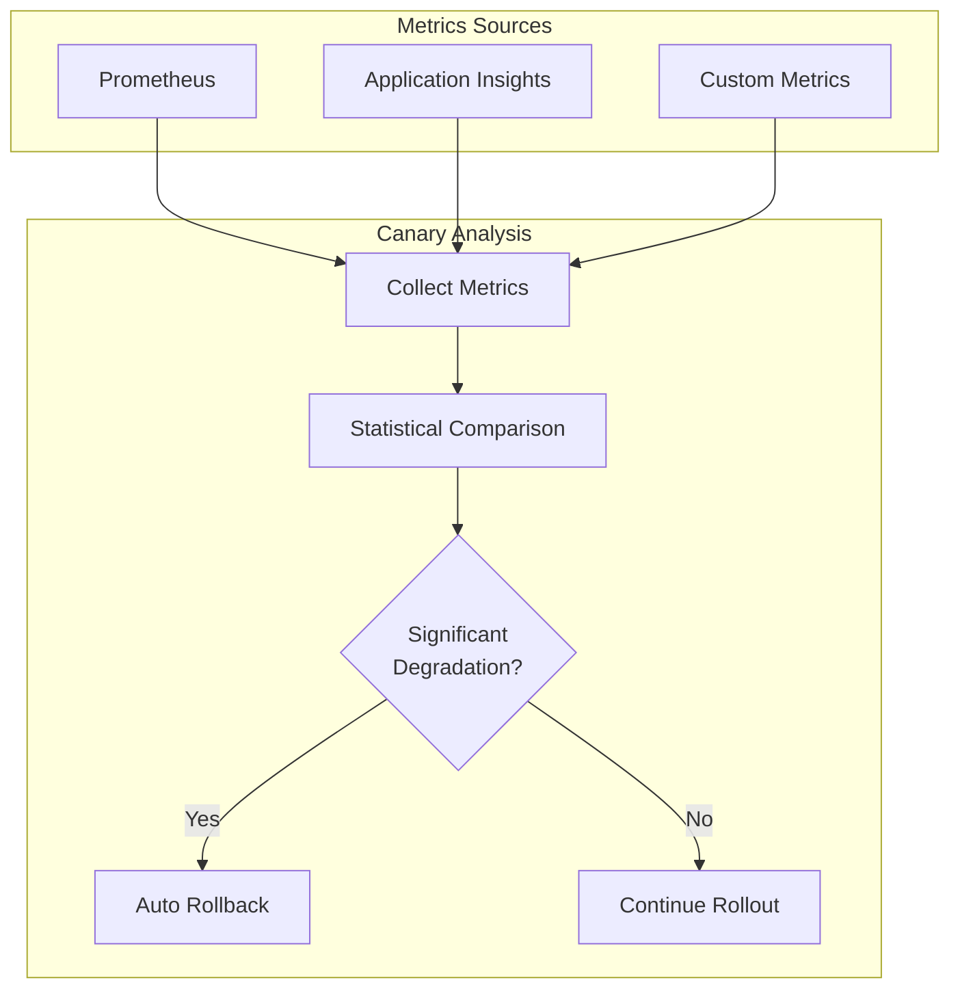

### Tools for Canary Deployments

| Tool | Platform | Features |
|------|----------|----------|
| Flagger | Kubernetes | Automated canary with Istio/Linkerd |
| Argo Rollouts | Kubernetes | Progressive delivery controller |
| Spinnaker | Multi-platform | Automated canary analysis |
| AWS App Mesh | AWS | Traffic management for ECS/EKS |
| Azure Traffic Manager | Azure | DNS-based traffic routing |

---

## Feature Flag Architecture

### Overview

Feature Flags (also known as Feature Toggles) are a technique that allows teams to modify system behavior without changing code. They enable trunk-based development, A/B testing, and gradual feature rollouts.

### Architecture

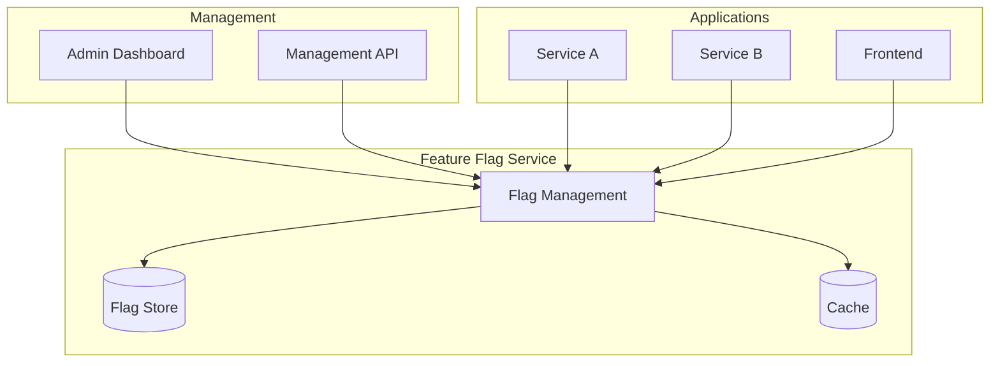

### Types of Feature Flags

| Type | Lifespan | Purpose | Example |
|------|----------|---------|---------|
| **Release Toggles** | Days-Weeks | Hide incomplete features | `new_checkout_flow` |
| **Experiment Toggles** | Weeks-Months | A/B testing | `show_recommendations_v2` |
| **Ops Toggles** | Permanent | Operational control | `enable_circuit_breaker` |
| **Permission Toggles** | Permanent | User access control | `premium_features` |

### Flag Evaluation Flow

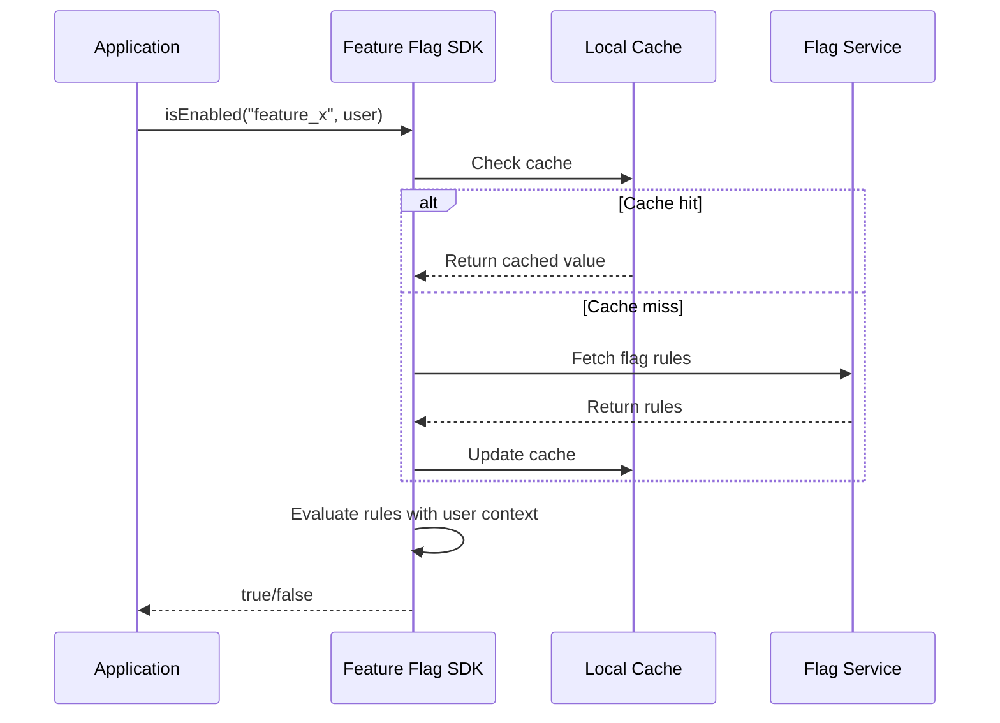

### Targeting Strategies

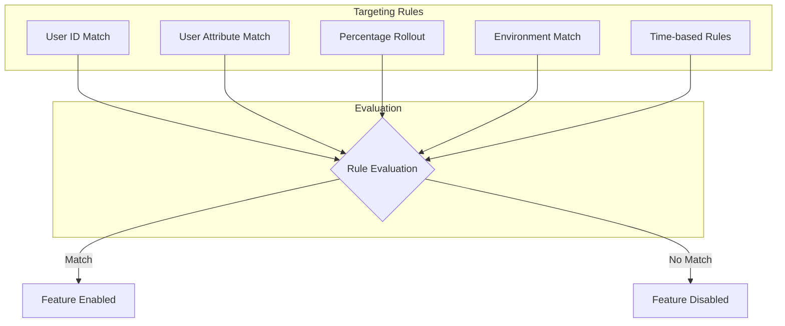

### Feature Flag Best Practices

1. **Naming Conventions**
   ```
   <category>_<feature>_<variant>
   
   Examples:
   - release_new_dashboard_enabled
   - experiment_checkout_v2_enabled
   - ops_rate_limiting_enabled
   ```

2. **Flag Lifecycle Management**
   ```mermaid
   flowchart LR
       A[Create Flag] --> B[Develop Feature]
       B --> C[Test with Flag]
       C --> D[Gradual Rollout]
       D --> E[Full Release]
       E --> F[Remove Flag]
       F --> G[Clean Code]
   ```

3. **Technical Debt Management**
   - Set expiration dates for temporary flags
   - Regular flag cleanup sprints
   - Automated stale flag detection
   - Code coverage for both flag states

### Feature Flag Platforms

| Platform | Type | Key Features |
|----------|------|--------------|
| LaunchDarkly | SaaS | Enterprise, real-time updates |
| Split.io | SaaS | Analytics, experimentation |
| Flagsmith | Open Source/SaaS | Self-hosted option |
| Unleash | Open Source | Self-hosted, simple |
| AWS AppConfig | AWS Native | Feature flags + configuration |
| Azure App Configuration | Azure Native | Feature flags + configuration |

### Code Example Pattern

```python
# Feature Flag SDK Integration Pattern

class FeatureService:
    def __init__(self, flag_client):
        self.flag_client = flag_client
    
    def process_order(self, order, user):
        # Check feature flag with user context
        if self.flag_client.is_enabled("new_payment_flow", user):
            return self._process_with_new_flow(order)
        else:
            return self._process_with_legacy_flow(order)
    
    def _process_with_new_flow(self, order):
        # New implementation
        pass
    
    def _process_with_legacy_flow(self, order):
        # Legacy implementation
        pass
```

---

## Rollback Architecture

### Overview

Rollback Architecture encompasses the strategies, mechanisms, and procedures to quickly revert a deployment when issues are detected. A well-designed rollback strategy is critical for maintaining system reliability.

### Rollback Strategies

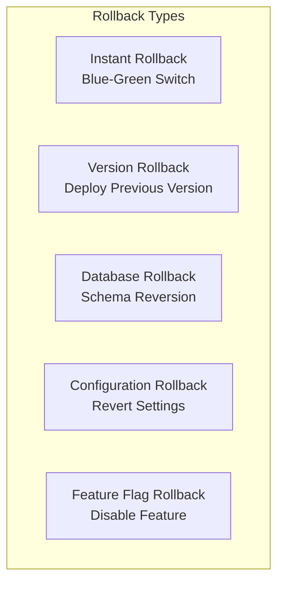

### Instant Rollback (Blue-Green)

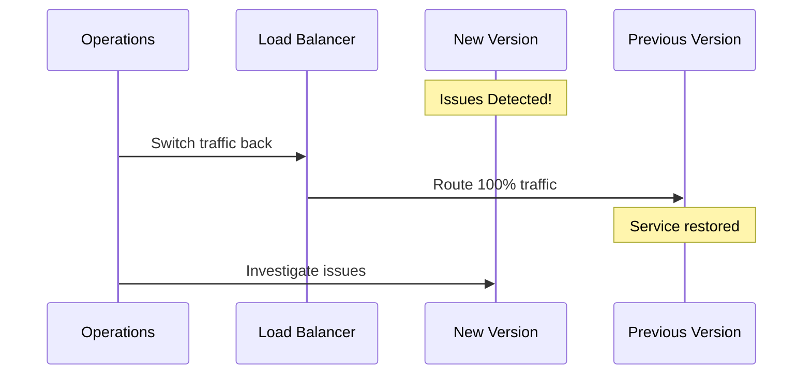

### Version-Based Rollback

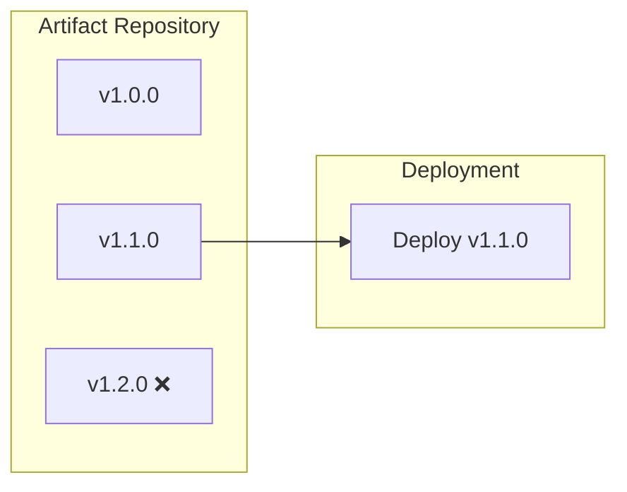

#### Immutable Artifacts

| Principle | Description |
|-----------|-------------|
| Version all artifacts | Every build has unique identifier |
| Never modify artifacts | Build once, deploy many times |
| Keep history | Maintain N previous versions |
| Automate deployment | Same process for rollback |

### Database Rollback Strategies

#### 1. Forward-Only Migrations

Design migrations to be reversible or use forward fixes.

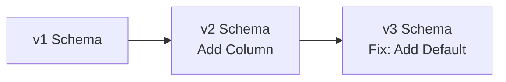

#### 2. Backward Compatible Changes

```sql
-- Migration: Add new column (backward compatible)
ALTER TABLE users ADD COLUMN new_field VARCHAR(255) NULL;

-- Application v1 ignores new_field
-- Application v2 uses new_field
```

#### 3. Expand-Contract Pattern

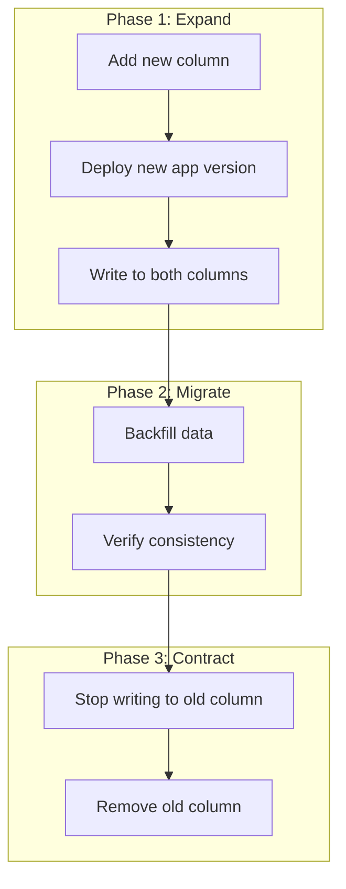

### Rollback Decision Matrix

| Signal | Severity | Action |
|--------|----------|--------|
| Error rate > 5% | Critical | Immediate rollback |
| Latency p99 > 2x baseline | High | Rollback within 5 min |
| Memory leak detected | Medium | Rollback within 15 min |
| Minor UI bug | Low | Fix forward |
| Security vulnerability | Critical | Immediate rollback |

### Automated Rollback Architecture

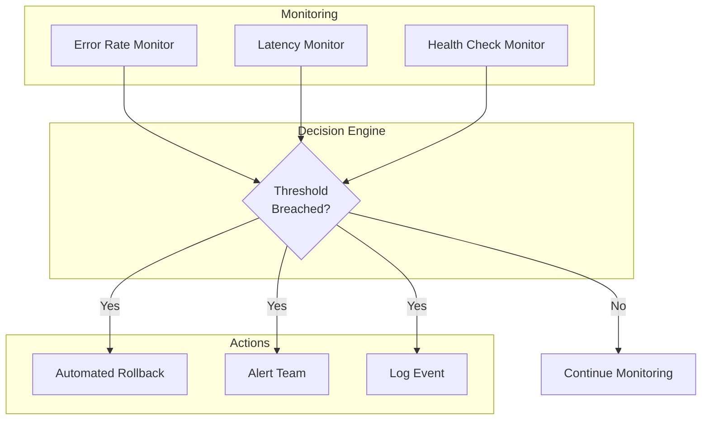

### Rollback Runbook Template

```markdown
## Rollback Runbook: [Service Name]

### Prerequisites
- [ ] Access to deployment pipeline
- [ ] Previous version artifact available
- [ ] Database rollback script (if applicable)

### Rollback Steps

1. **Assess Impact**
   - Check error rates in monitoring dashboard
   - Identify affected users/regions
   - Document incident timeline

2. **Execute Rollback**
   - [ ] Trigger deployment pipeline with previous version
   - [ ] Or switch traffic (Blue-Green)
   - [ ] Or disable feature flag

3. **Verify Rollback**
   - [ ] Check health endpoints
   - [ ] Verify error rates decreasing
   - [ ] Confirm user-facing functionality

4. **Post-Rollback**
   - [ ] Notify stakeholders
   - [ ] Create incident report
   - [ ] Schedule root cause analysis

### Contacts
- On-call Engineer: [Contact]
- Service Owner: [Contact]
```

---

## Additional Deployment Patterns

### Rolling Deployment

Gradually replaces instances of the previous version with new version instances.

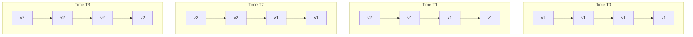

### A/B Testing Deployment

Route specific user segments to different versions for comparison.

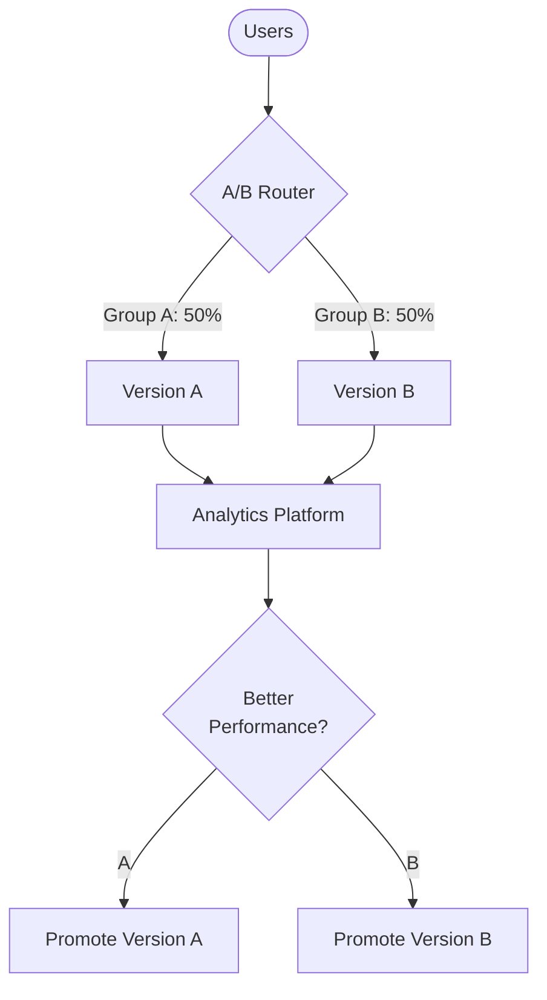

### Shadow Deployment

Run new version in parallel, receiving real traffic but not affecting responses.

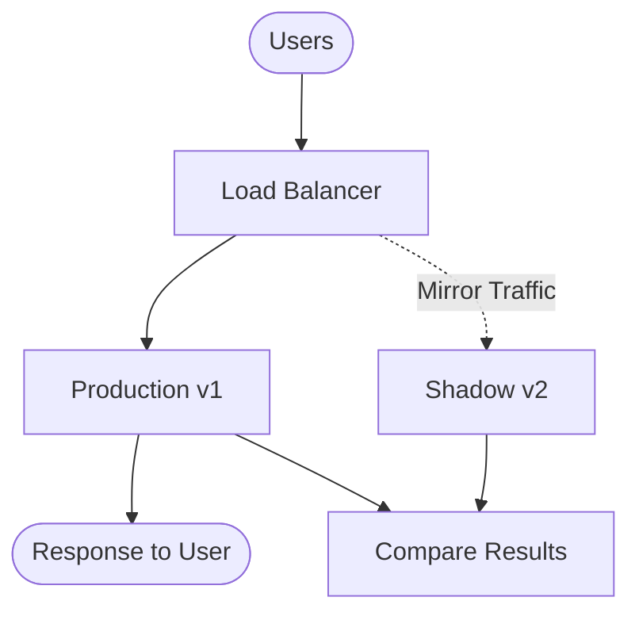

---

## Best Practices

### Deployment Best Practices

1. **Automate Everything**
   - No manual deployments to production
   - Infrastructure as Code
   - Automated testing at every stage

2. **Deploy Frequently**
   - Smaller changes = lower risk
   - Faster feedback cycles
   - Easier troubleshooting

3. **Monitor Proactively**
   - Real-time dashboards
   - Automated alerting
   - Business metrics alongside technical metrics

4. **Plan for Failure**
   - Assume deployments will fail
   - Test rollback procedures
   - Maintain runbooks

### Deployment Checklist

| Phase | Checklist Item |
|-------|----------------|
| **Pre-Deploy** | ✓ All tests passing |
| | ✓ Code reviewed and approved |
| | ✓ Change documented |
| | ✓ Rollback plan ready |
| **Deploy** | ✓ Deploy to staging first |
| | ✓ Smoke tests passing |
| | ✓ Monitoring in place |
| **Post-Deploy** | ✓ Health checks passing |
| | ✓ No error rate increase |
| | ✓ Performance within baseline |
| | ✓ Stakeholders notified |

### Comparison of Deployment Strategies

| Strategy | Downtime | Risk | Complexity | Cost | Best For |
|----------|----------|------|------------|------|----------|
| Blue-Green | None | Low | Medium | High | Critical systems |
| Canary | None | Low | High | Medium | Large user bases |
| Rolling | Minimal | Medium | Low | Low | Standard deployments |
| Feature Flags | None | Low | Medium | Low | Continuous delivery |
| A/B Testing | None | Low | High | Medium | UX optimization |
| Shadow | None | Very Low | High | High | High-risk changes |

---

## Related Topics

- [8.1 DevOps Architecture](./8.1-devops-architecture.md) - CI/CD and GitOps
- [Azure App Service Deployment Slots](../../architecture-azure/compute/app-service/) - Azure-specific deployment slots
- [Azure Traffic Manager](../../architecture-azure/networking/load-balancing/) - Traffic routing for deployments
- [Azure Feature Flags](../../architecture-azure/devops/) - Azure App Configuration feature management
