# 8.3 Git Branching Strategies

## Overview

Git branching strategies define how teams organize their development workflow, manage releases, and collaborate on code. The right strategy depends on team size, release cadence, project complexity, and organizational culture.

## Table of Contents

- [Strategy Comparison Matrix](#strategy-comparison-matrix)
- [GitFlow](#gitflow)
- [GitHub Flow](#github-flow)
- [GitLab Flow](#gitlab-flow)
- [Trunk-Based Development](#trunk-based-development)
- [Release Flow](#release-flow-microsoft)
- [Feature Branch Workflow](#feature-branch-workflow)
- [Forking Workflow](#forking-workflow)
- [Strategy Selection Guide](#strategy-selection-guide)
- [Best Practices](#best-practices)
- [Related Topics](#related-topics)

---

## Strategy Comparison Matrix

| Strategy | Best For | Release Cadence | Team Size | Complexity |
|----------|----------|-----------------|-----------|------------|
| GitFlow | Scheduled releases | Weeks/Months | Medium-Large | High |
| GitHub Flow | Continuous delivery | Daily/Weekly | Small-Medium | Low |
| GitLab Flow | Environment-based | Variable | Medium | Medium |
| Trunk-Based | Continuous deployment | Multiple/day | Any (with maturity) | Low |
| Release Flow | Large monorepos | Scheduled | Large | Medium |
| Feature Branch | Mixed workflows | Variable | Any | Low-Medium |
| Forking | Open source | Variable | Distributed | Medium |

---

## GitFlow

### Overview

GitFlow, introduced by Vincent Driessen in 2010, is a comprehensive branching model designed for projects with scheduled releases. It defines strict branch roles and merge rules.

### Branch Structure

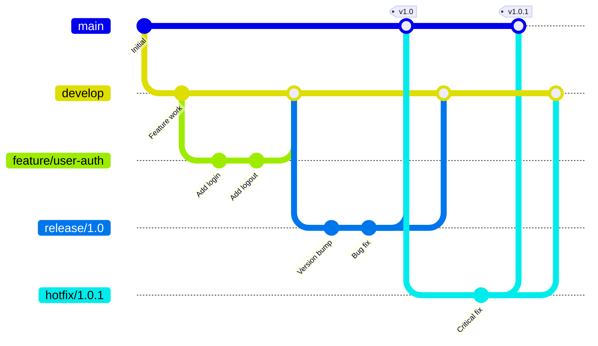

### Branch Types

| Branch | Purpose | Created From | Merges Into | Lifespan |
|--------|---------|--------------|-------------|----------|
| `main` | Production-ready code | - | - | Permanent |
| `develop` | Integration branch | main | release | Permanent |
| `feature/*` | New features | develop | develop | Temporary |
| `release/*` | Release preparation | develop | main & develop | Temporary |
| `hotfix/*` | Production fixes | main | main & develop | Temporary |

### Workflow

1. **Feature Development**
   ```bash
   git checkout develop
   git checkout -b feature/new-feature
   # ... work on feature ...
   git checkout develop
   git merge --no-ff feature/new-feature
   git branch -d feature/new-feature
   ```

2. **Release Preparation**
   ```bash
   git checkout develop
   git checkout -b release/1.0
   # ... bump version, fix bugs ...
   git checkout main
   git merge --no-ff release/1.0
   git tag -a v1.0
   git checkout develop
   git merge --no-ff release/1.0
   ```

3. **Hotfix**
   ```bash
   git checkout main
   git checkout -b hotfix/1.0.1
   # ... fix critical bug ...
   git checkout main
   git merge --no-ff hotfix/1.0.1
   git tag -a v1.0.1
   git checkout develop
   git merge --no-ff hotfix/1.0.1
   ```

### Advantages

- ✅ Clear separation between development and production code
- ✅ Supports parallel development of multiple features
- ✅ Well-suited for scheduled release cycles
- ✅ Provides a clear audit trail
- ✅ Handles hotfixes without disrupting ongoing development
- ✅ Good for maintaining multiple versions in production

### Disadvantages

- ❌ Complex with many long-lived branches
- ❌ Merge conflicts can accumulate
- ❌ Not suitable for continuous deployment
- ❌ Overhead for small teams or simple projects
- ❌ Can lead to "merge hell" with large features
- ❌ Develop branch can diverge significantly from main

### When to Use

- Enterprise software with scheduled releases
- Products requiring multiple supported versions
- Teams with dedicated release management
- Projects with strict compliance requirements
- Mobile apps with app store release cycles

---

## GitHub Flow

### Overview

GitHub Flow is a simplified branching model designed for continuous deployment. Created by GitHub, it emphasizes simplicity and rapid iteration.

### Branch Structure

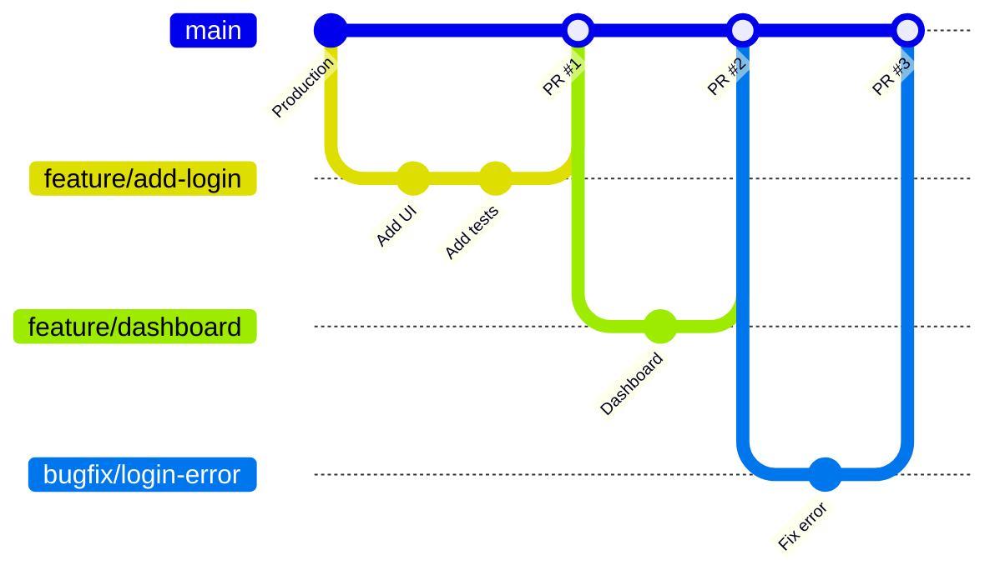

### Workflow

1. **Create a branch** from main for each feature/fix
2. **Add commits** with descriptive messages
3. **Open a Pull Request** for discussion and review
4. **Review and discuss** the changes
5. **Deploy** to production (or staging for testing)
6. **Merge** to main after approval

```bash
# Start new feature
git checkout main
git pull origin main
git checkout -b feature/awesome-feature

# Work on feature
git add .
git commit -m "Add awesome feature"
git push origin feature/awesome-feature

# Create PR, get review, merge via GitHub UI
# Then clean up
git checkout main
git pull origin main
git branch -d feature/awesome-feature
```

### Key Principles

| Principle | Description |
|-----------|-------------|
| Main is always deployable | Every commit on main should be production-ready |
| Branch from main | All work starts from and returns to main |
| Descriptive branch names | Use clear naming like `feature/`, `bugfix/`, `docs/` |
| Pull requests for review | All changes go through PR review |
| Deploy immediately | Merge to main triggers deployment |

### Advantages

- ✅ Simple and easy to understand
- ✅ Enables continuous deployment
- ✅ Fast feedback loop
- ✅ Minimal branch management overhead
- ✅ Encourages small, frequent deployments
- ✅ Pull requests facilitate code review

### Disadvantages

- ❌ No built-in support for multiple environments
- ❌ Doesn't handle multiple production versions
- ❌ Requires robust CI/CD and feature flags
- ❌ May need additional process for release coordination
- ❌ Less suitable for projects with long QA cycles

### When to Use

- Web applications with continuous deployment
- SaaS products
- Small to medium teams
- Projects prioritizing delivery speed
- Teams new to Git branching strategies

---

## GitLab Flow

### Overview

GitLab Flow combines feature-driven development with environment branches. It addresses GitHub Flow's limitations for projects needing environment-specific deployments.

### Branch Structure

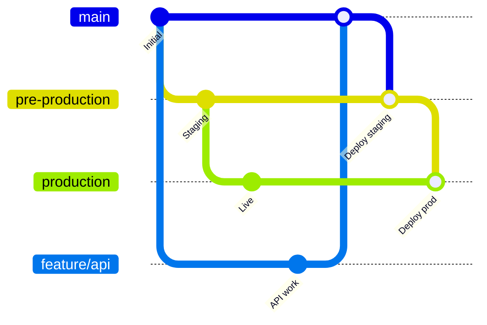

### Environment Branches Model

| Branch | Purpose | Deployment Target |
|--------|---------|-------------------|
| `main` | Latest development | Development/Review |
| `pre-production` | Staging environment | Staging servers |
| `production` | Live environment | Production servers |
| `feature/*` | Feature development | Feature environments |

### Release Branches Model (Alternative)

For projects with versioned releases:

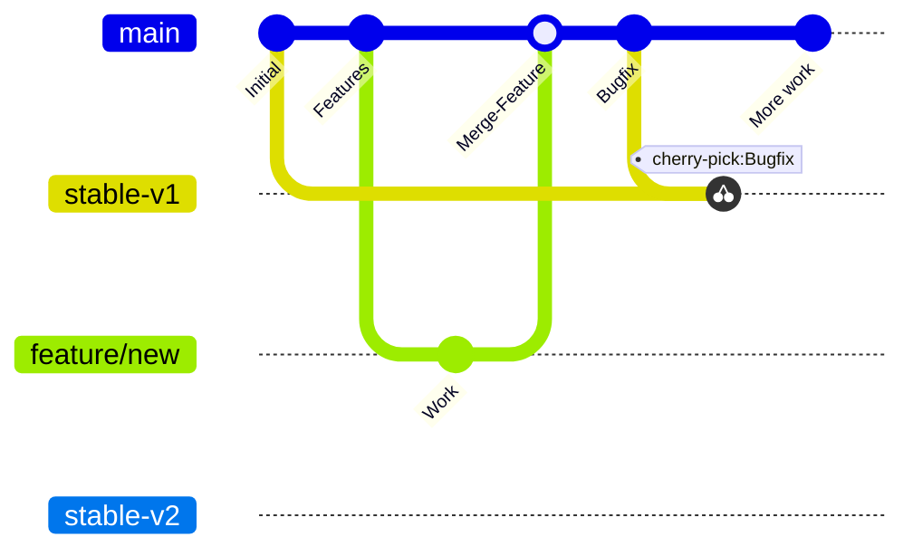

### Workflow

1. **Feature branches** created from main
2. **Merge to main** via merge request
3. **Downstream merge** to environment branches
4. **Cherry-pick** for hotfixes to stable branches

```bash
# Feature development
git checkout main
git checkout -b feature/new-api

# After review and merge to main
# Deploy to staging
git checkout pre-production
git merge main

# After staging verification
git checkout production
git merge pre-production
```

### Advantages

- ✅ Clear environment separation
- ✅ Supports multiple environments naturally
- ✅ Combines simplicity with flexibility
- ✅ Works well with GitLab's built-in CI/CD
- ✅ Supports both continuous delivery and releases
- ✅ Easy to track what's deployed where

### Disadvantages

- ❌ More complex than GitHub Flow
- ❌ Environment branches can lag behind
- ❌ May require manual environment promotions
- ❌ Cherry-picking can be error-prone
- ❌ Requires discipline in environment management

### When to Use

- Projects with multiple environments (dev, staging, prod)
- Teams using GitLab for CI/CD
- Organizations requiring staged rollouts
- Projects needing both features and releases workflows

---

## Trunk-Based Development

### Overview

Trunk-Based Development (TBD) is a source-control branching model where developers collaborate on a single branch (trunk/main), avoiding long-lived feature branches. It's the foundation of continuous integration.

### Branch Structure

#### Basic Trunk-Based with Release Branches

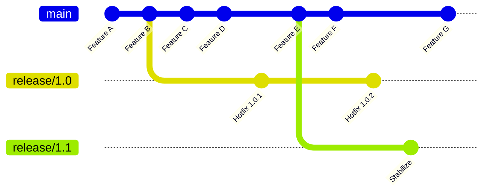

#### With Short-Lived Feature Branches and Hotfixes

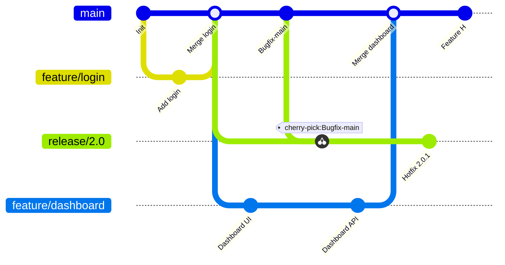

#### Multiple Versions in Production

Shows how to maintain multiple release versions simultaneously:

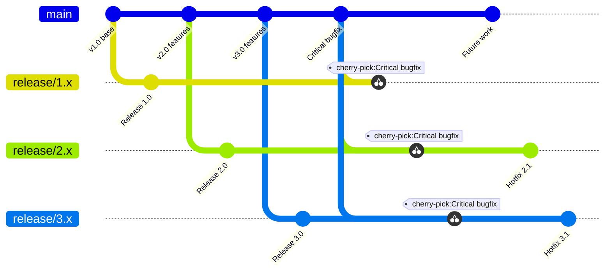

> **Important**: In Trunk-Based Development, release branches are **NOT merged back to main**. 
> - All fixes are made on main first, then **cherry-picked** to release branches
> - Release branches are "read-only snapshots" for stabilization
> - This ensures main always has the latest code and no fixes are lost
> - Release branches are eventually deleted after end-of-life

This differs from GitFlow where release branches merge back to both main and develop.

### Variants

#### 1. Pure Trunk-Based (No Branches)

Developers commit directly to main multiple times per day.

```bash
git checkout main
git pull
# Make small change
git commit -am "Add validation to user form"
git push
```

#### 2. Short-Lived Feature Branches

Branches exist but live for hours or 1-2 days maximum.

```bash
git checkout main
git checkout -b feature/quick-fix
# Small, focused change
git commit -am "Fix validation"
git push
# Create PR, review, merge same day
```

### Key Practices

| Practice | Description |
|----------|-------------|
| Small commits | Changes should be small and atomic |
| Feature flags | Hide incomplete features behind toggles |
| Branch by abstraction | Refactor incrementally with abstraction layers |
| Release branches | Short-lived branches for release stabilization |
| Continuous integration | Automated tests run on every commit |

### Feature Flags Example

```python
# Instead of long-lived branches, use feature flags
def get_user_dashboard(user):
    if feature_flags.is_enabled("new_dashboard", user):
        return new_dashboard_view(user)
    return legacy_dashboard_view(user)
```

### Advantages

- ✅ Eliminates merge conflicts from long-lived branches
- ✅ Continuous integration by design
- ✅ Faster feedback loops
- ✅ Encourages small, incremental changes
- ✅ Simpler branch management
- ✅ Better code review (smaller changes)
- ✅ Proven at scale (Google, Facebook, Microsoft)

### Disadvantages

- ❌ Requires high test coverage and CI maturity
- ❌ Feature flags add complexity
- ❌ May feel uncomfortable for teams used to isolation
- ❌ Requires discipline and skilled developers
- ❌ Incomplete features visible in main (unless flagged)
- ❌ Not suitable for teams with poor testing practices

### When to Use

- High-performing DevOps teams
- Organizations practicing continuous deployment
- Large-scale development (with proper tooling)
- Teams with excellent test coverage
- Projects where integration speed is critical

### Prerequisites for Success

1. **Comprehensive automated testing**
2. **Fast CI pipeline** (< 10 minutes)
3. **Feature flag infrastructure**
4. **Code review culture**
5. **Monitoring and rollback capabilities**

---

## Release Flow (Microsoft)

### Overview

Release Flow is Microsoft's branching strategy for large-scale development, particularly Azure DevOps. It combines trunk-based development with release branches.

### Branch Structure

#### Basic Release Flow with Sprints

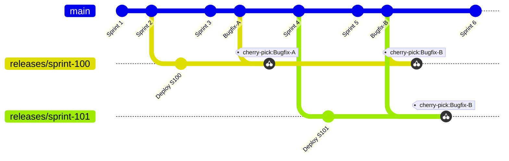

#### Topic Branches and Hotfix Workflow

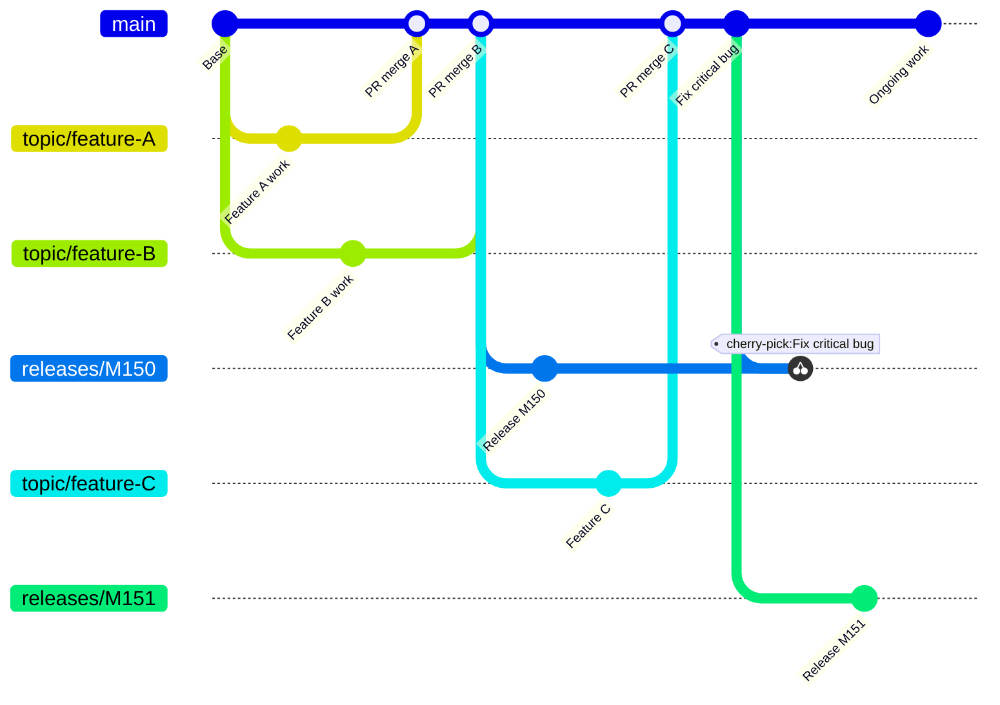

#### Multiple Active Releases (Ring Deployment)

Shows how Microsoft manages multiple concurrent deployments:

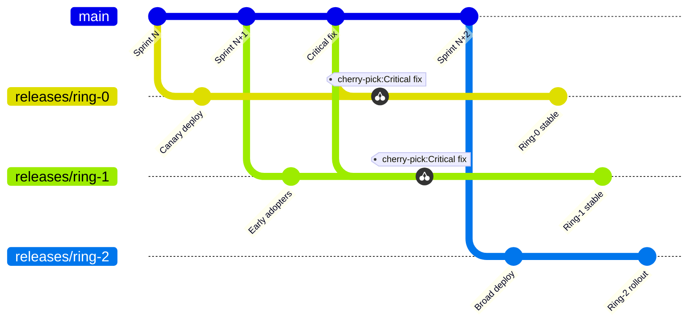

> **Note**: In Release Flow, like Trunk-Based Development:
> - Fixes are **always made on main first**, then cherry-picked to release branches
> - Release branches are **never merged back** to main
> - Multiple releases can be active simultaneously (ring deployments)

### Key Characteristics

| Aspect | Description |
|--------|-------------|
| Main branch | Topic branches merge here |
| Release branches | Created from main at release time |
| Hotfixes | Cherry-picked from main to release branches |
| Branch naming | `releases/M{milestone}` or `releases/sprint-{number}` |

### Workflow

1. **Develop in topic branches**
   - Short-lived (< 2 days ideal)
   - Pull request for merge to main

2. **Create release branch at release time**
   ```bash
   git checkout main
   git checkout -b releases/sprint-150
   ```

3. **Deploy release branch to production**

4. **Hotfixes go to main first, then cherry-pick**
   ```bash
   # Fix in main
   git checkout main
   git checkout -b hotfix/critical-bug
   # ... fix and merge to main ...
   
   # Cherry-pick to release
   git checkout releases/sprint-150
   git cherry-pick <commit-hash>
   ```

### Advantages

- ✅ Scales to thousands of developers
- ✅ Main always represents latest code
- ✅ Clear release tracking
- ✅ Supports scheduled releases with hotfix capability
- ✅ Simpler than GitFlow
- ✅ Works well with sprint-based development

### Disadvantages

- ❌ Cherry-picking requires discipline
- ❌ Release branches can accumulate
- ❌ Not ideal for continuous deployment
- ❌ Requires tooling for large teams

### When to Use

- Large engineering organizations
- Sprint-based development cycles
- Products with regular release schedules
- Teams managing many concurrent releases

---

## Feature Branch Workflow

### Overview

A simple workflow where each feature gets its own branch. The baseline for most other strategies.

### Branch Structure

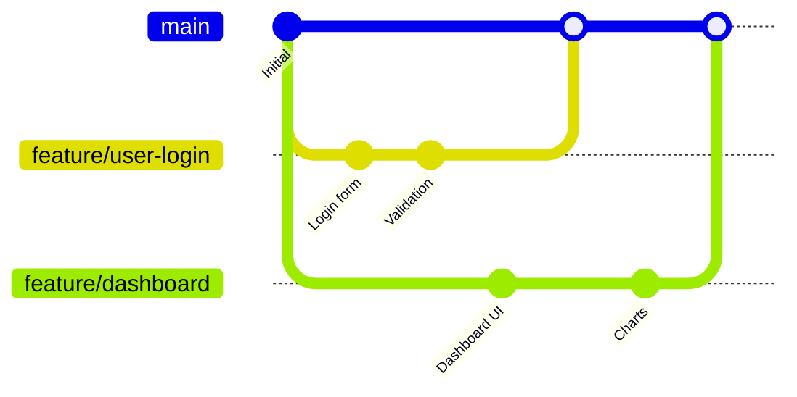

### Workflow

```bash
# Create feature branch
git checkout main
git checkout -b feature/my-feature

# Work on feature
git add .
git commit -m "Implement feature"

# Keep up to date
git checkout main
git pull
git checkout feature/my-feature
git rebase main  # or merge

# Complete feature
git checkout main
git merge feature/my-feature
git push
git branch -d feature/my-feature
```

### Advantages

- ✅ Simple to understand and implement
- ✅ Isolated development per feature
- ✅ Easy to experiment without affecting main
- ✅ Clear history of feature development
- ✅ Supports code review via pull requests

### Disadvantages

- ❌ Long-lived branches lead to merge conflicts
- ❌ No structure for releases or environments
- ❌ Can lead to "integration hell"
- ❌ Requires additional process for production management

### When to Use

- Small teams getting started with Git
- Simple projects without complex release needs
- As a foundation before adopting more structured strategies

---

## Forking Workflow

### Overview

Each developer has their own server-side repository. Common in open-source projects where contributors don't have write access to the main repository.

### Architecture

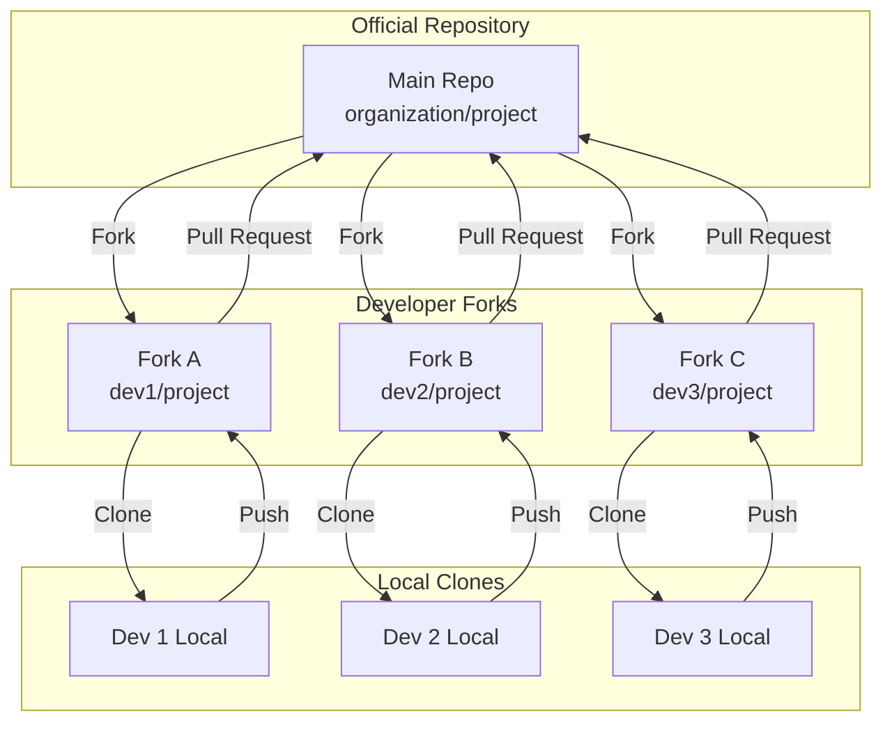

### Workflow

```bash
# Initial setup
git clone https://github.com/your-username/project.git
cd project
git remote add upstream https://github.com/organization/project.git

# Sync with upstream
git fetch upstream
git checkout main
git merge upstream/main

# Create feature
git checkout -b feature/contribution
# ... make changes ...
git push origin feature/contribution

# Create PR from your fork to upstream
```

### Advantages

- ✅ Secure—contributors don't need write access
- ✅ Each developer has full repository freedom
- ✅ Maintainers control what gets merged
- ✅ Ideal for open-source collaboration
- ✅ Natural code review through PRs

### Disadvantages

- ❌ More complex setup
- ❌ Keeping forks synchronized requires effort
- ❌ Can lead to divergent forks
- ❌ Not ideal for tightly integrated teams

### When to Use

- Open-source projects
- Projects with external contributors
- Organizations with strict access control
- Large distributed teams with trust boundaries

---

## Strategy Selection Guide

### Decision Matrix

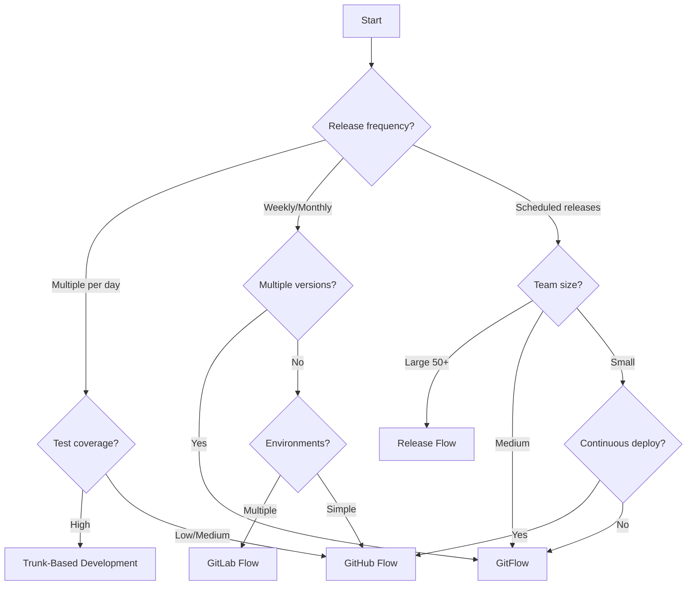

### Recommendations by Context

| Context | Recommended Strategy | Rationale |
|---------|---------------------|-----------|
| Startup, SaaS | GitHub Flow | Speed, simplicity |
| Enterprise, Scheduled | GitFlow | Release control, compliance |
| Large org, Sprints | Release Flow | Scale, sprint alignment |
| High DevOps maturity | Trunk-Based | Maximum velocity |
| Multiple environments | GitLab Flow | Environment management |
| Open source | Forking Workflow | Contributor management |
| Mixed/Learning | Feature Branch | Simplicity, flexibility |

### Team Maturity Considerations

| Maturity Level | Indicators | Suggested Strategy |
|----------------|------------|-------------------|
| Beginning | Manual testing, infrequent deploys | Feature Branch or GitFlow |
| Developing | Some automation, weekly deploys | GitHub Flow or GitLab Flow |
| Mature | CI/CD, automated testing | GitHub Flow or Trunk-Based |
| Elite | Continuous deployment, feature flags | Trunk-Based Development |

---

## Best Practices

### Universal Guidelines

1. **Keep branches short-lived**
   - Feature branches: < 1 week
   - Trunk-based: < 1-2 days

2. **Use meaningful branch names**
   ```
   feature/JIRA-123-user-authentication
   bugfix/login-timeout-error
   docs/update-readme
   ```

3. **Write clear commit messages**
   ```
   feat(auth): add OAuth2 login support
   
   - Implement Google OAuth2 provider
   - Add token refresh mechanism
   - Update user session handling
   
   Closes #123
   ```

4. **Rebase vs Merge**
   | Approach | When to Use |
   |----------|-------------|
   | Rebase | Clean history, feature branches |
   | Merge | Preserve branch history, shared branches |

5. **Protect important branches**
   - Require pull request reviews
   - Enforce status checks
   - Prevent force pushes

6. **Automate where possible**
   - Branch creation from issues
   - Auto-delete merged branches
   - Automated changelog generation

### Common Anti-Patterns to Avoid

| Anti-Pattern | Problem | Solution |
|--------------|---------|----------|
| Long-lived branches | Merge conflicts, stale code | Keep branches < 1 week |
| Direct commits to main | No review, broken builds | Require PRs and CI |
| Large pull requests | Hard to review | Break into smaller changes |
| Inconsistent naming | Confusion, automation breaks | Enforce naming conventions |
| Skipping code review | Quality issues | Mandatory reviews |
| Not syncing with main | Divergence, conflicts | Regular rebases/merges |

---

## Related Topics

- [8.1 DevOps Architecture](./8.1-devops-architecture.md) - CI/CD pipelines and automation
- [8.2 Runtime & Deployment Architecture](./8.2-runtime-deployment-architecture.md) - Deployment strategies
- [Architecture Taxonomy Reference](../10-practicality-taxonomy/architecture_taxonomy_reference.md)
- [Azure DevOps](../../architecture-azure/devops/) - Azure-specific DevOps practices

## References

- [A Successful Git Branching Model (GitFlow)](https://nvie.com/posts/a-successful-git-branching-model/)
- [GitHub Flow](https://docs.github.com/en/get-started/using-github/github-flow)
- [GitLab Flow](https://docs.gitlab.com/ee/topics/gitlab_flow.html)
- [Trunk-Based Development](https://trunkbaseddevelopment.com/)
- [Release Flow - Microsoft](https://devblogs.microsoft.com/devops/release-flow-how-we-do-branching-on-the-vsts-team/)
