# 9.1.2 Other Industry Architectures

## Overview

This document covers industry-specific architectural patterns for Healthcare, Telecommunications, Government, and E-commerce sectors. Each industry has unique requirements, regulations, and challenges that shape their architectural approaches.

## Table of Contents

- [Healthcare Architecture](#healthcare-architecture)
- [Telecommunications Architecture](#telecommunications-architecture)
- [Government Architecture](#government-architecture)
- [E-commerce Architecture](#e-commerce-architecture)
- [Cross-Industry Patterns](#cross-industry-patterns)
- [Related Topics](#related-topics)

---

## Healthcare Architecture

### Overview

Healthcare Architecture addresses the unique requirements of patient care systems, medical records management, clinical workflows, and health information exchange. This domain requires strict adherence to privacy regulations and interoperability standards.

### Key Characteristics

| Characteristic | Requirement | Impact |
|----------------|-------------|--------|
| Privacy | HIPAA, HITECH compliance | PHI protection, access controls |
| Interoperability | HL7 FHIR, DICOM | Standard data formats |
| Availability | 24/7 for critical systems | Redundancy, failover |
| Data Integrity | Accurate medical records | Audit trails, versioning |
| Scalability | Growing patient populations | Elastic infrastructure |

### Reference Architecture

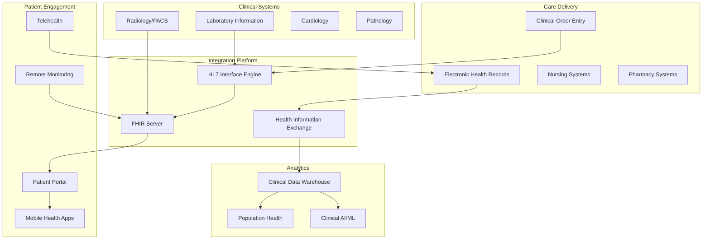

### FHIR-Based Integration

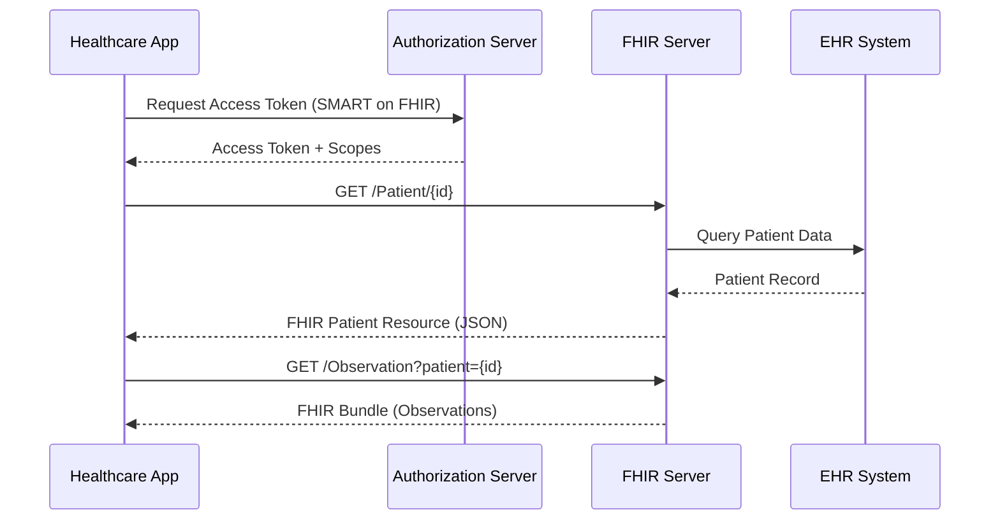

### Healthcare Data Standards

| Standard | Purpose | Format |
|----------|---------|--------|
| HL7 v2.x | Message exchange | Pipe-delimited |
| HL7 FHIR | Modern API standard | JSON/XML |
| DICOM | Medical imaging | Binary + metadata |
| CDA | Clinical documents | XML |
| ICD-10 | Diagnosis coding | Code system |
| SNOMED CT | Clinical terminology | Ontology |
| LOINC | Lab observations | Code system |

### HIPAA Compliance Architecture

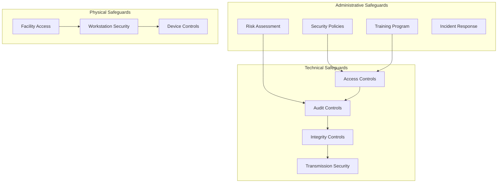

---

## Telecommunications Architecture

### Overview

Telecommunications Architecture supports the infrastructure for voice, data, and multimedia communications. This includes network management, service delivery platforms, and customer experience systems.

### Key Characteristics

| Characteristic | Requirement | Impact |
|----------------|-------------|--------|
| Scalability | Millions of subscribers | Distributed architecture |
| Reliability | 99.999% (five 9s) | Redundancy, self-healing |
| Real-time | Voice/video quality | Low latency networking |
| Billing | Complex rating models | Flexible billing systems |
| Regulatory | Spectrum, privacy laws | Compliance frameworks |

### Reference Architecture

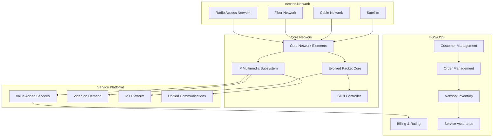

### 5G Network Architecture

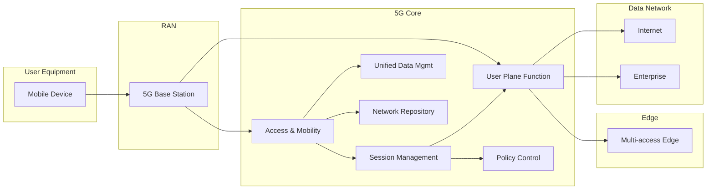

### Network Function Virtualization (NFV)

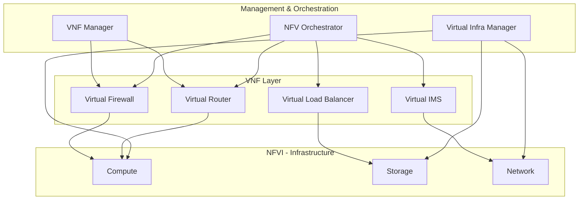

---

## Government Architecture

### Overview

Government Architecture supports public sector operations including citizen services, inter-agency communication, and national security systems. This domain emphasizes security, accessibility, and transparency.

### Key Characteristics

| Characteristic | Requirement | Impact |
|----------------|-------------|--------|
| Security | FedRAMP, IL4-IL6 | Strict security controls |
| Accessibility | Section 508, WCAG | Universal design |
| Transparency | Open data initiatives | Public APIs, data portals |
| Interoperability | Cross-agency sharing | Standard protocols |
| Sovereignty | Data residency | Local data centers |

### Reference Architecture (FEAF - Federal Enterprise Architecture Framework)

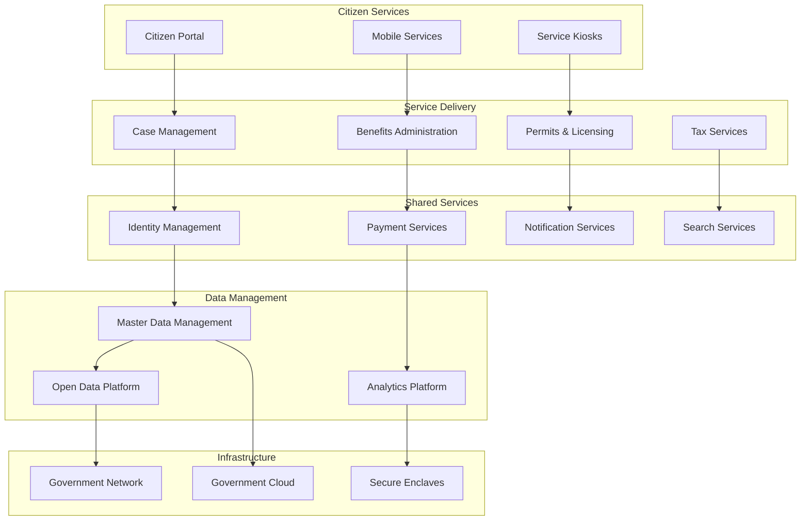

### Security Classification Levels

| Level | Data Type | Examples |
|-------|-----------|----------|
| Unclassified | Public information | Open data, press releases |
| CUI | Controlled Unclassified | PII, financial data |
| Confidential | Low-level classified | Minor national security |
| Secret | Classified | Intelligence, military ops |
| Top Secret | Highly classified | Critical national security |
| TS/SCI | Compartmented | Need-to-know intelligence |

### Zero Trust Architecture for Government

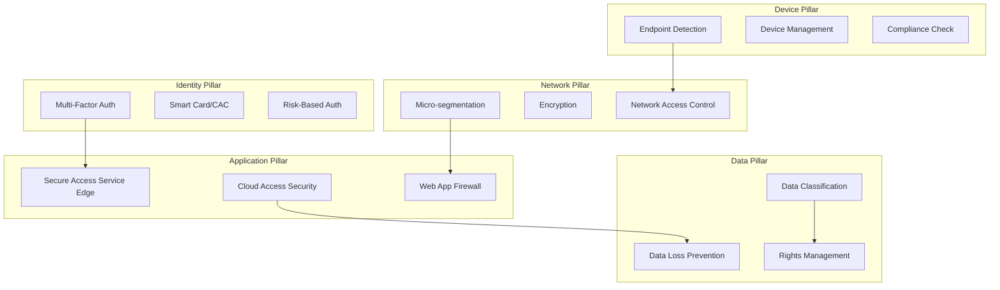

---

## E-commerce Architecture

### Overview

E-commerce Architecture supports online retail operations including product catalogs, shopping carts, payment processing, order fulfillment, and customer experience. This domain requires high scalability, especially during peak shopping periods.

### Key Characteristics

| Characteristic | Requirement | Impact |
|----------------|-------------|--------|
| Scalability | Handle traffic spikes (10-100x) | Auto-scaling, CDN |
| Performance | Sub-second page loads | Caching, optimization |
| Availability | 99.9%+ during peak | Redundancy, failover |
| Personalization | Individual experiences | ML recommendations |
| Security | PCI-DSS compliance | Secure payments |

### Reference Architecture

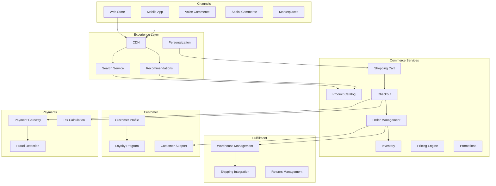

### Microservices for E-commerce

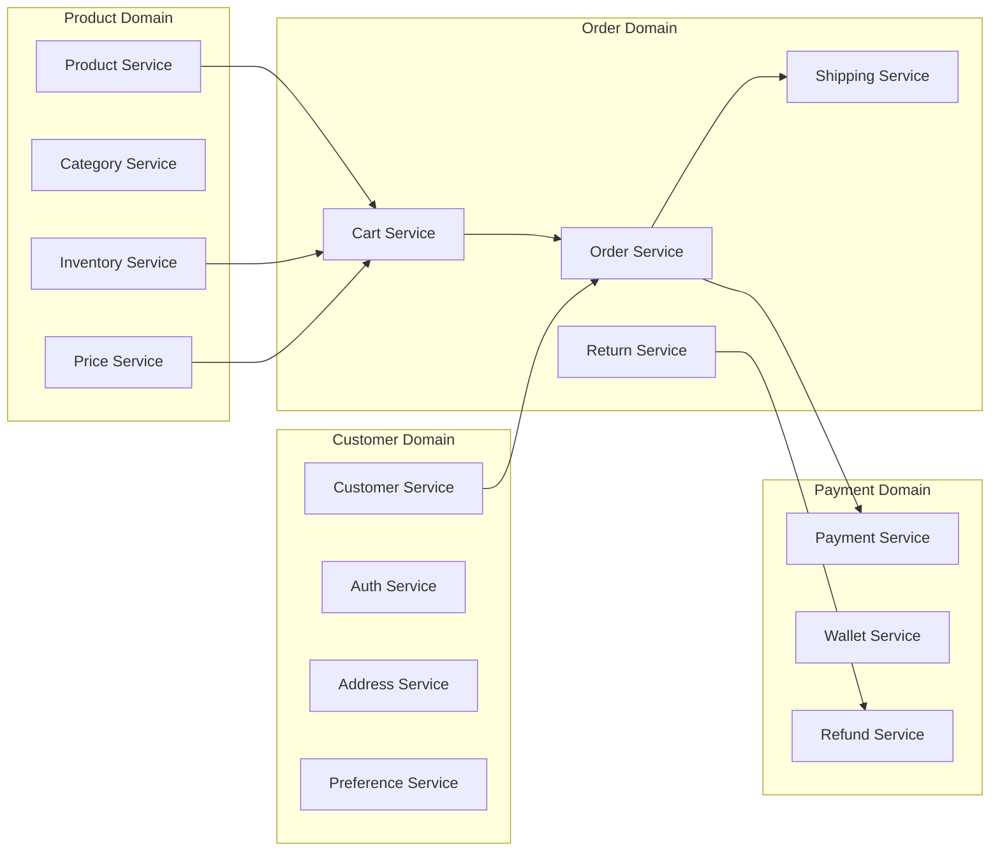

### Event-Driven E-commerce

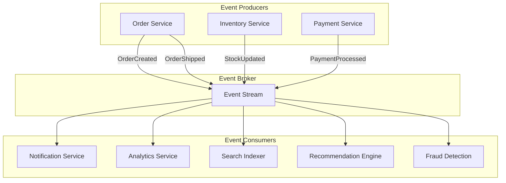

### Peak Traffic Handling

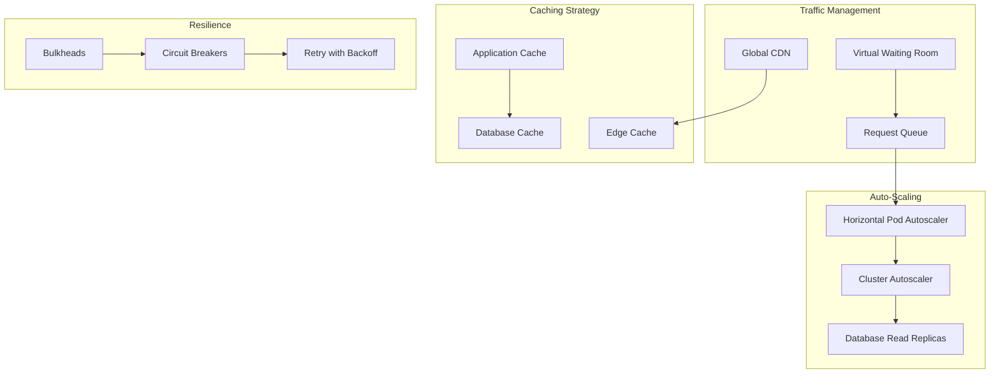

---

## Cross-Industry Patterns

### Common Architectural Patterns

| Pattern | Healthcare | Telecom | Government | E-commerce |
|---------|------------|---------|------------|------------|
| Event Sourcing | ✓ Clinical events | ✓ CDRs | ✓ Audit logs | ✓ Orders |
| CQRS | ✓ Patient queries | ✓ Billing | ✓ Reporting | ✓ Catalogs |
| Saga Pattern | ✓ Care workflows | ✓ Provisioning | ✓ Approvals | ✓ Checkout |
| Circuit Breaker | ✓ Integrations | ✓ Network ops | ✓ Services | ✓ Payments |

### Compliance Requirements Comparison

| Requirement | Healthcare | Telecom | Government | E-commerce |
|-------------|------------|---------|------------|------------|
| Data Privacy | HIPAA | CPNI | Privacy Act | GDPR, CCPA |
| Security | HIPAA Security | FCC Rules | FISMA, FedRAMP | PCI-DSS |
| Audit | Access logs | CDR retention | FOIA compliance | Transaction logs |
| Retention | 6-10 years | Varies | Varies | 3-7 years |

### Technology Stack by Industry

| Layer | Healthcare | Telecom | Government | E-commerce |
|-------|------------|---------|------------|------------|
| Frontend | React, Vue | React Native | Angular, React | React, Next.js |
| Backend | Java, Python | Java, Go | Java, .NET | Node.js, Python |
| Database | PostgreSQL, MongoDB | Oracle, Cassandra | PostgreSQL, SQL Server | PostgreSQL, DynamoDB |
| Messaging | Kafka, RabbitMQ | Kafka | RabbitMQ, SQS | Kafka, SQS |
| Cloud | AWS, Azure | Private/Hybrid | GovCloud | AWS, GCP |

---

## Related Topics

- [9.1.1 Financial Services Architecture](./9.1-industry-architectures.md) - Banking, trading, and fintech architectures
- [9.2 Specialized Architectures](./9.2-specialized-architectures.md) - IoT, Blockchain, Gaming architectures
- [Security Architecture](../06-security-architecture/) - Security patterns and frameworks
- [Data Architecture](../04-data-analytics-ai-architecture/) - Data management patterns
- [Integration Architecture](../03-integration-communication-architecture/) - Integration patterns
