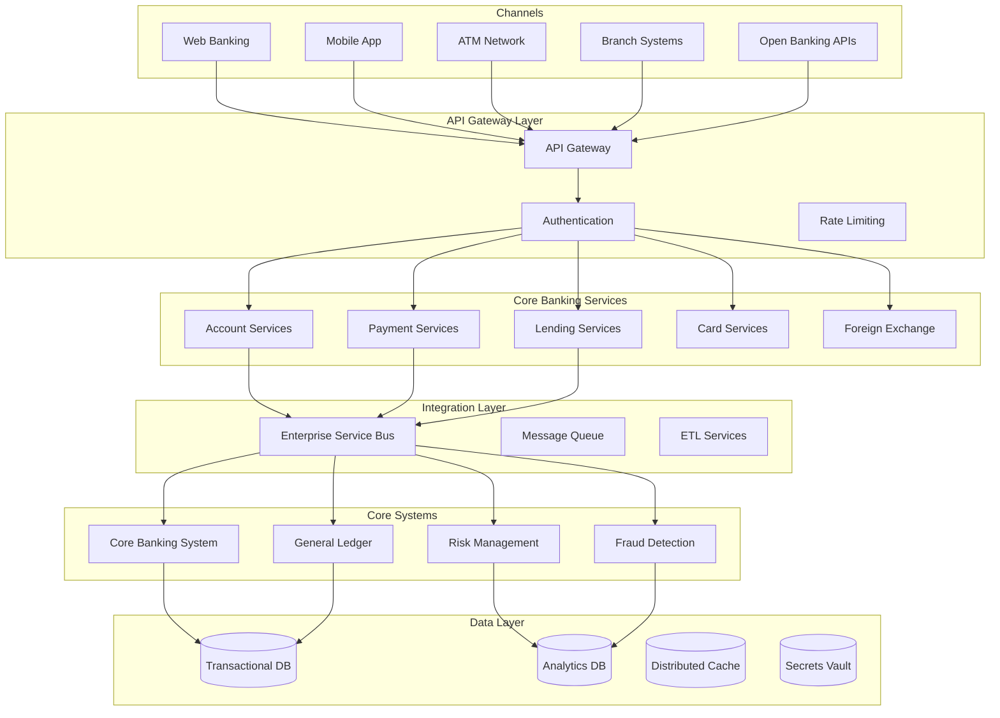
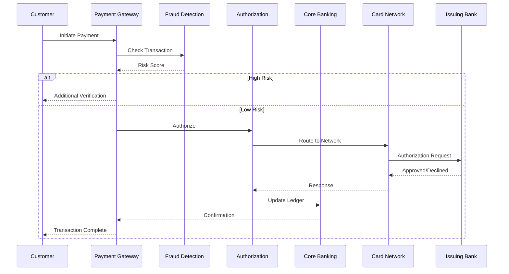
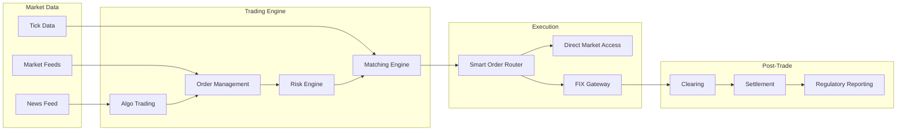
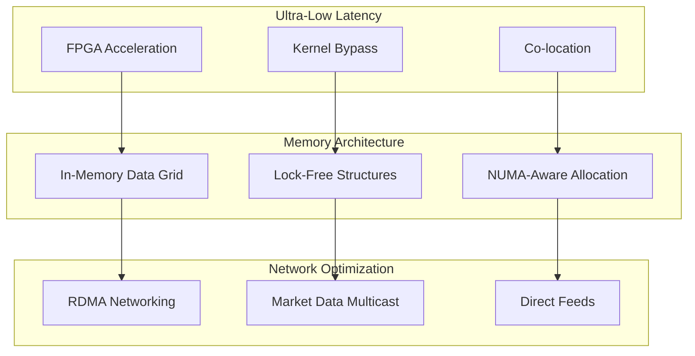
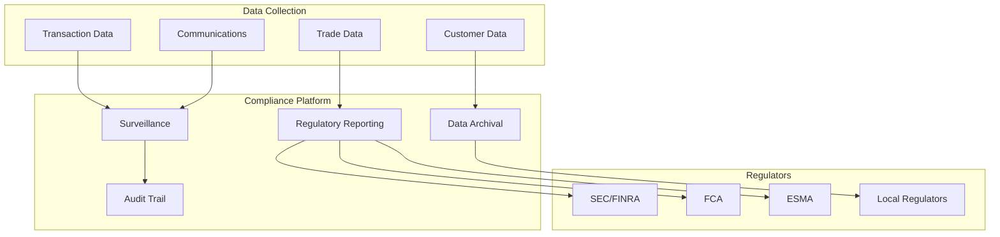
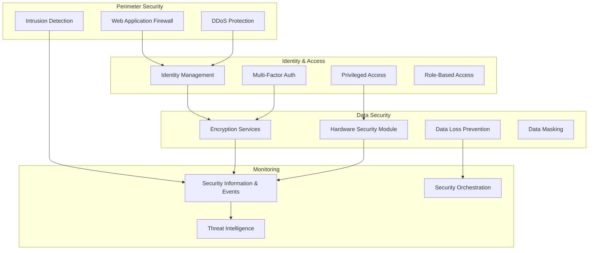
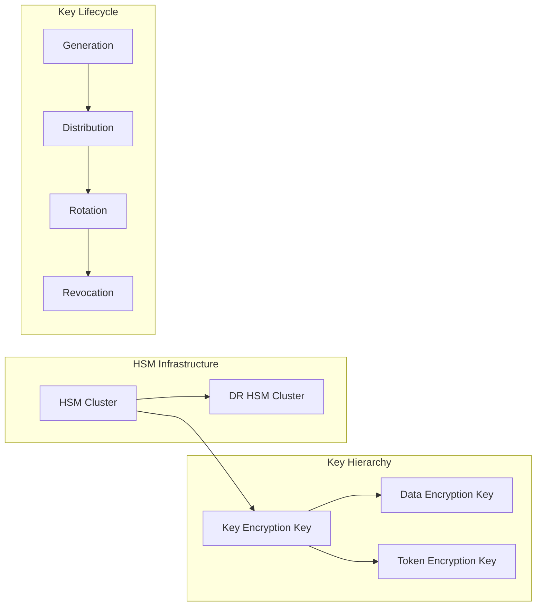
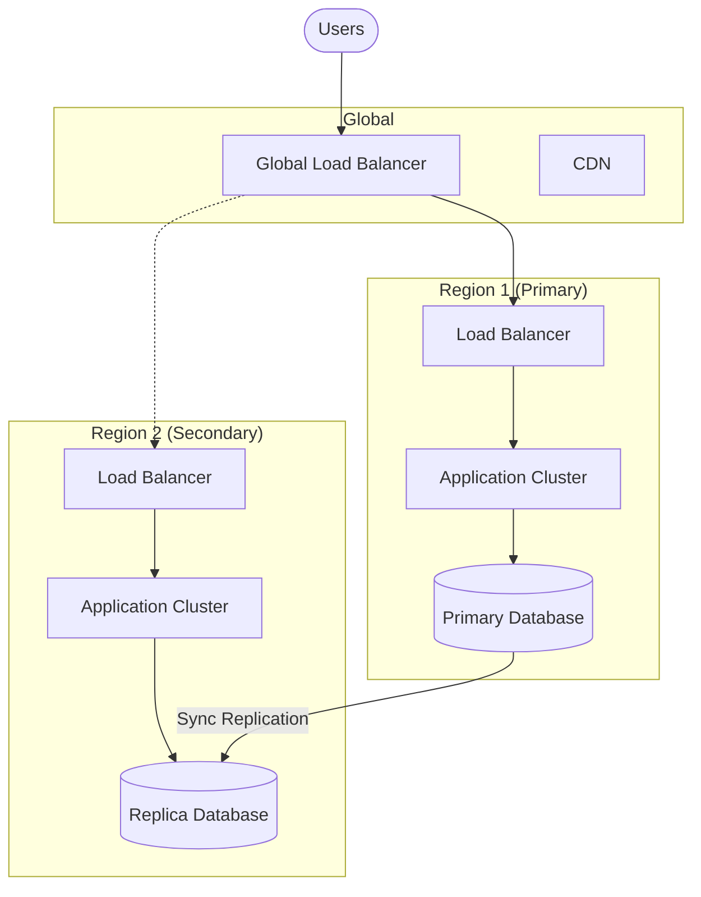
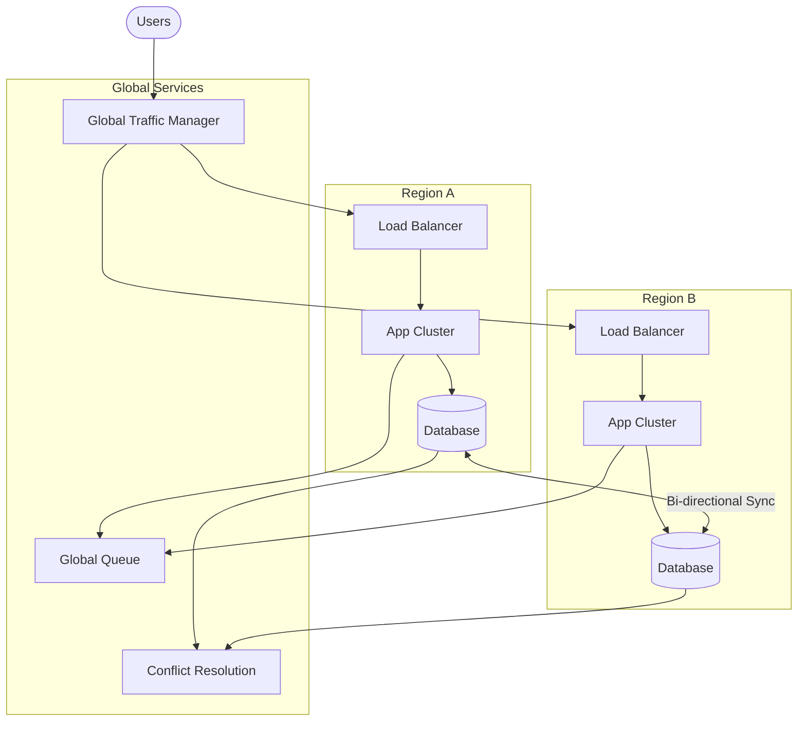

# 9.1.1 Financial Services Architecture

## Overview

Financial Services Architecture encompasses the design patterns, security frameworks, and regulatory compliance structures required for banking, insurance, capital markets, and fintech applications. This domain demands the highest levels of security, reliability, and auditability.

## Table of Contents

- [Key Characteristics](#key-characteristics)
- [Reference Architecture](#reference-architecture)
- [Payment Processing Architecture](#payment-processing-architecture)
- [Trading Platform Architecture](#trading-platform-architecture)
- [Regulatory Compliance Framework](#regulatory-compliance-framework)
- [Security Architecture](#security-architecture)
- [High Availability Patterns](#high-availability-patterns)
- [Related Topics](#related-topics)

---

## Key Characteristics

| Characteristic | Requirement | Impact |
|----------------|-------------|--------|
| Regulatory Compliance | PCI-DSS, SOX, Basel III, MiFID II | Strict audit trails, data retention |
| Security | Zero-trust, encryption at rest/transit | Multi-layer security architecture |
| Availability | 99.99%+ uptime | Active-active, disaster recovery |
| Latency | Sub-millisecond for trading | Optimized network, co-location |
| Auditability | Complete transaction history | Immutable logs, data lineage |

---

## Reference Architecture

---

## Payment Processing Architecture

### Payment Flow Components

| Component | Responsibility | Key Features |
|-----------|---------------|--------------|
| Payment Gateway | Entry point for transactions | Tokenization, routing |
| Fraud Detection | Real-time risk assessment | ML models, rules engine |
| Authorization | Transaction approval | Limit checks, account validation |
| Core Banking | Ledger management | Double-entry accounting |
| Card Network | Inter-bank routing | Visa, Mastercard, SWIFT |

---

## Trading Platform Architecture

### Trading System Components

| Component | Purpose | Latency Requirements |
|-----------|---------|---------------------|
| Order Management System | Order lifecycle management | < 10ms |
| Matching Engine | Price-time priority matching | < 1ms |
| Risk Engine | Pre-trade risk checks | < 5ms |
| Smart Order Router | Best execution routing | < 2ms |
| FIX Gateway | Standard protocol interface | < 1ms |

### Low-Latency Architecture Patterns

---

## Regulatory Compliance Framework

| Regulation | Region | Focus Area | Key Requirements |
|------------|--------|------------|------------------|
| PCI-DSS | Global | Card Data | Encryption, access control, logging |
| SOX | USA | Financial Reporting | Internal controls, audit trails |
| GDPR | EU | Data Privacy | Consent, right to erasure, portability |
| Basel III | Global | Banking | Capital requirements, liquidity |
| MiFID II | EU | Markets | Transaction reporting, best execution |
| PSD2 | EU | Payments | Open banking, SCA |
| SOC 2 | USA | Service Orgs | Security, availability, confidentiality |
| GLBA | USA | Financial Privacy | Privacy notices, safeguards |
| Dodd-Frank | USA | Financial Reform | Derivatives reporting, Volcker Rule |

### Compliance Architecture

---

## Security Architecture

### Security Controls by Layer

| Layer | Controls | Technologies |
|-------|----------|--------------|
| Network | Segmentation, firewalls | NSG, VLAN, Zero Trust |
| Application | Authentication, authorization | OAuth 2.0, OIDC, RBAC |
| Data | Encryption, tokenization | AES-256, HSM, TDE |
| Endpoint | EDR, patch management | CrowdStrike, Tanium |
| Identity | MFA, SSO, PAM | Okta, CyberArk |

### Cryptographic Key Management

---

## High Availability Patterns

### Availability Tiers

| Tier | Availability | Downtime/Year | Use Case |
|------|-------------|---------------|----------|
| Standard | 99.9% | 8.76 hours | Back office systems |
| High | 99.99% | 52.6 minutes | Customer-facing apps |
| Mission Critical | 99.999% | 5.26 minutes | Trading, payments |
| Ultra | 99.9999% | 31.5 seconds | Core banking |

### Disaster Recovery Patterns

| Pattern | RPO | RTO | Cost | Complexity |
|---------|-----|-----|------|------------|
| Backup/Restore | Hours | Hours | Low | Low |
| Pilot Light | Minutes | Minutes | Medium | Medium |
| Warm Standby | Seconds | Minutes | High | High |
| Active-Active | Zero | Zero | Very High | Very High |

### Active-Active Architecture

---

## Related Topics

- [9.1.2 Other Industry Architectures](./9.1.2-other-industry-architectures.md) - Healthcare, Telecom, Government, E-commerce
- [9.2 Specialized Architectures](./9.2-specialized-architectures.md) - IoT, Blockchain, Gaming architectures
- [Security Architecture](../06-security-architecture/) - Security patterns and frameworks
- [Data Architecture](../04-data-analytics-ai-architecture/) - Data management patterns
- [Integration Architecture](../03-integration-communication-architecture/) - Integration patterns
