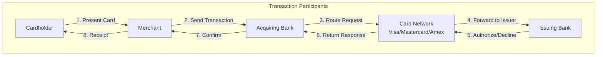

# 9.1.1.1 Credit Card Transaction System Architecture

## Overview

Credit Card Transaction System Architecture defines the end-to-end flow of payment card transactions, from the moment a cardholder initiates a payment to the final settlement between financial institutions. This architecture must handle millions of transactions per day with sub-second response times while maintaining the highest levels of security and compliance.

## Table of Contents

- [Transaction Ecosystem](#transaction-ecosystem)
- [Transaction Flow Architecture](#transaction-flow-architecture)
- [Authorization Architecture](#authorization-architecture)
- [Clearing and Settlement](#clearing-and-settlement)
- [Key System Components](#key-system-components)
- [Security Architecture](#security-architecture)
- [Fraud Detection System](#fraud-detection-system)
- [High Availability Patterns](#high-availability-patterns)
- [Performance Requirements](#performance-requirements)
- [Compliance Framework](#compliance-framework)
- [Related Topics](#related-topics)

---

## Transaction Ecosystem

### Key Participants

### Participant Roles

| Participant | Role | Responsibilities |
|-------------|------|------------------|
| **Cardholder** | Consumer | Initiates transaction, authenticates identity |
| **Merchant** | Seller | Accepts card, submits transaction |
| **Acquiring Bank** | Merchant's Bank | Processes merchant transactions, settles funds |
| **Card Network** | Switch | Routes transactions, sets interchange rules |
| **Issuing Bank** | Cardholder's Bank | Issues card, authorizes transactions, assumes risk |
| **Payment Processor** | Service Provider | Handles technical processing for acquirers/issuers |
| **Payment Gateway** | Technical Interface | Connects merchant systems to processor |

---

...existing content...
