# 9.1.1.1 Credit Card Transaction System Architecture

## Overview

Credit Card Transaction System Architecture defines the end-to-end flow of payment card transactions, from the moment a cardholder initiates a payment to the final settlement between financial institutions. This architecture must handle millions of transactions per day with sub-second response times while maintaining the highest levels of security and compliance.

## Table of Contents

- [Transaction Ecosystem](#transaction-ecosystem)
- [Transaction Flow Architecture](#transaction-flow-architecture)
- [Authorization Architecture](#authorization-architecture)
- [Clearing and Settlement](#clearing-and-settlement)
- [Key System Components](#key-system-components)
- [Security Architecture](#security-architecture)
- [Fraud Detection System](#fraud-detection-system)
- [High Availability Patterns](#high-availability-patterns)
- [Performance Requirements](#performance-requirements)
- [Compliance Framework](#compliance-framework)
- [Related Topics](#related-topics)

---

## Transaction Ecosystem

### Key Participants

### Participant Roles

| Participant | Role | Responsibilities |
|-------------|------|------------------|
| **Cardholder** | Consumer | Initiates transaction, authenticates identity |
| **Merchant** | Seller | Accepts card, submits transaction |
| **Acquiring Bank** | Merchant's Bank | Processes merchant transactions, settles funds |
| **Card Network** | Switch | Routes transactions, sets interchange rules |
| **Issuing Bank** | Cardholder's Bank | Issues card, authorizes transactions, assumes risk |
| **Payment Processor** | Service Provider | Handles technical processing for acquirers/issuers |
| **Payment Gateway** | Technical Interface | Connects merchant systems to processor |

---

### End-to-End Transaction Flow

### Transaction Types

| Type | Description | Authorization | Settlement |
|------|-------------|---------------|------------|
| **Purchase** | Standard sale transaction | Real-time | Batch |
| **Pre-Authorization** | Hold funds for future capture | Real-time | Deferred |
| **Capture** | Complete pre-authorized transaction | N/A | Batch |
| **Refund** | Return funds to cardholder | Real-time | Batch |
| **Void** | Cancel before settlement | Real-time | N/A |
| **Reversal** | Undo authorization | Real-time | N/A |
| **Chargeback** | Disputed transaction | Manual | Manual |

---

## Authorization Architecture

### Authorization System Components

### ISO 8583 Message Structure

### Authorization Response Codes

| Code | Meaning | Action |
|------|---------|--------|
| 00 | Approved | Complete transaction |
| 01 | Refer to issuer | Call authorization center |
| 05 | Do not honor | Decline, request alternate payment |
| 14 | Invalid card number | Verify card number |
| 51 | Insufficient funds | Decline, request alternate payment |
| 54 | Expired card | Request valid card |
| 55 | Invalid PIN | Re-enter PIN |
| 61 | Exceeds limit | Request lower amount |
| 91 | Issuer unavailable | Retry or stand-in processing |

---

## Clearing and Settlement

**Clearing** and **Settlement** are two distinct but interconnected processes that occur after a financial transaction (like a credit card payment) is executed.

### What is Clearing?

**Clearing** is the process of **reconciling and validating** a transaction between parties before the actual transfer of funds occurs.

**What happens during clearing:**
- Confirms the details of the trade (amount, parties involved, transaction type)
- Calculates the obligations of each party (who owes what to whom)
- Nets multiple transactions to reduce the number of actual transfers needed
- Manages counterparty risk (ensures both parties can fulfill their obligations)

**Example:** After you make a purchase, the clearinghouse verifies that the merchant submitted the transaction correctly and calculates what the issuing bank owes.

### What is Settlement?

**Settlement** is the **actual transfer** of funds between parties—the final step where the transaction is completed.

**What happens during settlement:**
- The merchant receives payment (minus fees)
- The cardholder's account is debited
- Ownership of funds is officially transferred
- The transaction is finalized and irrevocable

**Example:** The funds are transferred from your issuing bank through the network to the acquiring bank, which then deposits into the merchant's account.

### Clearing vs Settlement: Key Differences

| Aspect | Clearing | Settlement |
|--------|----------|------------|
| **Purpose** | Validate & reconcile transactions | Execute the actual fund transfer |
| **Timing** | Happens first (T+0 to T+1) | Happens after clearing (T+1 to T+2) |
| **Risk** | Manages counterparty risk | Eliminates counterparty risk |
| **Output** | Confirmed obligations & net positions | Completed fund transfers |
| **Frequency** | Batch processing (end of day) | Scheduled settlement windows |

### Why This Two-Step Process?

- **Risk Reduction:** Clearinghouses and networks act as intermediaries, guaranteeing transactions even if one party defaults
- **Efficiency:** Netting reduces millions of individual transactions to net positions, minimizing actual fund movements
- **Trust:** Merchants and cardholders can transact without directly trusting each other
- **Cost Reduction:** Fewer actual transfers means lower banking and wire fees

### Clearing Process Architecture

### Settlement Timeline

```mermaid
gantt
    title Credit Card Clearing & Settlement Timeline
    dateFormat  HH:mm
    axisFormat %H:%M
    
    section Day 0 - Transaction
    Transaction Occurs           :t1, 10:00, 1h
    Authorization (Real-time)    :t2, after t1, 5m
    Merchant Batch Close         :t3, 23:00, 30m
    
    section Day 1 - CLEARING
    Clearing Files Sent          :crit, t4, 02:00, 2h
    Transaction Matching         :crit, t5, 04:00, 2h
    Reconciliation               :crit, t6, 06:00, 2h
    Interchange/Fee Calculation  :crit, t7, 08:00, 2h
    Netting (Net Positions)      :crit, t8, 10:00, 2h
    
    section Day 2 - SETTLEMENT
    Fund Transfer Initiated      :active, t9, 06:00, 2h
    Settlement Complete          :active, t10, 08:00, 2h
    Merchant Funding             :active, t11, 10:00, 4h
```

> **Note:** 
> - **Clearing (Day 1):** Validates transactions, matches records, calculates fees, and determines net positions
> - **Settlement (Day 2):** Actual transfer of funds based on the net positions calculated during clearing

---

### Phase Breakdown

#### **Day 0 - Transaction & Authorization Phase**

**1. Transaction Occurs (10:00 AM)**
- Customer presents card at merchant POS terminal
- Transaction details captured (amount, merchant ID, card number)
- Transaction data encrypted and prepared for authorization

**2. Authorization - Real-time (10:05 AM - within seconds)**
- Payment gateway sends authorization request to acquirer
- Request routed through card network (Visa/Mastercard) to issuing bank
- Issuer performs:
  - **Balance check:** Does cardholder have available credit/funds?
  - **Fraud screening:** Does this match cardholder's spending pattern?
  - **Risk assessment:** Apply velocity checks, geographic limits
- Response sent back (Approved/Declined) with authorization code
- **Result:** Funds are "held" on customer's account, but NOT yet transferred
- Merchant has **authorization** but hasn't been paid yet

**3. Merchant Batch Close (11:00 PM)**
- Merchant's POS system closes daily batch
- All day's authorized transactions bundled into a settlement file
- Batch file sent to payment processor/acquirer
- **This triggers the clearing process** - merchant is now requesting payment
- Authorizations become "captures" (actual charges vs. holds)

---

#### **Day 1 - CLEARING Phase**

**4. Clearing Files Sent (2:00 AM)**
- Acquirer aggregates batches from all merchants
- Formats data into standardized clearing messages
- Sends clearing files to card network (Visa/Mastercard)
- Issuing banks receive clearing records for their cardholders

**5. Transaction Matching (4:00 AM)**
- Each transaction matched between authorization and clearing records
- Validates: authorization code, amount, merchant ID, card number
- Identifies discrepancies:
  - Amount mismatches (tip added after authorization)
  - Missing authorizations (force captures)
  - Duplicate transactions

**6. Reconciliation (6:00 AM)**
- Resolves any mismatches found during matching
- Updates transaction records with final amounts
- Flags exceptions for manual review
- Confirms which transactions are valid for settlement
- Both issuer and acquirer reconcile their records

**7. Interchange/Fee Calculation (8:00 AM)**
- **Interchange fees** calculated (issuer's revenue from acquirer)
  - Based on: card type, merchant category, transaction type
  - Example: 2.5% of $100 = $2.50 goes to issuing bank
- **Assessment fees** calculated (network's fee)
  - Example: 0.13% of $100 = $0.13 to Visa/Mastercard
- **Processing fees** calculated (acquirer's fee to merchant)
  - Example: 0.3% of $100 = $0.30 to acquirer
- **Net amounts** determined for each party

**8. Netting - Calculate Net Positions (10:00 AM)**
- Aggregate all transactions between parties
- Calculate net positions (who owes whom overall)
- **Example Netting:**
  - Bank A issued $1M in transactions on Bank B's merchants
  - Bank B issued $800K in transactions on Bank A's merchants
  - **Net result:** Bank A owes Bank B only $200K (not $1.8M in individual transfers)
- Creates settlement instructions for next day
- **Clearing Complete** - all parties know exactly what will be transferred

---

#### **Day 2 - SETTLEMENT Phase**

**9. Fund Transfer Initiated (6:00 AM)**
- Card network initiates settlement based on net positions calculated on Day 1
- Settlement instructions sent to settlement banks
- Wire transfers/ACH initiated between financial institutions
- Issuing banks prepare to debit/credit settlement accounts

**10. Settlement Complete (8:00 AM)**
- Funds move between issuing and acquiring banks
- Based on the **net positions** from clearing
- **Issuing banks** debit their settlement accounts (pay out for their cardholders' purchases)
- **Acquiring banks** credit their settlement accounts (receive payment for their merchants' sales)
- All interbank transfers completed
- Settlement is **final and irrevocable**

**11. Merchant Funding (10:00 AM - 2:00 PM)**
- Acquiring bank credits merchant's business bank account
- Merchant receives **net amount:**
  - Gross sales: $100.00
  - Less interchange: -$2.50
  - Less assessment: -$0.13
  - Less processing fee: -$0.30
  - **Net to merchant: $97.07**
- Merchant's bank account updated
- Merchant can now access the funds
- **Transaction lifecycle complete**

---

### Timeline Summary

| Time | Phase | Key Activity | Money Movement |
|------|-------|--------------|----------------|
| Day 0, 10:00 AM | Authorization | Card approved, funds held | None - just authorization |
| Day 0, 11:00 PM | Capture | Merchant closes batch | None - just data submission |
| Day 1, 2:00-12:00 PM | **Clearing** | Validate, match, calculate fees, net positions | None - just calculations |
| Day 2, 6:00-8:00 AM | **Settlement** | Interbank fund transfers | Banks exchange net amounts |
| Day 2, 10:00 AM-2:00 PM | Funding | Merchant receives payment | Merchant gets paid |

---

### Fee Structure

| Fee Type | Payer | Recipient | Typical Range |
|----------|-------|-----------|---------------|
| **Interchange** | Acquirer | Issuer | 1.5% - 3.0% |
| **Assessment** | Acquirer | Network | 0.11% - 0.15% |
| **Processing** | Merchant | Acquirer | 0.1% - 0.5% |
| **Gateway** | Merchant | Gateway | $0.05 - $0.25/txn |
| **Chargeback** | Losing party | N/A | $15 - $100/case |

---

## Key System Components

### Point of Sale (POS) Architecture

### Payment Gateway Architecture

### Card Network Infrastructure

---

## Security Architecture

### PCI-DSS Compliance Architecture

### PCI-DSS Requirements Summary

| Requirement | Category | Key Controls |
|-------------|----------|--------------|
| 1 | Network Security | Firewalls, network segmentation |
| 2 | Secure Configuration | Hardened systems, no defaults |
| 3 | Data Protection | Encryption, key management |
| 4 | Transmission Security | TLS 1.2+, secure protocols |
| 5 | Malware Protection | Antivirus, anti-malware |
| 6 | Secure Development | SDLC, vulnerability management |
| 7 | Access Control | Need-to-know, least privilege |
| 8 | Authentication | Unique IDs, MFA, strong passwords |
| 9 | Physical Security | Facility access, media handling |
| 10 | Logging & Monitoring | Audit trails, log review |
| 11 | Security Testing | Penetration testing, scans |
| 12 | Security Policies | Policies, procedures, training |

### Tokenization Architecture

### EMV Security

---

## Fraud Detection System

### Real-Time Fraud Detection Architecture

### Fraud Detection Rules

| Rule Category | Examples | Action |
|---------------|----------|--------|
| **Velocity** | >3 transactions in 5 minutes | Review/Decline |
| **Geographic** | Transaction 1000+ miles from last | Step-up auth |
| **Amount** | >200% of average transaction | Review |
| **Time** | Transaction at unusual hour | Score increase |
| **Device** | New device, high-risk country | Challenge |
| **Pattern** | Testing pattern (small amounts) | Decline |
| **Blacklist** | Known fraud indicators | Decline |

### 3D Secure Architecture

---

## High Availability Patterns

### Multi-Region Active-Active Architecture

### Failover Scenarios

| Scenario | Detection | Failover Time | Data Loss |
|----------|-----------|---------------|-----------|
| Server failure | Health check | < 30 seconds | None |
| Database failure | Replication lag | < 60 seconds | < 1 second |
| Region failure | DNS health | < 5 minutes | Minimal |
| Network partition | Connectivity check | < 2 minutes | None |

### Stand-In Processing

---

## Performance Requirements

### Latency Requirements

| Operation | Target | Maximum | Percentile |
|-----------|--------|---------|------------|
| Authorization | < 500ms | 2s | P99 |
| Gateway processing | < 100ms | 500ms | P99 |
| Fraud check | < 50ms | 200ms | P99 |
| Token lookup | < 10ms | 50ms | P99 |
| Database query | < 5ms | 20ms | P99 |

### Throughput Requirements

| System Component | TPS (Normal) | TPS (Peak) | Burst |
|------------------|--------------|------------|-------|
| Payment Gateway | 1,000 | 5,000 | 10,000 |
| Authorization Engine | 500 | 2,000 | 5,000 |
| Fraud Detection | 1,000 | 5,000 | 10,000 |
| Tokenization | 2,000 | 10,000 | 20,000 |
| Network Interface | 10,000 | 50,000 | 100,000 |

### Capacity Planning

---

## Compliance Framework

### Regulatory Requirements

| Regulation | Scope | Key Requirements |
|------------|-------|------------------|
| **PCI-DSS** | Card data handling | 12 requirement categories |
| **PSD2/SCA** | EU payments | Strong Customer Authentication |
| **SOX** | Financial reporting | Internal controls |
| **GLBA** | Financial privacy | Safeguards rule |
| **Reg E** | Electronic transfers | Consumer protection |
| **Nacha Rules** | ACH transactions | Operating rules |

### Audit Trail Requirements

---

## Related Topics

- [9.1.1 Financial Services Architecture](./9.1.1-financial-services-architecture.md) - Parent document
- [Security Architecture](../../06-security-architecture/) - Security patterns and frameworks
- [Integration Architecture](../../03-integration-communication-architecture/) - Integration patterns
- [High Availability Patterns](../../07-reliability-performance-operations/) - Reliability patterns
