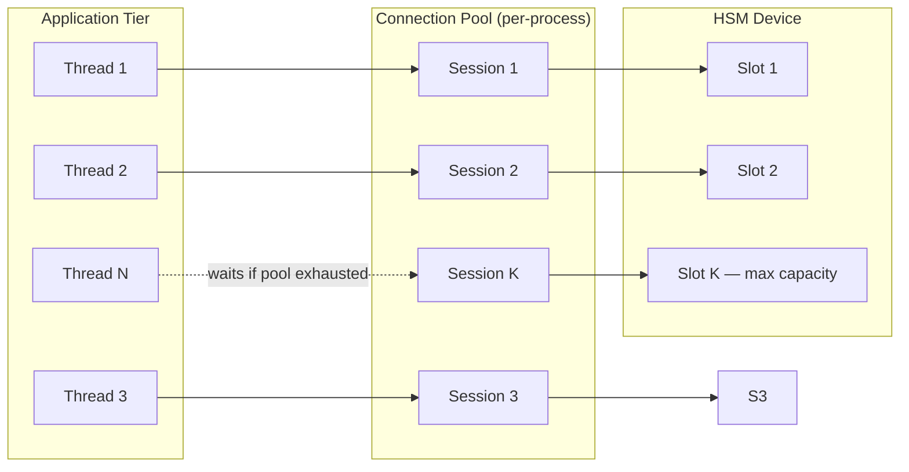
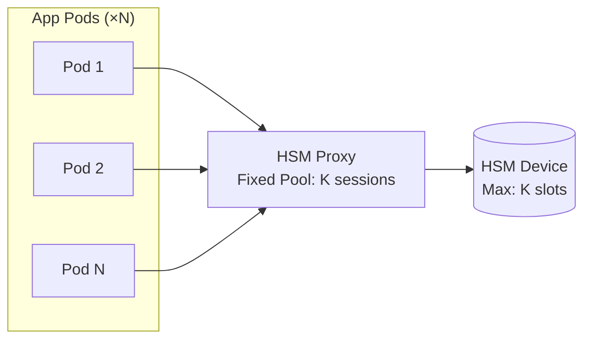
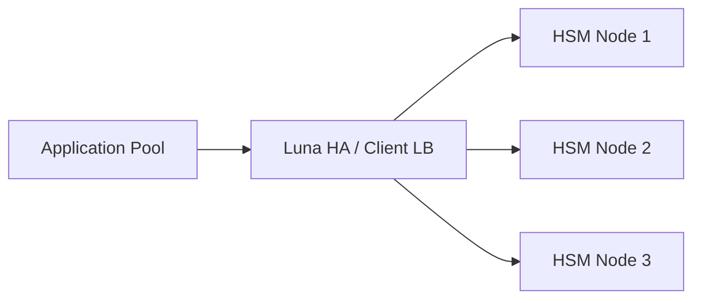
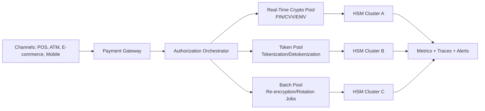

# 9.1.1.2 HSM in Payment Systems Architecture

> **Taxonomy Reference**: §9.1.1 Financial Services Architecture, §6.4 Data Security, §7.2 Performance & Scalability (see [architecture_taxonomy_reference.md](../10-practicality-taxonomy/architecture_taxonomy_reference.md))

## Overview

Hardware Security Modules (HSMs) are the trust anchor of payment systems and also one of their strongest throughput constraints. In high-volume authorization flows, HSM latency and connection limits directly shape customer-facing SLA outcomes.

This document evaluates the article "HSM Entegrasyonu Neden Mimari Darbogaz Yaratir ve Kriptografik Operasyonlarin Tasarim Bedeli" and turns its thesis into practical architecture guidance.

## Article Evaluation

### Core Thesis

The article argues that HSM integration creates an architectural bottleneck because:

- HSM capacity is not elastically scalable like stateless application tiers.
- Payment cryptographic operations are frequently on the synchronous critical path.
- Connection pool saturation creates latency amplification and timeout-driven declines.
- Operational processes (key ceremonies, LMK rotation, failover synchronization) are organizationally heavy and cannot be treated like normal software release mechanics.

### What is Strong and Accurate

- Correctly frames HSM as both security control and performance limiter.
- Correctly emphasizes operational isolation between real-time authorization operations and batch cryptographic workloads.
- Correctly highlights observability gaps (pool usage, per-command latency, tail latency) as a frequent root cause of slow incident diagnosis.
- Correctly links cryptographic architecture decisions to PCI DSS operational and governance constraints.

### What Needs Context or Careful Qualification

- Device- and vendor-specific numbers (connection counts and per-command latency) should be treated as environment-specific benchmarks, not universal constants.
- Crypto command durations vary heavily by algorithm, key size, firmware version, client library behavior, and network path.
- Cloud HSM vs on-prem HSM trade-offs are real, but measured latency distributions under production-like load should drive decisions rather than static assumptions.

### Practical Conclusion

The article is architecturally sound. Its main value is reframing HSM from a pure security component into a first-class performance and reliability dependency that must be modeled explicitly in system design.

## Why HSM Becomes a Bottleneck in Payments

### 1) Asymmetric Scalability

Most payment components scale horizontally with commodity infrastructure. HSM capacity expansion usually involves procurement, ceremony, key distribution, and controlled cutover.

Result: scaling lead time for cryptographic capacity is structurally longer than application scaling lead time.

### 2) Synchronous Critical-Path Calls

Authorization flows (PIN verification, CVV checks, EMV cryptogram validation, token operations) often require synchronous cryptographic decisions before approval.

Result: HSM latency is additive inside end-to-end authorization latency.

### 3) Pool Saturation and Queueing Dynamics

When HSM connection pools saturate, request queue depth rises. Tail latency grows non-linearly and starts triggering upstream timeouts.

Approximate capacity pressure equation:

$$
\text{HSM\_ops\_per\_sec} = \text{TPS}_{peak} \times \text{ops\_per\_txn}
$$

$$
\text{required\_parallelism} \approx \text{HSM\_ops\_per\_sec} \times \text{avg\_op\_latency\_sec}
$$

These should be calculated for p95 and p99 latency, not only average values.

### 4) Operational Coupling to Security Governance

LMK changes, ZMK exchange, key ceremonies, dual control, and split-knowledge workflows are mandatory controls in many regulated environments.

Result: cryptographic architecture and organizational operating model are tightly coupled.

## Connection Pooling for HSM Machines

Unlike databases where connection pooling is a standard library concern, HSM connection pooling is a first-class architectural problem. HSM devices expose a fixed number of concurrent cryptographic sessions (slots/channels), and every application thread that needs to perform a crypto operation must acquire one of those sessions.

### How HSM Connection Pooling Works

HSMs communicate via vendor-specific network protocols (Thales Racal commands, PKCS#11, REST) over TCP. Each application process maintains a pool of long-lived TCP sessions to the HSM. A worker thread acquires a session from the pool, sends one or more commands synchronously, then releases it.



Pool exhaustion occurs when all sessions are occupied and a new thread must wait — this is when queue depth builds and tail latency spikes.

### HSM Sessions vs. Database Connections — Key Difference

This is a common misconception: **HSM sessions cannot be shared across processes the way database connections can**.

In a typical database connection pool (e.g., PgBouncer, HikariCP):
- A connection is a stateless TCP channel that any process or thread can borrow, reset, and reuse.
- The pool manager can hand the same physical connection to a different process after the previous one releases it.

HSM sessions behave differently:

| Property | Database Connection | HSM Session (PKCS#11 / Thales) |
|----------|--------------------|---------------------------------|
| Ownership | Shareable across processes via a proxy | **Process-local** — session handle is internal to the client library process |
| Authentication state | Stateless (credentials passed per query or at login) | Session is **authenticated once** (PIN/login) and remains bound to that process |
| Cross-process handoff | Supported (connection poolers do this) | **Not supported natively** — session handles cannot be serialized or passed via IPC |
| Reuse after release | Yes — any borrower can reuse | Only within the same process that created the session |
| Proxy workaround | Optional optimization | **Required pattern** for cross-process sharing |

#### Why HSM Sessions Are Process-Bound

Under PKCS#11 (the most common HSM interface), a session (`CK_SESSION_HANDLE`) is an opaque integer scoped to the calling process. The HSM client library maps it to internal state (authentication context, slot reference, active operations). This handle has no meaning outside the process that created it.

Under Thales Racal/Host command protocols, the session is a persistent authenticated TCP socket. It can be used by multiple threads within the same process, but the underlying TCP connection and authentication state belong to that process's file descriptor table — not transferable to another process.

**The architectural consequence**: if you want multiple application processes to share a bounded set of HSM sessions, you must introduce a dedicated proxy process that owns those sessions and forwards cryptographic requests over IPC or a local network socket. This is the HSM Proxy pattern (Option 2 below) — it is not optional convenience, it is a structural necessity for cross-process pooling.

---

### Connection Pool Architecture Options

#### Option 1: Per-Process Pool (Standard)

Each application process manages its own pool of HSM sessions directly.

**Pros**: Simple, no extra network hop, low operational overhead.  
**Cons**: Total sessions across all processes can exceed HSM capacity. Requires coordinated sizing across deployment.

```
App Process A: 20 sessions
App Process B: 20 sessions
App Process C: 20 sessions
→ Total: 60 sessions to HSM (must not exceed HSM slot limit)
```

#### Option 2: HSM Proxy / Connection Multiplexer

A dedicated sidecar or proxy process holds a fixed pool of HSM sessions and multiplexes requests from many application threads over fewer persistent HSM connections.

**Pros**: Enforces a hard cap on total HSM connections; decouples application scaling from HSM capacity; enables centralized load shedding and observability.  
**Cons**: Adds one network hop and a potential single point of failure if not deployed redundantly.

Examples: custom-built proxies using Thales client libraries; some vendors ship their own connection manager (e.g., Thales Luna Client Connection Manager).



#### Option 3: HSM Cluster with Client-Side Load Balancing

Deploy multiple HSM devices in a cluster. The client library (e.g., Thales Luna HA) distributes operations across nodes using round-robin or weighted routing.

**Pros**: Horizontal scaling of cryptographic throughput; automatic failover to surviving nodes.  
**Cons**: Key synchronization between nodes adds operational complexity; cluster management requires coordinated key ceremonies.



### Pool Sizing Formula

$$
\text{pool\_size} = \lceil \text{TPS}_{p99} \times \text{avg\_op\_latency\_sec} \rceil \times \text{safety\_factor}
$$

A safety factor of 1.3–1.5 is typical to absorb burst traffic without immediate saturation. Use p99 latency for sizing, not mean latency.

### Key Configuration Parameters

| Parameter | Description | Guidance |
|-----------|-------------|----------|
| `min_pool_size` | Sessions always open | Match steady-state TPS requirement |
| `max_pool_size` | Hard cap on sessions | Must not exceed HSM slot limit across all processes |
| `acquire_timeout_ms` | Max wait to get a session | Set below upstream SLA timeout |
| `command_timeout_ms` | Max time for a single HSM command | Align with p99 latency target + margin |
| `idle_session_ttl` | Evict unused sessions after this period | Keep sessions warm for latency-sensitive flows |
| `health_check_interval` | Frequency of session liveness probes | Detect HSM failover within seconds |

### Observability for Connection Pools

Monitor the following at all times:

- **Pool utilization** (`active_sessions / max_pool_size`): alert above 70%, page above 85%.
- **Queue depth**: sessions waiting for a pool slot; sustained non-zero depth indicates under-provisioning.
- **Acquire latency p95/p99**: time threads spend waiting to get a session.
- **Per-command latency by operation type**: distinguish PIN verify from bulk re-encryption.
- **Session errors and reconnects**: track TLS drops and reconnection storms after HSM failover.

### Anti-Patterns in HSM Connection Pooling

- Creating a new HSM session per request — TLS handshake cost dominates latency.
- Setting `max_pool_size` larger than HSM's physical slot count — causes connection rejection from the HSM.
- Sharing a single pool across real-time authorization and batch re-encryption jobs.
- Not monitoring pool utilization — saturation becomes visible only after SLA breaches.
- Using the same timeout for acquire-pool and HSM-command — they require separate budgets.

---

## Reference Architecture Pattern



Design principle: isolate pools by operation criticality. Do not let batch cryptographic jobs share the same constrained channel as real-time authorization commands.

## Design Guidelines for Payment Systems

### 1) Isolate by Operation Class

- Class A: Authorization-critical operations (strict latency budgets)
- Class B: Customer-interactive but non-authorization operations
- Class C: Batch and maintenance cryptographic operations

Use separate pools, partitions, or dedicated devices/clusters depending on institution size and risk posture.

### 2) Define Crypto SLOs Explicitly

For each operation class define:

- p50/p95/p99 command latency targets
- max pool utilization target
- queue depth thresholds
- timeout budgets aligned with card-network and channel SLAs

### 3) Build Load-Shedding and Degradation Paths

- Protect Class A traffic under stress.
- Pause or throttle Class C jobs automatically on pressure signals.
- Implement deterministic fail-fast behavior before upstream timeout cascades.

### 4) Model Failover Semantics Early

- Test active-passive and active-active cutovers with realistic state/routing constraints.
- Validate key consistency and command-routing correctness during failover.
- Exercise network partition scenarios in game-day tests.

### 5) Treat Observability as Mandatory, Not Optional

Minimum telemetry set:

- pool occupancy and wait time
- per-command throughput and error rates
- p95/p99 command latency by operation type
- HSM CPU/health and failover events
- end-to-end authorization latency correlation with crypto dependency spans

## Notable HSM Modules and Vendors

Selecting the right HSM product is a critical architectural and procurement decision. The following are the most widely deployed HSM modules in payment and enterprise environments, along with their key characteristics.

### Comparison Table

| Vendor | Product | Form Factor | FIPS Level | Common Use Case |
|--------|---------|-------------|------------|-----------------|
| Thales (formerly SafeNet) | Luna Network HSM 7 | Network appliance | 140-2 Level 3 | Enterprise key management, PKI, cloud integration |
| Thales | payShield 10K | Network appliance | 140-2 Level 3 | Payment processing, PIN verification, card personalization |
| Utimaco | Atalla AT1000 | Network appliance | 140-2 Level 3 | ATM PIN management, payment key management |
| Utimaco | SecurityServer | Network appliance | 140-2 Level 3 | Enterprise crypto services, PKI |
| Entrust | nShield Connect | Network appliance | 140-2 Level 3 | General purpose, TLS offloading, PKI |
| Entrust | nShield Solo | PCIe card | 140-2 Level 3 | Embedded/server integration |
| IBM | 4769 PCIe Cryptographic Coprocessor | PCIe card | 140-2 Level 4 | IBM Z/LinuxONE, high-assurance workloads |
| AWS | CloudHSM | Cloud-managed | 140-2 Level 3 | AWS workloads, multi-tenant key isolation |
| Azure | Dedicated HSM (Thales Luna) | Cloud-managed | 140-2 Level 3 | Azure-native PCI-compliant workloads |
| Azure | Payment HSM (Thales payShield) | Cloud-managed | 140-2 Level 3 | Cloud-native payment processing |

### Thales SafeNet Luna Network HSM 7

**Typical use**: Enterprise key management, PKI roots, TLS offloading, cloud integration.

- Supports PKCS#11, JCE, Microsoft CAPI/CNG, and REST APIs.
- High-availability clustering via Luna Network HSM High Availability.
- Common integration pattern in large banks for KEK/LMK management.
- Used as the underlying hardware in Azure Dedicated HSM.

### Thales payShield 10K

**Typical use**: Payment authorization, PIN processing, card personalization, EMV cryptogram generation.

- Implements Thales Racal host command set, widely used in payment gateway integrations.
- Supports ISO TR-31 key blocks for PCI-compliant key exchange.
- Frequently deployed in acquiring banks, payment processors, and card schemes.
- Provides dedicated payment-optimized firmware and command set distinct from general-purpose HSMs.

### Utimaco Atalla AT1000

**Typical use**: ATM networks, PIN management, payment key management.

- Purpose-built for financial payment workflows.
- Implements Atalla host commands, native to many ATM switch and PIN management platforms.
- Often found in older financial institution estates and ATM processor environments.

### Entrust nShield

**Typical use**: General enterprise crypto services, code signing, TLS, PKI.

- Flexible integration with Security World software, enabling portable key management across nShield devices.
- `nShield Connect` (network appliance) and `nShield Solo` (PCIe) available for different deployment topologies.
- Strong tooling for key ceremonies and audit logging.

### IBM 4769 PCIe Cryptographic Coprocessor

**Typical use**: IBM Z mainframe and LinuxONE environments.

- FIPS 140-2 Level 4 — the highest commercially available certification.
- Used in extremely high-assurance environments such as central banks and large clearing networks.
- Tightly integrated with IBM Z crypto acceleration and secure key infrastructure.

### Cloud-Managed HSMs

| Service | Underlying Hardware | Key Isolation | Typical Use |
|---------|--------------------|----|-------------|
| Azure Dedicated HSM | Thales Luna Network HSM 7 | Single-tenant | Lift-and-shift PKCS#11 workloads |
| Azure Payment HSM | Thales payShield 10K | Single-tenant | Cloud-native payment processing |
| AWS CloudHSM | Cavium/Marvell LiquidSecurity | Single-tenant | AWS-native key management |

Cloud-managed HSMs eliminate hardware procurement and physical management but introduce network latency compared to co-located on-premises devices. Measure p95/p99 latency under realistic load before committing to cloud HSM for latency-sensitive payment paths.

---

## Software HSM Alternatives

While hardware HSMs provide the highest assurance for cryptographic operations, software-based HSMs (soft HSMs) offer a cost-effective alternative for development, testing, and lower-risk production environments. Soft HSMs emulate HSM functionality using software running on general-purpose compute, providing key generation, storage, signing, and encryption capabilities without dedicated hardware.

### Use Cases for Soft HSMs

1. **Development and Testing**: Testing PKCS#11, JCE, or OpenSSL integrations before deploying to hardware HSMs.
2. **Internal Service-to-Service Communication**: Signing and encryption for non-customer-facing services in lower-risk environments.
3. **CI/CD Pipelines**: Automated code signing and certificate management where cost and speed outweigh strict compliance.
4. **Edge or Temporary Workloads**: Scenarios where dedicated HSM hardware is impractical due to cost, location, or short-term needs.
5. **Migration Staging**: Transitioning from software keystores to hardware HSMs, using soft HSMs as an intermediate step.

### Practical Examples

1. **SoftHSM v2**: Open-source software HSM implementing PKCS#11 interface. Used for local testing of cryptographic applications and libraries.
2. **Azure Key Vault Software-Protected Keys**: Provides key management and cryptographic operations with software-based protection, suitable for many application secrets and crypto tasks, though not hardware-backed like Managed HSM.
3. **Internal PKI Systems**: Software keystores for issuing and managing certificates in non-regulated environments, such as development PKIs or internal service authentication.

### Advantages

- Lower operational cost and easier provisioning.
- Simplified automation and scaling in cloud environments.
- Better developer experience for testing and integration.
- No hardware procurement delays or physical security requirements.

### Disadvantages

- Reduced physical and tamper resistance compared to hardware HSMs.
- Lower compliance posture for strict regulatory standards (e.g., FIPS 140-2 Level 3/4).
- Increased dependence on host system security hardening.
- **PCI DSS Compliance**: Soft HSMs typically do not meet PCI DSS requirements for cryptographic key protection in production payment environments, as they lack the hardware-backed security assurances mandated by standards like FIPS 140-2 Level 3. They may be acceptable for development, testing, or non-PCI scoped systems, but hardware HSMs are required for PCI-compliant PAN encryption and key management.

### Rule of Thumb

- **Soft HSM**: Prioritize speed, cost, and developer productivity in medium-assurance scenarios.
- **Hardware/Managed HSM**: Essential for regulated production, high-assurance requirements, and strict compliance.

## Anti-Patterns

- Single shared pool for real-time and batch cryptographic traffic
- Capacity planning based on daily average TPS only
- Assuming failover equals zero performance impact
- Storing active clear-text keys in application memory for broad caching
- Treating HSM as a black-box security appliance outside architecture reviews

## Capacity Planning Checklist

1. Forecast peak TPS with seasonality and campaign effects.
2. Compute crypto operations per transaction by channel and transaction type.
3. Measure command latency distributions under realistic load.
4. Size pools and device count for p99 behavior, not average.
5. Reserve headroom for failover mode where one side carries most or all traffic.
6. Include wallet/token adoption growth in 12-36 month capacity roadmaps.
7. Rehearse incident runbooks for pool exhaustion and degraded authorization.

## Compliance and Governance Notes

- Align key handling with PCI DSS requirements for key management and protection.
- Keep dual control, split knowledge, and auditability intact during automation.
- Ensure crypto architecture decisions are reviewed by both platform engineering and security governance bodies.

## Abstraction Level

- [ ] Conceptual (Strategic)
- [x] Logical (Design)
- [x] Physical (Implementation)
- [x] Runtime (Operational)

## Related Patterns and References

- [9.1.1 Financial Services Architecture](./9.1.1-financial-services-architecture.md)
- [9.1.1.1 Credit Card Transaction System Architecture](./9.1.1.1-credit-card-transaction-system-architecture.md)
- [6.4.1 PCI DSS Encryption Guide](../../06-security-architecture/6.4-data-security/6.4.1-pci-dss-encryption-guide.md)
- [6.4.0 Data Security Architecture](../../06-security-architecture/6.4-data-security/6.4.0-data-security-architecture.md)
- **Azure Implementation**: See [Azure Payment HSM guidance](../../../architecture-azure/security/) for platform-specific deployment options.
