# 9.1.1.3 Stripe Payment System Architecture

> **Taxonomy Reference**: §9.1.1 Financial Services Architecture, §2.1 Application Architecture Styles, §3 Integration & Communication, §6 Security Architecture (see [architecture_taxonomy_reference.md](../../10-practicality-taxonomy/architecture_taxonomy_reference.md))

## Table of Contents

1. [Overview](#overview)
2. [High-Level System Architecture](#high-level-system-architecture)
3. [Core Components](#core-components)
   - [API Layer](#api-layer)
   - [Payment Processing Engine](#payment-processing-engine)
   - [Routing & Network Connectivity](#routing--network-connectivity)
   - [Stripe Radar (Fraud Detection)](#stripe-radar-fraud-detection)
   - [Billing & Subscription Engine](#billing--subscription-engine)
   - [Payout & Treasury Engine](#payout--treasury-engine)
4. [Payment Processing Flow](#payment-processing-flow)
   - [Card Payment Flow](#card-payment-flow)
   - [Payment Intent Lifecycle](#payment-intent-lifecycle)
5. [Data Architecture](#data-architecture)
   - [Storage Strategy](#storage-strategy)
   - [Event Sourcing & Audit Trail](#event-sourcing--audit-trail)
6. [Multi-Region & High Availability Architecture](#multi-region--high-availability-architecture)
7. [Security Architecture](#security-architecture)
   - [Tokenization & Encryption](#tokenization--encryption)
   - [PCI DSS Compliance Scope](#pci-dss-compliance-scope)
8. [API Design Principles](#api-design-principles)
9. [Scalability Patterns](#scalability-patterns)
10. [Observability Architecture](#observability-architecture)
11. [Transactional Integrity](#transactional-integrity)
    - [Core Integrity Mechanisms](#core-integrity-mechanisms)
    - [Corner Case Analysis](#corner-case-analysis)
    - [Integrity Guarantees by Layer](#integrity-guarantees-by-layer)
12. [Key Architectural Trade-offs](#key-architectural-trade-offs)
13. [Related Topics](#related-topics)

---

## Overview

Stripe is a technology-first payment processor and financial infrastructure platform. Unlike traditional payment processors (which expose ISO 8583 messaging or proprietary SDKs), Stripe abstracts the complexity of global payment rails behind a RESTful API.

**Stripe's core value proposition**:
- A developer-first API that hides the complexity of acquiring banks, card networks, and local payment methods
- A global infrastructure that can route a single charge to the optimal card network and acquiring bank
- A PCI DSS Level 1 compliant vault that removes merchants from direct handling of cardholder data

**Design goals that drive architecture decisions**:

| Goal | Architectural Consequence |
|------|--------------------------|
| Sub-100 ms API response time for payment operations | Synchronous path optimised; async fan-out for non-critical work |
| 99.999 % availability | Active–active multi-region, circuit breakers, graceful degradation |
| Global coverage (195+ countries) | Distributed acquiring, dynamic routing, multi-currency ledger |
| PCI DSS Level 1 compliance | Cardholder data isolated behind a separate vault service |
| Fraud prevention at scale | Real-time ML inference (Radar) embedded in the critical payment path |
| Idempotency by default | Idempotency keys prevent duplicate charges on network retries |

---

## High-Level System Architecture

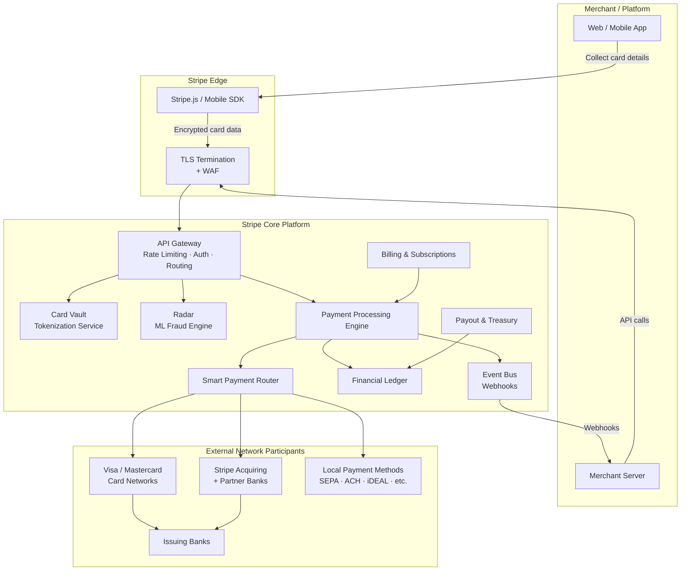

---

## Core Components

### API Layer

Stripe exposes a single versioned REST API (`https://api.stripe.com/v1/`) as the sole integration surface for merchants.

**Key responsibilities**:
- **Authentication**: HTTP Basic Auth with secret API keys; scoped restricted keys per endpoint set
- **Idempotency**: An `Idempotency-Key` request header causes the platform to deduplicate identical concurrent or retried requests within a 24-hour window
- **API versioning**: Breaking changes are introduced under a new dated version string; a merchant's API version is pinned at registration and can be upgraded at any time
- **Rate limiting**: Token-bucket algorithm per API key; burst allowance with a sustained limit; separate limits for read vs. write operations
- **Request validation**: Strict input validation before any downstream service is called

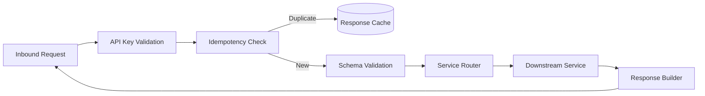

### Payment Processing Engine

The Payment Processing Engine (PPE) is the central orchestrator for all payment operations. It is responsible for:

1. Translating an API request into a **PaymentIntent** state machine
2. Collecting authentication data (3DS, SCA)
3. Invoking Radar for fraud scoring
4. Selecting an acquiring path via the Smart Router
5. Communicating with card networks (Visa/Mastercard) or local payment methods
6. Writing the authorisation result to the Financial Ledger

The PPE is designed as a **stateful workflow engine** with explicit state transitions:

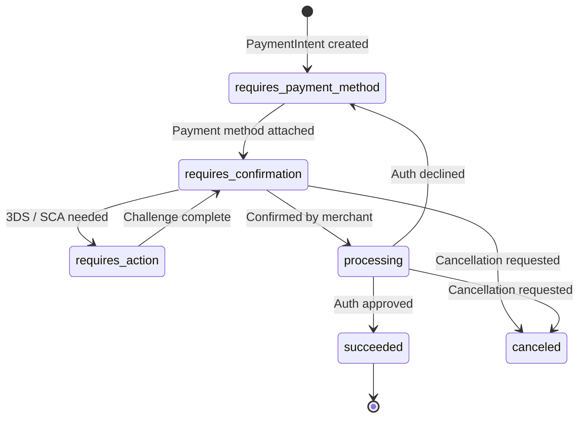

### Routing & Network Connectivity

Stripe operates its own acquiring licenses in major markets (US, EU, AU, UK, etc.) and has direct connections to Visa, Mastercard, American Express, and local payment schemes. The **Smart Payment Router** selects the optimal path per transaction based on:

| Routing Factor | Description |
|---------------|-------------|
| **Acceptance rate** | Historical approval rates by network / issuer / BIN range |
| **Cost** | Interchange optimisation; prefer lower-cost networks |
| **Latency** | Prefer the lowest-latency path for synchronous flows |
| **Redundancy** | Automatic failover to secondary acquiring path if primary degrades |
| **Regulatory** | Some transactions must be routed to domestic networks (EU debit, India RuPay) |

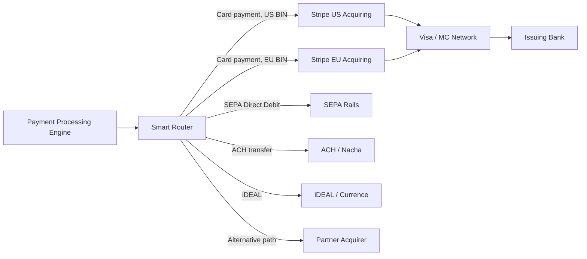

### Stripe Radar (Fraud Detection)

Radar is Stripe's ML-based fraud prevention system embedded directly in the critical payment path. Because Stripe processes transactions across millions of merchants, Radar benefits from **network-wide signal sharing** — fraud patterns seen on one merchant inform models for all merchants.

**Architecture**:

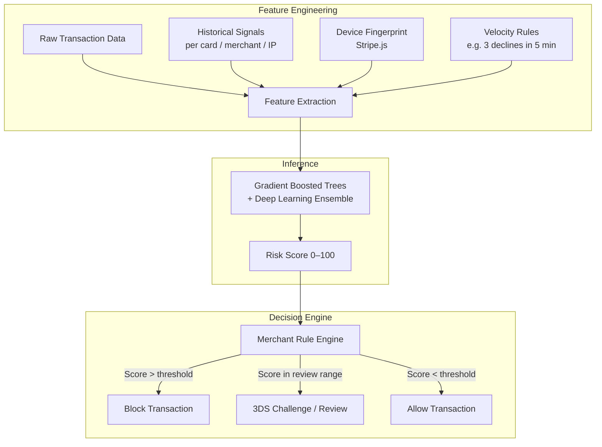

**Radar signals used per transaction (selected)**:

| Signal Category | Examples |
|----------------|----------|
| Card / BIN | Card country, card funding type, BIN risk profile |
| Cardholder behaviour | Velocity: cards used per IP, declines per card |
| Device | Browser fingerprint, IP geolocation, proxy/VPN detection |
| Merchant context | Merchant's historical dispute rate, product category |
| Network intelligence | Card-not-present fraud rates from Visa/MC networks |
| Time & Pattern | Unusual transaction time, rapid amount escalation |

### Billing & Subscription Engine

Stripe Billing manages recurring charge orchestration on top of the core PPE:

- **Products & Prices**: Catalogue of billable offerings (flat, metered, tiered, volume pricing)
- **Subscriptions**: State machine managing trial → active → past_due → canceled transitions
- **Invoice lifecycle**: Prorations, upcoming invoice preview, automatic retries with Smart Retries
- **Smart Retries**: Uses ML to predict the optimal retry time for failed recurring payments (e.g. retry when the model predicts the cardholder has topped up funds)

### Payout & Treasury Engine

After settlement from card networks, funds flow through Stripe's internal ledger to merchant Stripe Balances. The Payout Engine:

1. Aggregates settled funds in the **Stripe Financial Ledger**
2. Applies the merchant's payout schedule (daily, weekly, manual)
3. Initiates ACH/SEPA/FPS bank transfers to the merchant's bank account
4. Handles FX conversion for cross-currency payouts

---

## Payment Processing Flow

### Card Payment Flow

The following diagram shows the full lifecycle of a card-present-equivalent online payment from the perspective of all participants:

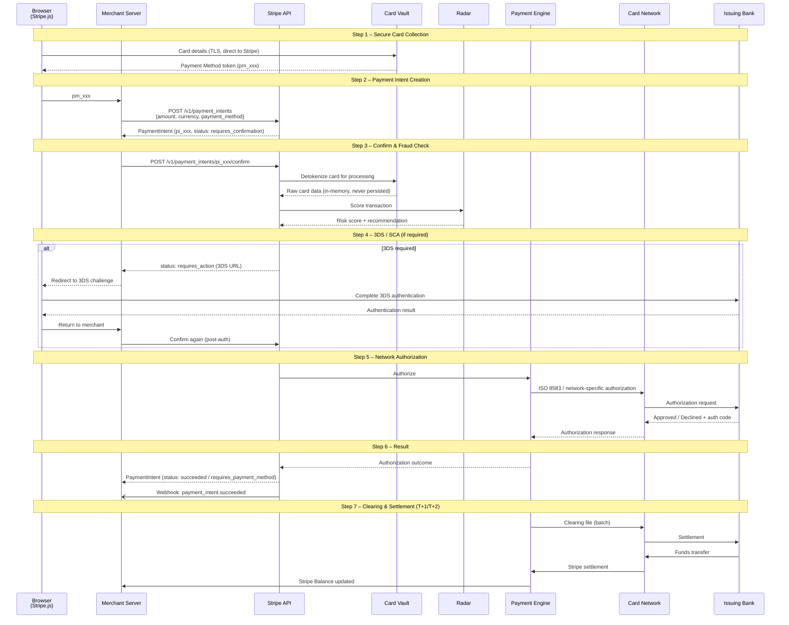

### Payment Intent Lifecycle

A **PaymentIntent** is the central idempotent object representing a single payment attempt. It supports complex flows like multi-step authentication, retries with different payment methods, and partial captures.

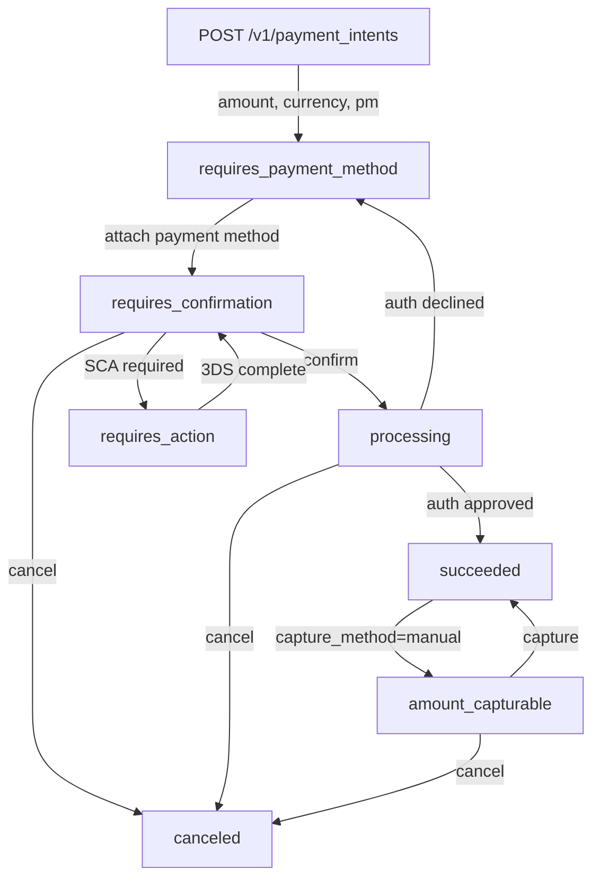

---

## Data Architecture

### Storage Strategy

Stripe's data layer handles extreme write throughput (millions of events per second) while guaranteeing strong consistency for financial records.

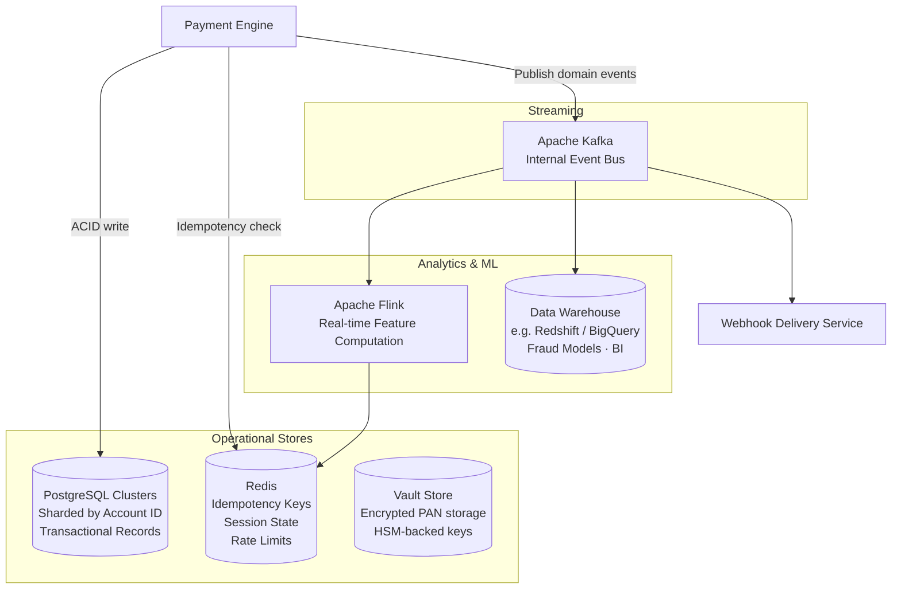

| Store | Technology | Reason |
|-------|-----------|--------|
| Primary transactional DB | PostgreSQL (sharded) | ACID guarantees for financial records |
| Card vault | Proprietary encrypted store + HSM | PCI DSS isolation; never co-located with transaction data |
| Idempotency / rate limits | Redis | Sub-millisecond read latency |
| Event streaming | Apache Kafka | Durable, ordered, replayable event log |
| Real-time feature store | Apache Flink + Redis | Low-latency ML feature serving for Radar |
| Analytics / DW | Columnar warehouse | Offline fraud model training, reporting, BI |

### Event Sourcing & Audit Trail

All state changes to Stripe objects are recorded as immutable **events** in an append-only event log:

- Every transition (e.g. `payment_intent.created` → `payment_intent.succeeded`) produces a corresponding event object
- Events are exposed via the `/v1/events` API and delivered to merchants via webhooks
- Events are also consumed internally for downstream processing (ledger updates, payout scheduling, fraud feature computation)
- The event log forms the **audit trail** required by PCI DSS and financial regulators

---

## Multi-Region & High Availability Architecture

Stripe operates an **active–active multi-region** deployment to meet its 99.999% availability target (< 5 min downtime/year):

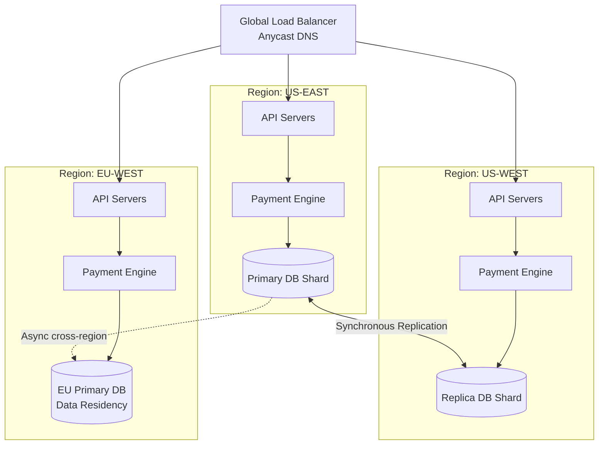

**Availability patterns used**:

| Pattern | Implementation |
|---------|---------------|
| Active–active regions | All regions can serve write traffic; global routing by latency |
| Synchronous replication | Writes committed to ≥ 2 nodes before ACK to API layer |
| Circuit breakers | Automatic fallback from primary acquirer to secondary on elevated error rate |
| Graceful degradation | Non-critical enrichment (e.g. some Radar signals) can be skipped under extreme load |
| Idempotency | Enables safe client retry without risk of double charges |
| Bulkheads | Separate thread pools / resource quotas per merchant tier prevent noisy neighbours |

---

## Security Architecture

### Tokenization & Encryption

Stripe's security model is built around ensuring that raw cardholder data (PAN, CVV, expiry) is never accessible to the merchant, and minimally accessible within Stripe itself:

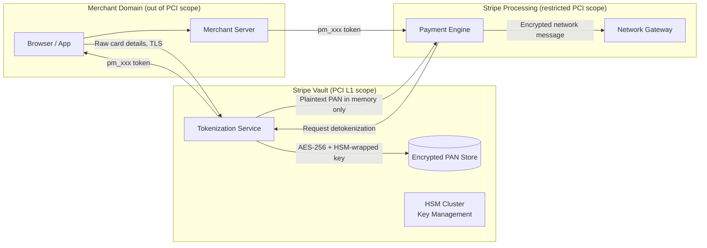

**Key security controls**:

| Control | Detail |
|---------|--------|
| TLS 1.2+ everywhere | All traffic in transit encrypted; TLS 1.0/1.1 not supported |
| PAN never touches merchant servers | Stripe.js collects card details and posts directly to Stripe's vault |
| AES-256 at rest | All PANs encrypted with AES-256; encryption keys managed in HSMs |
| HSM-backed key management | Master keys stored in FIPS 140-2 Level 3 HSMs; see §9.1.1.2 |
| Tokenization | PANs replaced with payment method tokens in all non-vault contexts |
| mTLS between internal services | Internal service-to-service calls use mutual TLS |
| Secrets management | API keys stored as salted hashes; never stored in plaintext |
| Penetration testing | Regular external red team exercises + bug bounty program |

### PCI DSS Compliance Scope

Because Stripe.js posts card data directly to Stripe's servers, merchants using the hosted fields integration are only subject to **SAQ A** (the simplest PCI self-assessment questionnaire), rather than SAQ D which covers the full 300+ control set.

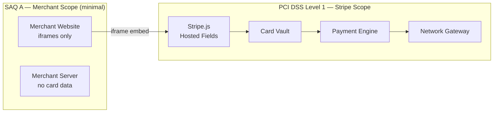

---

## API Design Principles

Stripe's API is widely cited as a reference for developer-friendly API design:

| Principle | Implementation |
|-----------|---------------|
| **REST with nouns** | Resources: `/charges`, `/payment_intents`, `/customers`, `/invoices` |
| **Idempotency keys** | `Idempotency-Key` header; safe to retry any mutating request |
| **Consistent error format** | All errors return `{type, code, message, param, doc_url}` |
| **Expandable objects** | `?expand[]=customer` avoids N+1 round trips |
| **Pagination** | Cursor-based (`starting_after`, `ending_before`) for stable pagination |
| **Versioning** | Dated version strings (`2024-06-20`); breaking changes never in-place |
| **Webhooks** | Push-based event delivery with automatic retries and signature verification |
| **Dashboard parity** | Every Dashboard action is possible via API |

---

## Scalability Patterns

| Pattern | Application in Stripe |
|---------|----------------------|
| **Horizontal sharding** | PostgreSQL sharded by `account_id`; each shard set handles a subset of merchants |
| **Read replicas** | Analytical and reporting queries routed to read replicas; writes always to primary |
| **Async fan-out** | After a payment succeeds, webhook delivery, ledger update, and Radar feedback are async |
| **Rate limiting** | Token bucket per API key; prevents any single merchant from starving shared infrastructure |
| **Event-driven decoupling** | Kafka separates real-time payment path from downstream consumers (billing, analytics) |
| **Caching** | Redis caches idempotency keys, rate-limit counters, and short-lived session tokens |
| **Connection pooling** | PgBouncer-style pooling between application servers and database shards |
| **Smart retries** | Billing retries use ML to pick optimal retry timing (reduces failed payment rate) |

---

## Observability Architecture

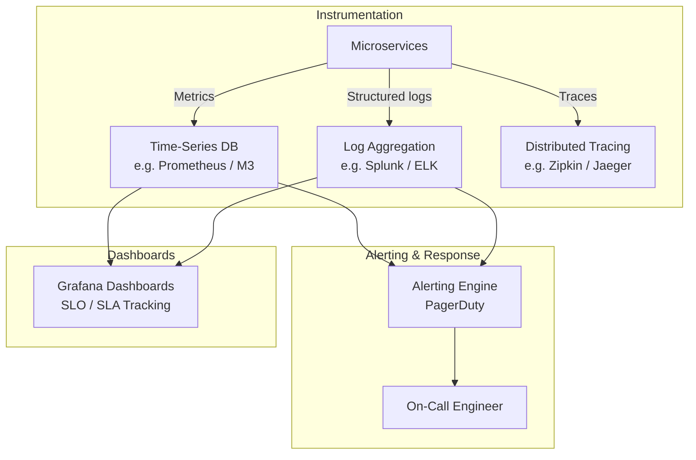

**Key SLOs (indicative)**:

| Metric | Target |
|--------|--------|
| API P99 latency (charge creation) | < 500 ms |
| API P50 latency (charge creation) | < 100 ms |
| Payment success rate | > 99.9% |
| Webhook delivery (first attempt) | < 30 s |
| Platform availability | > 99.999% |

---

## Transactional Integrity

Stripe deliberately avoids a single distributed ACID transaction spanning all participants. Instead, integrity is enforced through **four interlocking layers**: an idempotency gate at the API boundary, a row-locked state machine in the PPE, ACID-compliant shard writes backed by synchronous replication, and an append-only event log as the authoritative audit trail. Because Stripe operates globally across card networks, local payment methods, and multiple acquiring paths, each failure mode has a structural prevention or a well-defined compensating path.

### Core Integrity Mechanisms

| Pillar | Technology | Guarantee |
|--------|-----------|----------|
| Idempotency | Redis-backed `Idempotency-Key` dedup (24-hour TTL) | Same logical operation is never executed twice |
| State machine | PaymentIntent states in PostgreSQL (`SELECT FOR UPDATE` row lock) | Illegal state transitions are structurally impossible |
| ACID intra-shard writes | PostgreSQL sharded by `account_id`; synchronous ≥ 2-node replication before ACK | Each merchant's shard is internally consistent; no write is lost on single-node failure |
| Append-only event log | Apache Kafka + immutable event objects | Full reconstruction of any object's history; audit trail required by PCI DSS and financial regulators |
| Double-entry ledger | Financial Ledger Service with deterministic event IDs | Every debit has a matching credit; `ON CONFLICT DO NOTHING` for idempotent ledger writes |

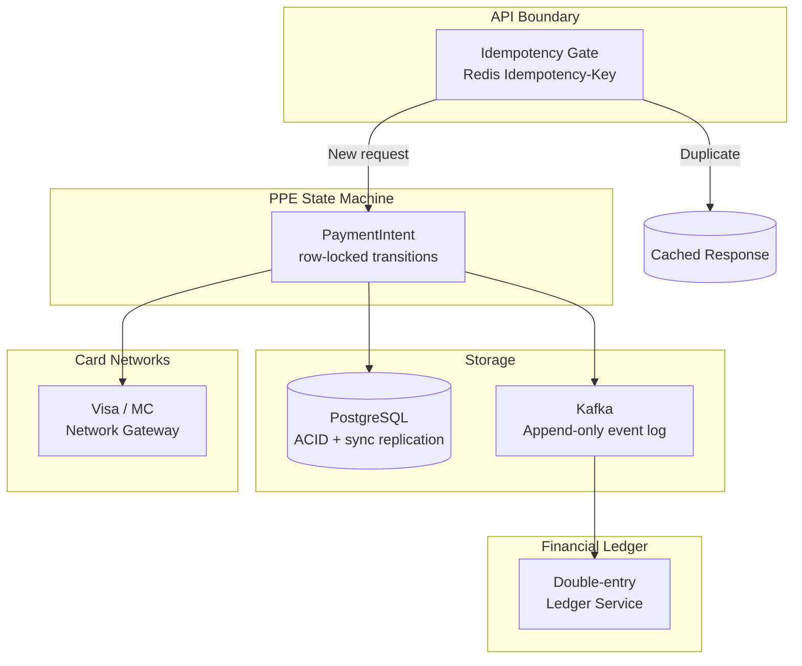

### Corner Case Analysis

#### 1. Client Retry After Network Timeout

**Scenario**: A merchant sends `POST /v1/payment_intents/pi_xxx/confirm` with `Idempotency-Key: k1`. The network times out before the merchant receives a response, but the payment was actually authorised.

**How handled**:
- On retry with the same `Idempotency-Key: k1`, the API gateway hits the Redis idempotency cache **before** reaching the PPE and returns the previously cached response.
- No second authorisation is sent to the card network. The 24-hour deduplication window covers all reasonable retry windows.
- If the first request never reached Stripe (TCP failure before TLS handshake), the idempotency key was never written to Redis. The retry is treated as a fresh request — correct behaviour.

---

#### 2. Network Authorization Approved but Stripe Crashes Before Writing to PostgreSQL

**Scenario**: The card network returns `Approved` to the PPE. The PPE receives it in memory and begins the PostgreSQL write, but the process crashes before `COMMIT`.

**How handled**:
- PostgreSQL rolls back the incomplete transaction automatically. The PaymentIntent remains in `processing`.
- On process restart, the network gateway replays the unacknowledged authorisation response from its **durable gateway journal** (write-ahead log of pending network responses). The PPE re-applies the state transition and retries the `COMMIT`.
- The merchant's API response is only sent **after** the `COMMIT` ACK, so no inconsistency is visible externally.
- If the gateway journal is also lost, the authorisation code is visible in the card network's reconciliation report. The daily reconciliation process flags the mismatch and triggers a recovery workflow.

**Financial risk**: Cardholder has a temporary authorisation hold. If recovery fails, the hold lapses after the network validity period (typically 7 days). No double charge is possible because capture was never sent.

---

#### 3. Two Concurrent Confirmations of the Same PaymentIntent

**Scenario**: A buggy merchant client sends two concurrent `confirm` requests for `pi_xxx` with **different** `Idempotency-Key` values.

**How handled**:
- Both requests pass the idempotency gate.
- Both attempt the `requires_confirmation → processing` state transition on the same PaymentIntent row.
- PostgreSQL's `SELECT FOR UPDATE` on the PaymentIntent row serialises the two writers. The first writer wins the lock and advances the state; the second writer sees the updated state and returns a `409 Conflict` to the API layer — before any network authorisation message is sent.
- Result: exactly one authorisation goes to the card network.

---

#### 4. 3DS / SCA Authentication Abandonment

**Scenario**: A customer is redirected to the issuer's 3DS challenge page and closes the browser tab without completing authentication.

**How handled**:
- The PaymentIntent stays in `requires_action` state. No authorisation is ever sent to the card network — the PPE does not advance past `requires_confirmation` without a confirmed 3DS result.
- A background TTL sweep transitions stale `requires_action` intents to `canceled` after a configurable timeout.
- No funds are ever moved; there is nothing to compensate.

---

#### 5. Primary PostgreSQL Shard Fails Mid-Write

**Scenario**: The PostgreSQL primary for a merchant's shard fails after the PPE issued `COMMIT` but before all synchronous replicas acknowledged.

**How handled**:
- Stripe writes are committed to **≥ 2 synchronous replicas** before ACKing the API layer. A `COMMIT` is only confirmed to the application after the quorum write succeeds. A primary crash after that point cannot lose the write — it is already on a replica.
- The replica is promoted automatically. The API response to the merchant is sent only after the quorum ACK, so no inconsistency is externally visible.
- If the primary crashes **before** the quorum write completes, PostgreSQL rolls back the transaction. The PPE receives a write error and the state machine remains in its previous state.

---

#### 6. Webhook Delivery Failure

**Scenario**: A payment succeeds (`payment_intent.succeeded`), but the merchant's webhook endpoint returns `500` or is unreachable.

**How handled**:
- Webhooks are **not** in the critical transactional path. The PaymentIntent is `succeeded` regardless of webhook delivery.
- The Webhook Delivery Service retries with exponential backoff for up to **3 days**.
- Merchants can poll `/v1/events` or `/v1/payment_intents/pi_xxx` to reconcile missed webhooks.
- The funds exist in the merchant's Stripe Balance regardless of webhook delivery status.

**Trade-off**: This is an intentional eventual-consistency choice. Kafka's at-least-once delivery requires idempotent consumers — noted explicitly in the trade-offs table.

---

#### 7. Partial Capture (Manual Capture Mode)

**Scenario**: `capture_method=manual`. Authorisation approved for $100. Merchant captures $80 only.

**How handled**:
- The PaymentIntent transitions: `succeeded` → `amount_capturable` → `succeeded` (with `amount_received=$80`).
- The uncaptured $20 authorisation hold lapses at the issuer after the network validity period.
- The Financial Ledger records the $80 capture as a separate entry from the $100 authorisation. No double-entry inconsistency — an authorisation is a hold, not a debit.
- Attempt to capture more than the authorised amount ($100+) is rejected at the API layer before any network message is sent. Overcapture is structurally prevented by schema validation.

---

#### 8. Refund After Payout Already Processed

**Scenario**: A customer disputes a charge. The merchant issues a refund, but the payout to the merchant's bank account has already cleared.

**How handled**:
- Stripe issues the refund to the cardholder immediately by initiating a **return transaction** on the card network, independent of payout status.
- The merchant's **Stripe Balance** is debited. If the balance is insufficient, Stripe creates a negative balance and either debits the merchant's bank account via ACH pull (if debit authorization is configured) or suspends future payouts until the balance is covered.
- A refund is always a **compensating transaction** — the original payment entry is immutable. The refund is a separate, complete ledger entry.

---

#### 9. Idempotency Key Collision Across Merchants

**Scenario**: Two different merchants both submit `Idempotency-Key: order-123`.

**How handled**:
- Idempotency keys are **scoped to the API key** (merchant account). The Redis key is namespaced as `{api_key}:{idempotency_key}`. Cross-merchant collision is structurally impossible.

---

#### 10. FX Rate Change Between Authorisation and Capture

**Scenario**: A payment is authorised in EUR and captured 5 days later. The EUR/USD rate has moved.

**How handled**:
- The **settlement amount** is governed by card network rules at the time of **clearing**, not authorisation. FX risk between authorisation and capture is borne by the merchant.
- Stripe's Financial Ledger records each entry with the original amount, currency, exchange rate applied, and settlement amount — all fields are immutable once written.
- For merchants using Stripe multi-currency settlement, the FX rate applied is the prevailing rate at clearing time, disclosed in the balance transaction object.

---

#### 11. Kafka Consumer Reprocesses an Event (At-Least-Once Delivery)

**Scenario**: The Ledger Service crashes after writing a ledger entry but before committing its Kafka consumer offset. The event is redelivered.

**How handled**:
- All internal Kafka consumers are **idempotent consumers** (stated as an architectural requirement in the trade-offs).
- Each event carries a deterministic event ID (derived from the PaymentIntent ID + state transition). The Ledger Service uses `INSERT ... ON CONFLICT (event_id) DO NOTHING`.
- A redelivered event produces a no-op. The ledger entry is written exactly once.

---

#### 12. Active–Active Multi-Region Split-Brain

**Scenario**: A network partition isolates US-EAST from US-WEST. Both regions continue accepting write traffic for overlapping merchant shards.

**How handled**:
- Synchronous replication means a shard primary **stops accepting writes** when it cannot confirm the write on a synchronous replica. This is a CP choice: availability is sacrificed on the write path to prevent divergence.
- In practice, shard-primary affinity is used: each merchant's shard has one authoritative primary region at any time. "Active–active" means *different merchants* can be active in *different regions* simultaneously — not that the same shard is writable from two regions concurrently.
- Cross-region replication (US ↔ EU) is async, making US and EU independent consistency domains. EU-domiciled merchants are on EU-primary shards with EU-internal synchronous replication for GDPR data residency compliance.

---

#### 13. Smart Retry of Recurring Billing (Subscription Past-Due)

**Scenario**: A subscription invoice fails to charge because the cardholder's card is declined. Stripe's Smart Retry schedules a retry.

**How handled**:
- The Billing engine creates a new, independent PaymentIntent for each retry attempt. Each attempt is idempotent in isolation.
- The Subscription state machine tracks the `past_due` state separately from the underlying PaymentIntent outcomes. A successful retry on attempt N transitions the subscription back to `active`; it does not modify the records of earlier failed attempts.
- If all Smart Retry attempts are exhausted, the subscription transitions to `canceled` and a `customer.subscription.deleted` event is emitted to the merchant via webhook.

---

### Integrity Guarantees by Layer

| Layer | Guarantee Type | Mechanism |
|-------|---------------|-----------|
| API boundary | Idempotency | Redis `Idempotency-Key`; 24-hour TTL; scoped to `{api_key}:{key}` |
| PaymentIntent transitions | Mutual exclusion | PostgreSQL `SELECT FOR UPDATE`; state machine rejects invalid transitions |
| Intra-shard writes | ACID | PostgreSQL; synchronous ≥ 2-node replication before ACK; 0 RPO |
| Network auth ↔ DB write | Durable gateway journal | Replay on recovery; authorisation lapses if never captured |
| Cross-service orchestration | Saga + compensating transactions | Explicit cancel / refund flows; no distributed XA |
| Async event pipeline | At-least-once + consumer idempotency | Kafka + deterministic event IDs + `ON CONFLICT DO NOTHING` |
| Refunds / payouts | Double-entry ledger + compensating transactions | Original entry immutable; refund = separate credit entry |
| Partial capture | API-layer overcapture prevention | Schema validation rejects amount > authorised before any network message |
| Recurring billing retries | Independent PaymentIntents per attempt | No mutation of prior attempt records; subscription state is separate from payment outcome |
| Multi-region write path | CP (write path), eventual (cross-region async) | Shard-primary affinity; synchronous replication halts on partition rather than diverging |
| Audit trail | Immutable event log | Append-only Kafka events; exposed via `/v1/events`; PCI DSS compliant |

---

## Key Architectural Trade-offs

| Decision | Choice Made | Trade-off |
|----------|------------|-----------|
| **Synchronous auth response** | Block the HTTP response until network auth completes | Merchants get immediate result; ties up a thread per in-flight request |
| **Idempotency at the API boundary** | Client-supplied idempotency key, deduplication in Redis | Simple client retry story; Redis becomes a critical dependency |
| **PAN isolated in vault** | Card vault is a separate service with dedicated HSMs | Eliminates most PCI scope for Stripe internally; adds latency for detokenization |
| **Active–active multi-region** | All regions can accept writes | Requires conflict resolution strategy for distributed state; more complex than active–passive |
| **Shared fraud signal network** | Fraud signals shared across all Stripe merchants | Better fraud models; raises privacy sensitivity; requires consent/data governance |
| **Hosted fields (Stripe.js)** | Card entry UI controlled by Stripe | Reduces merchant PCI scope to SAQ A; merchants lose some UI flexibility |
| **Kafka for internal event bus** | Durable, ordered, replayable log | Operational overhead of Kafka; at-least-once delivery requires consumer idempotency |

---

## Related Topics

- [9.1.1.1 Credit Card Transaction System Architecture](./9.1.1.1-credit-card-transaction-system-architecture.md) — full card network authorization, clearing, and settlement flow
- [9.1.1.2 HSM in Payment Systems Architecture](./9.1.1.2-hsm-in-payment-systems-architecture.md) — HSM design, connection pooling, and PCI DSS key management
- [Architecture Taxonomy Reference](../../10-practicality-taxonomy/architecture_taxonomy_reference.md) — canonical taxonomy
- **General Pattern**: [Integration & Communication Architecture](../../03-integration-communication-architecture/)
  - **Taxonomy**: §3 Integration & Communication Architecture
- **General Pattern**: [Security Architecture](../../06-security-architecture/)
  - **Taxonomy**: §6 Security Architecture (Cross-Cutting)
