# 9.1.1.3 Stripe Payment System Architecture

> **Taxonomy Reference**: §9.1.1 Financial Services Architecture, §2.1 Application Architecture Styles, §3 Integration & Communication, §6 Security Architecture (see [architecture_taxonomy_reference.md](../../10-practicality-taxonomy/architecture_taxonomy_reference.md))

## Table of Contents

1. [Overview](#overview)
2. [High-Level System Architecture](#high-level-system-architecture)
3. [Core Components](#core-components)
   - [API Layer](#api-layer)
   - [Payment Processing Engine](#payment-processing-engine)
   - [Routing & Network Connectivity](#routing--network-connectivity)
   - [Stripe Radar (Fraud Detection)](#stripe-radar-fraud-detection)
   - [Billing & Subscription Engine](#billing--subscription-engine)
   - [Payout & Treasury Engine](#payout--treasury-engine)
4. [Payment Processing Flow](#payment-processing-flow)
   - [Card Payment Flow](#card-payment-flow)
   - [Payment Intent Lifecycle](#payment-intent-lifecycle)
5. [Critical Path — Customer Payment Confirmation](#critical-path--customer-payment-confirmation)
   - [Synchronous Critical Path (blocks the customer)](#synchronous-critical-path-blocks-the-customer)
   - [Asynchronous Post-Confirmation Work](#asynchronous-post-confirmation-work)
   - [What the customer experiences](#what-the-customer-experiences)
6. [Data Architecture](#data-architecture)
   - [Storage Strategy](#storage-strategy)
   - [Core Data Models](#core-data-models)
   - [Event Sourcing & Audit Trail](#event-sourcing--audit-trail)
7. [Multi-Region & High Availability Architecture](#multi-region--high-availability-architecture)
8. [Security Architecture](#security-architecture)
   - [Tokenization & Encryption](#tokenization--encryption)
   - [PCI DSS Compliance Scope](#pci-dss-compliance-scope)
9. [API Design Principles](#api-design-principles)
10. [Scalability Patterns](#scalability-patterns)
11. [Latency Optimization](#latency-optimization)
    - [Latency Budget Breakdown](#latency-budget-breakdown)
    - [Techniques for Minimizing Total Request Time](#techniques-for-minimizing-total-request-time)
    - [Handling the External Network Bottleneck](#handling-the-external-network-bottleneck)
12. [Observability Architecture](#observability-architecture)
13. [Transactional Integrity](#transactional-integrity)
    - [Core Integrity Mechanisms](#core-integrity-mechanisms)
    - [Corner Case Analysis](#corner-case-analysis)
    - [Integrity Guarantees by Layer](#integrity-guarantees-by-layer)
14. [Financial Ledger Architecture](#financial-ledger-architecture)
    - [Level 1: Ledger Placement — Same Service vs. Separate Microservice](#level-1-ledger-placement--same-service-vs-separate-microservice)
    - [Option A: Ledger Inside the Payment Service](#option-a-ledger-inside-the-payment-service-same-database)
    - [Option B: Ledger as a Separate Microservice](#option-b-ledger-as-a-separate-microservice-own-database)
    - [Level 2: Communication Pattern](#level-2-communication-pattern-when-ledger-is-a-separate-microservice)
    - [Decision Framework](#decision-framework)
15. [Dispute & Chargeback Architecture](#dispute--chargeback-architecture)
16. [Stripe Connect (Multi-Party Payments)](#stripe-connect-multi-party-payments)
17. [Deployment & Release Engineering](#deployment--release-engineering)
18. [Key Architectural Trade-offs](#key-architectural-trade-offs)
19. [Related Topics](#related-topics)

---

## Overview

Stripe is a technology-first payment processor and financial infrastructure platform. Unlike traditional payment processors (which expose ISO 8583 messaging or proprietary SDKs), Stripe abstracts the complexity of global payment rails behind a RESTful API.

**Stripe's core value proposition**:
- A developer-first API that hides the complexity of acquiring banks, card networks, and local payment methods
- A global infrastructure that can route a single charge to the optimal card network and acquiring bank
- A PCI DSS Level 1 compliant vault that removes merchants from direct handling of cardholder data

**Design goals that drive architecture decisions**:

| Goal | Architectural Consequence |
|------|--------------------------|
| Sub-100 ms internal processing time (excluding external card network round-trip) | Synchronous path optimised; async fan-out for non-critical work |
| 99.999 % availability | Active–active multi-region, circuit breakers, graceful degradation |
| Global coverage (195+ countries) | Distributed acquiring, dynamic routing, multi-currency ledger |
| PCI DSS Level 1 compliance | Cardholder data isolated behind a separate vault service |
| Fraud prevention at scale | Real-time ML inference (Radar) embedded in the critical payment path |
| Idempotency by default | Idempotency keys prevent duplicate charges on network retries |

---

## High-Level System Architecture

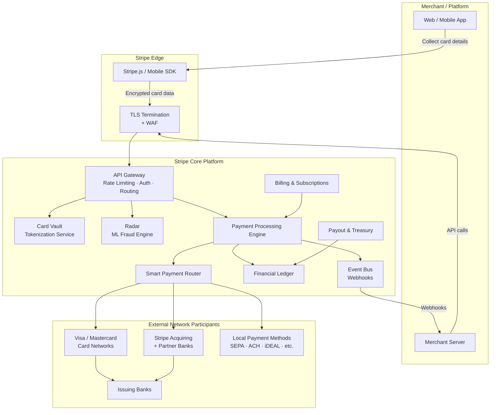

---

## Core Components

### API Layer

Stripe exposes a single versioned REST API (`https://api.stripe.com/v1/`) as the sole integration surface for merchants.

**Key responsibilities**:
- **Authentication**: HTTP Basic Auth with secret API keys; scoped restricted keys per endpoint set
- **Idempotency**: An `Idempotency-Key` request header causes the platform to deduplicate identical concurrent or retried requests within a 24-hour window
- **API versioning**: Breaking changes are introduced under a new dated version string; a merchant's API version is pinned at registration and can be upgraded at any time
- **Rate limiting**: Token-bucket algorithm per API key; burst allowance with a sustained limit; separate limits for read vs. write operations
- **Request validation**: Strict input validation before any downstream service is called

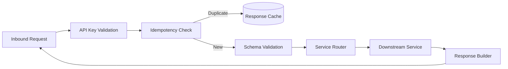

### Payment Processing Engine

The Payment Processing Engine (PPE) is the central orchestrator for all payment operations. It is responsible for:

1. Translating an API request into a **PaymentIntent** state machine
2. Collecting authentication data (3DS, SCA)
3. Invoking Radar for fraud scoring
4. Selecting an acquiring path via the Smart Router
5. Communicating with card networks (Visa/Mastercard) or local payment methods
6. Writing the authorisation result to the Financial Ledger

The PPE is designed as a **stateful workflow engine** with explicit state transitions:

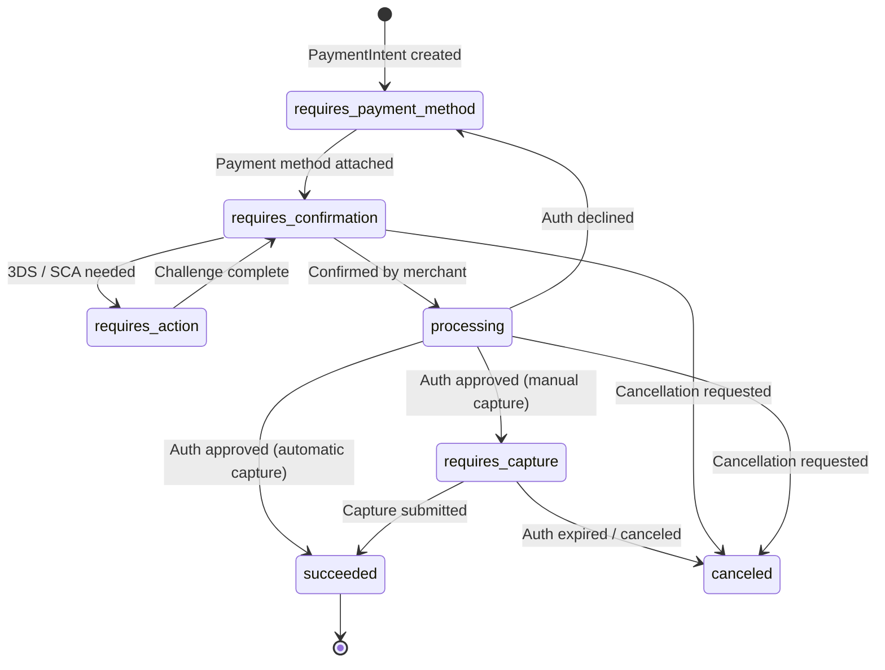

### Routing & Network Connectivity

Stripe operates its own acquiring licenses in major markets (US, EU, AU, UK, etc.) and has direct connections to Visa, Mastercard, American Express, and local payment schemes. The **Smart Payment Router** selects the optimal path per transaction based on:

| Routing Factor | Description |
|---------------|-------------|
| **Acceptance rate** | Historical approval rates by network / issuer / BIN range |
| **Cost** | Interchange optimisation; prefer lower-cost networks |
| **Latency** | Prefer the lowest-latency path for synchronous flows |
| **Redundancy** | Automatic failover to secondary acquiring path if primary degrades |
| **Regulatory** | Some transactions must be routed to domestic networks (EU debit, India RuPay) |

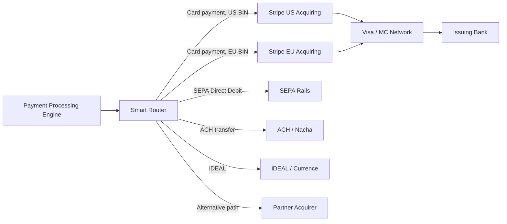

### Stripe Radar (Fraud Detection)

Radar is Stripe's ML-based fraud prevention system embedded directly in the critical payment path. Because Stripe processes transactions across millions of merchants, Radar benefits from **network-wide signal sharing** — fraud patterns seen on one merchant inform models for all merchants.

**Architecture**:

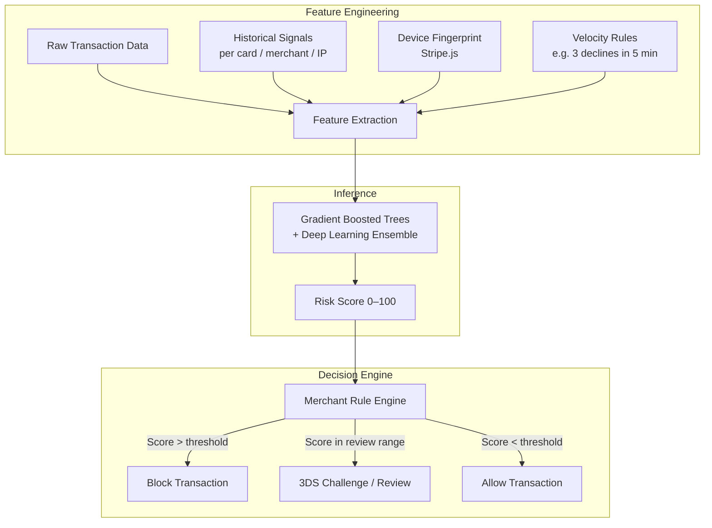

**Radar signals used per transaction (selected)**:

| Signal Category | Examples |
|----------------|----------|
| Card / BIN | Card country, card funding type, BIN risk profile |
| Cardholder behaviour | Velocity: cards used per IP, declines per card |
| Device | Browser fingerprint, IP geolocation, proxy/VPN detection |
| Merchant context | Merchant's historical dispute rate, product category |
| Network intelligence | Card-not-present fraud rates from Visa/MC networks |
| Time & Pattern | Unusual transaction time, rapid amount escalation |

### Billing & Subscription Engine

Stripe Billing manages recurring charge orchestration on top of the core PPE:

- **Products & Prices**: Catalogue of billable offerings (flat, metered, tiered, volume pricing)
- **Subscriptions**: State machine managing trial → active → past_due → canceled transitions
- **Invoice lifecycle**: Prorations, upcoming invoice preview, automatic retries with Smart Retries
- **Smart Retries**: Uses ML to predict the optimal retry time for failed recurring payments (e.g. retry when the model predicts the cardholder has topped up funds)

### Payout & Treasury Engine

After settlement from card networks, funds flow through Stripe's internal ledger to merchant Stripe Balances. The Payout Engine:

1. Aggregates settled funds in the **Stripe Financial Ledger**
2. Applies the merchant's payout schedule (daily, weekly, manual)
3. Initiates ACH/SEPA/FPS bank transfers to the merchant's bank account
4. Handles FX conversion for cross-currency payouts

---

## Payment Processing Flow

### Card Payment Flow

The payment flow is split into phases for readability. Each diagram shows one logical phase.

#### Phase 1: Secure Card Collection & Payment Intent Creation

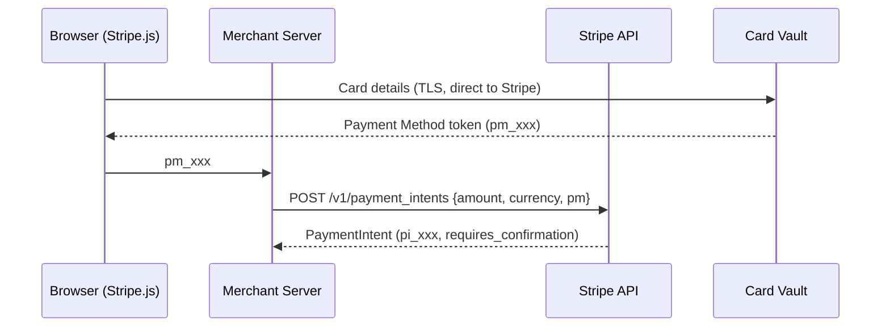

#### Phase 2: Confirm, Fraud Check & 3-D Secure

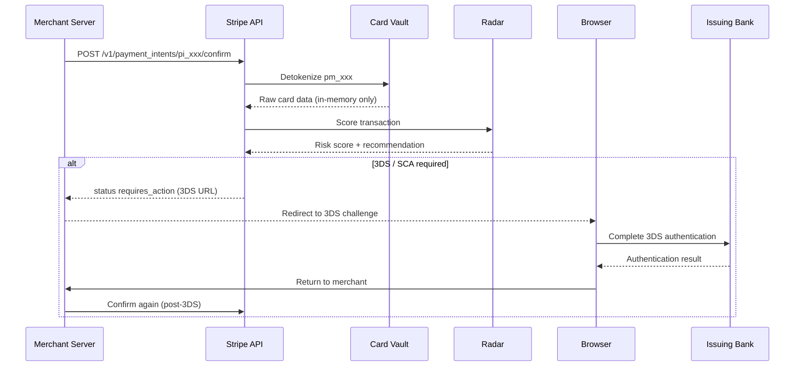

#### Phase 3: Network Authorization & Result

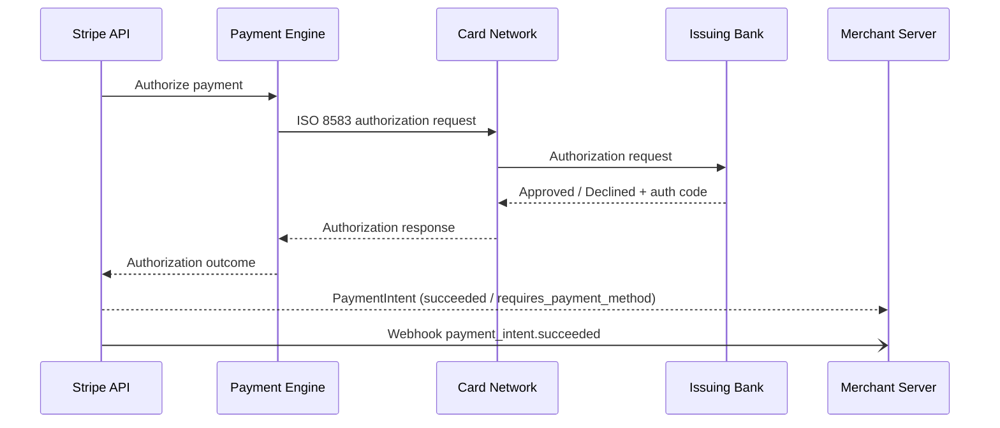

#### Phase 4: Clearing & Settlement (T+1 / T+2)

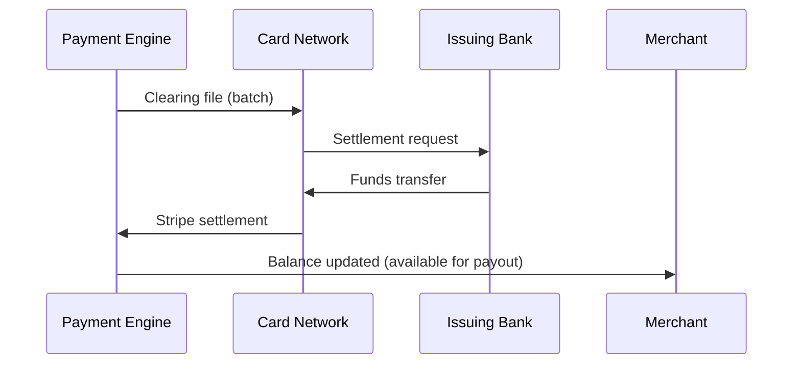

### Payment Intent Lifecycle

A **PaymentIntent** is the central idempotent object representing a single payment attempt. It supports complex flows like multi-step authentication, retries with different payment methods, and partial captures.

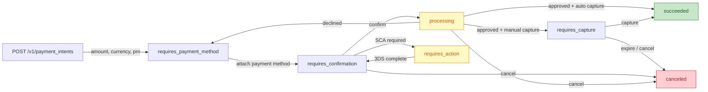

---

## Critical Path — Customer Payment Confirmation

This section isolates the **exact set of operations that must complete synchronously** before the customer sees "Payment Confirmed" — versus the work that happens asynchronously after the customer has already received their confirmation.

> **Key principle**: The customer is blocked only by what is strictly necessary to guarantee a confirmed payment. Everything else is deferred.

### Synchronous Critical Path (blocks the customer)

Every step below **must succeed in sequence** before the HTTP response `status: succeeded` is returned to the merchant (and ultimately shown to the customer):

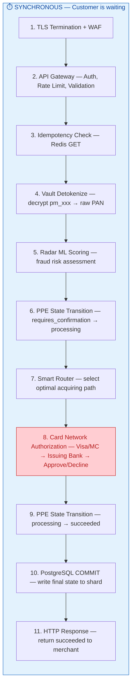

| Step | What happens | Why it's synchronous | Latency |
|------|-------------|---------------------|---------|
| 1 | TLS handshake, WAF inspection | Security gate; can't process untrusted traffic | ~2 ms |
| 2 | Validate API key, check rate limits, schema validation | Reject bad requests before consuming resources | ~3 ms |
| 3 | Check if this `Idempotency-Key` was already processed | Prevent duplicate charges | < 1 ms |
| 4 | Decrypt `pm_xxx` token back to raw card number | Need actual PAN to send to card network | ~4 ms |
| 5 | Score transaction for fraud risk | Must block fraudulent payments before authorisation | ~8 ms |
| 6 | Lock PaymentIntent row, transition state | Prevents concurrent duplicate processing | ~1 ms |
| 7 | Evaluate routing rules (cost, latency, acceptance rate) | Need to pick the best network path | ~1 ms |
| 8 | **Send auth request to Visa/MC → Issuer responds** | **The payment is not confirmed until the issuer says "Approved"** | **~200–400 ms** |
| 9 | Transition state to `succeeded` | Record the approval | < 1 ms |
| 10 | COMMIT to PostgreSQL (sync replicated to ≥2 nodes) | **This IS the durable financial record** — PaymentIntent state, amount, auth code, timestamps. This is the source of truth. | ~5 ms |
| 11 | Return HTTP 200 with PaymentIntent body | Merchant shows "Payment Confirmed" to customer | ~2 ms |

**Total time customer waits**: ~230–430 ms (dominated by step 8)

### Asynchronous Post-Confirmation Work

These operations happen **after** the customer already sees "Payment Confirmed". They are non-blocking, eventually consistent, and failures here do **not** affect the payment outcome:

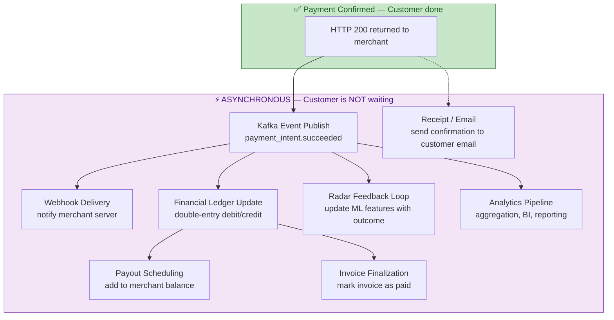

| Async Operation | Trigger | Failure Impact | Recovery |
|----------------|---------|----------------|----------|
| **Kafka event publish** | Immediately after COMMIT | Internal consumers don't get notified in real-time | Producer retries; durable once acked |
| **Webhook delivery** | Kafka consumer | Merchant's system doesn't get real-time notification | Exponential backoff retry for 3 days; merchant can poll `/v1/events` |
| **Financial Ledger update** | Kafka consumer | Accounting view temporarily inconsistent (but PostgreSQL has the truth) | Idempotent consumer replays event; `ON CONFLICT DO NOTHING` |
| **Radar feedback** | Kafka consumer | ML model doesn't learn from this outcome immediately | Batch reprocessing; non-critical for next transaction |
| **Analytics pipeline** | Kafka → Flink / DW | Dashboards show stale data temporarily | Kafka replay from offset |
| **Payout scheduling** | Ledger update complete | Merchant payout delayed | Reconciliation job catches up within hours |
| **Invoice finalization** | Ledger update complete | Invoice shows "open" briefly | Background worker retries |
| **Receipt email** | Payment confirmed | Customer doesn't receive email | Email retry queue; non-critical |

> **PostgreSQL vs. Financial Ledger**: The PaymentIntent record in PostgreSQL (step 10) is the **source of truth**. The Financial Ledger is a derived double-entry accounting view. For detailed analysis of ledger placement, communication patterns, and trade-offs, see [§14 Financial Ledger Architecture](#financial-ledger-architecture).

### What the customer experiences

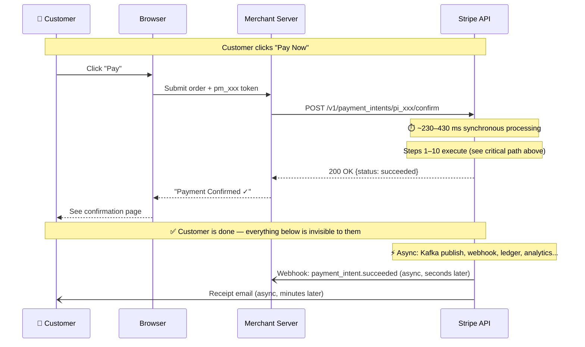

### Why this separation matters

| Concern | Answer |
|---------|--------|
| **What if webhooks fail?** | Customer still has a confirmed payment. Merchant reconciles via API polling. |
| **What if Kafka is slow?** | Customer confirmation is unaffected. Internal systems catch up eventually. |
| **What if the ledger write fails?** | The payment is still confirmed. PostgreSQL (step 10) is the source of truth, not the ledger. The ledger is a derived accounting view that can be reconstructed from the event log at any time. |
| **Why isn't the ledger synchronous?** | Because PostgreSQL already holds the authoritative financial record (step 10). The Financial Ledger Service reformats that into double-entry debit/credit format — useful for reporting/reconciliation but not required to prove the payment happened. Adding it to the sync path would add ~5–10 ms latency with no correctness benefit. |
| **What guarantees "confirmed" is real?** | The issuing bank returned `Approved` AND PostgreSQL committed with quorum replication. These two facts together are the strongest guarantee possible — card network confirmation + durable local persistence. |
| **Can a confirmed payment be reversed?** | Only via explicit merchant refund or cardholder dispute — never by a system failure in async processing. |

---

## Data Architecture

### Storage Strategy

Stripe's data layer handles extreme write throughput (millions of events per second) while guaranteeing strong consistency for financial records.

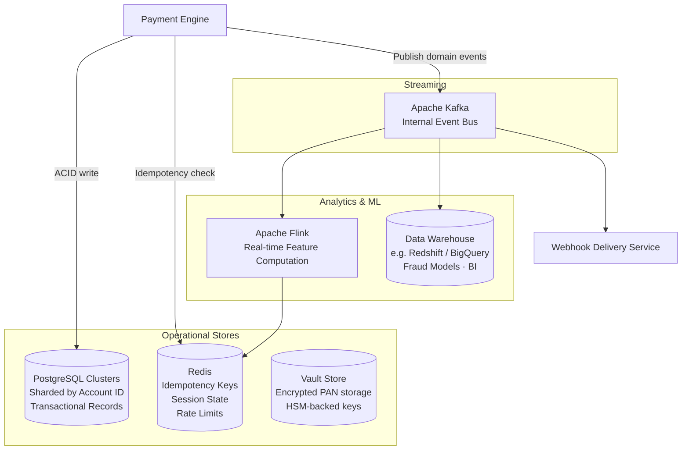

| Store | Technology | Reason |
|-------|-----------|--------|
| Primary transactional DB | PostgreSQL (sharded) | ACID guarantees for financial records |
| Card vault | Proprietary encrypted store + HSM | PCI DSS isolation; never co-located with transaction data |
| Idempotency / rate limits | Redis | Sub-millisecond read latency |
| Event streaming | Apache Kafka | Durable, ordered, replayable event log |
| Real-time feature store | Apache Flink + Redis | Low-latency ML feature serving for Radar |
| Analytics / DW | Columnar warehouse | Offline fraud model training, reporting, BI |

### Core Data Models

#### PaymentIntent Table

The `payment_intents` table is the **authoritative source of truth** for every payment. It is sharded by `account_id` (merchant) and records the full lifecycle of a payment attempt.

```sql
CREATE TABLE payment_intents (
    -- Identity
    id                  TEXT        PRIMARY KEY,          -- 'pi_3ABC...' (Stripe object ID)
    account_id          TEXT        NOT NULL,             -- Merchant account (shard key)
    idempotency_key     TEXT        UNIQUE,               -- Client-supplied dedup key

    -- Money
    amount              BIGINT      NOT NULL,             -- In smallest currency unit (cents)
    currency            TEXT        NOT NULL,             -- ISO 4217: 'usd', 'eur'
    amount_capturable   BIGINT      NOT NULL DEFAULT 0,   -- Authorized but uncaptured
    amount_received     BIGINT      NOT NULL DEFAULT 0,   -- Successfully captured

    -- State machine
    state               TEXT        NOT NULL DEFAULT 'requires_payment_method',
        -- requires_payment_method | requires_confirmation | requires_action
        -- processing | requires_capture | succeeded | canceled
    cancellation_reason TEXT,                             -- e.g. 'duplicate', 'requested_by_customer'

    -- Payment method
    payment_method_id   TEXT,                             -- 'pm_xxx' → Payment Method vault
    payment_method_type TEXT,                             -- 'card', 'us_bank_account', 'sepa_debit'

    -- Capture behaviour
    capture_method      TEXT        NOT NULL DEFAULT 'automatic',  -- 'automatic' | 'manual'

    -- Card network response (populated after authorization)
    auth_code           TEXT,                             -- Issuer authorization code
    network_txn_id      TEXT,                             -- Card network reference
    decline_code        TEXT,                             -- 'insufficient_funds', 'lost_card', etc.

    -- 3-D Secure / SCA
    requires_action_type TEXT,                            -- 'redirect_to_url', 'use_stripe_sdk'
    next_action_url     TEXT,                             -- 3DS redirect URL

    -- Metadata & relationships
    customer_id         TEXT,                             -- 'cus_xxx' (optional)
    description         TEXT,
    metadata            JSONB,                            -- Merchant-supplied key-value pairs
    transfer_group      TEXT,                             -- Connect: groups related transfers
    on_behalf_of        TEXT,                             -- Connect: connected account ID

    -- Audit
    created_at          TIMESTAMPTZ NOT NULL DEFAULT now(),
    updated_at          TIMESTAMPTZ NOT NULL DEFAULT now(),
    livemode            BOOLEAN     NOT NULL DEFAULT true,
    api_version         TEXT        NOT NULL,             -- API version used to create

    -- Indexes
    CONSTRAINT chk_state CHECK (state IN (
        'requires_payment_method', 'requires_confirmation', 'requires_action',
        'processing', 'requires_capture', 'succeeded', 'canceled'
    ))
);

-- Shard key: all queries route by account_id
CREATE INDEX idx_pi_account_state   ON payment_intents (account_id, state);
CREATE INDEX idx_pi_account_created ON payment_intents (account_id, created_at DESC);
CREATE INDEX idx_pi_customer        ON payment_intents (customer_id) WHERE customer_id IS NOT NULL;
```

> **Note**: Stripe's actual schema will differ in implementation details (e.g. column encryption, internal metadata columns, version vectors for optimistic locking). This model captures the **logical structure** that maps to the public API.

#### Ledger Entry Table

The financial ledger uses **double-entry bookkeeping** — every financial event produces balanced debit/credit entries that must sum to zero. This is an **append-only** table; entries are never updated or deleted.

```sql
CREATE TABLE ledger_entries (
    -- Identity
    id              BIGINT      GENERATED ALWAYS AS IDENTITY PRIMARY KEY,
    entry_group_id  TEXT        NOT NULL,             -- Groups entries for one financial event
                                                      -- (e.g. 'evt_pi_3ABC_succeeded')

    -- Double-entry bookkeeping
    type            TEXT        NOT NULL,             -- 'debit' | 'credit'
    account_id      TEXT        NOT NULL,             -- Internal ledger account
    account_type    TEXT        NOT NULL,             -- 'customer_receivable', 'merchant_balance',
                                                      -- 'stripe_revenue', 'network_payable',
                                                      -- 'reserve_hold', 'dispute_liability'
    amount          BIGINT      NOT NULL,             -- Always positive; direction indicated by type
    currency        TEXT        NOT NULL,             -- ISO 4217

    -- Source reference
    source_type     TEXT        NOT NULL,             -- 'payment_intent', 'refund', 'transfer',
                                                      -- 'dispute', 'payout'
    source_id       TEXT        NOT NULL,             -- 'pi_xxx', 'ref_xxx', 'tr_xxx', 'dp_xxx'

    -- Stripe Connect
    platform_id     TEXT,                             -- Connect platform account
    connected_id    TEXT,                             -- Connected account

    -- Audit & idempotency
    idempotency_key TEXT        UNIQUE NOT NULL,      -- Prevents duplicate entry creation
    effective_at    TIMESTAMPTZ NOT NULL,             -- When the financial event occurred
    created_at      TIMESTAMPTZ NOT NULL DEFAULT now(),
    posted          BOOLEAN     NOT NULL DEFAULT false, -- false = pending, true = finalized

    -- Invariant: debits = credits within each entry_group_id
    CONSTRAINT chk_type CHECK (type IN ('debit', 'credit')),
    CONSTRAINT chk_amount_positive CHECK (amount > 0)
);

CREATE INDEX idx_ledger_group     ON ledger_entries (entry_group_id);
CREATE INDEX idx_ledger_account   ON ledger_entries (account_id, effective_at DESC);
CREATE INDEX idx_ledger_source    ON ledger_entries (source_type, source_id);
CREATE INDEX idx_ledger_platform  ON ledger_entries (platform_id) WHERE platform_id IS NOT NULL;
```

#### How a Payment Produces Ledger Entries

When a $100 payment succeeds with a 2.9% + $0.30 Stripe fee:

```
entry_group_id: evt_pi_3ABC_succeeded
┌──────────┬──────────────────────────┬────────┬──────────┐
│ type     │ account_type             │ amount │ currency │
├──────────┼──────────────────────────┼────────┼──────────┤
│ debit    │ customer_receivable      │ 10000  │ usd      │  ← Cardholder owes Stripe
│ credit   │ merchant_balance         │  9680  │ usd      │  ← Merchant earns $96.80
│ credit   │ stripe_revenue           │   320  │ usd      │  ← Stripe fee: $3.20
└──────────┴──────────────────────────┴────────┴──────────┘
                                        Σ debits = Σ credits = $100.00  ✅
```

#### Ledger Accounts Hierarchy

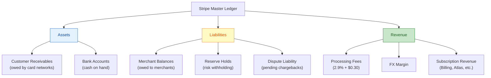

#### Outbox Table (for Option B2)

When using the Transactional Outbox pattern (§14), the outbox table sits in the **same database** as `payment_intents`:

```sql
CREATE TABLE outbox (
    id              BIGINT      GENERATED ALWAYS AS IDENTITY PRIMARY KEY,
    aggregate_type  TEXT        NOT NULL,             -- 'payment_intent', 'refund'
    aggregate_id    TEXT        NOT NULL,             -- 'pi_xxx'
    event_type      TEXT        NOT NULL,             -- 'payment_intent.succeeded'
    payload         JSONB       NOT NULL,             -- Full event payload
    created_at      TIMESTAMPTZ NOT NULL DEFAULT now(),
    delivered       BOOLEAN     NOT NULL DEFAULT false,
    delivered_at    TIMESTAMPTZ                        -- When relay confirmed Kafka delivery
);

CREATE INDEX idx_outbox_pending ON outbox (created_at) WHERE delivered = false;
```

#### Inbox Table (Ledger Service — for Option B2)

The inbox table sits in the **Ledger Service's own database** for deduplication:

```sql
CREATE TABLE inbox (
    message_id      TEXT        PRIMARY KEY,          -- Same as outbox event ID
    source          TEXT        NOT NULL,             -- 'payment-service'
    event_type      TEXT        NOT NULL,             -- 'payment_intent.succeeded'
    processed_at    TIMESTAMPTZ NOT NULL DEFAULT now()
);
```

The ledger consumer uses a single transaction:

```sql
BEGIN;
  INSERT INTO inbox (message_id, source, event_type)
    VALUES ('evt_123', 'payment-service', 'payment_intent.succeeded')
    ON CONFLICT (message_id) DO NOTHING;       -- Deduplicate

  -- Only insert ledger entries if inbox insert succeeded (not a duplicate)
  INSERT INTO ledger_entries (entry_group_id, type, account_id, ...)
    SELECT ... WHERE NOT EXISTS (SELECT 1 FROM inbox WHERE message_id = 'evt_123' AND processed_at < now() - interval '1 second');
COMMIT;
```

---

### Event Sourcing & Audit Trail

All state changes to Stripe objects are recorded as immutable **events** in an append-only event log:

- Every transition (e.g. `payment_intent.created` → `payment_intent.succeeded`) produces a corresponding event object
- Events are exposed via the `/v1/events` API and delivered to merchants via webhooks
- Events are also consumed internally for downstream processing (ledger updates, payout scheduling, fraud feature computation)
- The event log forms the **audit trail** required by PCI DSS and financial regulators

---

## Multi-Region & High Availability Architecture

Stripe operates an **active–active multi-region** deployment to meet its 99.999% availability target (< 5 min downtime/year):

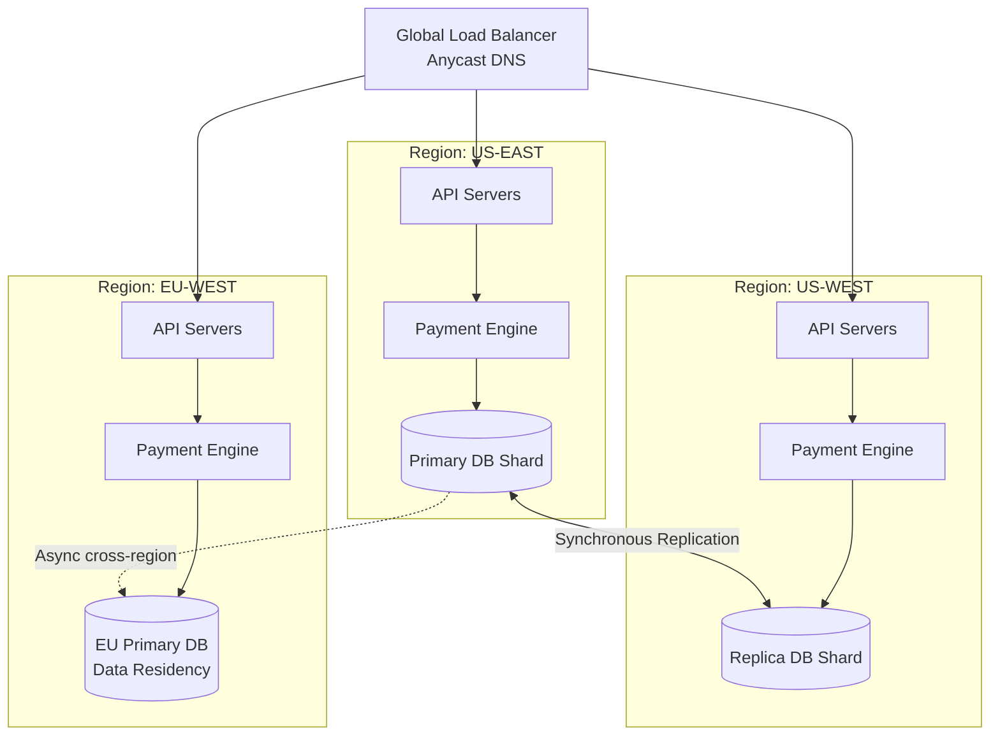

**Availability patterns used**:

| Pattern | Implementation |
|---------|---------------|
| Active–active regions | All regions can serve write traffic; global routing by latency |
| Synchronous replication | Writes committed to ≥ 2 nodes before ACK to API layer |
| Circuit breakers | Automatic fallback from primary acquirer to secondary on elevated error rate |
| Graceful degradation | Non-critical enrichment (e.g. some Radar signals) can be skipped under extreme load |
| Idempotency | Enables safe client retry without risk of double charges |
| Bulkheads | Separate thread pools / resource quotas per merchant tier prevent noisy neighbours |

---

## Security Architecture

### Tokenization & Encryption

Stripe's security model is built around ensuring that raw cardholder data (PAN, CVV, expiry) is never accessible to the merchant, and minimally accessible within Stripe itself:

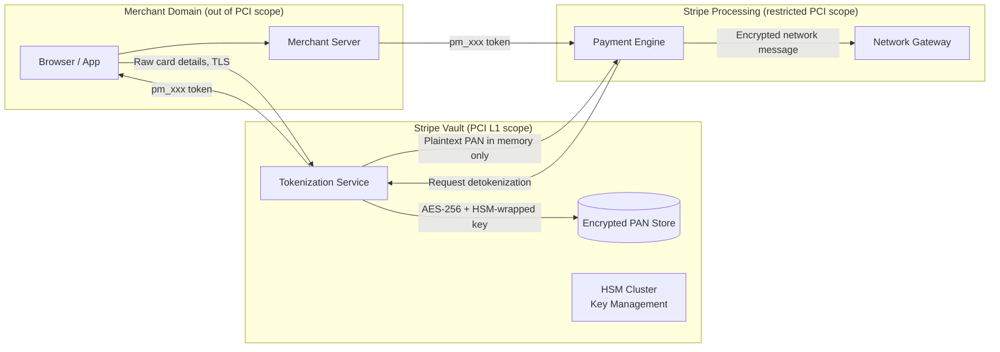

**Key security controls**:

| Control | Detail |
|---------|--------|
| TLS 1.2+ everywhere | All traffic in transit encrypted; TLS 1.0/1.1 not supported |
| PAN never touches merchant servers | Stripe.js collects card details and posts directly to Stripe's vault |
| AES-256 at rest | All PANs encrypted with AES-256; encryption keys managed in HSMs |
| HSM-backed key management | Master keys stored in FIPS 140-2 Level 3 HSMs; see §9.1.1.2 |
| Tokenization | PANs replaced with payment method tokens in all non-vault contexts |
| mTLS between internal services | Internal service-to-service calls use mutual TLS |
| Secrets management | API keys stored as salted hashes; never stored in plaintext |
| Penetration testing | Regular external red team exercises + bug bounty program |

### PCI DSS Compliance Scope

Because Stripe.js posts card data directly to Stripe's servers, merchants using the hosted fields integration are only subject to **SAQ A** (the simplest PCI self-assessment questionnaire), rather than SAQ D which covers the full 300+ control set.

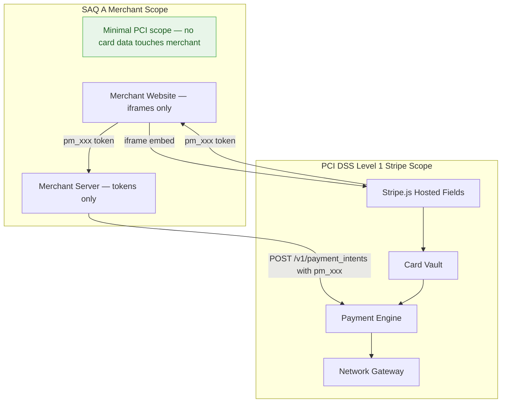

---

## API Design Principles

Stripe's API is widely cited as a reference for developer-friendly API design:

| Principle | Implementation |
|-----------|---------------|
| **REST with nouns** | Resources: `/charges`, `/payment_intents`, `/customers`, `/invoices` |
| **Idempotency keys** | `Idempotency-Key` header; safe to retry any mutating request |
| **Consistent error format** | All errors return `{type, code, message, param, doc_url}` |
| **Expandable objects** | `?expand[]=customer` avoids N+1 round trips |
| **Pagination** | Cursor-based (`starting_after`, `ending_before`) for stable pagination |
| **Versioning** | Dated version strings (`2024-06-20`); breaking changes never in-place |
| **Webhooks** | Push-based event delivery with automatic retries and signature verification |
| **Dashboard parity** | Every Dashboard action is possible via API |

---

## Scalability Patterns

| Pattern | Application in Stripe |
|---------|----------------------|
| **Horizontal sharding** | PostgreSQL sharded by `account_id`; each shard set handles a subset of merchants |
| **Read replicas** | Analytical and reporting queries routed to read replicas; writes always to primary |
| **Async fan-out** | After a payment succeeds, webhook delivery, ledger update, and Radar feedback are async |
| **Rate limiting** | Token bucket per API key; prevents any single merchant from starving shared infrastructure |
| **Event-driven decoupling** | Kafka separates real-time payment path from downstream consumers (billing, analytics) |
| **Caching** | Redis caches idempotency keys, rate-limit counters, and short-lived session tokens |
| **Connection pooling** | PgBouncer-style pooling between application servers and database shards |
| **Smart retries** | Billing retries use ML to pick optimal retry timing (reduces failed payment rate) |

---

## Latency Optimization

Stripe targets **< 100 ms P50** and **< 500 ms P99** for charge creation API calls. Because the external card network round-trip alone consumes 200–400 ms, every millisecond saved on the internal path matters. Stripe's latency strategy is: **minimize everything Stripe controls so the total time is dominated only by the irreducible external network hop**.

### Latency Budget Breakdown

A typical `POST /v1/payment_intents/pi_xxx/confirm` call traverses the following steps, with approximate latency contributions:

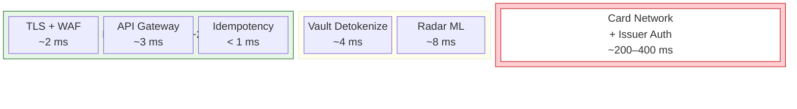

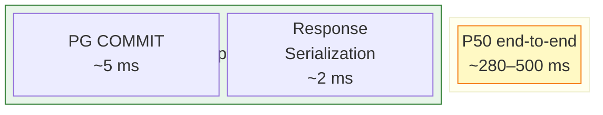

| Phase | P50 Latency | Notes |
|-------|-------------|-------|
| TLS termination + WAF | ~2 ms | Hardware-accelerated TLS; edge PoPs close to merchant |
| API Gateway (auth, rate-limit, validation) | ~3 ms | In-memory key lookup; schema validation is fast-path |
| Idempotency check | < 1 ms | Redis `GET`; critical path only on cache hit |
| Card vault detokenization | ~4 ms | In-memory decrypt; HSM call only for key unwrap (cached) |
| Radar ML inference | ~8 ms | Pre-computed feature vectors; model scored in-process |
| PPE orchestration | ~2 ms | State machine dispatch; no I/O |
| **Card network + issuer** | **~200–400 ms** | **Irreducible external latency** |
| PostgreSQL COMMIT | ~5 ms | Synchronous replication to quorum; SSD-backed WAL |
| Response serialization | ~2 ms | Protobuf internal → JSON external |
| **Total P50** | **~80–100 ms** (excluding network) | |
| **Total P50 end-to-end** | **~280–500 ms** (including network) | |

### Techniques for Minimizing Total Request Time

| # | Technique | How It Reduces Latency |
|---|-----------|------------------------|
| 1 | **Async fan-out for non-critical work** | Webhooks, ledger writes, analytics, and Kafka publishing happen *after* the HTTP response is returned. Only the minimum synchronous path blocks the merchant. |
| 2 | **Redis for all hot-path reads** | Idempotency keys, rate-limit counters, and cached session tokens are in Redis (< 1 ms). No PostgreSQL query on the read side of the critical path. |
| 3 | **In-memory detokenization** | The vault decrypts the PAN in memory using a cached data-encryption key. HSM calls (key-encryption key unwrap) are amortised across thousands of requests. |
| 4 | **In-process Radar scoring** | The ML model runs in the same process / sidecar as the PPE — no network hop for fraud scoring. Feature vectors are pre-computed by Flink and served from Redis. |
| 5 | **Anycast DNS + edge PoPs** | Global load balancer routes the merchant's TCP connection to the nearest Stripe edge PoP, minimizing network RTT before the request reaches the application layer. |
| 6 | **Connection pooling (PgBouncer)** | Eliminates TCP + TLS handshake overhead for every database call; connections are pre-warmed. |
| 7 | **Sharding by account_id** | Each PostgreSQL shard holds a small working set per merchant; index lookups and WAL flushes are fast. |
| 8 | **Smart Router selects lowest-latency path** | The routing table includes latency as a factor, preferring direct Stripe acquiring connections (1 hop) over partner acquirers (2+ hops). |
| 9 | **Graceful degradation under load** | Non-critical Radar signals can be skipped under extreme load, preventing tail-latency spikes from propagating to P99. |
| 10 | **Hardware-accelerated TLS** | Edge PoPs use dedicated TLS offload hardware; no CPU contention with application logic. |
| 11 | **Pre-warmed JIT / AOT compilation** | Payment engine services use ahead-of-time compilation and pre-warmed JIT caches to eliminate cold-start latency. |
| 12 | **Parallel I/O where possible** | Radar feature fetch and vault detokenization can run concurrently since they are independent; the PPE issues both in parallel. |

```mermaid
flowchart LR
    subgraph "Synchronous Critical Path"
        A[API Gateway] --> B[Idempotency Check]
        B --> C{Parallel}
        C -->|Fork 1| D[Vault Detokenize]
        C -->|Fork 2| E[Radar Feature Fetch]
        D --> F[Join]
        E --> F
        F --> G[Radar ML Score]
        G --> H[PPE → Network Auth]
        H --> I[PG COMMIT]
        I --> J[HTTP Response]
    end

    subgraph "Async (after response)"
        J -.-> K[Kafka Publish]
        J -.-> L[Webhook Delivery]
        J -.-> M[Ledger Update]
        J -.-> N[Analytics]
    end
```

### Handling the External Network Bottleneck

The card network round-trip (200–400 ms) is the **single largest latency contributor** and is outside Stripe's control. Stripe mitigates its impact through:

| Strategy | Description |
|----------|-------------|
| **Direct network connections** | Stripe holds acquiring licenses and connects directly to Visa/MC — no intermediary processor adds hops |
| **Geographic proximity** | Network gateway servers co-located in the same data centres as card network entry points |
| **Persistent TCP connections** | Long-lived, pre-authenticated connections to card networks; no per-transaction handshake |
| **Pipelining** | Multiple authorization messages in-flight on the same connection (where network protocol allows) |
| **Timeout + retry with alternate path** | If the primary network path exceeds a threshold (~800 ms), the Smart Router can cancel and retry via an alternate acquirer path — often faster than waiting |
| **Network-level SLA monitoring** | Real-time tracking of per-issuer response times; slow issuers are flagged and routing adjusted |

**Why P99 can spike to 500 ms+**: The tail is driven by slow issuing banks. Some issuers (particularly in emerging markets) have legacy systems with variable response times. Stripe cannot force faster issuer responses, but can:
1. Return a `processing` status quickly and notify via webhook when the late auth arrives (for merchants that opt into async confirmation)
2. Set aggressive timeouts and retry via alternate acquirer paths
3. Cache issuer latency profiles to pre-select the fastest routing option

---

## Observability Architecture

```mermaid
flowchart TB
    subgraph "Instrumentation"
        SVC[Microservices] -->|Structured logs| LOG[Log Aggregation<br/>e.g. Splunk / ELK]
        SVC -->|Metrics| METRICS[Time-Series DB<br/>e.g. Prometheus / M3]
        SVC -->|Traces| TRACE[Distributed Tracing<br/>e.g. Zipkin / Jaeger]
    end

    subgraph "Alerting & Response"
        METRICS --> ALERT[Alerting Engine<br/>PagerDuty]
        LOG --> ALERT
        ALERT --> ONCALL[On-Call Engineer]
    end

    subgraph "Dashboards"
        METRICS --> DASH[Grafana Dashboards<br/>SLO / SLA Tracking]
        LOG --> DASH
    end
```

**Key SLOs (indicative)**:

| Metric | Target |
|--------|--------|
| API P99 latency (charge creation) | < 500 ms |
| API P50 latency (charge creation) | < 100 ms |
| Payment success rate | > 99.9% |
| Webhook delivery (first attempt) | < 30 s |
| Platform availability | > 99.999% |

---

## Transactional Integrity

Stripe deliberately avoids a single distributed ACID transaction spanning all participants. Instead, integrity is enforced through **four interlocking layers**: an idempotency gate at the API boundary, a row-locked state machine in the PPE, ACID-compliant shard writes backed by synchronous replication, and an append-only event log as the authoritative audit trail. Because Stripe operates globally across card networks, local payment methods, and multiple acquiring paths, each failure mode has a structural prevention or a well-defined compensating path.

### Core Integrity Mechanisms

| Pillar | Technology | Guarantee |
|--------|-----------|----------|
| Idempotency | Redis-backed `Idempotency-Key` dedup (24-hour TTL) | Same logical operation is never executed twice |
| State machine | PaymentIntent states in PostgreSQL (`SELECT FOR UPDATE` row lock) | Illegal state transitions are structurally impossible |
| ACID intra-shard writes | PostgreSQL sharded by `account_id`; synchronous ≥ 2-node replication before ACK | Each merchant's shard is internally consistent; no write is lost on single-node failure |
| Append-only event log | Apache Kafka + immutable event objects | Full reconstruction of any object's history; audit trail required by PCI DSS and financial regulators |
| Double-entry ledger | Financial Ledger Service with deterministic event IDs | Every debit has a matching credit; `ON CONFLICT DO NOTHING` for idempotent ledger writes |

```mermaid
flowchart TB
    subgraph "API Boundary"
        IDEM["Idempotency Gate<br/>Redis Idempotency-Key"]
    end
    subgraph "PPE State Machine"
        SM["PaymentIntent<br/>row-locked transitions"]
    end
    subgraph "Storage"
        PG[("PostgreSQL<br/>ACID + sync replication")]
        KAFKA["Kafka<br/>Append-only event log"]
    end
    subgraph "Financial Ledger"
        LEDGER["Double-entry<br/>Ledger Service"]
    end
    subgraph "Card Networks"
        NETWORK["Visa / MC<br/>Network Gateway"]
    end

    IDEM -->|New request| SM
    IDEM -->|Duplicate| CACHED[(Cached Response)]
    SM --> PG
    SM --> KAFKA
    KAFKA --> LEDGER
    SM --> NETWORK
```

### Corner Case Analysis

#### 1. Client Retry After Network Timeout

**Scenario**: A merchant sends `POST /v1/payment_intents/pi_xxx/confirm` with `Idempotency-Key: k1`. The network times out before the merchant receives a response, but the payment was actually authorised.

**How handled**:
- On retry with the same `Idempotency-Key: k1`, the API gateway hits the Redis idempotency cache **before** reaching the PPE and returns the previously cached response.
- No second authorisation is sent to the card network. The 24-hour deduplication window covers all reasonable retry windows.
- If the first request never reached Stripe (TCP failure before TLS handshake), the idempotency key was never written to Redis. The retry is treated as a fresh request — correct behaviour.

---

#### 2. Network Authorization Approved but Stripe Crashes Before Writing to PostgreSQL

**Scenario**: The card network returns `Approved` to the PPE. The PPE receives it in memory and begins the PostgreSQL write, but the process crashes before `COMMIT`.

**How handled**:
- PostgreSQL rolls back the incomplete transaction automatically. The PaymentIntent remains in `processing`.
- On process restart, the network gateway replays the unacknowledged authorisation response from its **durable gateway journal** (write-ahead log of pending network responses). The PPE re-applies the state transition and retries the `COMMIT`.
- The merchant's API response is only sent **after** the `COMMIT` ACK, so no inconsistency is visible externally.
- If the gateway journal is also lost, the authorisation code is visible in the card network's reconciliation report. The daily reconciliation process flags the mismatch and triggers a recovery workflow.

**Financial risk**: Cardholder has a temporary authorisation hold. If recovery fails, the hold lapses after the network validity period (typically 7 days). No double charge is possible because capture was never sent.

---

#### 3. Two Concurrent Confirmations of the Same PaymentIntent

**Scenario**: A buggy merchant client sends two concurrent `confirm` requests for `pi_xxx` with **different** `Idempotency-Key` values.

**How handled**:
- Both requests pass the idempotency gate.
- Both attempt the `requires_confirmation → processing` state transition on the same PaymentIntent row.
- PostgreSQL's `SELECT FOR UPDATE` on the PaymentIntent row serialises the two writers. The first writer wins the lock and advances the state; the second writer sees the updated state and returns a `409 Conflict` to the API layer — before any network authorisation message is sent.
- Result: exactly one authorisation goes to the card network.

---

#### 4. 3DS / SCA Authentication Abandonment

**Scenario**: A customer is redirected to the issuer's 3DS challenge page and closes the browser tab without completing authentication.

**How handled**:
- The PaymentIntent stays in `requires_action` state. No authorisation is ever sent to the card network — the PPE does not advance past `requires_confirmation` without a confirmed 3DS result.
- A background TTL sweep transitions stale `requires_action` intents to `canceled` after a configurable timeout.
- No funds are ever moved; there is nothing to compensate.

---

#### 5. Primary PostgreSQL Shard Fails Mid-Write

**Scenario**: The PostgreSQL primary for a merchant's shard fails after the PPE issued `COMMIT` but before all synchronous replicas acknowledged.

**How handled**:
- Stripe writes are committed to **≥ 2 synchronous replicas** before ACKing the API layer. A `COMMIT` is only confirmed to the application after the quorum write succeeds. A primary crash after that point cannot lose the write — it is already on a replica.
- The replica is promoted automatically. The API response to the merchant is sent only after the quorum ACK, so no inconsistency is externally visible.
- If the primary crashes **before** the quorum write completes, PostgreSQL rolls back the transaction. The PPE receives a write error and the state machine remains in its previous state.

---

#### 6. Webhook Delivery Failure

**Scenario**: A payment succeeds (`payment_intent.succeeded`), but the merchant's webhook endpoint returns `500` or is unreachable.

**How handled**:
- Webhooks are **not** in the critical transactional path. The PaymentIntent is `succeeded` regardless of webhook delivery.
- The Webhook Delivery Service retries with exponential backoff for up to **3 days**.
- Merchants can poll `/v1/events` or `/v1/payment_intents/pi_xxx` to reconcile missed webhooks.
- The funds exist in the merchant's Stripe Balance regardless of webhook delivery status.

**Trade-off**: This is an intentional eventual-consistency choice. Kafka's at-least-once delivery requires idempotent consumers — noted explicitly in the trade-offs table.

---

#### 7. Partial Capture (Manual Capture Mode)

**Scenario**: `capture_method=manual`. Authorisation approved for $100. Merchant captures $80 only.

**How handled**:
- The PaymentIntent transitions: `processing` → `requires_capture` → `succeeded` (with `amount_received=$80`).
- The uncaptured $20 authorisation hold lapses at the issuer after the network validity period (typically 7 days for card-not-present).
- The Financial Ledger records the $80 capture as a separate entry from the $100 authorisation. No double-entry inconsistency — an authorisation is a hold, not a debit.
- Attempt to capture more than the authorised amount ($100+) is rejected at the API layer before any network message is sent. Overcapture is structurally prevented by schema validation.
- If the merchant does not capture within the auth validity window, the PaymentIntent transitions to `canceled` and the hold is released automatically.

---

#### 8. Refund After Payout Already Processed

**Scenario**: A customer disputes a charge. The merchant issues a refund, but the payout to the merchant's bank account has already cleared.

**How handled**:
- Stripe issues the refund to the cardholder immediately by initiating a **return transaction** on the card network, independent of payout status.
- The merchant's **Stripe Balance** is debited. If the balance is insufficient, Stripe creates a negative balance and either debits the merchant's bank account via ACH pull (if debit authorization is configured) or suspends future payouts until the balance is covered.
- A refund is always a **compensating transaction** — the original payment entry is immutable. The refund is a separate, complete ledger entry.

---

#### 9. Idempotency Key Collision Across Merchants

**Scenario**: Two different merchants both submit `Idempotency-Key: order-123`.

**How handled**:
- Idempotency keys are **scoped to the API key** (merchant account). The Redis key is namespaced as `{api_key}:{idempotency_key}`. Cross-merchant collision is structurally impossible.

---

#### 10. FX Rate Change Between Authorisation and Capture

**Scenario**: A payment is authorised in EUR and captured 5 days later. The EUR/USD rate has moved.

**How handled**:
- The **settlement amount** is governed by card network rules at the time of **clearing**, not authorisation. FX risk between authorisation and capture is borne by the merchant.
- Stripe's Financial Ledger records each entry with the original amount, currency, exchange rate applied, and settlement amount — all fields are immutable once written.
- For merchants using Stripe multi-currency settlement, the FX rate applied is the prevailing rate at clearing time, disclosed in the balance transaction object.

---

#### 11. Kafka Consumer Reprocesses an Event (At-Least-Once Delivery)

**Scenario**: The Ledger Service crashes after writing a ledger entry but before committing its Kafka consumer offset. The event is redelivered.

**How handled**:
- All internal Kafka consumers are **idempotent consumers** (stated as an architectural requirement in the trade-offs).
- Each event carries a deterministic event ID (derived from the PaymentIntent ID + state transition). The Ledger Service uses `INSERT ... ON CONFLICT (event_id) DO NOTHING`.
- A redelivered event produces a no-op. The ledger entry is written exactly once.

---

#### 12. Active–Active Multi-Region Split-Brain

**Scenario**: A network partition isolates US-EAST from US-WEST. Both regions continue accepting write traffic for overlapping merchant shards.

**How handled**:
- Synchronous replication means a shard primary **stops accepting writes** when it cannot confirm the write on a synchronous replica. This is a CP choice: availability is sacrificed on the write path to prevent divergence.
- In practice, shard-primary affinity is used: each merchant's shard has one authoritative primary region at any time. "Active–active" means *different merchants* can be active in *different regions* simultaneously — not that the same shard is writable from two regions concurrently.
- Cross-region replication (US ↔ EU) is async, making US and EU independent consistency domains. EU-domiciled merchants are on EU-primary shards with EU-internal synchronous replication for GDPR data residency compliance.

---

#### 13. Smart Retry of Recurring Billing (Subscription Past-Due)

**Scenario**: A subscription invoice fails to charge because the cardholder's card is declined. Stripe's Smart Retry schedules a retry.

**How handled**:
- The Billing engine creates a new, independent PaymentIntent for each retry attempt. Each attempt is idempotent in isolation.
- The Subscription state machine tracks the `past_due` state separately from the underlying PaymentIntent outcomes. A successful retry on attempt N transitions the subscription back to `active`; it does not modify the records of earlier failed attempts.
- If all Smart Retry attempts are exhausted, the subscription transitions to `canceled` and a `customer.subscription.deleted` event is emitted to the merchant via webhook.

---

### Integrity Guarantees by Layer

| Layer | Guarantee Type | Mechanism |
|-------|---------------|-----------|
| API boundary | Idempotency | Redis `Idempotency-Key`; 24-hour TTL; scoped to `{api_key}:{key}` |
| PaymentIntent transitions | Mutual exclusion | PostgreSQL `SELECT FOR UPDATE`; state machine rejects invalid transitions |
| Intra-shard writes | ACID | PostgreSQL; synchronous ≥ 2-node replication before ACK; 0 RPO |
| Network auth ↔ DB write | Durable gateway journal | Replay on recovery; authorisation lapses if never captured |
| Cross-service orchestration | Saga + compensating transactions | Explicit cancel / refund flows; no distributed XA |
| Async event pipeline | At-least-once + consumer idempotency | Kafka + deterministic event IDs + `ON CONFLICT DO NOTHING` |
| Refunds / payouts | Double-entry ledger + compensating transactions | Original entry immutable; refund = separate credit entry |
| Partial capture | API-layer overcapture prevention | Schema validation rejects amount > authorised before any network message |
| Recurring billing retries | Independent PaymentIntents per attempt | No mutation of prior attempt records; subscription state is separate from payment outcome |
| Multi-region write path | CP (write path), eventual (cross-region async) | Shard-primary affinity; synchronous replication halts on partition rather than diverging |
| Audit trail | Immutable event log | Append-only Kafka events; exposed via `/v1/events`; PCI DSS compliant |

---

## Financial Ledger Architecture

The Financial Ledger is one of the most architecturally significant components in a payment system. It is the **double-entry accounting record** of all money movement — every debit must have a matching credit, and the sum must always balance to zero. The key architectural decision is **where to place the ledger and how to communicate with it**.

This section analyses the placement decision as two levels:
1. **Level 1**: Ledger inside the Payment Service (same DB) vs. Ledger as a separate microservice (own DB)
2. **Level 2**: If separate microservice, communication via plain Kafka vs. Transactional Outbox + Inbox

### Source of Truth Clarification

```mermaid
flowchart LR
    subgraph "Source of Truth"
        PG["PostgreSQL<br/>PaymentIntent record<br/>(state, amount, auth code, timestamps)"]
    end

    subgraph "Derived View"
        LEDGER["Financial Ledger<br/>Double-entry format<br/>(debit/credit entries)"]
    end

    PG -->|"events (Kafka or outbox)"| LEDGER

    style PG fill:#c8e6c9,stroke:#2e7d32,color:#1b5e20
    style LEDGER fill:#e3f2fd,stroke:#1565c0,color:#0d47a1
```

The **PostgreSQL PaymentIntent record** (written synchronously during payment confirmation) is the authoritative source of truth. It contains everything needed to prove a transaction happened. The Financial Ledger **reformats** those facts into debit/credit pairs for accounting, reporting, and regulatory compliance.

### Level 1: Ledger Placement — Same Service vs. Separate Microservice

```mermaid
flowchart TD
    DECISION{"Where does the<br/>Financial Ledger live?"}

    DECISION -->|"Option A"| SAME["Same service & database<br/>as Payment Engine"]
    DECISION -->|"Option B"| SEPARATE["Separate microservice<br/>with its own database"]

    SAME --> SYNC["Synchronous write<br/>in same ACID transaction"]
    SEPARATE --> COMM{"Communication<br/>pattern?"}
    COMM -->|"Option B1"| KAFKA_ONLY["Plain Kafka<br/>(fire-and-hope)"]
    COMM -->|"Option B2"| OUTBOX["Transactional Outbox<br/>+ Inbox pattern"]

    style SAME fill:#c8e6c9,stroke:#2e7d32,color:#1b5e20
    style SEPARATE fill:#e3f2fd,stroke:#1565c0,color:#0d47a1
    style KAFKA_ONLY fill:#fff9c4,stroke:#f57f17,color:#e65100
    style OUTBOX fill:#f3e5f5,stroke:#6a1b9a,color:#4a148c
```

---

### Option A: Ledger Inside the Payment Service (Same Database)

The ledger is just another set of tables in the same PostgreSQL shard. The payment confirmation and ledger write happen in a **single ACID transaction**.

```sql
BEGIN;
  UPDATE payment_intents SET state = 'succeeded', auth_code = 'A123' WHERE id = 'pi_xxx';
  INSERT INTO ledger_entries (event_id, type, account, amount) VALUES ('evt_1', 'debit', 'customer_card', 100);
  INSERT INTO ledger_entries (event_id, type, account, amount) VALUES ('evt_1', 'credit', 'merchant_balance', 97);
  INSERT INTO ledger_entries (event_id, type, account, amount) VALUES ('evt_1', 'credit', 'stripe_fee', 3);
COMMIT;
```

#### Advantages of same-service ledger

| Advantage | Detail |
|-----------|--------|
| **Perfect consistency** | Atomic — if PaymentIntent is `succeeded`, the ledger entries exist. Zero drift. |
| **No reconciliation needed** (internal) | Impossible for the two to diverge; no reconciliation job required for delivery guarantees |
| **Architectural simplicity** | No Kafka, no CDC, no relay, no inbox. One transaction, done. |
| **Simpler failure model** | If the transaction fails, both PaymentIntent and ledger roll back together |
| **Immediate auditability** | Ledger is queryable instantly after payment confirmation |
| **No message ordering concerns** | No out-of-order events; no idempotency deduplication logic needed |

#### Disadvantages of same-service ledger

| Disadvantage | Detail |
|--------------|--------|
| **Added latency** | +3–10 ms per payment for 3–5 additional INSERTs + index updates on the critical path |
| **Longer row locks** | Larger transaction scope → longer `SELECT FOR UPDATE` hold → lower throughput under contention |
| **Tight coupling** | Ledger schema change (`ALTER TABLE`) or bug blocks all payments |
| **Migration risk** | Any ledger database migration must be coordinated with the payment path |
| **Cross-shard impossible** | Multi-party payments (Connect: platform + seller on different shards) cannot be a single transaction |
| **Reporting contention** | Heavy ledger queries (financial reporting, auditor exports) compete with payment writes |
| **Write amplification on hot path** | 1 payment = 3–5 ledger INSERTs on the customer-facing thread |
| **Blast radius** | A bug in fee calculation logic → **all payments fail** (even though the issuer approved) |

#### Best suited for

- Single-party payments (no marketplace/Connect)
- Lower transaction volumes (< 1000 TPS)
- Systems requiring zero-drift guarantee without reconciliation
- Monolithic architectures
- Startups / early-stage payment platforms where simplicity matters more than scale

---

### Option B: Ledger as a Separate Microservice (Own Database)

The ledger is an independent service with its own PostgreSQL (or specialised ledger database). It receives events from the Payment Service and writes entries independently.

```mermaid
flowchart TB
    subgraph "Payment Service"
        PPE[Payment Engine]
        PG_PAY[("PostgreSQL<br/>PaymentIntent records")]
        PPE --> PG_PAY
    end

    subgraph "Communication Layer"
        MSG["Kafka / Outbox Relay"]
    end

    subgraph "Ledger Microservice"
        LSVC[Ledger Service]
        PG_LED[("PostgreSQL / Ledger DB<br/>Double-entry records")]
        LSVC --> PG_LED
    end

    PPE -->|domain events| MSG
    MSG --> LSVC
```

#### Advantages of separate ledger microservice

| Advantage | Detail |
|-----------|--------|
| **Zero latency impact on payments** | Ledger write is fully async; customer-facing path is unaffected |
| **Fault isolation** | Ledger outage, bug, or slow query **never blocks payments**. Issuer approved = payment succeeds. |
| **Independent scaling** | Ledger can scale read replicas for reporting without affecting payment throughput |
| **Independent deployment** | Ledger team ships changes without touching the payment path; no coordinated deploys |
| **Schema freedom** | Ledger can use a specialised schema (or even a different database engine optimised for append-only writes) |
| **Cross-shard support** | Multi-party (Connect) payments naturally handled — each shard publishes events; ledger service consumes from all shards |
| **Read-optimised design** | Ledger database tuned for analytical queries (financial reports, tax calculations, auditor exports) without write-path contention |
| **Domain boundary** | Clean separation of concerns — payment domain vs. accounting domain. Different teams can own each. |
| **Technology flexibility** | Ledger could migrate to a specialised ledger database (e.g., TigerBeetle, custom append-only store) without changing the payment service |

#### Disadvantages of separate ledger microservice

| Disadvantage | Detail |
|--------------|--------|
| **Eventual consistency** | Ledger may lag behind PostgreSQL; requires reconciliation |
| **Message delivery risk** | Events can be lost, duplicated, or arrive out of order (depending on communication pattern) |
| **Operational complexity** | More infrastructure to manage (Kafka/CDC, consumer groups, dead-letter queues) |
| **Reconciliation burden** | Must run periodic jobs to verify ledger matches source of truth |
| **Debugging difficulty** | Payment + ledger are separate systems; tracing a discrepancy requires correlating across services |
| **Recovery complexity** | If ledger is corrupted, must rebuild from Kafka archive or PostgreSQL scan |

---

### Level 2: Communication Pattern (when ledger is a separate microservice)

If the ledger is a separate service, the critical question becomes: **how does the Payment Service communicate state changes to the Ledger Service?**

#### Option B1: Plain Kafka (Publish After Commit)

```mermaid
sequenceDiagram
    participant PPE as Payment Engine
    participant PG as PostgreSQL
    participant K as Kafka
    participant LS as Ledger Service
    participant LDB as Ledger DB

    PPE->>PG: BEGIN → UPDATE payment_intents → COMMIT
    Note over PPE,PG: ✅ Transaction committed
    PPE->>K: Publish payment_intent.succeeded
    Note over PPE,K: ⚠️ SEPARATE operation — can fail independently
    K->>LS: Deliver event (at-least-once)
    LS->>LDB: INSERT ledger entry (deduplicate)
```

**The dual-write problem**: The PostgreSQL COMMIT and the Kafka publish are **two independent operations**. If the process crashes between them, the PaymentIntent is committed but the Kafka message is never published → the ledger never gets updated.

| Aspect | Detail |
|--------|--------|
| **Delivery guarantee** | ⚠️ At-most-once if producer crashes between COMMIT and publish; at-least-once after publish (Kafka guarantees) |
| **Lost message risk** | ❌ Real — crash/restart between PG COMMIT and Kafka produce = silent message loss |
| **Duplicate risk** | ⚠️ Possible if producer retries after timeout but Kafka already received — mitigated by idempotent producer |
| **Ordering** | ✅ Per-partition ordering guaranteed by Kafka |
| **Latency to consumer** | ✅ Very low (< 100 ms typically) |
| **Recovery from Kafka failure** | ❌ If Kafka is down when payment completes, event is lost unless producer buffers durably |
| **Kafka retention expiry** | ❌ Events deleted after retention window; must archive to cold storage |
| **Reconciliation needed** | ❌ **Yes — mandatory and frequent** (to catch lost messages) |
| **Operational complexity** | ⚠️ Medium — standard Kafka consumer group, offset management |

**Mitigation strategies for plain Kafka**:
- Kafka idempotent producer (`enable.idempotence=true`) — prevents duplicates on retry
- Outbox-like polling as backup — periodic scan of PaymentIntents without corresponding Kafka acks
- Aggressive reconciliation schedule (hourly)
- Kafka topic archival to S3/GCS before retention expiry

---

#### Option B2: Transactional Outbox + Inbox Pattern

```mermaid
sequenceDiagram
    participant PPE as Payment Engine
    participant PG as PostgreSQL
    participant R as CDC / Relay
    participant K as Kafka (optional)
    participant LS as Ledger Service
    participant LDB as Ledger DB

    PPE->>PG: BEGIN → UPDATE payment_intents → INSERT INTO outbox → COMMIT
    Note over PPE,PG: ✅ ATOMIC — both or neither
    R->>PG: Poll outbox / CDC stream
    R->>K: Publish to Kafka (or direct to Ledger)
    R->>PG: Mark outbox row as delivered
    K->>LS: Deliver event
    LS->>LDB: BEGIN → INSERT INTO inbox (deduplicate) → INSERT ledger entry → COMMIT
    Note over LS,LDB: ✅ Exactly-once via inbox deduplication
```

| Aspect | Detail |
|--------|--------|
| **Delivery guarantee** | ✅ **Guaranteed** — outbox row is in same transaction as PaymentIntent; relay retries until delivered |
| **Lost message risk** | ✅ **Impossible** — if PaymentIntent is committed, outbox row exists; relay will eventually deliver it |
| **Duplicate risk** | ✅ **Handled** — inbox table deduplicates on `message_id` (`ON CONFLICT DO NOTHING`) |
| **Ordering** | ⚠️ Depends on relay implementation; serial polling preserves order; parallel relay may not |
| **Latency to consumer** | ⚠️ Slightly higher (relay polling interval, typically 100–500 ms) |
| **Recovery from Kafka failure** | ✅ Outbox rows persist; relay retries when Kafka recovers |
| **Kafka retention expiry** | ✅ **Not a concern** — outbox is the source, not Kafka |
| **Reconciliation needed** | ⚠️ **Minimal** — only semantic validation + external reconciliation |
| **Operational complexity** | ❌ High — CDC/polling infrastructure, relay process, inbox table, dead-letter handling |

---

### Head-to-Head: Plain Kafka vs. Outbox + Inbox

| Criterion | Plain Kafka (B1) | Outbox + Inbox (B2) |
|-----------|-------------------|---------------------|
| **Can messages be lost?** | ❌ Yes (dual-write problem) | ✅ No (atomic with PaymentIntent) |
| **Can messages be duplicated?** | ⚠️ Yes (mitigated by idempotent producer) | ✅ No (inbox deduplication) |
| **Reconciliation burden** | ❌ Heavy — must catch lost messages | ✅ Light — only semantic/external checks |
| **Infrastructure complexity** | ✅ Lower — just Kafka producer + consumer | ❌ Higher — CDC/relay + inbox + outbox table |
| **Latency to ledger** | ✅ Lower (~50–100 ms) | ⚠️ Slightly higher (~100–500 ms) |
| **Kafka dependency** | ❌ Critical — Kafka down = messages lost | ✅ Non-critical — outbox persists; Kafka is delivery optimisation |
| **Debugging "where did my event go?"** | ❌ Hard — check Kafka topics, retention, consumer offsets | ✅ Easy — check outbox table (row exists? delivered flag?) |
| **Proven at scale** | ✅ Widely used (Stripe's likely approach) | ✅ Used by Debezium, Eventuate, major banks |
| **Outbox table growth** | N/A | ⚠️ Must periodically purge delivered rows |
| **Team familiarity** | ✅ Most teams know Kafka | ⚠️ Outbox pattern less familiar; CDC tooling has learning curve |

---

### Reconciliation Requirements by Approach

| Reconciliation type | Same-service (A) | Plain Kafka (B1) | Outbox + Inbox (B2) |
|--------------------|-----------------|-------------------|---------------------|
| Delivery: "Did ledger get the event?" | ✅ N/A (atomic) | ❌ Required (hourly) | ✅ Guaranteed by design |
| Semantic: "Is the amount correct?" | ✅ N/A (same logic, same transaction) | ❌ Required (lost events compound the risk — need cross-service comparison to detect both missing AND wrong entries) | ⚠️ Recommended as defense-in-depth (delivery is guaranteed, so only catches computation bugs / schema drift — not strictly required) |
| Structural: "Do debits = credits?" | ⚠️ Can enforce with CHECK constraints | ⚠️ Can enforce with CHECK constraints in Ledger DB (local invariant — independent of communication pattern) | ⚠️ Can enforce with CHECK constraints in Ledger DB (local invariant — independent of communication pattern) |
| External: Stripe ↔ Card network settlement | ❌ Required | ❌ Required | ❌ Required |
| External: Stripe ↔ Bank movements | ❌ Required | ❌ Required | ❌ Required |

> **Key insight**: No architecture eliminates external reconciliation (card networks and banks are separate systems). The internal reconciliation burden is what varies. Structural integrity (debits = credits) is a **local property** of the ledger database enforceable via constraints in all approaches — it does not depend on the communication pattern.

---

### Recovery Strategies

| Failure scenario | Same-service (A) | Plain Kafka (B1) | Outbox + Inbox (B2) |
|-----------------|-----------------|-------------------|---------------------|
| Ledger database corrupted | Restore from PostgreSQL backup (same DB) | Replay Kafka (if within retention) or scan PaymentIntents | Replay outbox rows (persistent) or scan PaymentIntents |
| Events lost in transit | ✅ Impossible | ❌ Reconciliation detects → rebuild from PG | ✅ Impossible |
| Kafka down for hours | ✅ N/A (no Kafka) | ❌ Events lost during outage | ✅ Outbox accumulates; relay delivers when Kafka recovers |
| Beyond Kafka retention | ✅ N/A | ❌ Must archive to S3/GCS or rebuild from PG | ✅ Outbox is source; Kafka retention irrelevant |
| Consumer bug writes wrong amounts | ❌ Same bug affects payments | Reconciliation catches it | Reconciliation catches it |

---

### Decision Framework

```mermaid
flowchart TD
    Q1{"Do you have<br/>multi-party payments?"}
    Q1 -->|Yes| SEPARATE["Must be separate service<br/>(cross-shard requirement)"]
    Q1 -->|No| Q2{"Transaction volume<br/>> 1000 TPS?"}
    Q2 -->|No| SAME["Consider same-service<br/>(simplicity wins)"]
    Q2 -->|Yes| Q3{"Can you tolerate<br/>+3–10 ms latency?"}
    Q3 -->|Yes| SAME
    Q3 -->|No| SEPARATE

    SEPARATE --> Q4{"Team has CDC/Outbox<br/>expertise?"}
    Q4 -->|Yes| OUTBOX["Use Outbox + Inbox<br/>(strongest guarantees)"]
    Q4 -->|No| Q5{"Can you invest in<br/>heavy reconciliation?"}
    Q5 -->|Yes| KAFKA["Use plain Kafka<br/>+ aggressive reconciliation"]
    Q5 -->|No| OUTBOX

    style SAME fill:#c8e6c9,stroke:#2e7d32,color:#1b5e20
    style SEPARATE fill:#e3f2fd,stroke:#1565c0,color:#0d47a1
    style OUTBOX fill:#f3e5f5,stroke:#6a1b9a,color:#4a148c
    style KAFKA fill:#fff9c4,stroke:#f57f17,color:#e65100
```

### Why Stripe Chose Separate Service + Kafka (Likely)

| Reason | Explanation |
|--------|-------------|
| **Stripe Connect** | Multi-party payments are a core product; cross-shard ledger entries are unavoidable |
| **Extreme scale** | Billions of transactions; can't afford +3–10ms per payment |
| **Team specialisation** | Dedicated ledger/accounting team can own their service independently |
| **Reconciliation already mandatory** | External reconciliation (vs. card networks, banks) must exist anyway — extending it to internal is marginal cost |
| **Blast radius** | A ledger bug must never block payments globally |
| **Likely enhanced with outbox-like patterns** | Stripe likely uses CDC or durable gateway journals (mentioned in corner case #2) that provide outbox-equivalent guarantees |

---

## Dispute & Chargeback Architecture

Disputes (chargebacks) are a critical operational concern for any payment processor. When a cardholder contests a charge with their issuing bank, it triggers a formal dispute process governed by card network rules (Visa Dispute Resolution, Mastercard Chargeback Guide).

### Dispute Lifecycle

```mermaid
stateDiagram-v2
    [*] --> warning_needs_response: Issuer files dispute
    warning_needs_response --> warning_under_review: Merchant submits evidence
    warning_needs_response --> warning_closed: No response (merchant loses)
    warning_under_review --> won: Network rules in merchant's favour
    warning_under_review --> lost: Network rules against merchant
    lost --> [*]
    won --> [*]
    warning_closed --> [*]
```

### Dispute Processing Architecture

```mermaid
flowchart TB
    subgraph "Card Network"
        ISSUER[Issuing Bank] -->|Chargeback message<br/>TC40 / SAFE| NETWORK[Visa / Mastercard]
        NETWORK -->|Dispute notification| STRIPE_GW[Stripe Network Gateway]
    end

    subgraph "Stripe Dispute Engine"
        STRIPE_GW --> DISPUTE_SVC[Dispute Service]
        DISPUTE_SVC -->|Create dispute object| PG[(PostgreSQL)]
        DISPUTE_SVC -->|Debit merchant balance| LEDGER[Financial Ledger]
        DISPUTE_SVC -->|Emit event| KAFKA[Kafka]
        KAFKA -->|charge.dispute.created| WEBHOOK[Webhook Service]
    end

    subgraph "Merchant Response"
        WEBHOOK -->|Notify merchant| MERCHANT[Merchant Server]
        MERCHANT -->|Submit evidence via API| API[Stripe API]
        API --> DISPUTE_SVC
        DISPUTE_SVC -->|Forward evidence| NETWORK
    end
```

### Key dispute handling characteristics

| Aspect | Detail |
|--------|--------|
| **Immediate balance impact** | Disputed amount + network fee debited from merchant's Stripe Balance immediately upon dispute creation |
| **Evidence submission** | Merchants submit evidence (receipts, logs, delivery proof) via API within network deadline (typically 7–21 days) |
| **Automated evidence gathering** | Stripe auto-collects IP address, AVS/CVC check results, refund history, and customer email from transaction metadata |
| **Radar for Fraud Teams** | Proactive early fraud detection reduces disputes; high-risk transactions can be blocked before they become chargebacks |
| **Dispute fees** | Non-refundable network fees ($15–25) applied regardless of outcome |
| **Pre-dispute alerts (Early Warning)** | Stripe integrates with Visa's Verifi CDRN and Mastercard's Ethoca to receive pre-dispute alerts — allowing merchants to refund before a formal chargeback is filed |
| **Dispute rate monitoring** | Merchants exceeding network thresholds (>0.9% for Visa, >1.0% for Mastercard) risk entering monitoring programs; Stripe flags high-risk merchants proactively |

### Financial ledger entries for disputes

```
Original charge:        DEBIT  customer_card    $100
                        CREDIT merchant_balance  $100

Dispute created:        DEBIT  merchant_balance  $100
                        CREDIT reserve_account   $100
                        DEBIT  merchant_balance  $15 (network fee)
                        CREDIT stripe_revenue    $15

Dispute won:            DEBIT  reserve_account   $100
                        CREDIT merchant_balance  $100

Dispute lost:           DEBIT  reserve_account   $100
                        CREDIT customer_card     $100 (return to cardholder)
```

---

## Stripe Connect (Multi-Party Payments)

Stripe Connect enables platforms and marketplaces (e.g., Shopify, Lyft, DoorDash) to process payments on behalf of third-party sellers or service providers. This introduces significant architectural complexity: funds must be split, compliance must be maintained per-participant, and onboarding must satisfy KYC/AML requirements.

### Account Types

| Type | Description | Use Case |
|------|-------------|----------|
| **Standard** | Seller has their own full Stripe account; platform uses OAuth to connect | Marketplace with established sellers (e.g., Etsy) |
| **Express** | Stripe-hosted onboarding; limited dashboard access for seller | Gig economy, ride-sharing, delivery platforms |
| **Custom** | Platform controls the entire UX; full API-driven onboarding | White-label solutions; platform owns the seller experience |

### Payment Flow Models

#### Direct Charges

The payment is created directly on the connected account. The platform takes an application fee.

```mermaid
flowchart LR
    C[Customer] -->|"Pays $100"| SELLER[Connected Account]
    SELLER -->|"Application fee $10"| PLATFORM[Platform]

    style C fill:#e3f2fd,stroke:#1565c0,color:#0d47a1
    style SELLER fill:#c8e6c9,stroke:#2e7d32,color:#1b5e20
    style PLATFORM fill:#f3e5f5,stroke:#6a1b9a,color:#4a148c
```

#### Destination Charges

The payment is created on the platform account and a portion is transferred to the connected account.

```mermaid
flowchart LR
    C[Customer] -->|"Pays $100"| PLATFORM[Platform Account]
    PLATFORM -->|"Transfer $90"| SELLER[Connected Account]

    style C fill:#e3f2fd,stroke:#1565c0,color:#0d47a1
    style PLATFORM fill:#f3e5f5,stroke:#6a1b9a,color:#4a148c
    style SELLER fill:#c8e6c9,stroke:#2e7d32,color:#1b5e20
```

#### Separate Charges & Transfers

The platform collects the payment and distributes to multiple sellers via explicit transfers.

```mermaid
flowchart LR
    C[Customer] -->|"Pays $100"| PLATFORM[Platform Account]
    PLATFORM -->|"Transfer $60"| SELLER_A[Seller A]
    PLATFORM -->|"Transfer $30"| SELLER_B[Seller B]

    style C fill:#e3f2fd,stroke:#1565c0,color:#0d47a1
    style PLATFORM fill:#f3e5f5,stroke:#6a1b9a,color:#4a148c
    style SELLER_A fill:#c8e6c9,stroke:#2e7d32,color:#1b5e20
    style SELLER_B fill:#c8e6c9,stroke:#2e7d32,color:#1b5e20
```

### Connect Architecture

```mermaid
flowchart TB
    subgraph "Platform Layer"
        PLATFORM[Platform Application]
        PLATFORM -->|on_behalf_of / transfer_data| API[Stripe API]
    end

    subgraph "Stripe Connect Core"
        API --> CONNECT_SVC[Connect Service]
        CONNECT_SVC --> ONBOARD[Onboarding & KYC<br/>Identity Verification]
        CONNECT_SVC --> SPLIT[Payment Splitting Engine]
        CONNECT_SVC --> PAYOUT_ROUTING[Per-Account Payout Routing]
    end

    subgraph "Compliance"
        ONBOARD --> KYC[KYC / AML Checks<br/>Document Verification]
        ONBOARD --> TAX[Tax Reporting<br/>1099-K / DAC7]
    end

    subgraph "Financial Layer"
        SPLIT --> LEDGER[Multi-Party Ledger<br/>Platform + N Sellers]
        PAYOUT_ROUTING --> BANK[Individual Bank Payouts]
    end
```

### Key architectural considerations for Connect

| Concern | Architectural Solution |
|---------|----------------------|
| **Multi-party ledger** | Each connected account has an independent Stripe Balance; transfers between accounts are explicit ledger entries |
| **KYC / AML compliance** | Identity verification runs asynchronously; accounts have capability states (`charges_enabled`, `payouts_enabled`) gated by verification status |
| **Tax reporting** | Platform-level aggregation of 1099-K (US) / DAC7 (EU) thresholds; automatic form generation |
| **Funds flow isolation** | Platform cannot access connected account funds directly; all transfers are explicit and auditable |
| **Negative balance liability** | Configurable: platform can accept liability for connected account negative balances (refunds/disputes) or pass through to the connected account |
| **Per-account rate limiting** | Each connected account has independent rate limits; platform abuse cannot starve sellers |

---

## Deployment & Release Engineering

Stripe processes hundreds of billions of dollars annually. A deployment failure could result in financial loss, double charges, or regulatory violations. Stripe's release engineering prioritises **safety over speed** while still deploying code multiple times per day.

### Deployment Pipeline

```mermaid
flowchart LR
    DEV[Developer Push] --> CI[CI Pipeline<br/>Unit + Integration Tests]
    CI --> CANARY[Canary Deployment<br/>~1% traffic]
    CANARY -->|Metrics OK for N minutes| STAGED[Staged Rollout<br/>10% → 25% → 50% → 100%]
    CANARY -->|Error rate spike| ROLLBACK[Automatic Rollback]
    STAGED -->|All gates pass| FULL[Full Production]
    STAGED -->|Anomaly detected| ROLLBACK
```

### Key deployment patterns

| Pattern | Implementation |
|---------|---------------|
| **Feature flags** | All new payment path changes gated behind feature flags; decouples deploy from release; allows instant kill-switch |
| **Canary analysis** | Automated statistical comparison of canary vs. baseline on key metrics (error rate, latency P50/P99, auth success rate) |
| **Staged rollout** | Progressive traffic increase with automated gates; each stage requires metrics stability for a configurable window |
| **Automatic rollback** | If canary or staged deployment breaches error budget, traffic is automatically routed back to previous version in < 60s |
| **Schema migrations** | Database schema changes use expand-contract pattern; never break backward compatibility with running code |
| **Dark launching** | New code paths execute in shadow mode (results compared but not returned to users) before activation |
| **Per-merchant rollout** | Critical changes can be rolled out per-merchant or per-merchant-tier rather than globally |
| **Immutable deployments** | Containers / builds are immutable artifacts; same binary tested in CI is what runs in production |
| **Deploy freezes** | Automated deploy freezes during peak transaction periods (Black Friday, year-end) unless override is approved |

### Safety guardrails

| Guardrail | Purpose |
|-----------|---------|
| **Mandatory code review** | All payment path changes require review from domain-specific team owners |
| **Type-safe API versioning** | API version compatibility matrix verified at compile time; a deploy cannot break a pinned merchant version |
| **Integration test suites** | End-to-end tests simulate card network authorization against test issuers before deploy proceeds |
| **Error budget enforcement** | If the service's monthly error budget is exhausted, non-critical deploys are blocked until budget replenishes |
| **Post-deploy reconciliation** | Automated reconciliation jobs run after each deploy to verify financial consistency between ledger, card networks, and bank accounts |

---

## Key Architectural Trade-offs

| Decision | Choice Made | Trade-off |
|----------|------------|-----------|
| **Synchronous auth response** | Block the HTTP response until network auth completes | Merchants get immediate result; ties up a thread per in-flight request |
| **Idempotency at the API boundary** | Client-supplied idempotency key, deduplication in Redis | Simple client retry story; Redis becomes a critical dependency |
| **PAN isolated in vault** | Card vault is a separate service with dedicated HSMs | Eliminates most PCI scope for Stripe internally; adds latency for detokenization |
| **Active–active multi-region** | All regions can accept writes | Requires conflict resolution strategy for distributed state; more complex than active–passive |
| **Shared fraud signal network** | Fraud signals shared across all Stripe merchants | Better fraud models; raises privacy sensitivity; requires consent/data governance |
| **Hosted fields (Stripe.js)** | Card entry UI controlled by Stripe | Reduces merchant PCI scope to SAQ A; merchants lose some UI flexibility |
| **Kafka for internal event bus** | Durable, ordered, replayable log | Operational overhead of Kafka; at-least-once delivery requires consumer idempotency |
| **Immediate balance debit on dispute** | Merchant balance reflects real liability instantly | Merchant cash flow impacted before dispute outcome is known |
| **Connect: explicit transfers** | All fund movements are auditable; regulatory compliance per-account | Higher API complexity for platforms; cannot implicitly move funds |
| **Feature flags for all payment path changes** | Instant rollback without redeploy; per-merchant activation | Increased code complexity; flag lifecycle management overhead |
| **Canary + staged rollout** | Catches regressions before full blast radius | Slower time-to-full-production; requires sophisticated metrics infrastructure |

---

## Related Topics

- [9.1.1.1 Credit Card Transaction System Architecture](./9.1.1.1-credit-card-transaction-system-architecture.md) — full card network authorization, clearing, and settlement flow
- [9.1.1.2 HSM in Payment Systems Architecture](./9.1.1.2-hsm-in-payment-systems-architecture.md) — HSM design, connection pooling, and PCI DSS key management
- [Architecture Taxonomy Reference](../../10-practicality-taxonomy/architecture_taxonomy_reference.md) — canonical taxonomy
- **General Pattern**: [Integration & Communication Architecture](../../03-integration-communication-architecture/)
  - **Taxonomy**: §3 Integration & Communication Architecture
- **General Pattern**: [Security Architecture](../../06-security-architecture/)
  - **Taxonomy**: §6 Security Architecture (Cross-Cutting)


