# 9.1.1.4 Turkish Payment System Architecture (with Mandatory BKM Integration)

> **Taxonomy Reference**: §9.1.1 Financial Services Architecture, §2.1 Application Architecture Styles, §3 Integration & Communication, §6 Security Architecture (see [architecture_taxonomy_reference.md](../../10-practicality-taxonomy/architecture_taxonomy_reference.md))

## Table of Contents

1. [Overview](#overview)
2. [Turkish Payment Regulatory Landscape](#turkish-payment-regulatory-landscape)
   - [Key Regulatory Bodies](#key-regulatory-bodies)
   - [Mandatory BKM Connection Requirements](#mandatory-bkm-connection-requirements)
3. [High-Level System Architecture](#high-level-system-architecture)
   - [End-to-End Zone Overview](#end-to-end-zone-overview)
   - [Core Platform & Edge Layer (Detail)](#core-platform--edge-layer-detail)
   - [BKM Integration & External Networks (Detail)](#bkm-integration--external-networks-detail)
4. [BKM Integration Layer](#bkm-integration-layer)
   - [Troy Domestic Card Network](#troy-domestic-card-network)
   - [BKM Express Digital Wallet](#bkm-express-digital-wallet)
   - [3D Secure via BKM (3DS-TR)](#3d-secure-via-bkm-3ds-tr)
   - [BKM Clearing & Settlement](#bkm-clearing--settlement)
5. [Core Platform Components](#core-platform-components)
   - [API Gateway](#api-gateway)
   - [Payment Processing Engine](#payment-processing-engine)
   - [Fraud Detection Engine](#fraud-detection-engine)
   - [Card Vault & Tokenization](#card-vault--tokenization)
   - [Financial Ledger](#financial-ledger)
6. [Payment Processing Flows](#payment-processing-flows)
   - [Troy Card Payment Flow](#troy-card-payment-flow)
   - [International Card Payment Flow (Visa/Mastercard)](#international-card-payment-flow-visamastercard)
   - [FAST (Instant Payment) Flow](#fast-instant-payment-flow)
   - [BKM Express Payment Flow](#bkm-express-payment-flow)
7. [Critical Path — Customer Payment Confirmation](#critical-path--customer-payment-confirmation)
   - [Synchronous Critical Path (blocks the customer)](#synchronous-critical-path-blocks-the-customer)
   - [Asynchronous Post-Confirmation Work](#asynchronous-post-confirmation-work)
   - [What the customer experiences](#what-the-customer-experiences)
8. [Local Payment Methods Support](#local-payment-methods-support)
9. [Compliance Architecture](#compliance-architecture)
   - [PCI DSS Requirements](#pci-dss-requirements)
   - [KVKK (Turkish GDPR) Compliance](#kvkk-turkish-gdpr-compliance)
   - [BDDK & TCMB Regulatory Obligations](#bddk--tcmb-regulatory-obligations)
10. [Security Architecture](#security-architecture)
    - [HSM Integration](#hsm-integration)
    - [Key Management](#key-management)
    - [Network Security Zones](#network-security-zones)
11. [Data Residency & Sovereignty](#data-residency--sovereignty)
12. [High Availability Architecture](#high-availability-architecture)
13. [Observability & Audit Trail](#observability--audit-trail)
14. [Transactional Integrity](#transactional-integrity)
    - [Core Integrity Mechanisms](#core-integrity-mechanisms)
    - [Corner Case Analysis](#corner-case-analysis)
    - [Integrity Guarantees by Layer](#integrity-guarantees-by-layer)
15. [Data Architecture](#data-architecture)
    - [Storage Strategy](#storage-strategy)
    - [Core Data Models](#core-data-models)
16. [Latency Optimization](#latency-optimization)
    - [Latency Budget Breakdown](#latency-budget-breakdown)
    - [Techniques for Minimizing Latency](#techniques-for-minimizing-latency)
    - [Handling the BKM Latency Bottleneck](#handling-the-bkm-latency-bottleneck)
17. [Financial Ledger Architecture](#financial-ledger-architecture)
    - [Level 1: Ledger Placement — Same Service vs. Separate Microservice](#level-1-ledger-placement--same-service-vs-separate-microservice)
    - [Decision Framework (Turkish Context)](#decision-framework-turkish-context)
    - [Reconciliation Requirements (Turkish-Specific)](#reconciliation-requirements-turkish-specific)
18. [Key Architectural Trade-offs](#key-architectural-trade-offs)
19. [Related Topics](#related-topics)

---

## Overview

This document describes the reference architecture for a Turkish payment service provider (PSP) or payment institution operating under Turkish financial regulations. The central architectural constraint is the **mandatory connection to BKM (Bankalararası Kart Merkezi — Interbank Card Center)**, which governs domestic card network operations, clearing, and settlement for all card-based payment participants in Turkey.

**Turkish payment market characteristics that drive architecture decisions**:

| Characteristic | Detail | Architectural Impact |
|----------------|--------|---------------------|
| Mandatory BKM connectivity | All card-acquiring PSPs must connect to BKM | Dedicated BKM integration layer; ISO 8583 message processing |
| Troy domestic card network | National card scheme operated by BKM | Dual routing: Troy vs. Visa/MC for co-badged cards |
| FAST instant payments | TCMB-operated 7/24 real-time fund transfer | Async messaging pipeline for FAST rails |
| KVKK (Law No. 6698) | Turkish Personal Data Protection Law | Data residency; consent management; local storage mandate |
| BDDK licensing | Banking Regulation & Supervision Agency | Strict audit, capital requirements, operational controls |
| PCI DSS | Global card data security standard | Card vault isolation; HSM for key management |
| High instalment culture | Taksit (instalment) payments are common | Instalment calculation engine; split settlement |

**Design goals**:

| Goal | Architectural Consequence |
|------|--------------------------|
| BKM compliance by regulation | BKM integration module is a first-class architectural component, not an afterthought |
| < 500 ms end-to-end latency for card authorisation | Synchronous BKM/ISO 8583 path optimised; circuit breakers for degraded mode |
| 99.99% availability | Active-active dual data center in Turkey; TCMB requires domestic DC presence |
| PCI DSS Level 1 compliance | Card data isolated in a separate vault behind HSMs |
| KVKK data residency | All PII and cardholder data stored in Turkey-domiciled data centers |
| Fraud prevention | Real-time scoring before BKM authorisation request |

---

## Turkish Payment Regulatory Landscape

### Key Regulatory Bodies

```
┌─────────────────────────────────────────────────────────────────┐
│                   Turkish Regulatory Stack                      │
├──────────────┬──────────────────────────────────────────────────┤
│ TCMB         │ Central Bank of Turkey — FAST payment system,     │
│              │ payment institution licensing (Law 6493)          │
├──────────────┼──────────────────────────────────────────────────┤
│ BDDK         │ Banking Regulation & Supervision Agency —         │
│              │ bank-owned PSPs, acquiring bank oversight         │
├──────────────┼──────────────────────────────────────────────────┤
│ BKM          │ Interbank Card Center — mandatory clearing hub    │
│              │ for domestic card transactions; operates Troy     │
├──────────────┼──────────────────────────────────────────────────┤
│ KVKK (KVK)   │ Personal Data Protection Authority — GDPR-       │
│              │ equivalent, data residency mandate                │
├──────────────┼──────────────────────────────────────────────────┤
│ PCI SSC      │ PCI DSS — international card security standard   │
└──────────────┴──────────────────────────────────────────────────┘
```

### Mandatory BKM Connection Requirements

Under Turkish banking regulations and BKM membership rules, any entity that acquires or processes domestic card transactions **must**:

1. **Establish a direct technical connection to BKM's clearing network** — typically via dedicated leased-line or VPN over MPLS to BKM's data center in Istanbul.
2. **Implement ISO 8583 message formatting** — BKM's clearing interface is ISO 8583-based; all authorisation, clearing, and settlement messages must conform to BKM's message specification.
3. **Support Troy card scheme** — All terminals and payment pages must be capable of accepting Troy-branded cards and routing them through BKM's Troy network.
4. **Participate in BKM clearing cycles** — Daily clearing files must be generated and submitted to BKM in the prescribed format (BKM File Format Specification).
5. **Implement BKM 3D Secure (3DS-TR)** — BKM operates the 3DS directory server for Turkish-issued cards; all online card transactions must integrate with BKM's 3DS infrastructure.
6. **Connect to BKM Express** — BKM Express is the national digital wallet; PSPs serving e-commerce merchants must support it as a payment method.
7. **Maintain BKM-mandated HSM standards** — Cryptographic key exchange for PIN and MAC operations must use HSMs certified to BKM specifications.

---

## High-Level System Architecture

The architecture is shown in three focused diagrams: (1) end-to-end overview, (2) core platform detail, and (3) BKM & external network connections.

### End-to-End Zone Overview

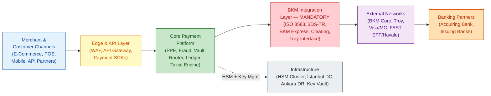
```mermaid
flowchart LR
    CHANNELS["Merchant &<br/>Customer Channels<br/>(E-Commerce, POS,<br/>Mobile, API Partners)"]

    EDGE["Edge & API Layer<br/>(WAF, API Gateway,<br/>Payment SDKs)"]

    CORE["Core Payment<br/>Platform<br/>(PPE, Fraud, Vault,<br/>Router, Ledger,<br/>Taksit Engine)"]

    BKM_LAYER["BKM Integration<br/>Layer — MANDATORY<br/>(ISO 8583, 3DS-TR,<br/>BKM Express, Clearing,<br/>Troy Interface)"]

    EXTERNAL["External Networks<br/>(BKM Core, Troy,<br/>Visa/MC, FAST,<br/>EFT/Havale)"]

    BANKS["Banking Partners<br/>(Acquiring Bank,<br/>Issuing Banks)"]

    INFRA["Infrastructure<br/>(HSM Cluster, İstanbul DC,<br/>Ankara DR, Key Vault)"]

    CHANNELS --> EDGE --> CORE --> BKM_LAYER --> EXTERNAL --> BANKS
    CORE -.->|HSM + Key Mgmt| INFRA

    style CHANNELS fill:#e3f2fd,stroke:#1565c0,color:#0d47a1
    style EDGE fill:#fff9c4,stroke:#f57f17,color:#e65100
    style CORE fill:#c8e6c9,stroke:#2e7d32,color:#1b5e20
    style BKM_LAYER fill:#ffcdd2,stroke:#c62828,color:#b71c1c
    style EXTERNAL fill:#f3e5f5,stroke:#6a1b9a,color:#4a148c
    style BANKS fill:#ffe0b2,stroke:#e65100,color:#bf360c
    style INFRA fill:#eceff1,stroke:#455a64,color:#263238
```

### Core Platform & Edge Layer (Detail)

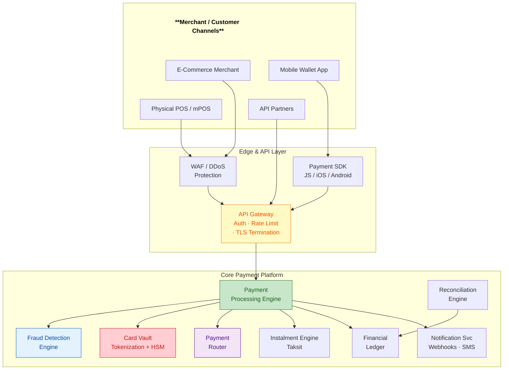
```mermaid
flowchart TB
    subgraph CHANNELS[" "]
        direction TB
        CH_TITLE["**Merchant / Customer Channels**"]
        ECOM[E-Commerce Merchant] ~~~ POS[Physical POS / mPOS]
        MOBILE[Mobile Wallet App] ~~~ API_P[API Partners]
        CH_TITLE ~~~ ECOM
    end

    subgraph EDGE["Edge & API Layer"]
        direction LR
        WAF[WAF / DDoS<br/>Protection]
        APIGW[API Gateway<br/>Auth · Rate Limit<br/>· TLS Termination]
        SDK[Payment SDK<br/>JS / iOS / Android]
    end

    subgraph CORE["Core Payment Platform"]
        PPE[Payment<br/>Processing Engine]
        FRAUD[Fraud Detection<br/>Engine]
        VAULT[Card Vault<br/>Tokenization + HSM]
        ROUTER[Payment<br/>Router]
        INST[Instalment Engine<br/>Taksit]
        LEDGER[Financial<br/>Ledger]
        NOTIF[Notification Svc<br/>Webhooks · SMS]
        RECON[Reconciliation<br/>Engine]
    end

    ECOM --> WAF
    POS --> WAF
    MOBILE --> SDK
    API_P --> APIGW
    WAF --> APIGW
    SDK --> APIGW

    APIGW --> PPE
    PPE --> FRAUD
    PPE --> VAULT
    PPE --> ROUTER
    PPE --> INST
    PPE --> LEDGER
    PPE --> NOTIF
    RECON --> LEDGER

    style CH_TITLE fill:none,stroke:none,color:#000000,font-weight:bold
    style APIGW fill:#fff9c4,stroke:#f57f17,color:#e65100
    style PPE fill:#c8e6c9,stroke:#2e7d32,color:#1b5e20
    style VAULT fill:#ffcdd2,stroke:#c62828,color:#b71c1c
    style FRAUD fill:#e3f2fd,stroke:#1565c0,color:#0d47a1
    style ROUTER fill:#f3e5f5,stroke:#6a1b9a,color:#4a148c
```

### BKM Integration & External Networks (Detail)

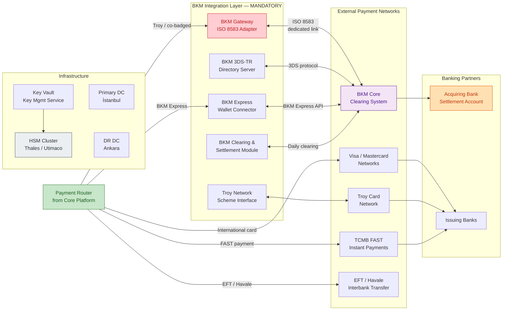
```mermaid
flowchart LR
    ROUTER[Payment Router<br/>from Core Platform]

    subgraph BKM_LAYER["BKM Integration Layer — MANDATORY"]
        BKM_GW[BKM Gateway<br/>ISO 8583 Adapter]
        BKM_3DS[BKM 3DS-TR<br/>Directory Server]
        BKM_EXP[BKM Express<br/>Wallet Connector]
        BKM_CLR[BKM Clearing &<br/>Settlement Module]
        TROY[Troy Network<br/>Scheme Interface]
    end

    subgraph EXTERNAL["External Payment Networks"]
        BKM_CORE[BKM Core<br/>Clearing System]
        TROY_NET[Troy Card<br/>Network]
        VISA_MC[Visa / Mastercard<br/>Networks]
        FAST_SYS[TCMB FAST<br/>Instant Payments]
        HAVALE[EFT / Havale<br/>Interbank Transfer]
    end

    subgraph BANKS["Banking Partners"]
        ACQ_BANK[Acquiring Bank<br/>Settlement Account]
        ISSUER[Issuing Banks]
    end

    subgraph INFRA["Infrastructure"]
        HSM[HSM Cluster<br/>Thales / Utimaco]
        DC1[Primary DC<br/>İstanbul]
        DC2[DR DC<br/>Ankara]
        KV[Key Vault<br/>Key Mgmt Service]
    end

    ROUTER -->|"Troy / co-badged"| BKM_GW
    ROUTER -->|"International card"| VISA_MC
    ROUTER -->|"BKM Express"| BKM_EXP
    ROUTER -->|"FAST payment"| FAST_SYS
    ROUTER -->|"EFT / Havale"| HAVALE

    BKM_GW <-->|"ISO 8583<br/>dedicated link"| BKM_CORE
    BKM_3DS <-->|"3DS protocol"| BKM_CORE
    BKM_EXP <-->|"BKM Express API"| BKM_CORE
    BKM_CLR <-->|"Daily clearing"| BKM_CORE
    TROY <--> TROY_NET

    BKM_CORE --> ACQ_BANK
    VISA_MC --> ISSUER
    TROY_NET --> ISSUER
    FAST_SYS --> ISSUER

    KV --> HSM
    DC1 ~~~ DC2

    style BKM_GW fill:#ffcdd2,stroke:#c62828,color:#b71c1c
    style BKM_CORE fill:#f3e5f5,stroke:#6a1b9a,color:#4a148c
    style ROUTER fill:#c8e6c9,stroke:#2e7d32,color:#1b5e20
    style ACQ_BANK fill:#ffe0b2,stroke:#e65100,color:#bf360c
    style HSM fill:#eceff1,stroke:#455a64,color:#263238
```

---

## BKM Integration Layer

The BKM Integration Layer is the most critical mandatory component. It encapsulates all protocols and interfaces required to comply with BKM's technical standards.

### Troy Domestic Card Network

**Troy** is Turkey's national card network, launched in 2016 and operated by BKM. Any acquiring PSP must support Troy card transactions end-to-end.

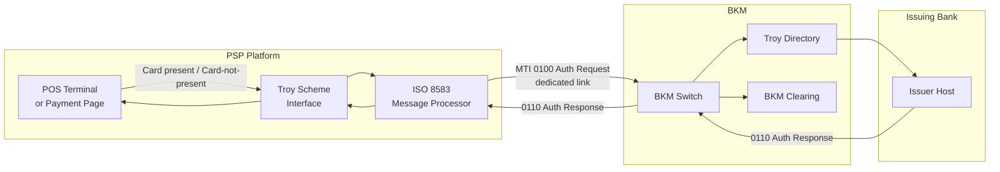
```mermaid
flowchart LR
    subgraph "PSP Platform"
        POS_TERM[POS Terminal<br/>or Payment Page]
        TROY_IF[Troy Scheme<br/>Interface]
        ISO_PROC[ISO 8583<br/>Message Processor]
    end

    subgraph "BKM"
        BKM_SW[BKM Switch]
        TROY_DIR[Troy Directory]
        BKM_CLR_S[BKM Clearing]
    end

    subgraph "Issuing Bank"
        ISS_HOST[Issuer Host]
    end

    POS_TERM -->|Card present / Card-not-present| TROY_IF
    TROY_IF --> ISO_PROC
    ISO_PROC -->|MTI 0100 Auth Request<br/>dedicated link| BKM_SW
    BKM_SW --> TROY_DIR
    TROY_DIR --> ISS_HOST
    ISS_HOST -->|0110 Auth Response| BKM_SW
    BKM_SW -->|0110 Auth Response| ISO_PROC
    ISO_PROC --> TROY_IF
    TROY_IF --> POS_TERM
    BKM_SW --> BKM_CLR_S
```

**Key technical requirements for Troy integration**:

| Requirement | Detail |
|-------------|--------|
| BIN ranges | Troy BINs starting with `9` (e.g., 9792xx); must be detected before routing |
| ISO 8583 version | BKM's extended ISO 8583:1993 with proprietary TLV extensions |
| Network connectivity | Dedicated leased line or MPLS-VPN to BKM; minimum 2 redundant links |
| Message authentication | MAC (Message Authentication Code) generated via HSM using BKM-provisioned keys |
| Authorisation timeout | 10 seconds maximum; automatic reversal on timeout |
| Co-badged card routing | Preference given to Troy for domestic transactions per regulation |

### BKM Express Digital Wallet

BKM Express is the Turkish national digital wallet, mandatory for e-commerce PSPs.

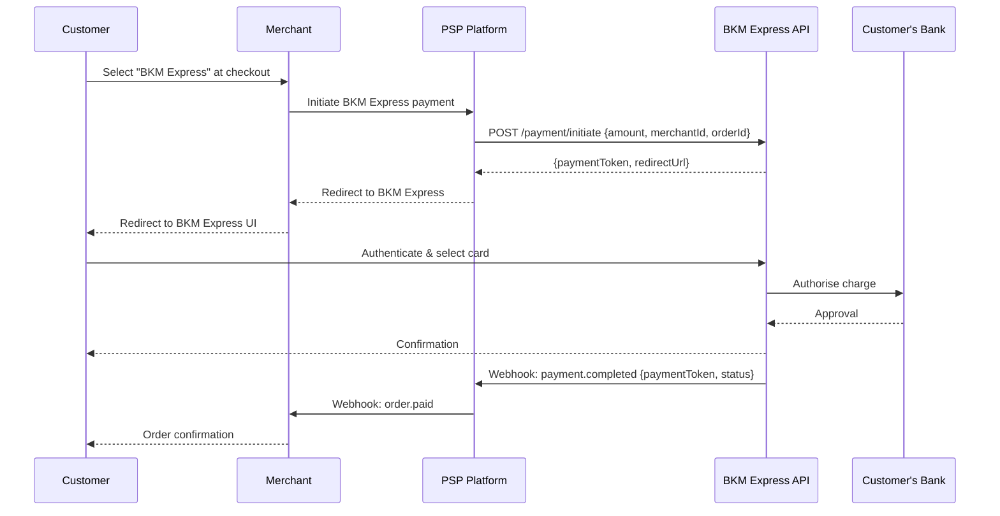
```mermaid
sequenceDiagram
    participant Customer
    participant Merchant
    participant PSP as PSP Platform
    participant BKM_EXP as BKM Express API
    participant Bank as Customer's Bank

    Customer->>Merchant: Select "BKM Express" at checkout
    Merchant->>PSP: Initiate BKM Express payment
    PSP->>BKM_EXP: POST /payment/initiate {amount, merchantId, orderId}
    BKM_EXP-->>PSP: {paymentToken, redirectUrl}
    PSP-->>Merchant: Redirect to BKM Express
    Merchant-->>Customer: Redirect to BKM Express UI
    Customer->>BKM_EXP: Authenticate & select card
    BKM_EXP->>Bank: Authorise charge
    Bank-->>BKM_EXP: Approval
    BKM_EXP-->>Customer: Confirmation
    BKM_EXP->>PSP: Webhook: payment.completed {paymentToken, status}
    PSP->>Merchant: Webhook: order.paid
    Merchant-->>Customer: Order confirmation
```

### 3D Secure via BKM (3DS-TR)

BKM operates the **3DS Directory Server** for all Turkish-issued cards. All card-not-present transactions processed by Turkish PSPs must pass through BKM's 3DS-TR infrastructure.

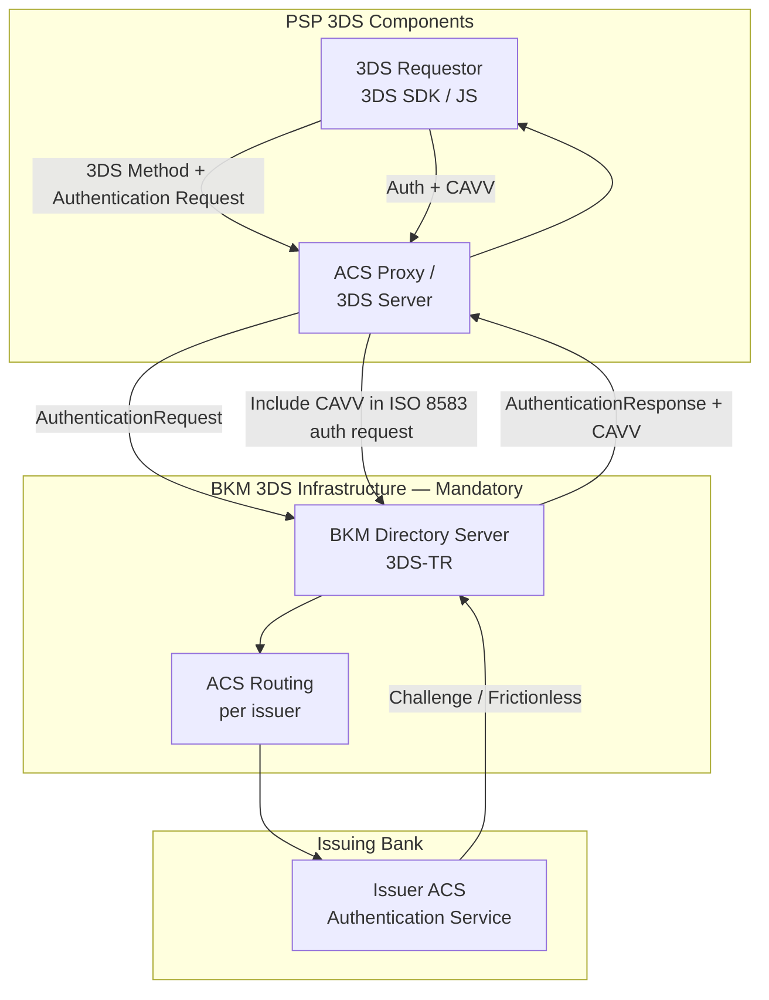
```mermaid
flowchart TB
    subgraph "PSP 3DS Components"
        TRES[3DS Requestor<br/>3DS SDK / JS]
        ACS_PROXY[ACS Proxy /<br/>3DS Server]
    end

    subgraph "BKM 3DS Infrastructure — Mandatory"
        BKM_DS[BKM Directory Server<br/>3DS-TR]
        BKM_ACS_ROUTING[ACS Routing<br/>per issuer]
    end

    subgraph "Issuing Bank"
        ISSUER_ACS[Issuer ACS<br/>Authentication Service]
    end

    TRES -->|3DS Method + Authentication Request| ACS_PROXY
    ACS_PROXY -->|AuthenticationRequest| BKM_DS
    BKM_DS --> BKM_ACS_ROUTING
    BKM_ACS_ROUTING --> ISSUER_ACS
    ISSUER_ACS -->|Challenge / Frictionless| BKM_DS
    BKM_DS -->|AuthenticationResponse + CAVV| ACS_PROXY
    ACS_PROXY --> TRES
    TRES -->|Auth + CAVV| ACS_PROXY
    ACS_PROXY -->|Include CAVV in ISO 8583 auth request| BKM_DS
```

**3DS-TR specifics**:
- BKM's DS supports both **3DS 1.0** (legacy) and **3DS 2.x** (EMV 3DS)
- PSPs must register their merchant categories and domains with BKM's DS
- CAVV (Cardholder Authentication Verification Value) must be included in the ISO 8583 authorisation request forwarded to BKM

### BKM Clearing & Settlement

BKM acts as the central clearing house for all domestic card transactions. The clearing cycle is shown in two diagrams: (1) file submission & netting, and (2) settlement execution.

#### Clearing: File Submission & Netting

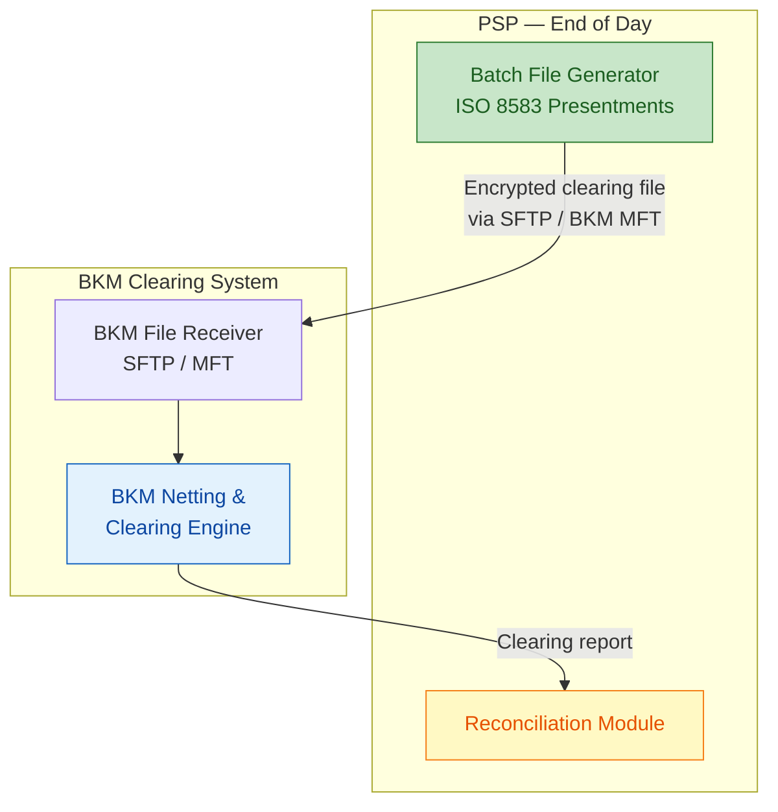
```mermaid
flowchart TB
    subgraph PSP["PSP — End of Day"]
        BATCH[Batch File Generator<br/>ISO 8583 Presentments]
        RECON_MOD[Reconciliation Module]
    end

    subgraph BKM_SYS["BKM Clearing System"]
        BKM_CLR_R[BKM File Receiver<br/>SFTP / MFT]
        BKM_NET[BKM Netting &<br/>Clearing Engine]
    end

    BATCH -->|"Encrypted clearing file<br/>via SFTP / BKM MFT"| BKM_CLR_R
    BKM_CLR_R --> BKM_NET
    BKM_NET -->|"Clearing report"| RECON_MOD

    style BATCH fill:#c8e6c9,stroke:#2e7d32,color:#1b5e20
    style BKM_NET fill:#e3f2fd,stroke:#1565c0,color:#0d47a1
    style RECON_MOD fill:#fff9c4,stroke:#f57f17,color:#e65100
```

#### Settlement: BKM → TCMB → Banks

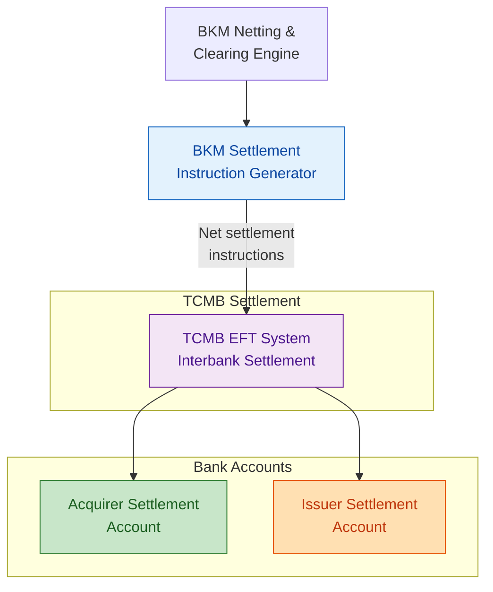
```mermaid
flowchart TB
    BKM_NET[BKM Netting &<br/>Clearing Engine]
    BKM_SETTLE[BKM Settlement<br/>Instruction Generator]

    subgraph SETTLEMENT["TCMB Settlement"]
        TCMB_EFT[TCMB EFT System<br/>Interbank Settlement]
    end

    subgraph ACCOUNTS["Bank Accounts"]
        ACQ_BANK_ACC[Acquirer Settlement<br/>Account]
        ISS_BANK_ACC[Issuer Settlement<br/>Account]
    end

    BKM_NET --> BKM_SETTLE
    BKM_SETTLE -->|"Net settlement<br/>instructions"| TCMB_EFT
    TCMB_EFT --> ACQ_BANK_ACC
    TCMB_EFT --> ISS_BANK_ACC

    style BKM_SETTLE fill:#e3f2fd,stroke:#1565c0,color:#0d47a1
    style TCMB_EFT fill:#f3e5f5,stroke:#6a1b9a,color:#4a148c
    style ACQ_BANK_ACC fill:#c8e6c9,stroke:#2e7d32,color:#1b5e20
    style ISS_BANK_ACC fill:#ffe0b2,stroke:#e65100,color:#bf360c
```

**Clearing schedule**:

| Cycle | Time (Turkey local) | Content |
|-------|---------------------|---------|
| T+0 Intraday | 09:00, 13:00, 17:00 | Partial clearing files |
| T+0 Final | 23:00 | Complete day's transactions |
| T+1 Settlement | 08:00 next day | Net settlement via TCMB EFT |

---

## Core Platform Components

### API Gateway

The API Gateway is the single entry point for all merchant and partner integrations.

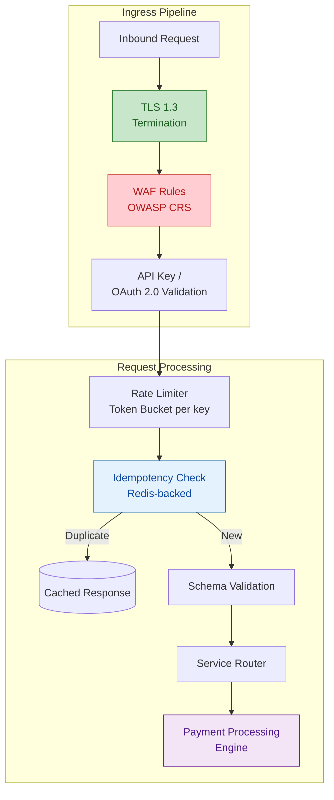
```mermaid
flowchart TB
    subgraph INGRESS["Ingress Pipeline"]
        direction LR
        REQ[Inbound Request] --> TLS[TLS 1.3<br/>Termination]
        TLS --> WAF_CHK[WAF Rules<br/>OWASP CRS]
        WAF_CHK --> AUTH_CHK[API Key /<br/>OAuth 2.0 Validation]
    end

    subgraph PROCESSING["Request Processing"]
        direction LR
        RATE[Rate Limiter<br/>Token Bucket per key] --> IDEM[Idempotency Check<br/>Redis-backed]
        IDEM -->|Duplicate| CACHED[(Cached Response)]
        IDEM -->|New| VALID[Schema Validation]
        VALID --> ROUTE[Service Router]
        ROUTE --> PPE_SVC[Payment Processing<br/>Engine]
    end

    AUTH_CHK --> RATE

    style TLS fill:#c8e6c9,stroke:#2e7d32,color:#1b5e20
    style WAF_CHK fill:#ffcdd2,stroke:#c62828,color:#b71c1c
    style IDEM fill:#e3f2fd,stroke:#1565c0,color:#0d47a1
    style PPE_SVC fill:#f3e5f5,stroke:#6a1b9a,color:#4a148c
```

**Key responsibilities**:
- **Authentication**: API key (HMAC-signed) for server-to-server; OAuth 2.0 for partner integrations
- **Idempotency**: All mutating requests accept an `X-Idempotency-Key` header; Redis-backed deduplication with 24-hour TTL
- **Rate limiting**: Token-bucket per merchant API key; separate limits for authorisation vs. reporting endpoints
- **TLS 1.3 only**: Older TLS versions disabled; certificate pinning for POS terminal connections

### Payment Processing Engine

The PPE orchestrates the full payment lifecycle as an explicit state machine:

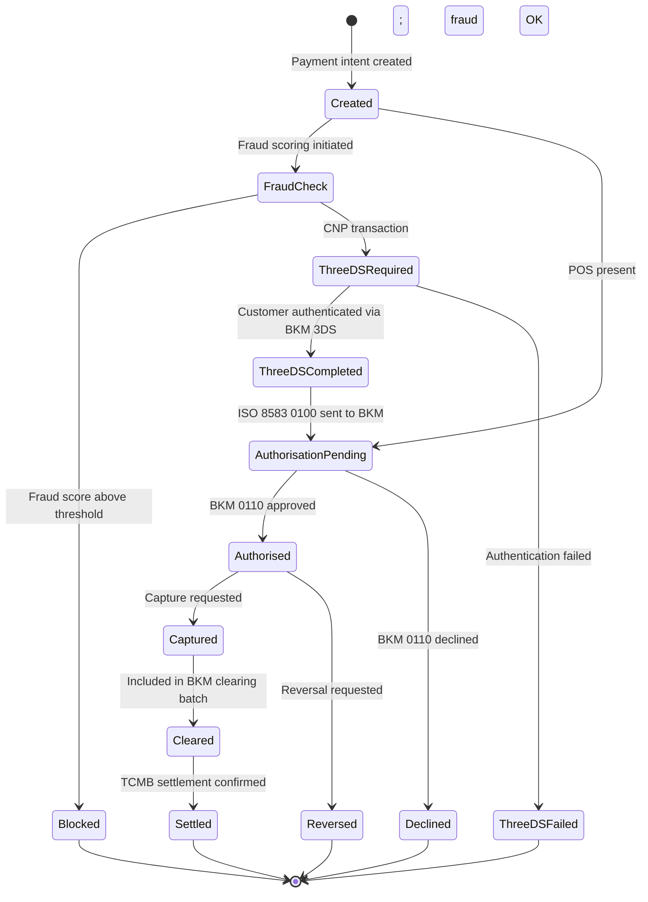
```mermaid
stateDiagram-v2
    [*] --> Created: Payment intent created
    Created --> FraudCheck: Fraud scoring initiated
    FraudCheck --> Blocked: Fraud score above threshold
    FraudCheck --> ThreeDSRequired: CNP transaction
    ThreeDSRequired --> ThreeDSCompleted: Customer authenticated via BKM 3DS
    ThreeDSRequired --> ThreeDSFailed: Authentication failed
    ThreeDSCompleted --> AuthorisationPending: ISO 8583 0100 sent to BKM
    Created --> AuthorisationPending: POS present; fraud OK
    AuthorisationPending --> Authorised: BKM 0110 approved
    AuthorisationPending --> Declined: BKM 0110 declined
    Authorised --> Captured: Capture requested
    Authorised --> Reversed: Reversal requested
    Captured --> Cleared: Included in BKM clearing batch
    Cleared --> Settled: TCMB settlement confirmed
    Settled --> [*]
    Reversed --> [*]
    Blocked --> [*]
    ThreeDSFailed --> [*]
    Declined --> [*]
```

### Fraud Detection Engine

Real-time scoring must occur **before** the BKM authorisation request is sent to avoid unnecessary network usage and potential fraud losses.

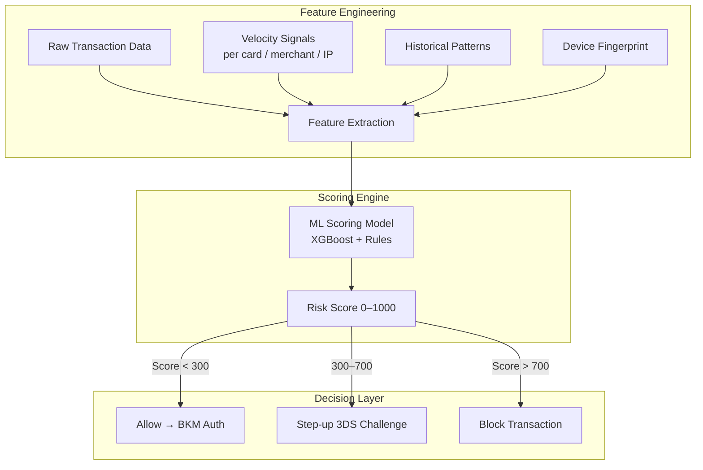
```mermaid
flowchart TB
    subgraph "Feature Engineering"
        RAW[Raw Transaction Data] --> FE[Feature Extraction]
        VEL[Velocity Signals<br/>per card / merchant / IP] --> FE
        HIST[Historical Patterns] --> FE
        DEVICE[Device Fingerprint] --> FE
    end

    subgraph "Scoring Engine"
        FE --> ML[ML Scoring Model<br/>XGBoost + Rules]
        ML --> SCORE[Risk Score 0–1000]
    end

    subgraph "Decision Layer"
        SCORE -->|Score < 300| ALLOW[Allow → BKM Auth]
        SCORE -->|300–700| REVIEW[Step-up 3DS Challenge]
        SCORE -->|Score > 700| BLOCK[Block Transaction]
    end
```

### Card Vault & Tokenization

All Primary Account Numbers (PANs) are stored exclusively in the Card Vault, never in the main application database. This is required for PCI DSS compliance.

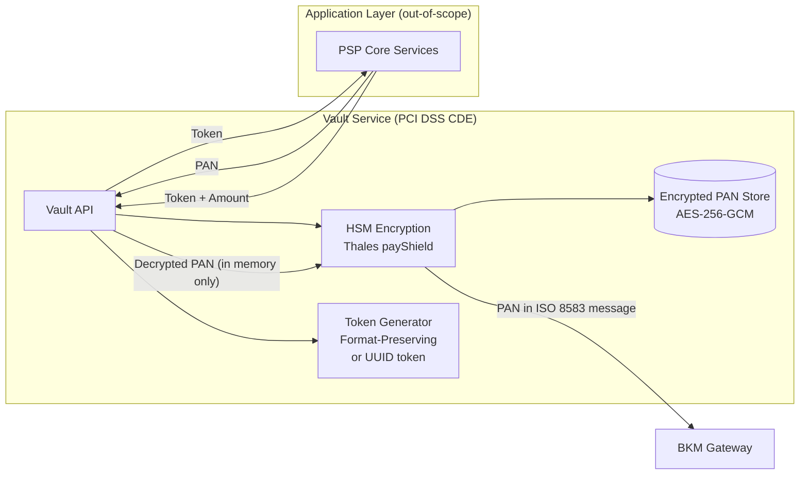
```mermaid
flowchart LR
    subgraph "Vault Service (PCI DSS CDE)"
        VAULT_API[Vault API] --> HSM_ENC[HSM Encryption<br/>Thales payShield]
        HSM_ENC --> VAULT_DB[(Encrypted PAN Store<br/>AES-256-GCM)]
        VAULT_API --> TKNZ[Token Generator<br/>Format-Preserving<br/>or UUID token]
    end

    subgraph "Application Layer (out-of-scope)"
        APP[PSP Core Services]
    end

    APP -->|PAN| VAULT_API
    VAULT_API -->|Token| APP
    APP -->|Token + Amount| VAULT_API
    VAULT_API -->|"Decrypted PAN (in memory only)"| HSM_ENC
    HSM_ENC -->|PAN in ISO 8583 message| BKM_GW_REF[BKM Gateway]
```

**Tokenization scheme**:

| Token Type | Use Case | Format |
|------------|----------|--------|
| Network Token (BKM/Visa/MC) | Recurring, subscription | 16-digit, scheme-issued |
| PSP Internal Token | Stored cards, one-click | UUID v4, opaque |
| Format-Preserving Token | POS display (last 4 digits) | 16-digit, Luhn-valid |

### Financial Ledger

Double-entry accounting ledger supporting multi-currency and instalment (taksit) operations:

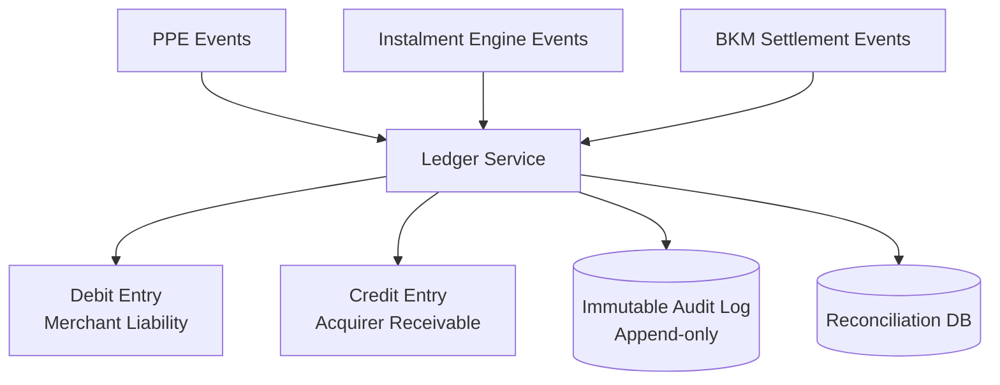
```mermaid
flowchart TB
    PPE_EV[PPE Events] --> LEDGER_SVC[Ledger Service]
    LEDGER_SVC --> DEBIT[Debit Entry<br/>Merchant Liability]
    LEDGER_SVC --> CREDIT[Credit Entry<br/>Acquirer Receivable]
    INST_EV[Instalment Engine Events] --> LEDGER_SVC
    BKM_SETTLE_EV[BKM Settlement Events] --> LEDGER_SVC
    LEDGER_SVC --> AUDIT_LOG[(Immutable Audit Log<br/>Append-only)]
    LEDGER_SVC --> RECON_DB[(Reconciliation DB)]
```

---

## Payment Processing Flows

### Troy Card Payment Flow

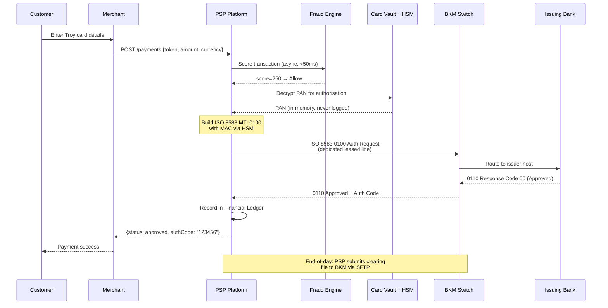
```mermaid
sequenceDiagram
    participant C as Customer
    participant M as Merchant
    participant PSP as PSP Platform
    participant FRAUD as Fraud Engine
    participant VAULT as Card Vault + HSM
    participant BKM as BKM Switch
    participant ISSUER as Issuing Bank

    C->>M: Enter Troy card details
    M->>PSP: POST /payments {token, amount, currency}
    PSP->>FRAUD: Score transaction (async, <50ms)
    FRAUD-->>PSP: score=250 → Allow
    PSP->>VAULT: Decrypt PAN for authorisation
    VAULT-->>PSP: PAN (in-memory, never logged)
    Note over PSP: Build ISO 8583 MTI 0100<br/>with MAC via HSM
    PSP->>BKM: ISO 8583 0100 Auth Request<br/>(dedicated leased line)
    BKM->>ISSUER: Route to issuer host
    ISSUER-->>BKM: 0110 Response Code 00 (Approved)
    BKM-->>PSP: 0110 Approved + Auth Code
    PSP->>PSP: Record in Financial Ledger
    PSP-->>M: {status: approved, authCode: "123456"}
    M-->>C: Payment success
    Note over PSP,BKM: End-of-day: PSP submits clearing<br/>file to BKM via SFTP
```

### International Card Payment Flow (Visa/Mastercard)

For international cards, BKM is **not** in the direct authorisation path, but co-badged cards (Troy + Visa/MC) must prefer Troy domestically per regulation.

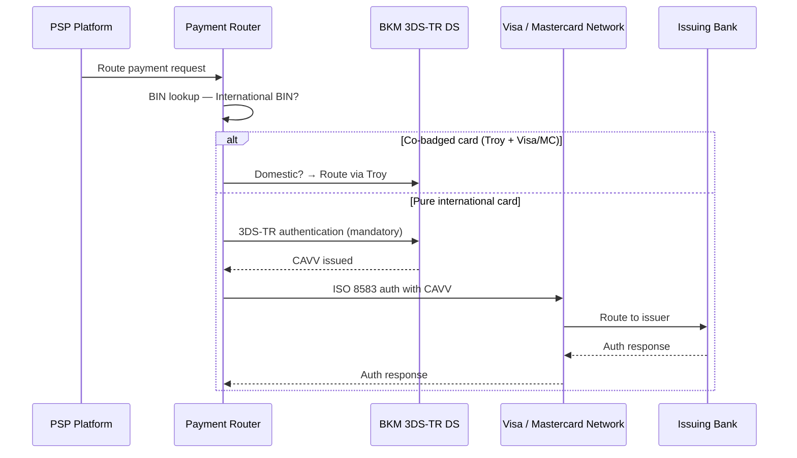
```mermaid
sequenceDiagram
    participant PSP as PSP Platform
    participant ROUTER as Payment Router
    participant BKM as BKM 3DS-TR DS
    participant VISA as Visa / Mastercard Network
    participant ISSUER as Issuing Bank

    PSP->>ROUTER: Route payment request
    ROUTER->>ROUTER: BIN lookup — International BIN?
    alt Co-badged card (Troy + Visa/MC)
        ROUTER->>BKM: Domestic? → Route via Troy
    else Pure international card
        ROUTER->>BKM: 3DS-TR authentication (mandatory)
        BKM-->>ROUTER: CAVV issued
        ROUTER->>VISA: ISO 8583 auth with CAVV
        VISA->>ISSUER: Route to issuer
        ISSUER-->>VISA: Auth response
        VISA-->>ROUTER: Auth response
    end
```

### FAST (Instant Payment) Flow

TCMB's FAST system (Fonların Anlık ve Sürekli Transferi) enables 7/24 instant money transfers. PSPs must integrate for account-to-account payment acceptance.

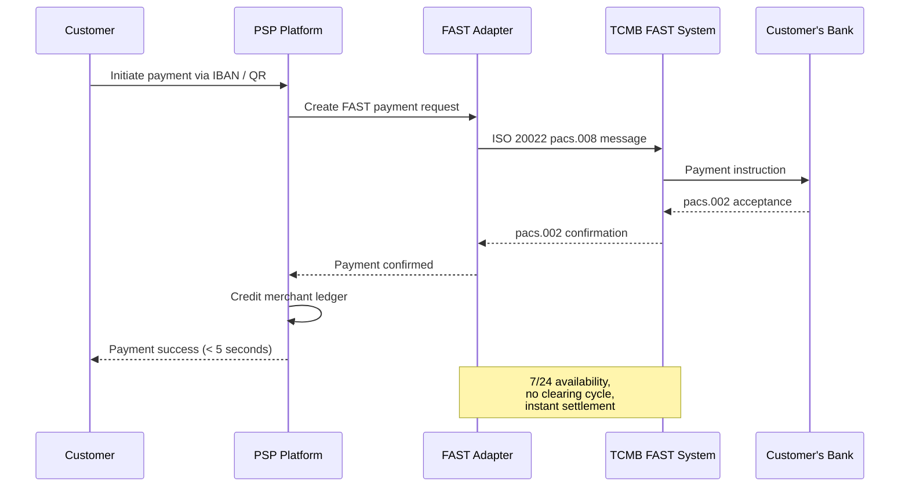
```mermaid
sequenceDiagram
    participant Customer
    participant PSP as PSP Platform
    participant FAST_ADAPTER as FAST Adapter
    participant TCMB_FAST as TCMB FAST System
    participant CUST_BANK as Customer's Bank

    Customer->>PSP: Initiate payment via IBAN / QR
    PSP->>FAST_ADAPTER: Create FAST payment request
    FAST_ADAPTER->>TCMB_FAST: ISO 20022 pacs.008 message
    TCMB_FAST->>CUST_BANK: Payment instruction
    CUST_BANK-->>TCMB_FAST: pacs.002 acceptance
    TCMB_FAST-->>FAST_ADAPTER: pacs.002 confirmation
    FAST_ADAPTER-->>PSP: Payment confirmed
    PSP->>PSP: Credit merchant ledger
    PSP-->>Customer: Payment success (< 5 seconds)
    Note over FAST_ADAPTER,TCMB_FAST: 7/24 availability,<br/>no clearing cycle,<br/>instant settlement
```

### BKM Express Payment Flow

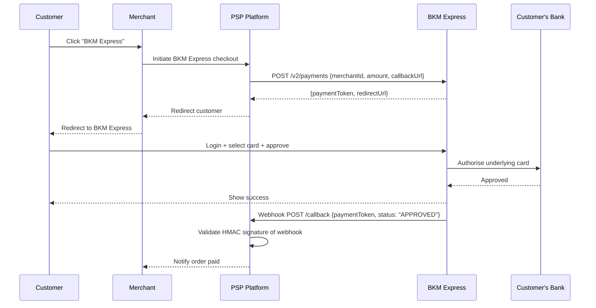
```mermaid
sequenceDiagram
    participant C as Customer
    participant M as Merchant
    participant PSP as PSP Platform
    participant BKME as BKM Express
    participant ISSUER as Customer's Bank

    C->>M: Click "BKM Express"
    M->>PSP: Initiate BKM Express checkout
    PSP->>BKME: POST /v2/payments {merchantId, amount, callbackUrl}
    BKME-->>PSP: {paymentToken, redirectUrl}
    PSP-->>M: Redirect customer
    M-->>C: Redirect to BKM Express
    C->>BKME: Login + select card + approve
    BKME->>ISSUER: Authorise underlying card
    ISSUER-->>BKME: Approved
    BKME-->>C: Show success
    BKME->>PSP: Webhook POST /callback {paymentToken, status: "APPROVED"}
    PSP->>PSP: Validate HMAC signature of webhook
    PSP-->>M: Notify order paid
```

---

## Critical Path — Customer Payment Confirmation

This section isolates the **exact set of operations that must complete synchronously** before the customer sees "Ödeme Onaylandı" (Payment Confirmed) — versus the work that happens asynchronously after confirmation.

> **Key principle**: The customer is blocked only by what is strictly necessary to guarantee a confirmed card payment. Everything else (clearing, settlement, instalment scheduling, reconciliation) is deferred.

### Synchronous Critical Path (blocks the customer)

Every step below **must succeed in sequence** before the HTTP response `status: approved` is returned to the merchant:

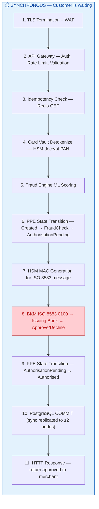
```mermaid
flowchart TD
    subgraph SYNC["⏱️ SYNCHRONOUS — Customer is waiting"]
        direction TB
        S1["1. TLS Termination + WAF"]
        S2["2. API Gateway — Auth, Rate Limit, Validation"]
        S3["3. Idempotency Check — Redis GET"]
        S4["4. Card Vault Detokenize — HSM decrypt PAN"]
        S5["5. Fraud Engine ML Scoring"]
        S6["6. PPE State Transition — Created → FraudCheck → AuthorisationPending"]
        S7["7. HSM MAC Generation for ISO 8583 message"]
        S8["8. BKM ISO 8583 0100 → Issuing Bank → Approve/Decline"]
        S9["9. PPE State Transition — AuthorisationPending → Authorised"]
        S10["10. PostgreSQL COMMIT (sync replicated to ≥2 nodes)"]
        S11["11. HTTP Response — return approved to merchant"]

        S1 --> S2 --> S3 --> S4 --> S5 --> S6 --> S7 --> S8 --> S9 --> S10 --> S11
    end

    style SYNC fill:#e3f2fd,stroke:#1565c0,color:#0d47a1
    style S8 fill:#ffcdd2,stroke:#c62828,color:#b71c1c
```

| Step | What happens | Why synchronous | Latency |
|------|-------------|-----------------|---------|
| 1 | TLS 1.3 handshake, WAF/DDoS inspection | Security gate | ~2 ms |
| 2 | Validate API key (HMAC), rate limits, schema validation | Reject bad requests early | ~3 ms |
| 3 | Check `X-Idempotency-Key` in Redis | Prevent duplicate charges | < 1 ms |
| 4 | Decrypt PAN from vault via HSM | Need actual PAN for ISO 8583 message | ~5 ms |
| 5 | Score transaction for fraud risk (XGBoost + rules) | Must block fraud before BKM auth | ~8 ms |
| 6 | Lock PaymentIntent row, advance state | Prevent concurrent duplicate processing | ~2 ms |
| 7 | Generate MAC via HSM for BKM message authentication | BKM requires MAC on every 0100 message | ~3 ms |
| 8 | **Send ISO 8583 0100 to BKM → BKM routes to issuer → issuer responds** | **Payment is not confirmed until issuer says Approved** | **~150–400 ms** |
| 9 | Transition state to `Authorised` | Record the approval | < 1 ms |
| 10 | COMMIT to PostgreSQL (sync to ≥2 nodes) | **This IS the durable financial record** | ~5 ms |
| 11 | Return HTTP 200 with auth code | Merchant shows "Payment Confirmed" | ~1 ms |

**Total time customer waits**: ~180–430 ms (dominated by step 8 — BKM leased-line round-trip)

### Asynchronous Post-Confirmation Work

These operations happen **after** the customer already sees "Ödeme Onaylandı". Failures here do **not** affect the payment outcome:

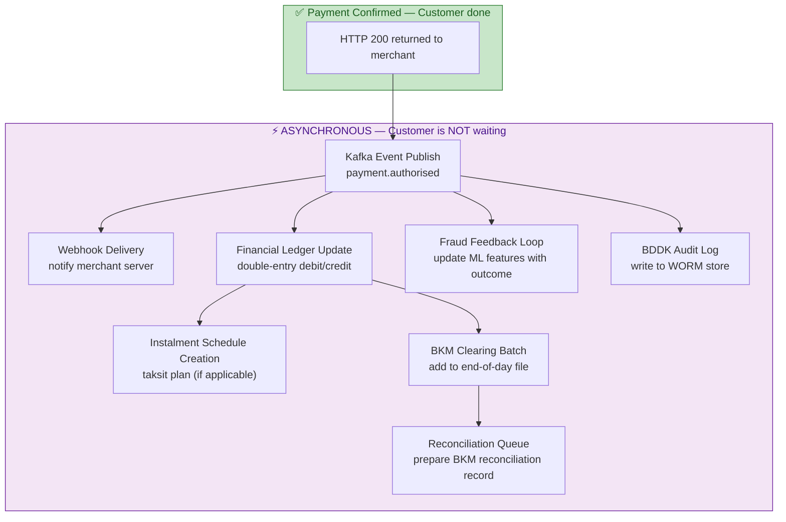
```mermaid
flowchart TD
    subgraph TRIGGER["✅ Payment Confirmed — Customer done"]
        CONFIRMED["HTTP 200 returned to merchant"]
    end

    subgraph ASYNC["⚡ ASYNCHRONOUS — Customer is NOT waiting"]
        direction TB
        A1["Kafka Event Publish<br/>payment.authorised"]
        A2["Webhook Delivery<br/>notify merchant server"]
        A3["Financial Ledger Update<br/>double-entry debit/credit"]
        A4["Fraud Feedback Loop<br/>update ML features with outcome"]
        A5["Instalment Schedule Creation<br/>taksit plan (if applicable)"]
        A6["BKM Clearing Batch<br/>add to end-of-day file"]
        A7["Reconciliation Queue<br/>prepare BKM reconciliation record"]
        A8["BDDK Audit Log<br/>write to WORM store"]
    end

    CONFIRMED --> A1
    A1 --> A2
    A1 --> A3
    A1 --> A4
    A3 --> A5
    A3 --> A6
    A6 --> A7
    A1 --> A8

    style TRIGGER fill:#c8e6c9,stroke:#2e7d32,color:#1b5e20
    style ASYNC fill:#f3e5f5,stroke:#6a1b9a,color:#4a148c
```

| Async Operation | Trigger | Failure Impact | Recovery |
|----------------|---------|----------------|----------|
| **Kafka event publish** | After COMMIT | Internal consumers not notified in real-time | Producer retries; durable once acked |
| **Webhook delivery** | Kafka consumer | Merchant doesn't get real-time notification | Exponential backoff (3 days); merchant polls API |
| **Financial Ledger update** | Kafka consumer | Accounting view temporarily inconsistent | Idempotent consumer replays; `ON CONFLICT DO NOTHING` |
| **Fraud feedback** | Kafka consumer | ML model doesn't learn from this outcome | Batch reprocessing; non-critical |
| **Instalment schedule** | Ledger update | Taksit plan not created yet | Atomic retry from `Authorised` state (see Corner Case #7) |
| **BKM clearing batch** | End-of-day job | Transaction not in today's clearing file | Included in next cycle; BDDK alert if missed entirely |
| **Reconciliation queue** | Clearing batch generated | Daily recon incomplete | Regenerated from Kafka event log |
| **BDDK audit log** | Kafka consumer | Audit gap (regulatory risk) | WORM writer retries; P1 alert on failure |

> **PostgreSQL vs. Financial Ledger**: The PaymentIntent record in PostgreSQL (step 10) is the **source of truth**. The Financial Ledger is a derived double-entry accounting view. For detailed analysis of ledger placement, communication patterns, and trade-offs, see [§15 Financial Ledger Architecture](#financial-ledger-architecture).

### What the customer experiences

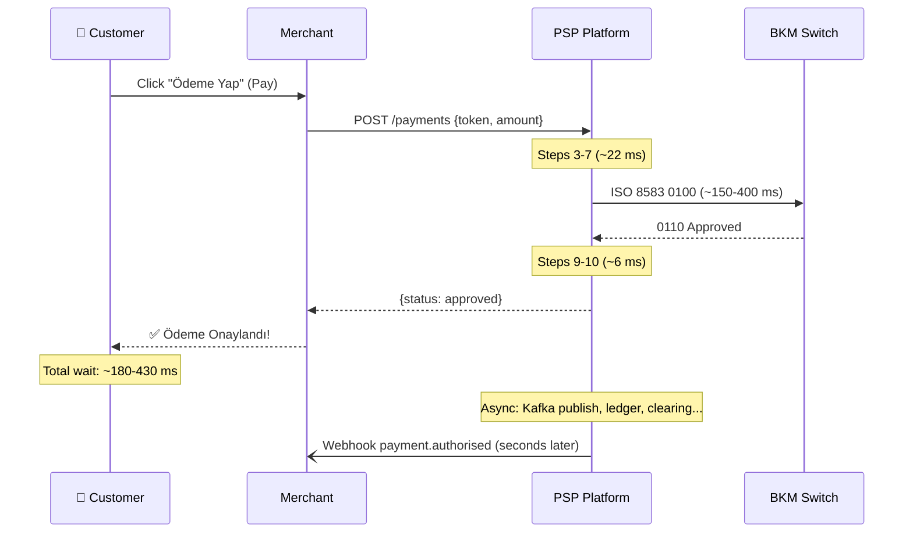
```mermaid
sequenceDiagram
    participant Customer as 🛒 Customer
    participant Merchant as Merchant
    participant PSP as PSP Platform
    participant BKM as BKM Switch

    Customer->>Merchant: Click "Ödeme Yap" (Pay)
    Merchant->>PSP: POST /payments {token, amount}
    Note over PSP: Steps 3-7 (~22 ms)
    PSP->>BKM: ISO 8583 0100 (~150-400 ms)
    BKM-->>PSP: 0110 Approved
    Note over PSP: Steps 9-10 (~6 ms)
    PSP-->>Merchant: {status: approved}
    Merchant-->>Customer: ✅ Ödeme Onaylandı!
    Note over Customer: Total wait: ~180-430 ms
    Note over PSP: Async: Kafka publish, ledger, clearing...
    PSP-)Merchant: Webhook payment.authorised (seconds later)
```

---

## Local Payment Methods Support

| Payment Method | Operator | Integration | Settlement |
|---------------|----------|-------------|------------|
| **Troy Card** | BKM | ISO 8583 direct to BKM | T+1 via BKM |
| **BKM Express** | BKM | BKM Express REST API | T+1 via BKM |
| **Visa / Mastercard** | Visa / MC | Via acquiring bank + BKM 3DS | T+1 via acquiring bank |
| **FAST (7/24 instant)** | TCMB | ISO 20022 via FAST adapter | Instant |
| **EFT / Havale** | TCMB | EFT rails (business hours) | T+0 / T+1 |
| **Taksit (instalment)** | PSP + Banks | Card payment + instalment plan DB | Monthly splits |
| **QR Payment (Karekod)** | TCMB | TCMB QR standard (TR QR) | FAST-backed |

---

## Compliance Architecture

### PCI DSS Requirements

The Cardholder Data Environment (CDE) is strictly segmented:

```mermaid
flowchart TB
    subgraph "Out of PCI DSS Scope"
        APP_SERVERS[Application Servers]
        MERCH_PORTAL[Merchant Portal]
        REPORTING[Reporting Services]
    end

    subgraph "PCI DSS CDE — Strictly Controlled"
        VAULT_SVC[Card Vault Service]
        HSM_NODES[HSM Cluster]
        BKM_CONN[BKM ISO 8583<br/>Connector]
        PAN_DB[(Encrypted PAN Store)]
    end

    APP_SERVERS -->|Token only — never PAN| VAULT_SVC
    VAULT_SVC <--> HSM_NODES
    VAULT_SVC --> PAN_DB
    VAULT_SVC --> BKM_CONN
    BKM_CONN -->|PAN in transit — encrypted| BKM_SWITCH[BKM Switch]
```

**PCI DSS controls checklist**:

| Control Area | Implementation |
|-------------|----------------|
| Network segmentation | VLAN + firewall rules; CDE on isolated network segment |
| Encryption at rest | AES-256-GCM; keys in HSM |
| Encryption in transit | TLS 1.3 for APIs; encrypted ISO 8583 for BKM link |
| Key management | HSM-based; dual-control key ceremony; annual rotation |
| Access control | Role-based; MFA for all CDE access |
| Logging & monitoring | All CDE access logged; SIEM alerts for anomalies |
| Vulnerability management | Quarterly ASV scans; annual penetration test |
| Incident response | Documented IR plan; 24-hour breach notification |

### KVKK (Turkish GDPR) Compliance

Turkey's **Kişisel Verilerin Korunması Kanunu** (Law No. 6698) imposes data residency and consent requirements:

| Requirement | Implementation |
|-------------|----------------|
| Data residency | All PII (name, IBAN, card details) stored in Turkey-domiciled data centers |
| Explicit consent | Consent recorded at onboarding; stored in Consent Management DB |
| Data minimization | Only collect data fields required for payment processing |
| Right to erasure | Soft-delete with legal hold override for financial records |
| Cross-border transfer | Prohibited without KVK Board approval or adequacy decision |
| Data breach notification | 72-hour notification to KVK Authority |

### BDDK & TCMB Regulatory Obligations

| Obligation | Responsible Body | Implementation |
|------------|-----------------|----------------|
| Payment institution license (Law 6493) | TCMB | Maintain license; report suspicious transactions |
| Capital adequacy | BDDK | Ring-fenced capital in settlement account |
| Transaction reporting | TCMB | Daily transaction reports via TCMB's reporting portal |
| AML / KYC | MASAK (Financial Intelligence Unit) | KYC at merchant onboarding; transaction monitoring |
| Operational resilience | BDDK / TCMB | RTO < 4h; RPO < 1h; annual DR test required |

---

## Security Architecture

### HSM Integration

Hardware Security Modules are mandatory for PIN processing, MAC generation, and key storage per both PCI DSS and BKM requirements.

```mermaid
flowchart TB
    subgraph CALLERS["Calling Services"]
        direction LR
        PPE[Payment Engine]
        VAULT_SVC[Card Vault]
        BKM_CONN[BKM Connector]
    end

    subgraph OPERATIONS["HSM Operations"]
        direction LR
        PIN_ENC[PIN Encrypt/Decrypt<br/>ISO 9564]
        MAC_GEN[MAC Generation<br/>ISO 8583]
        PAN_ENC[PAN Encryption<br/>AES-256]
        KEY_MGT[Key Management<br/>LMK / ZMK / ZPK]
    end

    subgraph FARM["HSM Farm (Active-Active)"]
        direction LR
        HSM1[HSM Node 1<br/>Thales payShield 10K]
        HSM2[HSM Node 2<br/>Thales payShield 10K]
    end

    PPE --> MAC_GEN
    VAULT_SVC --> PAN_ENC
    BKM_CONN --> PIN_ENC
    PPE --> KEY_MGT

    OPERATIONS --> FARM

    style HSM1 fill:#ffcdd2,stroke:#c62828,color:#b71c1c
    style HSM2 fill:#ffcdd2,stroke:#c62828,color:#b71c1c
    style MAC_GEN fill:#e3f2fd,stroke:#1565c0,color:#0d47a1
    style PAN_ENC fill:#e3f2fd,stroke:#1565c0,color:#0d47a1
```

**Key hierarchy**:

```
Local Master Key (LMK) — stored in HSM hardware; never leaves device
  └── Zone Master Key (ZMK) — exchanged with BKM under dual-control ceremony
        └── Zone PIN Key (ZPK) — encrypts PINs in transit
        └── Zone MAC Key (ZMK) — authenticates ISO 8583 messages
        └── Zone Encryption Key (ZEK) — encrypts sensitive data fields
```

### Network Security Zones

```mermaid
flowchart TB
    INTERNET[Internet / Merchant Traffic] -->|TLS 1.3| DMZ

    subgraph DMZ["DMZ (De-Militarized Zone)"]
        WAF_FW[WAF + Firewall<br/>F5 / Cloudflare]
        APIGW_NODE[API Gateway Nodes]
    end

    DMZ -->|Restricted ports only| APP_ZONE

    subgraph APP_ZONE["Application Zone"]
        PPE_NODES[PPE Cluster]
        FRAUD_NODES[Fraud Engine]
        NOTIF_NODES[Notification Service]
    end

    APP_ZONE -->|Vault API only| CDE_ZONE

    subgraph CDE_ZONE["CDE Zone (PCI DSS Scope)"]
        VAULT_NODES[Card Vault]
        HSM_CLUSTER[HSM Cluster]
        BKM_CONN_NODES[BKM ISO 8583 Connector]
    end

    CDE_ZONE -->|Dedicated leased line / MPLS-VPN| BKM_NETWORK[BKM Network]

    subgraph DATA_ZONE["Data Zone"]
        DB_CLUSTER[(Primary DB Cluster<br/>PostgreSQL)]
        REDIS_CLUSTER[(Redis Cluster<br/>Idempotency + Sessions)]
        LEDGER_DB[(Financial Ledger DB)]
    end

    APP_ZONE --> DATA_ZONE
```

---

## Data Residency & Sovereignty

A critical architectural constraint: **all data containing PII or cardholder data must remain in Turkey**.

| Data Category | Storage Location | Justification |
|--------------|-----------------|---------------|
| Cardholder data (PAN, CVV) | Turkey DC — encrypted in HSM-backed vault | PCI DSS + KVKK |
| Transaction records | Turkey DC — primary + DR | KVKK data residency |
| Merchant PII | Turkey DC | KVKK |
| Audit logs | Turkey DC — immutable | BDDK audit requirements |
| Fraud model training data | Turkey DC | KVKK — PII in features |
| Anonymized analytics | May be processed offshore if PII-stripped | KVKK exemption |

**Active-Active dual data center setup** (both centers in Turkey):

```mermaid
flowchart TB
    subgraph ISTANBUL["Istanbul DC (Primary)"]
        API_IST[API Gateway]
        PPE_IST[Payment Processing]
        VAULT_IST[Card Vault + HSM]
        DB_IST[(Primary DB)]
    end

    subgraph ANKARA["Ankara DC (DR / Active-Standby)"]
        API_ANK[API Gateway]
        PPE_ANK[Payment Processing]
        VAULT_ANK[Card Vault + HSM]
        DB_ANK[(Replica DB)]
    end

    DB_IST -->|Synchronous replication<br/>< 5ms latency| DB_ANK
    VAULT_IST -->|Key sync| VAULT_ANK

    ISTANBUL <-->|Dedicated fibre link| ANKARA

    BKM_CORE2[BKM Core System<br/>İstanbul] -->|Primary connection| ISTANBUL
    BKM_CORE2 -->|Failover connection| ANKARA
```

---

## High Availability Architecture

| Component | HA Strategy | RTO | RPO |
|-----------|------------|-----|-----|
| API Gateway | Active-active, N+2 | < 30s | 0 |
| Payment Processing Engine | Active-active across DCs | < 60s | 0 |
| Card Vault | Active-standby; HSM sync | < 120s | 0 |
| BKM ISO 8583 Link | Dual links (primary + backup) | < 30s | 0 |
| Financial Ledger DB | Sync replication; auto-failover | < 60s | 0 |
| FAST Adapter | Active-active | < 30s | 0 |
| Fraud Engine | Degrade gracefully (default-allow) | N/A | N/A |

**Circuit breaker pattern for BKM connectivity**:

```mermaid
stateDiagram-v2
    [*] --> Closed: Normal operation
    Closed --> Open: BKM failure rate > 5% in 60s<br/>or P99 latency > 8s
    Open --> HalfOpen: After 30s probe
    HalfOpen --> Closed: Probe succeeds
    HalfOpen --> Open: Probe fails
    note right of Open
        Fallback: queue transactions
        for retry when BKM recovers;
        decline CNP; alert on-call
    end note
```

---

## Observability & Audit Trail

All payment events generate immutable audit records, required by both BDDK and PCI DSS.

```mermaid
flowchart LR
    PPE_EVENTS[PPE Event Stream] --> KAFKA[Kafka Event Bus]
    BKM_EVENTS[BKM Connector Events] --> KAFKA
    FRAUD_EVENTS[Fraud Engine Events] --> KAFKA

    KAFKA --> AUDIT_WRITER[Audit Log Writer<br/>Append-only]
    KAFKA --> METRICS[Metrics Collector<br/>Prometheus]
    KAFKA --> ALERTS[Alert Manager]
    KAFKA --> RECON_SVC[Reconciliation Service]

    AUDIT_WRITER --> AUDIT_STORE[(Immutable Audit Store<br/>WORM-compliant, 10yr retention)]
    METRICS --> GRAFANA[Grafana Dashboards]
    ALERTS --> PAGERDUTY[On-Call Alerts]
    RECON_SVC --> RECON_REPORT[Daily BKM<br/>Reconciliation Report]
```

**Key metrics to monitor**:

| Metric | Alert Threshold | Reason |
|--------|----------------|--------|
| BKM link latency P99 | > 5 seconds | Regulatory SLA risk |
| BKM authorisation success rate | < 95% | Operational degradation |
| 3DS-TR completion rate | < 90% | Chargeback liability risk |
| Fraud block rate | > 5% sustained | Possible fraud wave or model drift |
| Clearing file submission success | Any failure | BKM compliance breach |
| FAST payment completion | < 99% | TCMB SLA requirement |

---

## Transactional Integrity

The Turkish payment architecture deliberately avoids a single distributed ACID transaction spanning all participants. Instead, integrity is enforced through **four interlocking layers**: an idempotency gate at the API boundary, a row-locked state machine in the PPE, ACID-compliant shard writes backed by synchronous replication, and an append-only event log as the authoritative audit trail. Turkish-specific requirements (mandatory BKM leased-line, BDDK audit obligations, KVKK data residency, taksit instalment plans, FAST instant transfers) introduce additional corner cases beyond those found in generic payment platforms.

### Core Integrity Mechanisms

| Pillar | Technology | Guarantee |
|--------|-----------|----------|
| Idempotency | Redis-backed `X-Idempotency-Key` dedup (24-hour TTL) | Same logical operation is never executed twice |
| State machine | PPE PaymentIntent states in PostgreSQL (row-level `SELECT FOR UPDATE`) | Illegal state transitions are structurally impossible |
| ACID intra-shard writes | PostgreSQL with synchronous 2-node replication before ACK | Each merchant's shard is internally consistent; no write is lost on single-node failure |
| Append-only event log | Kafka + immutable audit store (WORM, 10-year retention) | Full reconstruction of any object's history; satisfies BDDK and PCI DSS audit requirements |
| ISO 8583 message authentication | HSM-generated MAC per BKM message | Tamper detection on every BKM authorisation and clearing message |
| Double-entry ledger | Ledger Service with deterministic event IDs | Every debit has a matching credit; no unbalanced entries possible |

```mermaid
flowchart TB
    subgraph "API Boundary"
        IDEM[Idempotency Gate<br/>Redis X-Idempotency-Key]
    end
    subgraph "PPE State Machine"
        SM[PaymentIntent<br/>row-locked transitions]
    end
    subgraph "Storage"
        PG[(PostgreSQL<br/>ACID + sync replication)]
        KAFKA[Kafka<br/>Append-only event log]
    end
    subgraph "Financial Ledger"
        LEDGER[Double-entry<br/>Ledger Service]
    end
    subgraph "BKM Link"
        HSM_MAC[HSM MAC<br/>per ISO 8583 message]
    end

    IDEM -->|New request| SM
    IDEM -->|Duplicate| CACHED[(Cached Response)]
    SM --> PG
    SM --> KAFKA
    KAFKA --> LEDGER
    SM --> HSM_MAC
    HSM_MAC --> BKM[BKM Switch]

    style PG fill:#c8e6c9,stroke:#2e7d32,color:#1b5e20
    style KAFKA fill:#fff9c4,stroke:#f57f17,color:#e65100
    style LEDGER fill:#e3f2fd,stroke:#1565c0,color:#0d47a1
    style BKM fill:#ffcdd2,stroke:#c62828,color:#b71c1c
```

### Corner Case Analysis

#### 1. Network Timeout on the BKM Leased Line During Authorisation

**Scenario**: The PSP sends an ISO 8583 `0100` authorisation request to BKM. The leased line drops, and no `0110` response arrives within the timeout window. The merchant's client retries with the same `X-Idempotency-Key`.

**How handled**:
- The idempotency gate in Redis checks the key before touching the PPE. If the original request never reached the state-change phase (i.e., the PPE write had not yet started), the retry is treated as a new request — correct behaviour.
- If the PPE had already transitioned to `AuthorisationPending` and written to PostgreSQL before the BKM timeout, the retry hits Redis and returns the in-progress state, preventing a second `0100` from being sent.
- The BKM connector has its own **reversal logic**: if a `0100` was sent but no `0110` was received within the ISO 8583 timeout, it issues an automatic `0400` reversal message to BKM before declaring the transaction declined. This prevents a ghost authorisation hold at the issuer.
- The dual BKM links (primary + backup MPLS-VPN) mean the leased line failure triggers automatic failover within < 30 seconds before the reversal path is needed.

**Risk if both links fail**: The circuit breaker opens; CNP transactions are declined; POS transactions are queued for retry. No double charge is possible because the reversal is sent on recovery.

---

#### 2. BKM Returns Approved but PSP Crashes Before Writing to PostgreSQL

**Scenario**: BKM sends `0110` with response code `00` (Approved). The PPE receives it in memory and begins the DB write. The process crashes before `COMMIT`.

**How handled**:
- PostgreSQL rolls back the incomplete transaction automatically. The PaymentIntent remains in `AuthorisationPending`.
- On process restart, the BKM connector replays the unacknowledged `0110` from its **durable gateway journal** (a write-ahead log of received BKM responses). The PPE re-applies the state transition and retries the COMMIT.
- The authorisation at the issuer is valid. The PSP captures it normally once the state is restored.
- If the gateway journal is also lost (catastrophic crash), the authorisation code is visible in BKM's reconciliation report. The daily BKM reconciliation process flags the mismatch and triggers a manual recovery workflow, satisfying BDDK audit requirements.

**Financial risk**: Cardholder has a temporary authorisation hold. If recovery fails, the hold lapses after the network timeout period (typically 7 days). No double charge occurs.

---

#### 3. Two Concurrent Authorisation Requests for the Same Payment

**Scenario**: A buggy merchant client sends two concurrent `POST /payments` requests with **different** `X-Idempotency-Key` values for the same logical order.

**How handled**:
- Both requests pass the idempotency gate (different keys).
- Both attempt to transition the same PaymentIntent from `Created` → `FraudCheck`.
- PostgreSQL's `SELECT FOR UPDATE` on the PaymentIntent row serialises the two writers. The first writer wins the lock and completes the transition; the second writer sees the updated state (`FraudCheck` or beyond) and returns a `409 Conflict` to the API layer before any ISO 8583 message is generated.
- Result: exactly one `0100` is sent to BKM.

**Prevention recommendation**: Merchants should derive the idempotency key deterministically from their order ID (`sha256(order_id + merchant_id)`) to ensure same-key retries, making the idempotency gate the primary guard.

---

#### 4. 3DS-TR Authentication Abandonment

**Scenario**: A customer is redirected to the BKM 3DS-TR authentication page and closes the browser tab without completing the challenge.

**How handled**:
- The PaymentIntent remains in `ThreeDSRequired` state indefinitely (no forward transition occurs without a CAVV from BKM's Directory Server).
- A background TTL job transitions abandoned `ThreeDSRequired` intents to `Declined` after a configurable timeout (e.g. 15 minutes), freeing any reserved resources.
- No ISO 8583 message is sent to BKM; no authorisation hold is placed at the issuer.
- The PPE state machine makes this safe by design: the `ThreeDSRequired → AuthorisationPending` transition is only valid on receipt of a valid CAVV, not on timeout.

---

#### 5. BKM Clearing File Submission Failure (End-of-Day Batch)

**Scenario**: The end-of-day SFTP upload of the clearing file to BKM fails (network error, SFTP timeout, file format error).

**How handled**:
- The Clearing File Submission Service retries with exponential backoff. The clearing file is idempotent — BKM deduplicates on the STAN (System Trace Audit Number) embedded in each ISO 8583 record.
- The clearing file is generated from the **immutable Kafka event log**, not from a mutable staging table. Even if the process crashes mid-retry, the file can be regenerated exactly from the event log.
- Any failure triggers a `Clearing file submission success` alert (zero-tolerance threshold in the monitoring table). On-call engineers have a manual submission procedure for BDDK compliance.
- **BDDK consequence**: Failure to clear within the mandated window is a regulatory breach. The architecture therefore treats the clearing alert as P1/SEV1.

---

#### 6. FAST Payment: `pacs.002` Received but PSP Crashes Before Crediting the Ledger

**Scenario**: The FAST Adapter receives an ISO 20022 `pacs.002` (payment accepted) from TCMB, but the process crashes before the Ledger Service writes the credit entry.

**How handled**:
- The FAST Adapter publishes the `pacs.002` event to Kafka **before** invoking the Ledger Service. Kafka's durable log guarantees the event survives the crash.
- On recovery, the Kafka consumer (Ledger Service) reprocesses the event. Each event carries a deterministic `transaction_id` derived from the TCMB UETR (Unique End-to-end Transaction Reference).
- The Ledger Service uses `INSERT ... ON CONFLICT (transaction_id) DO NOTHING` — reprocessing the event is a no-op if the credit was already written.
- FAST settlement is real-time (no clearing cycle), so the credit must be posted before the merchant is notified. The FAST Adapter holds the customer-facing response until the Ledger write is confirmed (synchronous commit before ACK).

---

#### 7. Taksit (Instalment) Plan Partial Write

**Scenario**: A 12-month taksit plan is being created. The authorisation succeeds and the first ledger entry is written, but the process crashes before all 12 instalment schedule records are written to the instalment engine's database.

**How handled**:
- The instalment plan creation is wrapped in a **single PostgreSQL transaction** on the instalment engine's shard. All 12 instalment records are written atomically; a partial write rolls back entirely.
- The PPE's PaymentIntent remains in `Authorised` (not `Captured`) until the instalment plan write is confirmed. Only after the atomic instalment commit does the PPE advance to `Captured`.
- On crash and retry, the idempotency key prevents a second authorisation. The instalment creation is retried cleanly from the same `Authorised` state.
- If the instalment write permanently fails, the PSP issues a reversal (`0400`) to BKM and returns an error to the merchant. The customer is not charged.

---

#### 8. BKM Express Webhook Delivery Failure

**Scenario**: BKM Express sends a `POST /callback` webhook to the PSP, but the PSP's webhook endpoint is temporarily unavailable. BKM Express retries and the PSP receives the event twice.

**How handled**:
- The PSP validates the **HMAC signature** on every inbound webhook before processing (prevents spoofed callbacks).
- The webhook handler checks the `paymentToken` against the PaymentIntent state. If the PaymentIntent is already in `Authorised`, the second delivery is a no-op (`200 OK` returned to BKM Express to stop retries).
- This is identical to Kafka's at-least-once delivery pattern: idempotent consumer with `ON CONFLICT DO NOTHING` keyed on `paymentToken`.

---

#### 9. Co-badged Card Routed to Visa/MC Instead of Troy (Regulatory Breach)

**Scenario**: A Turkish-issued co-badged card (Troy + Visa) is routed to the Visa network due to a BIN table cache miss.

**How handled**:
- The BIN routing table is loaded into a local Redis cache with a TTL and a background refresh job. A cache miss falls back to a **synchronous BIN database query** before routing — the payment is delayed rather than misrouted.
- The router enforces a hard rule: if the BIN lookup returns `co-badged`, the Troy path is **always** chosen. This is not a preference; it is a regulatory requirement (BDDK mandates Troy preference for domestic debit).
- An alert fires on any payment routed via Visa/MC for a BIN that should have gone to Troy. This feeds the daily compliance report submitted to BDDK.
- **Risk if BIN database is stale**: The payment succeeds (via Visa) but the PSP is exposed to a BDDK compliance finding. The architecture mitigates this with BIN database refresh frequency monitoring as an SLO.

---

#### 10. Database Failover During Authorisation Write

**Scenario**: The PostgreSQL primary for a merchant's shard fails mid-write during an authorisation commit.

**How handled**:
- Writes are committed to **≥ 2 synchronous replicas** before ACKing the PPE. A primary failure after the synchronous quorum is achieved cannot lose the write; the replica is promoted and the data is intact.
- If the primary fails **before** the quorum write completes, PostgreSQL rolls back the transaction. The PPE receives a write error and the PaymentIntent stays in `AuthorisationPending`. The BKM connector issues a `0400` reversal.
- Auto-failover (< 60 seconds RTO, 0 RPO) means the window for this scenario is narrow. The idempotency key ensures no duplicate ISO 8583 messages are sent during the failover window.

---

#### 11. Cross-DC Split-Brain (Both Data Centres in Turkey)

**Scenario**: The inter-DC link between the two Turkey-based data centres fails. Both DCs continue accepting writes for the same merchant shard.

**How handled**:
- PostgreSQL synchronous replication **stops accepting writes** on the primary when the replica is unreachable (rather than continuing and diverging). This is a CP choice: availability is sacrificed to preserve consistency.
- The API Gateway's circuit breaker detects the DB write failures and routes new requests to the secondary DC, which is promoted to primary. Conflicting writes cannot occur because the original primary stopped accepting writes before the secondary was promoted.
- Active-active across DCs is only safe because **shard affinity** is used: each merchant's shard has one authoritative primary DC at any given time. True concurrent dual-primary is not used for the transactional write path.

---

#### 12. Refund Issued After BKM Settlement Has Already Transferred Funds

**Scenario**: A merchant issues a refund for a payment whose settlement funds have already been transferred from BKM to the PSP's bank account.

**How handled**:
- A refund is always a **compensating transaction** — a new, separate ISO 8583 `0200`/`0420` reversal or a credit transaction sent to BKM. The original payment record is never modified.
- The Ledger Service records a credit entry against the merchant's balance. If the merchant's Stripe-equivalent balance (PSP Balance) is insufficient, the PSP debits the merchant's registered bank account via EFT/ACH pull, or suspends future payouts until the deficit is covered.
- BDDK requires all refund transactions to appear in the audit log with a reference to the original authorisation STAN, creating an immutable audit chain.
- **KVKK note**: Refund processing accesses the original payment's PII (cardholder name, card token). This access is logged in the KVKK audit trail as a separate data-processing event.

---

### Integrity Guarantees by Layer

| Layer | Guarantee Type | Mechanism |
|-------|---------------|-----------|
| API boundary | Idempotency | Redis `X-Idempotency-Key`; 24-hour TTL; keyed by `{api_key}:{idempotency_key}` |
| PPE state transitions | Mutual exclusion | PostgreSQL `SELECT FOR UPDATE` on PaymentIntent row; state machine rejects invalid transitions |
| Intra-shard writes | ACID | PostgreSQL; synchronous 2-node replication before ACK; 0 RPO |
| BKM message integrity | Tamper detection | HSM-generated MAC on every ISO 8583 0100/0110/0200/0400 message |
| BKM timeout / no-response | Reversal | Automatic `0400` reversal if no `0110` within ISO 8583 timeout window |
| Cross-service orchestration | Saga + compensating transactions | Explicit cancel / reversal / refund flows; no distributed XA |
| Async event pipeline | At-least-once + consumer idempotency | Kafka + deterministic `transaction_id` + `ON CONFLICT DO NOTHING` |
| Taksit instalment creation | Atomic multi-row write | Single PostgreSQL transaction for all instalment schedule records |
| FAST payment crediting | Publish-before-process | `pacs.002` event published to Kafka before Ledger write; UETR-keyed idempotency |
| BKM clearing batch | Idempotent SFTP + event log regeneration | STAN-deduplicated clearing records; file rebuilt from immutable Kafka log on retry |
| Refunds / payouts | Double-entry ledger + compensating transactions | Original entry immutable; refund = separate credit entry with audit reference to original STAN |
| Cross-DC consistency | CP (write path) | Synchronous replication stops writes before split-brain; shard-primary affinity prevents dual-primary |
| Regulatory audit trail | Immutability + WORM retention | Append-only audit store; 10-year retention; BDDK and PCI DSS compliant |

---

## Data Architecture

### Storage Strategy

The Turkish PSP's data layer must handle high write throughput while satisfying **KVKK data residency** (all data in Turkey) and **BDDK audit** obligations (10-year immutable retention).

```mermaid
flowchart TB
    subgraph "Operational Stores"
        PG[("PostgreSQL Clusters<br/>Sharded by Merchant ID<br/>Transactional Records")]
        REDIS[("Redis<br/>Idempotency Keys<br/>Rate Limits<br/>BIN Cache")]
        VAULT_DB[("Card Vault<br/>HSM-encrypted PAN Store<br/>AES-256-GCM")]
    end

    subgraph "Streaming"
        KAFKA["Apache Kafka<br/>Internal Event Bus"]
    end

    subgraph "Audit & Compliance"
        WORM[("WORM Store<br/>Immutable Audit Log<br/>10-year retention")]
        RECON_DB[("Reconciliation DB<br/>BKM daily matching")]
    end

    subgraph "Analytics"
        DW[("Data Warehouse<br/>Fraud models, BI, BDDK reporting")]
    end

    PPE["Payment Engine"] -->|ACID write| PG
    PPE -->|Idempotency check| REDIS
    PPE -->|Publish domain events| KAFKA
    KAFKA --> WORM
    KAFKA --> DW
    KAFKA --> RECON_DB

    style PG fill:#e3f2fd,stroke:#1565c0,color:#0d47a1
    style VAULT_DB fill:#ffcdd2,stroke:#c62828,color:#b71c1c
    style KAFKA fill:#fff9c4,stroke:#f57f17,color:#e65100
    style WORM fill:#f3e5f5,stroke:#6a1b9a,color:#4a148c
```

| Store | Technology | Reason |
|-------|-----------|--------|
| Primary transactional DB | PostgreSQL (sharded by merchant) | ACID guarantees for financial records |
| Card vault | HSM-backed encrypted store (separate service) | PCI DSS CDE isolation; BKM requires HSM for key management |
| Idempotency / rate limits | Redis | Sub-millisecond read; 24-hour TTL for dedup keys |
| BIN routing table | Redis (hot cache) + PostgreSQL (cold) | Sub-ms BIN lookup for Troy vs. Visa/MC routing decision |
| Event streaming | Apache Kafka | Durable, ordered event log; feeds audit, reconciliation, and ledger |
| Audit log | WORM-compliant immutable store | BDDK + PCI DSS 10-year retention; append-only |
| Reconciliation | Dedicated PostgreSQL instance | Daily BKM clearing file matching |
| Analytics / DW | Columnar warehouse | Fraud model training, BDDK regulatory reporting |

### Core Data Models

#### PaymentIntent Table

The `payment_intents` table is the **authoritative source of truth** for every payment. Sharded by `merchant_id` with all queries routed by shard key.

```sql
CREATE TABLE payment_intents (
    -- Identity
    id                  TEXT        PRIMARY KEY,          -- 'pi_TR_xxx' (PSP-generated ID)
    merchant_id         TEXT        NOT NULL,             -- Shard key
    idempotency_key     TEXT        UNIQUE,               -- Client-supplied dedup key
    external_order_id   TEXT,                             -- Merchant's order reference

    -- Money
    amount              BIGINT      NOT NULL,             -- In kuruş (1 TRY = 100 kuruş)
    currency            TEXT        NOT NULL DEFAULT 'TRY', -- ISO 4217
    instalment_count    INT         NOT NULL DEFAULT 1,   -- 1 = peşin (single), 2-12 = taksit

    -- State machine
    state               TEXT        NOT NULL DEFAULT 'Created',
        -- Created | FraudCheck | Blocked | ThreeDSRequired | ThreeDSCompleted
        -- ThreeDSFailed | AuthorisationPending | Authorised | Declined
        -- Captured | Reversed | Cleared | Settled
    decline_reason      TEXT,                             -- BKM response code explanation

    -- Payment method
    card_token          TEXT,                             -- PSP internal token → Card Vault
    card_brand          TEXT,                             -- 'troy', 'visa', 'mastercard', 'amex'
    card_type           TEXT,                             -- 'debit', 'credit', 'prepaid'
    bin_number          TEXT,                             -- First 6-8 digits (for routing)
    is_domestic         BOOLEAN     NOT NULL DEFAULT true,

    -- BKM / Network response
    auth_code           TEXT,                             -- Issuer authorisation code
    stan                TEXT,                             -- System Trace Audit Number (ISO 8583)
    rrn                 TEXT,                             -- Retrieval Reference Number
    bkm_response_code   TEXT,                            -- BKM ISO 8583 response code
    network_txn_id      TEXT,                             -- BKM/Troy/Visa transaction reference

    -- 3DS-TR
    threed_secure_status TEXT,                            -- 'Y', 'N', 'A', 'U'
    cavv                TEXT,                             -- Cardholder Auth Verification Value
    eci                 TEXT,                             -- E-Commerce Indicator

    -- Taksit (instalment)
    instalment_plan_id  TEXT,                             -- FK to instalment_plans table (if taksit)

    -- Metadata
    customer_ip         INET,                            -- Required for fraud scoring + KVKK
    customer_email      TEXT,
    description         TEXT,
    metadata            JSONB,

    -- Audit
    created_at          TIMESTAMPTZ NOT NULL DEFAULT now(),
    updated_at          TIMESTAMPTZ NOT NULL DEFAULT now(),
    livemode            BOOLEAN     NOT NULL DEFAULT true,

    -- Constraints
    CONSTRAINT chk_state CHECK (state IN (
        'Created', 'FraudCheck', 'Blocked', 'ThreeDSRequired', 'ThreeDSCompleted',
        'ThreeDSFailed', 'AuthorisationPending', 'Authorised', 'Declined',
        'Captured', 'Reversed', 'Cleared', 'Settled'
    )),
    CONSTRAINT chk_instalment CHECK (instalment_count BETWEEN 1 AND 12)
);

-- Shard key: all queries route by merchant_id
CREATE INDEX idx_pi_merchant_state   ON payment_intents (merchant_id, state);
CREATE INDEX idx_pi_merchant_created ON payment_intents (merchant_id, created_at DESC);
CREATE INDEX idx_pi_stan             ON payment_intents (stan) WHERE stan IS NOT NULL;
CREATE INDEX idx_pi_rrn              ON payment_intents (rrn) WHERE rrn IS NOT NULL;
```

#### Ledger Entry Table

Double-entry bookkeeping — every financial event produces balanced debit/credit entries. Append-only; entries are never updated or deleted.

```sql
CREATE TABLE ledger_entries (
    -- Identity
    id              BIGINT      GENERATED ALWAYS AS IDENTITY PRIMARY KEY,
    entry_group_id  TEXT        NOT NULL,             -- Groups entries for one event
                                                      -- e.g. 'evt_pi_TR_xxx_authorised'

    -- Double-entry bookkeeping
    type            TEXT        NOT NULL,             -- 'debit' | 'credit'
    account_id      TEXT        NOT NULL,             -- Internal ledger account
    account_type    TEXT        NOT NULL,             -- 'merchant_liability', 'acquirer_receivable',
                                                      -- 'psp_revenue', 'bkm_settlement_receivable',
                                                      -- 'instalment_receivable', 'reserve_hold'
    amount          BIGINT      NOT NULL,             -- Always positive (kuruş)
    currency        TEXT        NOT NULL DEFAULT 'TRY',

    -- Source reference
    source_type     TEXT        NOT NULL,             -- 'payment_intent', 'refund', 'instalment',
                                                      -- 'settlement', 'chargeback'
    source_id       TEXT        NOT NULL,             -- 'pi_TR_xxx', 'ref_xxx', 'inst_xxx'

    -- BKM clearing reference
    stan            TEXT,                             -- Links to BKM clearing record
    clearing_batch_id TEXT,                           -- Which batch file included this entry

    -- Audit & idempotency
    idempotency_key TEXT        UNIQUE NOT NULL,      -- Prevents duplicate entries
    effective_at    TIMESTAMPTZ NOT NULL,             -- When financial event occurred
    created_at      TIMESTAMPTZ NOT NULL DEFAULT now(),
    posted          BOOLEAN     NOT NULL DEFAULT false, -- false=pending, true=finalized after settlement

    -- Invariant: debits = credits within each entry_group_id
    CONSTRAINT chk_type CHECK (type IN ('debit', 'credit')),
    CONSTRAINT chk_amount_positive CHECK (amount > 0)
);

CREATE INDEX idx_ledger_group     ON ledger_entries (entry_group_id);
CREATE INDEX idx_ledger_account   ON ledger_entries (account_id, effective_at DESC);
CREATE INDEX idx_ledger_source    ON ledger_entries (source_type, source_id);
CREATE INDEX idx_ledger_clearing  ON ledger_entries (clearing_batch_id) WHERE clearing_batch_id IS NOT NULL;
```

#### Instalment (Taksit) Plan Table

Turkish-specific: tracks multi-month instalment schedules for taksit payments.

```sql
CREATE TABLE instalment_plans (
    id              TEXT        PRIMARY KEY,          -- 'inst_xxx'
    payment_intent_id TEXT     NOT NULL REFERENCES payment_intents(id),
    merchant_id     TEXT        NOT NULL,             -- Shard key (same as payment_intent)
    total_amount    BIGINT      NOT NULL,             -- Full amount in kuruş
    instalment_count INT        NOT NULL,             -- 2-12
    instalment_amount BIGINT   NOT NULL,              -- Per-month amount (may differ for last)
    interest_rate   NUMERIC(5,4),                     -- Bank's instalment interest (0 for free taksit)
    commission_rate NUMERIC(5,4),                     -- PSP commission on instalment

    -- State
    state           TEXT        NOT NULL DEFAULT 'active',
        -- active | completed | cancelled
    instalments_paid INT       NOT NULL DEFAULT 0,
    next_due_date   DATE       NOT NULL,

    -- Audit
    created_at      TIMESTAMPTZ NOT NULL DEFAULT now(),

    CONSTRAINT chk_inst_count CHECK (instalment_count BETWEEN 2 AND 12)
);

CREATE TABLE instalment_schedule (
    id              BIGINT      GENERATED ALWAYS AS IDENTITY PRIMARY KEY,
    plan_id         TEXT        NOT NULL REFERENCES instalment_plans(id),
    instalment_no   INT         NOT NULL,             -- 1, 2, 3, ..., N
    amount          BIGINT      NOT NULL,             -- kuruş
    due_date        DATE        NOT NULL,
    state           TEXT        NOT NULL DEFAULT 'pending',
        -- pending | cleared | settled | failed
    clearing_batch_id TEXT,                           -- BKM batch that included this instalment
    settled_at      TIMESTAMPTZ,

    CONSTRAINT chk_inst_no CHECK (instalment_no >= 1)
);

CREATE INDEX idx_schedule_plan   ON instalment_schedule (plan_id, instalment_no);
CREATE INDEX idx_schedule_due    ON instalment_schedule (due_date) WHERE state = 'pending';
```

#### How a Payment Produces Ledger Entries

When a ₺1,000 single payment (peşin) succeeds with a 1.79% PSP commission:

```
entry_group_id: evt_pi_TR_abc_authorised
┌──────────┬──────────────────────────────┬────────┬──────────┐
│ type     │ account_type                 │ amount │ currency │
├──────────┼──────────────────────────────┼────────┼──────────┤
│ debit    │ acquirer_receivable          │ 100000 │ TRY      │  ← BKM will settle to PSP
│ credit   │ merchant_liability           │  98210 │ TRY      │  ← Merchant earns ₺982.10
│ credit   │ psp_revenue                  │   1790 │ TRY      │  ← PSP commission: ₺17.90
└──────────┴──────────────────────────────┴────────┴──────────┘
                                            Σ debits = Σ credits = ₺1,000.00  ✅
```

When a ₺1,200 taksit (6-month instalment) payment succeeds:

```
entry_group_id: evt_pi_TR_def_authorised
┌──────────┬──────────────────────────────┬────────┬──────────┐
│ type     │ account_type                 │ amount │ currency │
├──────────┼──────────────────────────────┼────────┼──────────┤
│ debit    │ instalment_receivable        │ 120000 │ TRY      │  ← BKM settles monthly
│ credit   │ merchant_liability           │ 117000 │ TRY      │  ← Merchant earns ₺1,170
│ credit   │ psp_revenue                  │   3000 │ TRY      │  ← PSP commission: ₺30
└──────────┴──────────────────────────────┴────────┴──────────┘
                                            Σ debits = Σ credits = ₺1,200.00  ✅

Per instalment (monthly, 6 entries):
  debit  bkm_settlement_receivable  20000 TRY  ← BKM sends ₺200/month
  credit instalment_receivable      20000 TRY  ← Reduces receivable
```

#### Ledger Accounts Hierarchy

```mermaid
flowchart TD
    ROOT["PSP Master Ledger"]

    ROOT --> ASSETS["Assets"]
    ROOT --> LIABILITIES["Liabilities"]
    ROOT --> REVENUE["Revenue"]

    ASSETS --> RECV["Acquirer Receivable<br/>(BKM owes PSP — T+1)"]
    ASSETS --> INST_RECV["Instalment Receivable<br/>(BKM monthly settlements)"]
    ASSETS --> BANK["Bank Accounts<br/>(settlement account at ACQ bank)"]

    LIABILITIES --> MERCH["Merchant Liability<br/>(owed to merchants)"]
    LIABILITIES --> RESERVE["Reserve Holds<br/>(risk withholding / chargebacks)"]
    LIABILITIES --> REFUND_L["Refund Liability<br/>(pending refunds)"]

    REVENUE --> COMM["Commission Revenue<br/>(per-transaction %)"]
    REVENUE --> INST_INT["Instalment Interest<br/>(bank-funded taksit interest)"]
    REVENUE --> FEES["Service Fees<br/>(monthly, setup, etc.)"]

    style ASSETS fill:#e3f2fd,stroke:#1565c0,color:#0d47a1
    style LIABILITIES fill:#fff9c4,stroke:#f57f17,color:#e65100
    style REVENUE fill:#c8e6c9,stroke:#2e7d32,color:#1b5e20
```

---

## Latency Optimization

The Turkish PSP targets **< 500 ms end-to-end** for card authorisation (BKM SLA). Because the BKM leased-line round-trip alone consumes 150–400 ms, every millisecond saved internally matters.

### Latency Budget Breakdown

```mermaid
block-beta
    columns 7

    block:PRE["PSP Internal (pre-auth) ~23 ms"]:3
        TLS["TLS + WAF<br/>~2 ms"]
        GW["API Gateway<br/>~3 ms"]
        IDEM["Idempotency<br/>< 1 ms"]
    end

    block:PRE2[" "]:2
        VAULT["Vault + HSM<br/>~8 ms"]
        FRAUD["Fraud ML<br/>~8 ms"]
    end

    block:EXT["BKM (irreducible) ~150–400 ms"]:2
        BKM["BKM Leased Line<br/>+ Issuer Auth<br/>~150–400 ms"]
    end

    style EXT fill:#ffcdd2,stroke:#c62828,color:#b71c1c
    style PRE fill:#c8e6c9,stroke:#2e7d32,color:#1b5e20
    style BKM fill:#fff,stroke:#c62828,color:#b71c1c
```

```mermaid
block-beta
    columns 4

    block:POST["PSP Internal (post-auth) ~8 ms"]:3
        HSM_MAC["HSM MAC<br/>~3 ms"]
        PG["PG COMMIT<br/>~5 ms"]
        RESP["Response<br/>~1 ms"]
    end

    block:DONE["Total"]:1
        TOTAL["P50 end-to-end<br/>~180–430 ms"]
    end

    style POST fill:#c8e6c9,stroke:#2e7d32,color:#1b5e20
    style TOTAL fill:#fff9c4,stroke:#f57f17,color:#e65100
```

| Phase | P50 Latency | Notes |
|-------|-------------|-------|
| TLS 1.3 termination + WAF | ~2 ms | Hardware-accelerated; edge in Istanbul DC |
| API Gateway (auth, rate-limit, validation) | ~3 ms | HMAC key lookup; schema validation fast-path |
| Idempotency check | < 1 ms | Redis GET; only blocks on cache hit |
| Card Vault detokenization + HSM | ~5 ms | HSM decrypt; PAN in-memory only |
| HSM MAC generation (for ISO 8583) | ~3 ms | BKM-mandated MAC on every auth message |
| Fraud ML scoring | ~8 ms | Pre-computed features; XGBoost scored in-process |
| PPE state machine | ~2 ms | Row lock + state transition; minimal I/O |
| **BKM leased-line round-trip** | **~150–400 ms** | **Irreducible: ISO 8583 0100 → BKM → Issuer → 0110 back** |
| PostgreSQL COMMIT | ~5 ms | Sync to ≥2 nodes; SSD-backed WAL |
| Response serialization | ~1 ms | JSON response to merchant |
| **Total P50 end-to-end** | **~180–430 ms** | Within 500 ms BKM SLA |

### Techniques for Minimizing Latency

| # | Technique | How It Reduces Latency |
|---|-----------|------------------------|
| 1 | **BIN cache in Redis** | Avoids database query for Troy vs. Visa routing decision (< 1 ms vs. ~5 ms) |
| 2 | **HSM connection pooling** | Persistent HSM sessions; avoids TLS handshake per request |
| 3 | **ISO 8583 message pre-build** | Build message template while waiting for fraud score; fill auth-specific fields after |
| 4 | **Parallel fraud + vault** | Fraud scoring and PAN decryption run concurrently (not sequentially) |
| 5 | **Keep-alive on BKM link** | Persistent TCP connection to BKM; no TCP handshake per message |
| 6 | **PgBouncer connection pooling** | Eliminates PostgreSQL connection establishment overhead |
| 7 | **Async clearing & reconciliation** | All post-auth work (clearing batch, recon, audit) is Kafka-driven async |
| 8 | **3DS frictionless preference** | Radar-equivalent risk scoring triggers frictionless 3DS path (no customer challenge) when risk is low |

### Handling the BKM Latency Bottleneck

Unlike Stripe (which connects to multiple acquirers and can route for speed), Turkish PSPs have a **single mandatory path**: BKM. Strategies for managing this constraint:

| Strategy | Implementation |
|----------|---------------|
| **Dual leased lines** | Primary + backup MPLS-VPN; automatic failover < 30s |
| **Circuit breaker** | Opens after 5% failure rate in 60s; queues POS txns, declines CNP |
| **Pre-auth optimization** | Minimize everything before the BKM call so total stays under 500 ms |
| **BKM response caching** | Cache decline reasons for repeat attempts (same card + merchant within minutes) |
| **Async capture** | Auto-capture in background; don't make customer wait for capture confirmation |

---

## Financial Ledger Architecture

The Financial Ledger is the **double-entry accounting record** of all money movement. Every debit has a matching credit, and entries must balance to zero. The Turkish context adds complexity with BKM clearing cycles, instalment (taksit) schedules, and BDDK audit requirements.

### Source of Truth Clarification

```mermaid
flowchart LR
    subgraph "Source of Truth"
        PG["PostgreSQL<br/>PaymentIntent record<br/>(state, amount, auth code, STAN, RRN)"]
    end

    subgraph "Derived View"
        LEDGER["Financial Ledger<br/>Double-entry format<br/>(debit/credit entries)"]
    end

    PG -->|"events (Kafka)"| LEDGER

    style PG fill:#c8e6c9,stroke:#2e7d32,color:#1b5e20
    style LEDGER fill:#e3f2fd,stroke:#1565c0,color:#0d47a1
```

The **PostgreSQL PaymentIntent record** (written synchronously during auth confirmation) is the authoritative source. The Financial Ledger reformats those facts into debit/credit pairs for accounting, BKM reconciliation, and BDDK regulatory reporting.

### Level 1: Ledger Placement — Same Service vs. Separate Microservice

```mermaid
flowchart TD
    DECISION{"Where does the<br/>Financial Ledger live?"}

    DECISION -->|"Option A"| SAME["Same service & database<br/>as Payment Engine"]
    DECISION -->|"Option B"| SEPARATE["Separate microservice<br/>with its own database"]

    SAME --> SYNC["Synchronous write<br/>in same ACID transaction"]
    SEPARATE --> COMM{"Communication<br/>pattern?"}
    COMM -->|"Option B1"| KAFKA_ONLY["Plain Kafka<br/>(fire-and-hope)"]
    COMM -->|"Option B2"| OUTBOX["Transactional Outbox<br/>+ Inbox pattern"]

    style SAME fill:#c8e6c9,stroke:#2e7d32,color:#1b5e20
    style SEPARATE fill:#e3f2fd,stroke:#1565c0,color:#0d47a1
    style KAFKA_ONLY fill:#fff9c4,stroke:#f57f17,color:#e65100
    style OUTBOX fill:#f3e5f5,stroke:#6a1b9a,color:#4a148c
```

### Option A: Ledger Inside Payment Service (Same Database)

```sql
BEGIN;
  UPDATE payment_intents SET state = 'Authorised', auth_code = 'A123' WHERE id = 'pi_TR_xxx';
  INSERT INTO ledger_entries (entry_group_id, type, account_id, account_type, amount)
    VALUES ('evt_pi_TR_xxx_auth', 'debit', 'acq_recv', 'acquirer_receivable', 100000);
  INSERT INTO ledger_entries (entry_group_id, type, account_id, account_type, amount)
    VALUES ('evt_pi_TR_xxx_auth', 'credit', 'merch_001', 'merchant_liability', 98210);
  INSERT INTO ledger_entries (entry_group_id, type, account_id, account_type, amount)
    VALUES ('evt_pi_TR_xxx_auth', 'credit', 'psp_rev', 'psp_revenue', 1790);
COMMIT;
```

| Advantage | Disadvantage |
|-----------|--------------|
| ✅ Perfect consistency (atomic) | ❌ +5–10 ms on critical path |
| ✅ No reconciliation needed (internal) | ❌ Tight coupling — ledger bug blocks payments |
| ✅ Simpler architecture | ❌ Taksit entries (6-12 per payment) amplify write load |
| ✅ BDDK audit: ledger always matches payment | ❌ BKM clearing queries compete with payment writes |

**Best suited for**: Turkish PSPs with < 500 TPS, no multi-merchant platforms, single-shard architecture.

### Option B: Ledger as a Separate Microservice

```mermaid
flowchart TB
    subgraph "Payment Service"
        PPE["Payment Engine"]
        PG_PAY[("PostgreSQL<br/>PaymentIntent + Taksit")]
        PPE --> PG_PAY
    end

    subgraph "Communication"
        MSG["Kafka / Outbox Relay"]
    end

    subgraph "Ledger Microservice"
        LSVC["Ledger Service"]
        PG_LED[("Ledger DB<br/>Double-entry + BKM Recon")]
        LSVC --> PG_LED
    end

    PPE -->|domain events| MSG
    MSG --> LSVC

    style PG_PAY fill:#c8e6c9,stroke:#2e7d32,color:#1b5e20
    style PG_LED fill:#e3f2fd,stroke:#1565c0,color:#0d47a1
```

| Advantage | Disadvantage |
|-----------|--------------|
| ✅ Zero latency impact on payments | ❌ Eventual consistency |
| ✅ Fault isolation — ledger bug never blocks auth | ❌ Reconciliation required |
| ✅ Independent scaling for BKM clearing reports | ❌ Higher operational complexity |
| ✅ Taksit write amplification off critical path | ❌ BDDK audit trail: must prove ledger matches source |
| ✅ BKM reconciliation queries isolated from payments | |

**Best suited for**: High-volume Turkish PSPs (> 500 TPS), platforms with multiple merchant shards.

### Turkish-Specific Ledger Considerations

| Concern | Impact on Ledger Design |
|---------|------------------------|
| **Taksit (instalment)** | 1 payment = 6–12 ledger entries (one per monthly instalment). Same-service approach amplifies hot-path writes significantly. |
| **BKM clearing reconciliation** | Daily matching of ledger entries against BKM clearing files. Separate ledger DB avoids reporting load on payment path. |
| **BDDK audit trail** | Regulator requires provable link from payment → ledger → clearing → settlement. Outbox pattern preserves this chain. |
| **KVKK data residency** | Ledger contains merchant names and amounts — must remain in Turkey DC. Both approaches satisfy this. |
| **BKM settlement cycles** | T+1 settlement: ledger must track `acquirer_receivable` → `settled` transitions daily. Separate service handles this lifecycle independently. |

### Decision Framework (Turkish Context)

```mermaid
flowchart TD
    Q1{"Transaction volume<br/>> 500 TPS?"}
    Q1 -->|No| SAME["Consider same-service<br/>(simplicity wins)"]
    Q1 -->|Yes| Q2{"Taksit usage<br/>> 30% of transactions?"}
    Q2 -->|No| Q3{"Can you tolerate<br/>+5–10 ms latency?"}
    Q3 -->|Yes| SAME
    Q3 -->|No| SEPARATE["Separate Ledger Microservice"]
    Q2 -->|Yes| SEPARATE

    SEPARATE --> Q4{"Team has CDC/Outbox<br/>expertise?"}
    Q4 -->|Yes| OUTBOX["Outbox + Inbox<br/>(strongest guarantees)"]
    Q4 -->|No| Q5{"Can invest in<br/>aggressive BKM recon?"}
    Q5 -->|Yes| KAFKA["Plain Kafka<br/>+ daily BKM reconciliation"]
    Q5 -->|No| OUTBOX

    style SAME fill:#c8e6c9,stroke:#2e7d32,color:#1b5e20
    style SEPARATE fill:#e3f2fd,stroke:#1565c0,color:#0d47a1
    style OUTBOX fill:#f3e5f5,stroke:#6a1b9a,color:#4a148c
    style KAFKA fill:#fff9c4,stroke:#f57f17,color:#e65100
```

### Reconciliation Requirements (Turkish-Specific)

| Reconciliation type | Same-service (A) | Plain Kafka (B1) | Outbox + Inbox (B2) |
|--------------------|-----------------|-------------------|---------------------|
| Delivery: "Did ledger get the event?" | ✅ N/A (atomic) | ❌ Required (hourly) | ✅ Guaranteed by design |
| Semantic: "Is the amount correct?" | ✅ N/A (same logic) | ❌ Required | ⚠️ Recommended (defense-in-depth) |
| Structural: "Do debits = credits?" | ⚠️ CHECK constraints | ⚠️ CHECK constraints in Ledger DB | ⚠️ CHECK constraints in Ledger DB |
| **BKM clearing: PSP ledger ↔ BKM clearing file** | ❌ Required daily | ❌ Required daily | ❌ Required daily |
| **BKM settlement: Ledger ↔ TCMB EFT** | ❌ Required daily | ❌ Required daily | ❌ Required daily |
| **Taksit: Instalment schedule ↔ BKM monthly** | ❌ Required monthly | ❌ Required monthly | ❌ Required monthly |

> **Key insight**: BKM clearing/settlement reconciliation is **always required regardless of architecture** (BKM is an external system). The internal reconciliation burden is what varies between approaches.

### Why a Turkish PSP Likely Chooses Separate Service + Outbox

| Reason | Explanation |
|--------|-------------|
| **Taksit write amplification** | 6-12 ledger INSERTs per instalment payment is too heavy for the critical path |
| **BKM clearing reports** | Daily clearing file generation + BKM reconciliation = heavy read load; must be isolated |
| **BDDK audit provability** | Outbox pattern creates an auditable chain: PaymentIntent → outbox row → Kafka → ledger entry |
| **BKM is already external** | PSP must reconcile with BKM anyway — extending internal recon is marginal cost |
| **Blast radius** | A ledger bug (e.g. wrong taksit split calculation) must never block card authorisations |

---

## Key Architectural Trade-offs

| Decision | Option A (chosen) | Option B (alternative) | Rationale |
|----------|-------------------|----------------------|-----------|
| BKM connectivity | Dedicated MPLS-VPN leased line | Internet-based VPN | Regulation mandates dedicated link; lower latency for ISO 8583 | | Dedicated MPLS-VPN leased line | Internet-based VPN | Regulation mandates dedicated link; lower latency for ISO 8583 |
| Card vault isolation | Separate vault microservice + HSM | Encrypted columns in app DB | PCI DSS scope reduction; simpler audit; HSM mandatory for BKM |
| Troy routing preference | Route to Troy first for domestic BINs | Always offer both and let customer choose | Turkish regulation requires Troy preference on co-badged cards |
| Fraud engine placement | Pre-auth (before BKM call) | Post-auth (after approval) | Prevents fraudulent BKM network traffic; reduces interchange fees |
| Data center location | Both DCs in Turkey | One DC abroad | KVKK data residency; BDDK operational resilience requirement |
| FAST integration | Direct TCMB participant | Through acquiring bank | Lower cost; no latency added by intermediary; required for PSP license |
| Instalment (taksit) management | PSP-owned instalment engine | Delegated to acquiring bank | Flexibility to offer cross-bank instalment plans; merchant negotiations |

---

## Related Topics

- [9.1.1 Financial Services Architecture](../9.1.1-financial-services-architecture.md)
- [9.1.1.1 Credit Card Transaction System Architecture](./9.1.1.1-credit-card-transaction-system-architecture.md)
- [9.1.1.2 HSM in Payment Systems](./9.1.1.2-hsm-in-payment-systems-architecture.md)
- [9.1.1.3 Stripe Payment System Architecture](./9.1.1.3-stripe-payment-system-architecture.md)
- [§3 Integration & Communication Architecture](../../03-integration-communication-architecture/)
- [§6 Security Architecture](../../06-security-architecture/)
- **External references**:
  - [BKM — Official website](https://bkm.com.tr)
  - [Troy card scheme](https://troyodeme.com)
  - [TCMB FAST payment system](https://www.tcmb.gov.tr)
  - [KVKK (KVK Authority)](https://www.kvkk.gov.tr)
  - [BDDK (Banking Regulation)](https://www.bddk.org.tr)
  - PCI DSS v4.0 — PCI Security Standards Council


